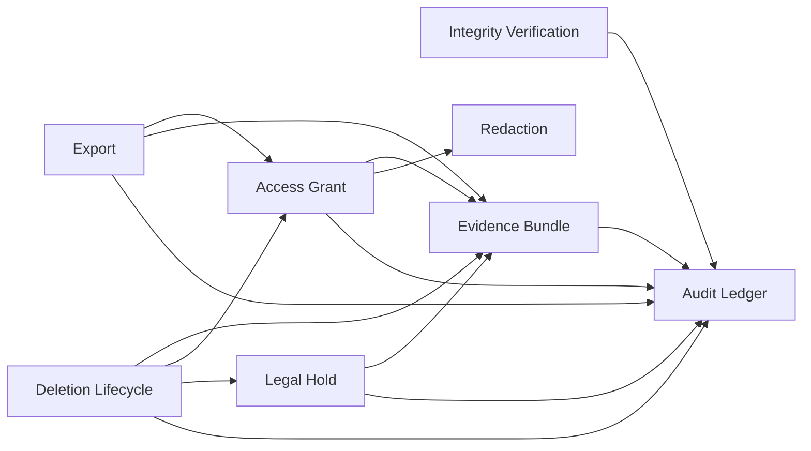
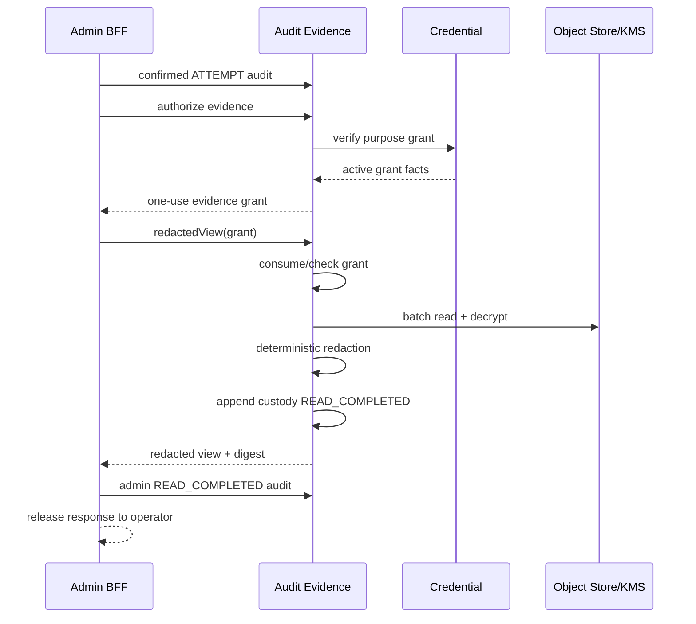

# TextFlow `audit-evidence-service` Implementation Guide

> **For agentic workers:** Implement this document task-by-task using test-driven development. Do not mark the service complete until the exact Git, archive, runtime, contract, integrity, and operational gates in this document have passed.

**Document version:** 1.0
**Prepared for baseline:** `textflow-platform master@v1.18.0`
**Target release:** `v1.19.0`
**Service:** `audit-evidence-service`
**Runtime:** Spring Boot `4.1.0`, Java `21`
**Architecture:** strict application-component-first hexagonal architecture
**Criticality:** highest-trust control plane
**Implementation state described by this document:** implementation-ready specification; not a claim that runtime code is complete

**Goal:** Build the authoritative service for tamper-evident privileged audit, protected evidence custody, purpose-bound evidence access, legal holds, and controlled exports.

**Architecture:** PostgreSQL owns transactional metadata, append positions, grants, holds, export jobs, idempotency, and outbox state. Evidence objects, export objects, and signed audit segments are encrypted and stored in an object store with object-lock support. KMS/HSM-backed keys are accessed only through intent-named outbound ports. Normal online reads and writes use Spring MVC with virtual threads; long-running sealing, integrity verification, retention, and export work use bounded lease-based workers.

**Tech stack:** Java 21, Spring Boot 4.1.0, Spring MVC, Spring Security Resource Server, Spring Data JPA for bounded control aggregates, Spring JDBC for append/batch/partitioned paths, PostgreSQL, Flyway, Redis for workload-token replay and short-lived grant cache only, Kafka transactional outbox, object storage with object lock, KMS/HSM, Micrometer, OpenTelemetry, Testcontainers, ArchUnit.

**Normative inputs:**

- `backend/services/admin-bff-service` audit, evidence, and export consumers;
- `backend/services/moderation-service` case, audit, label, appeal, and evidence-summary contracts;
- `backend/services/anonymity-service` protected-link audit confirmation flow;
- `backend/services/messaging-service` evidence-selection flow;
- `backend/services/media-service` evidence asset retention and purge flow;
- `backend/services/identity-service` `AUDIT_EVIDENCE` deletion barrier;
- prior service design assets in `textflow_enterprise_blueprint_v3_3_service_validation`.

## Global constraints

- Use Spring Boot exactly `4.1.0` and Java exactly `21` for this release line.
- Work on `master`; do not create a feature branch unless the user explicitly changes the repository policy.
- Use UUID value types for all public and cross-service identifiers. Generate authoritative IDs server-side, preferably UUIDv7.
- Use strict hexagonal dependency direction. Domain and application code must compile without Spring, JPA, Jackson, Kafka, Redis, HTTP clients, or object-storage SDKs.
- Use DTOs at every transport boundary. Do not expose JPA entities, generated transport types, object-store keys, encrypted key material, or protected identity links.
- Disable OSIV. Flyway owns schema changes. `ddl-auto=validate` is mandatory.
- Add soft deletion only where a queryable lifecycle tombstone is a business requirement. Legal hold, supersession, retention, cryptographic erasure, and hard deletion are separate concepts.
- Every external operation has an explicit timeout, bounded retry policy, idempotency policy, and failure mode.
- No N+1 SQL, object-store calls, KMS calls, Redis calls, HTTP calls, or Kafka writes. One-item and maximum-cardinality tests must assert the same fixed call budget.
- Sensitive reads, protected-link plaintext release, evidence export release, and irreversible deletion fail closed when authoritative audit or hold evaluation cannot be confirmed.
- Never persist or log raw DM bodies, access tokens, refresh tokens, passwords, identity evidence bytes, private keys, object-storage credentials, or protected alias mappings in audit metadata.

---

# Part I. Architectural decision

## 1. Why this service must remain separate

`audit-evidence-service` is not a logging subsystem and not a moderation submodule. It holds the evidence necessary to prove that privileged access and destructive actions were authorized, constrained, and reviewable. Combining it with Admin BFF, Moderation, Identity, Messaging, or Media would let the service requesting access also rewrite or erase the proof of that access.

The service therefore remains an independent deployment and data-ownership boundary with:

- a dedicated PostgreSQL database and database role;
- dedicated object-storage buckets or prefixes with object lock;
- dedicated KMS keys for audit signing, evidence encryption, export encryption, and token HMAC;
- a separate workload identity and NetworkPolicy;
- a separate on-call and break-glass runbook;
- no ordinary user-facing API;
- no dependence on a UI process for durability.

## 2. Current platform gap that this service closes

At `v1.18.0`, nineteen runtime modules exist, but several consumers already call an authority that does not yet exist. The first release must make these existing contracts real rather than create unrelated APIs.

| Existing consumer | Required operation | Current path or event |
| --- | --- | --- |
| Admin BFF | append privileged audit | `POST /internal/v1/admin-audit-records` |
| Admin BFF | authorize evidence view | `POST /internal/v1/evidence/{evidenceId}:authorize` |
| Admin BFF | return redacted view | `POST /internal/v1/evidence/{evidenceId}:redactedView` |
| Admin BFF | start case export | `POST /internal/v1/cases/{caseId}/exports` |
| Admin BFF | read export status | `GET /internal/v1/cases/{caseId}/exports/{exportId}` |
| Anonymity | confirm protected-link access | `POST /internal/v1/audit/protected-link-access:confirm` |
| Moderation | load case evidence summaries | `POST /internal/v1/cases/{caseId}/evidence-summaries:batch-get` |
| Moderation | record authoritative moderation audit | `POST /internal/v1/moderation-audit-records` |
| Messaging | authorize message evidence selection | `POST /internal/v1/evidence-selections:authorize` |
| Media | receive evidence-bundle destruction/retention facts | Kafka events and a new bounded retention batch contract |
| Identity | receive deletion acknowledgement | `audit-evidence.account.deletion-acknowledged.v1` |

The implementation is not accepted until consumer-driven contract tests prove these exact paths and payloads.

## 3. Ownership and non-goals

### This service owns

- append-only privileged audit records and chain positions;
- cryptographic record hashes, signed checkpoints, immutable audit segments, and continuous integrity verification;
- evidence bundle manifests and evidence item custody metadata;
- purpose-, case-, operation-, field-, time-, and principal-bound access grants;
- redaction profiles and redacted evidence rendering;
- legal hold lifecycle and retention overrides;
- evidence export jobs, encrypted export objects, and short-lived single-use download grants;
- custody events for evidence creation, access, transformation, export, hold, and destruction;
- account-deletion handling for audit/evidence data;
- authoritative receipts for protected-link plaintext release and sensitive evidence reads.

### This service does not own

- authentication or refresh-token rotation;
- administrator purpose-grant issuance;
- moderation adjudication or label policy;
- message, conversation, post, media, alias, or identity source-of-truth mutation;
- general application logs, analytics, or observability retention;
- arbitrary file upload for ordinary users;
- feed ranking or recommendation data.

## 4. Chosen implementation approach

### Recommended: PostgreSQL append authority plus independently signed object-store checkpoints

The recommended architecture uses two complementary layers:

1. **Online append authority:** an append-only PostgreSQL ledger assigns a stream position and record hash in the same transaction as the receipt and outbox row. Application roles cannot update or delete audit records.
2. **Independent tamper evidence:** a worker seals contiguous record ranges into immutable object-store segments, computes a Merkle root, links the previous segment root, and signs a checkpoint with a KMS/HSM asymmetric key.

This approach gives low-latency synchronous confirmation without performing one object-store write per audit record, while independent signed segments make silent database tampering detectable.

### Rejected: ordinary application log as the audit ledger

Rejected because application logs can be dropped, sampled, reordered, redacted inconsistently, or deleted by the same operational team that initiated an action. They lack domain idempotency, chain-of-custody state, purpose scope, and legal-hold semantics.

### Rejected for the first release: external managed ledger as the primary authority

A dedicated managed ledger can be reconsidered after load and compliance requirements justify it. Introducing one now would add a new operational dependency, migration path, consistency model, and cost profile before the existing provider contracts are executable.

---

# Part II. Component architecture

## 5. Application components



| Component | State owner | Main responsibility | Key provided ports |
| --- | --- | --- | --- |
| `auditledger` | `AuditStreamHead`, immutable records | assign position, hash, receipt, query safe metadata | `AppendAuditRecord`, `AppendAuditBatch`, `VerifyAuditRange`, `QueryAuditPage` |
| `integrity` | segment/checkpoint state | seal segments, sign roots, verify chain, raise incidents | `SealAuditSegment`, `VerifyLedgerIntegrity`, `RepairCheckpointMetadata` |
| `evidencebundle` | `EvidenceBundle` | create, add items, seal, supersede, destroy | `CreateEvidenceBundle`, `FinalizeEvidenceSelection`, `SealEvidenceBundle`, `DestroyEvidenceBundle` |
| `accessgrant` | `EvidenceAccessGrant` | purpose-bound authorization, replay/use limits, revocation | `AuthorizeEvidenceAccess`, `ValidateEvidenceGrant`, `RevokeEvidenceGrant` |
| `redaction` | immutable profile versions | render bounded redacted views | `RenderRedactedEvidence`, `PublishRedactionProfile` |
| `legalhold` | `LegalHold` | apply/release hold, block destruction, coordinate external assets | `CreateLegalHold`, `ReleaseLegalHold`, `CheckLegalHold` |
| `export` | `EvidenceExportJob`, delivery grant | asynchronous immutable export and one-time download | `StartEvidenceExport`, `GetEvidenceExportStatus`, `ConsumeDownloadGrant` |
| `lifecycle` | deletion process state | account deletion, retention, purge, crypto-erasure | `HandleAccountDeletion`, `ExpireGrants`, `ExpireExports`, `PurgeEligibleBundles` |

## 6. Strict package layout

```text
backend/services/audit-evidence-service/
  build.gradle.kts
  Dockerfile
  README.md
  openapi/audit-evidence-openapi.yaml
  contracts/event-contracts.yml
  contracts/downstream-contracts.yml
  query-budgets.yml
  src/main/java/com/textflow/auditevidence/
    auditledger/
      domain/
      application/provided/
      application/required/
      application/service/
      adapter/in/web/
      adapter/in/event/
      adapter/out/persistence/
      adapter/out/objectstore/
      adapter/out/kms/
    integrity/
    evidencebundle/
    accessgrant/
    redaction/
    legalhold/
    export/
    lifecycle/
    shared/
      application/
      domain/
      adapter/in/security/
      adapter/out/outbox/
      configuration/
      error/
  src/main/resources/
    application.yml
    db/migration/
  src/test/java/com/textflow/auditevidence/
  scripts/
```

Rules enforced by ArchUnit and source validators:

- `domain` imports only JDK types and explicitly approved persistence-neutral annotations; the safer default for this service is no JPA annotation in domain.
- `application` does not import Spring, adapter classes, HTTP types, Kafka types, Redis types, object-store SDKs, KMS SDKs, or generated clients.
- inbound adapters call provided ports only;
- outbound adapters implement required ports only;
- controllers never call repositories;
- one component never imports another component's aggregate or repository;
- required-port names describe intent, never technology (`StoreSealedEvidenceObject`, not `S3ClientPort`).

---

# Part III. Domain design

## 7. Core identifiers and value objects

Use typed UUID records:

```java
public record EvidenceBundleId(UUID value) {
    public EvidenceBundleId {
        Objects.requireNonNull(value, "value");
    }
}

public record AuditRecordId(UUID value) { /* same validation */ }
public record AuditStreamId(UUID value) { /* same validation */ }
public record EvidenceItemId(UUID value) { /* same validation */ }
public record EvidenceAccessGrantId(UUID value) { /* same validation */ }
public record LegalHoldId(UUID value) { /* same validation */ }
public record EvidenceExportId(UUID value) { /* same validation */ }
```

Important non-ID value objects:

- `PurposeCode`
- `OperationCode`
- `AuditPhase`
- `AuditOutcome`
- `AuditSensitivity`
- `ContentDigest`
- `RecordHash`
- `SegmentRoot`
- `RedactionProfileKey`
- `RetentionClass`
- `EvidenceSourceRef`
- `GrantOperation`
- `ApprovalRef`
- `ObjectPointerEnvelope`
- `ActorRef`

## 8. Audit record

An audit record is immutable after append.

```java
public record AuditRecordDraft(
        AuditRecordId recordId,
        AuditStreamKey streamKey,
        ActorRef actor,
        Optional<CaseId> caseId,
        PurposeCode purpose,
        PurposeGrantRef purposeGrant,
        UUID auditCorrelationId,
        String requestId,
        String traceId,
        OperationCode operation,
        AuditPhase phase,
        AuditOutcome outcome,
        AuditSensitivity sensitivity,
        ContentDigest justificationDigest,
        ContentDigest detailsDigest,
        Instant occurredAt) {}
```

Required invariants:

- `occurredAt` cannot be more than 30 seconds in the future or older than the caller-specific accepted window;
- operation, phase, outcome, sensitivity, purpose, and actor type must form an allowed combination;
- a sensitive evidence `READ_COMPLETED` record requires an access-grant reference and evidence digest;
- a protected-link release record requires case ID, correlation ID, purpose, and alias-count metadata but never plaintext identity mapping;
- record IDs are unique;
- `(caller, auditCorrelationId, operation, phase, outcome)` is idempotent;
- reusing that idempotency identity with a different canonical digest is a conflict.

## 9. Evidence bundle

`EvidenceBundle` is the case-scoped chain-of-custody aggregate.

```text
OPEN
→ SEALED
→ SUPERSEDED
→ DESTROY_PENDING
→ DESTROYED

OPEN
→ ABANDONED
```

Rules:

- one case may have multiple sealed versions but only one `OPEN` bundle for a given bundle purpose;
- maximum items per bundle: `500`;
- items are ordered and receive immutable `itemOrder` values;
- every item has a verified content digest and source version before sealing;
- an item never stores a raw source body in PostgreSQL;
- after `SEALED`, items and manifest fields cannot be changed;
- corrections create a new bundle with `supersedesBundleId`;
- destruction is forbidden while any active or pending legal hold covers the bundle or an item;
- `DESTROYED` keeps only the minimum tombstone and cryptographic custody proof.

Evidence source types for `v1.19.0`:

```text
MESSAGE_SELECTION
CONTENT_REVISION
MEDIA_ASSET
MODERATION_SNAPSHOT
PROTECTED_LINK_ACCESS_METADATA
```

## 10. Evidence access grant

Grant operations:

```text
VIEW_REDACTED
VIEW_METADATA
VIEW_MESSAGE_CONTEXT
VIEW_CONTENT_REVISION
EXPORT
PROTECTED_LINK_CONFIRMATION
LEGAL_HOLD_ADMINISTRATION
```

Grant state:

```text
ACTIVE
→ CONSUMED
→ EXPIRED
→ REVOKED
```

Rules:

- grant is bound to exactly one principal, admin session, purpose-grant ID/version, case, evidence bundle, operation set, redaction profile version, allowed field set, and expiry;
- default evidence-view grant TTL: `PT2M`;
- default view grant use count: `1`;
- export authorization uses a separate grant and does not reuse a view grant;
- a grant cannot outlive the underlying purpose grant;
- purpose-grant revocation, session revocation, security-epoch change, case closure policy, or legal restriction revokes the grant;
- the requested fields are intersected with the redaction profile and purpose grant; they are never blindly copied from the client;
- failed authorization attempts are audited.

## 11. Legal hold

Scope types:

```text
CASE
EVIDENCE_BUNDLE
EVIDENCE_ITEM
MEDIA_ASSET
EXPORT
ACCOUNT
```

Lifecycle:

```text
PENDING_APPLY
→ ACTIVE
→ RELEASE_PENDING
→ RELEASED

PENDING_APPLY | RELEASE_PENDING
→ FAILED
```

Rules:

- `PENDING_APPLY` blocks destruction immediately;
- legal hold never grants read access;
- creation and release require a legal/compliance purpose and two distinct approvers;
- release reason is mandatory and audited;
- external media assets are considered held only after Media acknowledgement, but local destruction remains blocked while acknowledgement is pending;
- the service must not acknowledge account deletion if held data still contains a directly linkable identity that has not been tokenized according to policy.

## 12. Export job

```text
REQUESTED
→ BUILDING
→ READY
→ EXPIRED

REQUESTED | BUILDING
→ FAILED
→ CANCELLED
```

Rules:

- default maximum rows: `10,000`, matching Admin BFF production configuration;
- accepted formats: `JSONL`, `CSV`, `PDF`;
- maximum sections: `20`;
- the job stores an immutable scope snapshot at request time;
- the export is encrypted with a per-export data key;
- the object is immutable after completion;
- default object TTL: `PT24H`;
- download grant TTL: `PT5M`;
- download grant is single-use and stored as a digest, not plaintext;
- READY status returns an HTTPS service-mediated URL, not an object-store key;
- download attempt and completion are both audited;
- export generation failure never alters sealed evidence.

---

# Part IV. Tamper-evident ledger

## 13. Stream partitioning

Use `32` logical chain partitions by default.

```text
streamType + ':' + yyyyMM + ':' + hash(subjectScope) mod 32
```

Stream types:

```text
ADMIN_PRIVILEGED
PROTECTED_LINK_ACCESS
MODERATION_DECISION
EVIDENCE_CUSTODY
LEGAL_HOLD
EXPORT
SECURITY_EVENT
```

A chain is ordered only within its stream. Global ordering is not claimed.

## 14. Canonical encoding

Do not hash ordinary JSON serialization. Implement `CanonicalAuditCodecV1` with a fixed binary format:

```text
magic:          UTF-8 "TF-AUDIT-V1"
recordId:       16 raw UUID bytes
streamId:       16 raw UUID bytes
actorType:      unsigned varint + UTF-8 bytes
actorRef:       length-prefixed bytes
casePresent:    0/1
caseId:         16 bytes when present
purpose:        length-prefixed UTF-8
purposeGrantId: 16 bytes
purposeVersion: signed 64-bit big-endian
correlationId:  16 bytes
requestId:      length-prefixed UTF-8
traceId:        length-prefixed UTF-8
operation:      length-prefixed UTF-8
phase:          length-prefixed UTF-8
outcome:        length-prefixed UTF-8
sensitivity:    length-prefixed UTF-8
justification:  32-byte SHA-256 digest
details:        32-byte SHA-256 digest
occurredAt:     epoch seconds + nanoseconds
```

The codec is versioned. Any future field addition requires `V2`; never reinterpret `V1` bytes.

## 15. Record hash

```text
payloadDigest = SHA-256(canonicalRecordBytes)

recordHash = SHA-256(
    "TF-AUDIT-RECORD-V1" ||
    streamId ||
    position ||
    previousRecordHash ||
    payloadDigest
)
```

The append receipt contains:

```text
recordId
streamId
position
previousRecordHash
recordHash
committedAt
ledgerVersion
```

## 16. Atomic append algorithm

Implement a PostgreSQL function or a single JDBC transaction with a row lock on `audit_stream_heads`.

```sql
begin;

select next_position, head_hash
from audit_stream_heads
where stream_id = :stream_id
for update;

-- verify idempotency identity and canonical digest
-- compute next position and record hash
-- insert immutable audit record
-- update stream head using expected old position/hash
-- insert outbox row

commit;
```

The application database role receives:

```text
SELECT, INSERT on audit_records
SELECT, UPDATE on audit_stream_heads
SELECT, INSERT, UPDATE on outbox and worker tables
NO UPDATE or DELETE on audit_records
```

Add a database trigger that raises an exception on `UPDATE` or `DELETE` of `audit_records`, including by elevated application roles. Schema-owner break-glass changes require an incident, dual authorization, and a separate external audit trail.

## 17. Segment sealing and checkpoints

A bounded worker claims a contiguous range of unsealed records:

```text
maximum records per segment: 10,000
maximum canonical bytes:      64 MiB
maximum segment age:          60 seconds
```

It creates a manifest containing:

- stream ID;
- start and end positions;
- first previous hash and final record hash;
- ordered record hashes;
- Merkle root;
- previous segment root;
- record count;
- canonical codec version;
- created/sealed times;
- KMS signing key ID/version.

The worker then:

1. writes the canonical segment to staging object storage;
2. reads back and verifies digest;
3. signs the segment-manifest digest with an asymmetric KMS key;
4. writes the sealed object with object lock;
5. inserts `audit_segments` and `audit_segment_signatures` metadata;
6. marks the range sealed in a separate range table; it never updates audit-record payloads;
7. publishes `audit.segment.sealed.v1`.

## 18. Continuous integrity verification

Run three verification classes:

- **head verifier:** every minute, verifies recent chain positions against stream heads;
- **segment verifier:** verifies signed segment objects and object-store retention metadata;
- **deep verifier:** daily, samples old partitions and periodically performs full-range verification.

On failure:

```text
record audit.integrity-failure.detected.v1
set affected stream to READ_ONLY
block sensitive reads and destructive operations that rely on the stream
page Security/SRE/Privacy on-call
preserve all objects and database state
```

Never auto-repair a hash mismatch. Repair tooling may rebuild derived segment metadata only after the root cause is understood and an incident commander authorizes it.

---

# Part V. Evidence custody

## 19. Object encryption

Each evidence item and export uses envelope encryption:

```text
random 256-bit data key
AES-256-GCM
96-bit random nonce
KMS-wrapped data key
```

Associated authenticated data includes:

```text
bundleId
itemId
caseId
sourceType
sourceId
sourceVersion
contentDigest
objectFormatVersion
```

PostgreSQL stores only:

- opaque object pointer envelope;
- ciphertext digest;
- wrapped key;
- KMS key ID/version;
- nonce;
- algorithm/version;
- size and media type;
- object-lock/retention metadata.

Object keys and signed URLs never appear in Kafka events, logs, traces, Problem Details, or Admin BFF DTOs.

## 20. Message evidence integration

The existing Messaging consumer contract already calls:

```http
POST /internal/v1/evidence-selections:authorize
```

Implement the workflow as follows:

1. Messaging sends `caseId`, `messageId`, requested context radius, evidence reason, request ID, and idempotency key.
2. Audit Evidence validates case existence/projection, purpose, active report/case relation, requested radius, and no conflicting hold/destruction state.
3. It returns a `selectionGrantId`, target `bundleId`, `maximumMessages`, `expiresAt`, and constrained evidence-upload grant.
4. Messaging loads the bounded message window, encrypts or streams it through the constrained upload path, and finalizes the selection.
5. Audit Evidence verifies object digest and metadata and appends an `EvidenceBundleItem`.
6. Messaging emits `messaging.message.reported.v1` containing IDs, digest, source version, and opaque evidence pointer only; no message body.

Add provider endpoints:

```text
POST /internal/v1/evidence-selections:authorize
POST /internal/v1/evidence-selections/{selectionGrantId}:finalize
POST /internal/v1/evidence-selections/{selectionGrantId}:abort
```

Maximum message context for the first release: target plus two preceding and two following messages, subject to conversation boundary and policy.

## 21. Media evidence integration

Add a Media internal batch operation authorized only for `audit-evidence-service`:

```http
POST /internal/v1/media/evidence-assets:batch-materialize
```

Request maximum: `100` assets. Response contains an opaque, short-lived internal read grant, asset digest, media type, size, retention version, and key version. It does not expose object keys.

Audit Evidence copies the authorized bytes into its evidence bucket, verifies the digest, and records independent custody. It then applies evidence retention through:

```http
POST /internal/v1/media/retention:batch-apply
```

The batch supports up to `500` assets. Media emits an acknowledgement event for hold application and release.

## 22. Content revision integration

Add a Content bounded evidence-material endpoint:

```http
POST /internal/v1/content/evidence-material:batch-get
```

Maximum: `200`. It returns canonical revision metadata and redacted/source-safe material needed to create an evidence object. It must not return viewer-specific visibility or protected identity mapping.

## 23. Bundle sealing

Sealing requires:

- at least one item;
- every item finalized;
- every item content digest verified;
- no duplicate source tuple `(sourceType, sourceId, sourceVersion)`;
- manifest canonicalization;
- no pending object upload;
- active retention policy;
- no contradictory destruction request.

```text
manifestDigest = SHA-256(CanonicalEvidenceManifestV1)
```

The sealed manifest itself is encrypted and object-locked. PostgreSQL stores the manifest digest, item count, size, and object pointer envelope.

---

# Part VI. Purpose-bound access and redaction

## 24. Authorization equation

Evidence access is allowed only when all predicates are true:

```text
valid admin workload caller
AND admin ID/session headers present
AND recent session verification already performed by Admin BFF
AND purpose grant exists, is active, version matches, and covers the case
AND requested operation is permitted by the purpose
AND evidence belongs to the case
AND requested fields are within redaction policy
AND bundle is sealed and not destroyed
AND no integrity failure affects the bundle
AND grant TTL and use limits are valid
AND an ATTEMPT audit record has been authoritatively confirmed
```

For high-sensitivity paths, reverify the purpose grant with `credential-service` instead of trusting headers alone.

## 25. Redaction profiles

Initial immutable profiles:

| Profile | Allowed output |
| --- | --- |
| `METADATA_ONLY_V1` | type, timestamps, digests, state, safe labels |
| `REDACTED_TEXT_V1` | redacted text segments and safe metadata |
| `MESSAGE_CONTEXT_V1` | bounded conversation sequence with participant aliases only |
| `CONTENT_REVISION_V1` | revision text with identity/secret fields removed |
| `PROTECTED_LINK_AUDIT_V1` | alias IDs, purpose, phase, outcome; never plaintext member mapping |
| `BREAK_GLASS_UNREDACTED_V1` | disabled by default; dual approval and special endpoint only |

Do not use arbitrary user-authored expressions for the first release. Implement profiles as versioned allowlist/transform definitions with deterministic tests.

## 26. Sensitive-read sequence



If any authoritative append fails, the plaintext/redacted view is not returned.

---

# Part VII. API contracts

## 27. Internal provider endpoints required by existing consumers

### Append Admin BFF audit

```http
POST /internal/v1/admin-audit-records
```

Request fields must match the current `AuditHttpSender`:

```json
{
  "recordId": "uuid",
  "adminId": "uuid",
  "caseId": "uuid-or-null",
  "purposeCode": "SAFETY_INVESTIGATION",
  "purposeGrantId": "uuid",
  "purposeGrantVersion": 3,
  "operationCode": "VIEW_EVIDENCE",
  "phase": "ATTEMPT",
  "outcome": "REQUESTED",
  "sensitivity": "SENSITIVE_EVIDENCE",
  "justificationDigest": "sha256-hex",
  "detailsDigest": "sha256-hex",
  "occurredAt": "2026-08-22T12:00:00Z"
}
```

Response:

```json
{
  "receiptId": "streamId:position:recordHash",
  "recordedAt": "2026-08-22T12:00:00.123Z"
}
```

### Confirm protected-link access

```http
POST /internal/v1/audit/protected-link-access:confirm
```

Maintain the current fields and extend the contract to include approval references when present:

```json
{
  "auditCorrelationId": "uuid",
  "caseId": "uuid",
  "caller": "admin-bff-service",
  "purpose": "SAFETY_INVESTIGATION",
  "phase": "BEFORE_RELEASE",
  "aliasIds": ["uuid"],
  "occurredAt": "2026-08-22T12:00:00Z",
  "outcome": "AUTHORIZED",
  "primaryApprovalRef": "uuid-or-null",
  "secondaryApprovalRef": "uuid-or-null"
}
```

Response:

```json
{
  "auditCorrelationId": "uuid",
  "confirmed": true,
  "receiptId": "streamId:position:recordHash"
}
```

### Authorize evidence

```http
POST /internal/v1/evidence/{evidenceId}:authorize
```

Request body, combined with Admin BFF headers:

```json
{
  "caseId": "uuid",
  "viewKind": "MESSAGE_CONTEXT",
  "requestedFields": ["messages", "timestamps", "aliases"]
}
```

Response shape must match `EvidenceHttpAdapter.AuthorizationResponse`.

### Render redacted evidence

```http
POST /internal/v1/evidence/{evidenceId}:redactedView
```

Request and response must match the Admin BFF `EvidenceViewRequest` and `EvidenceViewResponse`. Maximum returned segments: `500`. Maximum value length per segment: `10,000` characters. Maximum uncompressed response: `5 MiB`.

### Case export

```text
POST /internal/v1/cases/{caseId}/exports
GET  /internal/v1/cases/{caseId}/exports/{exportId}
```

The status response must match `AdminExportHttpAdapter.ExportResponse`.

### Moderation evidence summaries

```http
POST /internal/v1/cases/{caseId}/evidence-summaries:batch-get
```

Maximum IDs: `500`. Response contains metadata and custody state only; no evidence body, object pointer, encryption metadata, or protected identity.

### Moderation audit

```http
POST /internal/v1/moderation-audit-records
```

Use the same ledger append core but a caller-specific DTO and scope. A moderation decision or enforcement cannot be reported as applied until authoritative audit returns a receipt.

## 28. Administrative control endpoints

Add Admin BFF-mediated endpoints for operations not currently surfaced:

```text
POST /internal/v1/cases/{caseId}/legal-holds
POST /internal/v1/cases/{caseId}/legal-holds/{holdId}:release
GET  /internal/v1/cases/{caseId}/audit-records
POST /internal/v1/evidence-bundles/{bundleId}:seal
POST /internal/v1/evidence-bundles/{bundleId}:supersede
POST /internal/v1/evidence-bundles/{bundleId}:destroy
```

Every write requires `Idempotency-Key`, audit correlation, purpose grant, and expected version where state can change concurrently.

## 29. Error catalog

| Code | HTTP | Meaning |
| --- | ---: | --- |
| `AUDIT.APPEND_FAILED` | 503 | durable append could not be confirmed |
| `AUDIT.IDEMPOTENCY_CONFLICT` | 409 | same idempotency identity, different digest |
| `AUDIT.INTEGRITY_FAILURE` | 503 | chain/segment integrity is not trustworthy |
| `AUDIT.BATCH_LIMIT_EXCEEDED` | 422 | request exceeds declared maximum |
| `EVIDENCE.NOT_FOUND` | 404/opaque 404 | evidence unavailable or unsafe to disclose |
| `EVIDENCE.BUNDLE_INVALID_STATE` | 409 | lifecycle rejects operation |
| `EVIDENCE.BUNDLE_NOT_SEALED` | 409 | read/export requires sealed bundle |
| `EVIDENCE.ACCESS_GRANT_REQUIRED` | 403 | no valid grant |
| `EVIDENCE.ACCESS_GRANT_EXPIRED` | 403 | grant expired |
| `EVIDENCE.ACCESS_GRANT_REPLAYED` | 409 | one-use grant already consumed |
| `EVIDENCE.ACCESS_GRANT_SCOPE_VIOLATION` | 403 | requested scope exceeds grant |
| `EVIDENCE.REDACTION_FAILED` | 503 | safe redaction could not be completed |
| `EVIDENCE.LEGAL_HOLD_ACTIVE` | 409 | destruction prohibited |
| `EVIDENCE.EXPORT_SCOPE_INVALID` | 422 | export exceeds authorized scope |
| `EVIDENCE.EXPORT_NOT_READY` | 409 | job is not ready |
| `EVIDENCE.DOWNLOAD_GRANT_INVALID` | 403 | download token invalid/expired/consumed |
| `EVIDENCE.OBJECT_STORE_UNAVAILABLE` | 503 | protected store unavailable |
| `EVIDENCE.KMS_UNAVAILABLE` | 503 | key operation unavailable |

All errors use RFC 9457 Problem Details and omit sensitive existence details for unauthorized callers.

---

# Part VIII. Events

## 30. Published events

```text
audit.record.appended.v1
audit.segment.sealed.v1
audit.integrity-failure.detected.v1
audit.evidence.bundle-opened.v1
audit.evidence.item-added.v1
audit.evidence.bundle-sealed.v1
audit.evidence.bundle-superseded.v1
audit.evidence.bundle-destroyed.v1
audit.evidence.access-granted.v1
audit.evidence.access-revoked.v1
audit.legal-hold.changed.v1
audit.export.requested.v1
audit.export.completed.v1
audit.export.expired.v1
audit-evidence.account.deletion-acknowledged.v1
```

Prohibited event fields:

```text
messageBody
dmBody
postBody
identityEvidence
realName
email
refreshToken
accessToken
privateKey
wrappedDataKey
objectKey
signedUrl
protectedAliasMapping
```

## 31. Consumed events

At minimum:

```text
identity.account.deletion-requested.v1
identity.session.revoked.v1
identity.account.security-epoch-changed.v1
identity.refresh-reuse.detected.v1
credential.admin-purpose-grant.revoked.v1
moderation.report.submitted.v1
moderation.case.opened.v1
moderation.case.decided.v1
moderation.appeal.submitted.v1
moderation.appeal.decided.v1
moderation.subject.label-changed.v1
moderation.audit.requested.v1
messaging.message.reported.v1
media.asset.ready.v1
media.asset.purged.v1
media.delivery-grant.issued.v1
ranking.model.validated.v1
ranking.model.activated.v1
ranking.model.rolled-back.v1
ranking.calibration.published.v1
ranking.canary.changed.v1
ranking.shadow.changed.v1
retrieval.index-generation.activated.v1
experiment.policy-bundle.activated.v1
experiment.kill-switch.changed.v1
```

Consumer rules:

- record `eventId`, payload digest, source version, and processed time in the same transaction as the local effect;
- duplicate ID + same digest is a no-op;
- duplicate ID + different digest is a contract incident;
- lower source version cannot overwrite a higher version;
- event handlers never make unbounded per-event downstream calls.

---

# Part IX. Persistence and migrations

## 32. Proposed PostgreSQL schema

### Audit ledger tables

```text
audit_stream_heads
audit_records                     -- monthly range partitioned
audit_record_idempotency
audit_segments
audit_segment_ranges
audit_segment_signatures
audit_integrity_runs
```

### Evidence tables

```text
evidence_bundles
evidence_bundle_items
evidence_selection_grants
evidence_access_grants
evidence_access_approvals
redaction_profiles
legal_holds
legal_hold_targets
evidence_export_jobs
evidence_export_delivery_grants
```

### Reliability/lifecycle tables

```text
audit_evidence_processed_events
audit_evidence_outbox
audit_evidence_account_deletions
audit_evidence_worker_failures
```

## 33. Migration order

```text
V001__create_audit_streams_and_append_function.sql
V002__create_partitioned_audit_records.sql
V003__create_audit_segments_and_integrity_runs.sql
V004__create_evidence_bundles.sql
V005__create_evidence_selection_grants.sql
V006__create_evidence_access_grants_and_approvals.sql
V007__create_redaction_profiles.sql
V008__create_legal_holds.sql
V009__create_evidence_export_jobs.sql
V010__create_processed_events_outbox_and_deletion.sql
V011__create_database_roles_and_immutability_guards.sql
V012__seed_redaction_profiles.sql
```

## 34. Key indexes and constraints

- unique `(stream_id, position)`;
- unique `record_id`;
- unique append idempotency tuple;
- monthly partition on `audit_records.occurred_at`;
- unique partial index for one OPEN bundle per `(case_id, bundle_purpose)`;
- unique `(bundle_id, item_order)` and `(bundle_id, source_type, source_id, source_version)`;
- unique active grant idempotency key/digest;
- index on `(principal_id, state, expires_at)`;
- index on legal-hold `(scope_type, scope_id, state)`;
- export worker index `(state, next_attempt_at, lease_until)`;
- outbox worker index `(state, next_attempt_at, lease_until)`;
- processed-event primary key on `event_id`.

## 35. JPA/JDBC boundary

### JPA

Use JPA for bounded aggregates:

- `EvidenceBundle` plus at most 500 ordered items;
- `EvidenceAccessGrant` plus bounded approvals;
- `RedactionProfile`;
- `LegalHold` plus bounded targets;
- `EvidenceExportJob`.

### JDBC

Use JDBC for:

- audit append and stream-head locking;
- partitioned audit queries;
- segment claims and verification ranges;
- evidence-summary batch projections;
- grant expiration batch;
- export-worker claims;
- processed-event idempotency;
- outbox claim/publish state;
- account deletion and retention batch operations.

---

# Part X. Transactions, concurrency, and idempotency

## 36. Transaction rules

- Never hold a database transaction open while calling KMS, object storage, Credential, Media, Messaging, Content, or Moderation.
- For external object finalization: stage object, verify outside transaction, then commit metadata and custody record in a short transaction.
- Audit append metadata and outbox commit together.
- Grant creation and its audit record commit together when both are local; if purpose verification is remote, load it before transaction and revalidate grant version in the command.
- Destruction checks legal hold in the same writer transaction that transitions to `DESTROY_PENDING`.
- Export job claims use `FOR UPDATE SKIP LOCKED` and a lease.

## 37. Idempotency keys

| Operation | Idempotency identity |
| --- | --- |
| audit append | caller + correlation + operation + phase + outcome |
| bundle creation | caller + `Idempotency-Key` |
| evidence selection authorize/finalize | selection grant ID + client request ID |
| access grant | admin + case + evidence + operation + `Idempotency-Key` |
| legal hold create/release | case/scope + `Idempotency-Key` |
| export start | case + admin + `Idempotency-Key` |
| event processing | event ID + payload digest |

Reusing the same key with a different canonical request digest returns `409`.

## 38. Concurrency

- audit stream append: row lock on one stream head;
- evidence bundle: optimistic version; one OPEN partial unique constraint;
- item order: allocate under bundle lock or use bounded compare-and-set;
- access grant consumption: atomic `UPDATE ... WHERE uses < max_uses AND state='ACTIVE' AND expires_at > now()`;
- legal hold: optimistic version and two-approval uniqueness;
- export worker and segment worker: lease + `SKIP LOCKED`;
- account deletion: process ID idempotency and resumable step state.

---

# Part XI. Security

## 39. Incoming workload identities

Use caller-specific workload JWT secrets during the current repository phase and enforce service-mesh mTLS in staging/production.

| Caller | Allowed scope |
| --- | --- |
| `admin-bff-service` | `audit.append`, `evidence.authorize`, `evidence.read`, `evidence.export`, `evidence.hold` |
| `anonymity-service` | `audit.protected-link` |
| `moderation-service` | `audit.moderation`, `evidence.summary` |
| `messaging-service` | `evidence.select` |
| `media-service` | `evidence.retention-callback` |
| `credential-service` | `evidence.selection` |
| `identity-service` | no synchronous general read; deletion is event-driven |

Validate:

```text
issuer
subject/caller
audience
scope
iat
nbf
exp (maximum 2 minutes)
jti one-time Redis consumption
```

## 40. Admin context

Only accept `X-Admin-Id`, `X-Admin-Session-Id`, `X-Purpose-Code`, `X-Purpose-Grant-Id`, `X-Purpose-Grant-Version`, `X-Case-Id`, and `X-Audit-Correlation-Id` when the authenticated workload caller is `admin-bff-service`.

The service must not accept an administrator bearer token forwarded by the BFF.

## 41. Key separation

Use separate keys for:

```text
audit checkpoint signing
evidence object wrapping
export object wrapping
access/download token HMAC
workload JWT per caller
actor/member pseudonymization HMAC
```

No key may be reused for two purposes. Key IDs and versions are stored; key material is never stored in PostgreSQL.

## 42. Break glass

Break-glass unredacted access is not enabled on day one. The code path may exist behind a disabled configuration, but activation requires:

- exact purpose `BREAK_GLASS_INVESTIGATION`;
- recent step-up no older than 5 minutes;
- two distinct approvers;
- active incident ID and case ID;
- one-use access grant with TTL at most 5 minutes;
- pre-release and post-read authoritative audit;
- mandatory retrospective review within 24 hours;
- dedicated alert for every use.

---

# Part XII. Query and distributed-call budgets

## 43. Numeric budgets

| Operation | Cardinality | Fixed budget |
| --- | ---: | --- |
| append audit | 1 | 1 stream-head lock/read + 1 record insert + 1 head update + 1 outbox insert |
| append audit batch | 1–100 | one stream-grouped batch; no record-level KMS/object call |
| evidence bundle metadata | 1 bundle / 500 items | 1 bundle SQL + at most 1 ordered-item SQL |
| evidence summaries | 1–500 IDs | 1 projection SQL; no object read |
| authorize evidence | 1 | purpose verify RPC ≤1, grant SQL fixed, audit append fixed |
| redacted view | up to 500 segments/items | 1 manifest read, object-store batch/grouped reads, KMS batch/grouped unwrap, no segment-row RPC |
| protected-link confirmation | 1–100 aliases | 1 append operation; no alias resolution in audit service |
| export build page | up to 500 rows/page | 1 keyset SQL or bounded source batch per page |
| grant expiry | 1–500 | 1 claim SQL + set-oriented update |
| outbox publish | 1–100 | 1 `SKIP LOCKED` claim SQL |
| account deletion | arbitrary owned rows | bounded set operations; no row-by-row external calls |

The query-budget suite must compare 1 item and maximum cardinality. A single unbounded join does not pass merely because SQL count is one; tests also capture returned rows, bytes, and execution time.

---

# Part XIII. NFR, scaling, and operations

## 44. SLOs

| Path | Target |
| --- | --- |
| authoritative audit append availability | 99.99% monthly |
| audit append p95 | ≤ 180 ms |
| audit append p99 | ≤ 300 ms |
| evidence authorization p95 | ≤ 250 ms |
| redacted evidence view p95 | ≤ 600 ms for bounded 5 MiB response |
| protected-link audit confirmation p95 | ≤ 100 ms |
| evidence-summary batch p95 | ≤ 250 ms at 500 IDs |
| export acceptance p95 | ≤ 300 ms; generation asynchronous |
| integrity alert detection | ≤ 5 minutes for recent chain |
| RPO for committed audit records | 0 acknowledged records |
| RTO | 30 minutes for append authority; 4 hours for historical export |

## 45. Scaling sequence

Before sharding:

1. remove N+1 and repeated object/KMS calls;
2. tune append-head partition count and indexes;
3. monthly range partition audit records;
4. archive sealed historical partitions while retaining query catalog;
5. use read replicas only for stale-tolerant historical queries;
6. increase object segment size within recovery limits;
7. separate export workers from online append pods;
8. scale append pods horizontally while maintaining per-stream locking.

Sharding is considered only when measured writer saturation remains after these steps and a cross-shard legal-hold/query design has been proven.

## 46. Metrics

At minimum:

```text
audit_append_total{operation,outcome}
audit_append_latency
audit_append_conflict_total
audit_stream_lock_wait
audit_unsealed_record_count
audit_oldest_unsealed_age
audit_integrity_failure_total
audit_segment_seal_latency
evidence_bundle_state_total
evidence_access_grant_total{outcome}
evidence_sensitive_read_total{profile,outcome}
legal_hold_total{state}
legal_hold_apply_lag
export_job_total{state,format}
export_oldest_pending_age
outbox_oldest_event_age
processed_event_digest_conflict_total
kms_latency{operation}
object_store_latency{operation}
```

## 47. Required alerts

- authoritative append error rate > 0.1% for 5 minutes;
- p99 append > 300 ms for 10 minutes;
- integrity failure > 0;
- oldest unsealed record > 5 minutes;
- legal hold apply failure > 0;
- protected-link confirmation failure rate > 1%;
- evidence redaction failure > 0.5%;
- export queue oldest age > 15 minutes;
- outbox oldest age > 60 seconds;
- KMS/object-store circuit open;
- account deletion blocked without legal-hold explanation > 24 hours.

## 48. Failure behavior

| Failure | Behavior |
| --- | --- |
| PostgreSQL unavailable | no audit confirmation, no sensitive read, no destructive action |
| KMS unavailable | existing metadata query allowed; decrypt, seal, export, destroy fail closed |
| object store unavailable | audit DB append may continue; evidence read/export/seal fail closed |
| Kafka unavailable | outbox accumulates; local authoritative transactions continue within backlog limits |
| Redis unavailable | workload replay-protected internal endpoints fail closed; no general cache fallback |
| Credential unavailable | new sensitive grants fail closed; existing short grant may continue only if policy allows and no revocation uncertainty |
| integrity mismatch | affected stream read-only; sensitive access and destruction blocked |
| redaction engine failure | no evidence body returned |
| export worker failure | job remains retryable/failed; evidence unchanged |

---

# Part XIV. Repository changes

## 49. Files to create

```text
backend/services/audit-evidence-service/build.gradle.kts
backend/services/audit-evidence-service/Dockerfile
backend/services/audit-evidence-service/README.md
backend/services/audit-evidence-service/openapi/audit-evidence-openapi.yaml
backend/services/audit-evidence-service/contracts/downstream-contracts.yml
backend/services/audit-evidence-service/contracts/event-contracts.yml
backend/services/audit-evidence-service/query-budgets.yml
backend/services/audit-evidence-service/src/main/...
backend/services/audit-evidence-service/src/test/...
backend/services/audit-evidence-service/src/main/resources/application.yml
backend/services/audit-evidence-service/src/main/resources/db/migration/V001...V012
backend/services/audit-evidence-service/scripts/validate-audit-evidence-service.py
backend/services/audit-evidence-service/scripts/compile-audit-evidence-core.sh
infra/k8s/audit-evidence-service/deployment.yaml
infra/k8s/audit-evidence-service/service.yaml
infra/k8s/audit-evidence-service/configmap.yaml
infra/k8s/audit-evidence-service/secret.example.yaml
infra/k8s/audit-evidence-service/hpa.yaml
infra/k8s/audit-evidence-service/pdb.yaml
infra/k8s/audit-evidence-service/network-policy.yaml
infra/prometheus/audit-evidence-rules.yaml
docs/runbooks/AUDIT_EVIDENCE_SERVICE_OPERATIONS.md
docs/releases/1.19.0.md
docs/superpowers/plans/2026-08-22-audit-evidence-service-implementation.md
.github/workflows/audit-evidence-service.yml
```

## 50. Existing files to modify

```text
settings.gradle.kts
README.md
CHANGELOG.md
.env.example
infra/compose.yaml
backend/query-budgets.yml
scripts/validate_architecture.py
scripts/validate_contracts.py
scripts/validate_delivery.py
scripts/validate-java-syntax.py
scripts/compile-core.sh
scripts/verify-offline.sh
docs/API_AND_ERROR_CATALOG.md
docs/IMPLEMENTATION_STATUS.md
docs/TECHNICAL_DEBT_REGISTER.md
backend/services/admin-bff-service/contracts/downstream-contracts.yml
backend/services/anonymity-service/contracts/downstream-contracts.yml
backend/services/messaging-service/contracts/downstream-contracts.yml
backend/services/messaging-service/contracts/event-contracts.yml
backend/services/media-service/contracts/downstream-contracts.yml
backend/services/media-service/contracts/event-contracts.yml
backend/services/moderation-service/contracts/downstream-contracts.yml
backend/services/moderation-service/contracts/event-contracts.yml
backend/services/identity-service/contracts/event-contracts.yml
```

## 51. Port normalization

Use the following canonical ports:

```text
application: 8099
management:  9099
```

Normalize existing inconsistent URLs (`8080`, `8096`, `8099`, `8443`) to one platform convention. Recommended application URL under transparent service-mesh mTLS:

```text
http://audit-evidence-service.textflow.svc.cluster.local:8099
```

The mesh, not each application, supplies transport mTLS. If the platform instead mandates application TLS on `8443`, all consumers must change together in one contract migration.

---

# Part XV. TDD implementation plan

## Task 1: Module, baseline, and architecture gates

**Files:**

- Create `backend/services/audit-evidence-service/build.gradle.kts`.
- Create `AuditEvidenceServiceApplication.java`.
- Create `StrictHexagonalArchitectureTest.java`.
- Modify `settings.gradle.kts`.

**RED test:** add an architecture test that fails when domain imports Spring or when inbound adapters import outbound adapters.

```java
@AnalyzeClasses(packages = "com.textflow.auditevidence")
class StrictHexagonalArchitectureTest {
    @ArchTest
    static final ArchRule domain_is_framework_free = noClasses()
            .that().resideInAPackage("..domain..")
            .should().dependOnClassesThat()
            .resideInAnyPackage("org.springframework..", "jakarta.persistence..", "tools.jackson..", "org.apache.kafka..");
}
```

Run and verify RED because the module/classes do not exist. Create the minimal module and package skeleton. Run GREEN.

**Commit:** `build: scaffold audit evidence service boundary`

## Task 2: Audit canonical codec and hash-chain domain

**Files:**

- Create `auditledger/domain/CanonicalAuditCodecV1.java`.
- Create `auditledger/domain/AuditRecordDraft.java`.
- Create `auditledger/domain/AuditRecordHash.java`.
- Create `AuditHashChainTest.java`.

**RED cases:** same record gives same bytes/hash; one-field change changes hash; different previous hash changes record hash; codec V1 preserves nanoseconds; malformed digest is rejected.

Implement only the deterministic core. No Spring or database code.

**Commit:** `feat: implement deterministic audit record hashing`

## Task 3: Atomic audit append persistence

**Files:**

- Create migrations `V001` and `V002`.
- Create `AppendAuditRecord` provided port.
- Create `AppendImmutableAuditRecord` required port.
- Create `JdbcAuditLedgerAdapter`.
- Create `AuditAppendApplicationService`.
- Create `ConcurrentAuditAppendTest` with PostgreSQL Testcontainers.

**RED cases:** 100 concurrent appends produce unique contiguous positions; duplicate idempotency returns same receipt; same key/different digest returns conflict; UPDATE/DELETE is rejected.

**Commit:** `feat: implement atomic tamper-evident audit append`

## Task 4: Admin BFF audit compatibility

**Files:**

- Create `AdminAuditController`.
- Add request/response DTOs matching `AuditHttpSender` exactly.
- Add consumer-driven contract test reading Admin BFF contract assets.

**RED:** existing Admin BFF payload deserializes and receipt matches required fields; caller other than Admin BFF is rejected; missing correlation ID is rejected.

**Commit:** `feat: provide authoritative admin audit endpoint`

## Task 5: Segment sealing and integrity verification

**Files:**

- Create migrations `V003`.
- Create `SealAuditSegment`, `VerifyLedgerIntegrity`.
- Create KMS/object-store required ports and adapters.
- Create lease-based workers.
- Create `AuditSegmentIntegrityTest` and `TamperDetectionTest`.

**RED:** modified record, modified segment, wrong signature, missing previous root, and object digest mismatch all fail verification.

**Commit:** `feat: seal and verify immutable audit segments`

## Task 6: Evidence bundle aggregate

**Files:**

- Create migrations `V004`.
- Create `EvidenceBundle`, `EvidenceBundleItem`, state enums and IDs.
- Create JPA repository adapter and mappers.
- Create bundle lifecycle tests.

**RED:** cannot seal empty bundle; cannot add after seal; duplicate source tuple rejected; supersession preserves predecessor; legal hold blocks destruction.

**Commit:** `feat: implement evidence bundle custody lifecycle`

## Task 7: Messaging evidence selection integration

**Files:**

- Create migration `V005`.
- Create selection authorize/finalize/abort controllers and services.
- Modify Messaging consumer contract and adapter.
- Add bounded upload/object finalization adapter.

**RED:** only reported message/case context can select; context radius capped; final digest must match; grant expiry blocks finalize; no message body appears in events.

**Commit:** `feat: integrate bounded message evidence selection`

## Task 8: Media and Content evidence materialization

**Files:**

- Add Media batch materialize/retention contracts.
- Add Content evidence-material batch contract.
- Add Audit Evidence adapters and contract tests.

**RED:** 1 and maximum batch require one provider call; object keys never cross contract; digest mismatch fails closed; unavailable provider leaves bundle OPEN and retryable.

**Commit:** `feat: ingest media and content evidence with custody checks`

## Task 9: Access grant and redaction

**Files:**

- Create migrations `V006`, `V007`, and `V012`.
- Create `EvidenceAccessGrant` and `RedactionProfile` aggregates.
- Create authorize and redacted-view endpoints.
- Create deterministic redaction engine.

**RED:** request field intersection; purpose mismatch; case mismatch; expiry; one-use replay; profile-version mismatch; denied attempt audited; view not returned if completion audit fails.

**Commit:** `feat: implement purpose-bound redacted evidence access`

## Task 10: Protected-link authoritative confirmation

**Files:**

- Create protected-link confirmation controller.
- Update Anonymity contract to carry approval references.
- Add contract tests.

**RED:** BEFORE_RELEASE and READ_COMPLETED phases require same correlation/case/purpose; alias batch max 100; plaintext mapping never enters audit payload; missing dual approval rejected when policy requires it.

**Commit:** `feat: confirm protected-link access with authoritative audit`

## Task 11: Legal hold

**Files:**

- Create migration `V008`.
- Create `LegalHold` aggregate and process manager.
- Add Media retention batch integration and acknowledgement event.
- Add Admin BFF mediated hold endpoints.

**RED:** pending hold blocks destruction; two distinct approvers; release reason mandatory; external apply failure does not release local block; stale acknowledgement ignored.

**Commit:** `feat: implement legal hold and retention coordination`

## Task 12: Export workflow

**Files:**

- Create migration `V009`.
- Create `EvidenceExportJob`, delivery grant, worker, download controller.
- Match current Admin BFF export DTOs.

**RED:** maximum rows/sections; immutable snapshot; no download before READY; token single-use; expiry; audit failure blocks URL release; export object digest verified.

**Commit:** `feat: implement controlled encrypted evidence exports`

## Task 13: Moderation provider integration

**Files:**

- Implement evidence-summary batch endpoint.
- Implement moderation audit endpoint.
- Consume report/case/appeal/label/audit-requested events.

**RED:** 500 summaries use one SQL; no bodies or object pointers returned; enforcement cannot be reported applied without receipt; event replay/digest conflict handled.

**Commit:** `feat: integrate moderation evidence and authoritative audit`

## Task 14: Outbox, events, and event idempotency

**Files:**

- Create migration `V010`.
- Implement event consumer framework and outbox publisher.
- Add full event contract catalog.

**RED:** duplicate same digest no-op; different digest incident; lower source version ignored; outbox lease recovery; terminal failure retained.

**Commit:** `feat: add audit evidence event and outbox reliability`

## Task 15: Account deletion and retention

**Files:**

- Implement `HandleAccountDeletion`.
- Publish `audit-evidence.account.deletion-acknowledged.v1`.
- Update Identity contract test.

**RED:** grants revoked; exports cancelled; non-held objects erased; held objects tokenized and retained; acknowledgment emitted only when all steps reach a terminal compliant state.

**Commit:** `feat: complete audit evidence deletion barrier`

## Task 16: Security and production configuration

**Files:**

- Add Workload JWT filter, caller-specific scopes, replay store, production startup guard, KMS/object-store properties.
- Create `application.yml`, K8s Secret/ConfigMap, NetworkPolicy.

**RED:** forged headers, wrong caller, wrong audience, replayed JTI, missing key, local default secret in production, and unencrypted downstream transport are rejected.

**Commit:** `security: harden audit evidence trust boundary`

## Task 17: N+1, load, and failure gates

**Files:**

- Add query-budget YAML and Testcontainers tests.
- Add object/KMS call counters.
- Add k6 and failure-injection scenarios.

**RED:** intentionally introduce per-item object read and prove the budget test fails; restore batch read and prove GREEN.

**Commit:** `test: enforce audit evidence performance and failure budgets`

## Task 18: Repository-wide integration and release

**Files:**

- Register module in all root validators, compose, K8s, CI, documentation, and service catalog.
- Normalize port URLs.
- Add release notes and runbook.

Run:

```bash
./gradlew --no-daemon :backend:services:audit-evidence-service:check
bash scripts/verify-offline.sh
git diff --check
git fsck --full --no-dangling
```

Then create annotated tag `v1.19.0`, generate `.git` and source ZIPs, independently extract both, rerun service validators and Java 21 core compile, verify CRC and SHA-256, and only then mark the platform `20/20` implemented.

**Commit:** `docs: publish audit evidence implementation and operations guide`

---

# Part XVI. Required test inventory

## 52. Domain tests

```text
AuditCanonicalCodecTest
AuditHashChainTest
EvidenceBundleLifecycleTest
EvidenceAccessGrantTest
RedactionProfileTest
LegalHoldLifecycleTest
EvidenceExportJobTest
```

## 53. Application tests

```text
AuditAppendApplicationServiceTest
SensitiveReadFailClosedTest
MessageEvidenceSelectionTest
EvidenceSealApplicationServiceTest
PurposeBoundAuthorizationTest
ProtectedLinkAuditConfirmationTest
LegalHoldCoordinationTest
EvidenceExportWorkflowTest
AccountDeletionLifecycleTest
```

## 54. Integration tests

```text
ConcurrentAuditAppendPostgresTest
AuditRecordImmutabilityTest
AuditSegmentObjectLockTest
KmsEnvelopeRotationTest
EvidenceBundleOrderedItemsTest
EvidenceQueryBudgetTest
ObjectReadBatchBudgetTest
AccessGrantAtomicConsumptionTest
LegalHoldDestructionRaceTest
ExportWorkerLeaseRecoveryTest
FlywayEmptyDatabaseTest
FlywayPreviousVersionUpgradeTest
```

## 55. Contract and security tests

```text
AdminBffAuditConsumerContractTest
AdminBffEvidenceConsumerContractTest
AdminBffExportConsumerContractTest
AnonymityProtectedAuditContractTest
ModerationEvidenceSummaryContractTest
MessagingEvidenceSelectionContractTest
MediaRetentionContractTest
IdentityDeletionAcknowledgementContractTest
WorkloadJwtReplayTest
SensitiveDataLeakTest
BreakGlassDualApprovalTest
```

---

# Part XVII. Release and Definition of Done

## 56. Rollout order

1. Deploy schema and service with audit append endpoint enabled but no sensitive consumer switched.
2. Mirror Admin BFF audit records to the new ledger while retaining BFF buffer.
3. Verify hash-chain and signed segment integrity for at least 24 hours in staging.
4. Switch Anonymity protected access confirmation; verify fail-closed behavior.
5. Switch Moderation authoritative audit and evidence summaries.
6. Enable Messaging evidence selection ingestion.
7. Enable redacted Admin BFF evidence reads.
8. Enable exports.
9. Enable legal holds after Media acknowledgement integration and runbook drill.
10. Execute account deletion end-to-end and confirm `AUDIT_EVIDENCE` barrier.
11. Remove stubs only after consumer/provider contract tests and rollback proof.

## 57. Rollback

- contract and schema changes use expand/migrate/contract;
- previous application version must run against expanded schema;
- never roll back by deleting audit records or evidence;
- if new access paths are faulty, disable them with kill switches while leaving append authority and stored evidence intact;
- retain old redaction-profile versions and export workers until outstanding grants/jobs expire;
- object-store and KMS key changes use dual-read/dual-decrypt rotation before old key disablement.

## 58. Definition of Done

The service is complete only when all conditions are true:

- actual Java source and tests exist;
- Gradle module is registered;
- all current consumers pass contract tests;
- audit records are database-immutable and hash chained;
- signed object-store checkpoints pass continuous verification;
- redacted evidence views and protected-link plaintext release fail closed without confirmed audit;
- legal hold blocks deletion across local and Media state;
- exports are encrypted, immutable, expiring, and audited;
- account deletion acknowledgment is implemented;
- one-versus-maximum query/call budgets are executable;
- no raw sensitive body or key material appears in logs/events/traces;
- dashboards, alerts, runbook, capacity envelope, and failure drills exist;
- networked Spring Boot, PostgreSQL, Kafka, Redis, object-store, KMS, container, and staging gates pass;
- Git worktree is clean;
- annotated `v1.19.0` points to HEAD;
- `git fsck` passes;
- full `.git` ZIP and source ZIP independently re-extract and pass CRC/SHA-256 validation;
- the repository service catalog reports `20/20` only after this evidence exists.

---

# Part XVIII. Open decisions resolved for implementation

## 59. Initial defaults

| Setting | Initial value |
| --- | --- |
| service port | `8099` |
| management port | `9099` |
| audit chain partitions | `32` |
| audit segment maximum records | `10,000` |
| audit segment maximum bytes | `64 MiB` |
| audit segment maximum age | `60 seconds` |
| evidence bundle maximum items | `500` |
| evidence view maximum segments | `500` |
| evidence response maximum uncompressed size | `5 MiB` |
| purpose-bound view grant TTL | `2 minutes` |
| break-glass grant TTL | `5 minutes` |
| export default maximum rows | `10,000` |
| export object TTL | `24 hours` |
| download grant TTL | `5 minutes` |
| outbox claim batch | `100` |
| projection/event batch | `200` |
| maximum protected alias audit batch | `100` |
| KMS timeout | `100 ms` |
| object metadata timeout | `200 ms` |
| object body timeout | `2 seconds` bounded by parent deadline |

Changes to these values require benchmark evidence and configuration-version tracking.

## 60. Implementation-critical risk register

| Risk | Control |
| --- | --- |
| missing privileged audit | synchronous append receipt; BFF durable buffer; fail closed |
| audit database tampering | immutable DB privileges, hash chain, signed WORM segments, continuous verifier |
| unauthorized evidence read | purpose grant, case scope, redaction profile, one-use grant, dual audit |
| evidence object substitution | digest verification, AAD binding, sealed manifest |
| legal hold bypass | pending hold blocks destruction, external acknowledgement, race tests |
| per-item KMS/object N+1 | batch/grouped ports and call-budget tests |
| operator identity over-retention | opaque UUID, no name/email, deletion-time tokenization |
| export leakage | encrypted object, service-mediated single-use download, audit attempt/completion |
| event replay or reordering | event ID + digest + source version |
| unavailable authority causing unsafe fallback | no fallback for audit, grant, redaction, hold, or integrity decisions |

---

# Appendix A. Current repository references

This guide was aligned with the following `v1.18.0` repository assets:

```text
backend/services/admin-bff-service/contracts/downstream-contracts.yml
backend/services/admin-bff-service/src/main/java/io/textflow/adminbff/evidenceaccessedge/**
backend/services/admin-bff-service/src/main/java/io/textflow/adminbff/adminexport/**
backend/services/admin-bff-service/src/main/java/io/textflow/adminbff/shared/audit/**
backend/services/anonymity-service/src/main/java/com/textflow/anonymity/protectedlink/**
backend/services/messaging-service/src/main/java/com/textflow/messaging/evidenceselection/**
backend/services/messaging-service/contracts/downstream-contracts.yml
backend/services/messaging-service/contracts/event-contracts.yml
backend/services/media-service/src/main/java/com/textflow/media/retention/**
backend/services/media-service/contracts/event-contracts.yml
backend/services/moderation-service/contracts/downstream-contracts.yml
backend/services/moderation-service/contracts/event-contracts.yml
backend/services/identity-service/src/main/java/com/textflow/identity/deletion/domain/DeletionContext.java
docs/API_AND_ERROR_CATALOG.md
docs/TECHNICAL_DEBT_REGISTER.md
docs/adr/ADR-008-admin-bff-no-business-database.md
```

# Appendix B. Implementation handoff

The first code change should implement **Task 1**, followed by **Task 2** and **Task 3**. Do not start Evidence Bundle or Export code before the audit canonical codec, atomic append, immutability guard, and concurrency tests are green. The audit ledger is the trust foundation for every later component.
