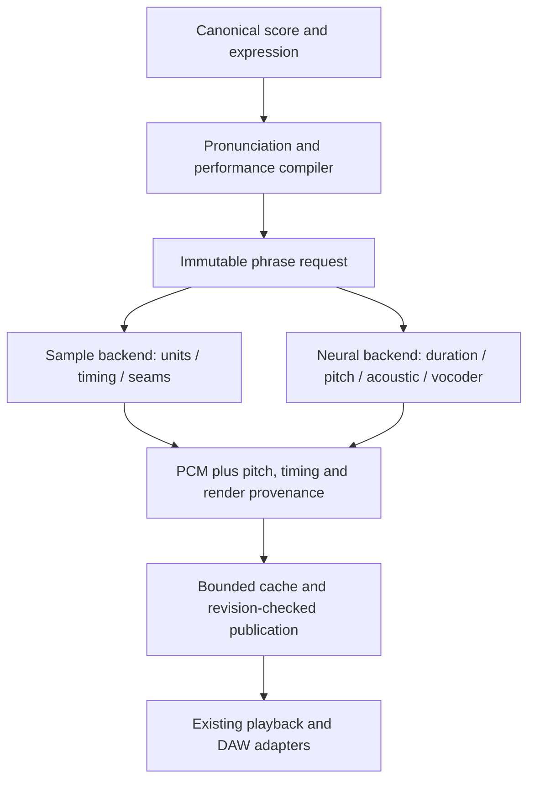
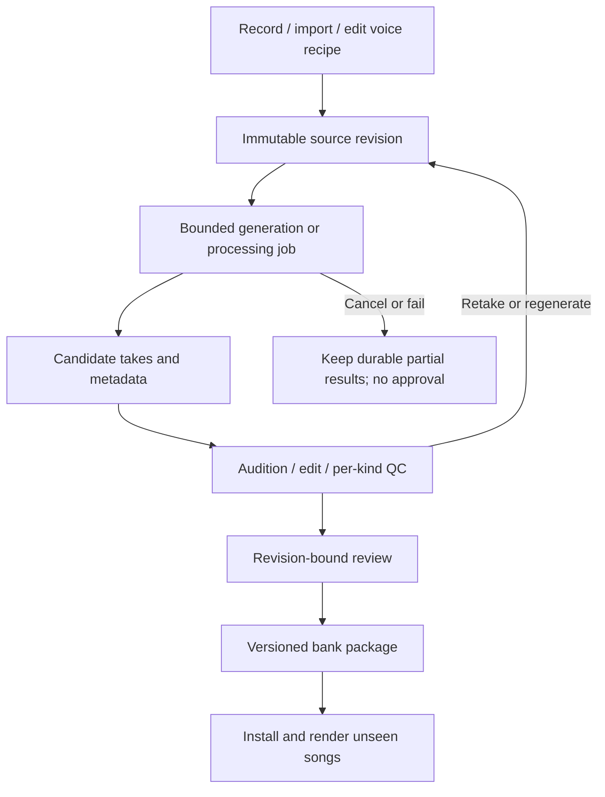
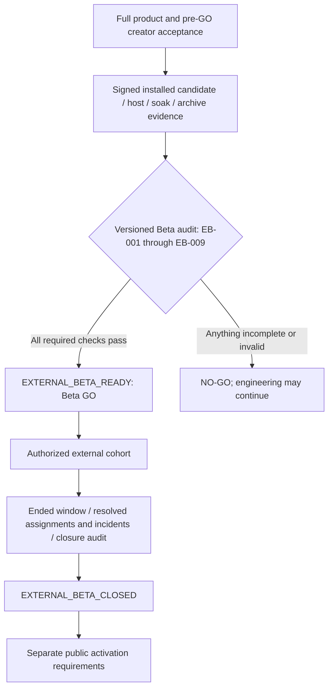

# Project SEAM Full-Scope Virtual Singer Beta GO - Plan

Date: 2026-09-05. Audience: project owner, synthesis engineers, application developers, voicebank producers, and music reviewers.

Source baseline: `69901159a27b2935bb8e40c4c96eccde781f0b9f`, plus the existing uncommitted working tree on `codex/production-readiness-completion`. OpenUtau reference: the existing local clone at `8c0dc4007e6e8c8181f3a12c10205671800eeb8b`. The original source audit and its runtime observations are retained in sections 3–6 and 13. This revision changes the target and plan; it does not claim those code defects have been repaired.

**Revision decision:** the entire virtual-singer roadmap is required before Beta GO. A reduced classical singer, one voicebank, or one short demonstration is an intermediate milestone, not a release qualification. Synthesizer-style voice creation is added as a first-class capability. Previously conditional or later product capabilities are now required. Specific research libraries and alternative implementation techniques remain choices, not cumulative dependencies.

---

## Goal Capsule

- **Objective:** creators can design or acquire an original voice, produce and edit its reusable singer resources, and finish expressive songs through SEAM's supported standalone and DAW workflows.
- **Beta GO boundary:** every requirement R1–R20 below, every work package V01–V18, and the existing External Beta release prerequisites must have accepted evidence for the same release candidate.
- **Authority:** the user's full-scope direction supersedes the earlier reduced-Beta recommendation and this report's former deferrals. Requirements own product behavior; technical choices and implementation units cannot waive them.
- **Execution profile:** preserve existing user work; develop and verify in slices; keep acoustic tests and real creator/producer journeys alongside code tests. A failed release criterion does not prevent independent engineering work from continuing.
- **Tail ownership:** engineering owns working software; voice producers own source and bank quality; qualified language/music reviewers own pronunciation and listening evaluations; release operators own target-machine and distribution evidence.
- **Completion distinction:** this report is a revised specification. It neither implements the scope nor issues a GO decision. Post-distribution cohort completion remains separate from readiness to begin that cohort.

---

## Product Contract

### Summary and problem frame

SEAM has useful editing, sample-synthesis, persistence, and release infrastructure. It does not yet demonstrate the complete musical instrument or voice-creation workflow the owner wants. The gap spans source creation, pronunciation, timing, expressive sound, production tooling, interoperability, and verified delivery.

The expanded Beta combines a Voice Designer, a Voicebank Studio, an expressive singing editor, classical and neural rendering, and supported-host operation. A fully synthetic original female character voice is a required demonstrated path. Recording/importing lawful human vocal material remains a supported and verified path; it is not a prerequisite for using the procedural designer.

### Key decision

**Full-scope completion before Beta GO** (session-settled: user-directed — chosen over a reduced Japanese-only classical Beta: the owner requires the complete report before the release may be called Beta GO). Governs R1–R20.

Product Contract changed by explicit user direction: former product deferrals are promoted to pre-GO requirements. V01–V14 retain their identifiers; V15–V18 add the previously underspecified voice-design, character-performance, and enforcement work. No engineering-completion percentage is inferred from this scope change.

### Requirements

Every row is mandatory. The evidence column defines the minimum observable result, not evidence already collected.

**Musical performance and singer resources**

| ID | Required outcome | Acceptance evidence | Owning work |
|---|---|---|---|
| R1 | Notes, syllables, phonemes, timing overrides, articulation, and complete phrase pitch determine the rendered performance correctly | Cross-note units, same-note syllables, melisma, short consonants, tempo changes, and 30 ms timing edits produce the specified sound | V02, V03 |
| R2 | Creators can persist and hear every expression in section 7, including advanced timbre, growl, automatic performance, alternate takes, and harmonies | Each control changes its intended acoustic property and survives undo, reload, cache reuse, and export | V04, V05, V08, V13 |
| R3 | A user can sculpt an original female character voice through synthesis controls without supplying a person's recording | A saved editable voice recipe produces recognisable vowels, consonants, transitions, and new lyric phrases across its declared range | V15, V16 |
| R4 | Both real recording/import and computer-generated material can enter the same editable production workflow | One real-input session and one procedural generation session complete import, editing, retake/regeneration, review, bank creation, and installation | V07, V16 |
| R5 | Producers can finish, version, install, and reproduce a bank rather than export only a blocked template | Per-kind QA, review invalidation, retake lineage, candidate bindings, content hashes, and recovery all pass through supported actions | V07, V16 |
| R6 | Released singer resources provide complete declared coverage, a reviewed range, and distinct controllable styles | At least two reviewed styles with a supported paired-style blend; no missing required inventory entries; held-out phrases retain intended identity | V06, V07, V08, V15 |
| R7 | Japanese, English, and Korean have actual pronunciation and singing workflows | Language-specific dictionaries/rules, editable pronunciation, approved matching resources, and native-speaker-reviewed songs for each language | V10, V12 |
| R8 | Classical sample synthesis is musically dependable and every exposed renderer states its real capabilities | Declared-range acoustic tests, independent transition processing, contextual unit selection, and truthful fallback/cache provenance | V01, V05, V06, V08 |
| R9 | A deployed neural phrase backend renders a qualified original singer, not merely a test graph or research prototype | Reviewed dataset/model provenance, compatible acoustic model and vocoder, installation, inference, cancellation, and song export on both target platforms | V07, V12 |
| R10 | Automatic performance and controlled variation reduce manual repair without destroying user intent | Generated pitch/timing/energy, partial regeneration, manual locks, repeatable take identity, and editable harmony output pass creator evaluation | V13 |

**Creation, integration, and release**

| ID | Required outcome | Acceptance evidence | Owning work |
|---|---|---|---|
| R11 | The native editor supports a complete musical tuning session with usable layout and accessibility | Unequal-note duplication, tempo/meter editing, lyric distribution, all expression lanes, overlap selection, full-text access, and keyboard operation | V09, V10 |
| R12 | Native USTX and Standard MIDI File exchange support the declared subset safely | Import/export through the product UI, tempo/PPQ fidelity, explicit conversion losses, round-trip tests, and hostile-input rejection | V11 |
| R13 | Standalone, CLAP, VST3, and AUv2 provide the specified authoring and live-expression behavior | All nine existing host tuples, per-note targeting, correct pan/vibrato/timbre, pedal/panic, host timing modes, reload, seek, loop, and bounce | V11, V14 |
| R14 | Character assets communicate the active singer and performance without compromising editing or audio | Singer/style identity, audition/range/status, synchronized mouth/performance states, narrow-layout behavior, and reduced-motion/accessibility checks | V09, V17 |
| R15 | Rendering, generation, and persistence remain bounded, responsive, recoverable, and explainable | Resource limits, cancellation, immutable inputs/results, cache invalidation, stale-result rejection, save/recovery, and realtime safety | V05, V12, V14, V15, V16 |
| R16 | Audio quality is established with a fixed corpus and finished-song work | The numerical, listening, pronunciation, and creator criteria in the Verification Contract pass for the declared resource/capability matrix | V01, V06, V07, V12, V13, V14 |
| R17 | Exact signed/installed builds and required support/reliability work are ready on macOS arm64 and Windows x64 | Existing External Beta prerequisites, U60 completion, supported-host verification, installation lifecycle, recovery and soak evidence | V14 |
| R18 | A machine-enforced full-scope product gate prevents legacy Beta checks from yielding a false full-scope GO | Versioned requirement registry, complete scope coverage, immutable candidate-bound evidence, missing-row and stale-evidence rejection | V18 |
| R19 | Every distributed sample, recipe dependency, model, dictionary, and character asset has documented applicable permissions and provenance | Source-use, transformation, redistribution, commercial-render, and training/model permissions where applicable, reviewed against the exact delivered assets | V07, V12, V14, V16 |
| R20 | Source production and singing remain connected across UI, batch operations, and exported resources | Shared validated domain actions, resumable batch generation, recipe/source-to-bank lineage, installed-bank-to-song handoff, and no manual JSON patching | V07, V09, V12, V16 |

### Scope interpretation

- Japanese-first describes build order, not the release boundary. R7 requires all three languages named in the original report. A resource may declare a language subset, but the release must include approved resources covering all three.
- The original classical and modern-neural targets both become required product paths. A failed neural trial means more work on R9, not permission to omit V12.
- All advanced expressions and basic synchronized character animation are pre-GO work. Unbounded cinematic animation, an unrelated 3D engine, and exact replicas of proprietary competitor implementations are not implied.
- WORLD versus a strengthened in-house algorithm, a specific ONNX provider, and VOICEVOX or another external provider are implementation alternatives. Evaluate relevant candidates and record the selection. No particular vendor is required, and choosing none of the named vendors does not waive a required capability.
- A real performer, a procedural patch, TTS output, and a trained model have different provenance and quality requirements. R3/R4 require real and computer-created production routes; they do not require every voice provider to be bundled or unrestricted reuse of commercial singer material.
- Sample-only edit concepts can remain inapplicable to neural resources. Required global features must still be supported by a tested resource/backend combination; declaring every implementation unsupported cannot satisfy a requirement.
- A short demo, a passing unit suite, a complete report, or the previous Beta validator alone is never full-scope Beta GO.

---

## 1. Direct answer

**Yes: SEAM can be developed into an original virtual singer in the same product category as Hatsune Miku. Its present code is a useful foundation, but it does not yet establish comparable singing quality or expressive control.**

The existing product contains a real score editor, Japanese kana phonemization, sample selection, several working DSP renderers, phrase caching, background rendering, playback, project persistence, audio export, and voicebank tooling. These are substantial assets. The central problem is that several connections from musical intent to rendered sound are incomplete. A production bank and credible listening evidence are also still needed.

The most consequential findings are:

1. Phoneme timing edits reach the phoneme model but are not consumed by the production timing solver.
2. Multiple selected units within one note can receive the same note anchor instead of sequential phoneme timing.
3. A selected unit that spans multiple notes receives the first note's base pitch. Subsequent note pitches are not automatically compiled into its trajectory.
4. Raw rendering and Raw fallback do not consume pitch automation.
5. Some non-Raw renderers preserve the recorded attack and release at source pitch, including voiced material. Large transpositions therefore need additional acoustic treatment.
6. Persisted vibrato, time-varying dynamics, explicit track style selection, and a production singing-project interchange workflow remain incomplete.
7. Existing DSP tests establish basic numerical behavior, not the perceptual quality of an entire singer.
8. The tracked audio and production workspaces do not contain an approved original singer. Inventory rows and synthetic workflow fixtures are not recorded phonetic coverage.
9. Live DAW expression has incorrect mappings, including pan and vibrato becoming a timbre event whose implementation only changes amplitude.

The recommended direction is to **retain SEAM's C++ editor, document, scheduling, playback, and distribution foundations; repair score-to-performance correctness; produce one coherent original voice; and evaluate a stronger synthesis backend against a shared listening corpus.** A wholesale application rewrite is not justified by this audit.

The first engineering checkpoint is one convincing 30–60-second original singing performance, reproducible from a saved project and improved through the actual editor. It helps diagnose the instrument early. It does not satisfy Beta GO; the Product Contract requires completion of the entire system.

## 2. Define the target before estimating the work

“Like Hatsune Miku” can mean three different things:

| Target | Feasibility for SEAM | What completion would require |
|---|---|---|
| An original character singer that performs entered notes and lyrics | Feasible through a substantial extension of the present system | Correct pronunciation and timing, stable pitch, a usable voicebank, expressive editing, and a complete song workflow |
| A polished, deliberately synthetic instrument with the control and usefulness associated with classic Miku products | Plausible, but not established by current audio evidence | Strong source recordings, good transitions across the advertised range, repeatable expression, musical tuning tools, and independent song evaluations |
| A modern singer that automatically produces natural phrasing from a sparse score | Feasible as a separate synthesis/data program | Learned or otherwise sophisticated performance generation, acoustic modeling, a vocoder, a qualified dataset, inference deployment, and extensive evaluation |

Reproducing Miku's particular commercial voice or distributing her voicebank is a separate question. An original singer should have its own authorized voice source, identity, and assets. Buying a singing product or receiving permission to publish a song does not establish permission to redistribute its reusable voice material.

The reference also changes with product generation. Crypton's V4X product describes voice libraries, pronunciation strength, voice color, breath releases, cross-synthesis, and growl. The current NT product describes automatic expression support alongside direct pitch, note gain, formant, consonant-rate, attack, and breathiness controls. Yamaha's dated announcement confirms Miku V6 was released on April 14, 2026 and describes learned pitch, volume, timing, and accents with editable expression. These are different technical targets; feature parity with one does not imply parity with all three. [Crypton V4X](https://sonicwire.com/product/virtualsinger/special/mikuv4x), [Crypton NT](https://sonicwire.com/product/virtualsinger/special/mikunt), [Yamaha Miku V6 announcement](https://www.vocaloid.com/en/news/news_34/).

Build a Japanese-first pilot to establish the synthesis and production architecture, then complete English and Korean pronunciation/resources under R7. Deliver both a controllable original character singer and measured neural automatic performance under R8–R10 before Beta GO. The first pilot is not a reduced release. Displaying a script is not proof of singing-language support.

## 3. What exists today, and what its existence actually proves

### 3.1 Current production path


This is an implemented concatenative pipeline, not merely a proposed architecture. The central entrypoints are [render_pipeline.cpp](libs/seam-rendering/src/render_pipeline.cpp), lines 5–54, and [phrase_renderer.cpp](libs/seam-synthesis/src/phrase_renderer.cpp), lines 127–273. [render_snapshot.hpp](libs/seam-rendering/include/seam/rendering/render_snapshot.hpp), lines 29–49, owns frozen sample inputs and render identity.

The key limitation for a future neural backend is also visible here: `RenderSnapshot` requires a unit plan and frozen WAVs, and `PhraseRenderPipeline` unconditionally constructs `ConcatenativePhraseRenderer`. A neural phrase renderer cannot be integrated correctly by merely adding another per-unit enum value.

### 3.2 Capability assessment

| Area | Observed condition | Assessment against the proposed singer |
|---|---|---|
| Canonical notes and lyrics | Notes, lyric IDs, articulation labels, slur groups, tempo/meter, regions, tracks | Valuable foundation; several performance semantics need wiring |
| Pitch editing | Region cents automation with step/linear/smooth interpolation | Real model, incomplete backend consistency and cross-note compilation |
| Phoneme editing | Symbols, lock state, and timing overrides | Timing intent is not fully reflected in audio |
| Voicebank model | CV/VCV/VC/VV/CC, sustain/release/breath/special units, styles, root pitch, takes, markers, pitch marks | Expressive sample vocabulary exists; bank contents and render behavior must fulfill it |
| DSP | Four actual sample-processing implementations | A research/product foundation, not demonstrated commercial singing quality |
| Dynamics and vibrato | Track gain and pitch curves; no canonical note vibrato or region dynamics model in schema 7 | Essential expressive work remains |
| Style selection | Styles are declared in manifests; production project rendering selects the first style | User intent is not yet an explicit persisted selection |
| Rendering infrastructure | Frozen inputs, content hashes, cancellation, cached PCM, stale-audio management | Preserve and extend |
| Interchange | Bounded Python USTX study bridge | Useful prototype; explicitly lossy and not the native production workflow |
| Voice identity and character | Character/bank matching and presentation states exist | Preserve identity checks; expand artist-facing usefulness after sound works |
| Product quality evidence | Numerical fixtures and readiness templates | No defensible overall Miku-equivalence score |

Source anchors: [note.hpp](libs/seam-domain/include/seam/domain/note.hpp), lines 13–37; [render_controls.hpp](libs/seam-domain/include/seam/domain/render_controls.hpp), lines 15–103; [voicebank.hpp](libs/seam-voicebank/include/seam/voicebank/voicebank.hpp), lines 16–95; [project.hpp](libs/seam-domain/include/seam/domain/project.hpp), lines 67–113; [project_renderer.cpp](libs/seam-rendering/src/project_renderer.cpp), lines 73–94; [USTX study limitations](tools/creator_scope/ustx_study_bridge.py), lines 23–29.

Do not infer language support from `Language::{Japanese,Korean,English}`. [render_snapshot.cpp](libs/seam-rendering/src/render_snapshot.cpp), around lines 391–419, restricts the production phonemizer path to Japanese and constructs the kana phonemizer directly.

## 4. Musical correctness defects to repair first

These findings are source-traced behavioral defects or limitations. Where no acoustic reproduction was executed in this audit, the report does not claim a measured audible severity.

### 4.1 Phoneme timing must affect synthesis

Observed: [japanese_phonemizer.cpp](libs/seam-phonemizer/src/japanese_phonemizer.cpp), lines 138–175, copies an override into `token.timing`. [timing_solver.cpp](libs/seam-synthesis/src/timing_solver.cpp), lines 41–95, computes placement from note bounds and unit markers, without reading that timing.

Implication: moving a phoneme boundary can change persisted state and render identity while failing to move the intended acoustic boundary. A singer cannot be professionally tuned when an editor control does not reliably change the performance.

Proposed change:

- Introduce ordered phoneme spans with start/end frames, syllable membership, vowel-nucleus anchors, and explicit override provenance.
- Resolve note timing through the tempo map once, then apply declared microsecond offsets with clear ownership and collision rules.
- Allocate consonant, vowel, coda, and geminate durations within the available musical interval.
- Carry these spans into unit placement and the source-to-destination mapping used by renderers.
- Report impossible combinations explicitly. Do not silently extend every short consonant through the whole note.

Acceptance: moving a nucleus or consonant boundary by 30 ms changes the expected output location by the corresponding sample count within declared rounding tolerance; undo restores both timing and audio; cache-hit playback preserves the result.

### 4.2 Multiple phonemes in one note need sequential timing

Observed: a selected entry uses the first and last notes associated with its tokens. Two entries owned by the same note therefore share the note's onset and ending. A lyric such as `かき`, when covered by separate `ka` and `ki` units, can place both vowel anchors at the same note onset. [timing_solver.cpp](libs/seam-synthesis/src/timing_solver.cpp), lines 53–95.

Proposed change: distinguish note, syllable, phoneme, and acoustic-unit boundaries. A note may contain multiple syllables; a syllable may extend across multiple notes; a recorded unit may cover several phonemes. These are different relationships and must not be collapsed into one start/end pair.

Acceptance: `かき` on one note produces ordered nuclei; consonant-only plus sustain coverage does not create full-note overlap; legitimate coarticulation overlap remains possible within a bounded join window.

### 4.3 A multi-note sample must follow the whole melody

Observed: [unit_selection.cpp](libs/seam-synthesis/src/unit_selection.cpp), lines 55–77, assigns `targetMidi` from the first token's note. A candidate can match phones spanning multiple notes. [phrase_renderer.cpp](libs/seam-synthesis/src/phrase_renderer.cpp), lines 200–247, adds manual cents automation but passes the single placement pitch to the renderer.

Proposed change: compile a phrase-level pitch trajectory before any individual unit is synthesized. Each voiced segment consumes the trajectory in absolute musical/sample time. A unit is a source of timbre and articulation, not the owner of the melody.

Acceptance: one VCV/VV unit covering C4→G4 contains both target plateaus, including when manual pitch automation is empty. A melisma retains the intended vowel while changing notes. Splitting a render into blocks cannot reset vibrato phase or alter pitch anchors.

### 4.4 Articulation labels need audible semantics

Observed: `Normal`, `Legato`, `Staccato`, and `slurGroup` are persisted on notes, but the inspected timeline synthesis and rendering path does not consume them as articulation instructions. See [note.hpp](libs/seam-domain/include/seam/domain/note.hpp), lines 15–32, and the timing/phrase entrypoints above.

Proposed semantics:

| Intent | Required behavior |
|---|---|
| Legato | Continue a compatible vowel, avoid unwanted reattack, and apply an explicit pitch transition |
| Staccato | Shorten the voiced gate and place a release; do not merely shorten a visual rectangle |
| Slur/melisma | Link syllable ownership across notes while retaining every target pitch |
| Repeated syllable | Retrigger the appropriate consonant/attack according to pronunciation intent |

Acceptance must compare rendered timing and envelope, not just serialized enum values.

The melisma editor also needs correction. [piano_roll_model.cpp](libs/seam-editor-ui/src/piano_roll_model.cpp), around lines 460–496, makes selected notes share the first lyric. The phonemizer expands that lyric separately for each note; its actual continuation rule recognizes literal `-`, `ー`, or `〜`, not shared lyric identity. A consonant-bearing lyric can therefore retrigger consonants instead of sustaining one syllable. Disabling a slur also still assigns `Legato` around line 423. Explicit syllable ownership and continuation must replace this accidental relationship. Tests must check phoneme order and consonant count as well as note metadata.

### 4.5 Pitch controls must survive backend selection and failure

Observed: only PSOLA, Spectral, and Stretch receive the compiled curve in [phrase_renderer.cpp](libs/seam-synthesis/src/phrase_renderer.cpp), lines 239–242. Raw uses a constant source step in [raw_renderer.cpp](libs/seam-synthesis/src/raw_renderer.cpp), lines 63–66. Raw fallback can be selected after another backend fails in [renderer_dispatcher.cpp](libs/seam-synthesis/src/renderer_dispatcher.cpp), lines 116–125.

Proposed change: either implement the pitch trajectory in Raw with proper resampling and time mapping, or mark it unavailable for performances that require unsupported controls. A fallback must declare exactly which performance properties it preserves. For final export, fail or request an explicit degraded-render decision if required pitch or expression would be lost.

Also preserve render provenance in the PCM cache. [region_renderer.cpp](libs/seam-rendering/src/region_renderer.cpp), lines 118–160, initializes `fallbackCount` to zero and only computes actual fallback counts after fresh rendering. A cache hit should not make a degraded render appear clean.

### 4.6 Basic song editing must preserve the music

Observed: [duplicateSelection](libs/seam-editor-ui/src/piano_roll_model.cpp), lines 519–529, sets each duplicate's start to that individual note's start plus its duration plus the grid. It does not translate the phrase as a group. With grid 240, notes `(start=0, duration=240)` and `(start=480, duration=960)` duplicate to starts 480 and 1680. Their 480-tick separation becomes 1200 ticks.

Proposed change: compute one common translation from the selection bounds and the chosen duplication policy. Preserve relative timing, allocate new note/slur identities where needed, retain shared syllable relationships within the copied phrase, and define how owned pitch/phoneme/unit/seam edits are copied. Regression tests need unequal note lengths, rests, overlaps, and linked lyrics, not just equal-length notes and a count assertion.

Tempo and meter are real domain maps, but the inspected native/application command surfaces do not provide their normal musical editing workflow. The tempo toolbar only receives focus in [editor_controller.cpp](libs/seam-native-ui/src/editor_controller.cpp), around line 401; the [application menu](libs/seam-platform/include/seam/platform/application_menu.hpp), from line 13, provides no tempo/meter editing commands. Add undoable tempo/meter events, a usable timeline editor, and explicit project-versus-host timing authority. Merely importing or initializing a tempo map does not make it editable.

## 5. Sound quality: what must change inside the DSP

### 5.1 Separate pitch, duration, timbre, and pronunciation

The current Raw renderer changes source playback rate to change pitch. That also changes spectral shape and consonant duration. PSOLA, Spectral, and Stretch improve some of this behavior, but preserve pre-stable and release material directly from the recording. Such material may include voiced transitions. “Preserve the attack” is a useful intent, but “preserve every attack sample at the original pitch” is not always its correct implementation. [Raw renderer](libs/seam-synthesis/src/raw_renderer.cpp), lines 63–120; [PSOLA renderer](libs/seam-synthesis/src/classic_psola.cpp), lines 131–155; [Spectral renderer](libs/seam-synthesis/src/spectral_classic.cpp), lines 169–198.

Proposed processing model:

1. Preserve transient and unvoiced consonant detail where pitch is undefined.
2. Retarget voiced attack, vowel transition, sustain, and voiced release to the intended F0.
3. Map source duration independently from target pitch.
4. Preserve or deliberately modify the spectral envelope with an explicit control.
5. Blend voiced/unvoiced boundaries without adding an artificial tonal component to fricatives or breaths.

An acoustic voicing track is required for this distinction. The current static phoneme classification is insufficient, and `br` is not excluded by `isVoicedSymbol`, despite being classified as a breath by `inferRole`. See [phonemizer.cpp](libs/seam-phonemizer/src/phonemizer.cpp), lines 22–35.

### 5.2 Improve one dependable default before polishing four equal-status modes

Observed: SpectralClassic performs real FFT processing and envelope compensation. Its envelope estimate is a ±12-bin moving average, and phase progression uses nominal output-bin frequency. These are meaningful algorithms, but they require much stronger tests before becoming a quality claim. [spectral_classic.cpp](libs/seam-synthesis/src/spectral_classic.cpp), lines 245–310.

Proposed direction: keep Raw as an intentional character mode; make one validated renderer the normal singing default; present experimental modes honestly. Avoid assuming that “Final” means better vocal DSP. The current `RenderQuality` identity does not by itself introduce a different high-quality vocal algorithm in [render_pipeline.cpp](libs/seam-rendering/src/render_pipeline.cpp).

Evaluate two practical acoustic paths:

- **Improve the existing classical renderer:** better F0/voicing analysis, source alignment, voiced-transition treatment, spectral-envelope estimation, pitch-synchronous or waveform-aligned processing, and join selection.
- **Trial a mature analysis/synthesis backend:** WORLD exposes F0, spectral envelope, and aperiodicity analysis/synthesis in C/C++. It is a credible experimental component for independent pitch/timbre control. It does not supply a singer, pronunciation planning, or expressive performance generation. [WORLD upstream](https://github.com/mmorise/World).

Run the same recorded phrases through both before committing to a replacement. Do not infer that either route will sound like a finished Miku product because its algorithm name is familiar.

### 5.3 Better transitions need better source choice

Observed: candidate cost currently combines pitch distance, unit length preference, priority, and take number. It does not evaluate the acoustic compatibility of adjacent candidates. [unit_selection.cpp](libs/seam-synthesis/src/unit_selection.cpp), lines 27–35. Seam composition provides useful crossfades, level matching, and local phase alignment, but these cannot invent a missing phonetic transition.

Proposed change: add bounded candidate pruning and a sequence-level join cost. Consider source F0/register, spectral shape at the join, energy, voicing, duration suitability, and left/right phonetic context. Keep hard coverage/style/forced-selection constraints separate from soft preferences. Record cost components so a producer can understand an undesirable choice.

Do not introduce an expensive all-pairs search over a whole song. Limit candidates per position, bound phrase length, precompute reusable acoustic features, and benchmark the actual bank.

## 6. Voicebank and data strategy

### 6.1 What voice material is actually available

The following are scoped measurements of tracked `assets`/`content`, generator output, and the inspected local QA workspace. They are not a scan of every recording elsewhere on the machine.

| Evidence | Observed quantity | What it establishes |
|---|---|---|
| Tracked WAVs under `assets` and `content` | 3 files, 2 unique content hashes | One approximately 23.19-second speech source and two byte-identical 0.55-second excerpts |
| Human production fixture | 8 enabled units, one shared WAV, one root layer at MIDI 67 | A pipeline fixture; different unit labels do not create different recorded pronunciations |
| Checked-in Beta inventory | 72 coverage keys × 2 pitch layers = 144 assignments | A bounded inventory using `k/s/t` consonant families, not 144 recorded units |
| Current default generator, executed in memory | 342 coverage keys, 684 assignments, 1,368 take rows | A larger 30-family, two-pitch, two-take recording specification; no generated recordings |
| Inspected U56 QA workspace | 1 marker-review assignment, 143 missing, 0 approved | Synthetic workflow/recovery evidence, not singer completion |
| Official bank directory | Placeholder without a manifest or audio | A planned bank, not an installed singer |
| Tracked packaged banks and neural checkpoints | None found in the audited tree | No tracked distributable original bank or learned singer demonstrated |

Sources: [human-source provenance](assets/demo-human-voicebank-public-domain/provenance.json), [fixture warning](assets/demo-human-voicebank-public-domain/production-bank/README.md), [checked-in inventory](docs/voicebank/BETA_JAPANESE_CVVC_INVENTORY.json), [generator defaults](tools/voicebank_script_generator/profile.py), [take generation](tools/voicebank_script_generator/inventory.py), [local U56 brief](build/dev/u56-final-qa.4KU4f8/u57-inputs/production-brief.json), and [official placeholder](content/phase13b/official-voicebank-01/README.md). The local build artifact is reproducible-workflow context, not a portable checked-in release artifact.

An existing, not freshly rebuilt, voicebank CLI reported the human fixture structurally valid with 8 units and 0 errors, but also 16 warnings: loop discontinuity and root-pitch mismatch for every unit. The reported pitch mismatch is an analyzer result, not an independently verified fundamental. Structural validity is deliberately less strict than musical approval.

The generated phase demo banks are also not an original voice. [seam-phase2-demo](apps/seam-phase2-demo/main.cpp), around lines 66 and 150, constructs harmonic signals plus noise and assigns five unit definitions. Such fixtures are useful for deterministic DSP tests; phonetic labels on generated tones are not evidence of intelligible Japanese singing.

### 6.2 The voice is a product asset, not a renderer setting

A recognisable singer requires a consistent source identity across vowels, consonants, pitch range, loudness, and expression. A good engine cannot recover phonetic coverage or vocal registers that do not exist in its samples or training data.

For the first original bank, specify:

- One authorized performer or one consistently licensed synthetic voice source.
- One initial language and a declared comfortable singing range.
- A neutral style with complete required phonetic coverage.
- Multiple recorded pitch layers where the actual quality requires them.
- Explicit breath, release, nasal, closure/geminate, and transition coverage.
- Stable recording conditions and a reproducible processing chain.
- Independent review of pronunciation, identity consistency, loops, pitch marks, and joins.

Preserve raw takes. Store gain calibration separately from artistic intensity so normalization does not erase meaningful soft/strong differences. A pitch-shifted copy of one recording is augmentation, not new evidence of the performer's high or low register.

The existing [voicebank model](libs/seam-voicebank/include/seam/voicebank/voicebank.hpp), [production library](libs/seam-voicebank-production), and [Beta production contract](docs/voicebank/BETA_VOICEBANK_PRODUCTION.md) are the starting points. Extend their actual ownership and QA records instead of creating a disconnected dataset folder.

### 6.3 Can free, commercially usable TTS solve the source problem?

**It can support experiments and may support a distributable sample bank when its exact terms permit that use. It is not, by itself, a reliable route to a compelling singing voice.**

Speech normally offers shorter vowels, speech-conditioned transitions, and a different range of pitch, timing, and vocal effort from sustained singing. Cutting speech into CV units and stretching them can expose looping, breath, instability, or articulation artifacts. Combining different speakers or services also makes identity inconsistent. These are engineering risks to measure, not a claim that every TTS-derived bank must fail.

| Source approach | Suitable use | Main limitation |
|---|---|---|
| Self-authored procedural voice | Deterministic fixtures; potentially an intentionally electronic character | Natural consonants and a coherent attractive singing identity require extensive sound design |
| One permitted TTS voice, segmented into units | Early prototype and controlled comparative trial | Speech-to-singing mismatch and reusable-sample redistribution terms |
| Purpose-recorded singing/CVVC material | Preferred classical bank path | Performer, recording, labeling, retake, and review effort |
| Licensed recorded singing for a trained model | Preferred modern neural path | Dataset preparation, model training, evaluation, and deployment |
| Output from an existing commercial virtual singer | Authorized song creation under that product's terms | Does not establish permission to make SEAM's reusable bank or model |

For every source, separately establish permissions for source use, transformation, bank redistribution, end-user commercial rendering, and model training/weight distribution when relevant. Preserve the exact provider/model version and terms. The repository already distinguishes these permissions in [synthetic-source rights requirements](docs/legal/SYNTHETIC_VOICE_SOURCE_RIGHTS_REQUIREMENTS.md).

Crypton's published Miku NT agreement specifically restricts incorporating product components into other software and reproducing/processing material for another product; it also addresses unrelated virtual singers. Do not use a generic “commercial songs allowed” interpretation to override those terms. This is a product-design constraint based on the published document, not a legal clearance for any proposed dataset. [Miku NT EULA, English prohibited-use section](https://ec.crypton.co.jp/download/pdf/eula_virtualsinger.pdf).

There is an important alternative to chopping ordinary speech into samples: evaluate an existing singing-capable engine. VOICEVOX explicitly offers Song, describes a speech-voice-based humming mode, and exposes engine integration for other applications. Its software terms permit commercial use subject to voice-specific terms and required attribution. That makes a bounded integration experiment worth considering; it does **not** establish permission to redistribute any particular voice as SEAM's bank or original character. No individual VOICEVOX voice received that rights review here. [VOICEVOX Song](https://voicevox.hiroshiba.jp/song/), [software terms](https://voicevox.hiroshiba.jp/term/).

For that experiment, compare whole-phrase synthesis through an explicitly selected local engine with the sample-bank route. Define installation, version/voice identity, timeouts, cancellation, output limits, and offline availability. Keep it an optional first-party adapter, not arbitrary bank-provided executable code. Its purpose is to test achievable sound and workflow quickly, not to assume an existing speaker becomes SEAM's proprietary voice.

### 6.4 The production toolchain must be able to finish a bank

Studio now has substantive production functionality: manifest-free project opening, durable generations/recovery, inventory hashing, assignment queues, WAV import/retakes, marker persistence, and U57 handoff export. Native recording is wired for 48 kHz PCM24. This is more than a collection of planned screens. However, the physical-input failure path selects a silence device; opening the application does not prove a working microphone. See [production project integration](libs/seam-native-ui/src/voicebank_studio_production_project.cpp), from line 13, and [native recording and input fallback](apps/seam-voicebank-studio-native/main.cpp), around lines 184 and 240.

Five code gaps prevent treating this as a complete singer-production workflow:

1. **Make QC appropriate to the unit.** [inspectDryTake](libs/seam-voicebank/include/seam/voicebank/validator.hpp), around line 63, accepts no unit kind/voicing policy; its acceptance requires root pitch and non-silence universally. [validator.cpp](libs/seam-voicebank/src/validator.cpp), lines 73–94, only establishes valid root pitch through periodic analysis. Genuine breaths, pauses, and unvoiced closures need different checks. The Python [quality validator](tools/external_beta/_production_common.py), around line 113, and [candidate validator](tools/external_beta/_production_candidate.py), around line 120, similarly require loops/pitch marks universally. Introduce typed per-kind requirements and explicit not-applicable measurements. Do not invent pitch marks for noise or require a pause to be non-silent.
2. **Implement explicit review transitions.** Marker/pitch review and approval fields exist, but the inspected Studio controller does not expose a complete review/approve action. [Repository metadata persistence](libs/seam-voicebank-production/src/repository_operations.cpp), around line 156, does not finish that workflow; [the production test](tests/test_voicebank_production_project.cpp), around line 154, reaches approval by direct field mutation. Add review commands bound to the exact take, processed revision, reviewer evidence, and applicable checks. Editing or replacing approved audio must invalidate affected reviews.
3. **Build real candidates instead of only templates.** [exportU57Inputs](libs/seam-voicebank-production/src/repository_export.cpp), lines 50–113, intentionally emits `SYNTHETIC_READY_REAL_ASSETS_REQUIRED`, empty real-asset hashes, `NOT_RUN` approvals, and a blocked candidate template. Retain that honest template operation. Add a distinct candidate builder using approved raw/derived assets, manifest bindings, session lineage, and signed-off evidence. Reconcile Studio's `-retake-N` identities with [session validation](tools/external_beta/_production_session.py), around line 78, which currently restricts IDs to the original inventory. Do not merely flip status strings to PASS.
4. **Align the production profile with its target.** [Generator validation](tools/voicebank_script_generator/profile.py), around line 69, restricts the Beta profile to two or three layers and excludes VCV/CC. The [official dossier](content/phase13b/official-voicebank-01-dossier.json), around line 10, asks for at least four layers and VCV/CC minima. Decide on one reviewed target profile and derive inventory/package identities from it. Neither those existing numerical quotas nor the larger default generator proves sufficient quality.
5. **Upgrade source conditioning deliberately.** [operations.cpp](libs/seam-voicebank-production/src/operations.cpp), around lines 43 and 148, implements channel selection, downmix, linear resampling, DC removal, normalization, trim, and segment. Segment is a slice, not phonetic alignment; resampling lacks an antialias filter. Add measured band-limited resampling with versioned processing provenance and assisted alignment with review. Preserve raw sources and rederive outputs when algorithms change.

The [source-strategy file](docs/voicebank/BETA_VOICE_SOURCE_STRATEGIES.json) explicitly separates feasibility flags from asset admission, and the [Beta dossier](docs/voicebank/beta-voicebank-01-dossier.json) has empty source/derived evidence. Those records should be populated by real acquisition and evaluation, not used as evidence that acquisition has already happened.

Producer acceptance: import a voiced CV, an unvoiced breath, and a pause; apply appropriate checks; retake one asset; review and approve through supported UI/CLI actions; export a candidate; verify every package binding and hash; install it into the singer and render held-out phrases. This is a stronger completion test than manually constructing an approved project object in a unit test.

### 6.5 Complete the neural data and model-production pipeline

A set of loop-ready units and a neural training corpus have overlapping source management needs but different labels. The neural corpus also needs aligned lyrics/phonemes, note sequences, durations, F0/voicing, phrase boundaries, speaker/style identity, and reproducible train/validation/test splits. Split by source song/session before augmentation to avoid leaking near-duplicates into evaluation.

OpenVPI's dataset tooling explicitly separates audio slicing, transcription labeling, alignment, and note/slur work. It demonstrates the kind of pipeline needed; it does not establish a universal minimum recording duration. [MakeDiffSinger](https://github.com/openvpi/MakeDiffSinger).

Proposed first experiment: prepare a small, carefully reviewed corpus and a separate held-out phrase set. Evaluate data coverage and learning curves before commissioning the full recording volume. Any hours estimate should be tied to the selected model, whether it is trained from scratch or adapted under permission, the range of languages/styles, and observed validation behavior.

## 7. Expressive features and their required semantics

Every control needs a persisted meaning, an acoustic implementation, an editor action, and an observable test. A labeled slider alone is not a feature.

| Feature | Required meaning | Implementation direction | Beta GO requirement |
|---|---|---|---|
| Vibrato | Onset, depth, period/rate, fades, phase | Canonical note data; phrase-time evaluation; apply once to intended F0 | Required: R2 |
| Manual pitch and portamento | Editable note transitions and local intonation | Phrase pitch compiler; explicit transition duration/shape; display final target curve | Required: R1, R2 |
| Dynamics/note gain | Time-varying loudness | Typed gain curve and click-safe application after synthesis | Required: R2 |
| Consonant timing and attack | Placement and duration of pronunciation components | Phoneme duration plan and source mapping, not playback speed alone | Required: R1, R2 |
| Legato/melisma | One syllable across multiple pitches | Explicit syllable-note relation and retrigger policy | Required: R1, R2 |
| Voice style | Intended recorded or learned vocal color and supported blending | Persisted style ID; paired-data and capability validation | Required: R2, R6 |
| Breath/release | Breath placement, level, and release shape | Explicit event/unit or model-supported control; unvoiced handling | Required: R2 |
| Breathiness | Noise/voicing balance while retaining intelligibility | Verified acoustic decomposition or trained conditioning | Required: R2 |
| Tension/power | Vocal effort and spectral change | Multi-style data or conditioned model; keep separate from output gain | Required: R2 |
| Formant/timbre control | Spectral-envelope modification independent of F0 | Validated DSP or model-supported parameter | Required: R2, R3 |
| Growl/roughness | Controlled aperiodic or subharmonic character | Dedicated evaluated processing or source/model support | Required: R2 |
| Automatic performance | Suggested pitch/timing/energy/articulation | Prediction layer with editable outputs and stable generation identity | Required: R9, R10 |
| Alternate takes/harmonies | Musical variations with consistent identity | Saved generation seed/take plus editable note/performance data | Required: R10 |

Dynamics must not be advertised as vocal power: multiplying a quiet sample by a gain does not create the spectral change of forceful singing. Similarly, adding white noise does not automatically provide convincing breathiness.

Proposed classical pitch composition:

```text
target pitch = note trajectory + deliberate transitions + manual offset + vibrato
```

For automatic/neural performance, define how generated pitch is replaced, offset, locked, or blended with manual intent. Do not add automatic vibrato and manual vibrato twice. Keep unvoiced frames distinct from an F0 of zero interpreted as a musical note.

The default edit-ownership policy is fixed by KTD7 below. Generated output is a proposed take until accepted. Regeneration cannot silently replace canonical manual work, even if the job began before that work was edited.

The existing [creator plan](docs/plans/2026-09-01-0303-feat-creator-workflow-parity-plan.md) already specifies note vibrato, typed dynamics, and style migration. Reuse those units and extend the plan for timing/F0 correctness. Do not count the planned schema 8 as implemented: [ProjectJsonCodec](libs/seam-formats/include/seam/formats/project_json.hpp), line 13, still declares schema 7.

## 8. Synthesis backends and DAW integration

### 8.1 Why a phrase backend is the right extension boundary

DiffSinger is a score-conditioned acoustic-model approach. The original research generates acoustic features from musical inputs; the OpenVPI implementation adds variance prediction/control and deployment-oriented work. This supplies a credible research route to modern expression, but selecting the repository alone supplies neither SEAM's singer nor a proven model. [DiffSinger paper](https://arxiv.org/abs/2105.02446), [OpenVPI implementation](https://github.com/openvpi/DiffSinger).

OpenUtau's pinned source confirms a phrase-level renderer interface and a DiffSinger adapter using ONNX Runtime, model/vocoder compatibility checks, F0 inputs, and capability declarations. This is useful implementation evidence. SEAM should borrow the boundary and validation lessons while keeping its own host/runtime architecture. [Pinned IRenderer](https://github.com/openutau/OpenUtau/blob/8c0dc4007e6e8c8181f3a12c10205671800eeb8b/OpenUtau.Core/Render/IRenderer.cs), [pinned DiffSingerRenderer](https://github.com/openutau/OpenUtau/blob/8c0dc4007e6e8c8181f3a12c10205671800eeb8b/OpenUtau.Core/DiffSinger/DiffSingerRenderer.cs).



Introduce the phrase boundary after the timing/F0 contract is established, then integrate the required neural backend. A comparative trial selects the model and informs the adapter; it no longer decides whether neural synthesis belongs in Beta. Keep the boundary narrow and first-party rather than creating an arbitrary plugin framework. The procedural Voice Designer shares the musical performance contract described in section 15.

### 8.2 Proposed API responsibilities

The following names are **new design proposals**, not existing classes or compiled code:

```text
CompiledPerformance
  absolute phrase start, output range, note/syllable/phoneme relations
  phoneme durations and manual boundary locks
  target F0 / voicing, dynamics, supported timbre controls

SingerResourceIdentity
  bank ID/version/content hash, backend ID/revision
  model/vocoder/dictionary hashes when applicable
  language, style, sample rate, frame hop and input contract

PhraseSynthesisResult
  immutable PCM and placement/latency metadata
  actual pitch/timing traces when available
  actual backend, applied controls, degraded-render diagnostics
```

Responsibilities:

- The domain owns musical intent and units, not ONNX tensor names.
- The performance compiler owns time conversion, note continuity, and control composition.
- A backend adapter owns conversion into its fixed supported input contract.
- The scheduler owns cancellation, priorities, stale results, and publication.
- The cache owns both audio and the provenance needed to explain it.
- The UI enables only capabilities that the selected bank/backend actually implements.

A neural result should retain score and manual edits independently of generated F0. Changing model version or sampling configuration invalidates affected render identity. Seeded inference can support repeatability within a declared configuration; bit-identical output across different hardware/execution providers must be tested rather than promised.

### 8.3 Deployment, safety, and DAW behavior

ONNX Runtime has a C++ API and platform execution-provider options, including CoreML. That makes native deployment possible. It does not mean that every exported singing graph accelerates on every provider or that latency is suitable for live playing. Establish a CPU reference and measure provider/operator support on the supported machines. [ONNX Runtime C++](https://onnxruntime.ai/docs/get-started/with-cpp.html), [CoreML provider](https://onnxruntime.ai/docs/execution-providers/CoreML-ExecutionProvider.html).

Keep model loading, tensor allocation, file I/O, inference, and training outside the audio callback. Begin with timeline phrase rendering. A live keyboard singer is a separate latency and lookahead problem, particularly when future lyrics are not known.

For distributable neural banks, version the package contract. Validate model hashes, tensor dtypes/shapes, output lengths, sample rate, hop size, phoneme vocabulary, acoustic/vocoder compatibility, and resource budgets. Disallow arbitrary custom operators or bank-supplied native code. Model graphs still require parser and execution limits even when distributed as data. Use a first-party runtime; evaluate an isolated worker process for model execution if its crash/resource boundary is needed.

Preserve the accepted [data-only bank ADR](docs/adr/0007-data-only-voicebanks.md). Extending it to supported model data requires a precise format/security amendment, not allowing scripts into voicebanks. A neural backend should reject unsupported sample-specific seam/unit overrides with a clear explanation rather than inventing equivalent behavior.

### 8.4 The existing live plugin path needs semantic repairs

CLAP, VST3, and AUv2 must not be described as entirely absent. [The wrapper build](packaging/phase13a/wrapper-project/CMakeLists.txt), around lines 64–77, builds VST3/AUv2 wrappers around the canonical CLAP implementation. [Plugin state](libs/seam-clap-editor/src/editor_runtime_state.cpp), from line 33, embeds a checksummed canonical project. These are useful foundations, but neither wrappers nor state serialization prove correct musical behavior in a host.

The live engine is separate from the timeline lyric renderer. [LiveEvent](phase12c/include/seam/phase12c/live_voice.hpp), around line 78, has no lyric/syllable identity; note-on selects attack/sustain/release resources by pitch and role. A playable sample instrument is therefore not yet live lyric-driven singing.

| Observed path | Current source behavior | Required correction |
|---|---|---|
| CLAP pan and vibrato | Both become `Timbre` in [plugin_entry.cpp](libs/seam-clap-editor/src/plugin_entry.cpp), lines 461–463 | Separate typed controls; implement actual stereo placement and periodic pitch modulation or declare unsupported |
| Live timbre and brightness | Each only multiplies amplitude by `0.9 + 0.1 * value` in [live_voice.cpp](phase12c/src/live_voice.cpp), lines 452–456 | Provide actual timbral/spectral behavior; do not relabel gain as timbre |
| Per-note tuning | Converted into channel-wide pitch bend around line 292 of the same engine | Resolve addressed notes and apply independent tuning; retain channel bend as a separate modulation |
| CLAP note channel | Note-on uses the compatibility call at plugin lines 496–500, which hardcodes channel zero in the engine around line 575 | Preserve supported port/channel/key/note-ID targeting through note-on, release, choke, and expression |
| MIDI sustain and all-notes-off | Decoder exposes actions without matching handling in the engine's MIDI branch around line 253 | Define pedal-held/released state, release semantics, and panic handling; test hanging-note prevention |
| Advertised expressions | VST3 wrapper declares `SUPPORTS_ALL_NOTE_EXPRESSIONS TRUE` | Advertise only verified support through the wrapper's actual mapping |

Implement the live-expression corrections in this table before Beta GO under R13. Capability declarations still prevent unsupported bank-specific controls, but hiding the entire live workflow is not a substitute for completion. General live lyric prediction without a supplied lyric sequence is a separate problem, not an excuse to misroute supported MIDI/CLAP expression.

### 8.5 Host tempo authority must be explicit

[HostTimelineMapper](libs/seam-clap-editor/src/host_timeline.cpp), from line 34, prefers a seconds timeline; its beats-only fallback converts absolute beats with the current BPM. The latter cannot reconstruct elapsed time through earlier tempo changes. The plugin mixes existing rendered PCM, so following host seconds also does not automatically regenerate the score at a new host tempo.

Define two supported modes:

- **Fixed rendered audio:** preserve its project-tempo performance and align it to an explicit host start offset. Changing host BPM does not imply a new vocal performance; the UI must say so.
- **Follow host tempo:** compile score timing against an authoritative synchronized map or supported host information, invalidate affected phrase identities, and schedule rerendering outside the callback. Specify lookahead and stale-audio behavior. If the host provides insufficient history, report the limitation instead of deriving a fictitious map from one BPM value.

KTD8 defines pending and failed playback: invalidate only affected vocal ranges, show their state, and do not silently play old-tempo audio in follow-host mode. Fixed rendered-audio mode remains an explicit user choice. Offline output must not report success with pending, stale, or failed required vocal ranges.

Acceptance must include nonzero song positions, changing tempo, seek, loop wrap, stop/restart, offline bounce, state reload, and multiple instances. Verify the exact installed format/host combination, not only a standalone render or a wrapper build.

## Implementation Units

V01–V14 preserve the original roadmap IDs. V15–V18 extend it without renumbering. All eighteen work packages are mandatory. These are delivery-sized packages; implementation should divide their changes into reviewable commits without changing their acceptance boundaries. `Modify` identifies existing files or modules. `Create` identifies proposed files. The Verification Contract supplies test targets and required scenarios for every package.

### V01. Establish a reproducible auditory baseline

Modify the build issues identified in section 13 through a separate implementation change; add a focused synthesis-quality test target to [CMakeLists.txt](CMakeLists.txt).

Create `tests/singing_quality/` and `tools/singing_quality/` for corpus manifests, measurements, and result collection. Retain test source/bank/project/backend hashes. Produce a small dry-vocal comparison packet and one saved 30–60-second song. No generated PASS fields or blanket quality percentage.

Dependency: none. Exit: another developer can reproduce the baseline and a musician can identify its actual limitations.

### V02. Make phoneme boundaries authoritative

Modify [timing_solver.hpp](libs/seam-synthesis/include/seam/synthesis/timing_solver.hpp), [timing_solver.cpp](libs/seam-synthesis/src/timing_solver.cpp), [phoneme.hpp](libs/seam-domain/include/seam/domain/phoneme.hpp), and [technical_edit_controller.cpp](libs/seam-authoring-runtime/src/technical_edit_controller.cpp).

Create a focused `phoneme_timing_plan` module if needed to own ordered phoneme spans. Define how microsecond overrides combine with note anchors. Extend the unit source mapping for multiple phonemes within one unit. Keep the source markers and musical target timing distinguishable.

Dependency: V01. Exit: phoneme timing edits audibly move the intended boundary; same-note multi-syllable lyrics remain sequential.

### V03. Compile complete phrase pitch and articulation

Modify [unit_selection.cpp](libs/seam-synthesis/src/unit_selection.cpp), [pitch_curve.hpp](libs/seam-synthesis/include/seam/synthesis/pitch_curve.hpp), [phrase_renderer.cpp](libs/seam-synthesis/src/phrase_renderer.cpp), and [render_snapshot.cpp](libs/seam-rendering/src/render_snapshot.cpp).

Create `libs/seam-synthesis/include/seam/synthesis/performance_compiler.hpp` and its implementation. Compile the entire melody, slur/reattack intent, manual offsets, and voiced masks into frame-aligned data. Give each unit a view of this performance rather than a single authoritative target note.

Resolve pronunciation and canonical note/syllable relationships before dividing work into renderer chunks. [phrase_segmenter.cpp](libs/seam-rendering/src/phrase_segmenter.cpp) currently splits by rests or maximum duration, and snapshot extraction removes neighboring notes before phonemization. Distinguish a musical phrase boundary from a processing chunk. Each immutable chunk receives the bounded resolved context it needs: continuation identity, phoneme spans, absolute modulation phase and backend lookahead. Hash those dependencies and invalidate affected neighbors when context changes. Apply document/phrase limits before expanding context; do not solve continuity by passing an unbounded song to every worker.

Dependency: V02. Exit: a cross-note unit and a melisma follow every note; articulation changes sound as specified; tempo changes remain correct.

### V04. Add persisted vibrato and dynamics with migration

Modify [note.hpp](libs/seam-domain/include/seam/domain/note.hpp), [project.hpp](libs/seam-domain/include/seam/domain/project.hpp), [render_controls.hpp](libs/seam-domain/include/seam/domain/render_controls.hpp), [project_json.cpp](libs/seam-formats/src/project_json.cpp), application commands, and [CLAP editor-state serialization](libs/seam-clap-editor/src/editor_runtime_state.cpp).

Create the typed dynamics files already specified in creator U1 and the note vibrato model. Use cents, time/fraction units, finite/range checks, deterministic interpolation, and zero-effect defaults. Upgrade the schema once for the agreed vocabulary; preserve schema 1–7 musical data through migration. Musical-correctness and DSP fixes may change rerendered audio: version render identity/algorithm revisions, invalidate affected caches, and document those changes. Do not promise exact legacy audio without an explicit legacy-render policy. Preserve manifest-first legacy style behavior only through explicit migration.

Dependency: V03 and a documented amendment/ratification of the existing creator plan. Exit: vibrato and gain edits survive undo/redo, save/reopen, autosave/recovery, plugin state, preview, and final export.

### V05. Make capabilities and fallback truthful

Modify [renderer_dispatcher.hpp](libs/seam-synthesis/include/seam/synthesis/renderer_dispatcher.hpp), [renderer_dispatcher.cpp](libs/seam-synthesis/src/renderer_dispatcher.cpp), and [raw_renderer.cpp](libs/seam-synthesis/src/raw_renderer.cpp).

Create a small compiled capability table for the implemented controls. Repair Raw pitch evaluation or reject unsupported requests. Preserve actual backend/fallback/capability information in [pcm_cache.hpp](libs/seam-rendering/include/seam/rendering/pcm_cache.hpp) and [region_renderer.cpp](libs/seam-rendering/src/region_renderer.cpp). Version the persisted cache representation where necessary.

Dependency: V03–V04. Exit: no control silently disappears after a fallback or cache hit; final export truthfully states degraded rendering.

### V06. Improve voiced/unvoiced and transition processing

Modify [classic_psola.cpp](libs/seam-synthesis/src/classic_psola.cpp), [spectral_classic.cpp](libs/seam-synthesis/src/spectral_classic.cpp), [stretch_renderer.cpp](libs/seam-synthesis/src/stretch_renderer.cpp), voicebank analysis, and [seam_composer.cpp](libs/seam-synthesis/src/seam_composer.cpp).

Add frame-level voicing/F0 confidence, pitch treatment of voiced transitions/releases, independent duration mapping, and appropriate resampling. Trial WORLD behind a build option only if the baseline comparison justifies it. Replace the old broad “preserve transition bytes” assertion with separate tests for preserving unvoiced transients and correctly retargeting voiced material; retain the original regression intent.

Dependency: V01–V05 plus suitable recorded fixtures. Exit: transposition and duration tests meet agreed thresholds without hidden fallback or obvious transition artifacts.

### V07. Produce the first coherent voicebank

Modify [seam-voicebank-production](libs/seam-voicebank-production), the native Voicebank Studio modules, inventory data, and source/retake/quality records. Add needed internal phoneme anchors and acoustic analysis to the bank format with schema migration.

Define the performer/source, language, comfortable range, phonetic inventory, pitch layers, styles, and source rights before full-scale production. Record/review a neutral pilot, fix the renderer against it, then expand coverage. Keep performer identity separate from character artwork.

Implement the five production repairs in section 6.4: kind-aware QC across C++/Python, supported review state transitions, a real-candidate builder, retake/inventory contract alignment, and versioned high-quality conditioning. Extend the relevant producer tests with actual breath/pause/voiced fixtures and a complete import→review→retake→candidate workflow. Keep musical review independent of structural-validator success.

Version production assignment identity to include resource/language, style, coverage key and pitch layer. Current [assignment validation](libs/seam-voicebank-production/src/project_codec_validation.cpp) and Studio selection distinguish only coverage and pitch, so a second style can collide with the first. Carry the style-aware identity through inventories, takes, retakes, selection, annotations/reviews and candidate assembly. Migrate legacy assignments into their explicit existing default style. Store blend pairing separately; matching phoneme/pitch alone does not prove two takes are a valid pair.

Dependency: pilot begins alongside V01; full production follows V02/V06 feedback, with procedural sources from V15/V16. Exit: the source-production portions of R4–R6 and R19 pass through the actual producer workflow; full expression/style acceptance is completed with V08/V13. No source strategy, generated row count, or manually approved object substitutes for accepted assets.

### V08. Persist style and improve unit selection

Modify [project.hpp](libs/seam-domain/include/seam/domain/project.hpp), [voicebank.hpp](libs/seam-voicebank/include/seam/voicebank/voicebank.hpp), [project_renderer.cpp](libs/seam-rendering/src/project_renderer.cpp), [unit_selection.cpp](libs/seam-synthesis/src/unit_selection.cpp), and the existing browser/coverage components.

Persist a style choice, enforce missing-style diagnostics, and add bounded acoustic join costs and register/duration constraints. Surface requested versus selected pitch layer/take. Deliver the distinct styles and paired-style blend required by R6. Validate compatibility before interpolation; do not promise arbitrary style morphing across incompatible recordings.

Dependency: V04/V07. Exit: bank updates cannot silently switch voice color, and a producer can explain why each transition candidate was selected.

### V09. Make expression usable in the editor

Modify [editor_controller.cpp](libs/seam-native-ui/src/editor_controller.cpp), [editor_scene.cpp](libs/seam-native-ui/src/editor_scene.cpp), [editor_semantics.cpp](libs/seam-native-ui/src/editor_semantics.cpp), and the existing editor models.

Add active-note vibrato handles, a dynamics lane, resulting pitch display, timing handles, and a compact singer/style inspector. Route pointer, keyboard, and accessibility operations through the same undoable commands. Keep technical sample inspection available as an advanced view.

Also repair [piano_roll_model.cpp](libs/seam-editor-ui/src/piano_roll_model.cpp) phrase duplication and melisma ownership, and add tempo/meter editing through application commands. Acceptance includes unequal-duration phrase copies, slur enable/disable, mixed selections, and tempo-event undo with rerendering. These basic creator operations belong in the singer milestone, not an optional UI-polish backlog.

Dependency: V04/V05. Exit: a musician can tune the phrase, hear the change, undo it, and continue without editing JSON or using command-line tools.

### V10. Complete pronunciation and lyric productivity

Modify [japanese_phonemizer.cpp](libs/seam-phonemizer/src/japanese_phonemizer.cpp), [phonemizer.hpp](libs/seam-phonemizer/include/seam/phonemizer/phonemizer.hpp), lyric commands, and native lyric editing.

Persist pronunciation hints independently of displayed text. Support intentional syllable-to-note distribution, continuation, dictionary overrides, and visible unsupported text. Complete Japanese reading assistance and context rules. Add separate English and Korean `IPhonemizer` implementations, dictionary identities, and language-resource selection instead of the hardcoded Japanese snapshot path. Include English stress and consonant-cluster handling, Korean syllable decomposition and context-dependent pronunciation, and Japanese continuation/geminate/nasal handling with native-speaker-reviewed fixtures. A language selection must resolve an approved matching resource or explain its absence; it must not silently substitute Japanese phonemes.

Bind phoneme-dependent manual edits to the pronunciation revision and original token identity. [PhonemeKey](libs/seam-domain/include/seam/domain/phoneme.hpp) currently uses note ID and ordinal, which cannot safely identify a phone after insertion/deletion or a dictionary/language change. Preserve overrides only for verified unchanged correspondences. Keep ambiguous timing/unit/seam edits as unresolved user data and show a conflict; do not silently attach them to the new ordinal. Undo restores the prior pronunciation and its edits together. Migration and generation use the same reconciliation rule.

Dependency: V02/V04, with final language-resource evidence from V07/V12. Exit: R7 passes in all three languages and pronunciation can be corrected independently of displayed lyrics.

### V11. Complete score exchange and DAW authoring

Promote the useful behavior of [tools/creator_scope](tools/creator_scope) into the native document lifecycle with conversion review, bounded parsing, accurate tempo/PPQ mapping, and explicit losses. Add native USTX export after supported expressive semantics exist.

Deliver MIDI import and export for the task “compose a melody in a DAW, bring it into SEAM, attach lyrics, render vocals, and exchange the edited score.” Implement a bounded SMF Type 0/1 PPQ subset; validate lengths/counts/delta-times before allocation; cap events/notes/metadata; define tempo and note-pairing behavior; report discarded controller data. Reject SMPTE division with a readable diagnostic until deliberately supported. General MIDI file exchange is distinct from realtime MIDI event handling. Preserve the existing creator plan's declared USTX version/subset contract and show a conversion report for unsupported expressive data.

Modify the existing CLAP editor adapter and format wrappers so the claimed formats run the same authoring/runtime semantics. Verify transport offsets, loop/restart, offline bounce, sample-rate changes, state reload, and multi-instance behavior in real supported hosts.

Concretely modify [plugin_entry.cpp](libs/seam-clap-editor/src/plugin_entry.cpp), [live_voice.hpp](phase12c/include/seam/phase12c/live_voice.hpp), [live_voice.cpp](phase12c/src/live_voice.cpp), [host_timeline.cpp](libs/seam-clap-editor/src/host_timeline.cpp), and [wrapper capabilities](packaging/phase13a/wrapper-project/CMakeLists.txt). Preserve event addressing, replace the incorrect expression mappings with the required behaviors in section 8.4, and distinguish host timing modes as in section 8.5. Test two simultaneous addressed notes: tuning one must not retune the other; pan must change channel distribution; vibrato must modulate pitch; sustain release and panic must not leave hanging voices.

Dependency: V03–V05 and V09. Exit: an actual creator completes DAW→SEAM→DAW with predictable timing and editable project state.

### V12. Deliver neural phrase synthesis and a qualified model

Modify [render_snapshot.hpp](libs/seam-rendering/include/seam/rendering/render_snapshot.hpp), [render_pipeline.cpp](libs/seam-rendering/src/render_pipeline.cpp), render coordination, cache identity, package validation, and CMake dependency definitions.

Create `libs/seam-synthesis/include/seam/synthesis/phrase_backend.hpp` and a narrow `libs/seam-neural-synthesis/` implementation. Represent sample and neural resources as distinct typed inputs; keep optional tensor/runtime details out of the musical domain. Bind model/vocoder/dictionary identities, sample/frame contracts, provider, precision, inference settings, and seed to results and cache keys. Add crash/timeout/resource-boundary tests and warm/cold latency measurement.

Create a reproducible preparation, training/adaptation, validation, and export toolchain under `tools/voice_model_training/`. Preserve source/session lineage, aligned labels, split manifests, training configuration, checkpoint identity, model/vocoder compatibility, and export validation. Training can run on suitable development compute outside the desktop app; customer inference must work on both supported desktop platforms without a training workstation. Ship an actual qualified model/resource set covering R7/R9, not a download link to an unreviewed third-party checkpoint.

Dependencies: V01–V05 and V07's source/data interfaces. V12 has two internal phases: prepare/train or adapt and qualify a model, then integrate and qualify its deployment. Passing the shared-corpus experiment is the first phase's exit and a prerequisite to final deployment acceptance, not a prerequisite to starting V12. The adapter can be developed against test fixtures while model work proceeds. Final exit: the actual qualified model renders the same score through the selected backend, survives save/reopen, cancels safely, and exports reproducibly within the declared environment.

### V13. Add automatic performance and advanced timbre

Deliver a trained duration/pitch/variance predictor as part of R9/R10. Rule-based classical suggestions may complement it but cannot replace neural completion. Persist generated take identity and manual locks. Map breathiness, power/tension, voicing, growl, formant control, and style to actual model/DSP capabilities. Show generated versus manual curves; permit partial regeneration without destroying edits. Add alternate-take comparison and harmony generation that produces editable notes and performance data, not only opaque audio.

Dependency: V04, V09, V12; classical suggestions also use V03–V06. Exit: every section-7 expression has a tested implementation, generated takes/harmonies remain editable, and the R10 creator comparison demonstrates reduced repair without loss of manual control.

### V14. Complete a release around finished songs

Finish the existing U60/support work and relevant device, save/recovery, installer, bank-trust, accessibility, update, and host checks. Do not let a reference to this report mark any of those gates passed.

Dependency: the full R1–R20 capability scope and its product evidence, assembled from V01–V13 and V15–V17. Release infrastructure can be developed earlier. Final exit: exact installed builds complete independent full-song work on both required platforms, including recovery, export and support, ready for the V18 final audit.

### V15. Build procedural voice recipes and synthesis

**Goal and requirements:** satisfy R3/R6/R15 with an editable original voice recipe and deterministic procedural pronunciation, not renamed harmonic test signals.

**Files:** create `libs/seam-voice-design/include/seam/voice_design/voice_recipe.hpp`, `libs/seam-voice-design/src/voice_recipe.cpp`, `libs/seam-voice-design/src/phonation_source.cpp`, `libs/seam-voice-design/src/vocal_tract.cpp`, `libs/seam-voice-design/src/articulation_plan.cpp`, and `libs/seam-voice-design/src/procedural_renderer.cpp`; modify CMake and phrase-render integration. Create `tests/test_voice_design.cpp` and `tests/test_procedural_voice.cpp`.

**Approach:** implement the recipe and synthesis responsibilities in section 15 using the shared performance compiler. Support voiced source, resonances, aspiration/frication, consonant closures/bursts, transitions, style poses, and controlled modulation. Render preview phrases and unit-baking requests with declared bounds and revision identity.

**Dependencies:** V01–V03 establish the timing/F0 contract. V05 supplies capability/provenance conventions. Final language coverage coordinates with V10; begin Japanese acoustics without waiting for the other dictionaries.

**Verification:** vowel identity survives pitch changes; specified CV/VC transitions are distinguishable; parameter edits affect the named property; invalid resonances cannot destabilize output; same recipe/seed/runtime reproduces the result; old jobs cannot overwrite a newer recipe preview. Pass R16 listening tests for the intended original female character voice.

### V16. Connect Voice Designer, recording, and bank production

**Goal and requirements:** complete R3–R5/R19/R20 through one user-accessible source-to-bank workflow.

**Files:** create `libs/seam-native-ui/include/seam/native_ui/voice_designer_model.hpp`, `libs/seam-native-ui/src/voice_designer_model.cpp`, and `libs/seam-voicebank-production/src/repository_generation.cpp`; extend the existing Studio controller/scene/semantics, production project codec/repository, native recorder, and voicebank CLI. Create `tests/test_voice_designer_workflow.cpp` and extend `tests/test_voicebank_production_project.cpp` and `tests/external_beta/test_beta_voicebank_production.py`.

**Approach:** expose saved recipes, sliders/envelopes, vowel/word/phrase auditions, A/B comparison, undo, range/style settings, and selected-unit batch generation. Import generated WAVs as immutable takes with per-source recipe lineage. Keep recorded imports available through the same editor and QA system. Preserve manual revisions; regeneration creates candidates and never overwrites an approved bank. Share domain commands with batch/CLI operations instead of implementing a second production engine.

**Dependencies:** V07's durable producer operations and V15's recipe renderer. Pair their source/asset schemas before implementing generation, so neither must be thrown away later.

**Verification:** create a voice, save/reopen it, generate required units, edit one, retake/regenerate one, review through supported actions, install the exported bank, and sing an unseen phrase. Repeat the bank lifecycle with real microphone/imported material. Cancel and restart a batch without duplicate approval or corrupted lineage. A changed recipe or processing algorithm invalidates only the relevant derived/reviewed results.

### V17. Complete character and performance presentation

**Goal and requirements:** satisfy R14 without compromising R11/R15.

**Files:** extend the existing voice-identity, scene, semantics, and character-asset validation modules; create `libs/seam-native-ui/src/character_performance_model.cpp` and `tests/test_character_performance.cpp`; extend `tests/test_native_ui.cpp`.

**Approach:** drive singer/style/status and mouth/performance states from the selected resource and aligned performance timeline. Handle seek, loop, render replacement, missing assets, stopped playback, reduced motion, and collapsed panels. Keep audio threads independent of texture decoding and animation work.

**Dependencies:** V03/V09 and V12's result metadata, with actual character assets/provenance from V07/V16.

**Verification:** the correct singer/style is shown after reload; a consonant/vowel phrase drives the intended visual states at playback time; seek/loop/reset do not leave stale mouth states; missing artwork does not prevent safe project editing; narrow windows retain readable lyrics and reachable controls.

### V18. Enforce full-scope Beta GO and propagate its identity

**Goal and requirements:** implement R18 and the release interpretation in section 16. A former eight-row Beta pass cannot authorize this expanded product.

**Files:** modify the existing External Beta acceptance contract, bank dossier/validator, release gate/policy/audit, operations, closed evidence-envelope schemas, creator-scope authority, and public predecessor validation. Create `docs/product/full-product-beta-contract.json`, `docs/product/full-product-beta-evidence.schema.json`, and `tools/external_beta/full_product_gate.py`. Extend the existing external-beta/public regression suites named in the Verification Contract and create `tests/external_beta/test_full_product_gate.py`.

**Approach:** register mandatory `EB-009-full-product`, define typed R1–R20 evidence, amend source-kind/language/character restrictions, hash the complete capability contract into release identity, and reproduce the audit at every promotion/resume/closure entry point. Preserve current operational states and the distinction between READY, CLOSED, and PUBLIC_ACTIVE.

**Dependencies:** define and test the new predicate early against missing-evidence fixtures. Final acceptance depends on V01–V17 and same-candidate signed/installed evidence, not on later cohort completion.

**Verification:** absent, duplicated, deferred, forged, self-reviewed, stale, wrong-platform, wrong-model, wrong-recipe, or wrong-contract results cannot produce GO. A valid complete candidate can become READY; READY alone cannot become CLOSED or PUBLIC_ACTIVE. Historical evidence remains historical rather than being rewritten into a new PASS.

## 10. Editor and character design

The singer identity should help musicians choose and understand the sound. A portrait can show the active singer/style, readable range guidance, rendering status, and a quick audition. Keep the bank/version/content relationship already enforced by [voice_identity.cpp](libs/seam-native-ui/src/voice_identity.cpp), lines 6–18 and 39–66.

For the earlier overlap and overflow concerns:

- Keep note timing geometry true to the score. Use selection cycling and an active-note inspector for overlaps; never shift notes visually in a way that changes their apparent timing.
- Put edit handles only on the active note. Multi-selection gets explicit mixed values and apply-to-selection behavior.
- Clip labels to their owning rectangles; expose full lyrics or file/style names on focus and through accessibility.
- Show score pitch, target/generated pitch, and measured/rendered pitch with distinct meaning. Do not call the target curve a measurement of actual output.
- Collapse advanced technical lanes and the character dock when space is tight. Preserve a usable piano roll and a reachable expression inspector.
- Draw character animation from UI state or a bounded playback envelope. Never let animation assets or the portrait trigger synthesis work in the audio callback.

Provide synchronized mouth/performance states as required character integration under R14. Use actual aligned phoneme timing from `PhraseSynthesisResult`, with a documented fallback when measured timing is unavailable. Respect reduced motion and allow the character panel to collapse without changing audio. This requires meaningful asset use, not a particular 3D technology or an unlimited animation catalog. V17 owns the implementation and tests.

## 11. Proof that the singer is good enough

### 11.1 Build a corpus that exposes failures

Proposed initial quality corpus: 60 original or otherwise authorized short phrases, followed by at least three complete songs of different difficulty. Cover all declared phonetic categories, repeated vowels, geminates, nasals, breaths, fast consonants, short notes, long sustains, repeated attacks, legato, melisma, pitch jumps, and low/high tessitura.

For each bank layer, include unison and ±3/±7/±12-semitone probes to characterize behavior. These are diagnostic stress cases; the advertised range must be based on accepted results, not a requirement that every source sample sound good at every transposition. Include 0.25/0.5/1/2/4-second duration probes where meaningful and slow/medium/fast songs.

### 11.2 Objective checks

These are proposed initial engineering targets, to be calibrated against the corpus:

| Property | Measurement and proposed interpretation |
|---|---|
| Pitch | Measure error in cents on voiced frames against the intended trajectory; report median, high-percentile error, octave errors, and voiced coverage separately |
| Stable-note accuracy | Start with median absolute error ≤30 cents and at least 90% within ±50 cents on designated steady voiced regions; exclude annotated transitions/breaths rather than hiding failures |
| Timing | Compare intended and observed nucleus/consonant boundaries; explicit 30 ms edits should produce corresponding displacement within the declared tolerance |
| Vibrato | Measure depth/rate/onset; compare across render block sizes and phrase splits |
| Dynamics | Verify gain envelopes, silence, smooth boundaries, and no inadvertent timing changes |
| Timbre | Compare spectral-envelope/formant behavior in appropriate voiced regions and inspect identity continuity; metrics support, but do not replace, listening |
| Robustness | Finite output, correct length, no unexpected silence/truncation, no undisclosed fallback |
| Cache | Audio and provenance agree on cold render, cache hit, edits, and reload |
| Performance | Measure time to first audible preview, total render time, peak memory, cancellation latency, and warm/cold model load on named hardware |

For an interactive classical preview, propose a p95 response budget around 500 ms after a small edit on a fixed reference machine and test it. For a neural prototype, report actual phrase duration and render time before adopting any target. These are budgets for planning, not measured SEAM performance.

Existing tests have much looser or different aims. The PSOLA sine test accepts roughly `523.25 ±22 Hz`; the spectral test permits a broad target-frequency interval; the Stretch test emphasizes repeatability, finite output, and length. See [test_synthesis.cpp](tests/test_synthesis.cpp), lines 246–294, 403–468, and 469 onward. Passing these does not prove pronunciation, identity, or commercial musical quality.

### 11.3 Listening and creator evaluation

Use dry vocals first and then an ordinary mix. Level-match comparisons, randomize labels, include repeat trials, and ask separate questions about intelligibility, naturalness, timbre consistency, artifacts, and artistic usefulness. Do not infer that the most human-like voice is always the preferred character voice.

Start with a small pilot panel for diagnostic feedback, then expand it for a stronger product claim. Report participant experience, test material, listening setup, confidence intervals where justified, and failures by phrase/backend. A few colleagues approving one demo is not a population-level equivalence result.

Creator acceptance should require an actual saved song: import/create notes, enter lyrics, correct pronunciation/timing, tune pitch/dynamics, select style, preview, save/reopen, recover, export, and finish in a DAW. Track time spent repairing the singer and whether creators choose to keep using it.

For the first end-to-end creator trial, use a 60–90-second verse/chorus with unequal note lengths, rests, melisma, one tempo change, and lead/harmony tracks. Duplicate a phrase without changing rhythm. Align exported stems against the DAW's musical timeline. This deliberately exercises failures that a sequence of equal-length demo notes cannot reveal.

The existing [renderer-listening QA template](docs/voicebank/templates/renderer-listening-qa.json) is explicitly `NOT_RUN` with empty reviewer and phrase arrays. Keep requirements and completed evidence separate.

## 12. Full-scope sequencing and resource implications

The current production plan must be amended to use the Product Contract as its release boundary. Intermediate musical and source-generation milestones provide feedback; none is a smaller Beta GO. The existing creator plan remains a useful source of implementation detail, but its narrower product authority and schema-ratification assumptions must be updated under V18.

Required delivery sequence:

| Stage | Required result | Main work packages | Release meaning |
|---|---|---|---|
| S0. Contract and baseline | Version the full scope, define capability/resource/workload matrices, reproduce baseline defects, secure target-machine and source access | V01; contract-definition portion of V18 | Development admission only |
| S1. Score correctness | Ordered pronunciation timing, complete melody, articulation, migration and truthful capabilities | V02–V05 | Correctness checkpoint only |
| S2. Voice construction | Procedural voice recipe, real recording/import, editable generation, pilot bank and acoustic comparison | V07, V15, V16; early V06 | Source-production checkpoint only |
| S3. Classical creator instrument | Qualified sample rendering, styles/blending, complete tuning UI, language interfaces/resources and native exchange | V06, V08–V11 | Classical capability checkpoint only |
| S4. Modern singer and character | Qualified neural resources, automatic performance, all advanced expressions, takes/harmonies and synchronized character presentation | V12, V13, V17; finish language-resource coverage | Full-feature integration candidate, not GO |
| S5. Product acceptance | Frozen quality corpus, independent creator/producer work, all required resource/backend/language combinations | V01–V17 evidence consolidation | Accepted product capabilities, pending final installed-release evidence |
| S6. Candidate and release audit | Signed/installed platform and host matrices, soak/recovery/support, restored archive and full-product predicate | V14, V18 | Beta GO only if every required check passes |
| S7. External cohort | Start the authorized evaluation window, resolve assignments/checkpoints/incidents, and complete closure review | Existing cohort workflow | EXTERNAL_BETA_CLOSED, after GO |

Stages overlap where inputs are stable. Define V18's contract early and exercise its fail-closed behavior with fixtures; its final acceptance is late. Likewise, establish producer and language interfaces early, then qualify their final assets with the completed renderers. This is not a dependency on finishing every release gate before any feature can be built.

Three lanes can work in parallel after shared timing/expression contracts settle: synthesis, editor/DAW workflow, and voice production/evaluation. Release reliability work continues in bounded slices. It should not consume the entire schedule while no convincing vocal performance exists.

The earlier MIDI deferral is superseded for this target. R12 requires safe native score exchange. The unsafe parser concern remains valid and must be addressed before allocation; it is not grounds for deleting the feature.

The old creator study is no longer an authority to narrow the product. Preserve its historical evidence state and replace its scope-ratification prerequisite with the owner's recorded full-scope authorization. Continue independent studies for usability and musical acceptance. Pre-GO acceptance sessions are distinct from the post-GO external cohort, avoiding a circular release dependency.

### Planning estimates

The prior report's 4–8-week pilot, 3–6-month narrow singer, 6–12-month classical product, and 9–18+-month neural estimates were unmeasured planning ranges for different outcomes. None is a supported completion estimate for this expanded all-capability Beta. Do not relabel the narrow-singer estimate as a full-scope Beta date.

Rebaseline after S1/S2 with measured synthesis quality, bank-production/retake throughput, model learning curves, interface work, and access to the required machines/hosts. Staffing must cover application/C++ engineering, DSP, ML/data work, voice production, native-language musical review, and release QA. People may cover multiple roles, but independent acceptance cannot be replaced by the implementer's own approval.

Model/data qualification is a research risk, not a guaranteed linear implementation task. A failed approach requires another bounded experiment while unaffected work continues. The required outcome remains fixed; a missed schedule is not a reason to remove it. Track requirements, implementation, accepted evidence, and release readiness separately. There is no justified aggregate completion percentage in this revision.

## 13. Evidence baseline and verification boundaries

The first group below records the earlier audit performed for revision 1 on 2026-09-05. The revision-2 planning pass did not rerun the application build or its product tests. These observations remain dated baseline evidence, not current release certification.

- Inspected current source across domain, phonemization, synthesis, rendering/cache, voicebank/production, native editing/character presentation, interchange, and host integration, with three focused read-only audit lanes.
- Reused and verified the existing OpenUtau clone at the pinned commit. No OpenUtau application runtime test was performed for this report.
- Checked current first-party Miku product descriptions, the dated V6 announcement, the relevant Miku NT license section, DiffSinger research/upstream, WORLD, and ONNX Runtime documentation.
- Counted tracked source-audio files and hashes, inspected the human fixture and official placeholder, executed the inventory generator in memory, and inspected the existing local production brief. These are scoped inventory checks, not evidence of untracked recording sessions elsewhere.
- The voicebank audit ran the existing native CLI against the human fixture: 8 units, 0 structural errors, 16 warnings. It also inspected the excerpt's WAV format and validated the existing synthetic production workspace with current Python tooling. The native binary was not freshly rebuilt, and the workspace's structural success does not establish musical or rights approval.
- Ran `python3 -m unittest tests.production.test_creator_ustx_study_bridge tests.production.test_creator_ustx_study_bridge_safety`: **13 tests passed**. This supports the bounded study bridge and its safety tests, not full expressive USTX compatibility.
- Attempted `cmake --build build/dev --target seam_phase4_demo seam_voicebank_production_tests seam_authoring_render_coordinator_tests -j2` using Apple clang 21.0.0. **The build failed** at [wav.cpp](libs/seam-voicebank/src/wav.cpp), lines 470–471, on implicit integer-to-`long double` conversion warnings promoted to errors. The file had no working-tree changes in this audit. The requested freshly built binaries were therefore not used to claim passing runtime or acoustic results.
- Earlier conversation test counts belong to earlier builds. This report does not turn them into current full-build certification.
- No blinded listening study, new singer recording, model training, signed installed build, Windows execution, or Miku-versus-SEAM audio equivalence measurement was performed.
- Existing U60 changes were preserved. This report does not declare U60 or the public release gate complete.
- A bounded independent synthesis-lane review checked the completed report against its source findings. Its compatibility correction is incorporated: preserve legacy musical data, but do not promise identical rerendered audio after intentional musical-correctness fixes.

For revision 2, the named report was reread and cross-checked against the actual External Beta evaluator, bank restrictions, production source records, and operation transitions. Two focused read-only planning lanes checked scope preservation and release integration; a third examined the new generation/performance flow. The `docs/solutions/` directory contains no solution articles beyond its placeholder. New report requirements are not new PASS evidence.

The report's strongest conclusions are structural: SEAM's architecture is reusable, several score-to-sound semantics are incomplete, and voice/data/quality work is essential. Exact perceptual distance from a commercial singer remains unmeasured. New product and gate files named in this report are proposed work unless explicitly identified as existing.

## 14. Decision

Develop SEAM as the full original-virtual-singer product defined by R1–R20. Retain the editor/runtime foundations, repair musical correctness, and use early voices and songs as diagnostic milestones. Complete procedural voice design, both source-production routes, classical and neural singing, all expressions, the named languages, creator/DAW workflows, character integration, and verified delivery before calling the result Beta GO.

The release name does not lower the standard: a partial version can be an internal prototype or development build, but it is not the owner's Beta GO.

---

## Planning Contract

- KTD1. **Use one musical performance contract across rendering families.** R1/R8/R9/R15 govern this choice. Notes, syllable ownership, timing, F0 and manual expression remain canonical; sample, procedural and neural adapters consume typed views. Sample-specific markers and model tensor names stay outside the shared musical domain.
- KTD2. **Save voice recipes as data and bake editable bank assets.** R3/R5/R20 govern this choice. The first-party procedural engine supports immediate audition and controlled unit generation. A generated bank retains its recipe/source lineage; it is not an opaque WAV folder. Direct procedural phrase preview and bank playback use the same timing intent, but need not be sample-identical after bank processing.
- KTD3. **Separate source origin from render resource kind.** R4/R9/R19 govern this choice. Human recording, procedural generation, and permitted TTS describe source origin. Sample bank, procedural recipe, and neural model describe runtime resources. Record origin/permissions per source; a project-level strategy is not sufficient for mixed-source provenance.
- KTD4. **Qualify a CPU reference for native neural inference on both targets.** R9/R15 govern this choice. ONNX Runtime C++ is the preferred initial deployment interface. Provider acceleration is an optimization selected by actual graph support and measured results. The supported environment and numerical tolerances are part of identity/evidence, not an assumption of universal bit identity.
- KTD5. **Extend the existing Beta gate instead of inventing a parallel release state.** R17/R18 govern this choice. Add a mandatory typed product predicate to the existing READY evaluator and propagate it through closure, public predecessor verification, and operations. The full capability contract is hash-bound to the candidate.
- KTD6. **Version musical data, recipes, assets, algorithms and evidence independently.** R2/R5/R15/R18 govern this choice. Migrate old project data without silently changing intent; invalidate render/evaluation caches when behavior changes. Old approval cannot certify regenerated audio or a new model.
- KTD7. **Manual ownership wins over regenerated proposals.** R2/R10/R15 govern this choice. Ownership is recorded per parameter channel and note or half-open time range, bound to the musical/pronunciation revision. A manual replacement overrides that channel's generated values; an explicitly chosen pitch-offset layer adds cents to the selected base. Unedited unlocked spans may take new generated values only when the user accepts the proposed take. A manual vibrato setting takes ownership of that note's pitch performance and uses the score/explicit manual base instead of the neural F0 suggestion there, preventing automatic oscillation from being added twice. The UI shows this override. Jobs capture ownership revisions and cannot accept into a changed document without conflict resolution; acceptance and undo are one domain transaction.
- KTD8. **Never disguise old-tempo playback as follow-host output.** R13/R15 govern this choice. After a relevant tempo/context change, affected vocal ranges become Pending and are silent until current audio is ready; unaffected vocals and backing playback continue. Failed ranges remain silent with an actionable diagnostic. Users may explicitly switch to Fixed rendered audio for old-project-tempo playback. Do not wait for rendering inside a realtime callback. Before native export or host bounce, prepare and validate all required ranges against a captured transport/resource revision. A supported offline host path must pre-render or use a bounded non-realtime preparation path, abort when its inputs change, and report failure rather than return a successful incomplete bounce. V11's host matrix must prove this behavior; a warning after silently exporting silence is not acceptance.

### Assumptions and implementation-time decisions

The full-scope interpretation includes the three languages and previously optional basic lip-sync because they were named in the original report. The recorded and generated workflows need not use the same speaker or force a mixed-source bank. At least one procedural original female character must meet R3; commercial identity imitation is not the product objective.

Exact DSP constants, dictionary packages, model architecture/checkpoint, recording volume, GPU training configuration, and hardware-specific budgets require measured selection during implementation. The decision process is part of the work. Every choice must be frozen in the capability/evidence matrix before final acceptance; an unresolved choice cannot count as a completed capability.

---

## 15. Voice Designer: synthesize, sculpt, edit, and publish a voice

### 15.1 Intended experience

A user creates a voice recipe, adjusts sound parameters while auditioning vowels and phrases, stores distinct style presets, and asks Studio to generate the required vocal material. They can inspect and edit that material, replace bad units, approve a candidate, install it, and sing new lyrics. The same Studio accepts real recordings and lawful externally generated WAVs.

This is synthesis-based voice creation, not merely choosing an existing speaker ID or pitch-shifting a sample. The current phase-demo generator only mixes a few harmonics and noise; it does not implement this feature. See [makeSyntheticVoiceUnit](apps/seam-phase2-demo/main.cpp), around line 66.

Source–filter synthesis provides a concrete starting point: independently controlled phonation, vocal-tract resonances and noise/articulation. Praat's KlattGrid documents time-varying source, oral/nasal resonances, aspiration/breathiness and frication controls. This is implementation grounding, not evidence that copying those controls yields a finished singer. [KlattGrid reference](https://www.fon.hum.uva.nl/praat/manual/KlattGrid.html).

### 15.2 Recipe and sound responsibilities

| Part | Stored intent | Required implementation and boundary |
|---|---|---|
| Voice identity | Recipe ID/version, display identity, character association, declared language/range | Stable identity independent of file paths; no implied imitation of a real person |
| Phonation | Source shape, spectral tilt, periodicity, voicing and controlled roughness | Stable band-limited excitation; pitch follows the score independently of tract resonance |
| Resonance | Oral formant positions/bandwidths/gains, nasal contribution, style poses | Validated filters and smooth parameter changes; no unstable poles or arbitrary gain blow-up |
| Articulation | Per-phoneme gestures, closures, bursts, frication, aspiration and transition rules | Ordered timing and context-dependent interpolation; changing vowels cannot erase syllable identity |
| Expression | Breathiness, effort, formant color, vibrato and transition controls | Named acoustic behavior; gain alone is not power and pitch alone is not voice identity |
| Reproduction | Engine revision, recipe digest, deterministic seed, sample rate and render settings | Regenerate within a declared environment; retain versioned originals and processing history |

Store baseline voice/style parameters separately from per-song performance. Pitch edits in a song must not rewrite the recipe. A recipe edit must not silently change already approved bank versions or reopen old projects against different assets.

### 15.3 Generation and review lifecycle



Job inputs capture an immutable recipe/source revision, inventory, language/style, target pitch/duration and algorithm settings. Publication checks that the destination revision still matches. Cancelled, failed, or superseded results remain unapproved and cannot replace a newer preview or bank assignment.

Regeneration creates a new take/revision. The UI compares it with manual edits and requires an explicit selection before replacing the active candidate. Unchanged sources can reuse verified derived data; affected timing, audio, processing or rights changes invalidate the dependent review. No job may approve its own musical quality.

The new workflow must address additional source-traced persistence gaps:

- [Current production validation](libs/seam-voicebank-production/src/project_codec_validation.cpp) requires a ready source strategy before a project is valid. Add a persistable Draft/Experimental recipe state so auditioning does not require fabricated coverage/listening PASS. Authorized source use is still required; final qualification remains a release condition.
- [Repository save](libs/seam-voicebank-production/src/repository.cpp) assigns a new generation but does not provide an expected-generation commit contract. Add serialized publication with a compare-and-swap against the captured production generation, following the stale-request rejection principle in [render_coordinator.cpp](libs/seam-authoring-runtime/src/render_coordinator.cpp).
- [Operation commit](libs/seam-voicebank-production/src/repository_operations.cpp) can infer ownership from the first take using an audio hash. Require explicit take ID, expected parent revision, and input digest. Two takes may share bytes without sharing edit ownership.
- [Studio import](libs/seam-native-ui/src/voicebank_studio_production_project.cpp) must bind inspection to the exact bytes imported. A file replacement between inspection and import must fail or trigger reinspection; a previously stored inspection cannot approve an unrelated path.
- Review must bind audio, recipe/source, processing and annotation revisions plus the applicable policy. A retake or metadata/audio edit invalidates affected approval. When duration changes, old markers cannot be transferred by raw frame number without a reviewed mapping.

Publish a complete bank atomically from one immutable approved production generation. On cancellation, stale state, disk exhaustion, or failed publication, retain the previous installed bank and report the actual terminal state. Stored generated WAVs and their hashes are portable authoritative assets; cross-platform regeneration equality requires its own measured arithmetic/RNG contract.

### 15.4 Source and package contracts

Extend [production AssetRecord and SourceStrategyAssessment](libs/seam-voicebank-production/include/seam/voicebank_production/project.hpp) with per-source identity and applicable evidence. Generated material records recipe/engine/input identities and generated output hashes. Human material records its recording/source context and applicable performer permissions. A derived file retains all contributing sources, not just the currently selected global strategy.

Recipes and model descriptions remain declarative. Keep the [data-only bank ADR](docs/adr/0007-data-only-voicebanks.md): no bank-supplied scripts, native libraries, arbitrary custom operators, or unrestricted file paths. Procedural generation executes in a first-party bounded engine. Model loading and generation do not perform file I/O or allocate unbounded work on the audio callback.

The bake operation must preserve internal phoneme/source anchors and produce compatible sample metadata. It cannot label arbitrary noise as a voiced unit or fabricate phonetic coverage. Breath, pause and closure validation uses the applicable policy from V07.

Every control must declare whether it is baked into the sample, requires regeneration, or remains available during phrase rendering. The existence of a breathiness knob in the generator does not establish runtime breathiness support in the bank's selected renderer. R2's runtime expression evidence remains separate from R3's design-time controls.

---

## 16. Machine-enforced full-scope Beta GO

### 16.1 Existing contract conflicts that must be repaired

The current [READY evaluator](tools/external_beta/release_gate.py) hardcodes only EB-001 through EB-008. Adding prose or one JSON row alone does not enforce R1–R20. The existing evidence envelope verifies important identity/provenance information, but a generic PASS is not a semantic singing-quality test.

The current [Beta bank schema](docs/voicebank/beta-voicebank-dossier.schema.json) fixes `official=false` and `characterAssociated=false`; [voicebank_gate.py](tools/external_beta/voicebank_gate.py) also rejects character content and non-Japanese inventories. The [official-bank validator](tools/phase13b/voicebank_gate.py) requires `contractedSinger=true`. These old profiles cannot be reused unchanged to certify an original procedural character singer with the expanded language scope.

Version the Beta resource contract to support the required resource kinds, languages and character association. Keep official-brand designation separate from source origin. A procedural voice must supply its actual generation/provenance evidence, not a fictitious performer contract. Existing human-source obligations remain applicable where human recordings are used. Preserve old dossier/evidence versions as historical inputs; do not reinterpret them as full-scope approvals.

### 16.2 One new mandatory product predicate

Add `EB-009-full-product` to both the canonical acceptance JSON and executable READY requirement ownership. Its child registry uses the exact R1–R20 IDs, decomposed into typed acceptance cases where one requirement spans multiple surfaces. Each case declares the required language/resource/backend/platform/host/workload and independent review role.

The validator must enforce exact registry coverage and inspect the referenced typed results and raw artifacts. It rejects missing and duplicate IDs, unknown substitute IDs, unexecuted/deferred rows, and blanket not-applicable claims for mandatory requirements. A feature-specific incompatibility must be declared in the frozen matrix while a required supported combination proves the feature itself.

Evidence includes saved projects, recipes, source/derived bindings, installed bank/model manifests, rendered audio, measurements, creator/listener records, UI/accessibility captures where relevant, and workload/environment identities. An image of a slider, a class definition, a manifest field, or a report declaring PASS cannot alone establish feature completion.

The [closed evidence schema](docs/product/external-beta-evidence-record.schema.json) uses `additionalProperties: false`. Add an explicitly declared product-report reference with conditional requirements for EB-009, and validate its schema and content in executable code. Do not attach an undeclared property or rely on an `allOf` extension that the closed base rejects.

### 16.3 Bind evidence to the actual release

Include the full-product contract digest in the existing acceptance contract, then verify that digest when evaluating a candidate. A path string is not a content hash. Reuse the existing candidate-root and `acceptanceContractSha256` flow through [candidate_root.py](tools/external_beta/candidate_root.py).

Bind workload results to source/build identity, signed deliverables, installed-byte identity, bank/recipe/model/vocoder/dictionary hashes, backend/processing revisions, training split identity when relevant, provider/precision settings, and the archived raw evidence. Asset or contract substitution invalidates dependent acceptance. Define numeric reproducibility tolerances per environment rather than claiming every platform emits identical PCM.

### 16.4 Close every promotion path

Modify [release_gate.py](tools/external_beta/release_gate.py), [release_gate_policy.py](tools/external_beta/release_gate_policy.py), [release_gate_validation.py](tools/external_beta/release_gate_validation.py), [evidence_audit.py](tools/external_beta/evidence_audit.py), and the release audit integration. The semantic product validator must execute, not merely validate the existence of a report reference.

[Beta operations](tools/external_beta/operations.py) currently consume `auditPassed`, `freshGo`, and `cohortAuditPassed` flags. The operator-facing promotion/resume/close workflow must reproduce the appropriate current candidate-bound audit or consume an authenticated result with verified identity and underlying evidence. A user-supplied boolean is not an authorization proof.

[Public candidate validation](tools/public_release/candidate_validation.py) currently accepts a shallow Beta-closure summary. Strengthen the public predecessor audit to restore and reproduce the same-lineage full-scope Beta closure. Reuse the single Beta product contract; do not fork another divergent capability checklist in public-release code. Apply the same audit-bound transition principle to public operation decisions.

### 16.5 State semantics and no circular dependency



Finishing the same future external cohort is not a prerequisite to starting it. Independent pre-GO musician/producer sessions prove R16; the later cohort provides the additional closure evidence. U60 and the report's release-support work must be complete before GO, but `PUBLIC_ACTIVE` is not itself a prerequisite to Beta GO. Later public activation must consume valid full-scope closure rather than bypass it.

No release decision is issued by this document update. The existing JSON/schema/code gate owners remain unchanged until V18 is implemented and verified.

---

## Verification Contract

### Capability and test traceability

Existing file paths below are extension targets. Paths labelled **new** are proposed files. The scenarios are required proof obligations, not results of this documentation turn. Start with focused characterization/regression tests for the observed defects; use actual recorded/generated vocal material for acoustic conclusions.

| Work | Requirements | Test targets | Required scenarios |
|---|---|---|---|
| V01 | R8, R16 | `tests/test_synthesis.cpp`; **new** `tests/singing_quality/test_corpus_contract.py` | Reproduce a fixed project with exact resources; reject missing corpus assets; retain baseline measurements and dry audio |
| V02 | R1 | `tests/test_phonemizer.cpp`, `tests/test_synthesis.cpp`; **new** `tests/test_phoneme_timing.cpp` | One note with two syllables stays sequential; 30 ms override moves the intended boundary; impossible short-note constraints produce diagnostics |
| V03 | R1, R15 | `tests/test_rendering.cpp`; **new** `tests/test_performance_compiler.cpp` | One unit spans C4→G4; melisma preserves vowel and consonant count; processing-chunk splits retain pronunciation context and modulation phase; neighbor context edits invalidate affected chunks |
| V04 | R2, R15 | `tests/test_standalone_project_lifecycle.cpp`, `tests/test_clap.cpp`; **new** `tests/test_expression_persistence.cpp` | Schema migration preserves musical data; zero-effect defaults; non-finite values rejected; undo/recovery/plugin-state/export retain expression |
| V05 | R2, R8, R15 | `tests/test_rendering.cpp`, `tests/test_authoring_render_coordinator.cpp`; **new** `tests/test_renderer_capabilities.cpp` | Required pitch cannot disappear under Raw/fallback; cached fallback provenance survives; changed algorithm/control invalidates cached output |
| V06 | R6, R8, R16 | `tests/test_synthesis.cpp`; **new** `tests/singing_quality/test_acoustic_metrics.py` | Retarget voiced transitions but preserve unvoiced detail; measure declared-range transposition, formants, duration and joins; no hidden fallback |
| V07 | R4–R6, R19, R20 | `tests/test_voicebank_production_project.cpp`, `tests/external_beta/test_beta_voicebank_production.py`, `tests/external_beta/test_beta_voicebank_gate.py` | Breath/pause/voiced QC; real/generated inputs; two styles at the same phoneme/pitch remain independent; retake compatibility; exact review binding/invalidation; complete candidate installation |
| V08 | R2, R6, R8 | `tests/test_voicebank_coverage.cpp`, `tests/test_voicebank_browser.cpp`, `tests/test_rendering.cpp` | Missing saved style is diagnosed; paired blend changes timbre without accidental pitch shift; bounded join selection respects forced units |
| V09 | R11, R14, R20 | `tests/test_note_lyric_workflow.cpp`, `tests/test_native_ui.cpp`, `tests/test_standalone_authoring_integration.cpp` | Unequal-note copies preserve rhythm; tempo/meter undo rerenders; overlap selection, long lyrics and narrow layouts remain operable by mouse/keyboard/accessibility |
| V10 | R7, R11 | `tests/test_phonemizer.cpp`; **new** `tests/test_english_phonemizer.cpp`, `tests/test_korean_phonemizer.cpp` | Language-specific hints and pronunciation; missing resource diagnostics; dictionary/phone insertion cannot retarget a manual override by ordinal; ambiguous edits remain unresolved; undo restores pronunciation and edits |
| V11 | R12, R13 | `tests/test_clap.cpp`, `tests/test_phase12c_midi1.cpp`, `tests/external_beta/test_host_matrix.py`; **new** `tests/test_score_interchange.cpp` | Native MIDI/USTX round trip; hostile metadata rejected before allocation; per-note expression isolation; pedal/panic; tempo/seek/loop; Pending/Failed ranges and bounce follow KTD8 without successful stale export |
| V12 | R7, R9, R15, R19 | **new** `tests/test_neural_phrase_backend.cpp`, `tests/production/test_voice_model_pipeline.py` | Train/adapt and export a qualified model; split leakage detection; incompatible model/vocoder rejected; both-platform inference; corrupt/oversized graphs, cancellation and identity substitution |
| V13 | R2, R10, R16 | **new** `tests/test_automatic_performance.cpp`, `tests/test_advanced_expression.cpp` | KTD7 channel/range ownership survives partial regeneration; stale take acceptance conflicts; manual vibrato does not double neural oscillation; seed/take/harmony edits persist; advanced controls affect the intended property |
| V14 | R13, R15–R17, R19 | Existing standalone/recovery/support, External Beta and U60 suites | Final installed builds finish full-song work; 30/120-minute workloads, lifecycle, support-bundle privacy, recovery, multiple instances and all required host tuples |
| V15 | R3, R6, R15 | **new** `tests/test_voice_design.cpp`, `tests/test_procedural_voice.cpp` | Stable phonation/filters; differentiable vowels/consonants; control ranges; deterministic qualified configuration; output/resource bounds and stale preview rejection |
| V16 | R3–R5, R19, R20 | **new** `tests/test_voice_designer_workflow.cpp`; existing producer tests | Interrupted batch recovery; inspected-byte substitution; regenerate manually edited approved take; edit only the second of two deduplicated takes; atomic package failure |
| V17 | R14, R15 | **new** `tests/test_character_performance.cpp`; `tests/test_native_ui.cpp` | Correct singer/style and mouth states; seek/loop/reset; reduced motion; missing artwork; no callback dependency on animation |
| V18 | R18, R17, R19 | **new** `tests/external_beta/test_full_product_gate.py`; existing release/policy/archive/operations/public suites | Eight legacy PASS rows are insufficient; missing/duplicate child case rejected; stale assets/contracts/audits cannot promote; complete READY cannot masquerade as CLOSED |

### Fixed quality and creator acceptance

Section 11 owns the measurement methods. For R16, prepare at least 60 short phrases **per required language**, plus at least three complete songs spanning the three languages. This expands the original corpus to match the expanded language obligation. Include a procedural singer and the qualified neural resource set; the matrix must cover every released resource's advertised range/style and every required capability. It need not test combinations a resource explicitly does not support, but it must demonstrate every R-ID somewhere appropriate and every required platform/host tuple.

The initial numerical floor remains median steady-voiced pitch error at most 30 cents and at least 90% of designated steady frames within 50 cents. Report octave errors and voiced coverage separately. For deterministic timing-placement tests, a 30 ms edit must yield the corresponding sample displacement within one sample of rounding; acoustic-boundary tolerances must be fixed against annotated material before final evaluation. Do not mark low-confidence or unvoiced frames as accurate pitch measurements.

Freeze the evaluation profile at S0 and refine it only through an explicit versioned engineering/music review before final candidate testing. It must define pitch/timing/expression tolerances, pronunciation scoring, identity/artifact ratings, reference machines, warm/cold preview limits, peak-memory/output limits, and cancellation budgets. The original 500 ms p95 classical small-edit budget is the starting target; neural and generation budgets require measured reference workloads. An unfilled budget or an unexecuted quality row prevents GO. Threshold changes after failure create a new contract/evaluation basis, not a retroactive pass.

Use at least five independent pre-GO creators overall, with qualified native-language review covering Japanese, English and Korean and both desktop platforms represented. They must complete the saved-song and producer journeys, not only listen to a prepared demo. Assess R10 using counterbalanced manual-versus-assisted task order and matched unfamiliar material, equal starting conditions/permitted tools, and recorded prior exposure. Bind task assignments to the frozen evaluation profile and compare correction time plus remaining musical errors within each creator. Automatic performance must reduce median correction work without introducing unresolved pronunciation/timing defects on that fixed comparison set. This controls a basic practice-effect confound; it is a product acceptance result, not a general statistical claim of equivalence to Miku.

The listening rubric must explicitly accept intelligibility, voice/style consistency, absence of disqualifying artifacts, and musical usefulness across the declared range. Disagreements and rejected phrases receive documented resolution and retest. The implementer or generator cannot serve as the only reviewer of its output. No unresolved Blocker/Critical defect, missing required pronunciation, corrupted saved work, or claimed-but-inaudible control is acceptable.

### Release evidence and operational regression

Use the existing release surfaces rather than inventing a second audit pipeline: `scripts/run_external_beta_install_evidence.py`, `scripts/run_external_beta_host_evidence.py`, `scripts/run_external_beta_standalone_journey.py`, `scripts/run_external_beta_product_soak.py`, `scripts/run_external_beta_evidence_audit.py`, and `scripts/run_external_beta_release_audit.py`. V18 adds the full-product semantic audit to their candidate-bound final decision.

Extend `tests/external_beta/test_release_gate.py`, `test_release_gate_policy.py`, `test_evidence_audit.py`, `test_release_audit.py`, and `test_operations.py`. Extend `tests/production/test_public_release_gate.py`, `test_public_release_audit.py`, `test_public_release_state_machine.py`, and `test_public_release_source_contract.py` for predecessor/operation integrity. Test the rejection paths described in section 16, not just a synthetic all-PASS happy path.

Final evidence must be captured from exact signed/installed builds. Development fixtures and unsigned previews are useful before freeze, but cannot replace installed acceptance. Record the required macOS/Windows standalone evidence and all nine existing combinations: REAPER CLAP/VST3 on both platforms, Bitwig CLAP/VST3 on both platforms, and Logic Pro AUv2 on macOS. Keep release-critical documentation, support behavior, trust checks, and U60 evidence attached to the same candidate lineage.

---

## 17. Preservation map and risk ownership

### No-drop map from the original report

| Original coverage | Where it is preserved or strengthened | Pre-GO interpretation |
|---|---|---|
| Sections 1–2: feasibility and target generations | Product Contract, R1–R20, section 14 | Full original singer plus modern neural capability; not proprietary voice copying |
| Sections 3–4: existing architecture and musical defects | Source findings, R1/R8/R15, V02–V05 | Reuse the architecture; repair defects before acceptance |
| Section 5: DSP, voicing, transitions and selection | R6/R8/R16, V06/V08 | Comparative acoustic evidence and a qualified classical path |
| Section 6: actual assets, human/TTS/procedural sources, production and neural data | R3–R7/R9/R19/R20, V07/V12/V15/V16, section 15 | Actual usable resources and both source-production routes; vendors remain choices |
| Section 7: all expression rows, including former later items | R2/R10, V04/V08/V13 | No expression-table deferrals |
| Section 8: phrase backend, deployment safety, live controls and tempo | R8/R9/R13/R15, V05/V11/V12/V15 | Classical/neural integration, correct host semantics, bounded inference |
| Section 9: V01–V14 roadmap | Implementation Units and Verification Contract | Every original ID retained and required |
| Section 10: overlap, overflow, character and optional lip-sync | R11/R14, V09/V17 | Usable responsive editor and synchronized character performance |
| Section 11: corpus, objective and listening/creator proof | R16 and Verification Contract | Required evidence, expanded across languages/resources |
| Section 12: sequencing, scope review and estimates | Revised section 12 | Intermediate stages do not authorize Beta; old narrow dates are not full-scope estimates |
| Section 13: executed checks and unverified boundaries | Section 13 | Historical evidence stays dated; no fabricated new test or listening results |
| Section 14: original-singer direction | Goal Capsule, section 14, Definition of Done | Full product is the release boundary |
| Subsequent voice-sculpting discussion | R3/R4/R20, V15/V16 | Synth-style voice creation is a first-class delivered workflow |
| Existing release/support requirements | R17/R18, V14/V18, section 16 | Preserve safety/evidence; amend obsolete source/scope restrictions honestly |

### Risks that affect execution, not scope

| Risk | Responsible work | Required response |
|---|---|---|
| Procedural voice is controllable but not intelligible or appealing | V15/V16 with language/music reviewers | Test a small phonetic corpus early; revise source/tract/articulation design; do not count labels as pronunciation |
| Neural quality or rights do not qualify | V07/V12/V13 | Improve data/model or select another lawful method; keep R9 required and candidate NO-GO until qualified |
| Regeneration invalidates manual work or approvals | V07/V16 | Immutable takes, explicit replacement, reviewed marker remapping, revision-bound approval and atomic publication |
| Full multilingual support exists only in UI | V10/V12 | Require language-specific resources, pronunciation tests and native-speaker song evidence |
| Old release paths bypass the full scope | V18 | One hashed contract, executable semantic audit, and candidate-bound promotion across Beta/public entry points |
| Hardware, signing, host or review resources arrive late | V14 and release operator | Arrange them at S0 and run provisional smoke checks early; final evidence still uses exact installed bytes |
| Planning and infrastructure work outpace musical progress | All work leads | Review S1/S2 sound and creator evidence at each milestone; track outcomes, not document/test counts |

---

## Definition of Done

Beta GO may be issued only when all of the following are true:

1. R1–R20 and V01–V18 have complete accepted evidence, with no required feature marked deferred, unexecuted, or globally not applicable.
2. A user can sculpt and save an original female character voice, generate/edit/review its material, install its bank, and finish new songs. The real recording/import route also completes its required producer journey.
3. Classical and qualified neural singing, all section-7 expressions, Japanese/English/Korean workflows, native interchange, live host semantics, and character integration meet their frozen capability matrices.
4. The required objective, listening, creator, producer, safety, persistence, resource and platform/host checks pass for the exact release assets and environment identities.
5. U60 and the report's required release-support/reliability work are complete. Existing user edits are not discarded to obtain green tests. Abandoned experimental code from implementation attempts is removed from the release path.
6. The amended External Beta audit, including EB-009, passes against restored evidence and the exact signed/installed candidate. Promotion cannot bypass it through a claimed boolean, shallow closure summary, or stale artifact.
7. The authorized release roles approve starting the external cohort. Completing that later cohort remains a separate CLOSED decision; public activation remains a separate subsequent decision.

If any condition is false, the product is not Beta GO. Engineering can continue, milestones can be demonstrated, and internal builds can be shared under their actual status. None of those activities changes the definition above.
