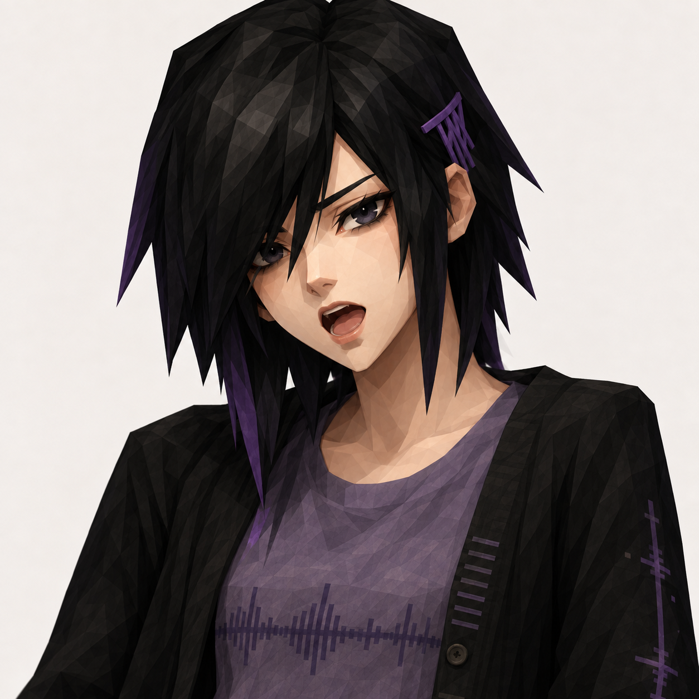

# Character 01 singing-state concept

Status: internal development reference only. This is not a runtime asset, production turnaround, licensed deliverable, or release approval.

- Generated on 2026-09-24 with the built-in image-generation tool, using `key-art-1024.png` as an identity/design reference.
- Output: 1254 × 1254 PNG; SHA-256: `9eaaef1f51be7aaa39aa93d7d541b48ebb57037b9a268093dfbd524b0f8163d5`.
- Intended design use: explore a larger, readable performance portrait with a clearly open singing mouth, so Character 01 is visibly tied to vocal performance rather than appearing only as a static status badge.
- Not wired into the app. Existing runtime portrait and mouth assets remain unchanged.
- The generated image is a concept direction only. Before shipping, it needs first-party redraw/model work, character/IP and provenance review, artist agreement, and runtime-state asset production under the project's asset pipeline.

Prompt summary: preserve the supplied original virtual singer's dark long hair, black clothing, restrained violet accents, and low-poly-inspired visual language; create a centered head-and-shoulders portrait actively singing with a naturally open mouth; use a plain warm-neutral studio backdrop; no text, interface, watermark, logo, extra character, microphone, or instrument.
