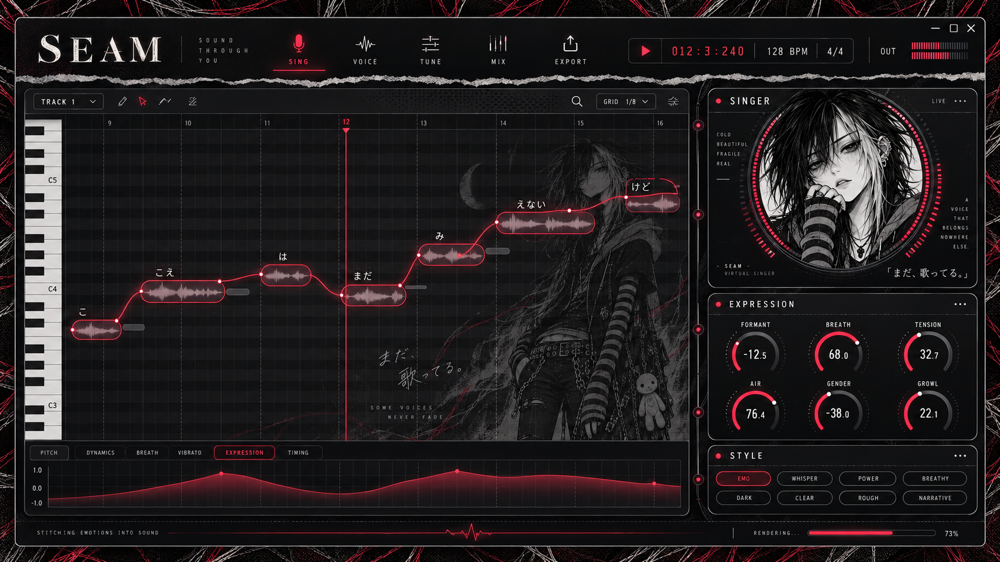
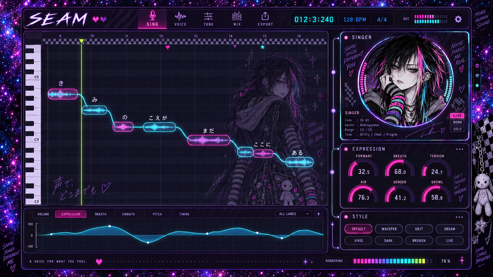
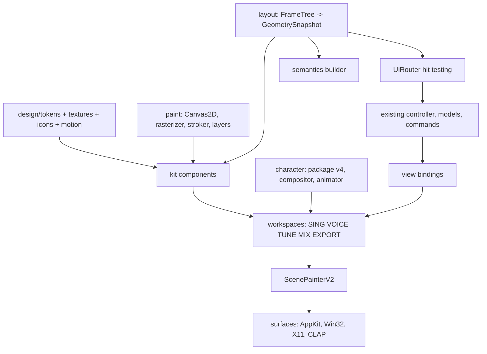

# Project SEAM UI redesign — code-level implementation plan

> **Implementation authority:** read [the source-reviewed fidelity specification](SEAM_UI_FIDELITY_REVIEW_2026-09-25.md) and [the canonical geometry contract](ui-fidelity-contract-v1.json) first. The owner approved both concepts. The fidelity specification replaces this draft's renderer decision, geometry/type sizes, Cocoa scale policy, memory/determinism claims, pitch/PCM bindings, character migration contract and delivery order. This document remains a component/workspace inventory; its illustrative APIs and estimates are not implementation acceptance.

This document turns the Emo/Scene visual direction into buildable work. It specifies the rendering engine, design tokens, component kit, layout engine, five workspaces, the protagonist system, motion, platform surfaces, accessibility, tests and a PR-sized migration order. Every component is tied to a real data source in the current code so the new interface cannot become a decorative shell over missing behavior.

## 0. Visual targets and what they mean

Two concept frames were generated from the protagonist sheet and the owner's references (premium modular synthesizer and mixing plug-ins):

- 
- 

They are **mood and composition targets, not pixel specifications.** Keep from them:

1. The header with a wordmark, five icon workspace tabs, a glowing tabular transport readout and output meters.
2. The piano roll with capsule notes, lyric above each note, rendered waveform inside the note and one continuous glowing pitch curve.
3. The right-hand module rack: a SINGER card whose portrait sits inside a ring meter, an EXPRESSION card with six arc knobs and large numeric values, a STYLE card with chips, and a signal rail with node dots connecting the cards.
4. The tabbed lane with a filled, glowing curve.
5. The translucent full-body protagonist behind the notes, and mode-specific backgrounds (red ink threads for Emo, neon glitter for Scene).
6. The status bar with a mode-specific render meter (heartbeat line for Emo, bracelet segments for Scene).

Change from them:

| Concept artifact | Rule |
|---|---|
| Invented slogans ("SOUND THROUGH YOU", "SOME VOICES NEVER FADE", handwriting outside the window) | Forbidden in the app. Visible prose is real state, real labels or real instructions. At most one owner-approved, localized line on the splash screen. |
| Invented singer metadata ("Code SE-01", "Tone: Gritty") | Replace with real voicebank fields (Section 7.1). |
| Invented style chips (WHISPER, POWER, DREAM) | Chips come only from the selected voicebank's real `styles` list. |
| LIVE / NORM / SOLO buttons on the singer card | Replace with the real character display mode switch (Stage / Full / Minimal / Off) and "Change voice". |
| Background figure at roughly 30–40% opacity | Stage figure is 16% at rest and 6% when notes or the pointer enter it (Section 8.4). |
| Lanes named DYNAMICS, BREATH, VIBRATO, TIMING | Lane tabs follow the real model: PITCH, the six expression channels, PHONEME, UNIT, SEAM (Section 7.1). |
| Decoration outside the window frame | Everything decorative lives inside the window; the outside of the concept is presentation only. |

## 1. Design principles

1. **The voice is the hero.** Notes, the pitch curve and the singer get the strongest light. Chrome recedes.
2. **Depth from light, not boxes.** Surfaces separate by gradient, a 1 px highlight and soft glow. Hard rectangles and heavy borders are removed.
3. **One accent per meaning.** In each mode a color means one thing (selection, curves, time). Color never carries meaning alone.
4. **Readable density.** Minimum 10 px text, 24 px hit targets, 8 px spacing grid. Dense like a synthesizer, never cramped.
5. **Truthful UI.** Every number, chip, meter and character state reflects real application state. A refused control shows its refusal; nothing fakes activity.
6. **The character is the soul, not wallpaper.** She reacts to real render and playback state and never blocks editing.
7. **Mode is attitude, structure is shared.** Emo and Scene change tokens, textures, icon variants, meters and outfits. Layout, interaction and data are identical.

## 2. Target architecture



The rule that keeps this safe: **layout produces one GeometrySnapshot per frame, and paint, hit testing and accessibility all read it.** Today the same rule exists informally through `EditorSceneLayout` helpers; the redesign makes it structural.

New directories (all under `libs/seam-native-ui/`):

    include/seam/native_ui/paint/      canvas2d.hpp path.hpp rasterizer.hpp stroker.hpp paint_style.hpp
                                       image_rgba.hpp effects.hpp layer_cache.hpp
    include/seam/native_ui/design/     tokens.hpp textures.hpp icons.hpp motion.hpp fonts.hpp
    include/seam/native_ui/layout/     widget_id.hpp frame_tree.hpp geometry_snapshot.hpp breakpoints.hpp
    include/seam/native_ui/kit/        card.hpp knob.hpp readout.hpp slider.hpp chip.hpp button.hpp
                                       segmented.hpp tab_bar.hpp transport_display.hpp level_meter.hpp
                                       render_meter.hpp signal_rail.hpp tooltip.hpp popover.hpp
                                       scroll_view.hpp text_field.hpp
    include/seam/native_ui/character/  package_v4.hpp compositor.hpp animator.hpp singer_ring.hpp stage.hpp
    include/seam/native_ui/workspaces/ shell.hpp sing.hpp voice.hpp tune.hpp mix.hpp export.hpp overlays.hpp
    src/...                            matching .cpp files
    src/ui_router.cpp                  pointer/keyboard dispatch over the snapshot
    src/scene_painter_v2.cpp           frame composition and layer caching

The existing `EditorScenePainter` (`editor_scene.cpp`, 2,344 lines) stays behind a switch until parity (Section 13), then is deleted.

## 3. Paint engine (`paint/`)

### 3.1 Why a new layer

`RasterCanvas` (`pixel_surface.hpp:65`) can fill and stroke axis-aligned rectangles, draw Bresenham lines, vertical gradients, nearest-neighbor images and text. None of the target visuals (arcs, capsules, curves, glow, patterns, transparent art) can be expressed. The new `Canvas2D` draws into the same `PixelSurface` so the platform presenters, text engine and screenshot tooling keep working.

### 3.2 Surface and color

- Keep 32-bit BGRA, switch the working format to **premultiplied alpha** for layers. The final window surface stays opaque.
- `struct ColorF { float r, g, b, a; }` for gradient math; convert to 8-bit only when writing pixels.
- Blending: source-over on premultiplied values; add `BlendMode::Add` (glow) and `Screen` (holographic sheen). Nothing else.

### 3.3 API

```cpp
namespace seam::native_ui::paint {

enum class FillRule { NonZero, EvenOdd };
enum class LineJoin { Round, Miter, Bevel };
enum class LineCap { Butt, Round, Square };
enum class BlendMode { SourceOver, Add, Screen };
enum class Sampling { Nearest, Bilinear };

class Path final {
public:
  Path& moveTo(ui::Point p);
  Path& lineTo(ui::Point p);
  Path& quadTo(ui::Point c, ui::Point p);
  Path& cubicTo(ui::Point c1, ui::Point c2, ui::Point p);
  Path& arc(ui::Point center, double radius, double startRad, double sweepRad);
  Path& close();
  static Path roundedRect(ui::Rect r, double radius);
  static Path roundedRect(ui::Rect r, std::array<double, 4> radii);  // tl tr br bl
  static Path circle(ui::Point c, double radius);
  static Path capsule(ui::Rect r);
  [[nodiscard]] ui::Rect bounds() const noexcept;
};

struct Stroke final {
  double width{1.0};
  LineJoin join{LineJoin::Round};
  LineCap cap{LineCap::Round};
  std::vector<double> dash;   // stitched seams, empty = solid
  double dashOffset{0.0};
};

struct GradientStop final { double offset; Color color; };
struct LinearGradient final { ui::Point from, to; std::vector<GradientStop> stops; };
struct RadialGradient final { ui::Point center; double radius; std::vector<GradientStop> stops; };
struct ConicGradient final { ui::Point center; double startRad; std::vector<GradientStop> stops; };
struct PatternFill final { const ImageRGBA* tile; ui::Point origin; double opacity{1.0}; };
using Brush = std::variant<Color, LinearGradient, RadialGradient, ConicGradient, PatternFill>;

struct Glow final { double radius; Color color; };  // drawn under the shape

class Canvas2D final {
public:
  Canvas2D(PixelSurface& target, double scale, text::TextEngine* text) noexcept;
  void save(); void restore();
  void clipRect(ui::Rect r);
  void clipPath(const Path& p);                 // mask clip, used for rounded panels
  void translate(double dx, double dy);
  void setOpacity(double a);
  void setBlend(BlendMode m);

  void fill(const Path& p, const Brush& b, FillRule rule = FillRule::NonZero);
  void stroke(const Path& p, const Stroke& s, const Brush& b);
  void glow(const Path& p, const Glow& g);       // cached blurred coverage
  void drawImage(const ImageRGBA& img, ui::Rect dst, Sampling s = Sampling::Bilinear,
                 double opacity = 1.0, std::optional<Color> tint = {});
  void drawText(ui::Rect bounds, std::string_view utf8, const TextSpec& spec, const Brush& b);
  void drawLayer(const Layer& layer, ui::Point at, double opacity = 1.0);
  RasterCanvas& legacy();                        // bridge during migration
};
}
```

### 3.4 Algorithms

- **Rasterizer**: signed-area coverage accumulation (the approach used by modern font rasterizers). Edges are converted to **fixed point 24.8** before accumulation so output is bit-identical across compilers and CPUs; the existing visual packets rely on identical hashes. Curves flatten with a tolerance of 0.2 physical px. Coverage is accumulated into a reusable per-canvas scanline buffer; no allocation per shape after warm-up.
- **Stroker**: flatten, then offset each segment by ±width/2 with round/miter/bevel joins and caps, emitting a closed polygon filled with NonZero. Dashes split the flattened polyline by arc length first. Hairlines below 1 physical px render as 1 px with coverage scaled by width, so 0.5 px grid lines stay faint instead of disappearing.
- **Gradients**: evaluated per pixel in linear float, 8-bit dithered with a fixed 4×4 ordered matrix to prevent banding in dark glass gradients (banding is very visible on #0B0A0C backgrounds).
- **Glow**: render the shape's coverage into an A8 mask at 1/2 resolution, three box-blur passes (approximating a Gaussian), upsample bilinear, composite with Add. Cache key: path hash, radius, scale. Knob arcs change value often, so knob glow uses an analytic falloff along the arc instead of blur (distance to arc, smoothstep), which is exact and cheap.
- **Images**: `ImageRGBA` is premultiplied BGRA with width, height and an optional mip chain built on load when downscaling beyond 2×. Bilinear sampling for art; nearest only for pixel-art motifs in Scene mode.
- **Determinism**: compile `paint/` with `-ffp-contract=off` (Clang/GCC) and `/fp:precise` (MSVC); no platform intrinsics until the scalar path is proven. SIMD may come later behind a hash-equivalence test.

### 3.5 Image format for character art

Add a bounded **QOI** decoder (`src/paint/qoi_decoder.cpp`, about 200 lines, MIT reference algorithm reimplemented): header check, declared-size limit before allocation (same `maximumAssetBytes` policy as `character_presentation.cpp:55`), exact byte accounting, rejection of trailing garbage, conversion to premultiplied. PPM stays readable for old packages.

### 3.6 Text

The existing `TextEngine` stays. Extend `TextStyle` (`libs/seam-text/include/seam/text/text_engine.hpp:40`) with:

```cpp
enum class FontRole : std::uint8_t { Ui, UiMedium, UiSemibold, Display, Mono, Pixel };
struct TextStyle final {
  float pixelHeight{14.0F};
  float letterSpacing{0.0F};
  float lineSpacing{1.20F};
  std::uint32_t maximumWidth{0U};
  std::size_t maximumLines{1U};
  bool ellipsize{false};
  FontRole role{FontRole::Ui};        // new
  bool tabularNumbers{false};         // new
};
```

Fonts load through `TextEngine::createFromTrustedFiles` with a role map; CJK falls back to system faces through the existing search. Bundled faces must be OFL or similarly licensed, listed in third-party notices, and never named in the UI. The cache key already includes the style, so roles cache separately.

## 4. Design tokens (`design/`)

### 4.1 Structure

```cpp
namespace seam::native_ui::design {
enum class DesignMode : std::uint8_t { Emo, Scene };
enum class Contrast : std::uint8_t { Standard, High };

struct ColorRoles final {
  Color canvas, surface, surfaceRaised, surfaceSunken, border, borderStrong;
  Color textPrimary, textSecondary, textDisabled, textOnAccent;
  Color accent, accentDeep, accentCurve, accentTime, accentAlt1, accentAlt2;
  Color gridWeak, gridStrong, keyWhite, keyBlack, keyLabel;
  Color noteFill, noteFillAlt, noteStroke, noteSelectedA, noteSelectedB, noteText, phonemeText;
  Color waveInNote, pitchCurve, pitchGlow, laneFillTop, laneFillBottom;
  Color knobTrack, knobBody, knobPointer, meterLow, meterMid, meterHigh;
  Color focusRing, selectionFill, warning, error, success, info;
};
struct TypeScale final {
  TextToken display{FontRole::Display, 24, 1.5}, title{FontRole::UiSemibold, 13, 1.4},
            body{FontRole::Ui, 12, 0}, label{FontRole::UiMedium, 11, 0.4},
            micro{FontRole::UiMedium, 10, 0.8}, readoutL{FontRole::Mono, 20, 0},
            readoutS{FontRole::Mono, 11, 0}, knobValue{FontRole::UiSemibold, 16, 0};
};
struct ShapeTokens final { double rNote = 5, rControl = 6, rCard = 10, rHero = 14, hairline = 1; };
struct LightTokens final { double glowSmall = 6, glowMedium = 12, glowLarge = 24;
                           double glowAlphaRest = 0.18, glowAlphaActive = 0.38;
                           double highlightAlpha = 0.07; };
struct MotionTokens final { std::chrono::milliseconds fast{90}, base{150}, slow{250}; };
struct Skin final { KnobSkin knob; MeterSkin renderMeter; RailSkin rail; IconVariant icons;
                    TextureSet textures; CharacterOutfit outfit; };
struct DesignTokens final { DesignMode mode; Contrast contrast; ColorRoles color; TypeScale type;
                            ShapeTokens shape; LightTokens light; MotionTokens motion; Skin skin; };

[[nodiscard]] const DesignTokens& tokensFor(DesignMode, Contrast) noexcept;
[[nodiscard]] EditorSceneTheme legacyThemeFrom(const DesignTokens&) noexcept;  // migration bridge
}
```

### 4.2 Values

Emo (standard): canvas #0B0A0C, surface #141216, surfaceRaised #1C1A1F, surfaceSunken #09080A, border #2E2A31, textPrimary #EDE8E3, textSecondary #9C9499, accent #D1143A, accentDeep #7A0C22, accentCurve #F2EEEA with glow #D1143A, accentTime #FF2D4F, accentAlt1 #B8BCC6 (steel), noteFill #1E1417, noteStroke #5A2630, noteSelected #D1143A→#8E0F2A, waveInNote #EDE8E3 at 55%, knobTrack #2A262D, knobBody radial #221E25→#141216, warning #E0A040, error #FF3355, success #B8D0C0.

Scene (standard): canvas #0D0716, surface #170E24, surfaceRaised #22123A, surfaceSunken #0A0512, border #3A2358, textPrimary #FFF4FB, textSecondary #C9A8D8, accent #FF2E9A, accentDeep #B0156A, accentCurve #1DE9FF, accentTime #B8FF3B, accentAlt1 #9B5CFF, accentAlt2 #FFE14D, noteFill #2A1540→#3A1A4F, noteSelected #FF2E9A→#9B5CFF with #1DE9FF 1 px outline, waveInNote #FFF4FB at 50%, knobTrack #2E1C46, warning #FFE14D, error #FF4D6D, success #7CFFB2.

High Contrast (both modes): textures and glow off, borders to #8A8A8A (Emo) or #B99AD6 (Scene), secondary text raised to at least 7:1, curves 2.5 px.

Track colors: Emo cycles red, steel, bone, ember (#C8553D), ash (#6F6A73); Scene cycles pink, cyan, lime, violet, sun ("bracelet stack"). Track color is presentation only.

### 4.3 Preference, not project data

`DesignMode` and `Contrast` persist with the application preferences beside `AccessibilityPreferences` (`libs/seam-platform/include/seam/platform/accessibility_preferences.hpp`), read by standalone and CLAP. They never enter the project file, render identity or cache keys. Test: toggling mode leaves project bytes and `requestedRevision` unchanged.

### 4.4 Procedural textures (`design/textures.cpp`)

All textures are generated in code from fixed seeds, so they are original, resolution-independent and hash-stable:

| Texture | Mode | Recipe |
|---|---|---|
| Ink threads | Emo | 180 cubic strands from a seeded flow field, 0.6–1.4 px, red #D1143A and bone at 6–18% alpha, rendered once per window size into the background layer. This is the concept's red fiber background. |
| Halftone | Emo | Dot grid 6 px pitch, radius driven by a radial falloff, 4% alpha, in empty areas only. |
| Torn edge | Emo | Seeded jittered polyline under the header, 3 px amplitude, bone at 70%. |
| Stitches | Emo | Dash [5, 4], 1.5 px, round caps, used for dividers and the signal rail. |
| Glitter field | Scene | 1,400 seeded points, 60% 1 px dots and 40% 4-point stars, colors from pink/cyan/violet/white, 10–40% alpha. |
| Zebra | Scene | Sine-warped stripe mask on header and card headers, 5% alpha. |
| Checker strip | Scene | 4 px checker along the ruler top, #FFF4FB at 12%. |
| Pixel icons | Scene | Hearts and stars drawn on a 7×7 grid, nearest sampling. |

## 5. Layout engine (`layout/`)

### 5.1 Problem

`EditorSceneLayout` (`editor_scene.hpp:315` onward) holds about 300 hand-placed constants, and `editor_controller.cpp` (6,965 lines) calls layout helpers in 181 places. Any new layout would scatter new constants the same way.

### 5.2 FrameTree

```cpp
namespace seam::native_ui::layout {
enum class Axis : std::uint8_t { Row, Column, Overlay };
struct Size final { enum class Kind { Fixed, Fill, Hug } kind; double value{0}; double min{0};
                    double max{std::numeric_limits<double>::infinity()}; };
struct Insets final { double top{0}, right{0}, bottom{0}, left{0}; };
struct FrameNode final {
  WidgetId id;
  Axis axis{Axis::Column};
  Size width{Size::Kind::Fill}, height{Size::Kind::Fill};
  Insets padding; double gap{0};
  std::function<bool(const Breakpoint&)> visible;   // responsive rules
  bool interactive{false}; std::int32_t z{0};
  std::vector<FrameNode> children;
};
struct GeometrySnapshot final {
  [[nodiscard]] std::optional<ui::Rect> find(WidgetId id) const noexcept;
  [[nodiscard]] std::optional<WidgetId> hitTest(ui::Point p) const noexcept;  // topmost interactive
  std::vector<std::pair<WidgetId, ui::Rect>> ordered;  // paint order
};
[[nodiscard]] GeometrySnapshot solve(const FrameNode& root, ui::Size viewport, double scale);
}
```

The solver is a two-pass fill/hug distribution (a small subset of flexbox), deterministic and O(n). `WidgetId` is `struct { WidgetKind kind; std::uint32_t index; }` so repeated items (knobs, chips, tracks) are addressable.

### 5.3 Breakpoints

| Breakpoint | Width | Behavior |
|---|---|---|
| Wide | ≥ 1360 | Rack 340 px, arrangement strip visible, stage allowed |
| Standard | 1100–1359 | Rack 300 px, arrangement collapsed to 36 px summary |
| Compact | 860–1099 | Rack becomes an icon rail (56 px) with popover cards; stage off |
| Minimum | 720–859 | Header tabs icon-only, lane area 96 px max; CLAP minimum 720×480 |

Height: below 720 px the lane area shrinks to 88 px and the arrangement strip hides.

### 5.4 Migration bridge

`EditorSceneLayout` methods that the controller already calls keep their signatures and read from the snapshot (`return snapshot_.find({WidgetKind::TimeMapOpen,0}).value_or({})`). This lets `editor_controller.cpp` migrate gradually; new widgets go through `UiRouter` (Section 6.2).

## 6. Component kit (`kit/`)

### 6.1 Contract every component follows

```cpp
struct KnobSpec { ui::ExpressionChannel channel; std::string_view label; std::string_view unit;
                  float min, max, neutral, step; bool bipolar; KnobSize size; };
struct KnobState { float value; bool enabled; bool hovered, pressed, focused;
                   std::string_view refusal; std::optional<Color> automationTag; };
struct KnobGeometry { ui::Rect bounds, dial, valueText, label, tag; ui::Point center; double radius; };

[[nodiscard]] KnobGeometry knobGeometry(ui::Rect slot, const KnobSpec&) noexcept;       // pure
void paintKnob(paint::Canvas2D&, const KnobGeometry&, const KnobSpec&, const KnobState&,
               const design::DesignTokens&) noexcept;                                    // pure
void describeKnob(SemanticBuilder&, WidgetId, const KnobGeometry&, const KnobSpec&, const KnobState&);
class KnobGesture;  // begin / move / commit / cancel -> produces exactly one undoable command
```

Each component = pure geometry, pure paint, semantic description, and a gesture object. Paint never mutates, gestures never paint.

### 6.2 UiRouter

`src/ui_router.cpp`: on pointer down, `snapshot.hitTest` selects a `WidgetId`; the router owns the active gesture until pointer up; keyboard focus follows `FocusOrder` built from the snapshot. The piano roll content area delegates to the existing note-editing code in `editor_controller.cpp`, which keeps all note, vibrato, box-selection and lyric-editing behavior.

### 6.3 Component specifications

**ModuleCard.** Radius 10. Header 32 px: status dot 6 px (accent when the card's subject is active), title in `title` caps with 1.5 tracking, optional view chips (e.g. "CURVE | AT PLAYHEAD"), overflow button 24×24. Body padding 12. Fill: linear gradient surfaceRaised (top) → surface (bottom); 1 px border at 70%; 1 px top inner highlight white at 7%. Focused/editing: border accent at 60% + glow 12 px at 0.18. Left port: 8 px circle at header center for the signal rail. Emo adds a dashed stitch divider under the header; Scene adds a 5% zebra mask in the header and an iridescent conic-gradient border on the SINGER card only.

**ArcKnob.** Sizes S 32, M 48, L 72 (dial diameter). Sweep 270° from 135° to 405° (y-down, clockwise), bipolar channels fill from the neutral angle (top) toward the value. Track stroke 3 px (M) knobTrack; value arc 3 px accent with analytic glow 6 px; body circle radius = dial/2 − 7 with radial gradient knobBody and 1 px top highlight; pointer: Emo a 2 px bone line from 0.45r to 0.8r, Scene a 3×3 pixel square at 0.75r. Value text centered inside the dial: integer part `knobValue` 16 px, decimals `readoutS` 11 px baseline-aligned (the concept's "68.0"); unit on hover. Label above in `micro` caps. Automation tag: 14×8 pill below the dial in the lane color when the channel has stored points; clicking it opens that lane. Refused: arc hidden, body 40% opacity, value "—", tooltip with the exact refusal string from the lane, still focusable and announced.
Interaction: vertical drag, 240 px = full range; Shift = 0.1×; double-click or Option-click = neutral; wheel = one `step` per notch; Cmd/Ctrl-click opens an inline numeric field (existing `beginTextInput` path); arrows = step, PageUp/PageDown = 10 steps, Home/End = min/max; Escape during drag cancels and restores. One gesture = one undo entry.

**ValueReadout.** Large number with small decimals (concept "24 .0000" style), tabular figures, unit in micro text. Used in cards and the VOICE workspace.

**MiniSlider.** 4 px track, 10 px thumb, value text right-aligned; used for dense parameter lists (frication, modulation).

**Chip / Segmented / Button / IconButton.** Heights 24 (chip, segmented) and 28 (button). Selected chip: accent fill at 22% + accent border + textPrimary; hover: border brightens; disabled: 40% with tooltip reason.

**WorkspaceTabBar.** Five tabs, 64×44 each, icon 20 px + `micro` label. Active: icon and label in accent, 2 px accent underline with glow, background accent at 8%. Keyboard: Cmd/Ctrl+1…5.

**TransportDisplay.** Sunken LCD panel 200×36: play/stop icon button, position "BBB:B:TTT" in `readoutL` accent-time color with ghost "888:8:888" segments at 7% behind it, BPM and meter in `readoutS`. Emo digits red; Scene digits cyan with lime BPM and the Pixel font role. Click BPM or meter to edit (existing tempo/meter edit paths).

**LevelMeter.** Two channels × 20 segments, 3 px wide, peak hold 1 s, falloff 20 dB/s, colors meterLow/Mid/High. Source: output peak published from the audio callback through a lock-free atomic per block (add to the playback engine if absent; the UI polls at 30 Hz only while playing).

**RenderMeter.** Bound to `RenderStatusView` (`render_status_panel.hpp:22`): `fraction`, `completedPhrases/totalPhrases`, `audibleAudioStale`. Emo: a heartbeat line that scrolls while rendering, pulses once on completion, and flatlines on error. Scene: 24 bracelet segments filling left to right in the track color cycle, sparkle burst on completion. Both show "RENDERING 12/18 · 67%" text; Reduce Motion shows a static bar.

**SignalRail.** Vertical 1.5 px line 14 px left of the rack with node dots at card ports. Meaning: the singing chain, singer → expression → style → output. Nodes fill when their stage is current for the audible revision; during rendering a 24 px light segment travels down at 120 px/s. Emo draws the rail as stitches.

**Tooltip / Popover.** Radius 8, surfaceRaised, 12 px glow at 0.18, 400 ms hover delay, never covers the element under the pointer.

**ScrollView.** Overlay scrollbars 6 px, appear on scroll or hover, used by the rack and lists.

**Icons.** Original 24-px-grid path set in `design/icons.cpp` as constexpr command arrays, 1.75 px stroke, round caps: sing (microphone), voice (waveform), tune (sliders), mix (faders), export (tray arrow), play, stop, loop, pencil, select, split, erase, grid, zoom, search, settings, overflow, chevrons, plus mode glyphs (Emo: cracked heart, safety pin, stitched X; Scene: pixel heart, pixel star, sparkle). No icon may resemble a third-party logo.

## 7. Workspaces

The header and status bar are shared. Tabs switch workspaces without reloading the project; the piano roll keeps its scroll and zoom across tabs.

### 7.1 SING (default)

    ┌ header: SEAM mark · SING VOICE TUNE MIX EXPORT · transport · meters ─────────────┐
    ├ editor toolbar: track ▾ · tools · grid ▾ · search ──────────────┬ rack ───────────┤
    │ ruler (Scene: checker strip, markers)                          │ SINGER card     │
    │ keys │ piano roll: capsule notes, lyric, phoneme, waveform,   │ EXPRESSION card │
    │      │ pitch curve, vibrato, stage figure                     │ STYLE card      │
    ├ lane tabs: PITCH · FORMANT BREATH TENSION AIR GENDER GROWL ·   │ (NOTE card when │
    │ PHONEME · UNIT · SEAM                                          │  notes selected)│
    │ lane: filled curve / phoneme / unit / seam editor              │                 │
    ├ status: render meter · diagnostics · export ───────────────────┴─────────────────┤

Bindings:

| Element | Source |
|---|---|
| Notes, lyrics, selection, hover, overlap badges | `ui::PianoRollModel`, `EditorSceneState` note fields, `note_visual_layout` |
| Phoneme tag under each note | `EditorSceneState::phonemes` |
| Waveform inside notes | New `PcmEnvelopeCache` owned by the authoring runtime: min/max per 256 samples of the published PCM, keyed by audible revision. Paint only reads it. Hidden while `audibleAudioStale` with a subtle "stale" hatching. |
| Pitch curve | Existing `pitch_contour` output plus `pitchAutomation` points |
| Lane tabs and curves | `ExpressionLaneView` and `describeExpressionChannel` (Formant, Breathiness, Tension, Airiness, Gender, Growl); PHONEME/UNIT/SEAM use the existing technical lane models |
| SINGER card | `VoiceIdentityView` (state, name, recovery), selected `authoring::VoicebankCard` (displayName, version, language, `rootPitchLayers` → range "C3–C5", `styles` count, trustLabel), `characterPerformance` (energy, mouth), portrait from Section 8 |
| EXPRESSION card knobs | Six `ExpressionChannelDescriptor`s; value = `valueAtPlayhead`; refusal = lane refusal string. Gesture: with notes selected, one undoable command writes a flat segment across the selection's time span; with nothing selected, it writes one point at the playhead. |
| STYLE card chips | Selected voicebank `styles`; selected = track style; disabled if `styleEditable` is false |
| NOTE card (appears with a selection) | Vibrato knobs from `domain::NoteVibrato` (depthCents, periodMilliseconds, startFraction, fadeInFraction, fadeOutFraction), lyric field, pitch, duration |
| Render meter, rail | `RenderStatusView` |

Note capsule recipe: height = row height − 4, radius min(5, h/2); fill noteFill gradient; 1 px noteStroke; lyric in `label` above the capsule when row height < 22, inside otherwise; phoneme tag in `micro` under the capsule at 70%; waveform: symmetric min/max envelope clipped to the capsule, waveInNote color; selected: noteSelected gradient, 1 px outline (Scene cyan), glow 10 px at 0.38; hovered: border +20% brightness. The pitch curve is one continuous 2 px stroke across notes with a 6 px glow; draggable pitch points appear on hover.

### 7.2 VOICE (synth-style voice creation)

This is where the owner's "carve a voice like a synthesizer" goal lives. It rebuilds the keyboard-list Voice Designer (`VoiceDesignerSession`, `voice_designer_layout.hpp`, recipe fields in `libs/seam-voice-design/src/voice_recipe.cpp`) as a three-channel module rack in the spirit of the modular reference:

    ┌ SOURCE ──────────────┐ ┌ RESONANCE ─────────────────────┐ ┌ NOISE ──────────────┐
    │ Phonation            │ │ Pose chips: a i u e o (+ add)   │ │ Frication list      │
    │  OPEN Q  TILT  ASPIR │ │ Spectral envelope editor:       │ │  CENTER BW GAIN     │
    │ Modulation           │ │  draggable formant peaks F1–F5  │ │  seed (exact field) │
    │  PITCH¢  AMP  RATE   │ │  nasal coupling knob            │ │                     │
    └──────────┬───────────┘ └───────────────┬─────────────────┘ └──────────┬──────────┘
               └──────────── signal rail ─────┴──────── OUTPUT: audition ▶ A/B · level ┘
    Singer hero (center-left): the protagonist in "listening" pose inside the ring meter,
    ring driven by audition output level.

- Knobs bind to `phonation.openQuotient`, `spectralTiltDbPerOctave`, `aspiration`, `modulation.jitterCents` (label "PITCH DEPTH ¢"), `shimmerAmount` ("AMP DEPTH"), `rateHz`, and per-pose resonance and nasal coupling; all edits go through existing session validation, undo and preview invalidation.
- The spectral envelope editor is a new component: log-frequency x axis 80 Hz–8 kHz, dB y axis, the envelope computed from the pose's resonances, each formant a draggable handle (drag = frequency/gain, Shift-drag = bandwidth). It replaces the most tedious rows of the current list.
- Save/Save As/Open, duplicate/remove pose, add/remove frication and seed dialogs keep their existing commands and appear as card overflow actions.
- The standalone hosts this workspace directly; the Voicebank Studio app uses the same components.

### 7.3 TUNE

Full-height expression editing: all expression lanes stacked as overlapping colored curves on one large graph (select a channel via its knob), the pitch lane with drawn pitch points, and the NOTE card vibrato editor enlarged with a live vibrato preview curve. Macro strip at the bottom: the six expression knobs at size S for quick reach.

### 7.4 MIX

Channel strips per track: name, color, gain fader, pan knob, mute/solo, output route selector (existing Phase 12B project commands), plus a master strip with LevelMeter. Audio device settings (`AudioSettingsView`) move here as a card. The arrangement strip is shown full width above the strips.

### 7.5 EXPORT

Card with range, format (PCM16/PCM24/Float32), stems/master, destination, progress (`authoring::ExportProgress`) and the committed receipt (`lastExport`). The protagonist "complete" pose appears after a successful export.

### 7.6 Existing overlays re-homed

| Current overlay | New home |
|---|---|
| Sample Microscope | Large popover sheet (radius 14, sunken plots, accentCurve waveform, conic heat colormap per mode) |
| Phoneme review | Popover anchored to the phoneme lane |
| Time map panel | Popover from the transport display |
| Replacement review | Sheet from the SINGER card overflow |
| Recovery / support | Settings sheet |
| Diagnostics strip | Toast stack above the status bar + DIAGNOSTICS popover; the protagonist's warning/error pose appears in the toast |
| Export progress strip | Status bar segment + EXPORT workspace |
| Overlap detail | Popover anchored to the +N badge |
| Lyric editor | Inline text field on the note using the kit's TextField skin |

## 8. The protagonist system (`character/`)

### 8.1 Character Package v4

```json
{
  "schemaVersion": 4,
  "characterId": "official.character.01",
  "version": "0.2.0",
  "voicebankId": "official.voice.01",
  "developmentOnly": true,
  "outfits": {
    "emo":   { "accentPrimary": "#D1143A" },
    "scene": { "accentPrimary": "#FF2E9A", "accentSecondary": "#1DE9FF" }
  },
  "portraits": { "emo/neutral": "portrait/emo-neutral.qoi", "...": "6 states x 2 outfits" },
  "stage": {
    "emo":   { "layers": ["stage/emo-body.qoi", "stage/emo-head.qoi", "stage/emo-hair-front.qoi"],
               "eyes": { "open": "...", "half": "...", "closed": "..." },
               "mouths": { "closed": "...", "narrow": "...", "nasal": "...", "open": "...",
                           "wide": "...", "round": "..." },
               "anchors": { "eyes": [0.46, 0.14], "mouth": [0.47, 0.18] } },
    "scene": { "...": "same shape" }
  },
  "poses": { "empty": "poses/seated.qoi", "error": "poses/head-in-hand.qoi",
             "complete": "poses/soft-smile.qoi", "listening": "poses/listening.qoi" },
  "splash": { "emo": "splash/emo.qoi", "scene": "splash/scene.qoi" }
}
```

The loader validates every referenced file, declared dimensions and byte limits before decode, keeps v2/v3 loading for old packages, and keeps the existing rule that character data never affects rendering or cache identity.

### 8.2 Asset inventory

| Asset | Size at 2× | Count |
|---|---|---|
| Ring portrait (square, transparent) | 512×512 | 6 states × 2 outfits = 12 |
| Stage figure layers (body, head, hair front) | 900×1600 | 3 × 2 outfits |
| Eyes open/half/closed | per anchor box | 3 × 2 |
| Mouths | per anchor box | 6 × 2 |
| Poses (seated, head-in-hand, soft smile, listening) | 800×800 | 4 × 2 |
| Header avatar | 64×64 | derived from ring portrait |
| Splash key art | 1600×1000 | 2 |

Art rules: redraw from the reference sheet at 4× in the ink style; replace the sneaker star ankle patch and brand-like toe/sole design with an original stitched-seam mark; no readable real logos; record provenance and rights in `assets/character-01/PROVENANCE.md` first.

### 8.3 Animator (`character/animator.cpp`)

States from `VoiceIdentityState` and render/playback status:

| State | Trigger | Visual |
|---|---|---|
| Idle | ready, not playing | open eyes, blink every 4–7 s (seeded), 0.25 Hz breathing drift of 2 px |
| Listening | VOICE audition playing | listening pose on the hero ring |
| Singing | transport playing and `characterPerformance.performing` | half-lidded eyes, mouth from `characterPerformance.mouth` each frame, ring from `energy` |
| Rendering | `RenderStatusState::Rendering` | focused face, ring segment spinner |
| Complete | render complete | soft smile 1.5 s, then Idle |
| Warning | `VoiceIdentityState::Warning` or stale audio | side-glance face held |
| Error | error or `BANK_MISSING` | head-in-hand pose until cleared; recovery action in the SINGER card |

Reduce Motion: no blink, breathing or ring animation; states still change; mouth shows a single static shape while singing. Animation ticks only run while something animates; idle blink repaints only the avatar and ring rectangles.

### 8.4 Surfaces

- **SingerRing** (SINGER card and VOICE hero): circular clip of the portrait, ring of 64 ticks around it. Emo: thin red ticks, lit count from energy. Scene: segments cycling pink/cyan/lime/violet. Ring color tints by state (warning amber, error red).
- **Stage** (piano roll, SING only): figure drawn into the grid layer below notes and curves, bottom-right anchored, height 78% of the roll. Opacity 16% at rest, 6% when any visible note or the pointer intersects its bounds, 180 ms fade. Off below the Standard breakpoint, when a lane is expanded, in High Contrast, or when the user turns it off. Never hit-testable; not in the accessibility tree.
- **Header avatar**: 28 px circle with a state ring.
- **Empty project**: seated pose centered with "Double-click the grid to write the first note."
- **Error toasts**: 40 px head-in-hand crop.

## 9. Motion (`design/motion.hpp`)

An `Animator` driven by the existing injectable UI clock (`EditorHostCallbacks::uiClock`, `editor_controller.hpp:169`) holds tweens keyed by `WidgetId` with easing (`easeOutCubic`, `easeInOutSine`, `smoothstep`). The frame loop requests a repaint only while at least one tween or live meter is active.

| Motion | Duration | Notes |
|---|---|---|
| Tab switch | 150 ms | cross-fade of the workspace layer, 8 px slide |
| Card focus glow | 90 ms | |
| Knob value while dragging | none | direct, no easing |
| Note add | 120 ms | scale 0.92→1 + glow flash |
| Render complete sweep | 250 ms | light sweep across rendered notes |
| Mode switch | 200 ms | background layer cross-fade, tokens swap at midpoint |
| Stage dim | 180 ms | |
| Toast in/out | 150 / 120 ms | |

Reduce Motion maps every duration to zero and disables travelling lights, particles and blink.

## 10. Frame pipeline and performance

`ScenePainterV2` composes four cached layers:

| Layer | Contents | Invalidated by |
|---|---|---|
| L0 background | canvas fill, procedural texture, panel chrome, card backgrounds | window size, scale, mode, contrast |
| L1 grid | ruler, keys, grid lines, stage figure | scroll, zoom, size, stage state |
| L2 content | notes, waveforms, pitch curve, lanes, card contents | project revision, selection, audible revision, scroll, zoom |
| L3 dynamic | playhead, meters, hover, focus, gestures, character mouth, tweens | every animated frame |

Only L3 repaints during playback; its dirty rectangles are the playhead strip, meters, ring and hovered widget.

Budgets (Apple Silicon, 1440×900 logical at 2×):

| Case | p95 budget |
|---|---|
| Cold full frame (all layers) | 14 ms |
| Scroll or zoom frame (L1+L2+L3) | 8 ms |
| Playback frame (L3 only) | 3 ms |
| Existing 10,000-note benchmark, both modes, glow on | 8 ms |
| Layer cache memory | ≤ 80 MB |

Extend the existing paint benchmark with these cases and fail the test above budget.

## 11. Platform surfaces

1. **CLAP on macOS (blocker, first PR).** `embedded_view_appkit.mm:247` draws without the vertical flip used in `native_window_appkit.mm:499`; add the same `CGContextTranslateCTM`/`CGContextScaleCTM` pair. `updateSurface()` (`:452`) sizes the surface with host scale × backing scale but `draw()` (`:221`) builds the canvas with host scale only; pass the effective scale. Default CLAP size 1280×800 (currently 1100×720 in `plugin_entry.cpp:36`); minimum stays 720×480 with the Minimum breakpoint.
2. **Presenters.** AppKit, Win32 and X11 present the final opaque BGRA surface unchanged; only layers use premultiplied alpha.
3. **CLAP layout.** Arrangement hidden (the host owns it); rack collapses one breakpoint earlier; workspace tabs remain.
4. **Window chrome.** Native title bars stay; the header draws below them.

## 12. Accessibility and semantics

- Each component's `describe*` function writes to the existing semantic tree (`editor_semantics.cpp`): knobs and sliders as sliders with value, range, unit and step; chips as radio buttons; tabs as a tab list; cards as groups labeled by title; the render meter as a progress indicator; the SINGER card announces the voice identity state and recovery action.
- Focus order follows the snapshot: header → toolbar → piano roll → lane → rack cards top to bottom → status.
- Focus ring: 2 px focusRing with a 6 px glow, offset 2 px, always visible for keyboard focus.
- Automated contrast test over painted text regions for both modes and both contrast variants (4.5:1 body, 3:1 large text and graphics).
- The stage figure and textures are decorative and excluded.

## 13. Migration order (PR-sized)

Each step keeps the app working. `SEAM_UI_V2` (hidden preference plus environment variable) selects the new shell until step 21.

| Step | Content | Est. days | Exit check |
|---|---|---|---|
| 1 | CLAP flip and scale fix; raise sub-10 px fonts | 1 | FL Studio F03 PASS at 1× and 2× |
| 2 | Paint core: Path, fixed-point rasterizer, solid fills, rounded rects, circles | 2 | coverage tests, determinism hash ×2 |
| 3 | Stroker, dashes, arcs, cubic flattening | 1.5 | stroke-width and join tests |
| 4 | Gradients with dithering, patterns, ImageRGBA, bilinear, QOI decoder | 1.5 | decoder fuzz and limit tests |
| 5 | Layers, clip stack, glow, layer cache | 1.5 | cache invalidation tests |
| 6 | Tokens, both modes, High Contrast, preference, legacy theme bridge, mode switch | 2 | contrast tests; project bytes unchanged |
| 7 | Font roles, bundled faces, tabular numbers | 1.5 | text metrics tests |
| 8 | FrameTree, GeometrySnapshot, UiRouter, semantics adapter (no visual change) | 3 | existing native UI suite passes unchanged |
| 9 | Kit 1: Card, Button, Chip, Segmented, TabBar, Tooltip, Popover, ScrollView, icons | 2.5 | component tests, gallery screenshot |
| 10 | Kit 2: ArcKnob, ValueReadout, MiniSlider, TransportDisplay, LevelMeter, RenderMeter, SignalRail | 3 | gesture/undo tests, gallery |
| 11 | SING shell: header, tabs, rack, capsule notes, pitch curve, lane tabs | 5 | parity checklist rows for SING |
| 12 | PcmEnvelopeCache and waveform-in-note | 1.5 | stale/revision tests |
| 13 | Character v4 loader, compositor, SingerRing, avatar, animator | 3 | package validation tests |
| 14 | Stage mode, empty and error poses | 1.5 | stage dim and hit-test exclusion tests |
| 15 | Procedural textures and mode motifs, motion system | 2.5 | hash stability, Reduce Motion tests |
| 16 | Re-home overlays (Section 7.6) | 3 | parity checklist |
| 17 | TUNE workspace | 2.5 | |
| 18 | MIX workspace | 2 | |
| 19 | EXPORT workspace | 1 | |
| 20 | VOICE workspace with spectral envelope editor | 4 | designer session tests pass through new UI |
| 21 | CLAP compact layout, Win32/X11 parity, remove legacy painter and `SEAM_UI_V2`, update design docs | 3 | full suites, FL rerun F02–F05, visual packet review |

The estimates in this historical inventory are withdrawn as a schedule. Use units A–E in the fidelity specification: correct presentation, then prove the native SING design in both modes before expanding to the other workspaces. Windows remains TODO and is not a prerequisite for the macOS proof.

Parity checklist (none may be lost): note create/move/resize/delete, box selection, overlap badge and detail, lyric editing and batch lyrics, vibrato handles, phoneme boundary edit, unit variant and renderer selection, seam edit and alternate preview, pitch points, expression lanes with refusal, technical lane collapse/expand, time map, tempo and meter edit, loop, bounce timing choice, sample microscope, phoneme review, replacement review, voicebank browser, relink and replace, audio settings, recovery/support, diagnostics with actions, export with receipt, character Full/Minimal/Off, accessibility tree and keyboard paths.

## 14. Verification

1. **Paint unit tests**: circle and rounded-rect coverage area within 0.5% of analytic area; stroke width measured within 0.25 px; gradient endpoints exact; glow energy within 2%; identical hashes on two runs.
2. **Component tests**: geometry for every size; one undo entry per gesture; Escape cancel restores; refused knob shows refusal and rejects edits; chips reflect real styles only.
3. **Layout property tests** over sizes from 720×480 to 3840×2160 and scales 1, 1.5, 2: no overlap between interactive widgets; every text either fits (measured with `TextEngine::measure`) or is ellipsized with full text exposed semantically; minimum 24 px hit targets.
4. **Visual packets**: {Emo, Scene} × {Standard, High} × {Wide, Standard, Compact, Minimum} × {1×, 2×} × {empty, dense song, selection, rendering, error}, reproduced twice with identical hashes, plus a per-pixel tolerance diff (max delta 2, ≤ 0.1% pixels) for cross-platform comparison.
5. **Performance gates** from Section 10.
6. **Brand check**: `scripts/check_brand_terms.py` over assets, strings, manifests and installer metadata in source-contract tests; art review checklist for logos.
7. **Real host**: FL Studio rows F02–F05 in both modes, with screenshots.
8. **Design review rubric** (owner, then one independent reviewer), scored 1–5: hierarchy, readability, consistency, character integration, mode identity, premium and futuristic feel, truthfulness of displayed state. Pass: average ≥ 4 and no score below 3.

## 15. Risks

| Risk | Mitigation |
|---|---|
| Software rendering too slow at 4K | Layer caching, dirty rectangles, half-resolution glow, SIMD later behind hash tests |
| Cross-platform hash drift | Fixed-point rasterizer, disabled FP contraction, tolerance diff for cross-platform packets |
| Controller migration breaks behavior | Snapshot bridge keeps old call sites; parity checklist; existing 425-test native suite must stay green at every step |
| Art not ready | Kit, layout and workspaces proceed with the development portrait; v4 packages marked `developmentOnly` |
| Scene mode becomes noisy | Texture alpha caps (≤ 8%), one accent per meaning, rubric review of both modes |
| Brand leakage in art | Brand check script plus mandatory art review before assets enter `assets/` |

## 16. Definition of done

Both modes pass the rubric; SING, VOICE, TUNE, MIX and EXPORT are complete with the parity checklist; the protagonist appears in ring, stage, avatar, poses and splash with real state; all tests and budgets pass; FL Studio shows an upright, readable, themed editor; legacy painter removed; `NATIVE_EDITOR_DESIGN_SYSTEM.md` and the character bible updated to describe the shipped system.
