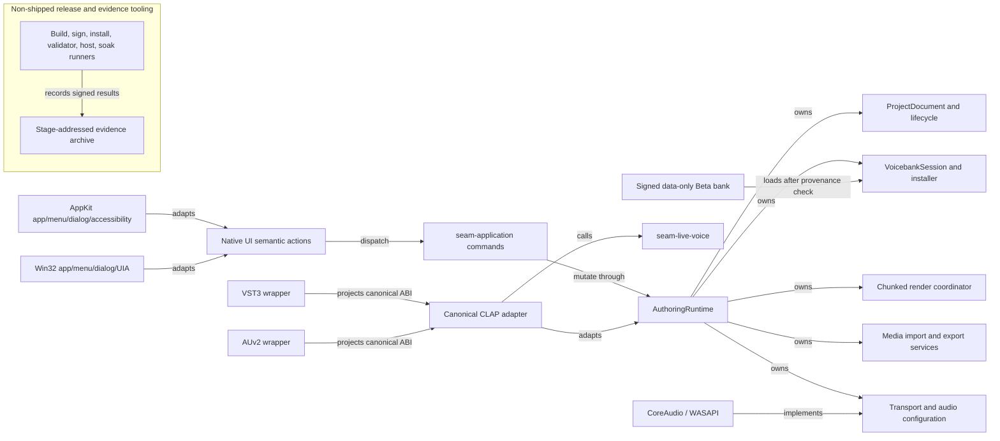
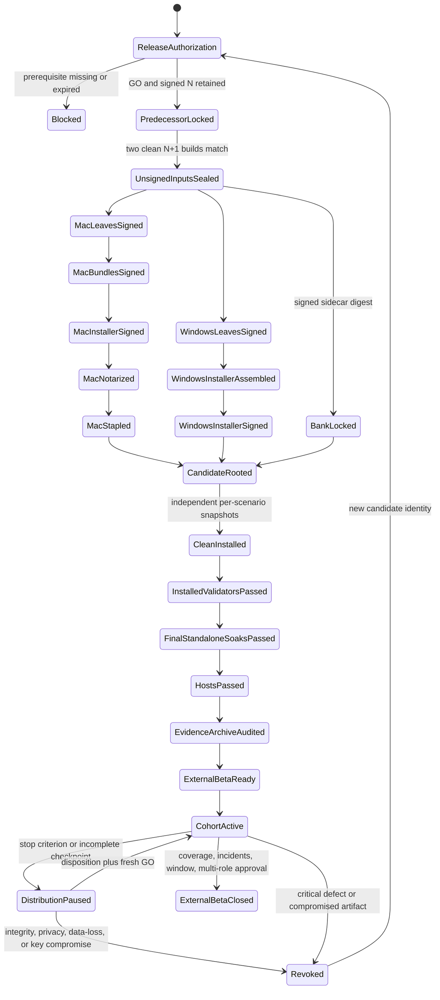
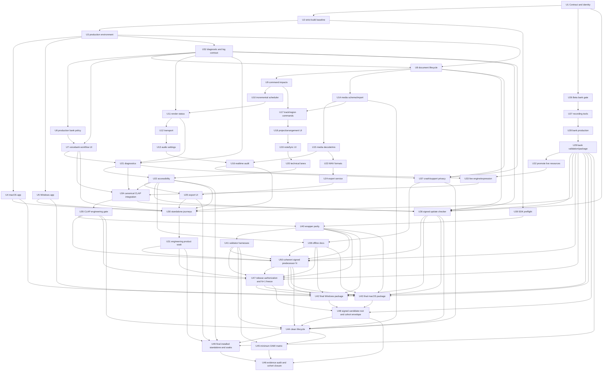

# Project SEAM External Beta Completion - Plan

## Goal Capsule

Complete Project SEAM as a closed External Beta that an invited musician can install, launch, use offline, and evaluate on Apple Silicon macOS or Windows x64 without a command line. The delivered product includes the standalone authoring application, a rights-cleared Beta Voicebank, canonical CLAP, projected VST3 and AUv2 formats, signed/notarized installers, recovery/export/support flows, and evidence from official validators plus the minimum REAPER, Bitwig Studio, and Logic Pro host matrix.

Completion means one immutable candidate has been built, signed, installed on clean target systems, exercised through real-song standalone and DAW journeys, and accepted by the fail-closed `EXTERNAL_BETA_READY` gate. It does not mean Commercial GA: Official Voicebank 01, final Character IP/trademark/assets, storefront/payment operations, public auto-update, and the full G4 commercial-host matrix remain separate work.

### Baseline Truth

- Repository baseline: `master` at `d59e5246136e09518c54c67b55642903a25a2106`, with no configured remote.
- Product status: legacy milestones U0-U3 services exist, but the canonical gate remains `G1_FEATURE_ALPHA` and every `UA-001` through `UA-020` row is still `NOT_RUN` or `BLOCKED`.
- Verified module evidence: the focused legacy milestone U3 suite passes 12/12 and render-coordinator coverage passes 7/7; these prove services, not a complete user journey.
- First code blocker: AppleClang 17 rejects the current AppKit/CoreAudio sources under the repository's strict warnings-as-errors policy.
- First product blocker: the native target is a plain executable, production startup still allows development-bank behavior, user-facing relink/replace/coverage and recovery paths are incomplete, and Export returns `Unsupported`.
- Plug-in blocker: Phase 12C is linked into the canonical editor plug-in, but `LiveVoiceEngine` is not in the actual process path; the plug-in still renders through `LiveSampleInstrument`.
- Release blocker: Phase 13A runtime rows are unexecuted, wrapper/installer versions drift, AUv2 has a C++20/C++23 toolchain conflict, Windows emits a deprecated single-file VST3 layout, and current installers omit the standalone product.

## Product Contract

### Actors

- **A1 - External Beta musician:** installs the product, creates songs, edits technical singing data, uses a DAW, exports audio, recovers work, and submits optional diagnostics.
- **A2 - Beta voice provider / voicebank producer:** records or licenses source material, prepares metadata and markers, resolves retakes, and supplies rights evidence without exposing private contracts in the repository.
- **A3 - Release engineer:** builds one candidate, manages signing credentials, runs validators and clean-machine scenarios, and preserves the immutable evidence chain.
- **A4 - DAW QA operator:** executes the named host/format matrix against exact installed hashes and records raw logs, projects, bounces, screenshots, and failures.
- **A5 - Beta support responder:** receives user-approved diagnostic bundles, triages defects, manages workarounds and revocations, and protects local project/voice data.
- **A6 - Independent release verifier:** receives sealed candidate artifacts without source/signing credentials, attests clean-machine/install evidence, and independently approves or rejects terminal release rows.

### Product Decisions

- **PD1 - External Beta is the completion target.** (session-settled: user-directed — chosen over stopping at Usable Alpha or extending to Commercial GA: the deliverable must be testable by external users across the target app and plug-in surfaces without pulling in GA-only content/IP.) Governs R1-R36.
- **PD2 - The Beta is closed and invite-only.** Compatibility claims are limited to the exact OS, architecture, host, format, and version tuples that have retained PASS evidence. Governs R1, R29, R32, R35.
- **PD3 - Local-first operation is mandatory.** Accounts, activation, background telemetry, crash upload, and network availability cannot gate create/edit/hear/save/recover/export. Governs R5, R7, R31-R33.
- **PD4 - GA identity work is not a Beta dependency.** The Beta bank is explicitly non-official; Character 01 is optional presentation and never required for audio, accessibility, or diagnostics. Governs R6, R21-R23, R36.

### Scope

#### In Scope

- Apple Silicon macOS standalone, CLAP, VST3, and AUv2 delivery.
- Windows 11 x64 standalone, CLAP, and VST3 delivery.
- Linux x64/arm64 build, CLAP validator, sanitizer, and 7,200-second soak regression; no public Linux installer promise.
- Complete native standalone authoring journey: project lifecycle, bank lifecycle, arrangement, note/lyric/technical editing, backing-media import, production playback, audio settings, autosave/recovery, and master/stem export.
- One rights-cleared, signed, non-official Beta Voicebank and a checksum-locked acceptance song.
- Signed/notarized installers, manual signed update checking, rollback-safe full-package upgrades, uninstall, local crash/support bundles, offline documentation, and accessibility semantics.
- Official format validators plus the minimum host matrix: REAPER and Bitwig Studio on macOS/Windows for every supported CLAP/VST3 tuple, and Logic Pro on macOS for AUv2.

#### Explicitly Deferred

- Official Voicebank 01 and its Phase 13B `official=true` / `contractedSinger=true` gate.
- Final Character 01 identity, trademarks, 3D assets, marketing rights, and performer-character association.
- Storefront, billing, licensing server, activation, entitlement, public CDN, analytics, or growth operations.
- Public self-updating/patching; the Beta checker may verify and stage a full signed package but does not mutate a running install.
- Cloud rendering, cloud storage, collaborative editing, neural waveform generation, or executable voicebank extensions.
- Compressed backing-media import and RF64 export; External Beta accepts bounded PCM WAV input and rejects any single RIFF output beyond the 32-bit format limit at preflight.
- Full G4/Commercial GA matrix beyond REAPER, Bitwig Studio, and Logic Pro.
- A UI framework rewrite, Skia/iPlug2 migration, or GPU renderer replacement unless a measured Beta-blocking defect invalidates the first-party shell.

### Requirements

#### Truth, Identity, and Platform Baseline

- **R1 - Fail-closed Beta contract:** `EXTERNAL_BETA_READY` and `EXTERNAL_BETA_CLOSED` are machine-enforced states distinct from G3/G4; no row passes from source presence, workflow configuration, or another platform/format's evidence.
- **R2 - Single release identity:** application, CLAP descriptor, wrappers, bundles, installers, update manifests, support bundles, and evidence records derive product version/build identity from the existing generated build-version authority and include source commit plus stage-addressed artifact identity; independently versioned project/bank/state/update/support/evidence schemas keep explicit owners and compatibility ranges.
- **R3 - Strict target builds:** the repository builds with warnings-as-errors on Apple Silicon macOS, Windows x64, and Linux regression configurations without suppressing first-party warnings or treating third-party headers as first-party.
- **R4 - Production defaults:** release builds launch stopped, deny development fixtures, never silently bind the first bank, never treat a deterministic clock as physical audio, and resolve resources/settings/logs from platform application paths.
- **R5 - Native application lifecycle:** both standalone apps provide native launch, menu/dialog, reopen, quit, single-instance/file-open, high-DPI, IME, and recoverable startup behavior appropriate to the OS.

#### Project, Voicebank, Render, and Audio

- **R6 - Exact voicebank lifecycle:** install, provenance revalidation, trust, select, relink, replace, coverage, quarantine/removal, and error UI preserve exact `(id, version, contentHash)` synthesis identity plus signed installed-tree provenance; one `(id, version)` may map to only one content hash, mutable receipts are never trust authority, and conflicting content cannot overwrite an installed bank.
- **R7 - Durable document lifecycle:** New/Open/Save/Save As/dirty-close/external-change/autosave/crash-recovery/migration are explicit state machines that persist base-hash recovery lineage, manage the user-facing `.seam` manifest and owned-media set as a recoverable project transaction, and never discard or overwrite the last durable copy after failure.
- **R8 - Incremental render intent:** every command declares whether it is view-only, metadata-only, phrase-audio, track-mix, or project-audio affecting; non-audio changes never schedule synthesis.
- **R9 - Responsive render scheduling:** ordinary audio-affecting edit bursts debounce for 20 ms, while explicit initial render, bank replacement, device/sample-rate change, and final export bypass debounce; scheduling expands to deterministic dirty phrases, prioritizes playhead then visible phrases, replaces superseded per-phrase work in bounded queues, performs disk-cache I/O off the submission path, publishes structurally shared timeline chunks rather than flattened full-project PCM, rejects stale publication, and exposes phrase-level progress plus queue/cache/copy metrics.
- **R10 - Audible render state:** the UI distinguishes Idle, Queued, Rendering, Ready, Stale, Failed, and Cancelled; previous valid PCM may remain audible only with a visible stale label, while no valid PCM yields silence and an actionable diagnostic.
- **R11 - Complete transport:** Play, Pause, Stop, Seek, Loop, ruler interaction, disabled-state reasons, and restart preservation operate on the canonical production timeline within negotiated device-period latency bounds; high-rate seek/loop input coalesces latest-wins without losing ordered play/timeline transitions.
- **R12 - Real audio configuration:** target apps enumerate physical output devices and negotiated sample rate/buffer/channels, report actual underrun/xrun counters, support controlled restart with rollback, and expose explicit `AudioUnavailable` versus test fallback state.
- **R13 - Durable backing media:** PCM WAV import supports reference or project-owned copy mode, SHA-256 identity, explicit legacy-ownership migration, missing-media relink versus replace, recoverable Save As/autosave project-set transactions, checked pre-allocation limits, chunk-streamed off-callback decode/resample, deduplication, and canonical routing/mix playback within one process-level byte budget.
- **R14 - Realtime safety:** callbacks allocate no memory, acquire no locks, perform no file/network/logging work, and publish deterministic silence plus counters on underflow; feeder/callback/reset-epoch ownership remains intact.

#### Editing, Diagnostics, Accessibility, and Export

- **R15 - Arrangement commands:** tracks and regions can be added, renamed, duplicated, moved, resized, deleted, mixed, routed, selected, and undone without losing nested musical or technical data.
- **R16 - Practical authoring UI:** New Project, arrangement, inspector, note/lyric entry, batch lyrics, phoneme boundaries, unit choices, pitch points, seam parameters, and Sample Microscope are reachable without source JSON or CLI.
- **R17 - Actionable diagnostics:** stable diagnostic codes cover project, bank, render, media, device, persistence, recovery, export, plug-in, update, and install failures; each exposes only valid recovery actions.
- **R18 - Accessible product surface:** custom controls expose platform semantic trees, roles, names, values, states, actions, focus, and change events; the canonical journeys pass keyboard-only, visible focus, VoiceOver, Narrator/UIA, scaling, contrast, and non-color status checks.
- **R19 - Transactional export:** final-quality master and selected stems stream from an immutable revision with exact bank/media identities into a managed same-volume export-set directory; a durable receipt/ownership manifest is the commit marker, prior committed sets survive a journaled replace, and startup reconciliation resolves every interrupted staging/publish/rollback state without exposing a mixed set.
- **R20 - Production WAV outputs:** PCM16, PCM24, and Float32 WAV support 1-8 channels, finite/clamped samples, correct RIFF sizing, and external metadata/sample verification.

#### Beta Voicebank and Live Plug-in

- **R21 - Rights-cleared Beta bank:** one voicebank has explicit performer/license consent for recording, transformation, redistribution, and user-created audio; public metadata contains redacted evidence hashes, not private contracts.
- **R22 - Data-only hostile-input boundary:** bank packages contain no executable content and validate a portable injective archive namespace before extraction: traversal, links/reparse points, canonical escape, invalid UTF-8, Unicode/case aliases, reserved/trailing-dot-space names, prefix conflicts, excessive file/expanded size, nesting/path length, unsafe JSON, and declared/actual PCM mismatches fail within measured memory/time/disk/cancellation budgets.
- **R23 - Reproducible bank production:** deterministic prompt inventory, recording/session logs, marker and pitch QA, retake closure, coverage, renderer listening, package signing, clean install, and reference-song receipts form a separate Beta gate without weakening Phase 13B.
- **R24 - Canonical live engine:** the actual CLAP process path uses the promoted live-voice engine and trusted selected bank resources; embedded development audio and `LiveSampleInstrument` are absent from release processing.
- **R25 - Expressive host behavior:** live MIDI/note input, CLAP note expression, pitch bend, pressure/expression mapping, articulation, transport discontinuities, state, offline bounce, and at least 32 concurrent voices are deterministic and realtime-safe; off-thread indexes make callback cost independent of bank inventory, 1,024 events per block have a deterministic overflow/no-stuck-note contract, and target-machine deadline headroom is measured before canonical integration.
- **R26 - CLAP engineering gate:** the exact canonical bundle passes pinned clap-validator normal/pedantic coverage, bounded fuzz/cancellation/GUI lifecycle matrices, 336-case processing coverage, and the unmodified 7,200-second full soak.

#### Formats, Distribution, Operations, and Evidence

- **R27 - Wrapper parity:** pinned clap-wrapper projects the canonical CLAP state and behavior into modern package-shaped VST3 and AUv2; the C++23 Apple wrapper boundary remains behind the C CLAP ABI while core code stays C++20.
- **R28 - Official validators:** exact installed CLAP/VST3/AUv2 artifacts pass the pinned official validators and official VST3 test hosts on applicable target systems; raw output and tool identities are retained.
- **R29 - Signed complete installers:** Windows signs every PE payload plus installer with SHA-256/RFC3161; macOS signs leaf-to-container with hardened runtime, Developer ID Application/Installer, notarizes with `notarytool`, staples the delivered package, and includes standalone, plug-ins, notices, manual, privacy/support material, and bank trust metadata.
- **R30 - Install/update/uninstall safety:** fresh install, same-version repair, a real signed coherent predecessor N to N+1, cancelled/failed upgrade, normal downgrade rejection, narrowly authorized repair, uninstall, and reinstall are tested from independently attested clean snapshots; persistent read/write compatibility protects projects, banks, autosaves, settings, and host state, while stale host-loadable binaries are removed.
- **R31 - Manual signed updates:** an offline-safe checker verifies role-separated root/channel trust, monotonic metadata epoch, candidate digest, and a sealed full-package handoff; the privileged installer revalidates the same object/publisher/candidate before mutation, requires explicit user action, closes app/hosts, and restores N or proves a pre-authorized signed repair path after failure.
- **R32 - Local crash/support privacy:** bounded local reports and support bundles are deny-by-default and field-typed at event creation; raw log lines, stderr, error context, dumps, lyrics/audio/bank content/full paths/environment are excluded by default, local-private and export-safe stores are separate, preview identifies the exact exported bytes, and nothing uploads without per-report consent.
- **R33 - Beta documentation and response:** bundled EULA, privacy notice, user manual, known limitations, support/export instructions, security contact, severity policy, and revocation/rollback playbook are reachable offline in both apps.
- **R34 - Minimum DAW matrix:** REAPER and Bitwig Studio cover installed CLAP/VST3 on macOS and Windows where each host supports the format; Logic Pro covers installed AUv2 on macOS; every tuple covers scan, load, GUI, live input, transport, save/reopen, bounce, unload, update rescan, and uninstall rescan.
- **R35 - Immutable stage lineage and evidence:** one candidate root is a manifest-of-manifests whose authorized transformation graph links reproducible unsigned payloads, signed leaves/bundles, signed/notarized/stapled deliverables, and installer-owned installed trees; provenance-signed, role-appropriate evidence records exact stage hashes, toolchains, signing/notary data, machine/host versions, raw artifacts, privacy class, producer/reviewer, and an externally anchored archive locator.
- **R36 - Beta closure quality:** one rights-cleared 45-60 second canonical song passes final signed-installed standalone journeys/soaks and every host tuple with zero known Blocker/Critical defects and only non-core-flow Major waivers; closure additionally requires at least one independent external A1 completion per target OS, one external completed session for every claimed host tuple, terminal disposition of every pseudonymous cohort assignment, all checkpoints/incidents resolved, and multi-role approval after the evaluation window.

### Key Flows

- **F1 - Install and first launch:** acquire and verify the signed per-OS cohort envelope -> install -> disable network -> launch -> accept EULA independently from privacy choices -> configure audible device -> review/install/select the adjacent exact Beta-bank sidecar -> reach a stopped responsive editor.
- **F2 - Author, hear, save, recover, export:** choose an authoritative `.seam` project location -> arrange vocal/backing tracks -> enter lyrics and technical edits -> render/play/seek/loop -> save the project set recoverably -> recover a lineage-aware dirty copy after forced crash -> reopen identically -> publish a committed master/stem export set -> verify externally.
- **F3 - Voicebank lifecycle:** inspect signed package -> validate license/trust/bounds -> transactional install -> exact select -> coverage -> Missing/VersionMismatch/ContentMismatch/Untrusted recovery -> relink exact identity or deliberately replace the project reference.
- **F4 - Plug-in host journey:** host scan -> instantiate canonical/projected format -> select or recover the exact installed bank inside the embedded editor -> play live input and timeline -> automate/expression -> save host project -> quit/reopen -> recover a missing bank through the documented standalone handoff/refresh -> offline bounce -> unload -> rescan after update and uninstall.
- **F5 - Update, crash, privacy, support:** operate offline -> manually check signed update -> install or roll back -> preserve user data -> recover after crash -> preview/redact/export/delete report -> optionally submit diagnostic bundle.
- **F6 - Candidate promotion:** release authorization -> coherent signed predecessor N -> two reproducible unsigned N+1 payloads -> sealed stage-lineage root -> platform signing/notarization -> signed cohort envelopes -> independent clean install -> installed validators/standalone/accessibility/soaks -> DAW matrix -> provenance/evidence audit -> fail-closed ready gate -> cohort distribution.
- **F7 - Cohort closure:** monitor explicit pseudonymous assignments/checkpoints -> receive consented reports -> reproduce against candidate/bank hashes -> pause or revoke on stop criteria -> burn down Blocker/Critical issues -> publish limitations/workarounds -> disposition every assignment/incident -> mark `EXTERNAL_BETA_CLOSED` only from the machine-enforced coverage and multi-role approval.

### Acceptance Examples

- **AE1 - First launch is explicit:** Given a release build with no installed bank and no usable device, when A1 launches offline, then no development bank is selected, playback does not start, `AudioUnavailable` and bank setup are visible, and cancelling either setup leaves a responsive stopped editor.
- **AE2 - Bank identity cannot drift:** Given an installed bank `beta.voice/1.0/hash-A`, when A1 installs `beta.voice/1.0/hash-B`, then installation refuses overwrite, preserves hash-A, explains invalid republishing, and does not mutate open projects.
- **AE3 - Relink and replace differ:** Given a project missing hash-A, when A1 relinks a folder containing hash-A, then the project stays clean; when A1 chooses hash-B as replacement, coverage is previewed and the track change is dirty and Undoable.
- **AE4 - Save failure preserves work:** Given a dirty project whose base hash changed externally or destination/owned-media publication becomes unwritable, when Save or Save As runs, then the durable original project set and source-hash-addressed migration checkpoint remain intact, the in-memory document remains dirty, and Reload/Recover as Copy/Save Copy/Cancel or retry actions are offered without silent overwrite.
- **AE5 - Stale audio is truthful:** Given Ready PCM for revision N, when three audio edits arrive within 20 ms, then only the newest revision renders, previous PCM is labeled Stale, cancelled work never publishes, and Ready N+3 becomes audible atomically.
- **AE6 - Device loss is not simulated success:** Given active playback on a physical device, when the device disappears, then output enters `AudioUnavailable`, musical position is preserved, the deterministic test clock is not reported as audible, and reconnection does not auto-resume.
- **AE7 - Media survives reopen:** Given copied and referenced PCM WAV tracks plus a schema-5 legacy path, when the `.seam` project set is saved or Save-As-moved, reopened on the other target OS, and one reference is missing, then legacy content remains external until explicit ownership choice, copied content resolves by ownership manifest/hash, missing content offers relink/replace, and no whole-file decode/resample occurs in the callback.
- **AE8 - Export recovers as one set:** Given an existing committed export-set directory and unrelated destination canaries, when cancellation, disk-full, locked output, process/power loss, or rollback interruption occurs, then next-launch reconciliation identifies the old committed set, new committed set, or repair-required journal without mixing generations, unrelated files remain byte-identical, and no success receipt exists unless every listed hash matches.
- **AE9 - Host bank and state parity:** Given a signed installed plug-in and no currently resolved bank, when A4 opens the embedded editor, completes the standalone install handoff, refreshes/selects the exact bank, saves, removes/relinks the bank, and reopens the host project, then recovery remains keyboard-accessible and bank identity, notes, expression, parameters, GUI state, and offline-bounce acceptance remain equivalent across canonical CLAP and projected formats.
- **AE10 - Upgrade failure preserves product and readable state:** Given coherent signed predecessor N and candidate N+1, when the upgrade is cancelled/faulted before launch or after N+1 migrates project/autosave/settings/host state, then no mixed tree is host-loadable, the N-readable checkpoint and newer copy are both preserved, and either complete N remains usable or the exact pre-authorized signed repair package restores a known compatible tree.
- **AE11 - Crash data remains local and typed by default:** Given a forced crash whose logs/error context contain project paths, lyrics, environment secrets, host strings, and audio sentinels, when A1 reopens, then recovery and a bounded local-private report appear, the export-safe preview hash matches the final archive, forbidden fields/raw logs are absent, nothing is sent automatically, and link-safe delete/export work offline.
- **AE12 - Accessibility is semantic:** Given the custom canvas at 200% scaling, when A1 uses keyboard plus VoiceOver or Narrator, then focus order, roles, values, state changes, transport, notes, diagnostics, bank selection, recovery, and export are operable without relying on color or pointer input.
- **AE13 - Installed stage lineage is authoritative:** Given a validator PASS for an unsigned/build-tree node or an evidence record whose candidate root, authorized parent edge, final deliverable digest, or installed-tree/plug-in hash differs, when the Beta gate evaluates, then the row remains `NOT_RUN` or `BLOCKED` until the exact installed stage passes with role-appropriate provenance.
- **AE14 - Closure is not inferred from invitation:** Given `EXTERNAL_BETA_READY` and an invited cohort, when a required OS/host assignment is absent, withdrawn/no-show without replacement, an expected checkpoint is missing, or an incident/Blocker/Critical remains unresolved, then distribution pauses or the candidate is revoked and `EXTERNAL_BETA_CLOSED` remains blocked.
- **AE15 - Closure has measurable coverage:** Given the evaluation window has ended, when at least one independent external A1 has completed F1/F2/F5 on each target OS, every claimed host tuple has an external completed session, every pseudonymous participant is Completed/Withdrawn/Disqualified with reason, and A3/A4-or-A6/A5 approvals are present, then and only then may `EXTERNAL_BETA_CLOSED` pass.

## Planning Contract

### Planning Boundary

This plan owns code, content-pipeline tooling, target-runtime verification, packaging, and closed-Beta operations needed for PD1. It does not redefine the synthesis architecture, weaken G4/G5, create a commercial identity, or promise broad compatibility beyond evidence. Rights approval, signing certificates, notarization credentials, clean target machines, DAW licenses, and a consenting voice provider are external execution dependencies; missing credentials block the corresponding gate but do not justify stubs or synthetic PASS records.

### Repository Patterns to Preserve

- Domain and Undoable commands remain in `libs/seam-domain` and `libs/seam-application`.
- `authoring::AuthoringRuntime` remains the shared product state and service facade; AppKit, Win32, and CLAP types do not enter it.
- `StandaloneApplicationController` owns application commands and lifecycle policy; native windows, menus, and dialogs adapt it.
- CLAP remains canonical; VST3/AUv2 are wrapper projections of the exact canonical artifact rather than independent implementations.
- The playback feeder is the only producer, the callback the only consumer, and reset/seek ownership follows the monotonic epoch contract.
- Canonical projects/manifests use the existing same-directory durable atomic-replacement primitive; render PCM and caches remain disposable and content-addressed.
- Voicebanks remain declarative, data-only, untrusted, checksum-bound packages.
- `cmake/SeamBuildVersion.hpp.in` remains the single generated C++ build-version authority; release tooling consumes that identity rather than creating a parallel version header.
- Existing `tests/test_<feature>.cpp`, milestone binaries, source-contract scripts, and machine-readable evidence patterns remain the verification spine.

### Key Technical Decisions

- **KTD1 - Separate Beta gate:** add a non-G-number `EXTERNAL_BETA` contract rather than claiming G3 or weakening G4. Rationale: this target intentionally includes signed formats/installers while excluding G4's Official Voicebank/Character obligations. Governs R1, R35, R36.
- **KTD2 - One generated product identity, separate schema identities:** root CMake version and `cmake/SeamBuildVersion.hpp.in` remain the source for product/build identity consumed by C++, wrapper configuration, packaging, update, and evidence tooling; project, bank, CLAP state, update, support, and evidence contracts retain independent version owners/read ranges. Hard-coded current release versions become contract-test failures. Governs R2, R29, R31, R35.
- **KTD3 - Release/runtime configuration is explicit:** development injection, deterministic audio, and fixture banks remain opt-in test modes; release construction cannot reach them through defaults. Governs R3-R6, R10-R12.
- **KTD4 - Document lifecycle is a lineage-aware project-set state machine:** durable `.seam` manifest hash, source schema, revision, owned-media manifest/generation, autosave base hash, dirty state, active transaction, and external modification determine allowed transitions; mtime is never authority and platform dialogs only present decisions. Governs R7, R13, R19, R30, R31.
- **KTD5 - Command impact drives chunked synthesis:** commands report semantic audio impact, not UI widgets; the runtime converts impacts to dirty phrase/track/bus scopes, replaces superseded work in bounded queues, and publishes an immutable timeline root over structurally shared phrase/backing/master chunks. Interactive publication never flattens/copies the full project timeline. Governs R8-R10, R13-R16.
- **KTD6 - Previous PCM is never ambiguous:** prior audio can continue only as explicitly Stale; failed/cancelled renders never replace valid PCM and absence of valid PCM means silence. Governs R9, R10, R17.
- **KTD7 - Audio restart and control latency are transactional:** derive ring capacity/block/watermarks from negotiated device periods within explicit min/max latency; stop feeder/device, reset and acknowledge epoch, reopen/prebuffer, then commit settings. High-rate seek/loop coalesces latest-wins while ordered state transitions remain intact; failure rolls back. Governs R11, R12, R14.
- **KTD8 - Media schema v6 owns a recoverable project set:** the user-facing `.seam` JSON manifest and adjacent `<name>.seam.media/` ownership directory form one journaled project set. Records store reference/copy mode, normalized logical location, SHA-256, source format, trim, placement, gain/pan/routing; schema-5 paths remain external until explicit Copy, and migration checkpoints are source-hash-addressed and retained until reopen validation. Governs R7, R13, R15.
- **KTD9 - Export commits one managed set:** streaming writers stage a uniquely named same-volume export-set directory. Its ownership manifest/receipt is the commit marker; Replace Set uses a journaled old/new swap, retains the prior committed set until durability, and reconciles abandoned staging/backup/journal states at startup. Loose unrelated files are never part of the transaction. Governs R19, R20.
- **KTD10 - Accessibility is a virtualized adapter over shared semantics:** add a platform-neutral semantic model tied to editor actions, viewport/on-demand semantics for large note/lane collections, then AppKit `NSAccessibilityElement` and Win32 UI Automation adapters; do not fork editor behavior or eagerly materialize 10,000 controls. Governs R16-R18.
- **KTD11 - Beta bank has a separate release dossier:** reuse Phase 13B audit primitives but retain its strict GA assertions unchanged; one `(id, version)` maps to one synthesis hash, and side-by-side versions are retained. Governs R6, R21-R23.
- **KTD12 - Promote, integrate, then delete the Phase 12C prototype:** root CMake solely owns `seam_live_voice` in `libs/seam-live-voice`; the canonical CLAP adapter calls it, while the library imports no CLAP/VST3/AUv2/AppKit/Win32/evidence types. Prove the call path before removing `LiveSampleInstrument` and the prototype-only engine. Governs R24-R26.
- **KTD13 - Wrapper language boundary uses the C ABI:** retain Project SEAM core at C++20, compile the pinned AudioUnitSDK/clap-wrapper boundary as C++23, and communicate through the stable C CLAP ABI. A configure preflight blocks an incompatible toolchain. Governs R27, R28.
- **KTD14 - Windows VST3 uses modern folder packaging:** produce architecture-specific package layout with `moduleinfo.json` and sign the nested PE; single-file output is not authored for Beta. Governs R27-R30.
- **KTD15 - Updates are sealed full-package handoffs:** the app verifies role-scoped root/channel metadata and the candidate package in a newly created user-private, link-safe staging root but never self-patches. The privileged installer independently revalidates file identity, platform publisher, candidate digest, version, architecture, approved roots/ACLs, and no-follow ownership before mutation; normal downgrade is blocked and only a pre-authorized signed repair transition may bypass it. Governs R30, R31.
- **KTD16 - Crash/support collection is typed, deny-by-default, and local:** no telemetry SDK or automatic upload; field export policy is assigned at event creation, raw/free-form logs and error context never become default bundle inputs, local-private and export-safe stores are separate, and preview binds to the final archive manifest/hash. Governs R32, R33.
- **KTD17 - Candidate lineage and evidence are stage-addressed:** one candidate root references a locked bank branch and parallel platform artifact graphs. Reproducible unsigned, signed leaf/bundle, signed/notarized/stapled deliverable, and installer-owned installed-tree hashes are distinct immutable nodes connected only by named authorized transformations. Terminal evidence is separately provenance-signed by its role-appropriate producer, independently reviewed, and anchored in a governed versioned/WORM archive before promotion. Governs R28-R36.
- **KTD18 - Public support claims are evidence-scoped:** public Beta targets Apple Silicon macOS and Windows x64; Linux remains a regression surface, and exact OS/host versions in the cohort are the only supported tuples. Governs R3, R29, R34-R36.
- **KTD19 - Signing trust is purpose-separated and rooted offline:** bank packages, update metadata, candidate attestations/evidence, and platform code signing have non-interchangeable key roles/trust stores. Root-signed policy binds purpose, channel/platform, epoch, validity, compromise cutoff, and delegated keys; only the offline root or a new platform installer rotates/revokes delegated trust. Release tools use external signer handles, not raw private-key files. Governs R6, R21-R23, R29-R32, R35.
- **KTD20 - Installed bank trust is re-derived from provenance:** synthesis `contentHash` may normalize non-audio presentation, but `TrustedInstalled` is derived only from the signed entry manifest, exact no-link installed-tree verification, and current bank-purpose trust policy. Receipts cache non-authoritative facts; tamper/revocation quarantines bytes without deleting projects. Governs R6, R22, R23.
- **KTD21 - Executables install per-machine; user data remains per-user:** the closed Beta uses standard system-wide app/plug-in locations on Windows and macOS so every named host scans one canonical copy. Elevation is explicit and confined to signed installer mutation; projects, banks, settings, autosaves, recovery, reports, and update staging stay in per-user roots and preserve ownership across uninstall. Governs R5, R12, R29-R31.

### High-Level Technical Design

#### Shared Product and Adapter Boundaries



#### Render Change and Publication Sequence

```mermaid
sequenceDiagram
  participant UI as UI / host action
  participant CMD as Undoable command
  participant RT as AuthoringRuntime
  participant SCH as Incremental scheduler
  participant REN as Production renderer
  participant AUD as Realtime publication

  UI->>CMD: execute semantic edit
  CMD-->>RT: new revision plus impact
  alt view-only or metadata-only
    RT-->>UI: update scene; no synthesis request
  else audio-affecting
    RT->>SCH: dirty scope, playhead, visible range
    SCH->>SCH: debounce, replace same-phrase queued work, enforce byte/job bounds
    SCH->>REN: prioritized immutable phrase and affected-bus chunks
    REN-->>SCH: progress or failure for revision
    alt newest complete revision
      SCH->>AUD: atomically swap shared immutable timeline root
    else cancelled, failed, or stale
      SCH-->>UI: retain Stale PCM or expose silence plus diagnostic
    end
  end
```

#### Candidate Artifact Lifecycle



#### Contract Version Ownership

| Contract | Owner / canonical identifier | Writer and supported readers | Future-version and downgrade behavior | Fixture authority |
| --- | --- | --- | --- | --- |
| Product/build identity | U1; root CMake plus `cmake/SeamBuildVersion.hpp.in` | One generated current build identity; runtime/package/evidence readers require exact candidate identity | Product downgrade is installer policy, never schema inference | U1 identity-drift fixtures |
| Project manifest | U8/U14; Project schema 6 | Write 6; read every retained historical fixture through 6 | Future schema refuses without mutation; pre-migration source-hash checkpoint remains reopenable | `tests/fixtures/projects/` |
| Project-media ownership | U14; ownership manifest schema 1 | Write/read 1 and bind to project ID/generation/hash | Unknown version blocks Copy/Save As; external legacy paths remain external | U14 project-set fixtures |
| Voicebank manifest/package/provenance | U26/U29/U6; independent schema fields plus purpose envelope | Write the accepted Beta version; read only explicitly supported data-only versions under current root policy | Future package/manifest rejects; revoked/tampered installation quarantines | U26 hostile and U29 accepted-bank fixtures |
| Canonical CLAP state | U34; state codec version owned by canonical CLAP | Write current; read named prior/current fixtures | Future/corrupt state enters recoverable silence; wrappers transport bytes opaquely and never migrate | U34 old/current/future fixtures |
| Update/trust metadata | U36; root policy and channel manifest schema 1 with monotonic epoch | Write current release metadata; read current plus explicitly retained rotation transition | Replay/clock rollback/unknown schema fails check without blocking authoring; repair authorization is separately scoped | U36 trust/manifest fixtures |
| Diagnostic/support bundle | U52/U37; registry schema and support-bundle schema 1 | Stable diagnostic codes; export-safe bundle reader validates current schema | Unknown fields remain private/ignored only by policy; unknown schema cannot be exported as safe | U52 classification and U37 archive fixtures |
| Candidate/evidence/cohort | U1/U47/U48/U46; candidate/evidence/cohort schema 1 | Append stage/provenance nodes under one candidate root | Records never migrate in place; a new schema or mutation creates a new signed envelope/version | U1 gate and U46 adversarial audit fixtures |

#### Data Ownership and Retention

| Category | Class / owner | Canonical root and migration | Default uninstall | Deletion authority |
| --- | --- | --- | --- | --- |
| `.seam` manifest and owned-media set | Canonical user data / A1 | User-selected project directory; U8/U14 journaled migration | Preserve | Only an explicit project-level action; never installer cleanup |
| Referenced media | External user data / A1 | Outside app ownership, hash-bound only | Preserve | Never deleted by Project SEAM |
| Installed banks | Canonical user-installed data / A1 | Per-user bank root with signed provenance and quarantine | Preserve | Reversible quarantine by bank action; permanent purge is separate and reference-aware |
| Autosaves, recovery, migration checkpoints | Canonical recovery data / A1 | Dedicated recovery root with lineage/generation | Preserve | Recovery UI or category-scoped cleanup after preview/retention rules |
| Settings and recent-project/bank reference registry | Canonical user configuration / A1 | Per-user configuration root, versioned | Preserve | Explicit Reset Settings; never follows links |
| PCM/media/index caches | Disposable derived data / app | Per-user cache root, content-addressed and bounded | May remove | App/installer may clear only exact cache-manifest entries |
| Crash reports/private logs | Sensitive local-private / A1 | User-only no-link report root, bounded by time/count/bytes | Preserve | Previewed per-report/delete-all action; link-safe and category-scoped |
| Export-safe support bundles | User-created sensitive artifact / A1 | User-selected destination with exact archive manifest | Preserve | User only |
| Update downloads/staging | Disposable installer handoff / app | User-private no-link staging root with candidate digest | Remove successful/abandoned owned entries | App cleanup by exact handoff manifest |
| App, plug-ins, helpers, registration | Installer-owned executable data / A3 | Fixed approved platform roots plus ownership manifest | Remove | Signed installer/uninstaller after no-follow/ACL validation |
| Candidate/public evidence | Technical public artifact / A3/A4/A6 | Governed content-addressed versioned/WORM archive | Not local-uninstall data | Retention policy; immutable technical facts |
| Cohort contacts/raw support attachments | Restricted personal data / A5 | Separate access-controlled registry referenced by opaque ID/hash | Not local-uninstall data | Consent withdrawal/retention expiry leaves only non-identifying tombstone |

### System-Wide Impact

- **Persistent data:** Project schema moves from 5 to 6; base-hash recovery lineage, retained migration checkpoints, journaled project/media and export-set transactions, read/write compatibility, CLAP state, bank provenance, and category-scoped ownership are explicit contracts with fixtures.
- **Realtime path:** chunk-root render publication, device-period buffering, chunk-streamed media, 1,024-event live bursts, host transport, state/resource swaps, and typed diagnostics preserve callback ownership. Logging, hashing, decoding, bank parsing, disk-cache I/O, support collection, and resource indexing stay off-callback and within shared byte/job budgets.
- **Platform lifecycle:** Finder/Shell/host launch, reopen/file-open events, DPI/IME, accessibility, device notifications, and package ownership become product behavior rather than build scaffolding.
- **Security:** portable bank namespaces/installed provenance, project/media paths, purpose-scoped signing, sealed update handoff, privileged no-follow installer roots, local-private reports, export-safe bundles, and evidence attestations are trust boundaries. Private keys/rights documents never enter source or candidate bytes.
- **Release truth:** every status document/matrix distinguishes engineering, reproducible unsigned, signed leaf/bundle, notarized/stapled deliverable, installed tree, validator, host, final soak, ready, paused, revoked, and closed. Evidence is producer-signed and externally anchored; recomputing a hash in a mutable checkout cannot preserve PASS.
- **Support and cohort privacy:** stable diagnostic/support schemas classify fields at origin. Public technical evidence, restricted contacts/attachments, and forbidden content use separate stores/retention; withdrawal deletes private payload without rewriting immutable technical facts.

### Dependencies and Risks

| Risk / dependency | Failure mode | Mitigation and owner |
| --- | --- | --- |
| Consenting voice provider and rights review | R21-R23 cannot pass; no legitimate external Beta bank | Start U26-U29 in parallel; A2 supplies immutable raw assets and redacted rights hash; A3 blocks promotion rather than substituting the technical fixture. |
| Apple Developer ID and notarization credentials | macOS package cannot satisfy R29 | Run unsigned engineering gates first, then use scoped CI/keychain credentials; record identity fingerprint and notary IDs, never secret material. |
| Windows code-signing certificate / timestamp service | payload or installer provenance expires or fails | Sign every PE with SHA-256/RFC3161 and retain SignTool verification; keep credentials out of source. |
| Licensed REAPER, Bitwig Studio, Logic Pro and clean systems | host rows remain NOT_RUN | Maintain named target machines/accounts and operator runbook; no CI-source substitute. |
| AudioUnitSDK 1.4.0 C++23 conflict | AUv2 configure/build fails late | U39 preflight proves wrapper-only C++23 boundary before format implementation. |
| Custom UI accessibility workload | visually complete UI remains unusable or a 10,000-note semantic tree stalls | Build virtualized shared semantics in U22 before final export/update surfaces and gate with platform tools/workload traces. |
| Schema/media migration regression | existing projects become unreadable, copied media orphaned, or rollback strands N/N+1 state | Persist recovery lineage, retain source-hash migration checkpoints, use journaled project sets, and verify per-family read/write/downgrade fixtures. |
| Render/media/export amplification | whole-timeline or whole-file copies exceed memory/deadlines at declared workloads | U10/U15/U23 use chunked structural sharing/streaming and shared byte budgets; U31/U49 retain queue/cache/RSS/latency time series. |
| Realtime races/deadline miss | stale PCM, use-after-free, stuck notes, host crash, audible gaps | Preserve epoch/producer-consumer ADRs; capacity benchmarks, sanitizers, allocation probe, cancellation storm, exact soaks, installed-host stress. |
| Signing key or trust-role compromise | a bank/update/evidence key authorizes another protocol or revokes itself | KTD19 root/delegated purpose policy, external signer custody, monotonic epochs, cross-purpose/replay tests, and independent recovery path. |
| Evidence archive or privacy failure | mutable/transient evidence falsely passes or private cohort data becomes public | Governed versioned/WORM archive, producer/reviewer separation, public/restricted/forbidden classes, restore/rehash rehearsal, withdrawal/retention tests. |
| Release authorization missing | candidate is burned without keys, predecessor N, clean systems, cohort/support, or rollback readiness | V-1 is a hard GO/NO-GO owned by A3 and independently checked by A6; no candidate ID/signing begins while any prerequisite is absent/expired. |
| No configured Git remote | governed source, target workflows, and durable evidence publication cannot be proven | This is a V-1 STOP. Local engineering may proceed, but no candidate ID or R28-R36 PASS exists until governed source plus restorable evidence destination are named. |

### Dependency Graph



## Implementation Units

### Unit Index

| Unit | Outcome | Primary dependencies | Gate advanced |
| --- | --- | --- | --- |
| U1 | Machine-enforced Beta, schema, trust, evidence, and workload contracts | None | Truth baseline |
| U2 | Strict cross-platform compile baseline | U1 | Target build |
| U3 | Production environment, paths, and release-safe defaults | U2 | Runtime baseline |
| U4 | Launchable Apple Silicon development app bundle | U3 | macOS feasibility |
| U5 | Launchable Windows x64 standalone parity | U3 | Windows feasibility |
| U52 | Typed diagnostic/log registry and export classification | U3 | Cross-flow error contract |
| U6 | Exact production voicebank provenance/reference/removal policy | U52 | Legacy milestone U3 policy closure |
| U7 | Complete voicebank install/select/relink/replace UI | U6, U52 | Legacy milestone U3 user closure |
| U8 | Lineage-aware document/project-set recovery state machine | U3, U52 | Legacy milestone U2 user closure |
| U9 | Command audio-impact classification | U8 | Legacy milestone U4 scheduler input |
| U10 | Bounded debounced chunked dirty-phrase rendering | U9 | Legacy milestone U4 rendering |
| U11 | Render status, cancellation, stale-audio UI | U10, U52 | Legacy milestone U4 observability |
| U12 | Complete transport interaction | U11 | Legacy milestone U4 playback |
| U13 | Physical device catalog and transactional settings | U12 | Legacy milestone U4 audio |
| U14 | Project schema 6 and backing-media import identity | U8 | Legacy milestone U4 media data |
| U15 | Bounded chunk-streamed decode/resample and backing mix | U14 | Legacy milestone U4 media audio |
| U16 | Standalone realtime allocation/race contract | U13, U15 | Legacy milestone U4 safety |
| U17 | Undoable track and region commands | U9, U14 | Legacy milestone U5 commands |
| U18 | New Project, arrangement, and inspector UI | U17 | Legacy milestone U5 structure |
| U19 | Efficient note and lyric authoring | U18 | Legacy milestone U5 musical edit |
| U20 | Full technical lanes and Sample Microscope | U19 | Legacy milestone U5 technical edit |
| U21 | Actionable diagnostic panel and recovery actions | U7, U11, U52 | Legacy milestone U5 recovery UI |
| U22 | Shared semantics and platform accessibility | U20, U21 | Accessibility |
| U23 | Production WAV format support | U15 | Legacy milestone U6 file format |
| U24 | Streaming recoverable export-set service | U23 | Legacy milestone U6 engine |
| U25 | Export preflight/progress/result UI | U22, U24 | Legacy milestone U6 user flow |
| U26 | Separate Beta voicebank dossier and gate | U1 | Content truth |
| U27 | Deterministic inventory and recording tooling | U26 | Content production |
| U28 | Voicebank Studio production/retake workflow | U27 | Content authoring |
| U29 | Rights, listening, signing, clean-install reference bank | U28 | Beta bank ready |
| U30 | Core real-song engineering journeys on both OSes | U4, U5, U7, U16, U22, U25, U29 | Usable Alpha engineering |
| U31 | Engineering product soak, fault recovery, and UA row closure | U30 | Standalone qualification |
| U32 | Promote Phase 12C resources/articulation into a real library | U29 | Live engine foundation |
| U33 | Capacity-gated 32-voice expression-aware realtime engine | U16, U32 | Live engine |
| U34 | Canonical CLAP process/state and in-host bank recovery | U7, U21, U22, U33 | Plug-in runtime |
| U35 | CLAP validator, matrix, cancellation, GUI, and 7,200s soak | U34 | G2 subset |
| U36 | Rooted signed update metadata and sealed handoff | U1, U8, U22, U29, U34, U52 | Update operations |
| U37 | Local crash recovery and privacy-safe support bundle | U8, U21, U52 | Support operations |
| U38 | Offline manual, EULA, privacy, support, response policy | U22, U37 | Beta operations |
| U39 | Locked SDK/wrapper provenance and toolchain preflight | U2 | Format baseline |
| U40 | Package-shaped VST3/AUv2 projection and parity | U35, U39 | Formats |
| U41 | Official VST3/AU validator and test-host harnesses | U40 | Format evidence |
| U50 | Complete coherent signed predecessor N and state fixtures | U29, U31, U35, U36, U38, U40, U41 | Upgrade prerequisite |
| U47 | Release authorization and reproducible unsigned N+1 freeze | U29, U31, U35, U38, U40, U41, U50 | Candidate freeze |
| U42 | Signed final Windows N+1 installer from sealed payload | U5, U29, U36, U38, U40, U47, U50 | Windows distribution |
| U43 | Signed/notarized final macOS N+1 installer from sealed payload | U4, U29, U36, U38, U40, U47, U50 | macOS distribution |
| U48 | Stage-addressed candidate root and offline cohort envelopes | U29, U42, U43, U47 | Candidate root |
| U44 | Independent clean install/update/failure/downgrade/uninstall matrix | U14, U35, U36, U37, U41, U48, U50 | Lifecycle evidence |
| U49 | Final signed-installed standalone journeys and product soaks | U22, U25, U29, U31, U44 | Final standalone evidence |
| U45 | Installed-byte REAPER/Bitwig/Logic certification | U41, U44 | Host evidence |
| U46 | Provenance/evidence audit, READY, monitoring, and CLOSED | U45, U48, U49 | External Beta |

### U1. Establish the External Beta Contract and Release Identity

**Goal:** Make the selected completion target and the identity of every produced byte machine-enforced before further feature work can be overclaimed.

**Requirements:** R1, R2, R19, R22, R25, R35, R36. **Flows:** F6, F7. **Acceptance:** AE13-AE15.

**Dependencies:** None.

**Files**

- **Create:** `docs/product/EXTERNAL_BETA_ACCEPTANCE.md`; `docs/product/external-beta-acceptance.json`; `docs/product/external-beta-performance-workloads.json`; `docs/product/external-beta-trust-policy.schema.json`; `docs/product/external-beta-evidence-record.schema.json`; `tools/external_beta/__init__.py`; `tools/external_beta/release_gate.py`; `tests/external_beta/test_release_gate.py`; `tests/external_beta/test_release_identity.py`.
- **Modify:** `CMakeLists.txt`; `cmake/SeamBuildVersion.hpp.in`; `phase13a/CMakeLists.txt`; `libs/seam-clap-editor/src/plugin_entry.cpp`; `packaging/phase13a/wrapper-project/CMakeLists.txt`; `packaging/macos/ProjectSEAMEditor-Info.plist.in`; `packaging/macos/Distribution.xml.in`; `packaging/windows/ProjectSEAM.nsi`; `scripts/build_phase13a_formats.py`; `scripts/package_macos_plugins.sh`; `scripts/generate_phase13a_evidence.py`; `scripts/generate_phase13b_evidence.py`; `scripts/write_release_manifest.py`; `scripts/verify_phase12b_contracts.py`; `tools/phase13a/release_gate.py`; `docs/RELEASE_READINESS_KO.md`; `docs/STATUS.md`; `docs/REMAINING_TASKS.md`.
- **Test:** `tests/external_beta/test_release_gate.py`; `tests/external_beta/test_release_identity.py`; `tests/phase13a/test_release_gate.py`; `tests/phase13a/test_distribution_manifest.py`; add a CTest/source-contract target that compares the existing generated C++ identity with wrapper/installer/evidence producers.

**Approach**

- Define `EXTERNAL_BETA_READY`, `CohortActive`, `DistributionPaused`, `Revoked`, and `EXTERNAL_BETA_CLOSED` with the measurable cohort predicates in R36/AE15. Neither maps to or mutates G3, G4, or G5.
- Model each evidence row with unique record ID, candidate-root/stage node/parent edge, source commit, platform/architecture/surface/host, final deliverable and installed hashes, tool/image/workload identities, privacy class, producer/reviewer/approver roles, trusted time, raw archive locator/hash, status, and blocking reason.
- Extend the existing generated build-version authority with candidate/build inputs rather than creating a parallel header. Feed it into C++, wrapper cache variables, plist/NSIS templates, manifests, diagnostics, and receipts while keeping contract schema versions separate.
- Define a purpose-scoped root/delegated trust-policy envelope for bank, update, evidence/candidate attestation, and platform-signing identities. Private-key file generation/serialization remains test-only; release tools accept external signer/keychain/HSM/CI handles.
- Define stable, hash-bound performance workload IDs and reference machine profiles used by render/media/export/live/host/soak evidence so trivial or incomparable fixtures cannot pass quantitative gates.
- Define the authorized artifact-stage graph and evidence provenance/archive contract in the gate schema; candidate ID issuance waits for U47 release authorization.
- Add contract checks that reject hard-coded current release versions outside immutable historical evidence and reject a PASS whose stage lineage, workload/machine identity, role attestation, archive bytes, candidate binding, or required raw artifact is absent.
- Preserve historical evidence as historical; do not rewrite old 0.11/0.13.0 records to appear current.

**Patterns to follow:** `tools/phase13a/release_gate.py` for fail-closed rows; `tools/phase13a/distribution_manifest.py` for canonical JSON; `tools/phase13b/evidence.py` for evidence-path/hash validation.

**Test scenarios**

- A fully passing G3 matrix with missing signing, install, host, final soak, or bank evidence remains blocked for `EXTERNAL_BETA_READY`.
- A ready candidate with incomplete OS/host cohort coverage, missing checkpoint, or one Blocker/Critical issue cannot become `EXTERNAL_BETA_CLOSED`.
- An evidence record whose candidate root, authorized stage edge, artifact/workload hash, producer role, trusted order, or restored raw archive bytes differ is rejected, even if its result says PASS.
- CMake, CLAP metadata, VST3/AUv2 bundle metadata, Windows resources, package names, update manifest, and support bundle all report the same version/build identity.
- A stale literal `0.13.0` introduced into a release-generating file fails the contract test without flagging archived evidence.
- A bank key signing update metadata, an update key signing a bank, a delegated key self-revoking/rotating, a replay after a higher epoch, or a raw private-key path in release tooling/candidate bytes fails.
- An evidence log and JSON digest changed together, replayed record, wrong-role signer, post-promotion record, or missing external archive anchor fails despite internal hash consistency.

**Verification:** A synthetic complete fixture is the only fixture that passes both schema and semantic evaluation; every omitted or mismatched required field produces a stable blocked reason. Generated identity tests pass on macOS, Windows, and Linux configurations.

### U2. Restore a Strict Cross-Platform Build Baseline

**Goal:** Reach a warnings-as-errors compile baseline before adding feature surface, without weakening first-party compiler policy.

**Requirements:** R3. **Flows:** F6.

**Dependencies:** U1.

**Files**

- **Modify:** `libs/seam-platform/src/application_menu_appkit.mm`; `libs/seam-platform/src/coreaudio_audio_device.mm`; `libs/seam-platform/src/coreaudio_audio_input_device.mm`; `libs/seam-platform/src/file_dialog_appkit.mm`; `libs/seam-native-ui/src/native_window_appkit.mm`; `libs/seam-native-ui/include/seam/native_ui/editor_controller.hpp`; `CMakeLists.txt`; `CMakePresets.json` only if preset/tool discovery needs an explicit diagnostic.
- **Test:** `tests/test_platform.cpp`; `tests/test_platform_capabilities.cpp`; `scripts/verify_phase8_platform_sources.py`; target-build workflow logs on AppleClang, MSVC, GCC, and Clang.

**Approach**

- Move Objective-C declarations/implementations to global scope, retaining namespace-qualified C++ owner pointers as already done by the native window and embedded CLAP AppKit adapters.
- Replace anonymous-enum mixing and old-style casts with explicitly typed bitmask values and modern Objective-C/C++ casts.
- Remove or use the dead `factory_` member based on actual controller ownership; do not silence it.
- Mark vendored CLAP headers as SYSTEM at the CMake boundary so their warnings are not promoted by first-party `-Werror`, while retaining full strictness for Project SEAM code.
- Keep Ninja as the declared preset generator if that is the release toolchain; make a missing generator fail preflight clearly rather than silently producing a different release build.
- Add Windows compile coverage for native menu/dialog/window/WASAPI sources and Linux regression coverage for the shared/runtime/CLAP targets.

**Patterns to follow:** global Objective-C declarations in `libs/seam-native-ui/src/native_window_appkit.mm` and `libs/seam-clap-editor/src/embedded_view_appkit.mm`; compiler policy in `cmake/SeamCompilerOptions.cmake`.

**Test scenarios**

- AppleClang 17 compiles AppKit/CoreAudio with the existing warnings-as-errors policy and no local suppression pragmas.
- MSVC compiles every Windows standalone source with Unicode and x64 settings; unavailable adapters are not accidentally selected.
- GCC/Clang Linux builds still compile the native/headless and canonical CLAP regression targets.
- A deliberate first-party warning fails the build; an unchanged warning inside pinned third-party headers does not.

**Verification:** Clean configure/build logs identify compiler, SDK, generator, target architecture, and source commit, and all three platform build rows advance from BLOCKED/NOT_RUN only from actual target execution.

### U3. Introduce Production Runtime Configuration and Platform Paths

**Goal:** Separate release-safe construction from development fixtures so app and plug-in entry points cannot silently opt into unsafe defaults.

**Requirements:** R2, R4, R5, R6, R10, R12. **Flows:** F1, F2, F4. **Acceptance:** AE1, AE6.

**Dependencies:** U2.

**Files**

- **Create:** `libs/seam-standalone/include/seam/standalone/production_configuration.hpp`; `libs/seam-standalone/src/production_configuration.cpp`; `tests/test_production_configuration.cpp`.
- **Modify:** `apps/seam-editor-native/main.cpp`; `libs/seam-standalone/include/seam/standalone/authoring_session.hpp`; `libs/seam-standalone/src/authoring_session.cpp`; `libs/seam-standalone/src/native_editor_app.cpp`; `libs/seam-platform/include/seam/platform/application_paths.hpp`; `libs/seam-platform/src/application_paths.cpp`; `CMakeLists.txt`; `scripts/verify_standalone_production_path.py`.
- **Test:** `tests/test_production_configuration.cpp`; `tests/test_standalone_authoring_integration.cpp`; `scripts/verify_standalone_production_path.py`.

**Approach**

- Define build/runtime modes for Release, Development, and Deterministic Test with explicit construction inputs. Release always denies development voicebanks and test clocks; tests must name the opt-in.
- Route bank roots, trust roots, settings, caches, autosaves, recovery, logs, manuals, crash reports, and bundled resources through `ApplicationPaths`. Use user-data/cache separation appropriate to each OS.
- Encode KTD21 path ownership: installers place executable app/plug-ins in fixed per-machine roots, while every mutable project/bank/config/recovery/report/update-staging category remains per-user and is never derived from the elevated install root.
- Remove source-tree paths and `SEAM_SOURCE_PRODUCTION_VOICEBANK` from the release construction path. Retain them behind development-only configuration used by focused tests.
- Launch stopped. Bank selection and audio setup are user decisions; neither initial render nor physical-audio failure starts playback or selects a fixture.
- Ensure command-line flags cannot claim a restrictive mode while `AuthoringSession::create` internally restores permissive defaults.

**Patterns to follow:** existing platform path abstraction; explicit physical/fallback status in ADR 0020; constructor injection already used by `AuthoringRuntime` tests.

**Test scenarios**

- Release configuration cannot resolve the demo fixture, source tree, temporary preview cache, or threaded fallback.
- `--deny-development-voicebanks` reaches voicebank binding and rejects a development-signed candidate.
- Deterministic test mode works only when explicitly selected and is labeled `physical=false` throughout diagnostics/evidence.
- A fresh profile with no bank/device reaches a stable stopped session with actionable setup state.
- Settings, caches, autosaves, recovery, and user projects resolve to distinct canonical roots and survive application restart.

**Verification:** Source-contract checks prove no release branch reaches development constants; runtime tests inspect the constructed policy and user-visible initial state rather than only argument parsing.

### U4. Build a Launchable Apple Silicon Application Bundle

**Goal:** Convert the native executable into a real development-signed macOS application bundle early enough to validate lifecycle, resources, and AppKit feasibility.

**Requirements:** R3-R5, R12, R18. **Flows:** F1, F2.

**Dependencies:** U3.

**Files**

- **Create:** `packaging/macos/ProjectSEAM-App-Info.plist.in`; `packaging/macos/ProjectSEAM.entitlements`; `apps/seam-editor-native/macos_application_delegate.mm`; `scripts/package_macos_standalone.sh`; `tests/test_macos_source_contract.py`.
- **Modify:** `CMakeLists.txt`; `apps/seam-editor-native/main.cpp`; `libs/seam-platform/src/application_menu_appkit.mm`; `libs/seam-platform/src/file_dialog_appkit.mm`; `libs/seam-native-ui/src/native_window_appkit.mm`; `scripts/verify_standalone_production_path.py`.
- **Test:** `tests/test_macos_source_contract.py`; existing native GUI smoke; a Finder-launch runtime record on Apple Silicon.

**Approach**

- Declare `seam_editor_native` as a `MACOSX_BUNDLE` only on Apple platforms, with generated version/identifier, document types, high-resolution capability, localized application name, and owned resources.
- Add a narrow application delegate for reopen/open-file/terminate decisions and activation policy; keep document rules in `StandaloneApplicationController`.
- Bundle manuals, notices, icons, and non-secret trust metadata in stable resource locations. Do not bundle a development bank.
- Use the minimal hardened-runtime entitlements necessary for local audio/file dialogs; prohibit `get-task-allow` and broad JIT/library-validation exceptions.
- Add Retina scaling, IME composition, menu enablement, window close/quit, and last-window reopen checks to the actual app.

**Patterns to follow:** thin AppKit adapters in `libs/seam-clap-editor/src/embedded_view_appkit.mm`; shared controller ownership in `libs/seam-standalone`.

**Test scenarios**

- Finder launch from a path containing spaces produces one stopped main window and resolves resources inside the bundle.
- Open-project events before and after application initialization reach the same lifecycle controller.
- Quit with a dirty document supports Save/Discard/Cancel; a failed save cancels termination.
- Retina 1x/2x rendering and hit testing remain aligned; Japanese IME composition commits/cancels correctly.
- Development signing verification enumerates the main executable and bundle metadata without unexpected entitlements.

**Verification:** A concrete `Project SEAM.app` arm64 bundle launches through Finder on the target Mac and records bundle ID, executable architecture, resource paths, initial state, and clean exit.

### U5. Complete the Windows x64 Standalone Runtime Shell

**Goal:** Turn the existing Win32 adapters into a real Windows application with lifecycle parity, not merely source-ready stubs.

**Requirements:** R3-R5, R12, R18. **Flows:** F1, F2.

**Dependencies:** U3.

**Files**

- **Create:** `apps/seam-editor-native/windows_application.cpp`; `tests/test_windows_source_contract.py`.
- **Modify:** `CMakeLists.txt`; `apps/seam-editor-native/main.cpp`; `libs/seam-platform/src/application_menu_win32.cpp`; `libs/seam-platform/src/file_dialog_win32.cpp`; `libs/seam-native-ui/src/native_window_win32.cpp`; `libs/seam-platform/src/wasapi_audio_device.cpp`; `scripts/verify_standalone_production_path.py`.
- **Test:** `tests/test_windows_source_contract.py`; `tests/test_platform.cpp`; a Windows 11 x64 Shell-launch runtime record.

**Approach**

- Add the Unicode Windows entry/lifecycle adapter, COM initialization ownership, single-instance/file-open forwarding, high-DPI awareness, and clean message-loop termination.
- Wire menus, accelerators, native open/save/folder dialogs, dirty-close decisions, and error ownership to shared controller commands.
- Resolve per-user data, cache, bank, recovery, log, and manual locations without requiring administrator privileges for app runtime.
- Surface WASAPI initialization failure as `AudioUnavailable` and leave deterministic test audio behind an explicit test-only option.
- Record Windows resource/version metadata from U1 identity; installer ownership waits for U42.

**Patterns to follow:** `libs/seam-native-ui/src/native_window_win32.cpp` and `libs/seam-platform/src/file_dialog_win32.cpp` as presentation adapters; no Win32 handles in domain/runtime services.

**Test scenarios**

- Explorer launch on a clean Windows 11 x64 account opens one stopped editor with Unicode paths and no console dependency.
- Double-clicking a project forwards it to the running instance; invalid/future files produce diagnostics without destroying the active project.
- Menu accelerators, Alt navigation, DPI change, IME composition, minimize/restore, and close/quit transitions remain responsive.
- WASAPI unavailable/device-denied cases are explicit and recoverable.

**Verification:** The real Windows executable launches from Explorer, opens and saves a Unicode-path project, exits without leaked process/handle state, and records the exact build hash and OS build.

### U52. Establish the Typed Diagnostic and Log Export Contract

**Goal:** Create the stable, privacy-classified diagnostic/log substrate before bank, lifecycle, render, update, or support UI starts emitting incompatible strings.

**Requirements:** R17, R32, R33, R35. **Flows:** F1-F5.

**Dependencies:** U3.

**Files**

- **Create:** `libs/seam-core/include/seam/core/log_event.hpp`; `libs/seam-authoring-runtime/include/seam/authoring/diagnostic.hpp`; `libs/seam-authoring-runtime/src/diagnostic.cpp`; `tests/test_diagnostic_registry.cpp`; `tests/test_log_export_policy.cpp`.
- **Modify:** `libs/seam-core/include/seam/core/logger.hpp`; `libs/seam-core/src/logger.cpp`; common `core::Result`-to-diagnostic adapters; `CMakeLists.txt`.
- **Test:** `tests/test_diagnostic_registry.cpp`; `tests/test_log_export_policy.cpp`; existing logger/error tests.

**Approach**

- Define versioned stable diagnostic codes, severity, lifecycle, affected IDs, occurrence count, and registered action IDs without any platform/UI type.
- Replace export-relevant free-form logging with typed fields whose policy is assigned at event creation: PublicTechnical, ExportSafe, LocalPrivate, or Forbidden. Raw message/error context/stderr remains LocalPrivate or Forbidden and can never become safe merely because it appears in a log file.
- Provide a deterministic export-safe projection; unknown errors expose only a generic stable code plus bounded non-sensitive counters.
- Keep local-private persistence and export-safe event streams logically and physically separate, with bounded field/string/event sizes.
- Let later units register current-state actions against stable IDs; U52 owns only the code/classification contract, avoiding the U7/U11/U21 dependency cycle.

**Patterns to follow:** `core::Result` error boundaries and existing logger, tightened to KTD16's deny-by-default policy.

**Test scenarios**

- Every registered code has severity/text schema and every field has an explicit export class.
- Sentinel usernames, POSIX/Windows/UNC paths, environment secrets, lyrics, bank/host strings, audio bytes, Unicode aliases, and exception text never appear in export-safe projection.
- Unknown errors remain useful through generic code/count while raw context stays local-private.
- Duplicate events coalesce deterministically without merging distinct affected IDs or leaking a Forbidden field.
- Size/count limits fail or truncate according to policy without allocation amplification or invalid UTF-8 output.

**Verification:** Registry/classification coverage is complete before U6/U8/U11; changing a field from private/forbidden to export-safe requires an explicit test and schema review.

### U6. Enforce Exact Production Voicebank Policy

**Goal:** Close the policy gap between the existing U3 APIs and release behavior before adding more UI.

**Requirements:** R4, R6, R21, R22. **Flows:** F1, F3, F4. **Acceptance:** AE1-AE3.

**Dependencies:** U52.

**Files**

- **Create:** `libs/seam-authoring-runtime/include/seam/authoring/bank_reference_registry.hpp`; `libs/seam-authoring-runtime/src/bank_reference_registry.cpp`; `tests/test_bank_reference_registry.cpp`.
- **Modify:** `libs/seam-standalone/include/seam/standalone/authoring_session.hpp`; `libs/seam-standalone/src/authoring_session.cpp`; `libs/seam-standalone/include/seam/standalone/application_controller.hpp`; `libs/seam-standalone/src/application_controller.cpp`; `libs/seam-authoring-runtime/include/seam/authoring/voicebank_session.hpp`; `libs/seam-authoring-runtime/src/voicebank_session.cpp`; `libs/seam-authoring-runtime/src/voicebank_installer_service.cpp`; `libs/seam-authoring-runtime/src/autosave_service.cpp`; `libs/seam-distribution/include/seam/distribution/seambank.hpp`; `libs/seam-distribution/src/seambank.cpp`; `libs/seam-distribution/include/seam/distribution/installer.hpp`; `libs/seam-distribution/src/installer.cpp`; `libs/seam-voicebank/src/catalog.cpp`; `libs/seam-voicebank/src/content_identity.cpp`; `CMakeLists.txt`.
- **Test:** `tests/test_authoring_voicebank_session.cpp`; `tests/test_standalone_voicebank_workflow.cpp`; `tests/test_voicebank_installer_service.cpp`; `tests/test_voicebank_relink.cpp`; `tests/test_distribution.cpp`; `tests/test_bank_reference_registry.cpp`; `scripts/verify_u3_voicebank_workflow.py`.

**Approach**

- Require an explicit exact bank selection for each vocal track; a preferred candidate may be highlighted but cannot be bound without the user's choice.
- Enforce one synthesis content hash per ID/version. Exact triple reinstall is idempotent; a conflicting hash is invalid republishing and never overwrites. Preserve side-by-side versions, not conflicting content under one version.
- Distinguish synthesis identity from provenance identity. Reverify the signed entry manifest and exact no-link installed tree under the current bank-purpose trust policy during discovery and before select/render; mutable receipt trust flags are non-authoritative. Hashing may be asynchronous, but the bank remains Pending/Untrusted until complete.
- Validate a portable normalized archive namespace and extract through private no-follow staging with checked free space, streamed hash/write, memory/time/entry/path budgets, cancellation, and crash reconciliation.
- Keep Relink non-mutating: it adds/searches a root and succeeds only on exact content identity. Make Replace an Undoable project command after a coverage and compatibility preview.
- Persist exact bank triples whenever a project is opened/saved/autosaved. Normal removal is reversible quarantine with a receipt and impact preview; permanent purge is separate, scope-honest, and cannot follow links or delete project data.
- Keep signature/trust, development status, rights status, compatibility, and coverage as separate facts; an official-looking ID cannot bypass any gate.

**Patterns to follow:** exact identity in `libs/seam-voicebank/include/seam/voicebank/content_identity.hpp`; browser results in `voicebank_browser.cpp`; data-only validation ADRs 0007 and 0017.

**Test scenarios**

- Fresh Release startup with multiple installed banks does not select one automatically.
- Development-signed, unsigned, untrusted, wrong-version, content-mismatched, and exact trusted banks yield distinct stable states/actions.
- Same ID/version/hash reinstall is idempotent; same ID/version/different hash is rejected without file mutation.
- A forged receipt with recomputed synthesis hash, tampered display/license/character metadata, changed/extra/missing/linked leaf, or revoked signer resolves to Pending/Quarantined/Untrusted and never `TrustedInstalled`.
- Invalid UTF-8, NFC/NFD or case aliases, Windows reserved/trailing-dot-space names, prefix conflicts, long paths, staging symlink/junction/reparse points, oversized input, disk exhaustion, cancellation, and process death leave catalog/install roots unchanged.
- Relink exact identity leaves the project revision unchanged; Replace changes the selected track, is undoable, and preserves the old installation.
- Quarantine/removal lists known saved/autosave references, survives interruption, can restore exact bytes, and never permanently purges through the normal flow.

**Verification:** All U3 tests assert runtime construction and durable file/catalog effects; `UA` evidence remains NOT_RUN until the UI in U7 and target journeys in U30 execute.

### U7. Deliver the Complete Voicebank Browser and Recovery UI

**Goal:** Make every U3 voicebank action available, understandable, and recoverable from the standalone UI on both platforms.

**Requirements:** R6, R16-R18, R21, R22. **Flows:** F1, F3. **Acceptance:** AE1-AE3, AE12.

**Dependencies:** U6, U52.

**Files**

- **Create:** `libs/seam-native-ui/include/seam/native_ui/voicebank_browser_panel.hpp`; `libs/seam-native-ui/src/voicebank_browser_panel.cpp`; `libs/seam-native-ui/include/seam/native_ui/voicebank_coverage_panel.hpp`; `libs/seam-native-ui/src/voicebank_coverage_panel.cpp`; `tests/test_voicebank_browser_panel.cpp`.
- **Modify:** `libs/seam-native-ui/include/seam/native_ui/editor_controller.hpp`; `libs/seam-native-ui/src/editor_controller.cpp`; `libs/seam-native-ui/src/editor_scene.cpp`; `libs/seam-standalone/src/application_controller.cpp`; `CMakeLists.txt`.
- **Test:** `tests/test_voicebank_browser_panel.cpp`; `tests/test_standalone_voicebank_workflow.cpp`; update `scripts/verify_u3_voicebank_workflow.py`.

**Approach**

- Present installed and candidate banks with exact identity, trust/signature, development/rights status, compatibility, coverage, location, and actionable failure state.
- Implement native package/adjacent-cohort-sidecar discovery, transactional bounded progress/cancel, install-conflict explanation, exact select, search-root relink, deliberate replacement confirmation, coverage drill-down, quarantine/restore, and safe removal impact.
- Connect first-launch/New Project/track-inspector selection to the same panel rather than creating separate bank selectors with divergent policy.
- Keep private rights documents out of UI/evidence; show public license summary and redacted approval hash only.
- Emit shared semantic elements/actions at creation time so U22 can map them directly to AppKit/UIA.

**Patterns to follow:** `voicebank_browser.hpp` query model and `voicebank_installer_service.hpp` transactional service; stable codes/classification come from U52 and U21 later supplies the consolidated panel.

**Test scenarios**

- Installing a valid signed package shows staged progress and only adds it after validation and atomic publication.
- Conflict, insufficient space, unsafe archive, bad signature, and cancelled install leave the catalog and filesystem unchanged.
- An absent, moved, tampered, or insufficient-space cohort sidecar leaves a recoverable explicit choice; first launch may highlight but never auto-install it.
- Missing/version/content/trust states expose only their valid actions and retain exact identifiers in diagnostics.
- Coverage preview identifies unsupported lyrics/phonemes before Replace and returns focus to the invoking track.
- All controls are keyboard reachable and remain correct at 200% scaling.

**Verification:** Deterministic panel/controller tests cover action enablement and result rendering; target UI journeys capture install/select/relink/replace/coverage behavior without CLI use.

### U8. Complete the Durable Document and Recovery State Machine

**Goal:** Turn existing U2 services into a user-safe application lifecycle across save failure, external modification, crash, migration, and quit/update boundaries.

**Requirements:** R7, R17, R31, R32. **Flows:** F2, F5. **Acceptance:** AE4, AE10, AE11.

**Dependencies:** U3, U52.

**Files**

- **Create:** `libs/seam-native-ui/include/seam/native_ui/project_lifecycle_panel.hpp`; `libs/seam-native-ui/src/project_lifecycle_panel.cpp`; `tests/test_project_lifecycle_panel.cpp`.
- **Modify:** `libs/seam-authoring-runtime/include/seam/authoring/project_document.hpp`; `libs/seam-authoring-runtime/src/project_document.cpp`; `libs/seam-authoring-runtime/include/seam/authoring/project_lifecycle.hpp`; `libs/seam-authoring-runtime/src/project_lifecycle.cpp`; `libs/seam-authoring-runtime/src/autosave_service.cpp`; `libs/seam-standalone/src/application_controller.cpp`; `libs/seam-platform/src/application_menu_appkit.mm`; `libs/seam-platform/src/application_menu_win32.cpp`; `CMakeLists.txt`.
- **Test:** `tests/test_project_document.cpp`; `tests/test_project_lifecycle.cpp`; `tests/test_standalone_project_lifecycle.cpp`; `tests/test_project_lifecycle_panel.cpp`; `scripts/verify_u2_project_lifecycle.py`.

**Approach**

- Encode UntitledClean, Dirty, Saving, Saved, SaveFailed, ExternalChangeDetected, CrashDetected, RecoveryAvailable, and RecoveredDirtyCopy transitions with explicit active-operation guards.
- Persist recovery lineage in every autosave: original durable hash/schema/revision/path identity, autosave hash/revision, and generation ID. Compare hashes, never mtimes, before recovery or replacement; divergence offers Recover as Copy/Save Copy.
- A launch placeholder may remain Untitled, but confirmed New Project establishes an authoritative `.seam` path before project-owned media can be copied. Save As owns the complete manifest/media set and uses a destination journal for same- or cross-volume staging/rollback.
- Make New/Open/Close/Quit/Update while dirty use Save/Discard/Cancel. Active save/export/update uses Wait, Cancel Operation, or Cancel Quit, with Cancel Quit as the safe default.
- Restore autosave as a new dirty copy, never over the original. Preserve recovery until the user explicitly saves or dismisses it.
- Retain a migration checkpoint keyed by source schema and source hash through successful schema-6 save plus manifest/owned-media reopen validation; ordinary later saves cannot overwrite it. Reject future schemas without mutating the active document and quarantine corrupt cache/preferences separately from canonical projects.

**Patterns to follow:** durable atomic persistence ADR 0015 and the existing `ProjectDocument` / `ProjectLifecycle` split.

**Test scenarios**

- Fault injection before write, after flush, before replace, and after replace always leaves a valid original, backup, or explicitly recoverable copy.
- Save As cancellation and permission/disk-full errors retain in-memory dirty state and active path semantics.
- External destination modification cannot be overwritten without an explicit choice.
- Clock rollback/forward, copied mtimes, original replacement after autosave, and original-directory move still discover the correct lineage and preserve both branches.
- Forced process termination before/after each manifest, media-directory, autosave, rename, and directory-sync boundary offers a dirty recovery copy and never references unpublished owned media.
- Save As with copied media either commits the complete new project set or preserves the complete old set; unsaved Copy first requests a durable project location.
- Older project schemas migrate only after a source-hash checkpoint and retire it only after reopened validation; future, truncated, and corrupt files fail closed while another open project remains intact.

**Verification:** The U2 verifier exercises UI-to-service state transitions and filesystem outcomes; every forced failure proves byte-level durability, not only returned error codes.

### U9. Classify Command Audio Impact

**Goal:** Stop treating every document mutation as a full synthesis request and make render intent a testable property of the command layer.

**Requirements:** R8, R9, R15, R16. **Flows:** F2.

**Dependencies:** U8.

**Files**

- **Create:** `libs/seam-application/include/seam/application/command_impact.hpp`; `libs/seam-application/src/command_impact.cpp`; `tests/test_command_impact.cpp`.
- **Modify:** `libs/seam-application/include/seam/application/command.hpp`; `libs/seam-application/src/command.cpp`; `libs/seam-application/include/seam/application/note_commands.hpp`; `libs/seam-application/src/note_commands.cpp`; `libs/seam-application/include/seam/application/lyric_commands.hpp`; `libs/seam-application/src/lyric_commands.cpp`; `libs/seam-application/include/seam/application/render_commands.hpp`; `libs/seam-application/src/render_commands.cpp`; `libs/seam-application/include/seam/application/editor_session.hpp`; `libs/seam-application/src/editor_session.cpp`; `libs/seam-authoring-runtime/include/seam/authoring/project_document.hpp`; `libs/seam-authoring-runtime/src/project_document.cpp`; `libs/seam-authoring-runtime/src/technical_edit_controller.cpp`; `libs/seam-authoring-runtime/src/authoring_runtime.cpp`; `libs/seam-native-ui/src/editor_controller.cpp`; `CMakeLists.txt`.
- **Test:** `tests/test_command_impact.cpp`; `tests/test_authoring_runtime.cpp`; `tests/test_authoring_characterization.cpp`; `tests/test_project_document.cpp`; `tests/test_stabilization.cpp`.

**Approach**

- Represent impact as semantic scope: view-only, metadata-only, phrase audio, track mix, or project audio, plus affected stable IDs/ranges.
- Have each concrete command own its forward and Undo/Redo impact, and carry the impact through `EditorSession` and `ProjectDocument` command-stack results; avoid inferring impact from the widget or comparing serialized projects after execution.
- Treat character display, selection, viewport, and panel state as view-only; gain/pan/mute/solo/routing as mix impact; note/lyric/phoneme/unit/pitch/seam/bank edits as phrase/track synthesis impact.
- Aggregate compound commands without losing the widest required scope and retain stable behavior after Undo/Redo.
- Reject an unknown/empty impact for a feature-bearing command during tests, preventing new commands from silently reverting to full renders.

**Patterns to follow:** existing Undoable command hierarchy and stable strong IDs; phrase scoping in ADR 0008.

**Test scenarios**

- Character presentation and selection changes update the scene with zero render submissions.
- Moving one note dirties the containing phrase and required seam neighbors, not unrelated tracks.
- Track gain schedules a mix rebuild without re-synthesizing unchanged phrases.
- Voicebank replacement dirties every phrase on the affected track and records the new exact bank identity.
- Execute, Undo, and Redo emit symmetric impact scopes and monotonically increasing document revisions.

**Verification:** A command-impact matrix covers every registered application and technical command; the existing Character-display full-render regression is permanently caught.

### U10. Implement Bounded Debounced, Chunked, Priority Rendering

**Goal:** Turn the existing newest-request coordinator into a responsive incremental production renderer.

**Requirements:** R8-R10, R14. **Flows:** F2. **Acceptance:** AE5.

**Dependencies:** U9.

**Files**

- **Create:** `libs/seam-rendering/include/seam/rendering/chunked_timeline.hpp`; `libs/seam-rendering/src/chunked_timeline.cpp`; `tests/test_chunked_timeline.cpp`.
- **Modify:** `libs/seam-authoring-runtime/include/seam/authoring/render_coordinator.hpp`; `libs/seam-authoring-runtime/src/render_coordinator.cpp`; `libs/seam-authoring-runtime/src/authoring_runtime.cpp`; `libs/seam-authoring-runtime/src/transport_controller.cpp`; `libs/seam-rendering/include/seam/rendering/render_scheduler.hpp`; `libs/seam-rendering/src/render_scheduler.cpp`; `libs/seam-rendering/include/seam/rendering/phrase_segmenter.hpp`; `libs/seam-rendering/src/phrase_segmenter.cpp`; `libs/seam-rendering/src/project_renderer.cpp`; `libs/seam-rendering/src/render_snapshot.cpp`; `libs/seam-rendering/src/pcm_cache.cpp`; `CMakeLists.txt`.
- **Test:** `tests/test_authoring_render_coordinator.cpp`; `tests/test_authoring_runtime.cpp`; `tests/test_rendering.cpp`; create `tests/test_standalone_render_binding.cpp`.

**Approach**

- Coalesce audio-affecting impacts inside 20 ms into the newest immutable revision; bypass debounce for explicit initial render, bank replacement, device/sample-rate change, and final export.
- Expand dirty ranges through phrase segmentation and crossfade/seam dependencies. Preserve content-identity reuse for unaffected phrases.
- Publish an immutable timeline root made of fixed-size phrase/backing/master-bus chunks. Dirty phrases and affected mix-bus chunks are rebuilt; unchanged chunks are structurally shared across current/Stale generations, eliminating whole-project flatten/copy as interactive authority.
- Keep at most one queued and one running job per phrase, replace queued superseded work in place, bound global queued snapshot/PCM bytes, and garbage-collect revision state for removed phrases. Expose queue depth/age/coalesced/rejected/stale-before-start, copied/remixed frames/bytes, retained generations, and peak RSS.
- Keep only memory-cache lookup on submission. Disk checksum/read/write/eviction runs on bounded cache-I/O workers; usage accounting is incremental and prune occurs in bounded batches at high-water crossing rather than a full scan/sort per store.
- Order work by active playhead, visible phrases, then timeline while preserving deterministic root output independent of completion order. Cancel superseded jobs at safe points and reject stale publication.
- Atomically swap only the complete newest timeline root; never splice partial chunks into callback-visible state.

**Patterns to follow:** cancellation and stale-revision logic already in `AuthoringRenderCoordinator`; content cache/revision separation ADRs 0009 and 0014.

**Test scenarios**

- Three impacts within 20 ms produce one newest-revision request; an impact after the window produces a separate request.
- Editing the active phrase schedules it before a visible non-active phrase and an off-screen phrase.
- Phrase-boundary and seam edits include required neighbors; view-only and pure selection changes submit nothing.
- Superseded renders observe cancellation and cannot publish progress/completion after the newer revision.
- Cached unaffected phrases are reused, while selected WAV bytes or renderer/seam algorithm identity changes invalidate the correct content.
- `PW-Render` one-phrase warm edits at one and ten minutes remix/copy only the dirty/seam/bus window; latency and copied bytes do not scale with untouched duration.
- `PW-CacheStorm` with 4,096 entries/2 GiB and 10,000 revisions keeps UI submission p99 below 1 ms on each reference machine, bounds queue/RSS, performs no stale synthesis after replacement, and separates warm-memory/warm-disk/cold-cache latency.

**Verification:** Focused coordinator/chunk/cache tests record request counts/order/cancellation/root publication/copy/remix/queue/cache metrics; `PW-Render` meets the 150/400 ms gate and the callback-visible root revision matches the document without the legacy flattened-preview authority.

### U11. Expose Render Status, Cancellation, and Stale-Audio State

**Goal:** Make production rendering truthful and actionable from the standalone UI.

**Requirements:** R9, R10, R17, R18. **Flows:** F2. **Acceptance:** AE5.

**Dependencies:** U10, U52.

**Files**

- **Create:** `libs/seam-native-ui/include/seam/native_ui/render_status_panel.hpp`; `libs/seam-native-ui/src/render_status_panel.cpp`; `tests/test_render_status_panel.cpp`.
- **Modify:** `libs/seam-authoring-runtime/include/seam/authoring/render_coordinator.hpp`; `libs/seam-native-ui/include/seam/native_ui/editor_controller.hpp`; `libs/seam-native-ui/src/editor_controller.cpp`; `libs/seam-native-ui/src/editor_scene.cpp`; `CMakeLists.txt`.
- **Test:** `tests/test_render_status_panel.cpp`; `tests/test_standalone_render_binding.cpp`; `tests/test_authoring_render_coordinator.cpp`.

**Approach**

- Project coordinator state into stable UI data: current/target revision, state, completed/total phrases, active phrase/track, elapsed time, cache reuse, stale audible revision, and stable failure code.
- Provide Cancel only while cancellation is valid and Retry only when prerequisites are currently satisfied.
- Keep previous PCM audible during Queued/Rendering/Failed only when a valid older revision exists, and label it Stale with the exact revision relationship.
- When no valid PCM exists, keep transport disabled with an explicit reason and route bank/render recovery through diagnostics.
- Announce state/progress changes through the shared semantic model without flooding assistive technology.

**Patterns to follow:** controller-derived scene models; no background worker directly mutates native views.

**Test scenarios**

- Idle -> Queued -> Rendering -> Ready displays monotonic phrase progress and target revision.
- Cancelled work returns to Stale or Idle based on prior PCM and never enables Play against missing audio.
- Failure with prior PCM labels the audible revision; failure without prior PCM produces silence and the appropriate action.
- Rapid progress events are coalesced for presentation while the final state is never dropped.

**Verification:** Deterministic panel snapshots and controller tests cover every state/transition; a target app run demonstrates audible old/new revision switching without UI ambiguity.

### U12. Complete Standalone Transport Controls

**Goal:** Expose the full existing transport service and make its enablement consistent with render/audio state.

**Requirements:** R10-R12, R18. **Flows:** F2. **Acceptance:** AE5, AE6, AE12.

**Dependencies:** U11.

**Files**

- **Modify:** `libs/seam-authoring-runtime/include/seam/authoring/transport_controller.hpp`; `libs/seam-authoring-runtime/src/transport_controller.cpp`; `libs/seam-standalone/include/seam/standalone/application_controller.hpp`; `libs/seam-standalone/src/application_controller.cpp`; `libs/seam-native-ui/include/seam/native_ui/editor_controller.hpp`; `libs/seam-native-ui/src/editor_controller.cpp`; `libs/seam-native-ui/src/editor_scene.cpp`; `libs/seam-platform/src/application_menu_appkit.mm`; `libs/seam-platform/src/application_menu_win32.cpp`; `CMakeLists.txt`.
- **Test:** `tests/test_transport_controller.cpp`; create `tests/test_standalone_transport.cpp`.

**Approach**

- Add explicit Play, Pause, Stop, Seek, loop enable/range, previous/next marker, and ruler-drag actions with consistent menu/toolbar/keyboard semantics.
- Bind transport availability to valid audible timeline plus physical/test mode; show stable disabled reasons rather than silently ignoring actions.
- Preserve musical position across pause, controlled device restart, and device loss; Stop returns to the defined start/loop behavior. Never auto-resume after device recovery or application launch.
- Keep loop/seek commands on the feeder control queue and reset epoch; the UI does not touch callback position directly.
- Derive ring capacity, mix block, and high/low watermarks from negotiated device periods within declared min/max latency. Coalesce ruler-drag Seek and Loop updates latest-wins while preserving ordered Timeline/Play/Stop commands and the final position.
- Timestamp UI enqueue, feeder apply, reset request/ack, first refill, and first callback-visible correct sample for physical latency evidence.
- Expose playhead and loop range to render prioritization without creating circular ownership.

**Patterns to follow:** `TransportController` and feeder control queue ADRs 0012, 0016, and 0019.

**Test scenarios**

- Play/Pause/Stop/Seek/Loop produce expected sample positions across 44.1/48/96 kHz and 64-512 frame blocks.
- Seek and loop changes during rendering retain the valid current timeline and prioritize the new playhead phrase.
- Transport refuses Play when no valid PCM/device exists and surfaces the exact bank/render/audio prerequisite.
- Device loss preserves position but transitions to stopped/unavailable; recovery remains stopped until explicit Play.
- Keyboard/menu/toolbar actions dispatch the same command and Undo does not apply to transport-only state.
- A 1,000-update ruler-drag storm stays within the fixed control queue, publishes the final position, creates no underflow burst, and rejects no ordinary journey control.
- At every Beta rate/buffer, UI handlers stay below 16 ms; pause/stop/seek/loop p95 is no slower than `max(20 ms, 4 device periods)` and maximum no slower than `max(50 ms, 8 periods)`.

**Verification:** Service tests, application-dispatch tests, and a real CoreAudio/WASAPI run agree on state, sample position, loop behavior, and disabled reasons.

### U13. Add Physical Audio Device Catalog and Transactional Settings

**Goal:** Let users select and diagnose real output devices while preserving a last-known-good audio configuration.

**Requirements:** R4, R11-R14, R17, R18. **Flows:** F1, F2. **Acceptance:** AE1, AE6.

**Dependencies:** U12.

**Files**

- **Create:** `libs/seam-platform/include/seam/platform/audio_device_catalog.hpp`; `libs/seam-platform/src/audio_device_catalog_appkit.mm`; `libs/seam-platform/src/audio_device_catalog_win32.cpp`; `libs/seam-platform/src/audio_device_catalog_unavailable.cpp`; `libs/seam-native-ui/include/seam/native_ui/audio_settings_panel.hpp`; `libs/seam-native-ui/src/audio_settings_panel.cpp`; `tests/test_audio_settings.cpp`.
- **Modify:** `libs/seam-platform/include/seam/platform/audio_device.hpp`; `libs/seam-platform/src/coreaudio_audio_device.mm`; `libs/seam-platform/src/wasapi_audio_device.cpp`; `libs/seam-authoring-runtime/include/seam/authoring/transport_controller.hpp`; `libs/seam-authoring-runtime/src/transport_controller.cpp`; `libs/seam-platform/src/application_paths.cpp`; `CMakeLists.txt`.
- **Test:** `tests/test_audio_settings.cpp`; `tests/test_platform.cpp`; `tests/test_standalone_transport.cpp`.

**Approach**

- Enumerate stable device IDs/names, default state, supported/negotiated sample rates, buffer ranges, channels, physical status, and device-change generation.
- Replace hard-coded `default-output-device` and zero xrun reporting with actual negotiated properties and counters.
- Implement restart as a transaction: snapshot working settings, stop feeder/device, request/reset epoch and acknowledgement, reopen/prebuffer, then persist; rollback or enter `AudioUnavailable` on failure.
- Support Beta choices 44.1/48/96 kHz and 64/128/256/512 frames where the device allows them; distinguish requested from negotiated values.
- Observe default-device change, removal, sleep/wake, and session interruption off-callback; present a recovery decision rather than automatically switching/resuming.

**Patterns to follow:** existing `AudioDevice` interface and explicit physical fallback ADR 0020; platform-specific catalogs behind one immutable description model.

**Test scenarios**

- Fake catalogs cover empty, one default, multiple, duplicate display names, removal, default change, unsupported settings, and rollback.
- CoreAudio/WASAPI report real ID, negotiated rate/buffer/channels, and non-synthetic underflow/xrun counters.
- Failed reopen restores the prior working device/configuration when possible and never persists the failed request.
- Device loss while playing stops audibly, increments diagnostics, preserves position, and does not select the test clock.
- Preferences survive restart without entering Project JSON.

**Verification:** Deterministic catalog/restart tests pass; target evidence records physical device model, negotiated format, buffer, channels, counters, loss/recovery behavior, and exact app hash.

### U14. Add Project Schema 6 and Content-Identified Media Import

**Goal:** Make backing audio durable, migratable, and explicit about reference versus project-owned copy semantics.

**Requirements:** R7, R13, R15. **Flows:** F2. **Acceptance:** AE7.

**Dependencies:** U8.

**Files**

- **Create:** `libs/seam-authoring-runtime/include/seam/authoring/media_import_service.hpp`; `libs/seam-authoring-runtime/src/media_import_service.cpp`; `libs/seam-authoring-runtime/include/seam/authoring/project_media_ownership.hpp`; `libs/seam-authoring-runtime/src/project_media_ownership.cpp`; `tests/test_media_import_service.cpp`; `tests/fixtures/projects/schema-5-audio-track.seam`; `tests/fixtures/projects/schema-6-media-identity.seam`.
- **Modify:** `libs/seam-domain/include/seam/domain/project.hpp`; `libs/seam-domain/src/project.cpp`; `libs/seam-formats/include/seam/formats/project_json.hpp`; `libs/seam-formats/src/project_json.cpp`; `libs/seam-authoring-runtime/src/project_document.cpp`; `libs/seam-authoring-runtime/src/project_lifecycle.cpp`; `libs/seam-authoring-runtime/src/autosave_service.cpp`; `CMakeLists.txt`.
- **Test:** `tests/test_media_import_service.cpp`; `tests/test_project_document.cpp`; `tests/test_project_lifecycle.cpp`; `tests/test_rendering.cpp`.

**Approach**

- Promote AudioTrack media data to schema 6: SHA-256, reference/copy ownership, normalized logical path, original filename, source sample rate/channels/frame count, trim, placement, gain/pan/mute/solo/routing.
- Import only PCM WAV formats already bounded by `readWav` for this Beta. Reject unsupported/compressed containers with actionable diagnostics rather than partial decoding.
- Parse headers and compute checked decoded/converted byte counts before allocation; hash the container as a stream. Reject or stream the declared near-limit case without a whole-container allocation spike.
- Treat every schema-5 `mediaPath` as external/unresolved regardless of absolute/relative spelling until hash resolution and an explicit Copy choice; migration never claims or deletes a legacy source.
- Copy mode requires an authoritative `.seam` path, stages into `<name>.seam.media/`, and updates the ownership manifest/project through the U8 two-phase journal. Reference mode stores normalized external identity without copying. The service returns an import result; U17 owns the Undoable AudioTrack command.
- Distinguish Relink (same hash, path repair) from Replace (new hash, Undoable content change). Resolve copied media relative to the project; never serialize platform-specific absolute copied paths.
- Save As migrates manifest plus owned-media set; autosave includes lineage and any not-yet-adopted recovery-root media. Cleanup deletes only entries named by a committed ownership manifest.
- Write schema 6 only and retain source-hash migration checkpoints/golden read fixtures for every supported historical schema.

**Patterns to follow:** exact bank content identity and durable atomic project writes; no media mutation inside JSON parsing.

**Test scenarios**

- Copy and reference imports of mono/stereo PCM WAV preserve source metadata and correct ownership.
- Copy cancellation, disk-full, duplicate filename, hash mismatch, and source disappearance leave the project/media directory unchanged.
- Absolute/relative/missing/schema-5 paths, Unicode, same-name/different-hash, symlink/junction, same/cross-volume Save As, and an unsaved Copy attempt preserve external ownership until explicit commit.
- Faults before/after media copy, ownership-directory publish, project publish, autosave, Save As, Undo, and cleanup produce a complete old or complete new project set, recoverable staging, and no lost source.
- Moving a project directory keeps copied media valid; missing referenced media reports exact hash and accepts only matching Relink.
- Replace changes content identity and is Undoable; Relink changes resolution metadata without dirtying musical content.
- Schema 5 migrates with backup; schema 6 round-trips; future schema fails without overwrite.

**Verification:** Golden JSON/migration and filesystem fault tests pass on macOS/Windows path conventions; cross-OS reopen resolves copied media by project-relative identity.

### U15. Stream, Resample, Route, and Mix Backing Media Off-Callback

**Goal:** Make imported backing tracks audible through the canonical routing graph without compromising realtime safety or final export quality.

**Requirements:** R9, R13, R14, R19. **Flows:** F2. **Acceptance:** AE7, AE8.

**Dependencies:** U14.

**Files**

- **Create:** `libs/seam-rendering/include/seam/rendering/sample_rate_converter.hpp`; `libs/seam-rendering/src/sample_rate_converter.cpp`; `libs/seam-rendering/include/seam/rendering/streaming_pcm_source.hpp`; `libs/seam-rendering/src/streaming_pcm_source.cpp`; `tests/test_sample_rate_converter.cpp`; `tests/test_streaming_pcm_source.cpp`.
- **Modify:** `libs/seam-rendering/include/seam/rendering/project_renderer.hpp`; `libs/seam-rendering/src/project_renderer.cpp`; `libs/seam-rendering/src/multichannel_routing.cpp`; `libs/seam-rendering/src/playback_feeder_service.cpp`; `libs/seam-clap/include/seam/clap/session.hpp`; `libs/seam-clap/src/session.cpp`; `CMakeLists.txt`.
- **Test:** `tests/test_sample_rate_converter.cpp`; `tests/test_rendering.cpp`; `tests/test_media_import_service.cpp`; `tests/test_standalone_realtime_contract.cpp` once U16 lands.

**Approach**

- Extract shared sample-rate conversion from the legacy CLAP session path. Retain a low-latency preview mode and add a band-limited final-quality mode with deterministic delay/length accounting.
- Decode/convert seekable PCM in one-second logical chunks on bounded workers. Cache chunks by source hash, transform identity, and chunk index; identical track references share chunks.
- Enforce one process-level media byte budget across compressed/container buffers, decoded/converted cache, pinned current/prior/lookahead chunks, and in-flight jobs. Conversion acquires a bounded byte semaphore and cancels between chunks.
- Pin only current/prior chunks plus lookahead of at least two feeder watermarks per active clip; publish callback-ready chunk references/timeline roots, never a whole-file resident copy.
- Extend `ProductionProjectRenderer` and routing to include AudioTracks with trim, start tick, gain, pan, mute/solo, and output route; render vocal and backing sources through one master routing policy.
- Key converted-media chunks by source hash, converter algorithm/version, source/target rate, channel mapping, trim, quality, and chunk index; path/mtime alone is insufficient. Expose per-tier usage/high-water/pinned/in-flight counters.
- Ensure missing/corrupt media leaves prior valid timeline audible as Stale where possible and produces a specific Relink/Replace diagnostic.

**Patterns to follow:** immutable `RoutedPlaybackTimeline` and content-identity cache ADRs; callback-visible ownership in playback feeder.

**Test scenarios**

- Impulse, sine, silence, and multichannel fixtures convert 44.1<->48<->96 kHz with expected frame count, finite samples, bounded error, and deterministic output.
- Preview and Final modes declare different quality/latency but align musical placement correctly.
- AudioTrack gain/pan/mute/solo/routing and trim/start placement mix with vocal tracks in standalone playback and final render.
- Cache hits occur for unchanged content; byte, algorithm, trim, rate, or channel changes invalidate it.
- Corrupt/missing WAV never reaches callback parsing and does not replace a valid published timeline.
- `PW-Media` plays/exports four five-minute 96 kHz stereo sources without whole-file copies; duplicate references share chunks, the near-512 MiB case streams or preflight-rejects without an allocation spike, and peak RSS stays within configured cache plus pinned/in-flight bounds.

**Verification:** Numerical converter tests, mix golden hashes/tolerances, and end-to-end backing playback/export tests pass at all Beta sample rates and 1-8 output channels.

### U16. Enforce Standalone Realtime Allocation and Race Contracts

**Goal:** Prove that the expanded render/media/device path preserves callback invariants under stress and reset races.

**Requirements:** R12-R14, R36. **Flows:** F2, F6.

**Dependencies:** U13, U15.

**Files**

- **Create:** `tests/test_standalone_realtime_contract.cpp`; `tools/realtime-allocation-probe/main.cpp`.
- **Modify:** `CMakeLists.txt`; `libs/seam-rendering/src/playback_feeder_service.cpp`; `libs/seam-rendering/src/multichannel_playback.cpp`; `libs/seam-platform/src/audio_callback.cpp` only when the probe exposes a real violation.
- **Test:** `tests/test_standalone_realtime_contract.cpp`; allocation-probe target; sanitizer configurations.

**Approach**

- Build a dedicated probe mode that detects allocation/deallocation, mutex attempts, file opens, and logging initiated on the callback thread without changing release behavior.
- Register root-owned executable target `seam_realtime_allocation_probe` so every preset emits it at the documented build-root path used by the Verification Contract.
- Exercise 100,000 callback blocks over 64/128/256/512 frames, mono through eight channels, render timeline publication, seek, loop, pause, device reset, media replacement, and underflow.
- Stress the fixed-capacity feeder control queue and reset-epoch acknowledgement; require deterministic overflow/underflow counters and zero-fill rather than hidden work.
- Run Address/Undefined sanitizers for memory invariants and ThreadSanitizer where the platform/toolchain supports the real ownership path.
- Emit machine-readable results only after the full probe exits successfully and bind them to build/machine identity.

**Patterns to follow:** ADRs 0012, 0016, and 0019; existing ring-buffer and feeder tests.

**Test scenarios**

- Every block size/channel combination reports zero callback allocations, locks, I/O, logging, non-finite samples, and output overrun.
- Timeline publication during callback activity never exposes partial/freed PCM.
- Repeated seek/loop/reset/device-restart races acknowledge the newest epoch and discard obsolete control messages deterministically.
- Queue saturation and source underflow increment explicit counters, output silence for missing frames, and recover without callback blocking.
- Start/stop/shutdown are idempotent and leave no feeder thread or device callback alive.

**Verification:** Probe JSON, sanitizer logs, and focused tests all bind to the same executable hash; any violation blocks U30 and later candidate promotion.

### U17. Add Undoable Track and Region Commands

**Goal:** Provide the missing application-layer operations required to construct and rearrange a song without bypassing Undo/Redo.

**Requirements:** R8, R13, R15. **Flows:** F2.

**Dependencies:** U9, U14.

**Files**

- **Create:** `libs/seam-application/include/seam/application/track_commands.hpp`; `libs/seam-application/src/track_commands.cpp`; `libs/seam-application/include/seam/application/region_commands.hpp`; `libs/seam-application/src/region_commands.cpp`; `tests/test_track_region_commands.cpp`.
- **Modify:** `libs/seam-application/include/seam/application/editor_session.hpp`; `libs/seam-application/src/editor_session.cpp`; `libs/seam-domain/include/seam/domain/project.hpp`; `libs/seam-authoring-runtime/include/seam/authoring/media_import_service.hpp`; `libs/seam-authoring-runtime/src/media_import_service.cpp`; `libs/seam-authoring-runtime/src/authoring_runtime.cpp`; `CMakeLists.txt`.
- **Test:** `tests/test_track_region_commands.cpp`; `tests/test_authoring_runtime.cpp`; `tests/test_command_impact.cpp`.

**Approach**

- Add/Rename/Delete/Duplicate Vocal Track; publish U14 import results through Add/Delete/Replace Audio Track; and Add/Rename/Delete/Duplicate/Move/Resize Vocal Region as application commands.
- Preserve notes, lyrics, technical overrides, voicebank reference, mix/routing, selection, and media ownership through Undo/Redo.
- Generate new strong IDs for duplicates and validate references/routing after deletion without repairing unrelated data.
- Define empty-project behavior explicitly: the domain may contain zero tracks, while New Project may create a default track only from an explicit user choice.
- Emit precise command impact so structure-only changes avoid unnecessary synthesis and audio changes dirty only affected scopes.

**Patterns to follow:** existing note/lyric command ownership and `EditorSession` command stack.

**Test scenarios**

- Every command round-trips Execute -> Undo -> Redo without ID collision or lost nested data.
- Duplicated tracks/regions retain content but receive fresh stable IDs and correct selection.
- Deleting a track removes/repairs only routes that reference it; other tracks remain byte-equivalent.
- AudioTrack deletion respects copied-media ownership and does not delete shared/source files implicitly.
- Invalid move/resize/route targets fail without partial mutation or command-stack entry.

**Verification:** Command characterization and serialization round-trips pass with multi-track/multi-region fixtures and exact impact assertions.

### U18. Build Explicit New Project, Arrangement, and Track Inspector UI

**Goal:** Make project structure, exact bank selection, and backing-media import operable from the native application.

**Requirements:** R6, R13, R15-R18. **Flows:** F2, F3. **Acceptance:** AE1-AE3, AE7, AE12.

**Dependencies:** U17.

**Files**

- **Create:** `libs/seam-native-ui/include/seam/native_ui/new_project_dialog.hpp`; `libs/seam-native-ui/src/new_project_dialog.cpp`; `libs/seam-native-ui/include/seam/native_ui/arrangement_panel.hpp`; `libs/seam-native-ui/src/arrangement_panel.cpp`; `libs/seam-native-ui/include/seam/native_ui/track_inspector.hpp`; `libs/seam-native-ui/src/track_inspector.cpp`; `tests/test_arrangement_panel.cpp`.
- **Modify:** `libs/seam-native-ui/src/editor_controller.cpp`; `libs/seam-native-ui/src/editor_scene.cpp`; `libs/seam-standalone/src/application_controller.cpp`; `CMakeLists.txt`.
- **Test:** `tests/test_arrangement_panel.cpp`; `tests/test_standalone_authoring_integration.cpp`; `tests/test_media_import_service.cpp`.

**Approach**

- New Project requires name/location, tempo/meter/sample rate, initial vocal-track choice, and exact bank choice; Cancel creates nothing and no bank is silently chosen.
- Arrangement supports track/region creation, selection, move/resize/duplicate/delete, scroll/zoom, and backing-audio import.
- Track inspector exposes name, bank, gain, pan, mute, solo, routing, media identity, Relink/Replace, and coverage actions through shared controllers.
- Keep Piano Roll/technical lanes scoped to the selected region; preserve focus/selection sensibly after destructive actions and Undo.
- Use confirmations only when media or unsaved work could become unreachable; routine Undoable edits remain direct.

**Patterns to follow:** retained `EditorController`/`EditorScene` model and U7 bank panel; native dialogs select paths but do not own project creation.

**Test scenarios**

- New Project cancellation leaves recent projects, filesystem, current document, and bank binding unchanged.
- A valid project creates exactly the selected bank/tempo/sample-rate/default-track state and begins stopped.
- Track/region operations update selection, Undo/Redo, render impact, and scene geometry consistently.
- Referenced/copied backing import shows ownership and missing-media recovery in the inspector.
- Keyboard focus remains in a valid neighbor after delete/Undo and actions work at 100%/200% scaling.

**Verification:** Controller/scene snapshots and target UI journeys construct the canonical acceptance project from a fresh profile without JSON/CLI.

### U19. Finish Efficient Note and Lyric Authoring

**Goal:** Make ordinary musical input fast enough for external evaluation before exposing deeper technical controls.

**Requirements:** R8, R15, R16, R18. **Flows:** F2.

**Dependencies:** U18.

**Files**

- **Modify:** `libs/seam-native-ui/include/seam/native_ui/editor_controller.hpp`; `libs/seam-native-ui/src/editor_controller.cpp`; `libs/seam-native-ui/src/editor_scene.cpp`; `libs/seam-application/src/note_commands.cpp`; `libs/seam-application/src/lyric_commands.cpp`; `CMakeLists.txt`.
- **Test:** `tests/test_native_ui.cpp`; `tests/test_authoring_characterization.cpp`; create `tests/test_note_lyric_workflow.cpp`.

**Approach**

- Complete create/select/move/resize/duplicate/delete Note actions, multi-selection, quantized drag, keyboard nudging, and non-destructive preview.
- Add in-place Japanese IME lyric editing with Return commit, Escape cancel, Tab/Shift-Tab navigation, and whitespace batch distribution from the first selected Note.
- Validate zero/negative duration, overlap policy, lyric count overflow/underflow, composition cancellation, and selection deletion before command dispatch.
- Route every mutation through existing commands and U9 impact classification; transient composition/selection never renders.
- Preserve accessible names/values and keyboard alternatives for every pointer action.

**Patterns to follow:** existing piano-roll geometry and note/lyric command tests; platform IME data remains at the window adapter boundary.

**Test scenarios**

- Batch lyric entry distributes deterministically, reports leftovers/missing syllables, and Undo restores all prior lyrics.
- IME composition does not commit partial text or render until confirmed; Escape restores the original.
- Multi-note move/resize at boundaries preserves order and rejects invalid durations atomically.
- Copy/duplicate produces new IDs and retains intended lyric/technical defaults.
- Pointer, menu, and keyboard paths produce identical commands and render impacts.

**Verification:** Focused workflow tests plus AppKit/Win32 IME runs complete a verse of the canonical song without data loss or unintended render submissions.

### U20. Complete Phoneme, Unit, Pitch, Seam, and Microscope Editing

**Goal:** Expose the technical singing controls already represented by shared models/controllers without creating a second editing implementation.

**Requirements:** R8-R10, R16-R18. **Flows:** F2.

**Dependencies:** U19.

**Files**

- **Modify:** `libs/seam-native-ui/src/editor_controller.cpp`; `libs/seam-native-ui/src/editor_scene.cpp`; `libs/seam-authoring-runtime/include/seam/authoring/technical_edit_controller.hpp`; `libs/seam-authoring-runtime/src/technical_edit_controller.cpp`; `libs/seam-editor-ui/include/seam/ui/phoneme_lane_model.hpp`; `libs/seam-editor-ui/src/phoneme_lane_model.cpp`; `libs/seam-editor-inspection/include/seam/ui/unit_lane_model.hpp`; `libs/seam-editor-inspection/src/unit_lane_model.cpp`; `libs/seam-editor-inspection/include/seam/ui/sample_microscope_model.hpp`; `libs/seam-editor-inspection/src/sample_microscope_model.cpp`; `CMakeLists.txt`.
- **Test:** create `tests/test_technical_lane_workflow.cpp`; extend `tests/test_native_ui.cpp` and `tests/test_authoring_characterization.cpp`.

**Approach**

- Phoneme lane: drag boundaries with time offset, validate order/minimum spans, reset selected overrides, and show derived versus explicit state.
- Unit lane: list exact bank candidates with root pitch, take/style, renderer, expected shift, coverage reason, and selected override; never hide fallback choice.
- Pitch lane: add/move/delete points, interpolation selection, range clamping, multi-selection, and reset.
- Seam lane: amount, overlap, phase reset, envelope blend, curve, explicit/default state, and reset.
- Sample Microscope: waveform, spectrogram, source markers, pitch marks, selected source/destination context, zoom/scrub, and read-only protection for signed source markers.
- Delegate all durable mutations to `TechnicalEditController` and shared commands; visualization models remain pure/deterministic.

**Patterns to follow:** current lane/microscope models and technical controller; signed bank contents are immutable in the authoring app.

**Test scenarios**

- Boundary drag cannot cross neighbors or create invalid units; Undo/Redo restores exact overrides.
- Candidate selection changes only the intended unit, shows coverage/fallback impact, and schedules the correct dirty phrase.
- Pitch point and seam parameter edits survive save/reopen and CLAP state round-trip.
- Microscope displays deterministic source/destination context and cannot mutate signed markers.
- Every technical action has keyboard/semantic equivalents and stable value descriptions.

**Verification:** Technical workflow tests serialize, rerender, Undo/Redo, and reopen each control; the canonical song uses at least one explicit edit from every lane.

### U21. Integrate the Actionable Diagnostic Panel and Recovery Actions

**Goal:** Project U52's stable typed diagnostics into one deduplicated product panel whose actions are valid for current bank/render/lifecycle state.

**Requirements:** R10, R12, R17, R32, R33. **Flows:** F1-F5.

**Dependencies:** U7, U11, U52.

**Files**

- **Create:** `libs/seam-native-ui/include/seam/native_ui/diagnostic_panel.hpp`; `libs/seam-native-ui/src/diagnostic_panel.cpp`; `tests/test_diagnostic_panel.cpp`.
- **Modify:** `libs/seam-authoring-runtime/src/authoring_runtime.cpp`; `libs/seam-authoring-runtime/src/project_lifecycle.cpp`; `libs/seam-authoring-runtime/src/voicebank_session.cpp`; `libs/seam-standalone/src/application_controller.cpp`; `libs/seam-native-ui/src/editor_controller.cpp`; `CMakeLists.txt`.
- **Test:** `tests/test_diagnostic_panel.cpp` plus affected project/bank/render/device/media/export tests.

**Approach**

- Consume U52 versioned codes/classification and project severity, concise summary, export-safe structured context, affected IDs, occurrence count, lifecycle state, and registered actions.
- Wire project/schema/save/recovery, bank/trust/coverage, render/cache, media, audio device, export, plug-in/host, install/update, and local crash/support emitters into the shared registry without reclassifying raw strings.
- Register actions by capability and current state: Relink Bank/Media, Install Bank, Replace, Retry Render, Open Audio Settings, Save Copy, Open Recovery Folder, Export Support Bundle, Copy Sanitized Diagnostic.
- Deduplicate identical active problems without dropping counts/timestamps; resolve automatically only when the owning subsystem proves recovery.
- Keep presentation text and optional Character artwork secondary to machine-readable code/action semantics; U52 remains the schema owner.

**Patterns to follow:** `core::Result` boundaries and controller-owned action dispatch; no platform callback directly invokes recovery work.

**Test scenarios**

- Every defined failure maps to a U52 code and no raw sensitive path/lyrics/audio content enters panel/export-safe context.
- Invalid actions are absent/disabled rather than failing after selection.
- Repeated underruns or render failures coalesce with count while distinct object IDs remain distinguishable.
- Resolving a missing bank/media/device clears only the owning diagnostic and re-enables the correct action.
- Diagnostic export is deterministic, sanitized, and usable offline.

**Verification:** Registry coverage test proves every surfaced error category has text, severity, sanitization, and valid action behavior; unknown internal errors receive a safe generic code plus retained local detail.

### U22. Add Shared Semantics and Native Accessibility Adapters

**Goal:** Make the custom software-rendered UI operable and inspectable through platform accessibility APIs without forking product actions.

**Requirements:** R16-R18, R33. **Flows:** F1-F5. **Acceptance:** AE12.

**Dependencies:** U20, U21.

**Files**

- **Create:** `libs/seam-native-ui/include/seam/native_ui/accessibility_tree.hpp`; `libs/seam-native-ui/src/accessibility_tree.cpp`; `libs/seam-native-ui/src/accessibility_appkit.mm`; `libs/seam-native-ui/src/accessibility_win32.cpp`; `libs/seam-native-ui/src/accessibility_unavailable.cpp`; `tests/test_accessibility_tree.cpp`; `docs/product/accessibility-test-matrix.json`.
- **Modify:** `libs/seam-native-ui/include/seam/native_ui/editor_scene.hpp`; `libs/seam-native-ui/src/editor_scene.cpp`; `libs/seam-native-ui/src/native_window_appkit.mm`; `libs/seam-native-ui/src/native_window_win32.cpp`; `CMakeLists.txt`.
- **Test:** `tests/test_accessibility_tree.cpp`; platform Accessibility Inspector/VoiceOver and Inspect/UIA Verify/Narrator evidence harnesses in U30/U46.

**Approach**

- Generate a platform-neutral semantic tree from the same scene/controller model: stable element ID, parent/children, role, name, value/range, description, enabled/selected/focused/expanded/busy state, bounds, actions, and event generation.
- Represent virtual canvas children such as tracks, notes, points, lanes, progress, and diagnostics individually without turning pixels into a parallel data model.
- Virtualize/on-demand enumerate large note/lane collections while preserving stable IDs, logical navigation, selection, and off-screen discovery; a 10,000-note project must not eagerly allocate 10,000 native provider objects or block the UI thread.
- Map semantic actions back to the same controller commands used by pointer/keyboard input.
- Implement AppKit virtual elements with modern `NSAccessibilityElement` properties/actions/notifications and Win32 providers with UI Automation control types/patterns/events.
- Define logical focus order, visible focus, keyboard navigation, status announcements, contrast/non-color signaling, reduced-motion behavior, and 100%/200% geometry.

**Patterns to follow:** backend-independent editor ADR 0003; native adapters wrap shared semantics and never own product state.

**Test scenarios**

- Semantic snapshots for first launch, arrangement, note selection, technical lane, render progress, diagnostic, recovery, and export contain unique stable IDs and valid roles/actions.
- Focus and semantic bounds follow scroll/zoom/DPI changes without hit-test drift.
- Invoking Play, edit, select, relink, retry, and export through accessibility dispatches the same controller actions.
- State/value changes emit the correct event once; render progress is throttled but completion is announced.
- VoiceOver and Narrator complete the canonical critical path without pointer or color-only information.
- `PW-Render` at 10,000 notes keeps semantic snapshot/navigation/event generation within the same ordinary UI-frame thresholds and bounded memory.

**Verification:** Deterministic tree tests pass in CI; target accessibility artifacts include inspector snapshots, screen-reader transcripts/checklists, keyboard-only results, contrast/scaling results, exact app hash, and operator.

### U23. Add Streaming WAV Output in Production Formats

**Goal:** Provide a bounded, externally verifiable file writer for Beta master/stem export.

**Requirements:** R19, R20. **Flows:** F2. **Acceptance:** AE8.

**Dependencies:** U15.

**Files**

- **Modify:** `libs/seam-voicebank/include/seam/voicebank/wav.hpp`; `libs/seam-voicebank/src/wav.cpp`; `CMakeLists.txt`.
- **Test:** create `tests/test_wav_export_formats.cpp`; extend `tests/test_voicebank.cpp`.

**Approach**

- Support interleaved PCM16, PCM24, and IEEE Float32, one through eight channels, with explicit sample rate/frame/channel metadata.
- Add a bounded frame-block writer with checked 64-bit internal counters, incremental quantization and SHA-256, and a final header/flush/close commit.
- Validate RIFF/data size arithmetic before allocation/write and reject a per-file payload beyond RIFF's 32-bit limit at preflight; RF64 is deferred. Reject non-finite Float32, clamp integer formats, and define deterministic quantization/dither policy.
- Preserve existing PCM16 callers through a common implementation rather than maintaining divergent writers.
- Return write/flush/close failures with stable diagnostic context suitable for U24 transaction handling.

**Patterns to follow:** bounded WAV parsing/writing in `wav.cpp` and voicebank input limits.

**Test scenarios**

- Round-trip mono/stereo/eight-channel fixtures at all three bit depths and 44.1/48/96 kHz.
- Exact header/chunk sizes match external parsers; PCM24 byte packing and signed extrema are correct.
- NaN/Inf, overflow-sized frames, invalid channel/rate, disk-full, and short write fail without a claimed complete output.
- Silence, full-scale, clipped input, and deterministic quantization produce declared results.
- `PW-Export` streams five minutes at 96 kHz/eight-channel Float32 without retaining the complete file and produces exact frame-count progress/hash.

**Verification:** Internal round-trip plus at least two independent external audio tools agree on format, duration, channels, rate, and sample acceptance.

### U24. Implement the Streaming Recoverable Export-Set Service

**Goal:** Render an immutable project revision into an all-or-nothing master/stem set with a verifiable receipt.

**Requirements:** R7, R13, R17, R19, R20, R35. **Flows:** F2. **Acceptance:** AE8.

**Dependencies:** U23.

**Files**

- **Create:** `libs/seam-authoring-runtime/include/seam/authoring/export_service.hpp`; `libs/seam-authoring-runtime/src/export_service.cpp`; `tests/test_export_service.cpp`.
- **Modify:** `libs/seam-authoring-runtime/include/seam/authoring/authoring_runtime.hpp`; `libs/seam-authoring-runtime/src/authoring_runtime.cpp`; `libs/seam-standalone/src/application_controller.cpp`; `libs/seam-rendering/src/project_renderer.cpp`; `CMakeLists.txt`.
- **Test:** `tests/test_export_service.cpp`; `tests/test_wav_export_formats.cpp`; `tests/test_project_lifecycle.cpp`.

**Approach**

- Snapshot one project revision, exact bank identities, media hashes, render ABI/algorithm versions, scope, routing, and export settings before work starts; edits may continue but cannot alter the snapshot.
- Preflight empty/invalid range, missing bank/unit/media, untrusted bank, invalid route/channel, destination collision, permissions, and estimated free space.
- Stream Final-quality render/routing blocks from U15 into a bounded number of U23 writers and hash during write. Never retain master/stems simultaneously or perform a second whole-file hash pass.
- Stage a uniquely named export-set directory beside the destination with master/stems and ownership receipt. Compute space while both prior and new sets coexist.
- Use explicit Preflight, Staging, Prepared, Publishing, Committed, RollbackRequired, and Recovered states. A same-volume journaled directory swap and durable receipt commit marker preserve the prior set until commit; startup reconciles abandoned staging/backup/journal states.
- Existing destinations require Replace Set, Choose Another, or Cancel. Replace owns only files listed by the prior receipt; unrelated canaries are never moved/deleted.
- Check cancellation between bounded blocks and acknowledge within the quantitative limit; app quit/update coordinates with the transaction rather than abandoning it.

**Patterns to follow:** durable atomic persistence for canonical publish, with disposable staging separate from the project; KTD9 owns set semantics.

**Test scenarios**

- Export while editing reports and receipts the captured revision, not the newest document.
- Missing prerequisite and destination conflicts fail at preflight without creating staging.
- Cancellation/render failure/disk-full/permission loss, locked files, process/power loss after every rename/directory-sync/receipt boundary, and failure during rollback reconcile to old committed, new committed, or explicit repair-required state.
- Unrelated destination canaries remain byte-identical; no receipt is valid unless every owned file exists with the listed hash.
- Master and stems match canonical routing and declared pre/post-fader policy; receipt hashes match actual files.
- App quit/update during export offers Wait/Cancel Operation/Cancel Quit and never abandons publication.
- `PW-Export` stays within 256 MiB RSS over steady editor, emits progress at least every 250 ms, acknowledges cancellation within 500 ms, and records throughput/realtime factor.

**Verification:** Fault-injection tests cover every state transition; external audio inspection and hash verification validate a successful master/stem set.

### U25. Add Export Preflight, Progress, Cancellation, and Result UI

**Goal:** Complete the no-CLI final export journey on both native platforms.

**Requirements:** R17-R20, R33. **Flows:** F2. **Acceptance:** AE8, AE12.

**Dependencies:** U22, U24.

**Files**

- **Create:** `libs/seam-native-ui/include/seam/native_ui/export_dialog.hpp`; `libs/seam-native-ui/src/export_dialog.cpp`; `libs/seam-native-ui/include/seam/native_ui/export_progress_panel.hpp`; `libs/seam-native-ui/src/export_progress_panel.cpp`; `tests/test_export_dialog.cpp`.
- **Modify:** `libs/seam-standalone/src/application_controller.cpp`; `libs/seam-native-ui/src/editor_controller.cpp`; `libs/seam-native-ui/src/editor_scene.cpp`; `libs/seam-platform/src/application_menu_appkit.mm`; `libs/seam-platform/src/application_menu_win32.cpp`; `CMakeLists.txt`.
- **Test:** `tests/test_export_dialog.cpp`; `tests/test_export_service.cpp`; target external-verification journey.

**Approach**

- Offer master/stem selection, project/loop/selection scope, 44.1/48/96 kHz, PCM16/PCM24/Float32, channel/routing summary, and destination selection.
- Present preflight issues grouped by blocker/warning, exact snapshot revision/banks/media, estimated duration/space, and collision decision.
- Show phase-aware progress, elapsed/estimated remaining, current output, Cancel, and protected quit/update behavior.
- Success exposes destination, receipt, hashes, and Reveal/Open Folder; failure exposes retry/choose destination/copy diagnostic without claiming outputs.
- Add full keyboard and semantic descriptions through U22.

**Patterns to follow:** native file dialogs as path adapters; U21 diagnostic actions and U24 service own all state.

**Test scenarios**

- Invalid combinations never enable Export and explain the precise prerequisite.
- Cancelling destination or preflight creates no output and restores invoking focus.
- Progress state mirrors service transitions and Cancel is idempotent.
- On startup, Recovered-old, Committed-new, and Repair-required transaction states are presented explicitly before a new export can replace the set.
- Success UI reads the actual receipt; tampered/missing output is not shown as success.
- VoiceOver/Narrator can configure, start, cancel, and verify export.

**Verification:** Controller/panel tests plus a target run export and inspect the canonical song's master and stems without CLI interaction.

### U26. Define a Separate Beta Voicebank Dossier and Gate

**Goal:** Make the non-official Beta bank's technical and rights obligations machine-checkable without weakening the GA-only Phase 13B gate.

**Requirements:** R1, R6, R21-R23, R35. **Flows:** F3, F6.

**Dependencies:** U1.

**Files**

- **Create:** `docs/voicebank/BETA_VOICEBANK_ACCEPTANCE.md`; `docs/voicebank/beta-voicebank-dossier.schema.json`; `docs/voicebank/templates/beta-voicebank-dossier.json`; `tools/external_beta/voicebank_gate.py`; `tests/external_beta/test_beta_voicebank_gate.py`.
- **Modify:** `docs/product/external-beta-acceptance.json`; `tools/external_beta/release_gate.py`; `docs/voicebank/OFFICIAL_VOICEBANK_ACCEPTANCE.md` only to cross-link and state non-substitutability.
- **Test:** `tests/external_beta/test_beta_voicebank_gate.py`; retain all `tests/phase13b/test_voicebank_gate.py` unchanged and passing.

**Approach**

- Require package identity/hash/signature, supported language/inventory/range/style, source/derived asset hashes, session/retake/marker/pitch/coverage/listening results, install receipt, reference-song receipt, and public license summary.
- Require bank-purpose delegated key ID, root-policy version/epoch/validity/compromise cutoff, signed entry-manifest digest, installed provenance-tree digest, and revalidation result; a receipt key ID alone is not trust evidence.
- Represent rights approval as reviewer/date/scope/territory/use/status plus the cryptographic hash of a redacted approval record; private contracts and personal data stay outside the public repository.
- Require explicit permission for recording/source use, transformation, redistribution in a local singing voicebank, and end-user rendered audio. Distinguish provider identity disclosure from rights validity.
- Keep `official=false` and actual singer/character relationship accurate. Never accept the technical public-domain fixture as a production bank.
- Reuse Phase 13B hash/path/audit primitives where neutral; its hard-coded `official.voice.01`, `official=true`, and contracted-singer assertions remain untouched.

**Patterns to follow:** `tools/phase13b/voicebank_audit.py`, `voicebank_release.py`, and evidence validation, composed into a new gate rather than relaxed.

**Test scenarios**

- A technically valid bank with missing/ambiguous redistribution or performer consent remains blocked.
- A rights-approved bank with failed hostile-package, coverage, listening, signing, or clean-install evidence remains blocked.
- A dossier marked official or Character-associated without the GA evidence is rejected.
- Evidence paths outside the approved evidence root, hash mismatches, private contract content, or placeholder statuses fail closed.
- Passing the Beta gate cannot change a Phase 13B result; passing Phase 13B cannot substitute for the Beta reference-song/install rows.
- Cross-purpose signature, stale/replayed trust epoch, self-authorized delegated-key rotation/revocation, or mutable receipt trust fails.

**Verification:** A fully synthetic compliant fixture passes; one-field mutation tests prove every required fact participates in the decision.

### U27. Generate Deterministic Recording Inventory and Session Artifacts

**Goal:** Produce a bounded Japanese Beta-bank recording plan whose coverage and provenance can be verified before recording begins.

**Requirements:** R21-R23. **Flows:** F3.

**Dependencies:** U26.

**Files**

- **Create:** `tools/voicebank-script-generator/main.py`; `docs/voicebank/BETA_JAPANESE_CVVC_INVENTORY.json`; `tests/test_voicebank_script_generator.py`; `docs/voicebank/templates/beta-recording-session-log.json`.
- **Modify:** `docs/voicebank/templates/RECORDING_SESSION_LOG_TEMPLATE.md`; `docs/voicebank/templates/unit-inventory-profile.json`.
- **Test:** `tests/test_voicebank_script_generator.py`.

**Approach**

- Define the minimum supported vowels, special phones, consonant families, CV/VC/VV transitions, sustains, releases, breaths, glottal attacks, and alternate takes required by the existing Japanese phonemizer/selector.
- Select two or three pitch layers only after a documented comfortable-range test; record the algorithm/result, not a guessed fixed range.
- Generate stable prompt/take IDs, safe filenames, pitch layer, pronunciation hint, required unit coverage, session block, and retake group into machine-readable JSON plus operator CSV.
- Pin generator version, inventory hash, and produced-script hash in every recording session.
- Validate duplicates, missing sequences, unsafe names, unsupported phones, and inconsistent layer assignments before any session is accepted.

**Patterns to follow:** existing voicebank inventory/listening templates and deterministic Python tool tests under `tests/phase13b`.

**Test scenarios**

- Same inputs produce byte-identical JSON/CSV on macOS, Windows, and Linux.
- Removing any mandatory transition or layer fails with an exact missing-coverage report.
- Duplicate aliases, unsafe paths, unstable ordering, invalid pitch range, and unassigned retake groups fail.
- A two-layer reduced-range profile is allowed only with an explicit range result and dossier limitation.

**Verification:** Generated inventory has 100% required-sequence coverage, deterministic hashes, and a reviewable session layout before U28 records assets.

### U28. Complete Voicebank Studio Production, Marker, and Retake Workflow

**Goal:** Let A2 ingest immutable recordings, label units, resolve QA, and export a candidate bank through product tooling rather than hand-editing manifests.

**Requirements:** R21-R23. **Flows:** F3.

**Dependencies:** U27.

**Files**

- **Create:** `tests/test_voicebank_production_workflow.cpp`; `docs/voicebank/templates/beta-retake-closure.json`.
- **Modify:** `apps/seam-voicebank-studio-native/main.cpp`; `libs/seam-native-ui/include/seam/native_ui/voicebank_studio.hpp`; `libs/seam-native-ui/src/voicebank_studio.cpp`; `libs/seam-voicebank/include/seam/voicebank/marker_editor.hpp`; `libs/seam-voicebank/src/marker_editor.cpp`; `libs/seam-voicebank/src/pitch_marks.cpp`; `libs/seam-voicebank/src/validator.cpp`; `libs/seam-voicebank/src/manifest_json.cpp`; `CMakeLists.txt`.
- **Test:** `tests/test_voicebank_production_workflow.cpp`; `tests/test_voicebank.cpp`; relevant Voicebank Studio smoke/sanitizer targets.

**Approach**

- Import 48 kHz/24-bit mono dry WAV while preserving raw files as immutable inputs and creating a derived working tree for trim/normalization/markers.
- Bind takes to generated prompt IDs and capture session/calibration/room-tone references, accepted/review/retake status, root-pitch analysis, clipping/DC/silence checks, and operator notes.
- Expose all required timing markers, loop/source boundaries, pitch marks, alias/take/style/layer assignment, and validator feedback in one review queue.
- Prevent package export while required prompts, invalid markers, unresolved retakes, pitch-octave errors, or duplicate active aliases remain.
- Make edits durable/recoverable through the existing data-only manifest model; never introduce scripts or executable bank content.

**Patterns to follow:** `marker_editor.cpp`, pitch/spectrogram utilities, and existing Voicebank Studio deterministic scene.

**Test scenarios**

- Valid take import preserves source hash and produces a separately hashed derived asset.
- Clipped/wrong-format/silent/wrong-pitch files and invalid marker ordering are rejected or remain unresolved, never silently repaired.
- Retake replacement keeps prior take provenance, closes the correct issue, and updates only dependent evidence.
- Interrupted studio save/export recovers the working project and never mutates raw recordings.
- Candidate export is blocked until inventory, markers, pitch, coverage, and retakes are clean.

**Verification:** A synthetic multi-layer session exercises the complete workflow in tests; the real bank retains immutable raw/derived hashes and operator-reviewed closure records.

### U29. Validate, Listen, Sign, Install, and Lock the Beta Bank

**Goal:** Produce the actual rights-cleared bank and canonical song inputs required by every subsequent product and host gate.

**Requirements:** R6, R21-R23, R35, R36. **Flows:** F2-F4, F6. **Acceptance:** AE2, AE3, AE9.

**Dependencies:** U28.

**Files**

- **Create:** `docs/voicebank/beta-voicebank-01-dossier.json`; `packaging/voicebanks/beta-voicebank-01.lock.json`; `docs/product/fixtures/external-beta-song.seam`; `docs/product/fixtures/external-beta-song-media.lock.json`; `docs/product/fixtures/external-beta-song-expected.json`; `docs/voicebank/evidence/.gitkeep` only if the evidence directory is source-controlled.
- **Modify:** `tools/external_beta/voicebank_gate.py`; `docs/product/external-beta-acceptance.json`; packaging input manifests.
- **Test/evidence:** gate JSON plus signed package hash, public-key fingerprint, hostile-package result, clean-install receipt, coverage report, renderer listening report, source/derived hash inventory, rights approval hash, and reference-song render/listening receipt. The accepted `.seambank` is an external release input verified by the lock file; private contracts and raw recordings are not committed.

**Approach**

- Run data-only and bounded hostile-package validation before signing; package only declarative metadata, audio, analysis, dictionaries/presets/images allowed by ADR 0007.
- Perform coverage and renderer listening across supported pitch/style/range with named acceptance phrases, blind/reference review where practical, and explicit limitations.
- Sign the exact package with the bank-purpose delegated key under U1 root policy. Record root-policy version, signer fingerprint, signed entry manifest, package hash, bank triple, exact no-link installed-tree provenance digest, catalog/revalidation result, and render receipt.
- Build a 45-60 second rights-cleared canonical song containing multiple vocal regions, Japanese lyrics, sustain/release/transitions, technical overrides, tempo/loop changes, backing audio, routing, and at least one known limitation probe.
- Lock all subsequent tests to the accepted package and project/media hashes. Any content change creates a new bank version/hash and reruns dependent evidence.

**Patterns to follow:** Phase 13B signed-package/audit/listening evidence structure without Official Voicebank assertions.

**Test scenarios**

- Hostile archives covering traversal, links/reparse points, absolute/canonical escape, invalid UTF-8, NFC/NFD/case aliases, Windows reserved/trailing-dot-space names, prefix/path conflicts, expansion/file-count/nesting/JSON/PCM limits, disk exhaustion, and cancellation fail on real target filesystems before publication while recording peak RSS/time/bytes/files/cancel latency.
- Signed package installs transactionally and revalidates as the exact triple/provenance tree; forged receipt, extra/missing/changed/linked leaf, tampered non-synthesis metadata, wrong-purpose/key, revoked policy, or invalid republish quarantines without deleting bytes/projects.
- Coverage/listening reports account for every required inventory item and disclose unsupported range/style rather than relying on fallback.
- The canonical project opens and renders only with the locked bank/media identities; fixture substitution is detected.

**Verification:** U26 gate passes for the exact signed bank and canonical song; no technical demo fixture, private rights file, or unpinned content participates.

### U30. Execute Core Engineering Standalone Journeys on Both OSes

**Goal:** Qualify the complete authoring/audio/export core before plug-in/distribution operations; these results close engineering/UA behavior but cannot substitute for U49's post-operations signed-installed evidence.

**Requirements:** R3-R23, R35, R36. **Flows:** F2, F3. **Acceptance:** AE1-AE8, AE12.

**Dependencies:** U4, U5, U7, U16, U22, U25, U29.

**Files**

- **Create:** `docs/product/external-beta-standalone-matrix.json`; `docs/product/external-beta-standalone-record-template.json`; `tools/external_beta/standalone_evidence.py`; `scripts/run_external_beta_standalone_journey.py`; `tests/external_beta/test_standalone_evidence.py`.
- **Modify:** `docs/product/usable-alpha-acceptance.json`; `scripts/verify_usable_alpha_contract.py`; `scripts/test_usable_alpha_contract.py`; `tools/external_beta/release_gate.py`.
- **Test/evidence:** real Apple Silicon and Windows x64 journey records, raw app logs, project/recovery/export hashes, physical-device data, screenshots, accessibility artifacts, and external WAV inspection.

**Approach**

- Define one reproducible engineering operator journey from clean profile through device setup, bank install/select, New Project, arrangement/backing import, note/lyric/technical editing, render/transport, Save/Save As, forced crash/autosave recovery, reopen, and master/stem export. U49 adds installed EULA/privacy/update/support/docs behavior after U36-U44.
- Execute with physical CoreAudio and WASAPI, not the threaded clock. Record device/negotiated format/counters and every user-visible recovery decision.
- Use the same locked bank/song content on both OSes. Require same-platform deterministic reopen/render; compare cross-platform duration/channels/finiteness/alignment plus declared numerical and listening tolerances rather than unsupported byte identity.
- Complete each `UA-001`-`UA-020` row with direct evidence or leave it NOT_RUN/BLOCKED. Do not transfer a macOS PASS to Windows.
- Mark every record `engineeringQualification=true` with workload/machine/app/bank/project identities. It can close the Usable Alpha contract but never satisfy final candidate rows whose U48 root/U44 installed tree does not yet exist.
- Include keyboard-only and assistive-technology passes as part of the same journey, not a separate source inspection.

**Patterns to follow:** current usable-alpha JSON/verifier, expanded with evidence identity and target-runtime authority.

**Test scenarios**

- Fresh, missing-bank, missing-device, corrupt-settings/cache, missing-media, failed-save, and crash-recovery starts all reach a recoverable terminal state.
- The canonical song is created/edited/saved/recovered/exported without CLI/DAW on each OS.
- Reopened project preserves all musical, technical, media, bank, routing, selection-appropriate, and revision data.
- External tools verify exported master/stems; output receipt and project/bank/media hashes match.
- Accessibility and 200% scaling complete the critical path without pointer/color-only dependencies.

**Verification:** Every standalone matrix row names exact app/bank/project hashes, OS build, device, operator, raw artifact, and result; `UA` is promoted only when all 20 canonical rows pass on Apple Silicon.

### U31. Run Engineering Product Soaks, Fault Recovery, and Close Standalone Defects

**Goal:** Burn down product/realtime defects on the complete pre-freeze application; U49 must repeat terminal journeys/soaks on the final signed-installed candidate.

**Requirements:** R7, R9-R14, R19, R32, R35, R36. **Flows:** F2, F5-F7.

**Dependencies:** U30.

**Files**

- **Create:** `tools/external_beta/product_soak.py`; `tests/external_beta/test_product_soak.py`; `docs/product/external-beta-product-soak.schema.json`; `docs/product/external-beta-fault-matrix.json`.
- **Modify:** `tools/external_beta/release_gate.py`; `docs/product/external-beta-acceptance.json`.
- **Test/evidence:** 30-minute Usable Alpha active session, 120-minute External Beta active session per OS, fault-injection records, resource/counter samples, recovered/exported hashes, and defect references.

**Approach**

- Drive the canonical song through repeated edit/render/play/pause/seek/loop/save/autosave/reopen/export cycles on physical devices while sampling memory, handles/file descriptors, threads, CPU, render latency, underflow/xrun/control-overflow counts, and UI responsiveness.
- Preserve the original 30-minute 48 kHz/128-frame Usable Alpha acceptance row and add a 120-minute Beta product soak on each OS across device/sample-rate/buffer changes.
- Inject device loss/reconnect, sleep/wake, media/bank disappearance, cache/preferences corruption, save/export interruption, disk-full, process kill during autosave, and safe-mode startup.
- Define counter/latency/leak thresholds in the schema before running; a restart that hides growth is not a PASS.
- Retain one-second queue depth/age, cache tier/eviction stall, chunk copy/remix bytes, media-budget high-water, transport timestamps, export throughput/realtime factor, memory/handle/thread, CPU, and callback latency time series keyed to the U1 workload/profile hashes.
- Triage every failure with candidate/bank/project identity and mark Blocker/Critical/Major. No waiver is allowed for a core flow or data loss.

**Patterns to follow:** machine-readable Phase 12C soak results, but applied to the actual standalone product path and physical audio.

**Test scenarios**

- Memory/handle/thread counts stabilize within declared bounds and no callback safety counter violates U16.
- Repeated reset/device-loss cycles preserve position/data and never auto-resume or mislabel fallback.
- Forced persistence/export failures recover the last durable project and leave no partial requested outputs.
- Corrupt cache/preferences are quarantined/regenerated; project/bank data is never silently quarantined or rewritten.
- Safe mode disables automatic reopen/last bank/scan as declared and lets the user reach recovery/support actions.

**Verification:** Both engineering target-OS soak records pass against exact app/bank/workload hashes and the defect ledger contains zero open Blocker/Critical issues before U50/U47; U49 must replay terminal rows on final installed hashes.

### U32. Promote Phase 12C Resources and Articulation into a Production Library

**Goal:** Replace the isolated prototype/embedded fixture foundation with immutable resources built from the exact trusted Beta bank.

**Requirements:** R6, R14, R22-R25. **Flows:** F3, F4.

**Dependencies:** U29.

**Files**

- **Create:** `libs/seam-live-voice/include/seam/live_voice/live_resources.hpp`; `libs/seam-live-voice/include/seam/live_voice/diagnostics.hpp`; `libs/seam-live-voice/include/seam/live_voice/articulation.hpp`; `libs/seam-live-voice/src/live_resources.cpp`; `libs/seam-live-voice/src/diagnostics.cpp`; `libs/seam-live-voice/src/articulation.cpp`; `tests/test_phase12c_live_resources.cpp`; `tests/test_phase12c_articulation.cpp`.
- **Modify:** `CMakeLists.txt`; `libs/seam-authoring-runtime/src/voicebank_session.cpp`; `phase12c/CMakeLists.txt`.
- **Test:** `tests/test_phase12c_live_resources.cpp`; `tests/test_phase12c_articulation.cpp`; existing voicebank validator/content-identity tests.

**Approach**

- Make root `CMakeLists.txt` the sole owner of target `seam_live_voice`; `phase12c/CMakeLists.txt` contains harnesses linked to it and no duplicate prototype library.
- Build immutable, predecoded live resources and articulation lookup indexes off the audio thread from a trusted exact bank triple. Resource identity includes bank/content hash, relevant manifest/articulation data, decoded PCM hashes, sample rate, and live-engine ABI; callback selection cost is independent of total bank-unit count.
- Validate live inventory, loop/release/source markers, root pitch, channels/rate, finite PCM, size budgets, and articulation coverage before publication.
- Select deterministic articulation plans for note-on/sustain/transition/release using the bank's declared units and exact fallback reason; missing mandatory data fails visibly rather than loading an embedded vowel.
- Share bank resolution/trust with `VoicebankSession` while keeping live-resource building independent of AppKit/Win32/CLAP types.
- Keep `phase12c` harnesses compiling temporarily against the new library; do not delete the old prototype until U34 proves canonical parity.

**Patterns to follow:** immutable render snapshots/resources, data-only validation, and content identity; no shared mutable bank state in the audio thread.

**Test scenarios**

- Valid multi-layer Beta resources build deterministically and report exact bank/resource identity.
- Invalid loop/source marker order, PCM metadata, missing release/sustain, coverage gap, oversized input, or untrusted bank fails before publication with stable code.
- Articulation selection is deterministic across pitch, velocity, legato/retrigger, range edge, and explicit style/take.
- Resource rebuild after bank replacement cannot mutate or free the currently published generation.
- Release configuration contains no generated human fixture or implicit fallback bank.

**Verification:** Resource/articulation tests run against synthetic hostile fixtures and the locked Beta bank; output inventories/hashes match U29 evidence.

### U33. Implement the 32-Voice Expression-Aware Realtime Engine

**Goal:** Provide the bounded, sample-offset-accurate live singing engine that the canonical plug-in will actually call.

**Requirements:** R14, R24-R26. **Flows:** F4. **Acceptance:** AE9.

**Dependencies:** U16, U32.

**Files**

- **Create:** `libs/seam-live-voice/include/seam/live_voice/expression.hpp`; `libs/seam-live-voice/include/seam/live_voice/midi1_decoder.hpp`; `libs/seam-live-voice/include/seam/live_voice/realtime_publication.hpp`; `libs/seam-live-voice/include/seam/live_voice/voice_engine.hpp`; `libs/seam-live-voice/src/midi1_decoder.cpp`; `libs/seam-live-voice/src/realtime_publication.cpp`; `libs/seam-live-voice/src/voice_engine.cpp`; `tests/test_phase12c_midi1.cpp`; `tests/test_phase12c_live_publication.cpp`; `tests/test_phase12c_live_engine.cpp`.
- **Modify:** `CMakeLists.txt`; `phase12c/src/live_voice.cpp` as a temporary compatibility harness.
- **Test:** all new Phase 12C tests; callback allocation/race instrumentation reused from U16.

**Approach**

- Use a fixed 32-voice array with deterministic allocation/steal order, de-click release, bounded segment cursors, POD-like expression state, and pointers/indices into immutable resource generations.
- Apply CLAP note-expression and MIDI 1 pitch bend/CC mappings at event sample offsets in stable order. Define channel/note-address scope and clamping for tuning, pressure, expression, brightness/timbre, and articulation controls.
- Build a bounded off-thread resource generation and publish it through a realtime-safe generation handoff; voices retain valid old-generation resources until release without reference-count work on callback.
- Handle note ID/channel/key combinations, retrigger, overlapping note-on/off, all-notes-off, transport discontinuity, process reset, sample-rate change, and offline/variable block sizes.
- Guarantee no callback allocation/lock/I/O/logging, finite output, and deterministic silence on invalid/missing resources. Declare capacity for 1,024 events per block with a deterministic overflow/all-notes-safe policy that cannot leave stuck notes.
- Add the blocking `PW-Live` capacity benchmark before U34: near-256 MiB resources, 32 sustained voices, deterministic 33rd steal, 64-frame blocks at 192 kHz, resource churn, and 0/64/1,024-event cases on both reference machines.

**Patterns to follow:** Phase 12C prototype behavior only where tests prove it; U16 callback contract and immutable publication ADRs take precedence.

**Test scenarios**

- 32 simultaneous voices sound; the 33rd follows documented deterministic de-click steal priority.
- Same-offset CLAP note/expression/MIDI events produce stable ordering and expected sample transitions.
- Pitch bend and expression mapping are sample-accurate across block boundaries and variable block sizes.
- Resource publication during sustained notes preserves old voices and directs new notes to the newest trusted generation.
- Reset/all-notes-off/transport jump flushes or releases voices as specified with no stale event or non-finite output.
- Allocation/race probes report zero callback violations under event storms and publication churn.
- At the 333 microsecond `PW-Live` deadline, p99 process time is at most 50%, maximum at most 80%, with zero overruns and bounded CPU/RSS; offline 96 kHz/512-frame processing is at least 2x realtime. Failure reduces the advertised rate/voice/event contract before integration and cannot be waived.

**Verification:** Deterministic audio hashes/tolerances, event traces, 32/33-voice tests, publication races, sanitizers, and allocation probe all pass before plug-in integration.

### U34. Replace the Canonical CLAP Live Path, Add In-Host Bank Recovery, and Prove State Parity

**Goal:** Make `LiveVoiceEngine` the real `ProjectSEAMEditor.clap` process implementation and remove the misleading linked-but-unused state.

**Requirements:** R2, R6, R14, R24, R25, R27. **Flows:** F4. **Acceptance:** AE9.

**Dependencies:** U7, U21, U22, U33.

**Files**

- **Create:** `tests/test_phase12c_editor_live_resources.cpp`; `tests/test_phase12c_clap_events.cpp`; `tests/test_phase12c_canonical_call_path.cpp`.
- **Modify:** `libs/seam-clap-editor/include/seam/clap_editor/editor_runtime.hpp`; `libs/seam-clap-editor/src/editor_runtime_internal.hpp`; `libs/seam-clap-editor/src/editor_runtime_adapter.cpp`; `libs/seam-clap-editor/src/editor_runtime_paint.cpp`; `libs/seam-clap-editor/src/editor_runtime_project.cpp`; `libs/seam-clap-editor/src/editor_runtime_preview.cpp`; `libs/seam-clap-editor/src/editor_runtime_input.cpp`; `libs/seam-clap-editor/src/editor_runtime_state.cpp`; `libs/seam-clap-editor/src/plugin_entry.cpp`; `apps/seam-clap-editor-host/main.cpp`; `CMakeLists.txt`.
- **Remove after parity proof:** `libs/seam-clap-editor/generated/human_vowel_data.hpp` and `LiveSampleInstrument` members/implementation; retire `phase12c/include/seam/phase12c/live_voice.hpp` and redundant prototype engine implementation only after every harness uses `seam-live-voice`.
- **Test:** new canonical call-path/event/resource tests; `tests/test_phase11_clap_editor.cpp`; existing CLAP authoring adapter, state, GUI, and host tests.

**Approach**

- Build live resources from the plug-in's exact selected installed bank off-thread, publish them into `EditorRuntime`, and route process events/audio through the new engine.
- Reuse U7's bank query/action model in the embedded editor for refresh, exact select, search-root relink, coverage, and missing/version/hash/trust recovery. Installation remains an explicit standalone handoff, after which the plug-in refreshes and marks canonical host state dirty through the supported host callback.
- Advertise and dispatch only supported CLAP note dialects and note-expression descriptors; preserve sample-offset ordering and host thread/lifecycle rules.
- Version CLAP state to include exact bank identity, live-engine settings, note/expression mapping, and shared authoring state. Read supported prior state, write current only, and fail safely on missing bank without embedding audio.
- Add a call-path seam/counter visible only to tests so a binary that merely links `seam-live-voice` but never calls it fails.
- Delete the embedded generated fixture/old instrument only after canonical state/audio/UI tests pass with the locked Beta bank.

**Patterns to follow:** canonical adapter in `libs/seam-clap-editor` and shared `AuthoringRuntime`; wrappers must not gain format-specific musical state.

**Test scenarios**

- Canonical process with note events increments the new-engine call-path evidence and produces Beta-bank audio; disabling/bypassing that call makes the test fail.
- Missing/untrusted/content-mismatched bank loads state into a recoverable silent diagnostic state without fixture audio.
- Starting with no bank supports cancelled handoff, standalone install, in-host refresh/select, save/reopen, exact-bank disappearance, and accessible relink/recovery in canonical CLAP and projected formats.
- State save/reopen preserves bank triple, notes, expression mappings, parameters, GUI state, and deterministic bounce.
- Live input and project-timeline rendering coexist without duplicate voices or state race.
- Prior supported state migrates with explicit defaults; future/corrupt state fails without host crash.

**Verification:** Canonical bundle tests inspect exported descriptor/extensions, actual process call path, audio identity, state migration, and absence of the legacy fixture/instrument symbols/resources.

### U35. Complete the Canonical CLAP Engineering Gate

**Goal:** Validate the exact canonical bundle under official validation, processing matrices, cancellation/GUI stress, and the required full soak before wrapping it.

**Requirements:** R14, R24-R26, R28, R35, R36. **Flows:** F4, F6.

**Dependencies:** U34.

**Files**

- **Modify:** `phase12c/CMakeLists.txt`; `phase12c/src/allocation_probe.cpp`; `phase12c/src/cancellation_storm.cpp`; `phase12c/src/clap_live_host.cpp`; `phase12c/src/gui_lifecycle_x11.cpp`; `phase12c/src/matrix_runner.cpp`; `phase12c/src/soak_runner.cpp`; `docs/phase12c/mandatory-validation-matrix.json`; `docs/phase12c/ACCEPTANCE.md`; `scripts/run_clap_validator.sh`; `.github/workflows/phase12c-target-runtime.yml`.
- **Create:** `scripts/verify_phase12c_canonical_contract.py`; `tests/external_beta/test_phase12c_evidence.py`.
- **Test/evidence:** pinned clap-validator 0.4.1 normal/pedantic and bounded fuzz, 336-case matrix, allocation probe, cancellation storm, GUI lifecycle, target CLAP live host, and exact `--profile full` 7,200-second result.

**Approach**

- Point every Phase 12C harness at the canonical built bundle and locked Beta bank; remove any path that validates only the prototype library or embedded fixture.
- Bind the harness to `seam_clap_editor_plugin` and canonical ID `com.project-seam.editor` on supported platforms; the obsolete prototype target/ID cannot satisfy any row.
- Define the 336-case matrix across supported sample rates, block sizes, channel layouts, event/transport/state variations, and live/project modes; each row records finite output, identity, counters, timing, and result.
- Run pinned clap-validator with all advertised extensions, pedantic tests, and bounded fuzz; preserve crash seeds/traces and never suppress failing tests to get green.
- Exercise repeated activate/process/deactivate, state load/save, GUI create/show/hide/resize/destroy, cancellation/resource replacement, note-expression storms, transport discontinuities, and unload.
- Preserve the existing full-soak meaning as an unmodified 7,200 wall-clock seconds. Short profiles are development checks only.
- Add a canonical-bundle capacity submatrix for 0/16/32/33 voices and 0/64/1,024 events with `PW-Live` deadline/offline-factor thresholds.

**Patterns to follow:** current Phase 12C result schemas and `host_certification.py` evidence identity, upgraded to canonical artifact authority.

**Test scenarios**

- Every matrix row loads the exact bundle hash and bank triple; a prototype/library-only run is rejected.
- Validator PASS names validator commit/toolchain and raw log; crash/timeout/nonzero exit remains failure.
- Cancellation/resource-publication storms produce no stale publication, leaked worker, callback violation, or host crash.
- GUI lifecycle and state loops run hundreds of iterations with stable handles/memory and no host-thread violation.
- The full soak runs at least 7,200 seconds and processes at least `7,200 x sampleRate` frames with at least 50% voice occupancy, regular 33rd steals/event bursts/state/resource/transport churn, one-second CPU/RSS plus p50/p95/p99/max callback time series, and zero crash/non-finite/callback-safety/deadline violations.

**Verification:** `EXTERNAL_BETA` canonical CLAP rows advance only when every raw artifact is present and bound to one bundle/bank/source identity; this completes the G2-relevant subset without claiming later distribution gates.

### U36. Implement Rooted Signed Update Metadata and a Sealed Installer Handoff

**Goal:** Let Beta users discover and verify a full-package update without turning the app into a self-patcher or making network availability a runtime dependency.

**Requirements:** R2, R17, R30, R31, R35. **Flows:** F5, F6. **Acceptance:** AE10.

**Dependencies:** U1, U8, U22, U29, U34, U52.

**Files**

- **Create:** `libs/seam-distribution/include/seam/distribution/trust_policy.hpp`; `libs/seam-distribution/src/trust_policy.cpp`; `libs/seam-distribution/include/seam/distribution/signer_provider.hpp`; `libs/seam-distribution/include/seam/distribution/update_manifest.hpp`; `libs/seam-distribution/src/update_manifest.cpp`; `libs/seam-standalone/include/seam/standalone/update_controller.hpp`; `libs/seam-standalone/src/update_controller.cpp`; `libs/seam-native-ui/include/seam/native_ui/update_panel.hpp`; `libs/seam-native-ui/src/update_panel.cpp`; `tools/external_beta/sign_update_manifest.py`; `tests/test_trust_policy.cpp`; `tests/test_update_manifest.cpp`; `tests/test_update_controller.cpp`.
- **Modify:** `libs/seam-distribution/include/seam/distribution/signing.hpp`; `libs/seam-distribution/src/signing.cpp`; `apps/seam-bank-tool/main.cpp`; `libs/seam-standalone/src/application_controller.cpp`; `libs/seam-platform/src/application_menu_appkit.mm`; `libs/seam-platform/src/application_menu_win32.cpp`; `CMakeLists.txt`.
- **Test:** `tests/test_update_manifest.cpp`; `tests/test_update_controller.cpp`; U44 install lifecycle scenarios.

**Approach**

- Define root-signed versioned trust metadata with purpose/channel/platform, key epoch/validity/compromise cutoff and delegated update/bank/evidence keys. Persist the highest accepted policy/manifest epoch and target build so replay or clock rollback cannot restore older trust.
- Define bounded channel metadata containing current/target identity, platform/architecture, per-family project/media/bank/settings/autosave/CLAP-state read and write ranges, irreversible transitions/downgrade policy, package URL/size/SHA-256, release-notes hash, and a separately scoped signed recovery authorization.
- Reuse Ed25519 verification but bundle only versioned public policy. Release signing uses external signer handles; generic raw private-key serialization remains test-only and unreachable from release tools/candidate bytes.
- Make update checks user-initiated by default and independently consented from crash/support actions. Offline, DNS, TLS, timeout, bad signature, stale/replayed manifest, and hash mismatch leave normal use unaffected.
- Download only after confirmation into a newly created user-private no-link staging root, stream-verify size/hash/signature/candidate, then ask the user to close app/DAWs. Preserve a handoff record binding file identity and digest; the privileged installer must re-open/reverify the same candidate before mutation. No running binary or plug-in is patched in place.
- Normal downgrade is rejected. Before distributing N+1, retain signed N and an independently authorized repair transition whose validity/incident scope and post-repair compatibility are explicit.
- Record last check/result locally without collecting device/account identity; expose delete/reset and copied diagnostic.

**Patterns to follow:** bounded JSON parsing and `signing.hpp`; KTD15 delegates mutation/rollback to platform installers.

**Test scenarios**

- Valid current, no-update, upgrade, expired, wrong-platform, normal downgrade, bad-purpose/key/signature/hash/size, oversized, malformed, offline, replay-after-higher-epoch, clock rollback, delegated-key self-rotation/revocation, root rotation, and installer-seeded recovery yield stable outcomes.
- Package bytes are not offered to the installer until full verification succeeds.
- Package replacement between verify/launch, hardlink/symlink/junction/reparse staging, redirect/filename tricks, or an older same-publisher package cannot preserve the handoff.
- Dirty project/active export/host-open detection blocks handoff with Wait/Cancel Operation/Cancel Update.
- Failed check/download never blocks offline authoring and never changes installed files.
- Root/delegated rotation and installed-bank reclassification require a higher-authority trusted policy or new installer; authoring remains offline-capable when update metadata is unverifiable.

**Verification:** Unit/controller tests use local deterministic fixtures; U44 proves the verified package handoff and rollback/downgrade behavior with signed N/N+1 installers.

### U37. Add Local Crash Recovery and Privacy-Safe Support Bundles

**Goal:** Give external testers useful recovery and support tools while keeping sensitive music/voice data local unless deliberately attached.

**Requirements:** R7, R17, R32, R33, R35. **Flows:** F5, F7. **Acceptance:** AE11.

**Dependencies:** U8, U21, U52.

**Files**

- **Create:** `libs/seam-platform/include/seam/platform/crash_capture.hpp`; `libs/seam-platform/src/crash_capture_appkit.mm`; `libs/seam-platform/src/crash_capture_win32.cpp`; `libs/seam-platform/src/crash_capture_unavailable.cpp`; `libs/seam-authoring-runtime/include/seam/authoring/support_bundle.hpp`; `libs/seam-authoring-runtime/src/support_bundle.cpp`; `libs/seam-native-ui/include/seam/native_ui/recovery_support_panel.hpp`; `libs/seam-native-ui/src/recovery_support_panel.cpp`; `tests/test_support_bundle.cpp`; `tests/test_crash_recovery.cpp`.
- **Modify:** `apps/seam-editor-native/main.cpp`; `libs/seam-authoring-runtime/src/autosave_service.cpp`; `libs/seam-standalone/src/application_controller.cpp`; `libs/seam-platform/src/application_paths.cpp`; `CMakeLists.txt`.
- **Test:** `tests/test_support_bundle.cpp`; `tests/test_crash_recovery.cpp`; platform forced-crash/safe-mode evidence.

**Approach**

- Capture a bounded local crash marker and platform exception/stack metadata outside normal audio processing; do not default to full memory dumps or automatic upload.
- On next launch, present autosave recovery and crash report as separate decisions. Build the export-safe archive in a private staging root first; preview the exact final manifest/entry hashes, then export or delete.
- Consume only U52 ExportSafe fields: build/artifact/bank public identity, coarse OS/host/device versions, stable codes, sanitized stack symbols, bounded counters, and manifest. Raw/free-form logs, error context, stderr, dumps, full paths, lyrics/project/audio/media/bank bytes, environment/user/device IDs are excluded by default.
- Optional user attachments are a visibly separate per-file action and do not inherit the default privacy guarantee.
- Store local-private reports with user-only mode/ACL in a no-link root. Use safe archive names, final decompressed-content scanning, and link-safe retention/deletion; cap by time, count, and bytes.
- Keep public technical evidence separate from restricted contact/attachments. Retention expiry or consent withdrawal deletes private payload and leaves only an opaque non-identifying tombstone/hash where needed for a gate.
- Repeated startup crashes offer safe mode with auto-reopen, last bank, and plug-in scan disabled.
- No network submission is implemented in this unit; A1 exports and deliberately sends through the documented support channel.

**Patterns to follow:** `ApplicationPaths`, diagnostic allowlist, atomic local writes, and local-first PD3.

**Test scenarios**

- Forced crashes before/after project autosave, during render, and during idle produce bounded marker/report and leave recovery independent.
- Sentinel logger/error/exception/environment/host strings, POSIX/Windows/UNC paths, Unicode aliases, lyrics, bank metadata, and audio bytes are absent from the decompressed final archive; raw logs are absent by default and preview hash equals export hash.
- Preview/export/delete work offline; no socket/network call occurs in capture or bundle creation.
- Permissions/ACLs are private, archive names are portable, preplanted links/reparse points cannot redirect write/delete, and retention removes only exact owned report entries without touching projects/autosaves/banks.
- Public/restricted intake, expiry, and withdrawal tests delete personal payload while preserving a non-identifying technical gate record.
- Safe mode bypasses automatic reopen/last bank/scan and reaches diagnostics/recovery on both OSes.

**Verification:** Schema/sanitization tests and platform forced-crash runs inspect the actual exported archive contents and prove zero automatic egress.

### U38. Bundle Offline Manual, EULA, Privacy, Support, and Response Policies

**Goal:** Make Beta expectations, limitations, privacy choices, and recovery/support actions available inside every shipped standalone without a website dependency.

**Requirements:** R21, R29, R32, R33, R36. **Flows:** F1, F5, F7.

**Dependencies:** U22, U37.

**Files**

- **Create:** `docs/beta/EULA.md`; `docs/beta/PRIVACY.md`; `docs/beta/USER_MANUAL.md`; `docs/beta/KNOWN_LIMITATIONS.md`; `docs/beta/SUPPORT.md`; `docs/beta/SECURITY_RESPONSE.md`; `docs/beta/UPDATE_AND_ROLLBACK.md`; `docs/beta/BETA_TESTER_CHECKLIST.md`; `tests/external_beta/test_beta_documentation.py`.
- **Modify:** `libs/seam-standalone/src/application_controller.cpp`; `libs/seam-platform/src/application_menu_appkit.mm`; `libs/seam-platform/src/application_menu_win32.cpp`; `packaging/macos/Distribution.xml.in`; `packaging/windows/ProjectSEAM.nsi`; `docs/product/external-beta-acceptance.json`.
- **Test:** `tests/external_beta/test_beta_documentation.py`; clean-install offline Help-menu checks in U44.

**Approach**

- Document supported exact-target policy, bank status/non-official identity, installation, first launch, authoring, DAW formats, export, recovery, safe mode, update/rollback/uninstall, diagnostic contents, consent, retention/deletion, and known limitations.
- Keep EULA acceptance local and separate from optional privacy/crash/update choices. Record document version/hash and acceptance timestamp only; allow review after acceptance.
- State that projects/banks/settings are preserved on uninstall by default and describe the separate destructive data-removal option.
- Define support severity, reproduction/evidence intake, response/waiver/expiry, compromised-key/package revocation, and cohort shutdown paths without promising commercial SLA.
- Add Help actions that open bundled immutable documents using platform paths; unavailable browser/network is irrelevant.

**Patterns to follow:** generated release identity and bundled resource paths; documentation hashes become manifest/evidence inputs.

**Test scenarios**

- Every required document exists, has a version/hash, names only supported surfaces, and contains no GA/storefront/Official Voicebank claim.
- Fresh launch can accept EULA while declining all optional network/report choices.
- Help opens each document offline from the installed application; missing/tampered docs produce a diagnostic.
- Update/uninstall/privacy/support descriptions match executable/installer behavior tested by U36/U37/U44.

**Verification:** Documentation contract test validates required sections and cross-links; clean-machine operators confirm reachability/readability on both OSes.

### U39. Lock SDK Provenance and Resolve Wrapper Toolchain Preconditions

**Goal:** Fail early and deterministically when the pinned CLAP/VST3/AUv2 wrapper toolchain cannot produce the selected Beta formats.

**Requirements:** R2, R3, R27, R28, R35. **Flows:** F6.

**Dependencies:** U2.

**Files**

- **Modify:** `packaging/phase13a/dependencies.lock.json`; `packaging/phase13a/wrapper-project/CMakeLists.txt`; `scripts/fetch_phase13a_dependencies.py`; `scripts/build_phase13a_formats.py`; `tools/phase13a/sdk_lock.py`; `tests/phase13a/test_sdk_lock.py`; `tests/phase13a/test_dependency_acquisition.py`; `docs/phase13a/ACCEPTANCE.md`.
- **Create:** `tools/phase13a/wrapper_preflight.py`; `tests/phase13a/test_wrapper_preflight.py`.
- **Test:** lock/acquisition/preflight tests plus real configure on Apple Silicon and Windows.

**Approach**

- Retain exact current pins unless preflight evidence requires an explicit reviewed repin: CLAP 1.2.10, clap-validator 0.4.1, clap-wrapper 0.15.1, VST3 SDK 3.8.1 with recursive submodules, and AudioUnitSDK 1.4.0.
- Verify tag-to-full-commit, archive/source digest, license/notice, recursive submodule state, and offline configuration with wrapper dependency downloads disabled.
- Keep core/CLAP C ABI compilation at C++20 and configure the Apple wrapper/AudioUnitSDK target as C++23. Preflight compiler/standard/library support and reject any C++ ABI coupling across the boundary.
- Check target architecture, CMake/SDK/compiler versions, required host tools, AU component codes, VST processor UID, and generated version identity before a long build.
- Do not silently fetch floating tags/main or mutate lock files during build.

**Patterns to follow:** `sdk_lock.py` and dependency acquisition tests; official upstream constraints are treated as preflight facts.

**Test scenarios**

- Exact locked offline source trees pass; tag/hash/license/submodule mismatch or network fallback fails.
- Apple C++23 wrapper and C++20 core configure/link through the C CLAP ABI; an incompatible compiler fails with an actionable preflight code.
- Duplicate AU manufacturer/subtype, VST UID, bundle ID, version drift, wrong architecture, or unsupported single-file setting fails.
- Windows configure selects x64 modern package layout and never falls back to 32-bit or single-file output.

**Verification:** Preflight result records all dependency/toolchain identities and succeeds on the actual Apple/Windows build environments before U40.

### U40. Produce Package-Shaped VST3/AUv2 Wrappers with Canonical Parity

**Goal:** Project the exact validated canonical CLAP into installable VST3 and AUv2 bundles without format-specific musical-state forks.

**Requirements:** R2, R24, R27, R29, R35. **Flows:** F4, F6. **Acceptance:** AE9, AE13.

**Dependencies:** U35, U39.

**Files**

- **Modify:** `packaging/phase13a/wrapper-project/CMakeLists.txt`; `scripts/build_phase13a_formats.py`; `tools/phase13a/distribution_manifest.py`; `tests/phase13a/test_distribution_manifest.py`; `tests/phase13a/test_phase13a_contract.py`.
- **Create:** `tests/phase13a/test_wrapper_bundle_shape.py`; `tests/phase13a/test_wrapper_state_parity.py`.
- **Generated artifacts under staging:** canonical CLAP bundle, macOS `.vst3` and `.component` bundles, Windows folder `.vst3` package, `moduleinfo.json`, plist/resources, embedded canonical CLAP where required.

**Approach**

- Treat the canonical CLAP hash as a wrapper input and record the embedded/referenced hash in each wrapper manifest. A separately rebuilt core is not allowed.
- Emit modern architecture-specific Windows VST3 folder structure with nested PE and `moduleinfo.json`; emit standard macOS VST3/AUv2 bundles with generated Info.plist/resource layout.
- Keep state/parameters/note ports/audio buses/GUI/transport/expression sourced from canonical CLAP. Document unavoidable projection limits and expose them in tests/known limitations.
- Inspect architecture, exported identifiers, resource ownership, dylib dependencies, IDs/version, embedded CLAP, and absence of development assets before signing.
- Do not mutate generated bundles after the shape manifest; any signing-prep change requires a new shape/hash record.

**Patterns to follow:** current clap-wrapper project and Phase 13A distribution manifest, corrected for package shape and immutable identity.

**Test scenarios**

- macOS VST3/AUv2 and Windows VST3 have documented folder/plist/moduleinfo/executable locations, identities, architectures, and no duplicate post-build files.
- Wrapper state generated from canonical CLAP reopens equivalently and future/corrupt state fails without host crash.
- Parameters/text/automation, note/expression, buses, GUI size, and offline render map equivalently where supported.
- A mismatched embedded CLAP hash, single-file Windows VST3, missing moduleinfo/resource, or development fixture fails the shape gate.

**Verification:** Bundle-shape and parity tests pass before signing; manifest captures every leaf/tree hash and canonical-source relationship.

### U41. Harden Official VST3/AU Validator and Test-Host Harnesses

**Goal:** Make format-native validation reproducible and ready to run against signed installed artifacts in U44/U45.

**Requirements:** R27, R28, R34, R35. **Flows:** F4, F6. **Acceptance:** AE9, AE13.

**Dependencies:** U40.

**Files**

- **Modify:** `scripts/run_vst3_validator.py`; `scripts/run_auval.py`; `tools/phase13a/host_certification.py`; `docs/phase13a/mandatory-validation-matrix.json`; `docs/phase13a/host-certification-record-template.json`; `tests/phase13a/test_vst3_validator_runner.py`; `tests/phase13a/test_host_certification.py`; `.github/workflows/phase13a-plugin-formats.yml`; `.github/workflows/phase13a-commercial-host-validation.yml`.
- **Create:** `scripts/run_vst3_test_host.py`; `tests/phase13a/test_auval_runner.py`; `tests/phase13a/test_vst3_test_host_runner.py`.
- **Test:** runner contract tests and real official-tool dry/engineering runs.

**Approach**

- Pin and identify Steinberg validator/VST3PluginTestHost/EditorHost from the locked SDK; verify tool hash/version before accepting output.
- Resolve the exact installed VST3 package and nested executable/tree hash rather than a development symlink or build-tree lookalike.
- Discover AUv2 from installed component metadata, confirm the actual type/manufacturer/subtype, then run targeted `auval`; never rely on a hard-coded example code.
- Capture raw stdout/stderr, exit/signal/timeout, tool/OS/artifact identity, discovery output, start/end time, and result. Preserve failures and crash artifacts.
- Keep validator PASS separate from interactive test-host and commercial-host results; each has its own row.

**Patterns to follow:** current strict validator runner and host certification schema, extended with installed-path/tree identity.

**Test scenarios**

- PASS/nonzero/signal/timeout/missing tool/missing artifact/wrong hash/stale output are classified deterministically.
- VST3 runner rejects a single nested DLL passed without its required package resources.
- AU runner rejects component-code mismatch or an undiscovered/build-tree component even if a direct binary path exists.
- Official test host covers scan, instantiate, editor open/resize/close/reopen, process/state, unload, and repeated lifecycle.
- Raw log tamper or artifact hash mismatch prevents gate promotion.

**Verification:** Contract tests pass cross-platform; real tool runs produce complete engineering records ready to repeat after signed clean installation.

### U50. Produce and Retain a Coherent Signed Predecessor N

**Goal:** Create the actual complete predecessor required to prove N-to-N+1 update, repair, state compatibility, host rescan, and rollback behavior; the current incomplete/version-drifted 0.13.x artifacts cannot serve as N.

**Requirements:** R2, R27-R31, R33, R35. **Flows:** F1, F4-F6. **Acceptance:** AE10.

**Dependencies:** U29, U31, U35, U36, U38, U40, U41.

**Files**

- **Create:** `docs/product/external-beta-predecessor-record.schema.json`; `docs/product/external-beta-predecessor-state-fixtures.json`; `tools/external_beta/predecessor_release.py`; `tests/external_beta/test_predecessor_release.py`.
- **Modify:** `packaging/windows/ProjectSEAM.nsi`; `packaging/windows/install-project-seam.ps1`; `packaging/windows/uninstall-project-seam.ps1`; `packaging/macos/Distribution.xml.in`; `scripts/package_windows_plugin.ps1`; `scripts/sign_windows_payload.ps1`; `scripts/build_windows_installer.ps1`; `scripts/sign_windows_installer.ps1`; `scripts/test_windows_installer.ps1`; `scripts/package_macos_standalone.sh`; `scripts/package_macos_plugins.sh`; `scripts/package_macos_installer.sh`; `scripts/sign_macos_plugin_payload.sh`; `scripts/notarize_macos_installer.sh`; `scripts/test_macos_installer.sh`; `tools/phase13a/distribution_manifest.py`; `tools/external_beta/release_gate.py`.
- **Test/evidence:** signed/timestamped Windows N installer and leaves; signed/notarized/stapled macOS N package and leaves; exact N bank/trust/docs envelope inputs; N-created project/media/settings/autosave/catalog/CLAP-state and host-project fixtures; package smokes and official format validators.

**Approach**

- Select a generated internal-Beta predecessor identity from a governed source snapshot after U31/U35 qualification; do not relabel existing plug-in-only or version-drifted packages.
- Produce complete N standalone/CLAP/VST3/AUv2 payloads with the same package ownership, trust, documents, sidecar bank contract, install context, and state families planned for N+1.
- Sign every N leaf/container using the applicable platform identity, notarize/staple macOS, and retain final package/installed-expectation hashes in the durable evidence archive.
- Launch N and create compatibility fixtures for each persistent family, both before and after N performs its own allowed migrations/writes. Retain the exact signed N package as the normal repair baseline before N+1 distribution.
- Keep same-version repair separate from update. U50 proves N coherency and packaging machinery; U42/U43 later consume U47's sealed N+1 payloads and may not rebuild leaves.

**Patterns to follow:** platform signing/package flows, KTD15 recovery authorization, and contract-version ownership table.

**Test scenarios**

- Missing/incomplete platform package, unsigned leaf, version drift, absent state fixture, bank/trust mismatch, or unretained package bytes blocks predecessor qualification.
- N installs/launches offline, loads its bank, creates/reads every state family, scans in required format tools, and uninstalls without deleting user data.
- N package/archive bytes can be restored and rehashed from the governed evidence store before N+1 freeze.
- A plug-in-only or current 0.13.x artifact is rejected as predecessor even if its installer smoke passes.

**Verification:** Both signed platform N packages, persistent-state fixtures, recovery instructions, and archive-restore audit pass; otherwise every later upgrade/rollback/update-rescan row remains NOT_RUN/BLOCKED.

### U47. Authorize Release and Freeze Reproducible Unsigned N+1 Payloads

**Goal:** Establish the only GO boundary allowed to issue a never-reused candidate ID, then seal reproducible unsigned shipping inputs before any final signing or acceptance evidence.

**Requirements:** R1-R3, R21-R35. **Flows:** F6. **Acceptance:** AE10, AE13.

**Dependencies:** U29, U31, U35, U38, U40, U41, U50.

**Files**

- **Create:** `docs/product/external-beta-release-authorization.schema.json`; `docs/product/external-beta-build-manifest.schema.json`; `docs/product/EXTERNAL_BETA_RELEASE_AUTHORIZATION.md`; `tools/external_beta/freeze_candidate.py`; `tests/external_beta/test_candidate_freeze.py`.
- **Modify:** `CMakePresets.json`; `scripts/build_phase13a_formats.py`; `scripts/write_release_manifest.py`; `tools/external_beta/release_gate.py`; `.github/workflows/phase13a-plugin-formats.yml`; `.github/workflows/phase13a-distribution.yml`.
- **Test/evidence:** signed multi-role V-1 authorization; two independent per-platform clean unsigned builds; path-independent content/tree manifests; candidate ID/root seed; build images/toolchains/SDK/dependency/bank/docs/trust/SBOM identities; evidence-archive restore result.

**Approach**

- V-1 requires governed source commit/tag/remote; exact clean build-image/toolchain/SDK/lock digests; approved bank/rights and sidecar digests; final OS/format/host/workload matrix; purpose-scoped key/certificate fingerprints, expiry horizon, trusted clock and revocation state; timestamp/notary reachability; clean snapshots; retained signed N; evidence archive/retention/restore rehearsal; support/incident/cohort plan; and named producers/reviewers.
- A3 owns GO/NO-GO, while A2 approves bank/rights, A4 confirms host capacity, A5 confirms support/cohort/privacy, and A6 independently verifies source/artifact/evidence readiness. Producer and terminal verifier cannot self-approve their own rows.
- Only a complete GO record issues the never-reused N+1 candidate ID. With deterministic `SOURCE_DATE_EPOCH` and no floating network inputs, build each unsigned platform payload twice in independent clean environments and compare canonical path-independent content manifests.
- Seal designated unsigned app/CLAP/wrapper/helper/resources/docs/trust/SBOM payload nodes plus source/toolchain/dependency/bank identities. Any mismatch is classified and resolved before sealing; signing credentials never enter the build environment.
- After seal, U42/U43 may apply only authorized signing/timestamp/bundle/package/notary/staple transformations. They cannot compile, regenerate metadata, copy from an unsealed workspace, or mutate a leaf outside its named stage.

**Patterns to follow:** U1 stage graph and SOURCE_DATE_EPOCH, with release builders separated from U44 verifier machines.

**Test scenarios**

- Missing/expired credential, no governed remote/evidence destination, unavailable clean image/host license, absent N recovery package, unapproved rights, incomplete cohort/support route, or failed archive restore leaves V-1 BLOCKED and issues no candidate ID.
- Independent unsigned manifests match across clean runs; embedded time/path/random UUID/network drift blocks freeze until explained and eliminated.
- Candidate IDs are unique/non-reusable and every sealed node maps to source/toolchain/dependency/bank/document/trust inputs.
- Rebuild/regenerated metadata or an unlisted transformation after seal invalidates the node and all descendants.

**Verification:** V-1 and reproducibility/freeze records are multi-role approved and restorable; U42/U43 receive only sealed digest-addressed inputs.

### U42. Build and Sign the Final Windows N+1 Installer from Sealed Payloads

**Goal:** Deliver one coherent Windows x64 package containing the standalone product and canonical plug-in formats, with every executable payload independently verifiable.

**Requirements:** R2, R4-R6, R21-R23, R27, R29-R33, R35. **Flows:** F1, F4-F6. **Acceptance:** AE2, AE9, AE10, AE13.

**Dependencies:** U5, U29, U36, U38, U40, U47, U50.

**Files**

- **Modify:** `packaging/windows/ProjectSEAM.nsi`; `packaging/windows/install-project-seam.ps1`; `packaging/windows/uninstall-project-seam.ps1`; `scripts/package_windows_plugin.ps1`; `scripts/sign_windows_payload.ps1`; `scripts/sign_windows_plugin.ps1`; `scripts/build_windows_installer.ps1`; `scripts/sign_windows_installer.ps1`; `scripts/test_windows_installer.ps1`; `tools/phase13a/distribution_manifest.py`; `.github/workflows/phase13a-distribution.yml`.
- **Create:** `tests/phase13a/test_windows_installer_contract.py`; `packaging/windows/installer-ownership.json`.
- **Test:** Windows installer contract tests, signature verification, ordinary-runner package smoke, and U44 clean-machine scenarios.

**Approach**

- Consume only U47's sealed Windows payload nodes and U50's proven pipeline; the unit begins at signing/assembly and may not compile or regenerate product metadata.
- Stage the exact standalone/resources, CLAP package, modern VST3 folder, versioned public bank/update trust policy, notices/SBOM, and U38 documents from recorded manifests. The signed bank remains a cohort-envelope sidecar owned by U48, never a silent install.
- Sign every PE leaf, including standalone, nested VST3 binary, helpers, and uninstaller, using SHA-256 plus RFC 3161 timestamp; verify each signature before assembling and signing the installer.
- Use the settled per-machine executable context for the closed Beta: app under Program Files and plug-ins under documented Common Files locations; all projects/banks/settings/recovery remain per-user. Keep one stable product-family identity and require elevation explicitly without changing context across versions.
- At privileged entry independently verify expected publisher, candidate ID/digest, architecture/channel/version, and opened file identity. Validate fixed destination roots, owner/ACL, and every path component against links/junctions/reparse points before mutation.
- Install no voicebank silently. Include or reference the separately accepted signed `.seambank` and launch first-run install/acceptance through U7.
- Track installer-owned files/registry entries by manifest. Remove/repair only exact no-link owned entries; never recursively delete a shared root. Uninstall removes binaries/registration/stale copies while category-scoped user data remains unless separately previewed/confirmed.
- Block unsafe downgrade before mutation and prevent mixed-version leaf sets during upgrade.

**Patterns to follow:** current NSIS/PowerShell scripts and distribution manifest, expanded from plug-in-only to product ownership.

**Test scenarios**

- Every installed PE and final installer passes Authenticode policy verification with expected publisher, SHA-256, RFC3161 timestamp, and artifact hash.
- Standard-user install/cancel/denied elevation/insufficient space/locked DAW/partial failure reach deterministic recoverable outcomes.
- Installed app, CLAP, and VST3 versions/hashes match the installer manifest and no duplicate old UID/binary remains in alternate scan paths.
- Uninstall/reinstall preserves user data by default and removes every host-loadable executable/registration owned by the package.
- Tampered/unsigned/mismatched payload or documentation/bank trust input prevents installer generation or installation PASS.
- Older same-publisher replacement, verify-to-elevation file swap, attacker-writable destination ACL, or precreated link/junction/reparse point fails before privileged mutation.

**Verification:** The signed installer and every installed leaf/tree hash are recorded; U42 itself proves package assembly/smoke, while only U44 clean-machine lifecycle and U45 hosts can complete distribution rows.

### U43. Build, Sign, Notarize, and Staple the Final macOS N+1 Installer from Sealed Payloads

**Goal:** Deliver a Gatekeeper-valid Apple Silicon package containing the app and all macOS formats with an inside-out signing/notarization chain.

**Requirements:** R2-R6, R18, R21-R23, R27-R33, R35. **Flows:** F1, F4-F6. **Acceptance:** AE2, AE9, AE10, AE13.

**Dependencies:** U4, U29, U36, U38, U40, U47, U50.

**Files**

- **Modify:** `scripts/package_macos_standalone.sh`; `scripts/package_macos_plugins.sh`; `scripts/package_macos_installer.sh`; `scripts/sign_macos_plugin_payload.sh`; `scripts/sign_notarize_macos.sh`; `scripts/notarize_macos_installer.sh`; `scripts/test_macos_installer.sh`; `packaging/macos/Distribution.xml.in`; `tools/phase13a/distribution_manifest.py`; `.github/workflows/phase13a-distribution.yml`.
- **Create:** `tests/phase13a/test_macos_installer_contract.py`; `packaging/macos/installer-ownership.json`.
- **Test:** bundle/package contract tests, codesign/Gatekeeper/notary/stapler verification, ordinary-runner package smoke, and U44 clean-machine scenarios.

**Approach**

- Consume only U47's sealed macOS payload nodes and U50's proven pipeline; no leaf compilation or metadata regeneration is allowed.
- Stage the exact `Project SEAM.app`, canonical CLAP, VST3, AUv2, versioned public trust policy, notices/SBOM, and U38 documents. Keep the signed bank as U48's separately accepted adjacent sidecar.
- Sign executable leaves first, then their app/plug-in bundles with Developer ID Application, hardened runtime, secure timestamp, and minimal entitlements. Sign the final `.pkg` with Developer ID Installer.
- Use `notarytool` with retained submission ID/log, notarize the outermost delivered package, staple it, and validate stapling/Gatekeeper offline. Never use `altool` or rely on `codesign --deep` as the signing inventory.
- Install the app and plug-ins into documented locations without post-sign modification or duplicate UID copies. Package scripts are limited to a demonstrated need and must be idempotent/recoverable.
- At Installer entry revalidate the expected package/candidate digest and publisher; validate approved roots/ownership/no symlink before scripted mutation, and never use unvalidated recursive deletion.
- Track ownership and preserve projects/banks/autosaves/reports/settings by default on uninstall; provide separate explicit data removal.

**Patterns to follow:** current Phase 13A macOS scripts, corrected to include standalone, nested signing inventory, immutable hashes, and current notarization practice.

**Test scenarios**

- Every executable/bundle has the expected Developer ID, hardened runtime, timestamp, entitlement set, and hash before container signing.
- Installer signature, notary acceptance/log, staple validation, Gatekeeper assessment, and offline launch all bind to the delivered package.
- Bad/missing leaf signature, post-sign mutation, wrong entitlement, notary warning/error, unstapled package, or duplicate installed component blocks PASS.
- Cancelled/denied/insufficient-space/locked-host install leaves a prior coherent version or deterministic repair path.
- Uninstall removes all owned host-loadable bundles while preserving user data unless separately requested.
- A verify-to-launch replacement, older same-publisher package, attacker-writable target, or preplanted symlink fails before mutation and preserves N.

**Verification:** Signed/notarized/stapled package and installed tree are captured by hash; U43 proves assembly/trust, with clean lifecycle/host authority deferred to U44/U45.

### U48. Assemble the Stage-Addressed Candidate Root and Offline Cohort Envelopes

**Goal:** Join the locked bank and final platform deliverables into one signed manifest-of-manifests before any clean-machine, validator, standalone, or host result is allowed to claim candidate authority.

**Requirements:** R1, R2, R21-R23, R29, R31, R35. **Flows:** F1, F6. **Acceptance:** AE1, AE10, AE13.

**Dependencies:** U29, U42, U43, U47.

**Files**

- **Create:** `tools/external_beta/candidate_root.py`; `docs/product/external-beta-candidate.schema.json`; `docs/product/external-beta-cohort-envelope.schema.json`; `tests/external_beta/test_candidate_root.py`.
- **Modify:** `tools/external_beta/release_gate.py`; `scripts/write_release_manifest.py`; Windows/macOS distribution manifests.
- **Test/evidence:** sealed U47 build manifest; Windows signed/timestamped installer graph; macOS signed/notarized/stapled graph; locked bank package/provenance; versioned trust-store hashes; per-OS envelope manifests/digests; candidate-root attestation and external archive anchor.

**Approach**

- Create one candidate root that references the locked bank branch and each platform's authorized nodes/edges: unsigned sealed payload, signed leaves/bundles, final platform deliverable, and expected installer-owned tree manifest. Package and installed hashes remain distinct.
- Sign/attest the candidate root with the evidence/candidate-purpose identity, never a bank/update/platform key. Record exact trust-policy hashes embedded in each package.
- Produce one offline per-OS cohort envelope containing the final signed installer, exact signed `.seambank` sidecar, signed envelope manifest, hashes, and offline instructions. A ZIP/transport wrapper is not the trust boundary; the signed manifest and member digests are.
- First launch may discover an adjacent matching sidecar and preselect it for review, but U7 still requires explicit trust/license/install/select consent.
- Anchor root/envelope bytes in the governed evidence archive before transfer. Any rebuilt/mutated/missing member creates a new candidate rather than an amended root.

**Patterns to follow:** U1 stage/evidence schema, U29 bank lock, and platform final manifests.

**Test scenarios**

- Missing platform/bank/trust/docs node, unauthorized edge, wrong parent, wrong-purpose signature, or package/member hash mismatch blocks root creation.
- An absent/moved/tampered sidecar or transport wrapper is detected offline; the installer remains verifiable but first-launch bank completion stays blocked/recoverable.
- Windows/macOS envelope acquisition, hash verification, extraction, and adjacent-sidecar discovery work without source/build paths or network.
- Candidate-root records cannot be rewritten in place and their archive restoration reproduces exact bytes/hashes.

**Verification:** One externally anchored signed candidate root and two offline cohort envelopes exist before U44; every downstream record names the root plus its relevant stage/deliverable/installed/bank nodes.

### U44. Validate Clean Install, Upgrade, Failure, Downgrade, Uninstall, and Reinstall

**Goal:** Prove package lifecycle behavior on clean target systems and run official validators against the exact installed signed artifacts.

**Requirements:** R5-R7, R24-R33, R35. **Flows:** F1, F4-F6. **Acceptance:** AE10, AE13.

**Dependencies:** U14, U35, U36, U37, U41, U48, U50.

**Files**

- **Create:** `docs/product/external-beta-install-matrix.json`; `docs/product/external-beta-install-record-template.json`; `tools/external_beta/install_evidence.py`; `tests/external_beta/test_install_evidence.py`.
- **Modify:** `scripts/test_windows_installer.ps1`; `scripts/test_macos_installer.sh`; `tools/external_beta/release_gate.py`; `docs/product/external-beta-acceptance.json`.
- **Test/evidence:** clean Windows/macOS VM or clean physical-machine/account snapshots, N and N+1 signed packages, installer logs, pre/post inventory, signatures/notary/Gatekeeper, installed hashes, validator/test-host outputs, app/help/support/update behavior, and residue scans.

**Approach**

- Preserve release-builder installer smokes as fast assembly checks but prohibit them from satisfying U44. A6 runs each row on a freshly restored verifier-controlled image/account with no source checkout, build/SDK/signing credentials, development paths/symlinks, or prior scan cache.
- Attest before every row: immutable image/snapshot ID, OS/build/architecture, account/elevation, package/UID/host-cache inventory, user-data fixture digest, clock/network mode, acquisition channel, candidate/envelope/deliverable digest, and independent verifier.
- Execute fresh install, same-version reinstall/repair, verified N->N+1 update, cancelled/failed update at multiple mutation points, unsafe downgrade, uninstall, and reinstall.
- Restore the clean base for fresh/repair/uninstall rows and a separately attested signed-N snapshot for update/failure/downgrade; never accumulate the matrix on one machine history.
- Acquire U48's envelope through the intended cohort handoff/release store, verify it before execution, then disable the network where required. A workspace/build-job path is not customer authority.
- Before/after every scenario inventory installer-owned paths, alternate scan locations, duplicate UIDs, receipts/registry, running processes, per-user category canaries, and installed tree hashes.
- After install/update, launch standalone offline, open docs, review/install/select sidecar bank, export/delete a sensitive forced-crash support bundle, and rerun installed CLAP/VST3/AUv2 validators/test hosts. Replay U35's critical canonical matrix/capacity and exact 7,200-second full soak against each distributed installed CLAP artifact.
- Exercise N+1 both before and after it opens/saves/migrates every N-created project/media/settings/autosave/catalog/CLAP/host-state fixture. Normal downgrade passes only by pre-mutation rejection; repair preserves both the N-readable checkpoint and newer copy.
- After uninstall, rescan and prove no stale executable while preserving every default user-data canary. Optional cleanup previews exact per-category manifests, rejects links/junctions/multi-account/version escapes, and never touches project-adjacent/external media.
- Verify U36's sealed handoff plus privileged revalidation and that every fault leaves complete N or a known non-mixed state restored by the exact pre-authorized signed repair package.

**Patterns to follow:** current package smoke scripts plus immutable evidence schemas; clean machine/account status is explicit metadata, never inferred from a directory name.

**Test scenarios**

- Fresh install on each target with network unavailable after acquisition launches and operates normally.
- Upgrade N->N+1 replaces every leaf coherently, preserves user data/settings compatibility, and leaves no mixed version.
- Fault/cancel at preflight, copy, registration/receipt, and finalization leaves N usable or proves the exact repair package/duration/post-repair hashes and host scan.
- Downgrade is rejected before mutation; only a separately signed incident-scoped repair authorization can restore N, and it never overwrites N+1 state to regain readability.
- Uninstall/reinstall removes stale scanable code/registration, preserves canaries for projects/owned and referenced media/banks/autosaves/recovery/settings/reports, and does not let host cache mask a missing binary.
- Standard-user/elevation-denied, offline-after-acquisition, disk pressure, locked DAW, attacker-writable ACL, precreated symlink/junction/reparse point, verify-to-launch replacement, older same-publisher package, concurrent low-privilege mutation, interrupted uninstall, and category cleanup all fail safely.
- Installed CLAP/VST3/AUv2 pass their official validators and exact hashes match the package/candidate manifest.

**Verification:** Every row is independently snapshot-attested and A6-signed, records candidate/deliverable/installed/bank nodes plus raw archive evidence and category inventory, and passes from a restored release-store artifact; release-builder/build-tree results cannot satisfy it.

### U49. Replay Final Standalone Journeys and Product Soaks on Signed Installed Bytes

**Goal:** Convert U30/U31 engineering qualification into terminal External Beta standalone evidence by rerunning it on U44's exact signed installed app/bank/project nodes.

**Requirements:** R3-R23, R29-R33, R35, R36. **Flows:** F1-F3, F5, F6. **Acceptance:** AE1-AE8, AE10-AE13.

**Dependencies:** U22, U25, U29, U31, U44.

**Files**

- **Modify:** `docs/product/external-beta-standalone-matrix.json`; `docs/product/external-beta-product-soak.schema.json`; `docs/product/external-beta-fault-matrix.json`; `tools/external_beta/standalone_evidence.py`; `tools/external_beta/product_soak.py`; `tools/external_beta/release_gate.py`.
- **Test/evidence:** final clean-installed Apple Silicon/Windows journey records, physical-device/audio/export/accessibility/support artifacts, 30-minute UA and 120-minute Beta soak time series, `PW-Render`/`PW-WorstStandalone`/`PW-Media`/`PW-CacheStorm`/`PW-Export` profiles, A6 attestations, and restored raw archive.

**Approach**

- Restore the applicable clean-installed U44 snapshot for each terminal run and bind every record to candidate root, final platform deliverable, installed app/tree, bank, project/media, workload, machine, and operator/verifier identity.
- Replay U30's complete offline first-launch/sidecar, project-set authoring/recovery/export, assistive-technology, update/support/docs journey with physical CoreAudio/WASAPI and no development source/cache.
- Replay U31's 30-minute UA and 120-minute Beta soak, fault matrix, device changes, save/autosave/recovery/export transactions, typed support bundle, and `PW-Render`/`PW-WorstStandalone`/`PW-Media`/`PW-CacheStorm`/`PW-Export` quantitative workloads.
- Retain one-second queue/cache/chunk/media/transport/export/memory/handle/thread/CPU/callback time series; a pre-sign engineering PASS or restart that hides growth cannot satisfy the row.
- Keep Apple Silicon UA status and Windows External Beta status separate while requiring both for READY.

**Patterns to follow:** U30/U31 runner/schema logic with U44 candidate-stage and independent-verifier authority.

**Test scenarios**

- Exact final installed hashes complete every U30 journey and quantitative workload with no source/dev fixture or network dependency.
- Installed app signature/trust state remains valid throughout 120 minutes and after sleep/wake/device/recovery faults.
- Project/media and export-set crash transactions reconcile correctly; support preview/export/delete retains privacy under adversarial links.
- Any mismatch from U48/U44 stage lineage, missing time series/raw archive, or open Blocker/Critical makes the final row fail even if engineering evidence passed.

**Verification:** Both final target-OS journey/soak matrices pass with A6 provenance and archived raw evidence; these are the only standalone/product-soak rows accepted by U46 for READY.

### U45. Certify the Minimum REAPER, Bitwig Studio, and Logic Pro Matrix

**Goal:** Demonstrate external-host usability for every declared Beta tuple using only the signed installed candidate bytes.

**Requirements:** R24-R28, R30, R34-R36. **Flows:** F4, F6, F7. **Acceptance:** AE9, AE13.

**Dependencies:** U41, U44.

**Files**

- **Create:** `docs/product/external-beta-host-matrix.json`; `docs/product/external-beta-host-record-template.json`; `tests/external_beta/test_host_matrix.py`.
- **Modify:** `tools/phase13a/host_certification.py`; `docs/phase13a/mandatory-validation-matrix.json`; `docs/phase13a/host-certification-record-template.json`; `tools/external_beta/release_gate.py`; `.github/workflows/phase13a-commercial-host-validation.yml` only where automation can collect truthful artifacts.
- **Test/evidence:** REAPER/Bitwig/Logic host projects, raw logs, scan results, installed hashes, state/reopen screenshots, recorded live/event traces, offline bounces/hashes/listening results, 30-minute active-session metrics, update/uninstall rescan results.

**Approach**

- Lock exact host/OS/build/architecture and format availability at candidate time. Required tuples are REAPER CLAP+VST3 on macOS/Windows, Bitwig CLAP+VST3 on macOS/Windows, and Logic Pro AUv2 on macOS wherever the current named host version officially supports that format.
- For each tuple: eliminate duplicate copies; scan/discover; instantiate; open/resize/close/reopen editor; exercise no-bank -> standalone sidecar install -> in-host refresh/exact select -> missing-bank recovery; play live notes/expression and project timeline; automate; transport/tempo/seek/loop; save/quit/reopen/duplicate; offline bounce; unload/reload.
- Vary sample rates, block sizes, channel layouts, offline/variable blocks, and overload recovery within the host's available controls. Record host-specific projection limits as data.
- Run a 30-minute active save/reload/bounce session per tuple with memory/process/crash/non-finite/callback counter monitoring.
- Run the applicable `PW-Live` 0/16/32/33-voice and 0/64/1,024-event capacity rows where the host exposes measurements; require the same deadline/overrun headroom and at least 2x offline factor, or retain an explicit host measurement limitation plus external audio/process evidence without weakening the engine gate.
- Repeat rescan/load after N->N+1 and after uninstall to prove update discovery and stale-code removal.
- Compare bounce duration/channels/finiteness/alignment and declared numerical/listening tolerance against the canonical project reference; do not require cross-format byte identity.

**Patterns to follow:** `host_certification.py` record discipline, expanded from checkbox evidence to scenario/evidence identity.

**Test scenarios**

- A validator-pass plug-in that fails scan/load/GUI/state/bounce in a named DAW fails its tuple and Beta gate.
- State reopen preserves bank triple, authoring data, parameters, expression mapping, GUI state, and bounce acceptance.
- Host transport discontinuity, variable block, offline faster-than-realtime, overload, resize, and unload do not crash or violate realtime counters.
- Update rescan loads only N+1; uninstall rescan cannot instantiate a stale copy.
- Missing candidate root/deliverable/installed plug-in/bank/workload node, raw log/project/bounce/time series/operator/reviewer/timestamp, provenance signature, or mismatched hash invalidates the record.

**Verification:** Every mandatory tuple is A4-produced and independently reviewed against one candidate/bank identity with raw evidence restored from the governed archive; failures remain host/format-specific and never transfer to a sibling tuple.

### U46. Audit Evidence, Promote READY, Monitor the Cohort, and Close or Revoke

**Goal:** Consume the already rooted candidate and final installed evidence, make the READY decision from a restored provenance archive, operate a measurable local-first cohort, and distinguish pause/revocation from completed closure.

**Requirements:** R1-R36. **Flows:** F6, F7. **Acceptance:** AE13-AE15.

**Dependencies:** U45, U48, U49.

**Files**

- **Create:** `tools/external_beta/evidence_archive.py`; `tools/external_beta/evidence_audit.py`; `tools/external_beta/cohort_gate.py`; `tests/external_beta/test_evidence_archive.py`; `tests/external_beta/test_evidence_audit.py`; `tests/external_beta/test_cohort_gate.py`; `docs/product/EXTERNAL_BETA_RUNBOOK.md`; `docs/product/external-beta-evidence-archive.schema.json`; `docs/product/external-beta-cohort.schema.json`; `docs/solutions/.gitkeep` if the learning directory remains absent.
- **Modify:** `tools/external_beta/release_gate.py`; `docs/product/external-beta-acceptance.json`; `docs/STATUS.md`; `docs/REMAINING_TASKS.md`; `README.md` only after a machine decision changes truthful status.
- **Test/evidence:** restored read-only archive manifest; candidate/artifact/evidence/approval signatures; all installed validator/host/standalone/soak/accessibility/install/support rows; defects/waivers; signed READY/PAUSE/RESUME/REVOKE/CLOSED decisions; pseudonymous cohort assignments/checkpoints/incidents/consent dispositions; revocation/repair rehearsal.

**Approach**

- Restore the governed archive into a fresh read-only audit environment and rehash every raw log/result/project/bounce/audio analysis/screenshot/accessibility trace/install inventory/notary response/signature verification/soak/defect decision. A declared path/hash or expiring CI artifact is not authority.
- Verify the causal graph: each row references the U48 root, correct artifact/installed/bank/workload nodes, authorized stage edge, trusted time after its parents, unique record ID, role-appropriate producer signature, independent reviewer, archive locator/version, and privacy/retention class.
- Require zero Blocker/Critical defects and only explicit non-core Major waivers with owner/workaround/expiry. Seal a separately reviewer-signed audit/READY decision and generate human notes from it.
- Rehearse compromised package/key revocation and the exact U50 repair communication. Evidence/candidate attestation, platform signing, bank, and update keys remain independent.
- Activate only the V-1 cohort plan: pseudonymous assignments, consent version/scope, at least one independent A1 completion per target OS, one external completed session per claimed host tuple, required F1/F2/F5 artifacts, evaluation window, support route, and closure quorum. One tester may cover multiple assignments.
- Record explicit check-ins/distribution receipts/support tickets/consented bundles/update results at initial distribution, +1 hour, +24 hours, daily for the first week, and closure boundary. Silence/no report is NOT_RUN, never PASS.
- Pause new distribution immediately for signature/hash/update integrity failure, confirmed data loss/privacy/security issue, mixed-version install, open Blocker/Critical, or unwaived core-flow Major. Resume requires disposition plus fresh multi-role GO; confirmed artifact/key compromise is irrevocably Revoked and requires a new candidate ID.
- Store contact mappings/raw attachments only in the restricted registry; public evidence uses opaque IDs/hashes. Consent withdrawal/retention expiry deletes private payload and terminally marks the assignment without erasing technical facts.
- Close only after the window ends, every required coverage row is Completed, all participant rows are Completed/Withdrawn/Disqualified with reason and replacements where needed, every checkpoint/incident is dispositioned, rollback/revocation materials remain retrievable, and A3/A4-or-A6/A5 approvals are signed. Capture empirical learnings in `docs/solutions/`.

**Patterns to follow:** U1 fail-closed/provenance schemas and U48 candidate root; the evidence store, not the checkout, is the terminal authority.

**Test scenarios**

- Raw log plus JSON hash changed together, producer/time/result rewritten, record replayed across row/candidate, wrong-role or revoked signer, duplicate ID, missing independent reviewer, pre-parent/post-promotion timing, missing archive bytes, or private data in public evidence all fail despite internal consistency.
- A ready candidate with an open Blocker/Critical, unwaived core-flow Major, failed revocation rehearsal, or missing final U49/U45 row remains blocked.
- Every automatic stop condition enters DistributionPaused or Revoked; resume without disposition/fresh GO and restart of a revoked candidate fail.
- Missing OS/host assignment, no-show/withdrawal without replacement, missed checkpoint, no explicit journey artifact, or open incident blocks CLOSED.
- Restricted-data withdrawal/expiry removes private payload and leaves only a non-identifying terminal tombstone/hash; public technical audit remains valid.

**Verification:** `EXTERNAL_BETA_READY` passes only from the restored provenance audit, and `EXTERNAL_BETA_CLOSED` only from the measurable cohort/incident/multi-role decision. Status/README changes occur last and exactly match Ready, Active, Paused, Revoked, or Closed.

## Verification Contract

### Evidence Authority

1. **Unit/source evidence** may prove code behavior, schemas, and deterministic adapters; it cannot prove a target OS, physical device, signature, notarization, installation, or DAW.
2. **Build evidence** proves only the named compiler/SDK/configuration/workload produced the named unsigned stage node; signing, packaging, stapling, and installation create distinct authorized descendants.
3. **Validator evidence** proves only the exact artifact/tool/OS tuple it ran.
4. **Installed-byte evidence** must resolve candidate root, final deliverable, installer-owned installed tree, exact plug-in leaf/tree, bank, project/media, and workload hashes through authorized parent edges. Build-tree, symlink, pre-sign, or sibling-stage results cannot substitute.
5. **Host evidence** proves only the exact host/version/OS/architecture/format/artifact/bank/project/workload tuple. A sibling format/platform/host does not inherit PASS.
6. **Screenshots are supplemental.** Raw validator/installer/host logs, machine-readable results, saved host projects, bounced audio/analysis, hashes, machine/workload profile, producer/reviewer, and trusted times are mandatory.
7. **Authorized transformations are explicit.** Signing/timestamping/bundling/notarization/stapling/installation legitimately change bytes only through named graph edges. A rebuild, regenerated metadata, unlisted edge, or post-stage mutation creates a new candidate ID and invalidates descendants.
8. **No synthetic success.** Missing target machine, DAW license, voice-provider approval, signing key, notarization credential, or raw evidence remains `NOT_RUN` or `BLOCKED`.
9. **Hashes are not authorship.** Terminal records and decisions require purpose-scoped producer signatures, independent role-appropriate review, trusted causal order, and a restored governed versioned/WORM archive. Recomputing hashes in a mutable checkout cannot preserve PASS.
10. **Evidence has privacy classes.** Public technical records use opaque people IDs and hashes; contacts/raw support attachments live only in the restricted registry; lyrics/audio/bank bytes/full paths/secrets are forbidden unless a separately consented attachment is explicitly classified. Withdrawal/expiry removes private payload, not immutable technical facts.

### Gate Sequence

| Gate | Required evidence | Blocks |
| --- | --- | --- |
| V0 - Contract and identity | U1 schema/semantic tests; one generated version/build ID | All implementation status claims |
| V1 - Strict source/build | AppleClang, MSVC, GCC/Clang clean warnings-as-errors builds | Native/runtime/format work |
| V2 - Shared behavior | Full CTest, Python contract suites, migration/fault tests | Target product journeys |
| V3 - Realtime/concurrency | Allocation probe, ASan/UBSan, TSan where supported, cancellation/reset stress | Physical playback and plug-in gates |
| V4 - Beta bank | Rights hash, hostile-package gate, coverage/listening, signed package, clean install, canonical song | Product/plug-in acceptance |
| V5 - Engineering standalone | U30/U31 target journeys, accessibility, export inspection, 30/120-minute engineering soaks, UA rows | Candidate preparation, not READY |
| V6 - Canonical CLAP | Actual live-engine call path, pinned validator, 336 matrix, GUI/cancellation, exact 7,200s soak | Wrappers |
| V7 - Wrapper formats | SDK preflight, package shape/state parity, official VST3/AU tools | Install/host certification |
| V8 - Predecessor N | Complete signed/notarized N packages, state fixtures, retained repair bytes | Release authorization |
| V-1 - Release authorization/freeze | Multi-role GO; governed source/archive; keys/clock/services/images/hosts/cohort/support; two matching unsigned N+1 builds | Candidate ID and signing |
| V9 - Signed candidate root | Sealed payload lineage, Windows signed installer, macOS notary/staple, bank sidecar, offline envelopes, archive anchor | External installation |
| V10 - Independent clean lifecycle | Per-row clean snapshots; fresh/repair/N->N+1/fault/repair/downgrade/uninstall/reinstall; installed validators/full CLAP gate; residue/privacy canaries | Final product/DAW evidence |
| V11 - Final standalone | U49 signed-installed journeys, accessibility, export, 30/120-minute soaks and workloads on both OSes | Beta readiness |
| V12 - Minimum hosts | Every mandatory REAPER/Bitwig/Logic tuple and 30-minute host session | Beta readiness |
| V13 - Provenance archive audit | Restored raw archive, causal stage graph, role attestations, zero Blocker/Critical, revocation/repair rehearsal | `EXTERNAL_BETA_READY` |
| V14 - Cohort closure | Measurable OS/host assignments, checkpoints, incident dispositions, window/quorum, multi-role approval, learnings | `EXTERNAL_BETA_CLOSED` |

### Local and Cross-Platform Automated Gates

Run these against clean build directories after the corresponding units exist. A command is successful only with exit code zero and retained full output; rerunning a narrower selection does not replace the full gate.

#### Development and Release Builds

```bash
cmake --preset dev
cmake --build --preset dev
ctest --preset dev

cmake --preset release
cmake --build --preset release
ctest --preset release
```

Expected outcome:

- All first-party targets compile with warnings-as-errors.
- `seam_tests` plus focused authoring/U2/U3/new feature targets pass.
- macOS produces a bundle-shaped `Project SEAM.app`; Windows produces a GUI executable; Linux retains canonical CLAP/headless regression targets.
- Generated build identity is consistent across target metadata and manifests.

#### Sanitizers and Realtime Probe

```bash
cmake --preset sanitize
cmake --build --preset sanitize
ctest --preset sanitize

cmake --preset thread-sanitize
cmake --build --preset thread-sanitize
ctest --preset thread-sanitize

./build/release/seam_realtime_allocation_probe \
  --output docs/product/evidence/realtime-allocation.json
```

Expected outcome:

- No Address/Undefined sanitizer findings.
- No ThreadSanitizer findings on supported real ownership paths; unsupported platform/tool combinations remain explicitly NOT_RUN rather than silently skipped.
- 100,000-block callback probe reports zero allocation, lock, file/network/logging, non-finite, and overrun violations.
- Queue/reset/underflow counters match the deterministic contract.

#### Python Contract and Evidence Tests

```bash
python3 -m unittest discover -s tests/external_beta -p 'test_*.py'
python3 -m unittest discover -s tests/phase13a -p 'test_*.py'
python3 -m unittest discover -s tests/phase13b -p 'test_*.py'
python3 scripts/verify_standalone_production_path.py --root .
python3 scripts/verify_u2_project_lifecycle.py --root .
python3 scripts/verify_u3_voicebank_workflow.py --root .
python3 scripts/verify_usable_alpha_contract.py --root .
python3 -m tools.external_beta.release_gate check \
  --contract docs/product/external-beta-acceptance.json \
  --state EXTERNAL_BETA_READY
```

Expected outcome:

- All schema, source-contract, evidence-hash, version-drift, hostile-input, and fail-closed tests pass.
- Phase 13B Official Voicebank/Character gates retain their original strictness.
- The final release-gate command must remain nonzero until every required runtime row actually passes; an early blocked result is correct, not a reason to weaken the evaluator.

### Voicebank Gates

The Beta bank gate must run before standalone/plug-in target acceptance and again inside the final evidence audit.

Required automated outcomes:

- Data-only/bounded parser and real-target-filesystem archive tests pass for traversal, links/reparse points, canonical escape, UTF-8/normalization/case aliases, reserved names, prefix/path conflicts, expansion/file/nesting/JSON/PCM, free-space, RSS/time/cancellation budgets.
- Inventory coverage has no unsupported mandatory entry and no unexplained duplicate active alias.
- Marker, loop, release, root-pitch, sample-format, clipping/DC/silence, and retake rules pass.
- Signed package verification resolves the expected bank-purpose delegated key/root-policy epoch, signed entry manifest, package digest, and exact no-link installed provenance tree; mutable receipt fields cannot create trust.
- Dossier rights status is approved and its redacted evidence hash matches the reviewed external record.

Required human/content outcomes:

- Named listening operators accept the supported pitch/style/range and every canonical-song phrase or record a gate-blocking issue.
- Clean installation resolves the exact bank triple.
- The reference song's production and live renders contain no fixture audio and match declared listening/numerical acceptance.

### Canonical CLAP and Wrapper Gates

#### Canonical CLAP

```bash
python3 scripts/fetch_phase13a_dependencies.py \
  --lock packaging/phase13a/dependencies.lock.json \
  --destination out/phase13a-dependencies

python3 scripts/build_phase13a_formats.py \
  --dependencies out/phase13a-dependencies \
  --build-root out/phase13a-build \
  --output out/phase13a-artifacts \
  --configuration Release \
  --auv2

scripts/run_clap_validator.sh \
  '<installed ProjectSEAMEditor.clap>' \
  out/external-beta/clap-validator.log
./build/release/phase12c/seam_phase12c_matrix \
  out/external-beta/phase12c-matrix.json
./build/release/phase12c/seam_phase12c_allocation_probe
./build/release/phase12c/seam_phase12c_cancellation_storm
./build/release/phase12c/seam_phase12c_soak \
  --profile full \
  --output out/external-beta/phase12c-soak-full.json
```

Expected outcome:

- Dependency lock and offline preflight pass with the exact commits/licenses/submodules.
- U35 engineering runs bind to one pre-freeze canonical bundle/bank/source/workload identity; U44 repeats the critical validator/matrix/capacity/full-soak gate against each signed installed candidate CLAP node.
- Pinned clap-validator normal/pedantic and bounded fuzz complete without disabled advertised-extension tests.
- All 336 processing rows pass.
- `PW-Live` meets p99/max deadline and offline-factor thresholds; the full soak records at least 7,200 wall-clock seconds, at least `7,200 x sampleRate` processed frames, >=50% voice occupancy, one-second performance time series, and zero crash/non-finite/callback/deadline violations.

#### VST3 and AUv2

```bash
python3 scripts/run_vst3_validator.py \
  --validator out/phase13a-dependencies/vst3-validator \
  --plugin '<installed ProjectSEAMEditor.vst3>' \
  --output out/external-beta/vst3-validator.json \
  --clap-path '<installed canonical CLAP directory>'

python3 scripts/run_vst3_test_host.py \
  --host '<pinned VST3PluginTestHost>' \
  --plugin '<installed ProjectSEAMEditor.vst3>' \
  --output out/external-beta/vst3-test-host.json

python3 scripts/run_auval.py \
  --type '<generated component type>' \
  --subtype '<generated component subtype>' \
  --manufacturer '<generated manufacturer>' \
  --output out/external-beta/auval.json
```

Expected outcome:

- VST3 validator and test host run on both target OSes against package-shaped installed artifacts.
- AU discovery confirms the generated component tuple before targeted `auval` on Apple Silicon.
- Wrapper state/parameter/note/expression/GUI/bounce parity uses the canonical CLAP state and bank identity.
- Raw tool logs, tool hashes, installed tree hashes, and exit results are retained.

### Packaging and Trust Gates

Before either platform signs N+1, V-1 must be GO, the coherent signed N and its state fixtures must restore by digest, and U47's sealed payload manifest must match twice-built unsigned inputs. Release builders may prove assembly/signature only; A6 clean-machine rows start from separately restored snapshots and acquired U48 envelopes.

#### Windows

- Verify every PE leaf and the installer with SignTool policy checks, expected publisher, SHA-256 digest, RFC 3161 timestamp, and candidate hash.
- At the elevated boundary reverify candidate digest/publisher/file identity and reject link/reparse/ACL/older-package substitution before mutation.
- Inventory installed standalone, CLAP, VST3 tree, helper/uninstaller, trust roots, documents, registry/receipts, and alternate scan locations.
- Run fresh, repair, N->N+1, injected/cancelled failure, downgrade, uninstall, and reinstall on a clean Windows 11 x64 account/image.
- Run installed VST3/CLAP validators and launch the standalone offline before host certification.

#### macOS

- Enumerate and verify each leaf/bundle signature, hardened runtime, timestamp, and entitlement set; verify the Developer ID Installer package.
- Retain `notarytool` submission ID/log, validate staple and Gatekeeper assessment, then install/launch offline on a clean Apple Silicon account/machine.
- Bind the opened package to U48's candidate digest and reject symlink/ownership/post-sign substitution before Installer mutation.
- Inventory `/Applications` and documented CLAP/VST3/AUv2 locations before/after every lifecycle scenario; detect duplicate UIDs/copies.
- Run installed CLAP/VST3/AUv2 validators before host certification.

### Manual Product QA

#### Standalone Matrix

Run F1-F3 and F5 on each target OS during U49 from the independently acquired U48 envelope and U44 clean-installed snapshot:

1. Verify envelope, install, disable network, fresh launch, independent EULA/privacy choices, adjacent sidecar review/install/select, physical device setup.
2. Explicit New Project, vocal/audio tracks, 30+ seconds Japanese notes/lyrics, generated phoneme/unit inspection.
3. Boundary/unit/pitch/seam edits plus backing import, arrangement/mix/routing, Undo/Redo.
4. Render status/stale audio/cancel/retry; Play/Pause/Stop/Seek/Loop and device restart/loss/recovery.
5. Save/Save As the manifest/owned-media project set, external base-hash decision, forced termination, lineage-aware autosave/migration recovery, exact reopen.
6. Publish/replace/recover a managed master/stem export set; external player/analyzer and receipt/ownership/hash verification.
7. Keyboard-only plus VoiceOver/Narrator, 200% scaling, contrast/non-color state, visible focus.
8. Local-private crash recovery plus exact-manifest export-safe support preview/export/delete, offline Help, and adversarial link/privacy sentinel checks.

#### Minimum DAW Matrix

For each required host tuple, run:

1. Clean rescan with no duplicate plug-in.
2. Instantiate/unload/reload; editor open/resize/close/reopen.
3. Start without a bank, complete standalone sidecar handoff, refresh/select/recover exact bank in-host; exercise live note, expression/MIDI, articulation, and project-timeline audio.
4. Parameter automation/text conversion; transport/tempo/seek/loop; rate/block/channel variations.
5. Save host project, quit/reopen/duplicate, verify state/bank/UI parity.
6. Offline bounce, external verification, comparison/listening tolerance.
7. Thirty-minute active save/reload/bounce session and resource/counter review.
8. Update rescan/loading of only N+1; uninstall rescan with no stale instantiation.

### Performance Workload Contract

Every performance record includes workload schema/hash, bank/project/media hashes, app/plug-in stage node, machine profile, power mode, cache state, start/end boundary, raw time series, and tool version. U47 freezes exact `MAC-REF-1` (target M3 Max core/RAM/SSD/OS/power details) and `WIN-REF-1` (A6 Windows 11 x64 CPU/RAM/SSD/OS/power details); evidence from another profile is useful but cannot satisfy the reference row.

| Workload | Exact logical shape | Required states / measurement boundary |
| --- | --- | --- |
| `PW-Render` | Five minutes, four tracks (two vocal/two stereo backing), 10,000 notes, 600 deterministic phrases, 48 kHz stereo Preview | Cold process, warm memory, warm disk, cold cache; command commit through 20 ms debounce, cache/synthesis/mix/root publication, feeder reset, and first correct audible sample |
| `PW-WorstStandalone` | Ten minutes, 96 kHz, eight-channel routing, mixed vocal/backing, technical lanes visible | 64/128/256/512 frames, 100%/200% scale, physical device, interactive and recovery faults |
| `PW-Media` | Four five-minute 96 kHz stereo backing sources plus duplicate references; separate near-512 MiB case | Stream/hash/decode/resample/prefetch/play/export; peak tier/pinned/in-flight RSS and cancellation |
| `PW-CacheStorm` | 10,000 revisions with 4,096-entry/2 GiB cache at high water | Submission latency, queue depth/age, coalesced/rejected/stale-before-start, eviction stalls, post-storm RSS |
| `PW-Export` | Five minutes, master plus four stems, 96 kHz/eight-channel Float32 | Preflight through block render/write/hash, progress, cancellation, journal commit/recovery, throughput/realtime factor |
| `PW-Live` | Near-256 MiB resource, 0/16/32/33 voices, 64 frames at 192 kHz, 0/64/1,024 events, resource/state/transport churn | Per-block deadline p50/p95/p99/max/overrun, CPU/RSS; separate 96 kHz/512-frame offline factor |

### Quantitative Acceptance

- Cold launch to responsive editor: under 3 seconds on `MAC-REF-1` with the accepted bank already indexed; record the separately gated `WIN-REF-1` result and do not generalize it.
- `PW-Render` two-second phrase edit to first correct audible Preview: median under 150 ms, p95 under 400 ms at 48 kHz across declared cache states; a one-phrase warm edit does not copy/remix in proportion to untouched timeline length.
- `PW-Render` piano-roll/accessibility interaction: 60 FPS target with 10,000 notes; no ordinary selection/pan/zoom/semantic-navigation frame over 50 ms and no eager 10,000-provider allocation.
- `PW-CacheStorm` submission p99 under 1 ms on both references, bounded queue/RSS, no stale synthesis after replacement, and retained eviction-stall maximum.
- Audio callback: zero allocation, locks, I/O, logging, non-finite samples, or overrun in the instrumented contract.
- Physical playback: zero underflow frames in the 30-minute 48 kHz/128-frame UA run; any device xrun is reported separately and cannot be hard-coded away.
- Transport UI handlers stay under 16 ms; pause/stop/seek/loop p95 is no slower than `max(20 ms, 4 negotiated device periods)` and maximum no slower than `max(50 ms, 8 periods)`, with zero ordinary control rejection.
- Project save: under 1 second for a five-minute/four-track project excluding backing-media copy; autosave UI stall under 50 ms.
- `PW-Media` peak RSS stays within the configured process cache plus pinned/in-flight chunks; duplicate references share chunks and the near-limit case does not cause an allocation spike.
- `PW-Export` adds no more than 256 MiB RSS above steady editor, publishes progress at least every 250 ms, acknowledges cancellation within 500 ms, records exact frame/throughput/realtime factor, and exposes zero mixed/partial committed sets under crash/rollback faults.
- Warmed memory: no monotonic growth above 100 MiB during the 30-minute UA run; U49's 120-minute signed-installed soak stays within its predeclared envelope with no unbounded trend, handle/thread leak, or restart-masked growth.
- `PW-Live`: 32 voices, deterministic 33rd steal, 1,024-event overflow/no-stuck-note contract, finite/sample-offset output, p99 <=50% and max <=80% of the 192 kHz/64-frame deadline with zero overruns, offline 96 kHz/512-frame >=2x realtime, all functional/capacity rows, and exact 7,200-second installed soak PASS.
- Accessibility: zero critical-path action that requires pointer, color alone, or an unlabeled custom element.
- Any performance record missing workload hash, cache state, machine/power profile, measurement boundary, or raw time series is invalid regardless of summary percentile.

### Requirement Traceability

| Requirements | Primary units | Terminal evidence |
| --- | --- | --- |
| R1-R4 | U1-U3, U47, U46 | Contract/identity/trust/workload audit; strict builds; release authorization/final gate |
| R5-R7 | U4-U8, U30-U31, U44, U49 | Engineering then final installed native journeys; lineage/project-set recovery faults |
| R8-R14 | U9-U16, U30-U31, U49 | Chunked impact/scheduler/media/transport tests; physical playback; realtime probe/final soak |
| R15-R18 | U17-U22, U30, U49 | Canonical authoring and final installed accessibility journeys |
| R19-R20 | U23-U25, U30-U31, U49 | Streaming export-set transaction faults; external WAV/receipt validation |
| R21-R23 | U26-U29 | Rights/hostile-input/content/listening/sign/install gate |
| R24-R26 | U32-U35, U44-U45 | Canonical call path/capacity; engineering and installed validator/matrix/7,200s/host evidence |
| R27-R28 | U39-U41, U44 | Wrapper parity and installed official validators |
| R29-R31 | U36, U50, U47-U48, U42-U44 | Predecessor, sealed freeze, sign/notary/root/install/update/repair lifecycle |
| R32-R33 | U52, U37-U38, U44, U49 | Typed local-private/export-safe bundles and installed offline docs |
| R34 | U45 | Exact installed-byte host matrix |
| R35-R36 | U1, U47-U50, U42-U46 | Stage lineage, final installed soaks/hosts, provenance archive, defects, ready/paused/revoked/closed gates |

## Definition of Done

### Code and Architecture

- All listed U1-U50 and U52 implementation units are completed in dependency order, with every cited test scenario passing or represented as a truthful target-runtime gate; stable U-ID gaps are intentional.
- AppleClang, MSVC, GCC, and Clang configurations compile first-party code with warnings-as-errors; full Release, sanitizer, and supported ThreadSanitizer gates pass.
- Shared domain/application/runtime ownership is preserved; no AppKit/Win32/VST3/AUv2 product logic or development fixture leaks into canonical services/release processing.
- Project schema 6, lineage-aware autosave/migration checkpoints, recoverable `.seam`/owned-media project sets, prior state readers/writers, exact bank synthesis/provenance identity, chunk/cache identity, and support/update/evidence schemas have golden/fault compatibility coverage.
- Interactive render/media/export paths are structurally shared/chunk-streamed with bounded queues/cache/I/O/RSS; the legacy 512 MiB flattened preview path is not interactive authority.
- Callback/live-engine/transport invariants and `PW-Live` deadline headroom pass allocation/race/reset/cancellation/event-capacity stress with no hidden fallback.

### Complete Standalone Product

- Apple Silicon `Project SEAM.app` and Windows x64 standalone launch through Finder/Explorer from U48 cohort envelopes/U44 signed installed packages and work offline.
- A1 completes install/first launch, exact bank lifecycle, full song structure/editing, production playback/transport/device settings, save/reopen/recovery, and master/stem export without CLI/DAW.
- Every `UA-001`-`UA-020` row is PASS on Apple Silicon from retained evidence; the equivalent External Beta standalone matrix passes independently on Windows.
- The critical journey passes keyboard-only, VoiceOver/Narrator, 200% scaling, visible focus, contrast, and non-color status requirements.
- U49's final signed-installed 30-minute UA and 120-minute per-OS Beta journeys/soaks pass every U1 workload/profile threshold with raw time series and zero data loss; U30/U31 engineering results alone are insufficient.

### Beta Content and Plug-in Runtime

- One rights-cleared signed non-official Beta bank passes independent rights, portable target-filesystem hostile-input/resource-budget, inventory, marker/pitch, coverage, listening, purpose-scoped signing, exact installed-tree provenance/revocation, and reference-song gates.
- Private contracts/raw personal data are absent from public source/artifacts; redacted approval hashes and public license metadata are sufficient to trace the external review.
- The canonical CLAP process path uses `seam-live-voice` with the exact bank; the embedded fixture and `LiveSampleInstrument` release path are removed.
- Live MIDI/note expression/articulation/state/offline behavior, in-host bank recovery, 32/33 voices, 1,024-event contract, deadline/offline-factor capacity, canonical validator, 336 functional matrix, GUI/cancellation tests, and engineering plus installed exact 7,200-second soaks pass.

### Formats, Packages, and Operations

- Package-shaped VST3 and AUv2 wrappers preserve canonical state/behavior; Apple wrapper-only C++23 and core C++20 boundaries pass preflight and target builds.
- Official CLAP/VST3/AUv2 validators and VST3 test hosts pass against signed installed hashes on every applicable target.
- A coherent signed/notarized predecessor N plus readable persistent-state fixtures and exact repair package exist before V-1.
- V-1 is multi-role GO; two independent unsigned N+1 builds match and sealed payloads admit only authorized stage transformations.
- Windows final installer has valid leaf/container Authenticode SHA-256/RFC3161 signatures; macOS has valid leaf/container Developer ID signatures, hardened runtime, notary acceptance, staple, and Gatekeeper result; U48 roots both plus bank/trust/docs in signed offline envelopes.
- Fresh install, repair, N->N+1 before/after state migration, cancellation/failure, normal downgrade rejection, authorized repair, uninstall, and reinstall pass from independently restored A6 snapshots; per-user category canaries are preserved by default, adversarial link/ACL/substitution paths fail before privilege, and stale host-loadable code is absent.
- Rooted/monotonic manual update checking with sealed privileged revalidation, typed local-private/export-safe crash/recovery/support bundles, EULA/privacy choices, offline Help, and support/security/pause/revocation/repair documentation match tested behavior.

### DAW, Evidence, and Beta Status

- Every mandatory REAPER/Bitwig/Logic tuple passes scan, instantiate, GUI, bank, live/timeline audio, expression/automation, transport, state reopen, bounce, unload, update rescan, uninstall rescan, and 30-minute active session.
- One candidate root contains authorized unsigned/signed/notarized/stapled/installed stage lineage; package and installed hashes remain distinct and every installed leaf maps to an expected signed parent.
- Candidate evidence contains provenance-signed raw logs/results/projects/bounces/analyses/hashes, workload/machine/toolchain/SDK/signing/notary/OS/host identities, accessibility/soak/install/support records, notices/SBOM, producer/reviewer/approver, privacy class, and no unexplained mismatch.
- A fresh read-only restore of the governed versioned/WORM evidence archive rehashes every terminal artifact. Public technical and restricted personal/support stores are separated, retention/withdrawal is proven, and changing bytes plus hashes cannot preserve PASS.
- There are zero open Blocker/Critical defects. Every allowed Major is outside the core flow and has an explicit waiver, workaround, owner, and expiry.
- `EXTERNAL_BETA_READY` passes before distribution. Any integrity/data-loss/privacy/security/mixed-install/Blocker/Critical condition pauses or revokes per policy. `EXTERNAL_BETA_CLOSED` requires the ended window, at least one external A1 completion per OS, one external completed session per claimed host tuple, every assignment/checkpoint/incident terminally dispositioned, and A3/A4-or-A6/A5 approvals; invitation/silence alone is insufficient.
- README/status/release notes are updated only after the machine gate passes and never claim Official Voicebank, final Character IP, Commercial GA, storefront, public auto-update, or untested compatibility.

## Sources and References

### Repository Authority

- `docs/product/USABLE_ALPHA_ACCEPTANCE.md` and `docs/product/usable-alpha-acceptance.json`.
- `docs/phase12c/ACCEPTANCE.md`, `docs/phase12c/FINAL_CODE_REVIEW.md`, and `docs/phase12c/mandatory-validation-matrix.json`.
- `docs/phase13a/ACCEPTANCE.md`, `docs/phase13a/mandatory-validation-matrix.json`, and current distribution/host evidence tooling.
- `docs/phase13b/ACCEPTANCE.md` and voicebank audit/gate tooling, used as reusable primitives but not as a substitute.
- ADRs 0003, 0007-0009, 0012, 0014-0020.
- `docs/superpowers/plans/2026-08-18-usable-standalone-product.md` and Phase 12C/13A plans as earlier intent; current source/runtime evidence and this unified plan take precedence where they conflict.
- User-provided external evaluation report and the repository inspection at baseline commit `d59e5246136e09518c54c67b55642903a25a2106`.

### Primary External References

- Apple: [Notarizing macOS software before distribution](https://developer.apple.com/documentation/security/notarizing-macos-software-before-distribution), [distribution signing](https://developer.apple.com/documentation/xcode/creating-distribution-signed-code-for-the-mac), [packaging](https://developer.apple.com/documentation/xcode/packaging-mac-software-for-distribution), [TN3147 notarytool migration](https://developer.apple.com/documentation/technotes/tn3147-migrating-to-the-latest-notarization-tool), [custom accessibility](https://developer.apple.com/documentation/accessibility/integrating-accessibility-into-your-app), and [privacy manifests](https://developer.apple.com/documentation/bundleresources/privacy-manifest-files).
- Microsoft: [SignTool](https://learn.microsoft.com/en-us/windows/win32/seccrypto/signtool), [Authenticode timestamping](https://learn.microsoft.com/en-us/windows/win32/seccrypto/time-stamping-authenticode-signatures), [Windows Installer major upgrades](https://learn.microsoft.com/en-us/windows/win32/msi/major-upgrades), [accessibility testing](https://learn.microsoft.com/en-us/windows/apps/design/accessibility/accessibility-testing), and [local user-mode dumps](https://learn.microsoft.com/en-us/windows/win32/wer/collecting-user-mode-dumps).
- CLAP: [ABI changelog](https://github.com/free-audio/clap/blob/main/ChangeLog.md), [official validator](https://github.com/free-audio/clap-validator), and [clap-wrapper](https://github.com/free-audio/clap-wrapper).
- Steinberg: [VST3 SDK](https://github.com/steinbergmedia/vst3sdk), [plug-in format/package structure](https://steinbergmedia.github.io/vst3_dev_portal/pages/Technical%2BDocumentation/Locations%2BFormat/Plugin%2BFormat.html), [locations](https://steinbergmedia.github.io/vst3_dev_portal/pages/Technical%2BDocumentation/Locations%2BFormat/Plugin%2BLocations.html), and [licensing](https://steinbergmedia.github.io/vst3_dev_portal/pages/FAQ/Licensing.html).
- Apple AudioUnit: [AudioUnitSDK](https://github.com/apple/AudioUnitSDK), [Audio Components](https://developer.apple.com/documentation/audiotoolbox/audio-components), and [AU validation guidance](https://developer.apple.com/library/archive/documentation/MusicAudio/Conceptual/AudioUnitProgrammingGuide/AudioUnitDevelopmentFundamentals/AudioUnitDevelopmentFundamentals.html).
- Build reproducibility: [SOURCE_DATE_EPOCH specification](https://reproducible-builds.org/specs/source-date-epoch/).

## Open Questions and Execution Inputs

There are no unresolved product-scope decisions blocking implementation. The following values are intentionally supplied at execution/candidate lock and do not change the architecture:

- Exact minimum/support wording is restricted to the clean macOS/Windows and named host versions actually admitted to the cohort; no broader version claim is made from deployment-target compatibility alone.
- A2 must supply the consenting voice provider, private rights review record, and approved distributable content. If absent, U29 and every downstream bank-dependent gate remain blocked.
- A3 must supply scoped Apple Developer ID/notarization, Windows signing/timestamp, and external purpose-scoped bank/update/evidence signer credentials plus offline-root policy; U50 must retain coherent signed N before N+1 authorization. If absent, unsigned engineering can proceed through U41 but V-1 cannot issue a candidate ID.
- A4 must supply licensed current REAPER, Bitwig Studio, and Logic Pro test environments and record which advertised formats those exact versions support.
- A5 must supply the human support destination, restricted contact registry/retention policy, evaluation window, and pseudonymous cohort assignments before U47; the product exports bundles locally and does not hard-code a telemetry/upload vendor.
- A6 must supply independently controlled clean macOS/Windows snapshots, exact `MAC-REF-1`/`WIN-REF-1` hardware profiles, and evidence-attestation identity; A3's builder/signing runner cannot self-approve U44/U49 terminal rows.
- A governed remote or equivalent source authority plus restorable versioned/WORM evidence destination must be configured before V-1. The current checkout has no remote, so no candidate ID, CI/DAW/signing/READY result is inferred.
