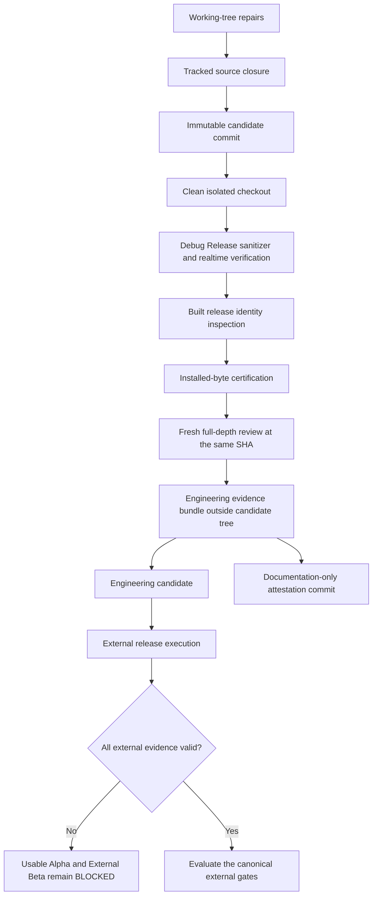
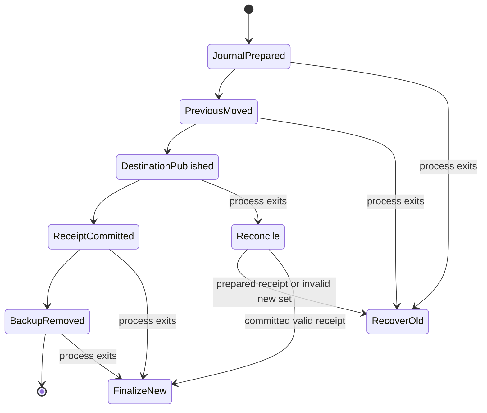
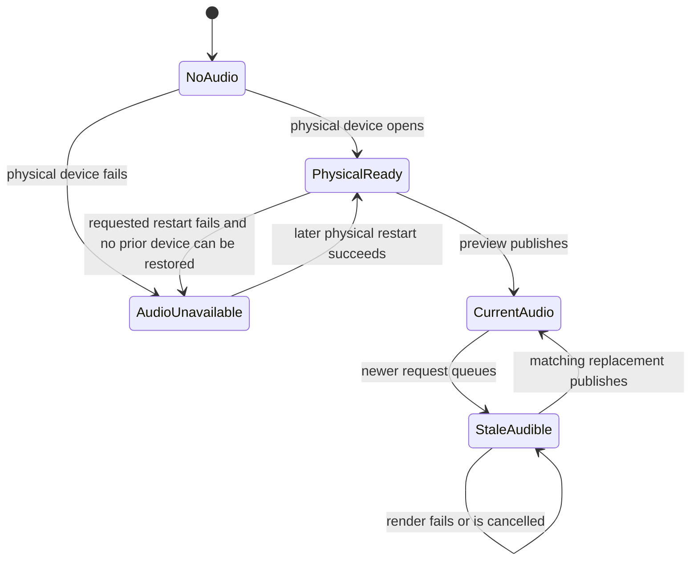

# Project SEAM Engineering Candidate Completion - Plan

## Goal Capsule

- **Objective:** A release engineer can reproduce Project SEAM from one committed source tree and safely enter external release execution without false release evidence, user-data loss, false audible state, release identity drift, or destructive voicebank behavior.
- **Means:** Close the validated engineering findings through tracked-source closure, requirement-specific evidence validation, durable project and export transactions, truthful audio state, bounded PCM ownership, one generated release identity, installed-byte certification, and commit-bound verification. See KTD1-KTD11.
- **Authority:** The requirements in this plan govern engineering completion. `docs/product/USABLE_ALPHA_ACCEPTANCE.md`, `docs/product/usable-alpha-acceptance.json`, `docs/product/EXTERNAL_BETA_ACCEPTANCE.md`, and `docs/product/external-beta-acceptance.json` remain the authorities for product and External Beta promotion.
- **Execution profile:** Preserve the current working-tree repairs when they satisfy this contract, complete missing behavior test-first, then rerun every proof from a clean checkout of one immutable commit.
- **Stop condition:** R1-R12 are satisfied, all 18 validated review findings are closed, the full verification matrix is green at one immutable candidate commit SHA, and a fresh full-depth review of the baseline-to-candidate diff reports zero current P0 or P1 defects.
- **Tail ownership:** Rights, signing credentials, notarization, Windows target execution, physical-device listening, installed DAW sessions, accessibility observation, and external cohort evidence remain owned by the release program after this engineering goal closes.

---

## Product Contract

### Summary

This plan turns the current remediation working tree into a tracked and reproducible engineering candidate.
It is a successor execution contract for `docs/product/ENGINEERING_REMEDIATION_GOAL.md` and a prerequisite to the broader plan in `docs/plans/2026-08-21-1901-feat-project-seam-external-beta-plan.md`.
It does not declare `EXTERNAL_BETA_READY`, Usable Alpha, Release Candidate, or General Availability.

### Problem Frame

The full-depth review identified 18 validated P0 or P1 defects across release evidence, source tracking, project recovery, export replacement, audio state, preview memory, release identity, host certification, and voicebank production.
The current working tree contains substantial repairs and focused tests, but it is not a release-grade proof surface.
The tree has hundreds of tracked modifications and thousands of untracked paths, including production source files referenced by CMake and Python imports.
Several repairs also stop short of the complete exit contract: the release gate does not yet enforce requirement-specific platform, stage, and surface rules; stale-audio truth is not passed as an explicit UI field; export interruption coverage is in-process rather than process-boundary; and legacy macOS packaging still carries `0.11.0` identity paths.

A build or test result from this dirty tree therefore proves only that the current filesystem happened to contain enough inputs.
It does not prove that another engineer can reproduce the result from the committed candidate.

### Baseline Snapshot

Observed on 2026-08-26:

| Dimension | Current assessment | Formal meaning |
|---|---:|---|
| Validated review findings | 18 total: 1 P0 and 17 P1 | Every finding remains mandatory until commit-bound verification and review closure |
| Working-tree finding convergence | 13 appear implemented, 4 are partial, 1 is open; approximately 83% with half credit for partial work | Planning estimate only; not a release claim |
| Engineering exit criteria | 0 of 12 formally closed at a clean commit; 0% | No criterion is final until it is reproduced from tracked bytes at one SHA |
| Usable Alpha requirements | 0 of 20 PASS; 0% | `usable-alpha-acceptance.json` remains `BLOCKED` with all rows `NOT_RUN` |
| External Beta requirements | 0 of 8 evidence-backed PASS; 0% | `external-beta-acceptance.json` remains `BLOCKED` with an empty evidence set |
| Working tree | 227 modified paths, 1 deleted path, and 7,829 untracked paths | Source ownership and generated-output classification are unresolved |

The 83% value is a source-level convergence estimate.
The authoritative engineering progress value is the number of R1-R12 exit requirements closed at the candidate SHA.

### Key Decisions

- **Engineering candidate before release execution.** Complete the deterministic engineering boundary before collecting expensive signing, target-machine, host, or cohort evidence. Governs R1-R12.
- **External gates remain fail-closed.** Source presence, configured workflows, synthetic fixtures, local hashes, and prior phase reports cannot promote Usable Alpha or External Beta. Governs R2, R4, R12.
- **All 18 findings remain mandatory.** The successor goal may strengthen proof requirements, but it may not downgrade, waive, or silently omit a validated P0 or P1 finding. Governs R1-R11.
- **The committed candidate is the unit of product proof.** A dirty-tree pass is preliminary until the same result is reproduced from a clean checkout of one full commit SHA; later evidence or status attestations reference that SHA without becoming a new product candidate. Governs R1, R3, R4, R10, R11.

### Requirements

**Source and release truth**

- R1. A clean checkout of the candidate commit shall contain every source, header, script, schema, fixture, patch, workflow input, and documentation asset required to configure, build, test, package, and verify the claimed engineering surfaces. Covers review finding #2.
- R2. `EXTERNAL_BETA_READY` shall accept only requirement-specific PASS evidence that matches the same candidate root, release identity, stage kind, authorized transformation, platform, architecture, surface, workload, machine profile, and required coverage cardinality. Covers review finding #1.
- R3. Application binaries, the CLAP descriptor, wrapper bundles, installers, manifests, archive names, and evidence shall consume one generated release identity and shall fail before signing or packaging when any value drifts. Covers review findings #22 and #26.
- R4. Host certification shall open and hash the installed no-link artifact under the declared installation root, bind those bytes to the candidate manifest, and reject nonexistent, symlinked, build-tree, outside-root, mismatched, or caller-self-attested inputs. Covers review finding #24.

**User-data durability**

- R5. Project save, reopen, external-change detection, and autosave recovery shall bind lineage to the exact durable project bytes; a recovered document shall retain its origin only as lineage metadata and shall require Save As. Covers review findings #9, #10, and #11.
- R6. Export replacement shall classify ownership from the prior committed receipt, preserve unrelated files, use transaction-owned paths, journal every publication phase, and recover to one complete old or new generation after process interruption. Covers review findings #6, #7, and #8.

**Audible runtime and memory truth**

- R7. Backing-only projects shall render and play when they contain audible media, stale audible audio shall remain explicit until replacement publishes, and Release mode shall report `AUDIO_UNAVAILABLE` instead of starting a test clock when physical audio fails. Covers review findings #5, #12, #19, and #20.
- R8. A five-minute 48 kHz stereo preview shall use one full-size PCM allocation across render result, transport publication, and editor preview views, with zero full-buffer copy bytes during publication. Covers review finding #14.

**Voicebank safety**

- R9. One voicebank `(id, version)` shall map to one synthesis content hash, and manifest-controlled recording names shall resolve to portable, non-symlinked direct children on POSIX and Windows path semantics. Covers review findings #13 and #25.

**Proof and truthful status**

- R10. Debug, Release, ASan/UBSan, TSan, realtime allocation, Python contract, source-contract, whitespace, and platform CI gates shall pass from the candidate commit without relying on prior build directories or untracked inputs.
- R11. A fresh full-depth review tied to the candidate commit shall report zero current P0 or P1 defects, and every prior finding shall have a direct code-and-test closure reference.
- R12. Status documents and acceptance JSON shall remain `BLOCKED` or `NOT_RUN` for external requirements until exact hash-bound target evidence exists; engineering completion shall not mutate those external states.

### Scope Boundaries

**In scope**

- The 18 validated findings from review run `20260825-214722-d503dbd4`.
- The tracked-source closure needed to reproduce the current External Beta engineering tree.
- Missing adversarial, process-boundary, built-artifact, installed-artifact, sanitizer, and review evidence required by R1-R11.
- Status and evidence documentation needed to report the engineering result without changing product or release gates.

**Deferred to Follow-Up Work**

- P2 optimization of batch-lyric lookup at 10,000 notes, unless fresh measurement turns it into a P0 or P1 blocker.
- A fully automated Voicebank Studio synthetic recording journey beyond the containment proof in R9.
- General repository cleanup that does not affect tracked-source closure or verification reproducibility.

**Outside this goal's release authority**

- Performer consent and a rights-cleared Beta Voicebank.
- Developer ID, notarization, Authenticode, timestamping, or production signing credentials.
- Clean target-machine install, upgrade, downgrade, uninstall, or rollback evidence.
- Physical CoreAudio or WASAPI listening evidence.
- REAPER, Bitwig Studio, Logic Pro, VST3, AUv2, or CLAP target-host evidence.
- VoiceOver or Narrator observation.
- External musician sessions, cohort operations, incident closure, or release-role approval.

### Acceptance Examples

- AE1. **Covers R1.** Given an isolated checkout of the candidate commit with no copied workspace files, when configure, build, and test run, then all required inputs resolve from tracked bytes and no import or source path is missing.
- AE2. **Covers R2.** Given `EB-006-host-matrix` marked PASS but referencing a valid macOS standalone record, when READY is evaluated, then the gate fails because the requirement needs the declared installed host coverage rather than a generic PASS record.
- AE3. **Covers R3.** Given a wrapper or installer metadata value that differs from the generated release identity, when the packaging preflight runs, then the process fails before signing and produces no releasable artifact.
- AE4. **Covers R4.** Given a caller-reported digest that matches the candidate manifest but an installed artifact whose bytes differ, when host certification runs, then the locally computed installed-tree digest wins and PASS is rejected.
- AE5. **Covers R5.** Given a noncanonical but valid saved project and a newer autosave, when recovery opens, then the original byte hash remains the lineage base and ordinary Save cannot overwrite the original path.
- AE6. **Covers R6.** Given an old committed export, unrelated canary files, and a process exit after each journal phase, when recovery runs, then it exposes either the complete old generation or the complete new generation and preserves every unrelated canary.
- AE7. **Covers R7.** Given a Release runtime whose physical device cannot open, when playback is requested, then no threaded test clock is created, the prior valid device state is restored when applicable, and the UI exposes the requested device error through `AUDIO_UNAVAILABLE`.
- AE8. **Covers R7.** Given an audible backing-only project and no valid vocal selection, when preview is requested, then backing audio renders, publishes, and becomes transport-available.
- AE9. **Covers R7.** Given old Preview audio for revision 90 and a queued Final render for revision 91, when status is painted, then the UI reports the audible audio as stale until revision 91 Final audio publishes.
- AE10. **Covers R8.** Given 14,400,000 stereo frames, when the result passes through transport and editor preview publication, then all read-only views share the same 115,200,000-byte PCM storage and publication performs no full-buffer copy.
- AE11. **Covers R9.** Given an installed bank with `(id, version, hash A)`, when installation receives `(id, version, hash B)`, then installation fails without changing the installed bank even when replacement was requested.
- AE12. **Covers R9.** Given unit IDs such as `../outside`, `..\outside`, `C:\temp\take`, `CON`, `name. `, and `/absolute`, when Voicebank Studio selects a recording destination, then every accepted path is a portable direct child of the real recording directory and no existing symlink is followed.

### Sources

- `docs/product/ENGINEERING_REMEDIATION_GOAL.md` defines the original 18-finding remediation boundary and twelve exit criteria.
- `docs/plans/2026-08-21-1901-feat-project-seam-external-beta-plan.md` defines the broader External Beta product contract and external evidence boundary.
- `docs/product/USABLE_ALPHA_ACCEPTANCE.md` and `docs/product/usable-alpha-acceptance.json` define the first standalone product gate.
- `docs/product/EXTERNAL_BETA_ACCEPTANCE.md` and `docs/product/external-beta-acceptance.json` define the closed External Beta gate.
- `CMakeLists.txt`, `CMakePresets.json`, and `.github/workflows/ci.yml` define the local and cross-platform build/test surfaces.

---

## Planning Contract

### Key Technical Decisions

- KTD1. **Use the candidate commit as the only proof boundary.** Build directories, copied files, staged-only state, and the current working directory are not candidate inputs. Rationale: this is the only boundary another engineer and CI can reproduce. Governs R1, R10, R11.
- KTD2. **Validate evidence through a requirement policy.** Each EB requirement owns its accepted stage kinds, transformations, platforms, architectures, surfaces, workloads, and coverage cardinality. Rationale: record existence and generic PASS status cannot prove the requirement that references it. Governs R2.
- KTD3. **Generate release identity once and consume it everywhere.** `CMakeLists.txt` supplies the product version, while one release-identity producer resolves build ID, source commit, and build epoch for C++, wrappers, installers, manifests, and evidence. Rationale: defaults and duplicated literals drift before signing. Governs R3.
- KTD4. **Certify installed bytes, not caller claims.** Certification resolves a direct child under an installation root, rejects links, computes the tree hash itself, and compares candidate and evidence identity after measurement. Rationale: a supplied path string or digest is not evidence. Governs R4.
- KTD5. **Separate durable-byte lineage from semantic project identity.** Save returns the hash of the exact encoded bytes that reached durable storage; recovery keeps the original path only as origin metadata. Rationale: semantic canonicalization cannot detect raw-file changes and must not grant overwrite authority. Governs R5.
- KTD6. **Treat export replacement as a recoverable state machine.** One transaction owns its staging directory, backup directory, journal, and prepared receipt; recovery interprets the last durable phase instead of inferring from path presence. Rationale: filesystem rename sequences are not atomic as a group. Governs R6.
- KTD7. **Model audible staleness independently from render lifecycle.** Queued, Rendering, Failed, and Cancelled may all coexist with older audible PCM; the coordinator passes this fact to the UI as data rather than making the UI infer it. Rationale: requested metadata can match while audible publication is still stale. Governs R7.
- KTD8. **Restrict callback-clock audio to deterministic test mode.** Development and Release open physical devices; failure leaves audio unavailable or restores the previous physical configuration. Rationale: a test clock is not audible output. Governs R7.
- KTD9. **Publish PCM as shared immutable storage with copy-on-write mutation.** Render, transport, and editor preview use shared read-only ownership, while any mutable access detaches first. Rationale: publication should not multiply a full five-minute buffer or permit aliases to mutate audible data. Governs R8.
- KTD10. **Make exact voicebank identity and portable recording containment cardinal rules.** Replacement cannot redefine an existing `(id, version)`, and recording names are ASCII-safe basenames selected under a canonical real directory before exclusive creation. Rationale: both failures can destroy or redirect irreplaceable voice content. Governs R9.
- KTD11. **Separate the product candidate from its attestation tail.** Freeze and verify candidate commit `C`, store the evidence bundle against `C` outside the candidate source tree, then create a documentation-only attestation commit `A` that references `C`; `A` never becomes the product source identity. Rationale: a tracked evidence file cannot contain the final hash of the commit that contains itself, and a post-verification status edit would otherwise invalidate the reviewed SHA. Governs R10-R12.

### High-Level Technical Design

#### Candidate and evidence pipeline

The clean checkout supplies the binaries.
The built and installed binaries supply the evidence.
The evidence never reaches backward to redefine the candidate source identity.

#### Export publication state machine

The receipt defines file ownership.
The journal defines transaction ownership and recovery phase.
Path names alone define neither.

#### Audible runtime truth

Render lifecycle and device lifecycle are separate.
`audibleAudioStale` describes published PCM, while `AUDIO_UNAVAILABLE` describes the physical output path.

### Implementation Constraints

- Preserve C++20, strict warnings-as-errors, and the existing `core::Result` error model.
- Keep realtime callbacks allocation-free, lock-free, file-I/O-free, and logging-free.
- Preserve shared `AuthoringRuntime` behavior across native standalone and CLAP adapters.
- Do not weaken symlink, path-containment, hash, signature, or evidence checks to make fixtures pass.
- Do not convert external `NOT_RUN` or `BLOCKED` rows to PASS from local source or synthetic tests.
- Do not treat generated build outputs, `.omo` runtime material, caches, or prior evidence as source inputs.
- Keep test-only fault injection and callback-clock factories unreachable from production configuration.
- Bind every final proof artifact to the full candidate commit SHA, not a short hash or branch name.

### Sequencing

1. Complete U1 before accepting any later green result as reproducible.
2. Complete U2-U4 before generating or trusting release evidence.
3. Complete U5-U9 before the full regression matrix because they change shared runtime and persistence behavior.
4. Complete U10 only after U1-U9 are stable at one candidate commit.

### System-Wide Impact

- **Users:** Project recovery, export replacement, audio status, voicebank replacement, and recording paths affect user-owned projects and recordings.
- **Developers:** The tracked source graph and isolated-checkout gate become mandatory for future completion claims.
- **Release engineers:** Version, build ID, source commit, stage lineage, installed hashes, and evidence records become one immutable chain.
- **QA and external verifiers:** A PASS record must prove its own requirement and exact installed surface; it cannot be reused as generic release evidence.
- **Documentation maintainers:** Product status remains Feature Alpha and blocked until separate acceptance contracts change.

### Risks and Dependencies

| Risk or dependency | Consequence | Mitigation in this plan |
|---|---|---|
| Mixed user work and generated outputs in a very dirty tree | Necessary source may be omitted or unrelated data may be included | U1 classifies by dependency and ownership, then proves the committed tree in isolation |
| Existing focused tests were executed against untracked files | Green results may disappear in a clean checkout | R1 and U10 require all proof from one immutable commit |
| Requirement records have heterogeneous semantics | A generic record policy can still launder evidence | KTD2 and U2 define per-requirement policy and adversarial cross-surface tests |
| Legacy packaging remains callable | Old version literals can re-enter signed artifacts | U3 either identity-binds or retires every reachable production packaging path |
| Filesystem crash semantics differ by platform | In-process fault injection may miss durability defects | U6 adds a subprocess exit/restart harness and runs it on macOS, Windows, and Linux CI where supported |
| Sanitizers alter timing | Time-bound tests can fail without a memory or race defect | U10 separates sanitizer safety assertions from production latency assertions without skipping either class |
| Installed paths can change during certification | Hash and path metadata can describe different bytes | U4 minimizes resolution-to-hash gaps, rejects links, records stat metadata, and fails on detected mutation |
| External credentials and machines are unavailable locally | Engineering completion could be confused with release readiness | R12 and U10 preserve all external rows as `NOT_RUN` or `BLOCKED` |

---

## Implementation Units

| Unit | Title | Primary files | Depends on |
|---|---|---|---|
| U1 | Close the tracked source graph | `CMakeLists.txt`, `scripts/verify_tracked_source_closure.py` | None |
| U2 | Enforce requirement-specific release evidence | `tools/external_beta/release_gate_validation.py` | U1 |
| U3 | Eliminate release identity drift | `tools/phase13a/release_identity.py`, packaging scripts | U1 |
| U4 | Certify installed artifact bytes | `tools/phase13a/host_certification_validation.py` | U1, U3 |
| U5 | Finalize project and recovery durability | `libs/seam-authoring-runtime/src/project_lifecycle.cpp` | U1 |
| U6 | Finalize crash-safe export replacement | `libs/seam-authoring-runtime/src/export_service.cpp` | U1 |
| U7 | Finalize backing-only and physical-audio truth | `libs/seam-authoring-runtime/src/render_coordinator.cpp`, `libs/seam-standalone/src/native_editor_app.cpp` | U1 |
| U8 | Prove bounded shared PCM ownership | `libs/seam-rendering/include/seam/rendering/shared_pcm_buffer.hpp` | U1, U7 |
| U9 | Finalize voicebank identity and recording containment | `libs/seam-authoring-runtime/src/voicebank_installer_service.cpp`, `libs/seam-native-ui/src/voicebank_studio.cpp` | U1 |
| U10 | Run commit-bound verification, review, and truthful attestation | `docs/product/ENGINEERING_REMEDIATION_GOAL.md`, CI and evidence records | U2-U9 |

### U1. Close the tracked source graph

**Goal:** Make the committed repository self-contained for every claimed build, test, package, contract, and documentation path.

**Requirements:** R1, R10.

**Dependencies:** None.

**Files:**

- Create `scripts/verify_tracked_source_closure.py`.
- Create `tests/test_tracked_source_closure.py`.
- Modify `CMakeLists.txt` and `.github/workflows/ci.yml` to register the closure check and isolated-checkout job.
- Inspect all referenced files under `.github/workflows/`, `apps/`, `docs/`, `libs/`, `packaging/`, `phase12c/`, `scripts/`, `tests/`, and `tools/`.
- Include the known missing production inputs `libs/seam-authoring-runtime/include/seam/authoring/audio_settings_controller.hpp`, `libs/seam-authoring-runtime/src/audio_settings_controller.cpp`, `libs/seam-authoring-runtime/include/seam/authoring/media_import_service.hpp`, `libs/seam-authoring-runtime/src/media_import_service.cpp`, `libs/seam-authoring-runtime/include/seam/authoring/support_bundle.hpp`, `libs/seam-authoring-runtime/src/support_bundle.cpp`, `libs/seam-native-ui/include/seam/native_ui/render_status_panel.hpp`, `libs/seam-native-ui/src/render_status_panel.cpp`, `libs/seam-rendering/include/seam/rendering/shared_pcm_buffer.hpp`, `tools/external_beta/release_gate_validation.py`, `tools/phase13a/compatibility_patches.py`, `tools/phase13a/host_certification_validation.py`, and `tools/phase13a/release_identity.py`.

**Approach:**

1. Enumerate direct CMake source entries, generated-header inputs, Python package imports, workflow script references, packaging templates, patches, schemas, fixtures, and documentation assets used by source contracts.
2. Compare each required repository-relative input with the Git index rather than checking only filesystem existence.
3. Classify every untracked path as required source, deliberate local evidence, or generated output. Do not delete or track a path until ownership is known.
4. Make the closure verifier fail with the exact missing path and its consumer.
5. Add a CI job that checks out the candidate commit into an empty workspace, configures from that checkout, builds, and runs the registered suite without copying files from another job or workspace.
6. Keep generated build directories and local runtime evidence outside the source closure.

**Execution note:** Start with a failing source-closure test for the known untracked CMake and Python inputs before changing tracking or CI behavior.

**Patterns to follow:** `tests/external_beta/test_external_beta_source_contract.py`, `scripts/verify_phase8_platform_sources.py`, `scripts/verify_u2_project_lifecycle.py`, and the clean `actions/checkout` boundary in `.github/workflows/ci.yml`.

**Test scenarios:**

- A required CMake `.cpp` file exists in the working directory but is absent from the Git index; the closure check fails and identifies the CMake consumer.
- A required imported Python module exists but is untracked; the closure check fails before the Python suite imports it accidentally.
- A workflow references an untracked patch, schema, or script; the closure check fails with the workflow path.
- A generated object, build directory, cache, screenshot, or local evidence file is untracked but not a source dependency; the closure check ignores it.
- A tracked input is deleted locally; the closure check and clean configure both fail rather than accepting another build directory's copy.
- A clean isolated checkout configures and builds without access to the original workspace.

**Verification:** Every current build and verification dependency resolves from tracked bytes, the isolated baseline checkout builds without workspace copies, and the closure gate remains registered so U10 rechecks all files added by U2-U9.

### U2. Enforce requirement-specific release evidence

**Goal:** Prevent `EXTERNAL_BETA_READY` from passing with non-PASS, unrelated, wrong-stage, wrong-platform, wrong-surface, or under-covered evidence.

**Requirements:** R2, R12.

**Dependencies:** U1.

**Files:**

- Modify `tools/external_beta/release_gate.py`.
- Modify `tools/external_beta/release_gate_validation.py`.
- Modify `docs/product/external-beta-acceptance.json` so each existing requirement row owns its evidence policy.
- Modify `docs/product/external-beta-candidate.schema.json` and `docs/product/external-beta-release-authorization.schema.json` to bind the canonical contract digest when required.
- Modify `tests/external_beta/test_release_gate.py`.
- Modify `tests/external_beta/test_external_beta_source_contract.py`.

**Approach:**

1. Extend the existing canonical `EB-001` through `EB-008` rows with accepted stage kinds, required parent transformations, platform and architecture coverage, allowed surfaces, workload classes, machine profiles, minimum record cardinality, and any specialized gate result that the evidence must reference.
2. Bind the canonical `external-beta-acceptance.json` digest into the candidate root or release authorization so evidence evaluation cannot substitute a weaker contract after candidate freeze.
3. Make the CLI load the canonical contract and pass its parsed policy into the pure evaluator; tests pass explicit fixtures so policy behavior is deterministic.
4. Build an evidence map keyed by record ID and reject duplicate record IDs before requirement evaluation.
5. For each requirement, require nonempty references to records whose `requirementId`, `status`, candidate root, release identity, source commit, stage node, edge, platform, architecture, surface, workload, and machine profile satisfy that requirement's policy.
6. Treat evidence reuse across different requirement IDs as invalid unless the policy names an intentional shared record type and each requirement still receives its own binding.
7. Require specialized aggregate evidence for signed-install, standalone-soak, host-matrix, provenance-archive, and defect-review rows instead of accepting one generic standalone record.
8. Preserve `NOT_RUN`, `BLOCKED`, and `FAIL` as valid record states but never as READY-satisfying evidence.

**Execution note:** Add adversarial failing cases first because the existing happy-path fixture currently lets one generic macOS standalone shape satisfy every requirement.

**Patterns to follow:** `tools/external_beta/install_evidence.py`, `tools/external_beta/host_evidence.py`, `tools/external_beta/product_soak.py`, `tools/external_beta/evidence_audit.py`, and their schema-backed tests.

**Test scenarios:**

- Every requirement references a matching PASS record with the required coverage; READY passes.
- A requirement references `NOT_RUN`, `BLOCKED`, or `FAIL`; READY fails and reports that requirement.
- `EB-001-contract` references a PASS record whose `requirementId` is `EB-002-identity`; READY fails.
- A record belongs to another candidate root or source commit; READY fails.
- A record references a valid stage node whose kind is wrong for the requirement; READY fails even though lineage is structurally valid.
- A record uses a valid edge whose transformation is not authorized for that requirement; READY fails.
- A Windows requirement is backed only by macOS evidence; READY fails.
- A host-matrix requirement is backed only by a standalone surface; READY fails.
- A required platform or host tuple is absent from an otherwise valid aggregate record; READY fails with the missing coverage.
- One generic record is reused across multiple incompatible requirements; READY fails.
- Candidate authorization carries a different evidence-policy digest; READY fails before evaluating records.
- Workload and machine digests disagree with their catalogs; READY fails.
- A complete G3-like engineering matrix with no External Beta records remains blocked.

**Verification:** The gate passes only the canonical all-valid fixture and rejects every cross-requirement, cross-candidate, cross-stage, cross-platform, cross-surface, and under-coverage fixture.

### U3. Eliminate release identity drift

**Goal:** Make every production build, wrapper, package, installer, manifest, descriptor, and evidence surface consume one generated identity.

**Requirements:** R3.

**Dependencies:** U1.

**Files:**

- Modify `tools/phase13a/release_identity.py` and `scripts/build_phase13a_formats.py`.
- Modify `libs/seam-clap-editor/src/plugin_entry.cpp` and `apps/seam-clap-editor-host/main.cpp`.
- Modify `packaging/phase13a/wrapper-project/CMakeLists.txt`.
- Modify `packaging/macos/ProjectSEAMEditor-Info.plist`, `packaging/macos/ProjectSEAMEditor-Info.plist.in`, and `packaging/macos/Distribution.xml.in`.
- Modify or retire `scripts/package_macos_clap.sh` and `scripts/package_macos_installer.sh`.
- Modify `scripts/package_macos_plugins.sh`, `scripts/package_macos_standalone.sh`, `scripts/build_windows_installer.ps1`, `scripts/write_release_manifest.py`, and production Phase 13A workflows.
- Audit `scripts/generate_phase13b_evidence.py` and other release evidence producers for product-version literals.
- Modify `tests/external_beta/test_release_identity.py`, `tests/phase13a/test_installer_contract.py`, and relevant Phase 13A contract tests.

**Approach:**

1. Keep `project(ProjectSEAM VERSION ...)` as the product-version authority.
2. Resolve build ID, full source commit, and build epoch once in `release_identity.py` and emit the same values into the generated C++ header and `RELEASE_IDENTITY.json`.
3. Require production wrapper and installer entrypoints to receive or read `RELEASE_IDENTITY.json`; remove production defaults that can package a different version.
4. Generate bundle and installer metadata from the identity rather than copying literal plist or resource files.
5. Either route legacy Phase 11 packaging scripts through the current identity-bound path or make them fail with a clear retired-path diagnostic.
6. Extend the built CLAP host smoke to load the actual module and compare `clap_plugin_descriptor_t.version` with the generated application version.
7. Compare wrapper, installer, manifest, archive, and evidence identities before signing and again after packaging.

**Execution note:** Treat this as packaging-first verification: source-string tests are necessary, but a built descriptor and packaged metadata inspection are the completion proof.

**Patterns to follow:** Generated `seam/build/version.hpp`, `RELEASE_IDENTITY.json`, `tools/phase13a/distribution_manifest.py`, and the existing CLAP host smoke in `apps/seam-clap-editor-host/main.cpp`.

**Test scenarios:**

- Product version `0.13.1` produces the same version in the generated C++ header, CLAP descriptor, VST3/AUv2 metadata, installer metadata, build manifest, and evidence record.
- A caller supplies a version that differs from the source project version; build preflight fails.
- A wrapper manifest has the right version but wrong build ID or source commit; packaging fails before signing.
- A legacy packaging script is invoked without an identity; it delegates to the current path or fails rather than emitting `0.11.0` or `0.13.0`.
- The built CLAP module reports the generated version through its descriptor.
- A signed or packaged artifact is renamed with a mismatched version; post-package identity inspection fails.
- Development-only version labels remain isolated from production packaging and cannot satisfy release evidence.

**Verification:** No reachable production release surface contains an independent product-version literal, and built/package inspection reports one version, build ID, source commit, and epoch.

### U4. Certify installed artifact bytes

**Goal:** Make host PASS depend on locally measured installed bytes that match the candidate manifest and evidence record.

**Requirements:** R4.

**Dependencies:** U1, U3.

**Files:**

- Modify `tools/phase13a/host_certification.py`.
- Modify `tools/phase13a/host_certification_validation.py`.
- Modify `docs/phase13a/host-certification-record-template.json` and `docs/phase13a/HOST_CERTIFICATION_RECORDING_KO.md`.
- Modify `.github/workflows/phase13a-commercial-host-validation.yml`.
- Modify `tests/phase13a/test_host_certification.py`.

**Approach:**

1. Require a candidate build manifest, declared installation root, and relative installed artifact name.
2. Resolve the installation root and artifact without following symlinks and require the artifact to be a direct child or approved bundle subtree under that root.
3. Reject build-tree locations, nonexistent paths, symlinked components, and paths outside the installation root.
4. Open files through no-follow handles where the platform permits, hash through those handles, and compare no-link path and stat identity before and after each read.
5. Compute the installed tree digest from the artifact bytes and deterministic relative path inventory, then repeat the inventory identity check before accepting the measurement.
6. Compare the computed digest, format, version, build ID, source commit, candidate root, and evidence stage with the candidate manifest.
7. Reject a caller-supplied digest when it differs; never use it as the measured result.
8. Record file-count, byte-count, stable stat metadata, computed digest, candidate digest, evidence digest, and certification time so mutation during measurement can be detected.
9. Keep a row `NOT_RUN` when no real installed artifact exists.

**Execution note:** Add negative boundary tests before changing PASS behavior because the certification path consumes externally supplied paths and evidence.

**Patterns to follow:** `tree_sha256` in the Phase 13A tooling, no-link checks in `tools/external_beta/install_evidence.py`, and the candidate identity comparison in U3.

**Test scenarios:**

- A real installed direct-child artifact matches the candidate manifest; certification records the computed digest and passes.
- The artifact does not exist; certification fails.
- The artifact or any required path component is a symlink; certification fails.
- The artifact resolves outside the declared root; certification fails.
- The artifact lives in a build tree rather than the installed root; certification fails.
- The candidate digest differs from measured bytes; certification fails.
- The caller supplies the candidate digest while installed bytes differ; certification fails with the measured digest.
- Format, version, build ID, or source commit differs from the candidate; certification fails.
- The artifact mutates during inventory or hashing; certification fails and produces no PASS record.
- A `NOT_RUN` row cannot contain fake PASS checks or hashes.

**Verification:** Host PASS is reproducible from the installed tree and cannot be produced from path strings, build artifacts, or self-reported hashes.

### U5. Finalize project and recovery durability

**Goal:** Preserve exact durable project lineage and prevent recovery from overwriting the last durable original.

**Requirements:** R5.

**Dependencies:** U1.

**Files:**

- Modify `libs/seam-authoring-runtime/include/seam/authoring/project_document.hpp` and `libs/seam-authoring-runtime/src/project_document.cpp`.
- Modify `libs/seam-authoring-runtime/include/seam/authoring/project_lifecycle.hpp` and `libs/seam-authoring-runtime/src/project_lifecycle.cpp`.
- Modify `libs/seam-authoring-runtime/src/autosave_service.cpp`.
- Modify native standalone controller or dialog files only where Save and Save As routing needs correction.
- Modify `tests/test_project_document.cpp`, `tests/test_project_lifecycle.cpp`, `tests/test_autosave_service.cpp`, and `tests/test_standalone_project_lifecycle.cpp`.

**Approach:**

1. Make the lifecycle writer return the SHA-256 of the exact encoded bytes written to the durable project file.
2. Read the raw saved file once during open, decode those bytes, and record their raw hash as the autosave lineage base.
3. Keep semantic project identity separate from durable-byte lineage.
4. On recovery, clear the active project path, retain the original only in `recoveryOriginPath`, set the autosave path, and keep the recovered document dirty.
5. Make ordinary Save reject a recovered document with no active project path and route the UI to Save As.
6. Permit a valid trackless or audio-only project to reopen because New Project can persist that shape.
7. Preserve external-change detection against the exact durable base hash.

**Execution note:** Preserve the current working-tree implementation if it satisfies these cases, then add controller-level coverage so the domain rule is visible through the real Save action.

**Patterns to follow:** `ProjectDocument` identity ownership, `ProjectLifecycleService` normalization and atomic write pattern, and `AutosaveService` generation metadata.

**Test scenarios:**

- A canonical project saves, clears dirty state, and reopens with the same durable hash.
- A semantically equivalent noncanonical JSON file reopens and its raw-byte hash becomes the lineage base.
- An autosave derived from noncanonical bytes recovers without false external-change rejection.
- The original file changes after autosave; recovery detects the base-hash mismatch.
- Recovery clears `projectPath`, retains `recoveryOriginPath`, and leaves the document dirty.
- The recovered-document UI identifies the copy as recovered and presents the origin path as informational rather than as the active save target.
- Cancelling Save As leaves the recovered document dirty and the original bytes unchanged.
- Ordinary Save after recovery fails with a Save As diagnostic and the original bytes remain unchanged.
- Save As after recovery writes a new path and then establishes a new durable base hash.
- A valid trackless project saves and reopens.
- A valid audio-only project saves and reopens.
- Failed open, failed save, corrupt autosave, and symlinked autosave leave the active document and original bytes unchanged.

**Verification:** Exact-byte lineage, noncanonical JSON, external-change detection, recovery Save As, original-byte preservation, trackless reopen, and standalone Save routing all pass.

### U6. Finalize crash-safe export replacement

**Goal:** Make export replacement atomic at the product contract level across removed stems, unrelated files, and real process interruption.

**Requirements:** R6.

**Dependencies:** U1.

**Files:**

- Modify `libs/seam-authoring-runtime/include/seam/authoring/export_service.hpp` and `libs/seam-authoring-runtime/src/export_service.cpp`.
- Create `tests/helpers/export_transaction_probe.cpp` as a test-only subprocess helper.
- Modify `CMakeLists.txt` to build and register the process-boundary probe.
- Modify `tests/test_export_service.cpp` and `tests/test_wav_export_formats.cpp`.

**Approach:**

1. Parse and validate the previous committed receipt before classifying any existing file as export-owned.
2. Reject absolute, parent-traversing, duplicate, empty, symlinked, or outside-destination receipt paths before using them for ownership.
3. Define old-owned paths from the old receipt and new-owned paths from the prepared new receipt.
4. Preserve only files owned by neither generation.
5. Use unique transaction-owned staging, backup, and journal paths created exclusively; never delete a predictable `.previous` sibling.
6. Persist phase transitions for `JournalPrepared`, `PreviousMoved`, `DestinationPublished`, `ReceiptCommitted`, and `BackupRemoved` with durable writes before advancing.
7. Publish the destination with a prepared receipt, then change the receipt to committed only after the complete directory is visible.
8. Reconcile every phase on restart using journal identity, receipt state, ownership, and hashes.
9. Add a child-process helper that exits immediately after each durable phase; restart recovery from a new process and inspect the result.

**Execution note:** Keep deterministic in-process fault injection for fast unit coverage, but require subprocess exit/restart coverage for the crash claim.

**Patterns to follow:** The current `ExportPublicationPhase` enum, receipt hashing, `recoverSet`, and temporary-directory test fixtures in `tests/test_export_service.cpp`.

**Test scenarios:**

- First export publishes a committed master and receipt.
- Replacement removes a stem owned only by the prior receipt and does not resurrect it.
- Replacement preserves an unrelated file inside the export set.
- An unowned `<destination>.previous` sibling remains untouched.
- A prior receipt contains `../outside`, an absolute path, a duplicate path, or a symlink target; replacement fails without touching the referenced object.
- A collision with a transaction path not owned by the current journal fails closed.
- Cancellation before publication leaves no claimed output.
- Process exit after `JournalPrepared` recovers the complete old generation.
- Process exit after `PreviousMoved` restores the complete old generation.
- Process exit after `DestinationPublished` chooses old or new only after validating receipt state and hashes.
- Process exit after `ReceiptCommitted` finalizes the complete new generation.
- Process exit after `BackupRemoved` removes only the owned journal residue and keeps the committed new generation.
- Corrupt, missing, or symlinked journals, receipts, masters, stems, or backup paths fail without deleting unrelated data.
- PCM16, PCM24, and Float32 exports at 44.1, 48, and 96 kHz preserve receipt and output hashes.

**Verification:** Every journal phase survives process exit and restart, removed stems stay removed, unrelated canaries survive, and recovery exposes no mixed generation.

### U7. Finalize backing-only and physical-audio truth

**Goal:** Make the rendered, audible, and physical-device states match what the user can hear.

**Requirements:** R7.

**Dependencies:** U1.

**Files:**

- Modify `libs/seam-authoring-runtime/src/authoring_runtime.cpp` and `libs/seam-authoring-runtime/src/render_coordinator.cpp`.
- Modify `libs/seam-authoring-runtime/include/seam/authoring/render_coordinator.hpp`.
- Modify `libs/seam-standalone/include/seam/standalone/native_editor_app.hpp` and `libs/seam-standalone/src/native_editor_app.cpp`.
- Modify `libs/seam-native-ui/include/seam/native_ui/render_status_panel.hpp` and `libs/seam-native-ui/src/render_status_panel.cpp`.
- Modify `libs/seam-native-ui/src/editor_scene.cpp` where status is painted.
- Modify `tests/test_authoring_runtime.cpp`, `tests/test_authoring_render_coordinator.cpp`, `tests/test_render_status_panel.cpp`, `tests/test_native_runtime.cpp`, `tests/test_audio_settings.cpp`, and `tests/test_production_configuration.cpp`.

**Approach:**

1. Let preview construction and render preflight accept an audible non-muted backing track when no audible vocal selection exists.
2. Honor mute and solo rules for backing-only eligibility and reject a project with no audible vocal or backing content.
3. Preserve `audibleAudioStale` independently through Queued, Rendering, Failed, Cancelled, and shutdown transitions until matching revision and quality publish.
4. Add `audibleAudioStale` to `RenderStatusView` and make `RenderStatusPanelModel` use the explicit value; revision and quality comparison may remain a defensive consistency check.
5. Pass coordinator stale truth through native and CLAP UI adapters without recomputing it from transport metadata.
6. Permit `forceThreadedAudio` only in `DeterministicTest` configuration.
7. On physical open or start failure in Development or Release, keep the app open, publish `AUDIO_UNAVAILABLE`, and do not create the threaded clock.
8. During settings restart, preserve the requested-device error, restore the previous physical runtime and transport state when possible, and return the requested error without reading `Result::error()` from a success value.

**Execution note:** Use scripted audio-device factories for deterministic failure tests, then manually exercise the visible native status surface.

**Patterns to follow:** `ProductionRuntimeMode`, `AudioSettingsController`, `DiagnosticRegistry`, `RenderProgress`, and the existing transport publication path.

**Test scenarios:**

- An audible backing-only project with no vocal selection renders and publishes transport audio.
- A missing voicebank plus audible backing still publishes backing audio and a scoped vocal diagnostic.
- A muted backing-only track produces no preview.
- Backing solo state includes only the audible solo selection.
- A newer revision queues while old PCM remains audible; `audibleAudioStale` stays true through Queued and Rendering.
- A failed or cancelled replacement preserves old PCM and stale truth.
- A matching revision and quality publishes; stale truth clears.
- The UI receives explicit stale truth and labels the audible revision as stale.
- A same-revision Preview-to-Final replacement stays stale until Final publishes.
- Release physical open failure creates no threaded device and exposes `AUDIO_UNAVAILABLE`.
- Release physical start failure creates no fallback and preserves the error.
- While audio is unavailable, playback does not present itself as audible and the Audio Settings recovery action remains available.
- A later successful physical restart clears `AUDIO_UNAVAILABLE` and restores truthful playback controls.
- Deterministic test mode can use the threaded clock.
- Requested-device open failure rolls back to the previous physical device and returns the requested open error.
- Successful runtime reconfiguration never calls `error()` and preserves transport position, loop, and play state.

**Verification:** Backing-only playback, explicit stale UI state, no Release fallback, physical-device rollback, and exact error propagation pass through runtime and native integration tests.

### U8. Prove bounded shared PCM ownership

**Goal:** Remove full-result duplication from preview publication while keeping mutable operations isolated.

**Requirements:** R8.

**Dependencies:** U1, U7.

**Files:**

- Modify `libs/seam-rendering/include/seam/rendering/shared_pcm_buffer.hpp`.
- Modify `libs/seam-rendering/include/seam/rendering/project_renderer.hpp` and `libs/seam-rendering/src/project_renderer.cpp`.
- Modify `libs/seam-authoring-runtime/include/seam/authoring/render_coordinator.hpp` and its publication path.
- Modify `libs/seam-clap-editor/include/seam/clap_editor/editor_runtime.hpp` and `libs/seam-clap-editor/src/editor_runtime_adapter.cpp`.
- Modify `tests/test_authoring_render_coordinator.cpp` and `tests/test_authoring_characterization.cpp`.

**Approach:**

1. Store interleaved PCM in one reference-counted buffer whose ordinary copy operation shares storage.
2. Publish read-only render, transport, and preview views against the same storage identity.
3. For two-channel content, expose the stereo view as an alias of interleaved storage rather than constructing a mirror.
4. Detach storage before any mutable iterator, pointer, element, resize, or assignment operation can change shared samples.
5. Keep realtime acquisition free of allocation and reference-count destruction on the callback thread where the current publication protocol requires it.
6. Instrument the five-minute fixture with storage identity, allocation bytes, and copy bytes.

**Execution note:** Add the copy-on-write isolation test before relying on storage identity as the memory proof.

**Patterns to follow:** `RealtimeProjectAudioPublication`, immutable `shared_ptr<const PublishedProjectAudio>` snapshots, and existing realtime allocation instrumentation.

**Test scenarios:**

- A five-minute 48 kHz stereo buffer contains 28,800,000 floats and allocates one 115,200,000-byte full-size storage block.
- Render result, transport publication, `RenderedPreview.interleaved`, and two-channel `RenderedPreview.stereo` share one storage identity.
- Copying a shared buffer performs no full-buffer sample copy.
- Mutating one copied buffer detaches storage and leaves the original samples unchanged.
- Mono and multichannel previews preserve channel and frame interpretation without a stereo mirror.
- Repeated `latest()` and rendered-preview reads keep the same storage identity while the publication is unchanged.
- Publishing replacement PCM releases old storage only after readers finish.
- Realtime acquisition and playback report zero callback allocations and locks.

**Verification:** The five-minute workload stays at one full-size PCM allocation across publication, performs zero full-buffer publication copies, and preserves copy-on-write correctness.

### U9. Finalize voicebank identity and recording containment

**Goal:** Prevent destructive same-version bank replacement and path redirection from manifest-controlled unit IDs.

**Requirements:** R9.

**Dependencies:** U1.

**Files:**

- Modify `libs/seam-authoring-runtime/src/voicebank_installer_service.cpp`.
- Modify `libs/seam-native-ui/include/seam/native_ui/voicebank_studio.hpp` and `libs/seam-native-ui/src/voicebank_studio.cpp`.
- Modify `apps/seam-voicebank-studio-native/main.cpp`.
- Modify `tests/test_voicebank_installer_service.cpp`, `tests/test_native_ui.cpp`, and `tests/test_standalone_voicebank_workflow.cpp`.

**Approach:**

1. Look up an installed bank by exact ID and version before any replacement operation.
2. Return idempotent success only when the synthesis content hash is identical.
3. Reject different synthesis content under the same ID and version regardless of a replace flag; require a new version for intentional content change.
4. Convert unit IDs to an ASCII-safe basename with a bounded length and a deterministic fallback.
5. Neutralize separators, drive syntax, roots, control bytes, trailing dots or spaces, and Windows reserved device names.
6. Require a real non-symlink recording directory and verify each candidate's canonical parent is that directory.
7. Reject occupied symlink or non-regular-file candidates and let the recording backend create the returned path exclusively.

**Execution note:** Add hostile cross-platform name cases and original-bank preservation assertions before changing installation or recording behavior.

**Patterns to follow:** Exact `(id, version, contentHash)` resolution in `VoicebankSession`, `BankReferenceRegistry`, and no-link path validation in project/export services.

**Test scenarios:**

- A first trusted bank install succeeds.
- Reinstalling the exact same ID, version, and content hash is idempotent.
- Installing different content under the same ID and version fails with and without replacement enabled.
- A collision failure leaves the original manifest, audio, receipt, and content hash unchanged.
- A higher version with new content follows the explicit install/update path.
- Untrusted or tampered packages remain rejected.
- POSIX traversal, Windows traversal, drive-root, UNC-like, reserved-name, control-byte, trailing-dot, trailing-space, empty, and overlong unit IDs produce safe direct-child names or a clear rejection.
- A symlinked recording directory is rejected.
- An occupied symlink or directory at a candidate filename is rejected and not followed.
- The first free sequential take name is selected without overwriting an existing recording.

**Verification:** Exact reinstallation is the only same-version success, conflicting content preserves the installed bank, and every accepted recording path is a portable real direct child.

### U10. Run commit-bound verification, review, and truthful attestation

**Goal:** Convert the repaired source into one reproducible, reviewed engineering candidate without promoting any external gate.

**Requirements:** R10-R12 and closure of R1-R9.

**Dependencies:** U2-U9.

**Files:**

- Modify `.github/workflows/ci.yml` and relevant Phase 12C or Phase 13A workflows only where the verification contract requires registration.
- Modify `docs/product/ENGINEERING_REMEDIATION_GOAL.md` before candidate freeze so it defines the evidence locator and candidate-versus-attestation boundary.
- Create `docs/product/engineering-remediation-evidence.schema.json`.
- Create `docs/product/engineering-remediation-evidence-template.json`; generate the final evidence record outside the candidate source tree.
- Store compact evidence summaries in a governed evidence archive and retain raw logs as immutable CI or release artifacts referenced by locator and SHA-256.
- Update `README.md`, `docs/STATUS.md`, `docs/REMAINING_TASKS.md`, and `docs/RELEASE_READINESS.md` only in a documentation-only attestation commit after the evidence record validates.
- Preserve `docs/product/usable-alpha-acceptance.json` and `docs/product/external-beta-acceptance.json` as blocked unless their separate external evidence has changed.

**Approach:**

1. Record the immutable review base SHA, then freeze one full candidate commit SHA after U1-U9 and remove abandoned experimental code or debug instrumentation from the baseline-to-candidate diff.
2. Create an empty isolated checkout of the candidate SHA, record the compiler, generator, CMake, Python, and platform versions, and run the full Verification Contract there.
3. Generate an external evidence record containing base SHA, candidate SHA, command, redacted environment identity, start and end time, exit status, raw-log locator, and raw-log SHA-256 for each gate; exclude credentials, private paths, and personal identifiers.
4. Inspect built application, CLAP descriptor, wrappers, installer metadata, release manifest, and installed artifact certification against the same identity.
5. Run the native manual QA journeys that do not require unavailable external credentials or machines.
6. Replace sanitizer-sensitive polling deadlines with event-driven completion or sanitizer-appropriate bounds when instrumentation exposes timing-only failures; do not mark an uncompleted sanitizer suite PASS.
7. Run a fresh full-depth review over the recorded base-to-candidate diff at the exact candidate SHA and record each review lane, verdict, and report digest.
8. Reopen every original finding and map it to the final code path, regression test, verification record, and review verdict.
9. Seal the evidence bundle without modifying candidate `C`; reject any evidence record that claims its own containing commit as the candidate.
10. Create attestation commit `A` that changes documentation only, references `C` and the sealed evidence digest, and keeps all missing rights, signing, target-machine, physical-audio, host, accessibility, and cohort rows blocked.

**Execution note:** Treat verification as a fresh candidate build, not a continuation of existing build directories. Any source change after the evidence run invalidates the recorded build, tests, manual QA, and review.

**Patterns to follow:** Phase evidence documents under `docs/phase*/evidence/`, the fail-closed status language in `docs/STATUS.md`, and hash-bound records in the External Beta schemas.

**Test scenarios:**

- The evidence record rejects a short hash, missing or invalid base SHA, dirty-tree marker, missing log, mismatched log digest, mixed candidate SHA, or self-referential containing-commit claim.
- The complete Debug and Release suites pass from the isolated checkout.
- ASan/UBSan reports no memory or undefined-behavior finding.
- TSan reports no race finding; unsupported platform/runtime limitations are recorded as blockers rather than PASS.
- The realtime probe completes 100,000 callbacks with zero allocations, deallocations, locks, file I/O, logging, non-finite samples, overruns, and unexpected underflows.
- Python External Beta and Phase 13A suites pass from tracked modules only.
- Built identity inspection matches every production surface.
- Manual recovery, export restart, backing-only preview, audio-unavailable, and installed descriptor journeys match R5-R9.
- A fresh full-depth review at the evidence SHA returns zero P0 and P1 findings.
- Status documents remain Feature Alpha and blocked when external evidence is absent.

**Verification:** One sealed external evidence record proves all R1-R12 at candidate `C`, the review is clean for the base-to-`C` diff, any attestation commit changes documentation only, and no external gate state advances without its own evidence.

---

## Verification Contract

All commands run from a clean isolated checkout of the candidate commit.
Existing build directories from the development workspace are not inputs.

| Gate | Applies to | Required execution | Pass signal |
|---|---|---|---|
| Tracked source closure | U1 | `python3 scripts/verify_tracked_source_closure.py --root .` | Every required input is indexed and present; no copied workspace dependency |
| Debug configure/build/test | U5-U9 | `cmake --preset dev`, `cmake --build --preset dev --parallel 2`, `ctest --preset dev --output-on-failure` | Configure and build exit 0; all registered tests pass |
| Release configure/build/test | U2-U10 | `cmake --preset release`, `cmake --build --preset release --parallel 2`, `ctest --preset release --output-on-failure` | Release binaries build with warnings-as-errors; all registered tests pass |
| External Beta contracts | U2 | `python3 -m unittest discover -s tests/external_beta -p 'test_*.py'` | All positive and adversarial gate tests pass |
| Phase 13A contracts | U3-U4 | `python3 -m unittest discover -s tests/phase13a -p 'test_*.py'` | Identity, wrapper, installer, host, and validation tests pass |
| ASan and UBSan | U5-U9 | `cmake --preset sanitize`, `cmake --build --preset sanitize --parallel 2`, `ctest --preset sanitize --output-on-failure` | No sanitizer finding and all sanitizer-applicable tests pass |
| TSan | U6-U8 | `cmake --preset thread-sanitize`, `cmake --build --preset thread-sanitize --parallel 2`, `ctest --preset thread-sanitize --output-on-failure` | No race finding and all TSan-applicable tests pass |
| Realtime callback | U7-U8 | Run the registered `seam_realtime_allocation_probe` test for at least 100,000 callbacks across 64, 128, 256, and 512 frame blocks | Zero callback allocations, deallocations, locks, file I/O, logging, non-finite samples, overruns, and unexpected underflows |
| Platform and product source contracts | U1, U7, U9 | Run every registered Phase 8, standalone production path, U2 lifecycle, U3 voicebank, Phase 12C, Phase 13A, Usable Alpha, and External Beta source-contract verifier | Every verifier reports PASS without changing product gate state |
| Built identity inspection | U3 | Load the built CLAP module with `seam_clap_editor_host`, inspect wrapper and installer metadata, and compare all fields with `RELEASE_IDENTITY.json` | Version, build ID, source commit, and epoch match on every production surface |
| Installed-byte certification | U4 | Run host certification against a real temporary installed tree produced from the candidate payload | Measured installed digest matches candidate and evidence; all hostile path cases fail |
| Export crash recovery | U6 | Run the registered subprocess probe once for every durable journal phase | Restart exposes one valid generation and preserves unrelated canaries |
| Whitespace and Python lint | U1-U10 | Run `git diff --check <base-sha>..<candidate-sha>` and `python3 -m ruff check` over changed Python files using the recorded Ruff version | No whitespace or Ruff error in the candidate diff |
| Fresh review | U10 | Run a full-depth correctness, testing, maintainability, security, performance, API-contract, and reliability review over `<base-sha>..<candidate-sha>` at the full candidate SHA | Zero current P0 or P1 findings; report digest recorded |

### Manual QA Gate

- Launch the clean-build native editor and open a valid backing-only project; observe preview publication and transport availability.
- Simulate physical-device open failure through the testable native runtime surface; observe `AUDIO_UNAVAILABLE` and no callback-clock fallback.
- Open a noncanonical saved project, recover its autosave, invoke Save, confirm that Save As is required, save to a new file, and confirm the original bytes are unchanged.
- Start export replacement and terminate the subprocess after each journal phase; restart and inspect the published generation and unrelated canaries.
- Build and load the CLAP module with the repository host; inspect the runtime descriptor version and compare it with the generated release identity.
- Install a candidate payload into a real temporary installation root, run host certification, mutate one installed byte, and confirm recertification fails.
- Attempt same-version different-hash voicebank installation and hostile recording unit IDs; confirm the existing bank and recording directory remain unchanged.

Manual QA does not substitute for physical CoreAudio/WASAPI, target DAW, signing, notarization, accessibility, or cohort evidence.

---

## Definition of Done

### Global completion

- R1-R12 each have a PASS evidence entry in one sealed external bundle bound to one full candidate commit SHA and one immutable review base SHA.
- All 18 review findings map to final source, regression tests, verification evidence, and a fresh review verdict.
- The candidate commit builds and tests from a clean isolated checkout with no untracked dependency.
- Debug, Release, ASan/UBSan, TSan, realtime, Python, source-contract, identity, installed-byte, whitespace, and manual QA gates pass.
- The five-minute PCM workload uses one full-size allocation and zero full-buffer publication copies.
- Export process-interruption recovery passes at every durable journal phase.
- Built and installed product surfaces report one release identity.
- The fresh full-depth review reports zero P0 or P1 findings at the candidate SHA.
- Abandoned attempts, debug prints, temporary probes, obsolete duplicate helpers, and stale generated artifacts are absent from the candidate diff.
- Any documentation-only attestation commit references the candidate and evidence digests, changes no build or product input, and is never substituted as the product source identity.
- `docs/product/usable-alpha-acceptance.json` and `docs/product/external-beta-acceptance.json` remain truthful and blocked unless separate external evidence has been added and validated.

### Per-unit completion

| Unit | Done when |
|---|---|
| U1 | The candidate commit alone supplies every required input and passes the isolated-checkout build |
| U2 | READY rejects every nonmatching evidence fixture and passes only requirement-policy-complete evidence |
| U3 | Built binaries, descriptors, wrappers, installers, manifests, and evidence share one generated identity |
| U4 | Host PASS is computed from a matching installed no-link tree and rejects self-attestation |
| U5 | Exact-byte lineage, recovery Save As, original preservation, and trackless reopen pass |
| U6 | Receipt ownership and process-boundary recovery prevent stale stems, unrelated deletion, and mixed generations |
| U7 | Backing-only preview, explicit stale UI truth, Release audio failure, and rollback error propagation pass |
| U8 | Five-minute preview publication shares one immutable PCM allocation and copy-on-write isolation passes |
| U9 | Same-version content collision and hostile recording-path cases preserve existing user data |
| U10 | One base-and-candidate-bound evidence bundle, clean full-depth review, and truthful documentation-only attestation close the goal |

### Release boundary after completion

Engineering completion authorizes external release execution only.
It does not authorize distribution or rename the product gate.
`EXTERNAL_BETA_READY` remains blocked until the separate rights, signing, install, standalone, soak, host, archive, defect, and approval contracts pass against the exact candidate.
