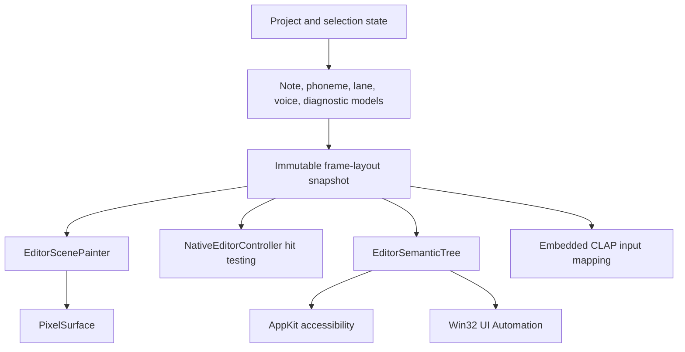
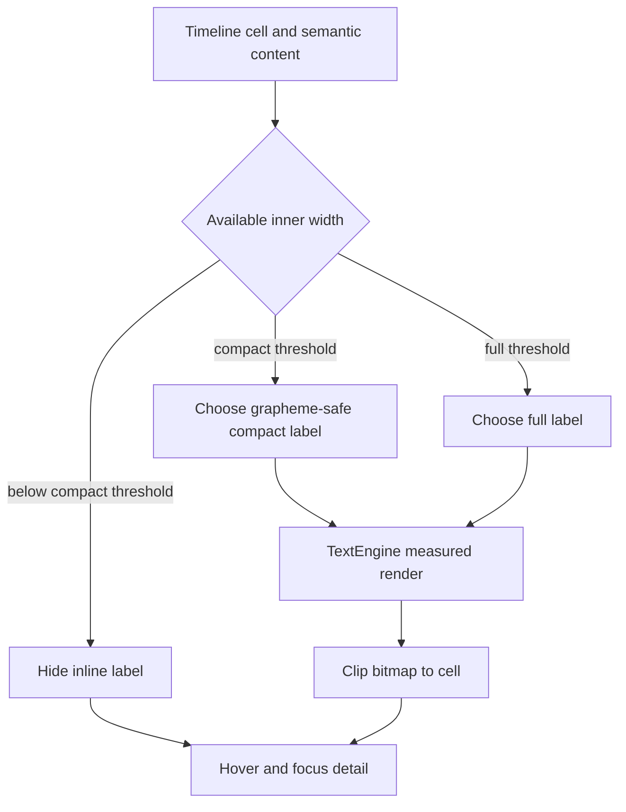
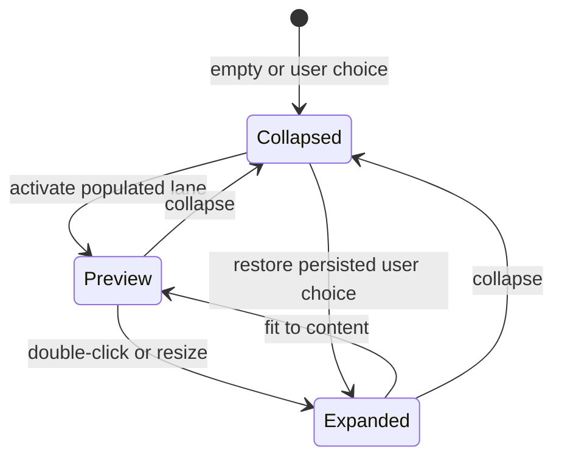
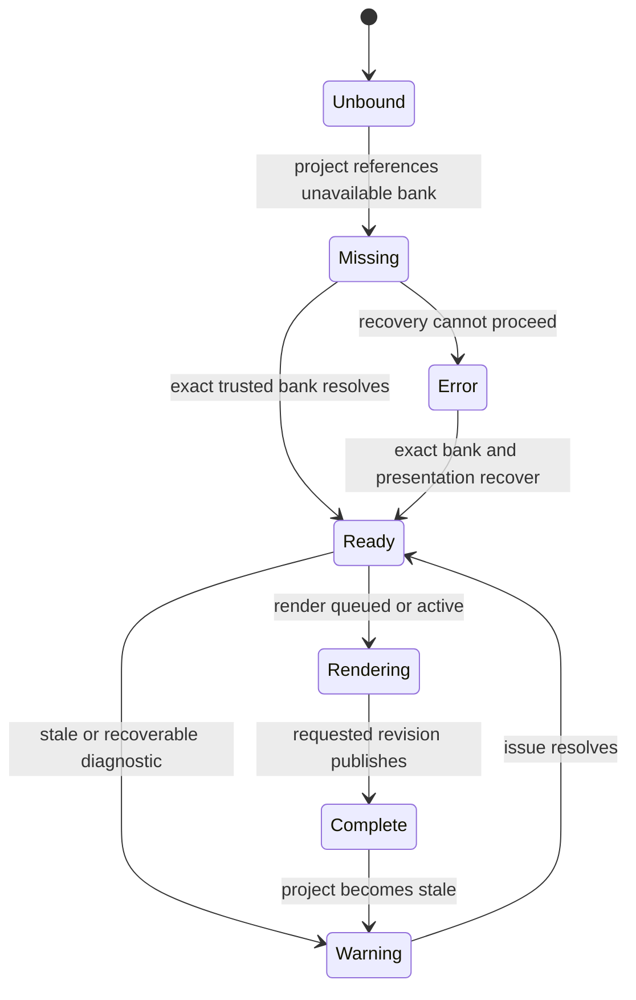

# Project SEAM Native Editor Design Completion - Plan

## Goal Capsule

- **Objective:** A musician can open Project SEAM, identify the project and active voice, read and select every musical item at practical zoom levels, recover from missing voicebank states, and complete the core editor journey without clipped text, hidden note collisions, wasted workspace, or ambiguous controls.
- **Means:** Extend the accepted first-party raster architecture with bounded text drawing, one overlap-aware layout snapshot, adaptive technical lanes, a Voice Identity Rail, human diagnostic presentation, and evidence-bound visual QA. See KTD1-KTD11.
- **Authority:** The requirements and completion rubric in this plan govern native-editor design completion. `docs/product/USABLE_ALPHA_ACCEPTANCE.md` and the External Beta contracts remain the authorities for product promotion.
- **Execution profile:** Implement behavior with deterministic tests first, preserve one geometry authority across paint, hit testing, and semantics, then verify the built macOS app through real rendered journeys.
- **Stop condition:** R1-R13 pass at one candidate commit, every implementation unit is complete, every weighted design dimension scores 100%, and no in-scope P0, P1, or P2 design finding remains open.
- **Tail ownership:** Physical Narrator observation, independent accessibility certification, rights-cleared production character art, release signing, host certification, and external musician evidence remain release-program work after this code plan closes. Local VoiceOver verification of the macOS design candidate is part of U9.

---

## Product Contract

### Summary

This plan moves the rendered native editor from the audited 42% baseline to an evidence-defined 100% state.
It fixes note and text legibility first, then workspace density, voice identity, recovery language, interaction hierarchy, accessibility, motion, and final cross-surface QA.

### Problem Frame

The 2026-08-27 rendered audit found a technically capable editor that still looks and behaves like a developer alpha.
Short notes and phoneme cells lose useful labels.
Unit identifiers are truncated by approximate character-width logic rather than actual rendered bounds.
The domain permits overlapping note intervals, but the visual model has no deterministic collision presentation.
Empty UNIT, SEAM, and PITCH lanes retain fixed height and reduce the piano roll.
The compact character portrait does not identify the selected voicebank or its readiness.
Diagnostics expose `BANK_MISSING` and message keys instead of recovery language.

The codebase already has the required foundations.
`TextEngine` measures and ellipsizes Unicode text.
`EditorSceneLayout` centralizes geometry.
`EditorSemanticTree` shares control bounds with platform accessibility bridges.
`CharacterPresentation` loads six state assets.
The missing work is to connect these foundations through one production design contract.

### Baseline and Target

| Dimension | Weight | Audited baseline | Completion target | Authoritative proof |
|---|---:|---:|---:|---|
| Information hierarchy | 15% | 42% | 100% | Five-second scan journey and toolbar/status geometry checks |
| Timeline and label readability | 20% | 32% | 100% | Bounded text, overlap fixtures, zoom matrix, and rendered captures |
| Spatial efficiency | 20% | 46% | 100% | Lane-state geometry and minimum piano-roll share checks |
| Character and voice identity | 15% | 20% | 100% | Exact bank/character binding and ready/missing/error journeys |
| Feedback and recovery | 10% | 50% | 100% | Human copy, visible valid actions, and recovery completion tests |
| Interaction clarity | 10% | 52% | 100% | Combined hover, selected, focus, conflict, and playing-state checks |
| Accessibility and resize resilience | 10% | 69% | 100% | Semantic parity, keyboard path, 480×320 floor, 200% scale, and platform observation |
| **Weighted total** | **100%** | **42%** | **100%** | All rows pass at the same candidate commit |

The percentage is a design-completion rubric.
It is not a release-readiness or audio-quality claim.

### Actors

- A1. **Musician:** authors notes and lyrics, inspects technical lanes, selects a voicebank, resolves blockers, and uses keyboard or pointer input.
- A2. **Assistive-technology user:** completes the same editor journey through keyboard focus, AppKit accessibility, or UI Automation without relying on color or truncated raster text.
- A3. **Design verifier:** evaluates deterministic fixtures and the built native app against the score matrix and candidate commit.
- A4. **Implementer:** changes shared C++ layout, controller, painter, semantics, platform adapters, and tests without creating Standalone/CLAP divergence.

### Key Decisions

- **100% means all defined evidence passes.** Visual taste alone cannot close a dimension. Governs R1-R13.
- **Keep the first-party raster renderer.** The accepted architecture remains the production boundary for this milestone. Governs R2-R12.
- **Character 01 remains a product avatar.** The UI may identify a voicebank with the character, but it must not imply that the character is the singer or performer. Governs R6 and R13.
- **External gates remain fail-closed.** Design completion does not promote Usable Alpha, External Beta, RC, or GA. Governs R1 and R13.

### Requirements

**Completion truth and shared architecture**

- R1. Every design dimension shall reach 100% only when its named automated, rendered, and manual evidence passes at one candidate commit.
- R2. Painter geometry, pointer hit testing, keyboard focus, accessibility frames, and CLAP input mapping shall consume one shared layout result for each rendered frame.

**Timeline readability and collision behavior**

- R3. Note, phoneme, unit, toolbar, status, and diagnostic text shall use actual rendered metrics, one-line bounds, and hard clipping without splitting Unicode display clusters.
- R4. Same-pitch temporal note overlaps shall remain legal project data and shall receive deterministic visual grouping that prevents silent body coverage.
- R5. Every note shall remain pointer-selectable and keyboard-selectable without changing its truthful timeline duration, including notes narrower than the minimum interactive target.

**Workspace density and hierarchy**

- R6. PHONEME, UNIT, SEAM, and PITCH shall support collapsed, preview, and expanded states with shared geometry, persistent user choice, and a piano-roll share of at least 65% when no advanced lane is expanded.
- R7. The toolbar shall present project identity, transport, tempo, edit commands, voice identity, and render state in that priority order with readable compact behavior.

**Voice identity and recovery**

- R8. The Voice Identity Rail shall show the exact selected voicebank, optional matching character avatar, readiness, and valid recovery actions without implying an unavailable or mismatched avatar is active.
- R9. Diagnostics shall show human-readable impact and valid primary recovery actions while keeping stable codes and technical details in secondary disclosure.

**Interaction, accessibility, and performance**

- R10. Default, hover, selected, keyboard-focus, conflict, playing, disabled, and stale states shall remain distinguishable when states combine and shall not rely on color alone.
- R11. The editor shall remain contained and operable at 480×320, 720×450, 960×600, 1188×768, 1280×800, and 1440×900 logical layouts and at 100% and 200% backing scale.
- R12. Lane and identity transitions shall complete within 180 ms, respect the platform Reduce Motion preference, and preserve a p95 paint time below 16.7 ms on the project reference profile.
- R13. Standalone and embedded CLAP surfaces shall preserve shared design, semantic, and input behavior without changing synthesis, PCM cache identity, voicebank trust, or release status.

### Key Flows

- F1. Dense project editing
  - **Trigger:** A1 opens a project containing short CJK notes, long lyrics, and populated technical lanes.
  - **Steps:** The editor calculates one frame layout, paints bounded labels, exposes hidden details on hover or focus, and preserves note editing.
  - **Outcome:** Every visible item is identifiable and selectable without text escaping its cell.
  - **Covered by:** R2-R5, R10-R11.
- F2. Overlapping note disambiguation
  - **Trigger:** A1 opens or creates two or more same-pitch notes with overlapping time ranges.
  - **Steps:** The layout groups the notes, allocates visible sub-bands where space permits, shows a group indicator for higher density, and lets the user cycle or inspect members.
  - **Outcome:** No note silently covers another and all members remain selectable.
  - **Covered by:** R2, R4-R5, R10.
- F3. Adaptive technical editing
  - **Trigger:** A1 opens a project with empty, sparse, or dense technical data.
  - **Steps:** Empty lanes collapse, populated lanes preview, the active lane expands, and the user can resize or persist the chosen state.
  - **Outcome:** The piano roll remains dominant while every technical editor remains reachable.
  - **Covered by:** R2, R6, R10-R11.
- F4. Missing voicebank recovery
  - **Trigger:** The selected voicebank cannot be resolved.
  - **Steps:** The Voice Identity Rail switches to missing state, suppresses the active character claim, explains the blocker, and exposes Choose or Relink actions.
  - **Outcome:** A1 reaches a selectable exact voicebank or a clear terminal error without opening a developer-oriented menu.
  - **Covered by:** R8-R10.
- F5. Voicebank change
  - **Trigger:** A1 selects a different trusted voicebank.
  - **Steps:** The exact identity, optional character binding, accent, readiness, and recovery actions update as one state transition.
  - **Outcome:** The UI never shows stale identity from the previous bank.
  - **Covered by:** R8, R10, R12-R13.
- F6. Accessible compact workflow
  - **Trigger:** A2 uses keyboard focus and assistive technology at minimum size or 200% scale.
  - **Steps:** Focus follows semantic order, bounded detail remains available, lane toggles and diagnostic actions expose native roles, and hidden controls leave the tree.
  - **Outcome:** A2 completes the same selection and recovery journey as A1.
  - **Covered by:** R2-R3, R5-R12.

### Acceptance Examples

- AE1. **Covers R3.** Given a 20 px-wide Japanese note, when the scene paints, then no inline lyric is drawn and the full lyric remains available through focus detail.
- AE2. **Covers R3.** Given a 60 px unit cell with a 40-character CJK identifier, when the scene paints, then the source stem is ellipsized inside the cell and the renderer remains visible only when its own line fits.
- AE3. **Covers R3.** Given Korean text with combining marks and emoji, when fitting occurs, then no UTF-8 byte sequence or visible display cluster is split.
- AE4. **Covers R4-R5.** Given three same-pitch notes with overlapping time ranges, when the user clicks the overlap group repeatedly, then each note becomes selected in stable order and its timeline duration stays unchanged.
- AE5. **Covers R4-R5.** Given five same-pitch overlaps at 25% zoom, when the group renders, then three visual bands plus a `+2` indicator expose density and the detail panel lists all five notes.
- AE6. **Covers R6.** Given zero UNIT, SEAM, and PITCH items, when the project opens, then each empty lane occupies no more than 30 px and the piano roll receives at least 65% of editor content height.
- AE7. **Covers R6.** Given an expanded PITCH lane, when the user drags its divider below the minimum, then the height clamps to 96 px and the shared semantic frame matches the painted frame.
- AE8. **Covers R8.** Given no resolved voicebank and a bundled character package, when the editor opens, then the character is not presented as active and the rail shows missing voicebank recovery.
- AE9. **Covers R8.** Given a trusted selected bank whose character binding matches the loaded package, when render state changes from queued to ready, then the rail changes from Rendering to Complete without changing audio identity.
- AE10. **Covers R9.** Given `BANK_MISSING` with Choose, Relink, Install, Copy, and Support actions, when the banner renders at 960 px, then human copy and the first two valid recovery actions are visible while technical actions remain in disclosure.
- AE11. **Covers R10.** Given a selected note that is also focused and conflicting, when it paints, then selection, focus, and conflict remain independently perceivable.
- AE12. **Covers R11.** Given a 720×450 logical window at 200% backing scale, when the full editor renders, then every semantic node has positive contained bounds and no toolbar group overlaps the identity control.
- AE13. **Covers R12.** Given Reduce Motion enabled, when a lane or identity mode changes, then geometry commits in one frame with no intermediate animation.
- AE14. **Covers R12.** Given Reduce Motion disabled, when a lane expands, then the transition finishes within 180 ms and p95 paint time remains below the target.
- AE15. **Covers R13.** Given the same project in Standalone and embedded CLAP, when both render at the same logical size, then note, lane, identity, and semantic geometry match except for documented host overlays.
- AE16. **Covers R1 and R13.** Given every design gate passes, when status documentation is updated, then design completion is recorded while Usable Alpha and External Beta remain unchanged unless their independent evidence also exists.

### Success Criteria

- SC1. The weighted design score is 100% because every dimension row has complete evidence, not because scores were manually edited.
- SC2. The five-second scan test identifies project, voicebank readiness, transport state, active lane, and blocking recovery on five consecutive trials.
- SC3. The complete label and overlap fixture matrix produces zero out-of-cell pixels and zero unreachable notes.
- SC4. The keyboard-only and assistive-technology journeys complete without a pointer and without color-only information.
- SC5. The candidate produces no in-scope P0, P1, or P2 finding in a fresh rendered design review.

### Scope Boundaries

**In scope**

- Shared native scene, controller, text, note layout, semantics, and platform presentation behavior.
- Standalone and embedded CLAP parity where they consume the shared editor scene.
- Presentation-only project state needed to persist lane and identity layout choices.
- Existing runtime Character 01 state assets and asset-agnostic fallback behavior.
- Deterministic raster captures, geometry assertions, performance measurement, and real macOS manual QA.

#### Deferred to Follow-Up Work

- Full localization beyond an English copy catalog with localization-ready keys.
- A later GPU renderer or iPlug2/Skia migration after measured need and a separate ADR.
- New Voicebank Studio visual design beyond shared text, theme, and character primitives.
- Public marketing, onboarding, storefront, and installer visual redesign.

**Outside this product goal**

- Final public Character 01 artwork, performer likeness, trademark approval, or production redistribution rights.
- Voicebank recording, performer consent, synthesis quality, audio callback behavior, export audio, and release signing.
- Promotion of Usable Alpha, External Beta, Release Candidate, or General Availability.

### Dependencies

- The current `TextEngine` Unicode measurement and ellipsis behavior.
- The accepted renderer boundary in `docs/adr/0018-first-party-native-standalone-shell.md` and `docs/adr/0020-usable-alpha-rendering-architecture.md`.
- The character/voicebank separation contract in `docs/phase5_1/CHARACTER_INTEGRATION.md`.
- Existing AppKit, Win32, and X11 platform adapters and semantic bridges.
- A build environment capable of producing the native macOS bundle for final manual QA.

### Sources

- `libs/seam-native-ui/include/seam/native_ui/editor_scene.hpp` owns current visual tokens and layout helpers.
- `libs/seam-native-ui/src/editor_scene.cpp` owns painter behavior and current approximate fitting.
- `libs/seam-native-ui/src/editor_controller.cpp` owns pointer, keyboard, lane, voicebank, and diagnostic interaction.
- `libs/seam-native-ui/src/editor_semantics.cpp` owns the shared accessibility geometry and actions.
- `libs/seam-editor-ui/src/piano_roll_model.cpp` and `libs/seam-editor-ui/src/note_spatial_index.cpp` own note geometry and query order.
- `libs/seam-text/include/seam/text/text_engine.hpp` already supplies Unicode metrics, bounded width, and ellipsis.
- `libs/seam-native-ui/src/character_presentation.cpp` and `libs/seam-authoring-runtime/src/voicebank_browser.cpp` own character state assets and voicebank cards.
- `tests/test_native_ui.cpp`, `tests/test_ui.cpp`, `tests/test_text.cpp`, `tests/test_editor_semantics.cpp`, and `tests/test_accessibility_appkit.mm` define current deterministic proof patterns.

---

## Planning Contract

### Key Technical Decisions

- KTD1. **Keep the accepted renderer boundary.** Extend `EditorSceneState -> RasterCanvas -> native adapter`; do not introduce a framework rewrite. Governs R2-R13.
- KTD2. **Build one immutable frame-layout snapshot.** A pure shared builder wins over independent painter/controller arithmetic because adaptive lanes make duplicated geometry unsafe. Painter, hit testing, semantics, focus, and CLAP input mapping consume the same note, lane, toolbar, rail, banner, and status rectangles. Governs R2, R4-R13.
- KTD3. **Bound text at the raster primitive.** A single bounded render call wins over pre-measure-then-render because it avoids duplicate glyph work and returns final metrics. `RasterCanvas` clips the bitmap and keeps a bounded no-font fallback. Governs R3 and R12.
- KTD4. **Preserve overlap as project data.** Stable `O(n log k)` interval grouping wins over project rejection because the current domain and commands permit overlapping intervals. Group viewport-query results for paint and input; retain truthful offscreen semantic bounds and recompute grouping when a note enters the viewport. Governs R4-R5 and R12.
- KTD5. **Separate truthful note duration from interactive geometry.** Each note carries timeline bounds, paint bounds, and a minimum hit region. An actual paint-bound hit wins; otherwise the nearest hit-region center wins with stable note ID as the final tie-break. Governs R4-R5.
- KTD6. **Persist lane presentation as ViewOnly state.** Project presentation settings win over a standalone-only preference file because Character display already follows this precedent and CLAP reopen parity needs the same state. Use an undoable presentation command and normalize the state out of render identity. Governs R6 and R13.
- KTD7. **Model voice identity from exact bindings.** One pure view model wins over painter-side matching because Standalone, CLAP, semantics, and recovery actions must change atomically. The model consumes selected track identity, `VoicebankCard`, character manifest binding, render status, and active diagnostics. Governs R8 and R13.
- KTD8. **Map diagnostic data to presentation copy.** Stable codes remain diagnostic authority, while a native presentation catalog owns title, impact sentence, action labels, and primary-action order. Governs R9.
- KTD9. **Make animation deterministic and optional.** An injected UI-thread clock wins over background timers because repaint and accessibility snapshots already belong to the UI boundary. Platform preferences disable interpolation without changing final geometry. Governs R10-R12.
- KTD10. **Close the score from evidence.** Geometry, pixel containment, semantic parity, performance, rendered capture, and native journey records must all reference the same candidate commit. Governs R1 and R13.
- KTD11. **Use three responsive density modes.** Wide, medium, and compact modes win over independent per-control hiding because users must predict where a command and voice state move as space contracts. Secondary commands move to native menus before primary transport or recovery state is removed. Governs R7-R11.

### Assumptions

- Existing overlapping notes are valid project data until a separate musical-domain contract says otherwise.
- The current internal runtime character package may be used for development and closed evaluation, but this plan grants no public redistribution or final-IP authority.
- English recovery copy is acceptable for this implementation pass if every string is catalog-backed and localization-ready.
- The existing 480×320 editor minimum remains supported even though the primary audit sizes start at 960×600.
- Standalone is the primary design surface, while shared-scene changes must retain embedded CLAP parity.
- Screenshot comparison is supplemental; deterministic geometry, text, semantics, and runtime journeys remain the primary proof.

### High-Level Technical Design

#### Shared frame-layout authority

The frame snapshot is the only geometry authority for R2.
Platform adapters present the result and do not redefine layout policy.

#### Bounded text and note-density flow

#### Technical lane state machine

#### Voice identity state machine

The character portrait is active only when the selected voicebank binding matches the loaded character package.
Text-only voice identity remains valid when no character package exists.

#### Responsive density contract

| Effective mode | Logical width | Toolbar and identity behavior |
|---|---:|---|
| Wide | 1180 px or greater | Project, transport, tempo, Lyrics, Loop, render state, and compact voice identity remain visible; a user-requested Full rail may open |
| Medium | 720-1179 px | Project moves to the subtitle, transport and voice identity remain visible, and secondary edit commands may compact; a saved Full rail request becomes compact without changing the saved preference |
| Compact | 480-719 px | Play, Stop, tempo, project subtitle, voice name/readiness, and blocking recovery remain visible; Lyrics and Loop remain reachable through native menus, shortcuts, and semantics |

The effective mode changes with width.
The saved character preference and lane preferences do not change when the window temporarily compacts.

#### Voice-state precedence

| Priority | Condition | Presented state |
|---:|---|---|
| 1 | Blocking runtime or package diagnostic | Error |
| 2 | Referenced voicebank unresolved or mismatched | Missing with recovery actions |
| 3 | Stale audio or recoverable diagnostic | Warning |
| 4 | Render queued or active | Rendering |
| 5 | Requested revision publishes successfully | Complete for 1.2 seconds |
| 6 | Pointer, keyboard, or playback focus is active | Focused |
| 7 | Exact bank is ready and idle | Ready with neutral portrait |

After the Complete dwell ends, the state returns to Focused or Ready according to current input and playback state.
Diagnostic severity is ordered Critical, Error, Warning, then Info.
The banner shows the highest-severity earliest entry, and Details exposes the remaining stable order.

### System-Wide Impact

- **Domain and serialization:** R6 adds presentation-only settings with backward-compatible defaults and render-snapshot normalization.
- **Application commands:** View changes become undoable `ViewOnly` commands instead of direct project mutation.
- **Shared UI:** Standalone and CLAP receive one note, lane, identity, banner, and status contract.
- **Accessibility:** New toggle, detail, recovery, and overlap-group nodes must preserve stable IDs and positive contained frames.
- **Performance:** Text measurement, overlap grouping, and animation add paint work; caches and frame snapshots must keep the p95 budget.
- **Content/IP:** The current character can improve internal product identity, but runtime behavior must remain correct with no package or a mismatched package.
- **Release truth:** Status documents may report design completion only; product promotion remains independently evidence-gated.

### Phased Delivery and Score Burn-Up

| Milestone | Units | Expected weighted score | Gate |
|---|---|---:|---|
| Baseline locked | U1 | 42% | Reproducible fixtures and current evidence retained |
| Readable timeline | U2-U3 | 59% | Text and overlaps pass every zoom fixture |
| Efficient workspace | U4 | 72% | Adaptive lanes and reopen parity pass |
| Coherent voice identity | U5 | 90% | Exact identity and recovery journeys pass |
| Clear hierarchy and feedback | U6-U7 | 98.5% | Toolbar, diagnostics, state, and semantics pass |
| Production polish | U8 | 99% | Contrast, motion, scaling, and performance pass |
| Evidence closure | U9 | 100% | Same-SHA automated and native QA package passes |

The intermediate values are planning projections.
Only the U9 evidence gate can declare 100%.

### Risks and Mitigations

| Risk | Impact | Mitigation |
|---|---|---|
| Painter and input geometry diverge during adaptive layout | Invisible or incorrect hit targets | Make KTD2 the first dependency for every geometry-bearing unit |
| Unicode fallback behaves differently from `TextEngine` | Clipped or mojibake labels on missing fonts | Keep the fallback bounded and expose full semantic detail independent of raster text |
| Overlap hit regions remain ambiguous | Users cannot select covered notes | Stable group order, selection cycling, keyboard list access, and explicit density indicator |
| Presentation settings trigger render work | UI changes waste synthesis and alter cache identity | Use `ViewOnly` impact and normalize settings out of render snapshots |
| Character artwork implies an unavailable singer | Product identity and legal risk | Require exact character binding, use text-only fallback, and keep avatar language |
| Dynamic accent weakens contrast | Focus and text become inaccessible | Validate resolved theme tokens against contrast thresholds and fall back to default accent |
| Screenshot tests become brittle | Routine raster changes block delivery without finding defects | Assert geometry, clipping, and semantic invariants; use screenshots for human comparison |
| Animation causes repaint races or host churn | Performance or thread-safety regression | Use injected monotonic state, no background UI mutation, and existing repaint callbacks |
| Standalone changes leave CLAP behind | Host editor differs from native product | Include CLAP paint, input, and semantic checks in every shared-layout unit |
| Current source docs overstate visual completeness | False 100% claim | U9 re-runs the rendered audit and treats current screenshots as the authority |

### Documentation and Operational Notes

- Add `docs/design/NATIVE_EDITOR_DESIGN_SYSTEM.md` as the durable owner for typography, spacing, colors, state combinations, lane behavior, voice identity, and evidence thresholds.
- Update `docs/product/USABLE_ALPHA_IMPLEMENTATION_PROGRESS.md` only after U9 passes.
- Record the design candidate commit, build identity, fixture matrix, screenshot hashes, benchmark result, and manual QA outcome under `.omo/evidence/`.
- Do not change `docs/product/usable-alpha-acceptance.json` or External Beta acceptance state from design evidence alone.

---

## Implementation Units

### U1. Lock the design fixture and evidence baseline

- **Goal:** Create deterministic fixtures and a capture harness that reproduce every audited failure and every completion viewport.
- **Requirements:** R1-R5, R8-R13.
- **Dependencies:** None.
- **Files:**
  - Create `tests/native_ui_design_fixture.hpp`.
  - Create `scripts/capture_native_ui_design_matrix.py`.
  - Modify `tests/test_native_ui.cpp`.
  - Modify `tests/test_editor_semantics.cpp`.
  - Modify `CMakeLists.txt`.
- **Approach:**
  1. Build reusable projects for short CJK notes, long multilingual text, 2/3/5 same-pitch overlaps, empty/sparse/dense lanes, and ready/missing/error voicebanks.
  2. Parameterize logical size, backing scale, timeline zoom, character mode, and diagnostic state.
  3. Emit PPM captures plus a machine-readable manifest with fixture ID, dimensions, scale, zoom, and checksum.
  4. Record CPU, memory, OS build, power mode, text-font identities, and warm/cold cache state for every performance run.
  5. Keep existing audited screenshots as human baseline evidence; do not convert them into brittle pixel goldens.
- **Execution note:** Add characterization fixtures before changing geometry so regressions can be attributed to a unit.
- **Patterns to follow:** Environment-controlled captures in `tests/test_native_ui.cpp`; candidate-bound evidence patterns in existing phase evidence scripts.
- **Test scenarios:**
  - Render each fixture at 480×320, 720×450, 960×600, 1188×768, 1280×800, and 1440×900.
  - Render each dense timeline fixture at 25%, 50%, 100%, and 200% horizontal zoom.
  - Render 100% and 200% backing-scale variants and assert identical logical geometry.
  - Re-run the same fixture twice and assert stable checksums and manifest metadata.
  - Reject a capture manifest when an expected fixture or dimension is missing.
- **Verification:** The matrix reproduces the current text, lane, identity, and diagnostic weaknesses and provides deterministic inputs for U2-U9.

### U2. Add bounded Unicode text and semantic label policy

- **Goal:** Ensure every editor label is measured, ellipsized, and clipped inside its owning rectangle.
- **Requirements:** R2-R3, R7, R9, R11-R13.
- **Dependencies:** U1.
- **Files:**
  - Create `libs/seam-native-ui/include/seam/native_ui/editor_label_policy.hpp`.
  - Create `libs/seam-native-ui/src/editor_label_policy.cpp`.
  - Create `libs/seam-native-ui/include/seam/native_ui/editor_design_system.hpp`.
  - Create `libs/seam-native-ui/include/seam/native_ui/editor_frame_layout.hpp`.
  - Create `libs/seam-native-ui/src/editor_frame_layout.cpp`.
  - Modify `libs/seam-native-ui/include/seam/native_ui/pixel_surface.hpp`.
  - Modify `libs/seam-native-ui/src/pixel_surface.cpp`.
  - Modify `libs/seam-native-ui/include/seam/native_ui/editor_scene.hpp`.
  - Modify `libs/seam-native-ui/src/editor_scene.cpp`.
  - Modify `tests/test_text.cpp`.
  - Modify `tests/test_native_ui.cpp`.
  - Modify `CMakeLists.txt`.
- **Approach:**
  1. Move theme and layout tokens out of the 843-line scene header into a focused design-system header.
  2. Add a pure frame-layout builder that aggregates toolbar, timeline, lane, rail, banner, and status geometry.
  3. Add a bounded single-line raster text operation that sends maximum width and ellipsis policy to `TextEngine`.
  4. Clip every rendered alpha bitmap to the supplied rectangle before blending.
  5. Add a deterministic fallback that never paints beyond the rectangle when no Unicode engine is available.
  6. Move note, phoneme, unit, toolbar, status, and diagnostic label selection into one pure policy.
  7. Use full, compact, and hidden modes based on inner width and final rendered metrics.
  8. Preserve complete source values for U7 to expose through semantic and detail models rather than forcing more text into a cell.
- **Patterns to follow:** `TextEngine::render`, `TextStyle.maximumWidth`, `TextStyle.maximumLines`, `TextStyle.ellipsize`, and the current display-cluster utilities.
- **Test scenarios:**
  - Draw long Latin, Korean, Japanese, Chinese, combining-mark, ZWJ emoji, and malformed-byte fallback strings into guarded rectangles and assert no changed pixel outside each guard.
  - Fit note labels at widths immediately below, at, and above every policy threshold.
  - Fit unit labels where only the renderer badge fits, where only the source stem fits, and where both lines fit.
  - Render with and without `TextEngine` and assert both paths remain bounded.
  - Build the same frame layout from painter, controller, semantics, and CLAP contexts and assert equal rectangles.
  - Preserve the special stale-audio semantic priority without allowing its text to escape the status region.
- **Verification:** The U1 matrix shows zero out-of-cell text pixels, and no complete source value is discarded before U7 exposes detail access.

### U3. Introduce overlap-aware note layout and selection

- **Goal:** Make same-pitch overlapping notes visible and selectable without changing musical timing.
- **Requirements:** R2, R4-R5, R10-R13.
- **Dependencies:** U1-U2.
- **Files:**
  - Create `libs/seam-editor-ui/include/seam/ui/note_visual_layout.hpp`.
  - Create `libs/seam-editor-ui/src/note_visual_layout.cpp`.
  - Modify `libs/seam-editor-ui/include/seam/ui/piano_roll_model.hpp`.
  - Modify `libs/seam-editor-ui/src/piano_roll_model.cpp`.
  - Modify `libs/seam-native-ui/include/seam/native_ui/editor_scene.hpp`.
  - Modify `libs/seam-native-ui/src/editor_scene.cpp`.
  - Modify `libs/seam-native-ui/include/seam/native_ui/editor_controller.hpp`.
  - Modify `libs/seam-native-ui/src/editor_controller.cpp`.
  - Modify `libs/seam-native-ui/src/editor_semantics.cpp`.
  - Modify `libs/seam-clap-editor/src/editor_runtime_input.cpp`.
  - Modify `libs/seam-clap-editor/src/editor_runtime_paint.cpp`.
  - Modify `tests/test_ui.cpp`.
  - Modify `tests/test_native_ui.cpp`.
  - Modify `tests/test_editor_semantics.cpp`.
  - Modify `tests/test_phase11_clap_editor.cpp`.
  - Modify `CMakeLists.txt`.
- **Approach:**
  1. Group intersecting intervals by MIDI key with stable ordering by start, end, and note ID.
  2. Produce truthful timeline bounds, partitioned paint bounds, minimum hit bounds, overlap depth, member count, and label mode from one layout pass.
  3. Allocate up to three visible sub-bands when row height supports them.
  4. Add a density indicator and member detail list when group depth exceeds visible capacity.
  5. Select the topmost body on a normal click, cycle members only through the overlap indicator, and expose every member through keyboard and semantics.
  6. Keep resize handles tied to the selected member's truthful end position.
- **Technical design:** Directional guidance: use interval partitioning per MIDI row and reuse the result for painting, selection, box selection, resize handles, and semantic frames.
- **Patterns to follow:** `NoteSpatialIndex` stable query order, `PianoRollModel` viewport transforms, and reverse-order hit testing.
- **Test scenarios:**
  - Lay out two notes with partial overlap and assert distinct paint bands plus unchanged timeline bounds.
  - Lay out three notes with identical intervals and assert stable ordering across rebuilds.
  - Lay out five notes and assert the overflow indicator reports two hidden visual members while all five remain selectable.
  - Lay out a 10,000-note project with dense local overlap and assert visible grouping remains bounded and avoids quadratic work.
  - Select each member through the overlap indicator and by semantic activation while preserving double-click lyric editing on the selected note body.
  - Overlap expanded hit regions from adjacent short notes and assert actual paint bounds win before the nearest-center and stable-ID tie-breaks.
  - Resize one member and assert only that note's command changes.
  - Box-select an overlap group and assert each intersecting note is included once.
  - Compare Standalone and CLAP note geometry at the same viewport.
- **Verification:** AE4-AE5 and the full zoom matrix pass with zero silently covered or unreachable notes.

### U4. Implement adaptive technical lanes and ViewOnly persistence

- **Goal:** Give the piano roll space when lanes are empty while keeping technical editing predictable and persistent.
- **Requirements:** R2, R6, R10-R13.
- **Dependencies:** U1-U3.
- **Files:**
  - Create `libs/seam-application/include/seam/application/view_commands.hpp`.
  - Create `libs/seam-application/src/view_commands.cpp`.
  - Modify `libs/seam-domain/include/seam/domain/project.hpp`.
  - Modify `libs/seam-formats/src/project_json.cpp`.
  - Modify `libs/seam-rendering/src/render_snapshot.cpp`.
  - Modify `libs/seam-native-ui/include/seam/native_ui/editor_scene.hpp`.
  - Modify `libs/seam-native-ui/src/editor_scene.cpp`.
  - Modify `libs/seam-native-ui/include/seam/native_ui/editor_controller.hpp`.
  - Modify `libs/seam-native-ui/src/editor_controller.cpp`.
  - Modify `libs/seam-native-ui/src/editor_semantics.cpp`.
  - Modify `libs/seam-clap-editor/src/editor_runtime_input.cpp`.
  - Modify `libs/seam-clap-editor/src/editor_runtime_paint.cpp`.
  - Modify `tests/test_commands.cpp`.
  - Modify `tests/test_command_impact.cpp`.
  - Modify `tests/test_serialization.cpp`.
  - Modify `tests/test_rendering.cpp`.
  - Modify `tests/test_native_ui.cpp`.
  - Modify `tests/test_editor_semantics.cpp`.
  - Modify `tests/test_phase11_clap_editor.cpp`.
  - Modify `CMakeLists.txt`.
- **Approach:**
  1. Add backward-compatible presentation settings for mode and preferred expanded height per technical lane.
  2. Apply changes through an undoable `ViewOnly` command and exclude them from render identity.
  3. Replace fixed lane arithmetic with a content-aware geometry input.
  4. Default empty lanes to collapsed, populated inactive lanes to preview, and the active lane to expanded unless a user choice overrides the default.
  5. Share lane header, divider, content, and interaction bounds through KTD2.
  6. Support header toggle, double-click fit, Option-toggle-all, keyboard Toggle, and divider drag.
- **Patterns to follow:** Existing `CharacterDisplayMode` persistence, command impact classification, project JSON defaulting, and render-snapshot presentation normalization.
- **Test scenarios:**
  - Load an older project without lane settings and assert safe defaults.
  - Load invalid or non-finite persisted lane heights and assert parsing fails safely or normalizes to bounded defaults.
  - Save and reopen custom lane modes and heights and assert exact restoration.
  - Undo and redo a lane mode change without submitting a render request.
  - Collapse every empty lane and assert each height is at most 30 px.
  - Expand one lane and assert its height clamps at or above 96 px.
  - Drag each divider at normal and minimum sizes and assert painter, hit, and semantic bounds remain equal.
  - Change content from empty to populated and assert a persisted user collapse is not overridden.
  - Assert render snapshot hashes remain unchanged across lane presentation changes.
- **Verification:** AE6-AE7 pass and the piano roll retains at least 65% of available editor height when no advanced lane is expanded.

### U5. Build the Voice Identity Rail and character variants

- **Goal:** Connect character assets to exact voicebank identity and readiness without misrepresenting performer identity.
- **Requirements:** R2, R7-R8, R10-R13.
- **Dependencies:** U1-U4.
- **Files:**
  - Create `libs/seam-native-ui/include/seam/native_ui/voice_identity.hpp`.
  - Create `libs/seam-native-ui/src/voice_identity.cpp`.
  - Modify `libs/seam-native-ui/include/seam/native_ui/character_presentation.hpp`.
  - Modify `libs/seam-native-ui/src/character_presentation.cpp`.
  - Modify `libs/seam-native-ui/include/seam/native_ui/pixel_surface.hpp`.
  - Modify `libs/seam-native-ui/src/pixel_surface.cpp`.
  - Modify `libs/seam-authoring-runtime/include/seam/authoring/voicebank_browser.hpp`.
  - Modify `libs/seam-authoring-runtime/src/voicebank_browser.cpp`.
  - Modify `libs/seam-native-ui/include/seam/native_ui/editor_scene.hpp`.
  - Modify `libs/seam-native-ui/src/editor_scene.cpp`.
  - Modify `libs/seam-native-ui/include/seam/native_ui/editor_controller.hpp`.
  - Modify `libs/seam-native-ui/src/editor_controller.cpp`.
  - Modify `libs/seam-native-ui/src/editor_semantics.cpp`.
  - Modify `libs/seam-standalone/src/native_editor_app.cpp`.
  - Modify `libs/seam-clap-editor/src/editor_runtime_adapter.cpp`.
  - Modify `libs/seam-clap-editor/src/editor_runtime_paint.cpp`.
  - Modify `tests/test_native_ui.cpp`.
  - Modify `tests/test_voicebank_browser.cpp`.
  - Modify `tests/test_standalone_voicebank_workflow.cpp`.
  - Modify `tests/test_phase11_clap_editor.cpp`.
  - Modify `CMakeLists.txt`.
- **Approach:**
  1. Extend voicebank cards with character ID and version so identity matching uses exact metadata rather than a boolean.
  2. Derive one `VoiceIdentityView` from selected track, exact bank card, character package, render state, and diagnostic state.
  3. Add compact and full portrait variants; use an upper-body crop for compact mode and preserve full portrait composition in the rail.
  4. Show text-only identity when no matching character package exists.
  5. Suppress the active portrait when the referenced voicebank is missing or mismatched.
  6. Apply the documented voice-state precedence, including the 1.2-second Complete dwell and return to Focused or Ready.
  7. Apply character accent only when exact binding and contrast validation pass.
  8. Expose Choose, Relink, and Install actions from the existing recovery callbacks.
- **Patterns to follow:** `CharacterPresentation`, `VoicebankBrowserModel`, `TrackInspectorSnapshot`, `RenderStatusView`, and `docs/phase5_1/CHARACTER_INTEGRATION.md`.
- **Test scenarios:**
  - Resolve a trusted selected bank with a matching character package and assert full identity metadata and portrait.
  - Resolve the same bank with no package and assert text-only identity with no failure.
  - Load a package bound to another bank and assert no active portrait or dynamic accent.
  - Enter missing, untrusted, version-mismatch, content-mismatch, rendering, complete, warning, and error states.
  - Change banks and assert no field from the previous identity remains.
  - Render compact and full variants at all target sizes and scales.
  - Activate Choose and Relink through pointer, keyboard, and accessibility paths.
  - Assert character state changes do not alter render snapshot or PCM identity.
- **Verification:** AE8-AE9 pass, and a verifier can identify the active voicebank and readiness within two seconds in five consecutive trials.

### U6. Recompose toolbar, status, and diagnostic recovery

- **Goal:** Establish a clear command hierarchy and replace developer telemetry with actionable user feedback.
- **Requirements:** R2-R3, R7, R9-R13.
- **Dependencies:** U1-U5.
- **Files:**
  - Create `libs/seam-native-ui/include/seam/native_ui/diagnostic_presentation.hpp`.
  - Create `libs/seam-native-ui/src/diagnostic_presentation.cpp`.
  - Modify `libs/seam-native-ui/include/seam/native_ui/diagnostic_panel.hpp`.
  - Modify `libs/seam-native-ui/src/diagnostic_panel.cpp`.
  - Modify `libs/seam-native-ui/include/seam/native_ui/render_status_panel.hpp`.
  - Modify `libs/seam-native-ui/src/render_status_panel.cpp`.
  - Modify `libs/seam-native-ui/include/seam/native_ui/editor_scene.hpp`.
  - Modify `libs/seam-native-ui/src/editor_scene.cpp`.
  - Modify `libs/seam-native-ui/src/editor_controller.cpp`.
  - Modify `libs/seam-native-ui/src/editor_semantics.cpp`.
  - Modify `libs/seam-platform/include/seam/platform/application_menu.hpp`.
  - Modify `libs/seam-platform/src/application_menu_appkit.mm`.
  - Modify `libs/seam-platform/src/application_menu_win32.cpp`.
  - Modify `libs/seam-standalone/src/application_controller.cpp`.
  - Modify `tests/test_diagnostic_panel.cpp`.
  - Modify `tests/test_render_status_panel.cpp`.
  - Modify `tests/test_native_ui.cpp`.
  - Modify `tests/test_editor_semantics.cpp`.
  - Modify `tests/test_platform.cpp`.
  - Modify `tests/test_standalone_authoring_integration.cpp`.
  - Modify `CMakeLists.txt`.
- **Approach:**
  1. Add one toolbar geometry result with project, transport, tempo, edit, identity, and render groups.
  2. Implement KTD11 with deterministic Wide, Medium, and Compact geometry.
  3. Add a native-menu command for lyric distribution so compact mode never makes the feature keyboard-only.
  4. Raise control and text sizes while preserving compact layout and minimum-window containment.
  5. Split render presentation into a concise user state and a technical detail value.
  6. Map registered diagnostic codes to title, impact, action labels, and action priority.
  7. Sort diagnostics by the documented severity and stable-entry contract before selecting the banner item.
  8. Draw a bordered diagnostic banner with one or two primary actions and a Details disclosure.
  9. Keep raw code, message key, request identity, Copy, and Support inside disclosure and semantics.
  10. Remove whole-strip activation of the first action and use explicit shared button bounds.
- **Patterns to follow:** Existing diagnostic registry action validation, export cancel geometry, and semantic action dispatch.
- **Test scenarios:**
  - Lay out every toolbar group at each target width and assert no overlap or negative bounds.
  - Cross the 720 px and 1180 px boundaries in both directions and assert commands move according to KTD11 without changing saved preferences.
  - Activate lyric distribution from the compact native menu and assert it reaches the same bounded text-input path as Shift-L.
  - Present ready, stale, queued, rendering, failed, and audio-unavailable render summaries.
  - Present every registered diagnostic code and assert non-empty human copy, then verify an unregistered diagnostic remains rejected by the existing registry.
  - Verify only actions present in the diagnostic model become enabled buttons.
  - Render one, two, and five diagnostics at normal and compact widths.
  - Activate primary and secondary actions through pointer and semantics.
  - Verify raw codes remain available without becoming primary copy.
- **Verification:** AE10 passes and the five-second scan test identifies all five required states.

### U7. Complete interaction states, detail access, and semantic parity

- **Goal:** Make every visual state and hidden detail perceivable through pointer, keyboard, and assistive technology.
- **Requirements:** R2-R5, R8-R11, R13.
- **Dependencies:** U2-U6.
- **Files:**
  - Create `libs/seam-native-ui/include/seam/native_ui/editor_interaction_state.hpp`.
  - Create `libs/seam-native-ui/src/editor_interaction_state.cpp`.
  - Modify `libs/seam-native-ui/include/seam/native_ui/editor_scene.hpp`.
  - Modify `libs/seam-native-ui/src/editor_scene.cpp`.
  - Modify `libs/seam-native-ui/include/seam/native_ui/editor_controller.hpp`.
  - Modify `libs/seam-native-ui/src/editor_controller.cpp`.
  - Modify `libs/seam-native-ui/include/seam/native_ui/editor_semantics.hpp`.
  - Modify `libs/seam-native-ui/src/editor_semantics.cpp`.
  - Modify `libs/seam-native-ui/src/accessibility_appkit.mm`.
  - Modify `libs/seam-native-ui/src/accessibility_win32.cpp`.
  - Modify `libs/seam-clap-editor/src/editor_runtime_accessibility.cpp`.
  - Modify `tests/test_native_ui.cpp`.
  - Modify `tests/test_editor_semantics.cpp`.
  - Modify `tests/test_accessibility_tree.cpp`.
  - Modify `tests/test_accessibility_appkit.mm`.
  - Modify `tests/test_phase11_clap_editor.cpp`.
  - Modify `tests/test_macos_source_contract.py`.
  - Modify `tests/test_windows_source_contract.py`.
  - Modify `CMakeLists.txt`.
- **Approach:**
  1. Move hover, overlap-member cycling, detail-popover, and transition state into a focused interaction model instead of expanding the 2,700-line controller with more ad hoc fields.
  2. Track hover independently from drag and selection.
  3. Add a bounded shared detail popover for hidden note, phoneme, unit, overlap, voice, and diagnostic content.
  4. Build note appearance from independent state layers instead of one mutually exclusive fill.
  5. Add stable semantic nodes for overlap groups, detail content, lane toggles, identity actions, and diagnostic disclosure.
  6. Remove hidden or zero-sized controls from the semantic tree.
  7. Preserve editable-note value behavior and lazy note paging.
  8. Keep focus geometry identical to the visible control after every layout transition.
- **Patterns to follow:** Existing modal Sample Microscope semantics, focus-ring publication, AppKit lazy note pages, and UIA action forwarding.
- **Test scenarios:**
  - Combine selected, hovered, focused, conflicting, stale, and playing states and assert each required cue remains.
  - Hover and focus labels hidden by U2 and assert the same full detail appears.
  - Navigate overlap groups, lane toggles, identity actions, and diagnostic disclosure with Tab and Shift-Tab.
  - Edit a focused CJK note through AppKit value setting after overlap layout is active.
  - Traverse the 480×320 tree and assert every nested node has positive contained bounds.
  - Compare AppKit and UIA names, values, roles, selected state, enabled state, and actions.
  - Open the detail popover and assert background controls remain correctly exposed or hidden according to modality.
- **Verification:** AE11-AE12 pass and the complete keyboard-only journey reaches every critical action.

### U8. Apply production visual tokens, motion, and performance budgets

- **Goal:** Finish typography, contrast, grid hierarchy, character accent, and transitions without breaking performance or platform preferences.
- **Requirements:** R3, R7-R8, R10-R13.
- **Dependencies:** U1-U7.
- **Files:**
  - Create `libs/seam-platform/include/seam/platform/accessibility_preferences.hpp`.
  - Create `libs/seam-platform/src/accessibility_preferences_appkit.mm`.
  - Create `libs/seam-platform/src/accessibility_preferences_win32.cpp`.
  - Create `libs/seam-platform/src/accessibility_preferences_unavailable.cpp`.
  - Modify `libs/seam-native-ui/include/seam/native_ui/editor_scene.hpp`.
  - Modify `libs/seam-native-ui/include/seam/native_ui/editor_design_system.hpp`.
  - Modify `libs/seam-native-ui/src/editor_scene.cpp`.
  - Modify `libs/seam-native-ui/include/seam/native_ui/editor_controller.hpp`.
  - Modify `libs/seam-native-ui/src/editor_controller.cpp`.
  - Modify `libs/seam-standalone/src/native_editor_app.cpp`.
  - Modify `libs/seam-clap-editor/src/editor_runtime_paint.cpp`.
  - Modify `benchmarks/phase5_benchmark.cpp`.
  - Modify `tests/test_platform_capabilities.cpp`.
  - Modify `tests/test_native_ui.cpp`.
  - Modify `tests/test_phase11_clap_editor.cpp`.
  - Modify `CMakeLists.txt`.
- **Approach:**
  1. Replace the 6-10 px production editor labels with the plan's compact readable type scale.
  2. Demote minor grid lines and promote bars, octaves, selection, and playhead.
  3. Validate theme text and state combinations against contrast thresholds.
  4. Resolve character accent only through U5 and fall back when contrast fails.
  5. Add a deterministic 120-180 ms interpolation for lane and rail geometry.
  6. Query Reduce Motion through a narrow platform capability and commit final geometry in one frame when enabled.
  7. Extend the benchmark to record p50 and p95 paint time, visible-layout allocation count, and text-cache statistics for dense Unicode, overlap, and animation fixtures.
- **Patterns to follow:** Existing `EditorSceneTheme`, deterministic paint benchmark, platform factory separation, and repaint callback ownership.
- **Test scenarios:**
  - Validate primary text, secondary text, focus, warning, and selected-state contrast against their backgrounds.
  - Render grid and keyboard anchors at multiple zoom and pitch origins.
  - Animate lane and identity changes with an injected clock and assert exact start, midpoint, and final geometry.
  - Enable Reduce Motion and assert no intermediate geometry is published.
  - Run dense Unicode and five-overlap benchmarks and assert p95 stays under 16.7 ms on the reference profile.
  - Repeat the dense benchmark at 10,000 notes and assert allocation and cache growth remain bounded by the visible frame rather than total project size.
  - Assert character accent fallback activates for an unsafe manifest color.
  - Compare Standalone and CLAP final visual tokens at matching logical sizes.
- **Verification:** AE13-AE15 pass with no paint-budget regression, no contrast failure, and no platform-specific layout fork.

### U9. Close the 100% design evidence gate

- **Goal:** Prove the entire plan on one candidate commit and publish truthful design documentation.
- **Requirements:** R1-R13 and SC1-SC5.
- **Dependencies:** U1-U8.
- **Files:**
  - Create `docs/design/NATIVE_EDITOR_DESIGN_SYSTEM.md`.
  - Create `.omo/evidence/native-editor-design-completion.md`.
  - Modify `docs/product/USABLE_ALPHA_IMPLEMENTATION_PROGRESS.md`.
  - Modify `scripts/capture_native_ui_design_matrix.py`.
- **Approach:**
  1. Run the complete automated verification contract from a clean checkout of one candidate commit.
  2. Generate the full capture matrix and retain hashes plus fixture metadata.
  3. Build and open the macOS bundle through Finder/LaunchServices behavior.
  4. Exercise dense editing, overlap selection, lane adaptation, voicebank recovery, identity change, keyboard focus, and 200% scale.
  5. Re-score every dimension from evidence and reject closure if any criterion is missing or indirect.
  6. Run a fresh rendered design review and close all in-scope P0/P1/P2 findings.
  7. Update design progress without altering independent release gates.
- **Execution note:** Treat screenshots as supplemental and bind every completion claim to the candidate commit and built app hash.
- **Patterns to follow:** Existing Usable Alpha evidence policy, candidate-bound phase reports, and source-closure verification.
- **Test scenarios:**
  - Reproduce every AE1-AE16 scenario from the candidate build.
  - Verify every score row points to at least one automated artifact and one rendered or manual artifact where required.
  - Verify the app state and screenshots come from the same candidate commit.
  - Verify the worktree contains no generated capture or build artifact that source closure depends on.
  - Verify Usable Alpha and External Beta status remain unchanged unless their separate contracts are independently satisfied.
  - Run a fresh design audit and assert zero current in-scope P0/P1/P2 finding.
- **Verification:** The weighted score is 100%, SC1-SC5 pass, and the evidence record is sufficient for an independent reviewer to reproduce the conclusion.

---

## Verification Contract

| Gate | Applies to | Command or surface | Pass condition |
|---|---|---|---|
| Tracked source closure | U1-U9 | `python3 scripts/verify_tracked_source_closure.py --root .` | Every required source, fixture, script, and document is tracked and resolves from a clean checkout |
| Release configure | U2-U9 | `cmake -S . -B build-release-current -G "Unix Makefiles" -DCMAKE_BUILD_TYPE=Release -DSEAM_BUILD_TESTS=ON -DSEAM_BUILD_BENCHMARKS=ON -DSEAM_WARNINGS_AS_ERRORS=ON` | Configure exits 0 on the current macOS toolchain without relying on Ninja |
| Release build | U2-U9 | `cmake --build build-release-current --parallel 2` | Native app, CLAP editor, tests, and benchmark build with warnings as errors |
| Full release tests | U2-U9 | `ctest --test-dir build-release-current --output-on-failure` | Every registered test passes, including native, CLAP, platform, source-contract, and external-gate-blocked tests |
| Native UI executable tests | U1-U8 | `./build-release-current/seam_tests` | All named tests pass and every new design scenario reports PASS |
| Design capture matrix | U1-U9 | `python3 scripts/capture_native_ui_design_matrix.py --build-dir build-release-current --output out/native-editor-design` | Manifest is complete, deterministic, and every capture is non-empty and hash-bound |
| ASan/UBSan configure, build, and tests | U2-U8 | `cmake -S . -B build-sanitize-make-current -G "Unix Makefiles" -DCMAKE_BUILD_TYPE=Debug -DSEAM_BUILD_TESTS=ON -DSEAM_BUILD_BENCHMARKS=OFF -DSEAM_ENABLE_SANITIZERS=ON -DSEAM_WARNINGS_AS_ERRORS=ON && cmake --build build-sanitize-make-current --parallel 2 && ctest --test-dir build-sanitize-make-current --output-on-failure` | No memory or undefined-behavior finding and every sanitizer-applicable test passes |
| TSan configure, build, and tests | U4-U8 | `cmake -S . -B build-tsan-make-current -G "Unix Makefiles" -DCMAKE_BUILD_TYPE=Debug -DSEAM_BUILD_TESTS=ON -DSEAM_BUILD_BENCHMARKS=OFF -DSEAM_ENABLE_THREAD_SANITIZER=ON -DSEAM_WARNINGS_AS_ERRORS=ON && cmake --build build-tsan-make-current --parallel 2 && ctest --test-dir build-tsan-make-current --output-on-failure` | No race finding and every TSan-applicable test passes |
| Native paint benchmark | U8-U9 | `./build-release-current/seam_phase5_benchmark` | The evidence record names hardware, OS, power, fonts, and cache state; dense reference p95 is below 16.7 ms and no output field is missing |
| macOS source and runtime accessibility | U7-U9 | `seam_macos_source_contract`, native AppKit test target, Accessibility Inspector, and VoiceOver | Shared tree, writable note values, focus, toggles, recovery actions, and 200% scale work in the built app |
| Windows parity | U7-U9 | `seam_windows_source_contract` plus target UIA observation when available | The source contract passes; target observation remains release-tail evidence and is not required for the local macOS design score |
| Embedded CLAP parity | U3-U8 | `seam_phase11_tests`, `seam_authoring_characterization_tests`, and host smoke | Shared note, lane, identity, status, and semantic geometry match Standalone except documented host overlays |
| Actual macOS journey | U9 | `build-release-current/Project SEAM.app` opened as a native app | Dense edit, overlap, adaptive lanes, recovery, identity, keyboard, and scale journeys pass without clipping or hidden controls |
| Whitespace and patch integrity | U1-U9 | `git diff --check` | No whitespace or patch-format error at the final candidate diff |
| Fresh design review | U9 | Rendered `$design-review` against the candidate app | Design score 100% and zero in-scope P0, P1, or P2 finding |

No single screenshot, checksum, unit test, or accessibility tree can close the full contract.
U9 requires the combined evidence set.

---

## Definition of Done

### Global completion

- R1-R13 each have direct evidence tied to the same full candidate commit.
- SC1-SC5 pass without substituting estimates, source presence, or historical evidence.
- The weighted design score is 100% and every individual dimension is 100%.
- All automated gates in the Verification Contract pass.
- The built macOS app passes the actual native journey at the required sizes and 200% scale.
- Standalone and embedded CLAP retain shared geometry and semantics.
- Character presentation remains optional and presentation-only.
- Usable Alpha and External Beta remain fail-closed unless independently proven.
- No abandoned helper, unused token, obsolete screenshot fixture, or experimental branch path remains in the diff.
- A fresh code review reports no current P0 or P1 defect, and a rendered design review reports no in-scope P0, P1, or P2 defect.

### Unit completion

- U1 is done when all failure and target fixtures render reproducibly.
- U2 is done when every raster label is bounded and Unicode-safe.
- U3 is done when every overlap group is visible and every member is selectable.
- U4 is done when adaptive lane state persists without render impact and shares one geometry result.
- U5 is done when voice identity, character binding, readiness, and recovery update atomically.
- U6 is done when toolbar and diagnostic hierarchy pass the scan and recovery journeys.
- U7 is done when pointer, keyboard, AppKit, UIA, and CLAP expose the same actionable state.
- U8 is done when typography, contrast, motion, scale, and p95 paint budgets pass.
- U9 is done when an independent reviewer can reproduce the 100% score from the candidate evidence package.
