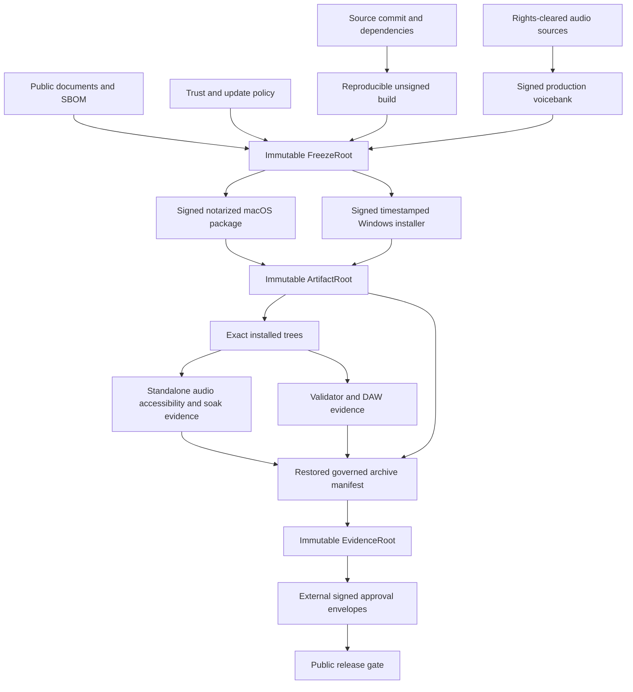
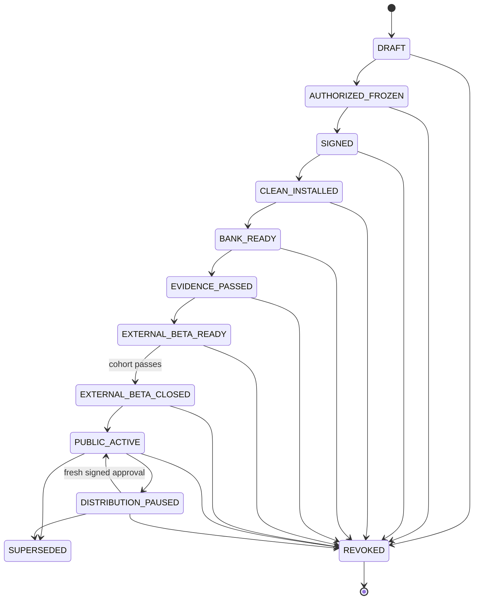
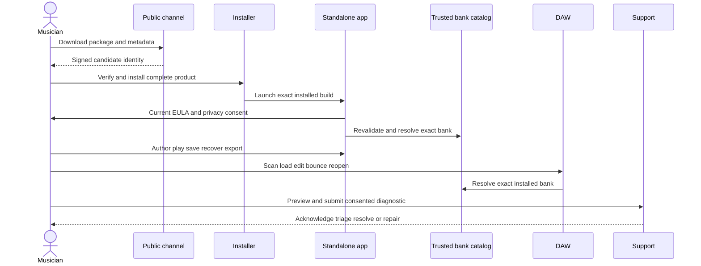
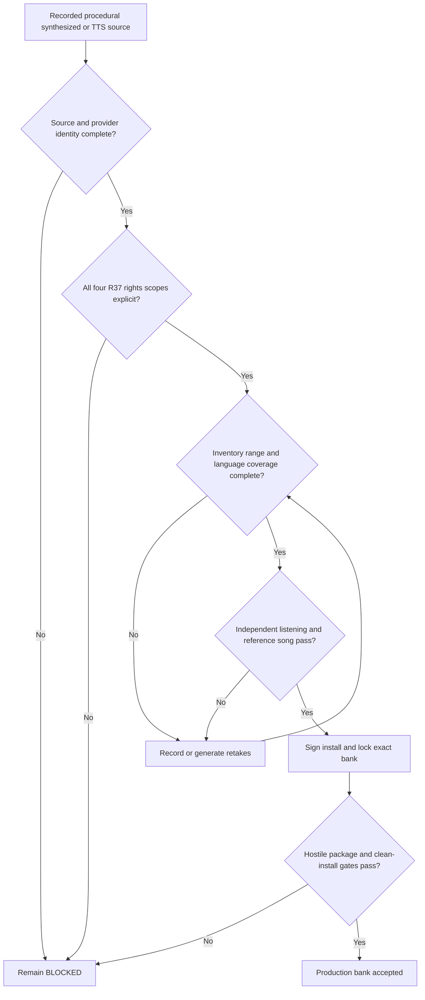

# Project SEAM Production Readiness Completion - Plan

## Goal Capsule

| Field | Contract |
|---|---|
| Objective | A musician can obtain Project SEAM through a public direct-download channel, install a trusted macOS or Windows product, use a rights-cleared singing voicebank in the standalone app and declared plug-in formats, finish and recover a project, export audio, receive support, and move safely through updates or revocation. |
| Means | Complete the production-readiness delta above the existing External Beta plan: repair release assembly and runtime trust, produce a real voicebank, close data-loss and support risks, freeze signed candidates, and collect independent evidence from the exact installed bytes. |
| Authority | This plan owns the public-production delta. `docs/plans/2026-08-21-1901-feat-project-seam-external-beta-plan.md` remains the implementation authority for inherited External Beta work. Canonical acceptance contracts own their named gates. Runtime evidence outranks source, CI, generated manifests, and checklists. |
| Execution profile | Cross-platform code, content production, legal clearance, signing, QA, accessibility, musician evaluation, and release operations. Work can run in parallel until the immutable-candidate freeze. |
| Stop conditions | The Public Production gate passes with no unresolved mandatory rows; one immutable root chain binds frozen inputs, signed artifacts, installed evidence, and external approval envelopes without a digest cycle; public pause, repair, rollback, revoke, and support drills pass. |
| Tail ownership | A named release manager owns final authorization. Independent content-rights, security/privacy, macOS, Windows, musician, accessibility, and archive reviewers sign their own evidence. |

---

## Product Contract

### Summary

Project SEAM already contains most of the authoring and rendering implementation needed for a usable singing editor. Production readiness now depends on completing the shipping system around that implementation. The work must produce a lawful singing bank, a coherent signed product, real installed-runtime evidence, and an operated public release channel.

This is a delta plan. It does not repeat implementation units that are already complete in the External Beta plan. It repairs the remaining gaps, executes the unrun gates, and adds the public-distribution contract that the invite-only External Beta scope intentionally excluded.

### Problem Frame

The repository has strong schemas, validators, build scripts, UI implementation, and release documentation. Those artifacts prove intent and internal consistency. They do not prove that a public user can install and use the product.

The current canonical Usable Alpha matrix is `0/20`, External Beta has no accepted evidence records, and the Beta Voicebank dossier is blocked with zero source assets, derived assets, permissions, or package hashes. The local application is ad-hoc signed, and the macOS and Windows packaging graphs do not currently assemble the standalone app with all claimed plug-in formats into one coherent product. Several runtime defects also remain in bank trust, project overwrite protection, support export, physical-device recovery, public update delivery, and authorization integrity.

Public production must therefore be treated as an evidence-bound release program, not as a final code-completion sprint.

### Baseline Truth and Progress

The percentages below are risk-weighted planning estimates, not gate results. A gate is only `PASS`, `BLOCKED`, or `NOT_RUN`.

| Workstream | Current estimate | Verified basis |
|---|---:|---|
| Core standalone authoring and production runtime | 85-90% | Shared production runtime, editing, playback, save/recovery, export, Voicebank Studio, CLAP host, and native accessibility code exist; the repository progress report estimates about 88% code completion. |
| Plug-in and release automation | 60-70% | CLAP/VST3/AUv2 build, validator, identity, installer, and evidence scaffolding exist, but payload assembly and installed-product proof are incomplete. |
| Rights-cleared shipping voice content | 5-10% | Production tools and validators exist, but the Beta bank has no accepted assets, rights, package, signature, listening, or reference-song evidence. |
| Trusted signed distribution | 10-20% | Fail-closed signing scripts exist, but the current app is ad-hoc signed and neither target installer is a complete, signed, accepted product. |
| Physical, DAW, accessibility, soak, and musician proof | 0-10% | Usable Alpha is `0/20`; External Beta evidence is empty; target accessibility surfaces and host records are `NOT_RUN`. |
| Public support, update, incident, and revocation operations | 15-25% | Policies and validators exist, but there is no public intake loop, installed update client, cryptographic approval authority, or rehearsed pause/revoke propagation. |
| Overall public-production readiness | 35-45% | The codebase is advanced, but the highest-risk content, signing, installed-runtime, and operations gates are mostly unexecuted. |

### Actors

- A1. External Beta and public musician creates, edits, plays, saves, recovers, exports, and submits optional diagnostics.
- A2. Voice provider and voicebank producer acquires lawful source material, records or generates units, manages retakes, and submits an immutable bank candidate.
- A3. Release engineer assembles one reproducible product identity, signs without rebuilding, publishes updates, and preserves rollback artifacts.
- A4. DAW QA operator runs the declared host and format matrix against exact installed hashes.
- A5. Support and security responder receives reports, reproduces defects, communicates incidents, and recommends pause, repair, or revocation without authorizing those operations.
- A6. Independent release verifier runs installer, standalone, accessibility, audio, performance, rights, and archive checks without controlling source or signing credentials.
- A7. Content-rights approver confirms every required license scope and provenance record without acting as the voicebank producer.
- A8. Named release manager publishes or denies public activation and operations only after the acceptance contract's independent authorization quorum has signed the terminal evidence root; A8 cannot satisfy a required reviewer role.

### Key Decisions

- **Public direct distribution is the target.** Payments, accounts, and a storefront are not required. Governs R44, R45, R46, R49, and R51.
- **A characterless production bank is acceptable.** Character 01 and character merchandising cannot block the neutral product. Governs R37, R40, and R45.
- **Generated, procedural, or TTS-derived source audio is eligible only through the same rights and quality gate as recorded audio.** A free or commercial-use label alone is insufficient. Governs R37.
- **Release claims are evidence-bound.** Source, CI, an internal validator, or deterministic fallback audio cannot substitute for target installed evidence. Governs R38, R40 through R51.
- **External Beta remains a mandatory predecessor.** Public activation cannot bypass signed installed beta evidence, a closed cohort, or field-support rehearsal. Governs R50 and R51.

### Requirements

**Voice content and trust**

- R37. Ship one musically usable, rights-cleared singing bank whose evidence covers source use, transformation, redistribution as a singing bank, and end-user commercial renders.
- R38. Bind bank, source, documents, SBOM, trust policy, unsigned inputs, signed artifacts, installed trees, and evidence through an immutable freeze-root, artifact-root, and evidence-root chain; approval envelopes sign the evidence-root hash and remain outside its digest.
- R39. Revalidate installed banks against current signed trust policy, epochs, expiry, revocation, archive safety, and installed-tree hashes instead of trusting mutable receipt booleans.

**Musician product journey**

- R40. A clean macOS Apple Silicon or Windows x64 user must complete the full standalone acquisition-to-export journey without a terminal, DAW, bundled engineering fixture, or Character 01 dependency.
- R41. Every declared CLAP, VST3, and AUv2 tuple must support exact bank recovery, project or host-state recall, playback, bounce, reopen, and offline behavior using installed production bytes.
- R42. External project changes, failed writes, forced termination, and recovery must never overwrite the last durable user copy or hide a recoverable copy.
- R43. Physical CoreAudio and WASAPI execution must handle device loss, reconnect, default-device change, sleep/wake, and format change while preserving position and avoiding automatic resume.

**Distribution and lifecycle**

- R44. Public EULA, privacy, support, security, and update-channel contracts must coexist with the invite-only beta documents, govern public installs, and support versioned acceptance or reacceptance.
- R45. One macOS package and one Windows installer must contain every claimed product surface under one identity, sign every required leaf and container, and pass platform trust checks after download.
- R46. A signed predecessor and successor must prove clean install, update, interrupted update, downgrade rejection, authorized repair, rollback, uninstall, reinstall, offline launch, and stale-binary removal.

**Safety, accessibility, and support**

- R47. Keyboard-only, VoiceOver, Accessibility Inspector, Narrator, UIA Verify, and Inspect journeys must pass for install/EULA, bank recovery, authoring, export, diagnostics, update, and embedded plug-in UI at supported scaling.
- R48. Diagnostic and crash export must be repeatable, collision-safe, previewed, per-file consented, privacy-classified, hash-bound, and useful enough to identify build, package, bank, host, and failure state.
- R49. A public report must travel through intake, acknowledgement, triage, reproduction, resolution or escalation, user communication, and retention or deletion under named ownership.

**Release governance**

- R50. Candidate decisions, evidence, approvals, pause, resume, close, supersede, and revoke must be independently attributable, tamper-evident, and reproducible from a restored immutable archive.
- R51. Public activation must remain fail-closed until the signed installed product, real bank, target matrices, support drill, update path, and rollback or revocation path all pass for the exact candidate.

### Success Criteria

- The Apple Silicon Usable Alpha matrix records `PASS` for UA-001 through UA-020, and the separate public Windows matrix records `PASS` for PW-001 through PW-020, each with repository-relative evidence paths and matching SHA-256 values.
- The External Beta gate reaches `EXTERNAL_BETA_READY`, its closed cohort reaches `EXTERNAL_BETA_CLOSED`, and the new Public Production gate reaches `PUBLIC_ACTIVE` for the same lineage.
- Beta Voicebank 01 has non-empty source and derived inventories, complete rights approval, a trusted signature, clean-install receipt, listening approval, range and coverage results, and a canonical reference-song render.
- Gatekeeper accepts the downloaded macOS package and installed app; Windows verifies Authenticode and timestamp trust for the installer and every shipped PE leaf.
- All required official validator and nine host-tuple rows pass against hashes from the installed candidate.
- The exact 7,200-second engineering soak and signed-installed 30-minute and 120-minute product sessions meet their owning contracts with no crash, data loss, unbounded memory growth, or disallowed underrun.
- All four target assistive-technology surfaces record observed results, defects, resolutions, and final `PASS` evidence.
- A public support case and a pause/revoke repair exercise complete end to end without exposing unconsented project, lyric, audio, bank, raw-log, credential, or secret data.
- A different verifier can restore the archive, recompute every candidate relationship, and obtain the same final release decision.

### Key Flows

- F8. Voicebank production
  - **Trigger:** A2 selects a source or acquisition method.
  - **Steps:** Rights review precedes ingestion; immutable source and derived assets bind to inventory and sessions; retakes and edits remain auditable; musical QA precedes signing and clean installation.
  - **Outcome:** The flow contributes rights, content, package, and runtime-trust evidence for R37 through R39.
- F9. Candidate production
  - **Trigger:** All code, bank, document, trust, and SBOM inputs are ready.
  - **Steps:** A3 freezes unsigned N+1 once; platform signing derives from those bytes without rebuilding; signed artifacts and installed evidence extend the immutable root chain; A6 and the required quorum sign the terminal evidence root; A8 publishes the verified decision.
  - **Outcome:** The flow contributes candidate, package, lifecycle, archive, and authorization evidence for R38, R45, R46, R50, and R51.
- F10. Musician acquisition and work
  - **Trigger:** A1 downloads a public package.
  - **Steps:** Verify, install, accept current documents, install or resolve the exact bank, author, play, save, recover, export, reopen, and use the plug-in in a declared host.
  - **Outcome:** The flow contributes installed-journey, project, device, host, and accessibility evidence for R40 through R43 and R47.
- F11. Update and repair
  - **Trigger:** A signed newer release or security repair becomes available.
  - **Steps:** The app verifies rooted metadata, asks for confirmation, hands the complete package to the installer, preserves N, validates N+1, and rolls back or repairs without trusting stale metadata.
  - **Outcome:** The flow contributes public-contract, lifecycle, and release-control evidence for R44 through R46 and R51.
- F12. Support and incident response
  - **Trigger:** A1 exports a diagnostic or A5 declares a distribution incident.
  - **Steps:** Preview and consent protect user data; intake and triage bind the exact candidate; pause reaches clients; repair or terminal revoke is signed; archive and user communication remain auditable.
  - **Outcome:** The flow contributes support, incident, operation, and authorization evidence for R48 through R51.

No flow passes a cross-cutting requirement alone. The gate combines the flow evidence below.

| Requirement concern | Required flows |
|---|---|
| Voice rights, production, package identity, and bank trust | F8 and F9; F10 proves installed use |
| Standalone, project, device, plug-in, and accessibility journeys | F10; F9 binds the tested candidate |
| Public documents, install, update, rollback, and repair | F9, F10, and F11 |
| Diagnostics, field support, operations, and authorization | F9, F11, and F12 |
| Final public activation | F8 through F12 plus restored-archive approval |

### Acceptance Examples

- AE16. Generated-source license rejection
  - **Covers:** R37
  - **Given:** A TTS or sample source permits commercial audio output but does not permit model, sample-bank, or derivative voicebank redistribution.
  - **When:** A2 submits it for Beta Voicebank 01.
  - **Then:** The content gate stays `BLOCKED`; no derived unit enters the candidate.
- AE17. Stale trusted receipt
  - **Covers:** R39
  - **Given:** An installed bank receipt says the signer was trusted when installed, but the current signed policy revokes that signer.
  - **When:** The catalog refreshes offline or at restart.
  - **Then:** The bank becomes revoked or quarantined, the project remains intact, and rendering is blocked until signed recovery succeeds.
- AE18. External project edit
  - **Covers:** R42
  - **Given:** The on-disk project changes after Project SEAM opened it.
  - **When:** A1 invokes Save.
  - **Then:** The app offers reload, save copy, recover copy, or cancel and never overwrites the external change silently.
- AE19. Repeated diagnostic export
  - **Covers:** R48
  - **Given:** One diagnostic ZIP already exists.
  - **When:** A1 previews and exports another report.
  - **Then:** The app creates a collision-safe file, and the preview hash equals the exported bytes.
- AE20. Public pause and revoke
  - **Covers:** R46, R50, R51
  - **Given:** A8 publishes a signed pause for candidate N+1 and a terminal revoke for a separate signed rehearsal candidate.
  - **When:** An online client checks the channel and an offline client later reconnects.
  - **Then:** New acquisition and normal updates stop, a narrowly authorized signed repair may remain available, offline authoring does not grant new trust, and a terminally revoked candidate can never resume.
- AE21. Signed-byte coherence
  - **Covers:** R38, R45, R46
  - **Given:** The unsigned candidate root is frozen.
  - **When:** macOS and Windows signing complete.
  - **Then:** Only signatures and platform containers differ; embedded product identity and payload hashes trace to the frozen inputs without a rebuild.

### Scope Boundaries

**In scope**

- Public direct-download distribution for macOS Apple Silicon and Windows x64.
- Standalone, CLAP, VST3, and AUv2 where the format is supported on the target OS.
- One rights-cleared, characterless production singing bank.
- Public documents, update metadata, support intake, security response, candidate operations, and evidence retention.
- Closed External Beta as the mandatory predecessor to public activation.

### Deferred to Follow-Up Work

- Character 01 production identity, final character art, IP clearance, trademark work, and character merchandising.
- Paid storefront, licensing server, subscriptions, payments, account management, and commerce analytics.
- Public Linux binaries and Linux customer support. Linux remains an engineering-validation surface.
- Additional official voicebanks, languages, phoneme inventories, and third-party bank marketplace support.
- Enterprise support commitments, uptime guarantees, and commercial service-level agreements.

**Outside this product's identity**

- Cloud project storage, mandatory login, or server-side song rendering.
- Executable code inside `.seambank` packages.
- Silent voicebank substitution, automatic playback resume after device recovery, or trust bypass during an incident.

---

## Planning Contract

### Assumptions

- “Production-ready” means a publicly downloadable, supportable product rather than only an invite-only beta.
- Payments and storefront work remain excluded because direct distribution can satisfy the target.
- A neutral, characterless UI and bank can ship. Character 01 cannot be a packaging prerequisite.
- The final voice source can be human-recorded, procedural, synthesized, or TTS-derived. R37 applies unchanged to every source.
- Exact supported OS and DAW patch versions are frozen when candidate N+1 is authorized. The required OS families, formats, and nine tuple shapes do not change during execution.
- A public static update-metadata endpoint and public support/security destinations will exist and be evidenced before U64 freezes N+1. U61 owns endpoint integration and readiness proof.
- Apple Developer ID and notarization credentials, a Windows Authenticode certificate and timestamp service, target machines, commercial DAW licenses, assistive-technology operators, music reviewers, and content-rights approval are external inputs.
- `beta-voicebank-01` remains the immutable technical and evidence identity. U57 locks a neutral public display name before U64 without changing that identity.
- The current repository baseline is the source of truth for implementation. This planning run did not execute builds or tests.

### Ownership and External Inputs

| Deliverable | Primary owner | Can proceed now | External dependency |
|---|---|---:|---|
| Public acceptance schema, release state machine, and fail-closed gate | Engineering | Yes | Release manager review before activation |
| Neutral product resources, plug-in bank handoff, payload assembler, and installer repair | Engineering | Yes | Signing identities for final evidence only |
| Voicebank producer workflow, deterministic transformations, and evidence capture | Engineering and content tooling | Yes | Final source assets and music/content operators |
| Source-license analysis and four-scope rights approval | Content-rights reviewer | Partially | Binding license text, performer or provider permission, jurisdiction-specific counsel if ambiguous |
| Archive hardening, bank trust revalidation, external signer boundary, support/privacy, crash, update, and revoke code | Engineering and security | Yes | Production public keys and channel endpoints at freeze |
| Beta Voicebank 01 recording or generation, retakes, labeling, and musical QA | Voicebank producer and music reviewer | After U56 | Source provider, listening panel, and explicit rights approval |
| macOS signed, notarized, stapled product | Release engineer | Unsigned assembly can proceed | Apple certificates, notary profile, target clean machines |
| Windows signed and timestamped product | Release engineer | Unsigned assembly can proceed | Authenticode certificate, timestamp service, target clean machines |
| Physical audio, accessibility, and commercial-DAW evidence | Independent QA | After signed freeze | Devices, OS images, DAW licenses, VoiceOver/Narrator operators |
| Public support, security response, update hosting, incident drill, and final GO | Support/security/release owners | Policies can proceed | Staffed destinations, retention policy, immutable archive, accountable approvers |
| GitHub CI publication | Repository owner | Workflow repair can proceed | GitHub billing or spending-limit correction before hosted jobs can execute |

### Key Technical Decisions

- KTD22. **Extend rather than duplicate the External Beta plan.** This plan reuses its U1-U52 implementation and treats its unresolved release path as predecessor work. Actors A1-A6 retain their meanings; new identifiers continue at A7, F8, AE16, R37, KTD22, and U53.
- KTD23. **Create a separate Public Production gate.** Invite-only EULA, cohort, update, and redistribution rules remain historically correct for External Beta and are not overloaded with anonymous public-distribution behavior.
- KTD24. **Use a three-layer immutable root chain.** `FreezeRoot` binds source, bank, documents, SBOM, policies, toolchains, and unsigned payloads. `ArtifactRoot` binds `FreezeRoot` plus signed descendants and delivered packages. `EvidenceRoot` binds `ArtifactRoot`, installed trees, raw evidence, and the restored archive manifest. Approval envelopes sign `EvidenceRoot` and stay outside every signed digest per R38.
- KTD25. **Keep character assets optional and bank assets external to executable payloads.** Standalone and plug-ins resolve only trusted per-user installed banks, and release packages contain no engineering voice fixture per R39 and R40.
- KTD26. **Treat every audio-source strategy as an acquisition input.** A procedural or TTS spike can reduce recording cost, but only a source that satisfies R37 and musical QA can become Beta Voicebank 01.
- KTD27. **Revalidate bank trust through a dedicated signed policy.** A monotonic `BankTrustPolicy` owns bank roots, purposes, epochs, refresh time, revocations, and persisted policy identity. Expiry or stale offline policy blocks new install and new trust but leaves a previously valid, intact bank in visible `TrustedStale` offline-render state; cached signed revocation or integrity failure quarantines it and blocks rendering per R39.
- KTD28. **Assemble one sealed cross-platform payload graph.** A shared payload manifest feeds platform packagers and includes the standalone app, every claimed plug-in, documents, SBOM, trust roots, and the bank sidecar under one identity per R45.
- KTD29. **Route production signing through purpose-scoped providers.** A bank-specific signer provider and the existing update/platform signing boundaries use Keychain, certificate store, HSM, or offline signer adapters; they do not read a raw production private-key JSON file.
- KTD30. **Separate collectors from validators.** Product actions and target-machine harnesses collect raw evidence. Validators only classify complete evidence and cannot synthesize success.
- KTD31. **Use crash-minimal capture plus next-launch enrichment.** Platform crash paths write only bounded crash-safe markers; normal startup adds identity and diagnostics before preview or export per R48.
- KTD32. **Make public update and operation metadata signed client inputs.** Pause blocks acquisition and normal updates but may expose a narrowly scoped signed repair. Resume requires fresh authorization; supersede ends acquisition for that candidate; terminal revoke is irreversible.
- KTD33. **Make approvals cryptographic and archive-addressed.** Reuse the existing Ed25519 primitives so each reviewer signs the terminal `EvidenceRoot` hash, role, decision, policy version, and trusted-time evidence. The gate verifies the configured quorum and separation of duties before A8 publishes a final operation envelope that references the evidence and quorum-envelope hashes.
- KTD34. **Promote through a closed cohort before public activation.** The intended public N+1 candidate exercises support, update, rollback, pause, resume, and repair before promotion. Terminal-revoke rehearsal uses a separate signed candidate or predecessor; revoking N+1 requires a new candidate root.
- KTD35. **Use bounded native HTTPS transports for public updates.** A shared update-source boundary uses `NSURLSession` on macOS and WinHTTP on Windows, with a file-backed implementation for deterministic tests; OS TLS validation is necessary but signed Project SEAM metadata remains the release authority.
- KTD36. **Verify sealed handoffs inside the privileged installer boundary.** A signed `seam_installer_verifier` runs before system mutation from the macOS preinstall hook and Windows NSIS initialization; it reopens the handoff and package, verifies publisher, candidate, hash, and stable file identity, and fails without installing.
- KTD37. **Define reproducibility by artifact class.** Deterministic data, documents, banks, manifests, and archives require raw-byte equality. Unsigned binaries and bundles target raw-byte equality with pinned images and deterministic flags; an exception requires a documented canonical content-manifest comparator that excludes only audited nondeterministic fields.
- KTD38. **Close the OpenSSL runtime dependency statically for release.** Release configurations build and link a pinned PIC-capable OpenSSL 3 Crypto archive into every dependent app, plug-in, tool, and installer verifier. Shipping payloads may not import Homebrew or another external `libcrypto`/OpenSSL runtime; the pinned source, license, notices, and SBOM entry remain candidate inputs.

### Output Structure

```text
docs/product/
  PUBLIC_RELEASE_ACCEPTANCE.md
  PUBLIC_RELEASE_RUNBOOK.md
  PUBLIC_WINDOWS_STANDALONE_ACCEPTANCE.md
  public-release-acceptance.json
  public-windows-standalone-acceptance.json
  public-windows-standalone-evidence.schema.json
docs/public/
  EULA.md
  PRIVACY.md
  SECURITY_RESPONSE.md
  SUPPORT.md
apps/seam-installer-verifier/
  main.cpp
libs/seam-voicebank-production/
  include/seam/voicebank_production/
  src/
scripts/
  assemble_release_payload.py
  collect_external_beta_host_evidence.py
  collect_external_beta_install_evidence.py
  collect_external_beta_product_soak.py
  collect_external_beta_standalone_journey.py
  run_public_release_audit.py
  run_windows_runtime_diagnostics.ps1
  verify_release_dependency_closure.py
  verify_public_windows_standalone_contract.py
  verify_reproducible_candidate.py
tools/public_release/
  __init__.py
  evidence.py
  operations.py
  release_gate.py
tests/production/
  test_public_evidence_collection.py
  test_project_conflict_contract.py
  test_public_release_gate.py
  test_public_release_source_contract.py
  test_public_windows_standalone_contract.py
  test_release_resources.py
  test_signed_authorization.py
  test_voice_source_admission.py
  test_public_update_integration.py
  test_reproducible_candidate.py
```

This tree declares the new public-release seam. Existing External Beta modules stay in place and remain the predecessor authority.

### High-Level Technical Design

The diagrams define required relationships and ordering. Units may refine file-level mechanics without changing these contracts.

**Release artifact and evidence flow**



**Candidate and distribution lifecycle**



`SUPERSEDED` is terminal for new acquisition of that candidate, but its installed bytes may remain usable or update to a newer authorized candidate unless a signed revocation says otherwise. `REVOKED` is terminal for trust and distribution.

**Installed musician journey**



**Voice-source admission**



### Sequencing and Critical Path

| Stage | Units | Parallel work | Exit evidence | Risk-weighted readiness |
|---|---|---|---|---:|
| 0. Truth and public contract | U53 | GitHub billing repair may occur independently | Public state schema and gate fail closed on the current checkout | 40-45% |
| 1. Coherent product assembly | U54 then U55 | Public documents from U53 allow U55 to follow U54 without a cycle | Unsigned macOS and Windows payloads contain their exact declared surfaces and no fixture dependencies | 45-55% |
| 2. Real content and trust | U56, U57, then U58 | U56 tooling precedes real production; the accepted unsigned bank then enters trust and signing hardening | One rights-cleared, signed, hostile-input-tested, clean-installed bank | 55-65% |
| 3. Product and operational hardening | U59-U61 | U59 and U60 can run in parallel; U61 follows U55 and U60 | Failure journeys are implemented and locally characterized | 65-75% |
| 4. Evidence authority and freeze | U62, U63, then U64 | Evidence authority settles before the final two-clean-build comparison and freeze | Reproducible unsigned N+1, signed descendants, and coherent predecessor | 75-82% |
| 5. Target proof | U65-U66 | Standalone/accessibility and host matrices run on separate machines | All installed standalone, platform, validator, soak, and DAW rows pass | 82-92% |
| 6. Operated promotion | U67 | Support and channel monitoring run throughout cohort | Closed cohort, public activation, and rollback/revoke drill pass | 100% by gate, not estimate |

With two or three engineers plus dedicated QA, content, legal, and release support, the signed closed-beta critical path is approximately 16-28 weeks. Public production is approximately 24-36 weeks because the cohort, support drill, target matrices, and release operations cannot be compressed into code-only work. A solo effort should budget at least 8-12 months and remains dependent on outside rights, signing, machine, DAW, accessibility, and musician inputs.

### System-Wide Impact

- **Build and packaging:** Standalone and plug-in builds become one product graph instead of separate payload islands.
- **Runtime trust:** Bank state changes from receipt-derived trust to current-policy revalidation. Revocation can change an installed bank from usable to quarantined without deleting user projects.
- **Persistence:** Project save gains external-change conflict handling. Recovery becomes user-visible even when the original file changed.
- **Audio:** Platform adapters gain device lifecycle events. Transport must preserve position and require explicit resume after a physical fault.
- **Privacy:** Diagnostic exports distinguish generated safe diagnostics from user-supplied content. Support and crash flows gain preview, consent, identity, and retention rules.
- **Operations:** Public update metadata and release decisions become signed protocol inputs consumed by installed clients.
- **Evidence:** Every release claim becomes candidate-addressed and machine-verifiable. Current `NOT_RUN` rows remain truthful until observed execution produces raw artifacts.

### Risks and Mitigations

| Risk | Consequence | Mitigation |
|---|---|---|
| A “free commercial” TTS license omits voicebank redistribution rights | The bank cannot lawfully ship | Apply R37 before ingestion; obtain explicit permission or reject the source; preserve the license version and provider identity. |
| Generated or recorded units pass technical checks but sound musically poor | The product installs but fails its core value | Use coverage renders, a canonical song, blind listening, range review, retakes, and independent music approval before signing. |
| Packaging is fixed after candidate freeze | Signed descendants no longer trace to one root | Finish U54-U62, U57, and U63 first; freeze once; permit production signatures and platform containers only in U64. |
| Stale bank receipts or mutable approvals grant false trust | Revoked content remains usable or an unauthorized build ships | Implement KTD27 and KTD33; test offline restart, expiry, compromise, role collision, and archive restoration. |
| Commercial DAW behavior diverges from internal hosts | Plug-ins fail after public download | Use installed hashes, official validators, exact host versions, saved-session recall, bounce comparison, and raw host logs in U66. |
| Crash handlers make unsafe allocations or lock during corruption | The diagnostic path deadlocks or loses useful evidence | Keep crash-time capture bounded and primitive; enrich only after the next clean launch. |
| Public update hosting becomes a hidden cloud dependency | Offline authoring or trust behavior changes | Cache signed metadata, preserve offline authoring, and prohibit offline metadata from authorizing new trust or distribution. |
| GitHub Actions cannot run because of account billing | Cross-platform automation remains unavailable | Repair billing early, but keep local and target-machine evidence independent from hosted-CI status. |
| Scope expands into character, marketplace, or commerce work | Release-critical evidence is delayed | Keep deferred work outside active units unless a later user decision changes the Product Contract. |

### Deferred Implementation Decisions

- Choose the final voice-source acquisition method after U56 records comparable rights, coverage, effort, and listening results. This does not weaken R37.
- Freeze exact supported OS and DAW patch versions at U64 from machines and licenses available for U65-U66.
- Select the static update and download hosting provider during U61. The provider must serve immutable bytes and signed metadata without becoming a trust authority.
- Select the production signer implementation per platform during U58 and U64. The `SignerProvider` boundary and non-exportable-key rule remain fixed.

### Alternative Approaches Considered

| Approach | Decision | Reason |
|---|---|---|
| Declare the current source-ready build production-ready | Rejected | It would convert `NOT_RUN` and blocked runtime gates into unsupported claims. |
| Ship only the standalone app first | Rejected for this plan | The repository and existing External Beta contract already declare plug-in formats; narrowing the product would require an explicit product-scope change. |
| Keep invite-only beta contracts and rename the state to production | Rejected | Public acquisition, redistribution, support, updates, and incident response require different contracts and operations. |
| Bundle the public-domain demo bank as the production bank | Rejected | It is an incomplete engineering fixture without the required inventory, rights dossier, or musical acceptance. |
| Make Character 01 clearance a release prerequisite | Rejected | It adds unrelated IP and asset risk to a technically character-independent product. |
| Replace the native architecture or rewrite the editor | Rejected | The highest-risk gaps are content, packaging, trust, runtime failure handling, and proof; a rewrite would discard working implementation without closing those gates. |

---

## Implementation Units

### Unit Index

| U-ID | Unit | Primary files | Depends on |
|---|---|---|---|
| U53 | Establish the Public Production contract and gate | `docs/product/PUBLIC_RELEASE_ACCEPTANCE.*`, `tools/public_release/`, `tests/production/` | None |
| U54 | Remove fixture and Character dependencies and complete bank handoff | `CMakeLists.txt`, `libs/seam-clap-editor/`, packaging resource scripts | U53 |
| U55 | Assemble one coherent macOS and Windows product payload | `scripts/assemble_release_payload.py`, platform packagers, Phase 13A workflows | U53, U54 |
| U56 | Build the recoverable voicebank production system and select a source strategy | `libs/seam-voicebank-production/`, Voicebank Studio, production tooling | U53 |
| U57 | Produce and approve the real Beta voicebank | Beta dossier, restricted source/derived evidence, bank lock | U56 |
| U58 | Harden bank archives, current trust, and production signing | `libs/seam-distribution/`, `libs/seam-voicebank/`, `apps/seam-bank-tool/` | U54, U57 |
| U59 | Close project-overwrite and physical-audio fault states | authoring runtime, standalone controller, platform audio adapters | U53 |
| U60 | Deliver privacy-safe support and crash recovery | support bundle, crash capture, native recovery UI | U53 |
| U61 | Integrate public update, repair, pause, and revoke | update controller and panel, public metadata, operations tooling | U53, U55, U60 |
| U62 | Make evidence collection and authorization authoritative | External Beta collectors, public gate, operations and archive tooling | U55, U58-U61 |
| U63 | Establish reproducible build and toolchain evidence | compiler options, build images, reproducibility verifier | U55, U57-U62 |
| U64 | Produce predecessor N and freeze/sign candidate N+1 | candidate manifests, platform signing, evidence roots | U63 |
| U65 | Pass installed standalone, lifecycle, audio, accessibility, and soak gates | Usable Alpha, install, accessibility, fault, and soak evidence | U64 |
| U66 | Pass official validators and all required DAW tuples | Phase 13A validators and External Beta host evidence | U64 |
| U67 | Close the cohort and activate the operated public channel | cohort, support, update, archive, and public release records | U65, U66 |

### U53. Establish the Public Production Contract and Gate

**Goal:** Define the public release states and fail-closed evidence contract that extend, but do not rewrite, Usable Alpha and External Beta.

**Requirements:** R38, R44, R49, R50, R51

**Technical decisions:** KTD23, KTD33, KTD34

**Dependencies:** None

**Files:**

- Create `docs/product/PUBLIC_RELEASE_ACCEPTANCE.md`.
- Create `docs/product/public-release-acceptance.json`.
- Create `docs/product/PUBLIC_RELEASE_RUNBOOK.md`.
- Create `docs/product/PUBLIC_WINDOWS_STANDALONE_ACCEPTANCE.md`, `docs/product/public-windows-standalone-acceptance.json`, and `docs/product/public-windows-standalone-evidence.schema.json`.
- Create `docs/public/EULA.md`, `docs/public/PRIVACY.md`, `docs/public/SUPPORT.md`, and `docs/public/SECURITY_RESPONSE.md` as versioned public-channel documents.
- Create `tools/public_release/__init__.py` and `tools/public_release/release_gate.py`.
- Create `scripts/run_public_release_audit.py`.
- Create `scripts/verify_public_windows_standalone_contract.py`.
- Create `tests/production/test_public_release_gate.py` and `tests/production/test_public_release_source_contract.py`.
- Create `tests/production/test_public_windows_standalone_contract.py`.
- Modify `docs/STATUS.md`, `docs/RELEASE_READINESS.md`, `docs/RELEASE_READINESS_KO.md`, and `docs/product/EXTERNAL_BETA_RUNBOOK.md`.

**Approach:**

1. Define the machine states `DRAFT`, `AUTHORIZED_FROZEN`, `SIGNED`, `CLEAN_INSTALLED`, `BANK_READY`, `EVIDENCE_PASSED`, `EXTERNAL_BETA_READY`, `EXTERNAL_BETA_CLOSED`, `PUBLIC_ACTIVE`, `DISTRIBUTION_PAUSED`, `SUPERSEDED`, and terminal `REVOKED`.
2. Make `EXTERNAL_BETA_CLOSED` for the same candidate lineage a required predecessor of public authorization.
3. Require exact freeze-root, artifact-root, evidence-root, public-document, update-channel, support-intake, incident-drill, archive, approval-envelope, and rollback or revoke records.
4. Preserve the existing External Beta document identities while defining separate public document versions, digests, acceptance rules, support destinations, and security contacts.
5. Keep canonical UA-001-UA-020 evidence scoped to Apple Silicon. Define a separate public Windows standalone matrix with stable `PW-001` through `PW-020` rows for the equivalent acquisition-to-export journey.
6. Separate contract validation from evidence collection. The checked-in current snapshot must remain blocked.
7. Replace absolute local paths in the External Beta runbook with repository-relative links.

**Patterns to follow:** `tools/external_beta/release_gate.py`, `docs/product/EXTERNAL_BETA_ACCEPTANCE.md`, and `docs/phase13a/mandatory-validation-matrix.json`.

**Test scenarios:**

- An empty public candidate reports every mandatory category as blocked.
- A passing External Beta candidate without public documents or channel evidence remains blocked.
- A candidate with mismatched source, bank, installer, or archive hashes is rejected.
- A Windows standalone record cannot be placed into a UA row, and a macOS UA result cannot satisfy a `PW-###` row.
- An External Beta document acceptance cannot satisfy a public document digest.
- An approval from one person claiming two incompatible roles is rejected.
- `DISTRIBUTION_PAUSED` cannot return to `PUBLIC_ACTIVE` without fresh signed approvals.
- `REVOKED` cannot transition to any active state.
- A complete synthetic fixture reaches `PUBLIC_ACTIVE` only when all referenced evidence hashes resolve inside the fixture archive.

**Verification:** The public contract and JSON mirror agree; the current repository evaluates as blocked; all production-gate unit tests pass without generating release evidence.

### U54. Remove Fixture and Character Dependencies and Complete Bank Handoff

**Goal:** Make the distributable standalone and plug-ins boot without Character 01 or bundled engineering banks and recover through the trusted installed-bank catalog.

**Requirements:** R39, R40, R41, R45

**Technical decisions:** KTD25, KTD27

**Dependencies:** U53

**Files:**

- Modify `CMakeLists.txt` release resource targets.
- Modify `libs/seam-clap-editor/src/editor_runtime_adapter.cpp` and related controller headers.
- Modify `libs/seam-standalone/src/native_editor_app.cpp` and neutral resource selection.
- Modify `scripts/package_macos_standalone.sh`, `scripts/build_windows_installer.ps1`, and platform resource manifests.
- Modify `tests/test_native_ui.cpp`, `tests/test_phase11_clap_editor.cpp`, and `tests/phase13a/test_installer_contract.py`.
- Add release-payload assertions under `tests/production/test_release_resources.py`.

**Approach:**

1. Stop copying `assets/demo-human-voicebank-public-domain/production-bank` into release CLAP, VST3, AUv2, or standalone payloads.
2. Make Character 01 optional. Provide neutral product copy and visuals when no character package is present.
3. Give the plug-in editor the same missing-bank, exact-select, refresh, and standalone-install handoff used by the standalone app.
4. Preserve project identity when a bank is missing or revoked. Block rendering without silently selecting another bank.
5. Publish one release-resource inventory that U55 can seal.

**Patterns to follow:** standalone voicebank browser and recovery behavior in `libs/seam-standalone/`; exact identity handling in `libs/seam-authoring-runtime/src/voicebank_installer_service.cpp`.

**Test scenarios:**

- A fresh standalone launch with no bank reaches a neutral recovery surface.
- A fresh CLAP, VST3, or AUv2 editor with no bank exposes standalone installation and refresh instead of an empty card list.
- A project referencing a missing exact hash cannot render with a same-ID, different-hash bank.
- A valid per-user installed bank appears after catalog refresh without restarting the DAW where the host permits refresh.
- A release payload contains no demo bank and does not fail when Character 01 is absent.
- A revoked or untrusted bank remains visible as recoverable state but cannot produce audio.

**Verification:** Resource inventories contain only declared product assets; package-shaped plug-in tests prove missing-bank recovery; neutral standalone and plug-in smokes run without Character 01 or a bundled bank.

### U55. Assemble One Coherent macOS and Windows Product Payload

**Goal:** Produce one sealed payload definition that both platform installers consume and that contains every claimed product surface under one release identity.

**Requirements:** R38, R40, R41, R45, R46

**Technical decisions:** KTD24, KTD28, KTD29, KTD36, KTD38

**Dependencies:** U53, U54

**Files:**

- Create `scripts/assemble_release_payload.py` and `tests/phase13a/test_release_payload_assembly.py`.
- Create `scripts/verify_release_dependency_closure.py` and `tests/phase13a/test_release_dependency_closure.py`.
- Create `apps/seam-installer-verifier/main.cpp` and `tests/test_installer_verifier.cpp`.
- Modify `libs/seam-distribution/src/sealed_handoff.cpp` and its tests for stable macOS and Windows file identity and replay rejection.
- Modify `scripts/build_phase13a_formats.py`.
- Modify root build and release toolchain configuration to select the pinned static OpenSSL 3 Crypto target for shipping artifacts.
- Modify `scripts/package_macos_plugins.sh`, `scripts/package_macos_standalone.sh`, and `packaging/macos/Distribution.xml.in`.
- Create a macOS preinstall hook under `packaging/macos/scripts/` that invokes the signed verifier before system mutation.
- Modify `scripts/build_windows_installer.ps1`, `scripts/sign_windows_payload.ps1`, `scripts/test_windows_installer.ps1`, and `packaging/windows/ProjectSEAM.nsi`.
- Modify `.github/workflows/phase13a-distribution.yml` and `.github/workflows/phase13a-plugin-formats.yml`.
- Modify `tests/phase13a/test_macos_installer_contract.py` and `tests/phase13a/test_windows_installer_contract.py`.

**Approach:**

1. Define a platform-neutral payload manifest for standalone, CLAP, VST3, AUv2 where applicable, documents, SBOM, trust roots, uninstaller ownership, and bank sidecar metadata.
2. Make both platform packagers consume the sealed manifest instead of reconstructing product identity independently.
3. Add the standalone app to the macOS product PKG and to the Windows workflow before installer construction.
4. Build pinned OpenSSL 3 Crypto as a static PIC dependency for release and package configurations. Fail dependency closure if any shipping PE or Mach-O imports a non-system OpenSSL runtime.
5. Build a separately signable platform verifier over `verifySealedInstallerHandoff()`; U64 signs the final verifier. On Windows, capture stable volume and file-index identity with an open handle; on macOS, capture stable device and inode identity. Reopen and hash the package at the privileged boundary.
6. Invoke the verifier from the macOS preinstall hook and NSIS initialization before installing system files. Verify platform publisher trust, candidate identity, package hash, file identity, and handoff freshness.
7. Encode and test the production signing order without performing production signing in this unit. Add an NSIS `!uninstfinalize` or equivalent two-pass flow so the generated uninstaller is part of the signed-leaf manifest.
8. Correct the Windows uninstaller oracle to match the NSIS install location.
9. Fail if a claimed surface, identity field, hash, ownership row, verifier result, dependency-closure result, SBOM or notice entry, or required signing result is missing.

**Patterns to follow:** `tools/phase13a/release_identity.py`, `tools/phase13a/distribution_manifest.py`, and existing fail-closed platform signing scripts.

**Test scenarios:**

- The same build identity appears in standalone, plug-in manifests, installer metadata, and payload manifest.
- macOS assembly fails if the app, a claimed plug-in, documents, SBOM, or trust roots are missing.
- Windows assembly fails if the standalone executable or any claimed plug-in is missing.
- Signing inventory fails when one PE leaf or macOS nested code object is unsigned.
- The development signing flow proves the generated NSIS uninstaller can receive and retain an independent test signature; U64 repeats the check with production Authenticode and timestamp trust.
- Missing, stale, wrong-publisher, wrong-candidate, hash-mismatched, replaced-after-stage, or replayed handoffs stop before privileged mutation.
- Installer tests locate the uninstaller at the path NSIS writes and verify user data is preserved.
- A payload built from a dirty, stale, or mismatched source identity is rejected.
- `otool -L` and the Windows PE import table show no external `libcrypto` or OpenSSL runtime for the standalone app, plug-ins, tools, or installer verifier.

**Verification:** Unsigned developer packages share one manifest schema, identity, document set, trust inputs, and common surfaces; each platform-specific surface set exactly matches the declared matrix. Platform manifests bind every byte to one identity, and installer tests prove the privileged verifier runs before mutation.

### U56. Build the Recoverable Voicebank Production System and Select a Source Strategy

**Goal:** Give Voicebank Studio a versioned production-project model and prove that one rights-feasible acquisition strategy can drive a recoverable inventory-bound workflow.

**Requirements:** R37, R38

**Technical decisions:** KTD26

**Dependencies:** U53

**Files:**

- Create `libs/seam-voicebank-production/include/seam/voicebank_production/` models and codecs.
- Create `libs/seam-voicebank-production/src/` persistence, journal, immutable-asset-store, and deterministic-operation implementations.
- Modify `apps/seam-voicebank-studio-native/main.cpp`.
- Modify `libs/seam-native-ui/src/voicebank_studio.cpp` and related model headers.
- Modify `tools/voicebank-script-generator/main.py` and `tools/external_beta/voicebank_production.py`.
- Modify Beta bank production instructions and source-strategy records without marking unperformed work as passed.
- Create `tests/test_voicebank_production_project.cpp`.
- Modify `tests/external_beta/test_beta_voicebank_production.py` and `tests/test_native_ui.cpp`.
- Add `tests/production/test_voice_source_admission.py`.

**Approach:**

1. Define `VoicebankProductionProject` with schema version, project and inventory identity, selected source strategy, license locator and hash, immutable asset-store root, takes, derived revisions, unit assignments, operator and review records, and last durable generation.
2. Store raw imports by content hash and never rewrite them. Represent every derived asset as an input hash plus a versioned operation, parameters, output hash, operator, and time record.
3. Limit the initial deterministic audio operations to PCM WAV decode, channel selection or documented downmix, sample-rate conversion, DC removal, gain normalization, explicit-sample trim, and segmentation. Pitch and marker edits remain metadata; automatic pitch correction is outside this unit.
4. Journal import, transform, marker, retake, review, save, and candidate-export transitions. Recover interrupted work to the last durable generation and retain staged outputs as inspectable recovery candidates.
5. Bind every session to the deterministic required-unit inventory. Implement missing, rejected, retake, marker-review, pitch-review, and approved queues.
6. Add comparable source-strategy assessments for human recording, procedural synthesis, and eligible TTS-derived audio. An unavailable strategy records `NOT_ASSESSED`; at least one selected strategy must pass rights feasibility, coverage feasibility, and listening feasibility.
7. Export a production brief and candidate template for U57. Keep the checked-in dossier blocked until real assets and independent approvals exist.

**Patterns to follow:** deterministic inventory and production-record validators under `tools/external_beta/`; native save/recovery patterns in the standalone app.

**Test scenarios:**

- A session resumes with the same inventory, operator, source license, and approved takes after interruption.
- Empty or malformed projects, missing asset stores, unavailable raw assets, partial journals, and changed inventory digests fail closed with recoverable diagnostics.
- Duplicate, missing, unbound, or wrong-pitch takes cannot complete the inventory.
- Deterministic operations produce the same output hash for the same input, version, and parameters; unsupported operations are rejected.
- Editing a marker creates a new metadata revision and preserves the raw asset hash.
- A retake supersedes an earlier candidate without deleting its audit trail.
- A TTS license missing any R37 right remains blocked even when its generated audio passes technical checks.
- A complete synthetic workflow fixture exports deterministic U57 inputs, while only real assets can satisfy musical approval.

**Verification:** A producer completes, interrupts, recovers, and exports the synthetic workflow without editing JSON or CSV by hand; the selected source-strategy brief is rights-feasible; every project, asset, operation, journal, and review record rehashes cleanly.

### U57. Produce and Approve the Real Beta Voicebank

**Goal:** Execute the U56 production brief with real lawful source audio and deliver one complete, independently approved unsigned bank candidate to U58.

**Requirements:** R37, R38

**Technical decisions:** KTD26

**Dependencies:** U56

**Files:**

- Populate `docs/voicebank/beta-voicebank-01-dossier.json`, required inventory, operator records, redacted rights approval, coverage, range, listening, and reference-song records.
- Populate the governed restricted archive with full agreements or immutable agreement locators, source assets, derived assets, and review artifacts.
- Populate `packaging/voicebanks/beta-voicebank-01.lock.json` only through the production export path.
- Use the U56 production library, Voicebank Studio, `tools/external_beta/voicebank_production.py`, and voicebank gate tools without bypassing failed rows.

**Approach:**

1. Lock one source strategy whose provider or performer permissions explicitly cover every R37 scope.
2. Record or generate the complete required inventory, preserve immutable raw assets, and close missing-unit and retake queues.
3. Perform marker, pitch, range, noise, seam, coverage, and renderer checks. Run independent blind listening and the canonical reference song.
4. Store redacted approval and immutable agreement hashes in repository evidence. Store full agreements, contact details, and other restricted material only in the access-controlled archive.
5. Lock a neutral public display name while preserving `beta-voicebank-01` as the technical identity.
6. Export one complete unsigned candidate and lock input for U58. Any asset or metadata change creates a new candidate identity.

**Test scenarios:**

- Every required unit resolves to an approved take and exact source and derived provenance.
- Missing rights scope, asset, retake, reviewer, range result, coverage render, or reference-song approval keeps the dossier blocked.
- A public dossier contains no performer contact data, private agreement text, credential, or restricted legal material.
- Independent reviewers can locate and audition every accepted unit and reproduce the reference render from the candidate inputs.

**Verification:** The real dossier has no empty required inventory or `NOT_RUN` musical row; rights and music reviewers sign the exact candidate; U58 receives immutable source, derived, manifest, and lock inputs without a production signature yet.

### U58. Harden Bank Archives, Current Trust, and Production Signing

**Goal:** Make `.seambank` creation, installation, catalog refresh, and runtime use safe across target filesystems and current trust-policy changes.

**Requirements:** R37, R38, R39, R41

**Technical decisions:** KTD27, KTD29

**Dependencies:** U54, U57

**Files:**

- Modify `libs/seam-distribution/src/seambank.cpp`, `libs/seam-distribution/src/installer.cpp`, and related headers.
- Create bank-policy parsing, verification, and persisted monotonic-state support beside `libs/seam-distribution/include/seam/distribution/trust_policy.hpp`.
- Extend `libs/seam-distribution/include/seam/distribution/signer_provider.hpp` with a bank-purpose signer interface instead of generalizing raw-key access.
- Modify `libs/seam-voicebank/src/catalog.cpp` and catalog state definitions.
- Modify `libs/seam-authoring-runtime/src/voicebank_installer_service.cpp`.
- Modify `apps/seam-bank-tool/main.cpp` to use `libs/seam-distribution/include/seam/distribution/signer_provider.hpp`.
- Modify `tests/test_distribution.cpp`, `tests/test_voicebank_installer_service.cpp`, and voicebank catalog tests.
- Create `tests/test_voicebank_trust_policy.cpp`.
- Modify `tests/external_beta/test_beta_voicebank_gate.py`.
- Add cross-platform hostile fixtures under `tests/fixtures/seambank-hostile/`.

**Approach:**

1. Enforce UTF-8 validity, normalization and case-collision rules, Windows reserved and trailing-dot or space rules, prefix conflicts, extraction limits, safe relative paths, and data-only contents in the actual pack, verify, and install path.
2. Replace raw production private-key loading with the bank-purpose signer provider. Preserve deterministic unsigned inputs and attach verifiable signature metadata.
3. Define signed `BankTrustPolicy` parsing, Ed25519 verification, bank-signing purpose, monotonic epoch state, accepted-policy hash, refresh time, revoked signers and packages, and platform-state ownership.
4. Inject verified policy state into catalog scan and resolution. Recompute package identity and installed-tree integrity at restart and refresh instead of reading trust booleans from receipts.
5. Represent `Trusted`, `TrustedStale`, `Untrusted`, `Revoked`, `Quarantined`, `Corrupt`, `VersionMismatch`, and `ContentMismatch` without deleting projects.
6. Permit `TrustedStale` to render only when the bank was accepted under the highest cached valid policy and the installed tree remains intact. Stale or expired policy cannot authorize installation, replacement, or a new trust transition.
7. Quarantine and block on cached signed revocation, integrity failure, wrong epoch, wrong signer, or policy rollback. Require a signed repair installer to leave quarantine.

**Patterns to follow:** data-only ADR `docs/adr/0007-data-only-voicebanks.md`; atomic staging and exact identity in `docs/phase7/SIGNING_AND_INSTALLATION.md`.

**Test scenarios:**

- Archives with traversal, backslashes, invalid UTF-8, normalization aliases, case aliases, Windows reserved names, trailing dots or spaces, prefix conflicts, symlinks, executable entries, or extraction-limit violations are rejected.
- A stale trusted receipt becomes revoked or quarantined under a newer signed policy.
- A previously valid intact bank under expired offline policy becomes `TrustedStale`, remains visibly usable, and cannot authorize install or replacement.
- Cached signed revocation, wrong epoch, wrong signer, tampering, and installed-tree mismatch cannot render.
- Missing, empty, malformed, rolled-back, or wrong-purpose bank policies fail closed without converting an untrusted bank to trusted.
- A failed install publishes no partial bank and preserves the previous valid version.
- Same ID and version with a different content hash is rejected without replacement.
- The bank tool cannot use a raw production key file when the production signer mode is active.

**Verification:** Hostile packages fail identically on macOS and Windows; the accepted bank clean-installs and revalidates from its installed tree and monotonic bank policy; offline restart preserves projects and previously accepted intact audio while cached revocation still blocks use.

### U59. Close Project-Overwrite and Physical-Audio Fault States

**Goal:** Prevent silent user-data overwrite and make physical audio-device failures recover without stale playback or implicit resume.

**Requirements:** R40, R42, R43

**Dependencies:** U53

**Files:**

- Modify `libs/seam-authoring-runtime/src/project_lifecycle.cpp` and `libs/seam-authoring-runtime/src/autosave_service.cpp`.
- Modify the conditional atomic-replace boundary in `libs/seam-core/src/file_io.cpp` and related header.
- Modify `libs/seam-standalone/src/application_controller.cpp` and native recovery UI.
- Modify `libs/seam-platform/include/seam/platform/audio_device.hpp` and CoreAudio/WASAPI implementations.
- Modify transport and audio-settings integration in `libs/seam-standalone/`.
- Modify project lifecycle, autosave, application controller, and platform audio tests.
- Add `tests/production/test_project_conflict_contract.py` and target fault-harness records.

**Approach:**

1. Extend durable atomic replace with an expected content hash and stable file identity. Revalidate immediately before replacement while the platform identity handle or equivalent guard remains authoritative.
2. On a before-replace mismatch, retain the staged bytes as a recovery copy and return `Conflict` without changing the destination.
3. Expose reload, save copy, recover copy, and cancel for external changes. Never classify the safer recovery copy as inaccessible.
4. Preserve the last durable project and autosave across disk-full, permission, interruption, and forced-crash paths.
5. Add platform device-loss, default-change, reconnect, sleep/wake, sample-rate, and buffer-size events.
6. Stop audio safely, preserve transport position and edits, report real counters, and require explicit user resume after recovery.

**Patterns to follow:** atomic project publication, base-hash lineage, transactional audio settings, and `docs/product/external-beta-fault-matrix.json`.

**Test scenarios:**

- Saving after an external file change cannot overwrite until A1 chooses a conflict action.
- A fault-injection hook that mutates the destination immediately before replace returns `Conflict`, preserves the external edit, and retains the staged recovery copy.
- Save Copy creates a new durable lineage and leaves both prior files unchanged.
- Disk-full and permission-denied failures publish no partial requested destination.
- Forced termination exposes the newest valid autosave even when the original file changed externally.
- Physical device loss stops playback, preserves position, and does not auto-resume after reconnect.
- Default-device, sample-rate, buffer-size, and sleep/wake changes either commit transactionally or roll back to the prior working device.

**Verification:** Characterization and state-machine tests cover every conflict and device state; clean target-machine runs record real CoreAudio and WASAPI device identities, counters, transitions, and audible results.

### U60. Deliver Privacy-Safe Support and Crash Recovery

**Goal:** Provide a repeatable in-product diagnostic, crash, and report-management journey that protects user content and supplies actionable candidate identity.

**Requirements:** R48, R49, R50

**Technical decisions:** KTD30, KTD31

**Dependencies:** U53

**Files:**

- Modify `libs/seam-authoring-runtime/src/support_bundle.cpp` and support-bundle models.
- Modify `libs/seam-platform/src/crash_capture.cpp` and macOS/Windows crash adapters.
- Modify `libs/seam-standalone/src/native_editor_app.cpp` and recovery/support panels.
- Modify `libs/seam-native-ui/` support and recovery models.
- Modify `docs/public/PRIVACY.md`, `docs/public/SUPPORT.md`, and `docs/public/SECURITY_RESPONSE.md` from their U53 contracts.
- Modify shared policy references in `docs/support/SUPPORT.md` and `docs/support/SECURITY_RESPONSE.md` without rewriting the beta document set.
- Modify `tests/test_support_bundle.cpp`, crash-capture tests, native UI tests, and `tests/external_beta/test_beta_documentation.py`.

**Approach:**

1. Replace `latest-diagnostic.zip` with candidate- and time-bound collision-safe destinations or an explicit atomic replace choice.
2. Split generated diagnostics from user attachments. Assign each file a privacy class, preview, consent state, size, and hash.
3. Exclude projects, lyrics, audio, banks, raw logs, credentials, and secrets by default. Never label a consented attachment `ExportSafe` merely because it is in the archive.
4. Add preview, confirm, export, list, reveal, and delete actions to the product UI. Verify that previewed and exported bytes match.
5. Keep crash-time work bounded and crash-safe. Enrich markers with candidate identity, bank, host, counters, and user-consented context only on next launch.
6. Bind public intake acknowledgement, retention, withdrawal, and deletion to the exported bundle hash.

**Patterns to follow:** typed privacy events in `libs/seam-core/`; bounded archive generation and next-launch crash recovery already present.

**Test scenarios:**

- Two consecutive exports succeed with distinct identities and matching preview hashes.
- A generated-only bundle contains no project path, lyric text, audio, bank data, raw log, environment secret, or credential.
- Each optional attachment requires separate consent and retains a non-safe privacy classification.
- Symlink, path escape, oversized, changed-after-preview, and unreadable attachments are rejected.
- Forced child-process crashes on macOS and Windows leave a bounded marker that the next launch can enrich and delete.
- Withdrawing a submitted test report removes retained user attachments while preserving the minimal incident audit record allowed by policy.

**Verification:** The UI completes preview-confirm-export-delete twice in one session; forced-crash evidence resolves to the exact candidate; an independent privacy reviewer approves archive contents and public policy behavior.

### U61. Integrate Public Update, Repair, Pause, and Revoke

**Goal:** Connect the existing signed update primitives to the shipped app and public channel so installed clients can update, roll back, pause, or repair safely.

**Requirements:** R44, R46, R49, R50, R51

**Technical decisions:** KTD32, KTD35, KTD36

**Dependencies:** U53, U55, U60

**Files:**

- Modify `libs/seam-standalone/src/update_controller.cpp` and integrate it into `native_editor_app.*`.
- Modify `libs/seam-native-ui/include/seam/native_ui/update_panel.hpp` and implementation.
- Create a shared update-source boundary and file-backed test transport under `libs/seam-platform/`.
- Create macOS `NSURLSession` and Windows WinHTTP update transports under `libs/seam-platform/src/`.
- Modify `libs/seam-distribution/src/update_manifest.cpp`, `libs/seam-distribution/src/trust_policy.cpp`, and `libs/seam-distribution/src/sealed_handoff.cpp` where integration exposes gaps.
- Modify `libs/seam-standalone/include/seam/standalone/eula_acceptance.hpp` and its implementation for public document versions and reacceptance.
- Modify `tests/test_eula_acceptance.cpp` and packaging documentation contract tests.
- Modify `tools/external_beta/operations.py` and public release operations.
- Create public update-channel fixtures and `tests/production/test_public_update_integration.py`.
- Modify `docs/public/EULA.md` from its U53 contract.
- Modify `CMakeLists.txt`, `docs/manual/UPDATE_AND_ROLLBACK.md`, and public runbooks while preserving `docs/manual/EULA.md` for the External Beta lineage.

**Approach:**

1. Fetch immutable channel metadata and packages through bounded native HTTPS transports with OS certificate validation, redirect restrictions, response-size limits, timeouts, atomic temporary files, and cancellation.
2. Verify metadata signature, policy epoch, platform, version monotonicity, size, hash, candidate identity, and operation state independently from TLS.
3. Select the document set from the installed release channel. Present the current public document versions and require acceptance or reacceptance before the affected public release becomes usable; decline leaves prior lawful offline behavior intact.
4. Present release identity and require explicit confirmation. Coordinate host shutdown before handing the complete package to the platform installer.
5. Revalidate the sealed handoff at installer entry and preserve predecessor N until N+1 launches, host scans, and bank checks pass.
6. Cache signed metadata for offline status display. Do not let offline or expired metadata authorize a new install, trust transition, or resumed distribution.
7. Enforce pause, supersede, repair, and terminal revoke in the acquisition channel and installed app.
8. Record every user and operational transition without collecting project content.

**Patterns to follow:** existing update-manifest, trust-policy, and sealed-handoff libraries; `docs/manual/UPDATE_AND_ROLLBACK.md`.

**Test scenarios:**

- Valid N+1 metadata offers an update only for the correct channel, platform, and candidate lineage.
- Wrong signer, epoch rollback, hash mismatch, size mismatch, downgrade, stale metadata, or candidate mismatch is rejected.
- Empty responses, oversized responses, redirect loops, non-HTTPS redirects, TLS failure, timeout, cancellation, partial files, and disk-full conditions cannot publish metadata or a package.
- A new EULA or privacy digest requires reacceptance; decline does not corrupt projects or the coherent prior installation.
- An External Beta installation continues to match its beta document identity and cannot satisfy a public-install acceptance check.
- Cancellation and installer failure leave N runnable and N+1 unpublished.
- A paused channel blocks new acquisition without disabling already installed offline authoring.
- A revoked candidate cannot resume and requires a distinct signed replacement or repair.
- An offline client applies the signed pause or revoke when it reconnects and cannot use cached stale metadata to regain trust.

**Verification:** Local channel fixtures drive the real app UI and installer handoff; U64 later repeats the flow with signed N and N+1 bytes and hosted public metadata.

### U62. Make Evidence Collection and Authorization Authoritative

**Goal:** Ensure raw collectors observe the product and independently signed approval envelopes authorize only the terminal evidence root for the exact restored candidate.

**Requirements:** R38, R45, R46, R47, R48, R49, R50, R51

**Technical decisions:** KTD30, KTD33

**Dependencies:** U55, U58, U59, U60, U61

**Files:**

- Create target-action collectors `scripts/collect_external_beta_install_evidence.py`, `scripts/collect_external_beta_standalone_journey.py`, `scripts/collect_external_beta_product_soak.py`, and `scripts/collect_external_beta_host_evidence.py` with platform-specific adapters.
- Preserve `scripts/run_external_beta_install_evidence.py`, `scripts/run_external_beta_standalone_journey.py`, `scripts/run_external_beta_product_soak.py`, and `scripts/run_external_beta_host_evidence.py` as read-only validators; modify them only to accept sealed collector packets without performing product actions.
- Modify `phase12c/src/soak_runner.cpp` and its contract tests.
- Modify `tools/external_beta/evidence_archive.py`, `tools/external_beta/evidence_audit.py`, `tools/external_beta/operations.py`, `tools/external_beta/release_audit.py`, and candidate-root logic.
- Add `tools/public_release/evidence.py`, `tools/public_release/operations.py`, and public approval support under `tools/public_release/`.
- Modify `tests/external_beta/test_evidence_archive.py`, `tests/external_beta/test_evidence_audit.py`, `tests/external_beta/test_operations.py`, `tests/external_beta/test_product_soak.py`, and `tests/external_beta/test_release_audit.py`.
- Add `tests/production/test_signed_authorization.py` and `tests/production/test_public_evidence_collection.py`.

**Approach:**

1. Make runner profiles explicit and fail closed. An unknown soak profile cannot become a five-second smoke.
2. Make each `collect_*` command drive or receive observations from the named installer, standalone, soak, or host surface and emit a sealed raw packet. It captures OS, hardware, device, host, plug-in, bank, installer, installed-tree, operator, time source, action, outcome, raw log, screenshot, audio, and per-file hash.
3. Pass sealed packets into the existing `run_*` validators. Reject evidence that predates the candidate, comes from different bytes, reuses an incompatible operator role, or points outside the restored archive.
4. Build `EvidenceRoot` from `ArtifactRoot`, installed trees, raw evidence, and the restored archive manifest. Replace role strings and approval booleans with external signatures over the evidence-root hash, role, decision, policy version, and trusted-time evidence.
5. Preserve append-only operation history with hash chaining and external immutable anchors.
6. Keep validators read-only. They must not drive the product, collect observations, populate fields, or repair evidence while deciding a gate.

**Patterns to follow:** candidate-root and archive-verification code under `tools/external_beta/`; Phase 13A identity and validation result formats.

**Test scenarios:**

- Unknown, empty, misspelled, shortened, or contradictory soak profiles fail before execution.
- A collector cannot mark a row passed without raw evidence produced by the named target action.
- A validator given only a record template cannot launch a product action or synthesize a sealed collector packet.
- Reusing one file for incompatible candidate, machine, host, or role rows is rejected.
- Forged, unsigned, wrong-root, expired-policy, duplicate-role, or reordered approvals are rejected.
- Restoring the archive to a different path yields the same hash graph and decision.
- Removing one raw log, screenshot, audio file, signature, or external anchor blocks the final gate.

**Verification:** Synthetic contract tests cover rejection behavior; target collectors create self-contained raw packets; a second machine can audit the restored archive without access to the original workspace.

### U63. Establish Reproducible Build and Toolchain Evidence

**Goal:** Make unsigned candidate production repeatable across clean controlled workspaces and prevent unsupported sanitizer configurations from generating false PASS evidence.

**Requirements:** R38, R45, R50, R51

**Technical decisions:** KTD37, KTD38

**Dependencies:** U55, U57, U58, U59, U60, U61, U62

**Files:**

- Modify `CMakeLists.txt`, `CMakePresets.json`, and `cmake/SeamCompilerOptions.cmake`.
- Modify platform build images, dependency lock inputs, archive and bundle normalization, and Phase 13A workflows.
- Create `scripts/verify_reproducible_candidate.py` and `tests/production/test_reproducible_candidate.py`.
- Create `scripts/run_windows_runtime_diagnostics.ps1` and its contract coverage.
- Modify sanitizer contract tests and evidence matrices.

**Approach:**

1. Pin compiler, linker, SDK, CMake, Python, dependency commits including the static OpenSSL source, build image, locale, timezone, and environment inputs per target platform.
2. Wire `SOURCE_DATE_EPOCH`, path remapping, deterministic compiler and linker modes, stable archive ordering, normalized ownership and permissions, and normalized ZIP, plist, and package metadata where the toolchain supports them.
3. Define artifact-class comparators per KTD37. Every exception identifies the nondeterministic field, why it cannot carry product content, and how the canonical manifest excludes only that field.
4. Build unsigned candidate payloads twice in independent clean workspaces and compare raw bytes or the approved canonical representation before U64 can freeze.
5. Make requested ASan, UBSan, or TSan configuration fail when the selected toolchain does not add real instrumentation. An unsupported target records `NOT_RUN`, never PASS.
6. Add MSVC AddressSanitizer where supported. Record Windows TSan as unsupported and cover Windows concurrency with deterministic stress, fault injection, runtime counters, and a named native diagnostic tool rather than claiming TSan.

**Test scenarios:**

- Two clean builds with identical frozen inputs produce equal artifact-class results.
- Different source, dependency, SDK, compiler, environment, or declared build epoch changes candidate identity and fails comparison.
- Different workspace paths, locale, timezone, and filesystem enumeration order do not change the approved unsigned output identity.
- An unaudited nondeterministic field or comparator exclusion fails the gate.
- A release binary that imports a developer-machine OpenSSL library or omits the OpenSSL SBOM and license record fails dependency closure.
- Enabling a sanitizer on an unsupported compiler fails configuration or records `NOT_RUN`; it cannot run uninstrumented and report PASS.
- Windows memory and concurrency evidence names the actual instrumentation or diagnostic tool and never claims unsupported TSan coverage.

**Verification:** A second clean build environment reproduces the unsigned candidate under KTD37; the comparison report and toolchain manifest are candidate inputs; every sanitizer result proves instrumentation was active.

### U64. Produce Predecessor N and Freeze and Sign Candidate N+1

**Goal:** Create the real signed lifecycle baseline and derive final platform packages from one frozen N+1 without rebuilding.

**Requirements:** R37, R38, R39, R44, R45, R46, R50, R51

**Technical decisions:** KTD24, KTD28, KTD29, KTD33, KTD36, KTD37

**Dependencies:** U63

**Files:**

- Populate governed candidate, predecessor, bank, package, signature, SBOM, document, and archive records under `docs/product/`, `docs/voicebank/`, `packaging/`, and the designated evidence root.
- Use and modify only if defects are found: `tools/external_beta/predecessor_release.py`, `tools/external_beta/freeze_candidate.py`, `tools/external_beta/candidate_root.py`, and platform signing scripts.
- Modify `tests/external_beta/test_predecessor_release.py`, `tests/external_beta/test_candidate_freeze.py`, and `tests/external_beta/test_candidate_root.py` only for newly discovered contract gaps.

**Approach:**

1. Build and retain a coherent signed predecessor N for every target platform and declared format.
2. Complete rights and bank approval, public documents, SBOM, trust roots, payload manifest, update policy, and support endpoints before freezing N+1.
3. Freeze one reproducible unsigned N+1 root from a clean source state. Record the exact toolchain and dependency identities.
4. Sign every required macOS and Windows leaf and container without rebuilding payload content.
5. Notarize and staple macOS; timestamp Windows; verify delivered downloads and installed trees.
6. Seal signed N, unsigned N+1, signed descendants, public keys, certificate chains, fingerprints, validity and revocation metadata, signer handles, signing attestations, metadata, and raw build logs into the governed archive. Never archive private keys, PFX/P12 files, HSM credentials, recovery secrets, or other credential material.

**Execution note:** Treat this unit as a one-way release ceremony. Any payload-changing defect returns to the responsible earlier unit and creates a new candidate instead of patching frozen bytes.

**Test scenarios:**

- N clean-installs, launches, scans, and preserves its exact bank identity.
- Rebuilding the unsigned N+1 inputs in the controlled environment reproduces the declared payload hashes.
- Signed descendants preserve embedded identity and trace to the unsigned root.
- Gatekeeper, `codesign`, product-signature, notarization, stapling, Authenticode, and timestamp checks accept delivered bytes.
- The platform installer verifier and generated Windows uninstaller are signed, included in the candidate inventory, and accepted at their installed or execution locations.
- A post-freeze payload modification invalidates candidate lineage and blocks authorization.
- The archive retains both N and N+1 so U65 can test every lifecycle transition.

**Verification:** `FreezeRoot` resolves every frozen input and `ArtifactRoot` resolves every signed descendant without later evidence or approval fields; an independent artifact reviewer verifies both roots; no current evidence record references an older local build such as `776d43e2`.

### U65. Pass Installed Standalone, Lifecycle, Audio, Accessibility, and Soak Gates

**Goal:** Prove the complete musician journey and failure behavior on clean macOS and Windows systems using the exact U64 installed bytes.

**Requirements:** R40, R42, R43, R45, R46, R47, R48, R51

**Technical decisions:** KTD30, KTD34

**Dependencies:** U64

**Files:**

- Populate `docs/product/usable-alpha-acceptance.json`, `docs/product/public-windows-standalone-acceptance.json`, install lifecycle records, `docs/product/accessibility-test-matrix.json`, fault records, product-soak records, and raw evidence paths.
- Use `scripts/collect_external_beta_install_evidence.py` and `scripts/collect_external_beta_standalone_journey.py` for raw observation, then pass their sealed packets to the corresponding `run_*` validators.
- Modify application or collector code only when observed failures identify a root cause; add a regression test beside the owning component before rerunning the affected row.

**Approach:**

1. Start from clean verifier snapshots and downloaded packages. Record platform trust, installer identity, installed inventory, EULA state, bank state, and public documents.
2. Execute UA-001 through UA-020 from Finder on Apple Silicon. Execute PW-001 through PW-020 from the Windows shell without a terminal or DAW.
3. Test N install, N to N+1 update, interrupted update, downgrade rejection, authorized rollback or repair, uninstall, reinstall, user-data preservation, and stale-binary removal.
4. Run physical CoreAudio and WASAPI fault matrices with named devices, reconnect, default change, sleep/wake, and format changes.
5. Run keyboard-only and all four required assistive-technology surfaces at supported scaling.
6. Run the exact 7,200-second engineering soak and the 30-minute and 120-minute signed-installed product sessions. Open exports in an external player and perform independent listening.

**Test scenarios:**

- The complete standalone journey creates, edits, plays, saves, reopens, recovers, relinks, exports, and externally verifies a real song with the production bank.
- N to N+1 preserves projects, bank identity, preferences, and recoverable state; every failure branch leaves N coherent.
- Device loss and sleep/wake stop safely and resume only after explicit user action.
- VoiceOver and Narrator announce controls, values, focus, errors, progress, dialogs, and recovery actions in logical order.
- At 200% scaling and keyboard-only input, no required action is clipped, hidden, unreachable, or dependent on pointer hover.
- Full soaks meet duration, memory, callback, underrun, crash, and data-loss thresholds from the owning acceptance contracts.

**Verification:** Every row contains exact machine, OS, package, app, bank, device, operator, raw artifact, and hash identity; all UA, PW, install, fault, accessibility, and soak validators pass against a restored evidence root.

### U66. Pass Official Validators and All Required DAW Tuples

**Goal:** Prove installed CLAP, VST3, and AUv2 behavior in official validators and every required commercial-host tuple using U64 bytes.

**Requirements:** R39, R41, R43, R45, R46, R47, R51

**Technical decisions:** KTD25, KTD27, KTD30

**Dependencies:** U64

**Files:**

- Populate `docs/phase13a/mandatory-validation-matrix.json`, External Beta host records, and raw host evidence.
- Use `scripts/run_clap_validator.sh`, official VST3 validator integration, `scripts/run_auval.py`, and `scripts/collect_external_beta_host_evidence.py`; pass the sealed host packet to `scripts/run_external_beta_host_evidence.py` for validation.
- Modify wrapper, state, UI, bank handoff, or collector code only when observed target failures identify a root cause; add regression coverage to the owning wrapper or host-harness tests.

**Approach:**

1. Run official CLAP and VST3 validators and `auval` against installed plug-in hashes, preserving tool identity and raw output.
2. Execute all nine required host tuples with exact host, OS, format, package, plug-in, and bank versions.
3. Cover scan, instantiate, missing-bank handoff, exact selection, authoring, transport sync where supported, playback, automation, save, close, reopen, bounce, offline render, device change, and crash recovery.
4. Define and verify contractual editor state such as selection, zoom or pan, open panels, and focus when it affects recall or accessibility.
5. Compare real-time and offline output to the canonical runtime within the existing audio contract.
6. Repeat keyboard and assistive-technology checks inside embedded plug-in UI where the host exposes them.

**Test scenarios:**

- Every installed binary passes its official validator with the expected hash.
- A fresh host with no bank guides the user to standalone installation and refreshes to the exact bank.
- Host save, close, reopen, and bounce preserve project audio and required editor state.
- Revoked, missing, and content-mismatched banks preserve host state while blocking render or bounce.
- Offline bounce and real-time playback use the canonical production renderer and do not fall back to demo audio.
- Each host tuple records clean scan, repeated instantiation, UI reopen, device change, and project recall without crash or stale binary use.

**Verification:** All nine host records and official validator rows pass with raw logs, screenshots, audio, project or session fixtures, independent operators, and exact installed hashes in the restored archive.

### U67. Close the Cohort and Activate the Operated Public Channel

**Goal:** Exercise the product with real invited musicians, prove support and incident operations, and authorize public activation only after the full archive passes.

**Requirements:** R44, R46, R48, R49, R50, R51

**Technical decisions:** KTD32, KTD33, KTD34

**Dependencies:** U65, U66

**Files:**

- Populate External Beta cohort, check-in, issue, support, update, incident, approval, and closure records.
- Populate public channel, support intake, security contact, archive, approval, canary, pause, repair, rollback, revoke, and final release records.
- Use `tools/external_beta/cohort_gate.py`, `tools/external_beta/release_audit.py`, `tools/external_beta/operations.py`, `tools/external_beta/evidence_audit.py`, and `tools/public_release/`.
- Update `docs/STATUS.md` and public runbooks only from verified gate output.

**Approach:**

1. Recruit a bounded cohort covering both OS families, declared host tuples, accessibility needs, and realistic music workflows under consent and pseudonymous identifiers.
2. Operate check-ins, issue intake, acknowledgement, reproduction, prioritization, resolution, withdrawal, and data deletion through the real public support path.
3. Deliver one normal N to N+1 update and rehearse interrupted update, rollback, signed pause, resume, and repair against the intended public N+1 candidate.
4. Rehearse terminal revoke against a separate signed rehearsal candidate or predecessor. If the intended N+1 candidate is revoked, terminate this unit and create a new candidate root before any promotion attempt.
5. Resolve every crash, data-loss, security, privacy, bank-rights, audio, accessibility, and release-critical defect. Any unresolved or formally blocked release-critical defect terminates this unit before archive approval or activation.
6. Restore and audit the complete candidate archive, build the terminal `EvidenceRoot`, and collect every required external quorum signature over that hash.
7. Have A8 verify the quorum, publish the final operation envelope, and activate the public channel.
8. Monitor download integrity, update-metadata availability, support intake, and operation propagation from public canary machines and consented cohort/support reports only. Do not add background product telemetry or collect song content.

**Test scenarios:**

- A cohort member can submit a consented diagnostic and receive acknowledgement, reproduction status, resolution, and deletion confirmation.
- A signed pause prevents new acquisition and normal updates while preserving installed offline authoring and the narrowly authorized repair path.
- Repair or rollback restores a coherent signed predecessor without project or bank loss.
- Terminal revoke of the separate rehearsal candidate cannot be resumed and reaches its clients after reconnection.
- Revoking the intended public candidate blocks activation and forces a new candidate root.
- Public download bytes match the authorized candidate and platform trust remains valid after transport.
- Archive restoration by an independent verifier reproduces `EXTERNAL_BETA_CLOSED` and `PUBLIC_ACTIVE` from raw evidence and signed approvals.

**Verification:** Cohort and public gates pass for the same candidate lineage; real support and incident drills close; public canary checks observe trusted download, install, launch, update, support, and rollback or revoke behavior before broad announcement.

---

## Verification Contract

### Evidence Authority

1. Real user action on exact signed installed bytes is the highest authority.
2. Raw target-machine logs, screenshots, audio, projects, accessibility output, and installed inventories support that action.
3. Candidate-addressed validators classify the raw evidence.
4. Source tests, build success, CI configuration, static contracts, and generated manifests prove implementation but cannot promote a target row.
5. A checklist, template, synthetic fixture, process presence, ad-hoc signature, or internal host never substitutes for a required platform, DAW, device, musician, accessibility, support, or archive observation.

### Automated Gates

| Gate | Command | Applies after | Required outcome |
|---|---|---|---|
| Tracked source closure | `python3 scripts/verify_tracked_source_closure.py --root .` | Every code unit | `SOURCE_CLOSURE=PASS`; no required source is untracked or omitted. |
| Development build and unit suite | `cmake --preset dev`, `cmake --build --preset dev`, `ctest --preset dev --output-on-failure` | U54-U62, U63 | All configured tests pass with warnings as errors. |
| Release build and suite | `cmake --preset release`, `cmake --build --preset release`, `ctest --preset release --output-on-failure` | U54-U64, U63 | Release configuration and all tests pass. |
| Clang/GCC memory and undefined behavior | `cmake --preset sanitize`, `cmake --build --preset sanitize`, `ctest --preset sanitize --output-on-failure` | U58-U62, U63 | The configuration proves ASan/UBSan instrumentation is active and reports no defect. Unsupported toolchains fail configuration or record `NOT_RUN`. |
| Clang/GCC thread safety | `cmake --preset thread-sanitize`, `cmake --build --preset thread-sanitize`, `ctest --preset thread-sanitize --output-on-failure` | U59-U62, U63 | The configuration proves TSan instrumentation is active and reports no data race in shared product paths. MSVC records `NOT_RUN`. |
| Windows native memory and concurrency | `pwsh -File scripts/run_windows_runtime_diagnostics.ps1 -OutputRoot out/windows-runtime` | U59-U62, U63 | MSVC AddressSanitizer plus Application Verifier/PageHeap and deterministic lifecycle/concurrency stress pass; evidence names each active tool and never claims TSan. |
| Phase 13A contracts | `python3 -m unittest discover -s tests/phase13a -v` and `python3 scripts/verify_phase13a_contracts.py --root .` | U55, U64, U66 | Build, package, identity, validation, and installer contracts pass. |
| Release dependency closure | `python3 scripts/verify_release_dependency_closure.py --payload <assembled-payload> --platform <target-platform>` | U55, U63, U64 | Every non-system dependency is declared, hashed, signed where applicable, licensed, and present or statically closed; no developer-machine OpenSSL path remains. |
| External Beta contracts | `python3 -m unittest discover -s tests/external_beta -v` | U56-U63 | All contract tests pass; current evidence state remains truthful. |
| Public Production contracts | `python3 -m unittest discover -s tests/production -v` | U53-U63 | Public release, trust, lifecycle, support, reproducibility, and authorization contracts pass. |
| Apple Silicon Usable Alpha contract | `python3 scripts/verify_usable_alpha_contract.py --root .` | U65 | Contract structure passes; final state passes only when all twenty macOS target records pass. |
| Windows public standalone contract | `python3 scripts/verify_public_windows_standalone_contract.py --root .` | U65 | Contract structure passes; final state passes only when PW-001 through PW-020 have Windows target evidence and hashes. |
| Phase 13A release gate | `python3 tools/phase13a/release_gate.py check --matrix docs/phase13a/mandatory-validation-matrix.json --gate G4` | U66 | G4 passes from target validator, signing, installer, and host evidence. |
| External Beta release audit | `python3 scripts/run_external_beta_release_audit.py --candidate <restored-candidate-record> --archive-manifest <restored-archive-manifest> --archive-root <restored-archive-root> --state READY` | U65-U67 | READY passes before cohort activation; rerunning with `--state CLOSED` passes only after cohort and restored-archive verification. |
| Public Production release audit | `python3 scripts/run_public_release_audit.py --candidate <restored-candidate-record> --archive-manifest <restored-archive-manifest> --archive-root <restored-archive-root> --state PUBLIC_ACTIVE` | U67 | Public activation passes only for the restored, independently approved candidate. |

Commands containing restored-candidate or restored-archive placeholders use paths selected by the release runbook after U53 creates the canonical record locations. Those paths are execution data, not planning uncertainty.

### Target and Manual Gates

| Surface | Required scenarios | Evidence minimum |
|---|---|---|
| macOS package | Download, Gatekeeper, install, launch, repair, update, interrupted update, rollback, uninstall, reinstall | Package and installed hashes, `codesign`, product signature, notarization, stapling, screenshots, logs, operator, clean snapshot |
| Windows installer | Download, Authenticode, install, launch, repair, update, interrupted update, rollback, uninstall, reinstall | Installer and PE hashes, signature and timestamp chain, installed inventory, screenshots, logs, operator, clean snapshot |
| Standalone | Apple Silicon UA-001-UA-020, Windows PW-001-PW-020, physical devices, save conflict, crash recovery, bank recovery, export, external listening | Project, WAVs, device and counter records, screenshots, session log, bank identity, independent listening |
| Accessibility | Keyboard-only, VoiceOver, Accessibility Inspector, Narrator, UIA Verify, Inspect, 200% scaling | Tool output, screenshots or recordings, focus and announcement notes, defects and resolutions |
| Performance and soak | Exact 7,200-second engineering run, 30-minute acceptance, 120-minute signed-installed run | Raw time series, memory, callback, underrun, crash, data-loss, CPU, device, build and bank identities |
| Plug-in validators | Official CLAP and VST3 validators, `auval` | Tool version and hash, raw stdout and stderr, installed plug-in hash, result JSON |
| DAW matrix | All nine required tuples: scan, load, bank handoff, edit, save, reopen, play, bounce, offline, fault and accessibility | Exact OS, host, format, plug-in, bank, project, operator, raw logs, screenshots, audio and hashes |
| Voicebank | Rights, inventory, source and derived provenance, retakes, coverage, range, reference song, hostile package, install and listening | Agreements or license records, asset hashes, operator records, package signature, installed tree, audio, reviewer approvals |
| Support and security | Preview, export twice, submit, acknowledge, reproduce, resolve, withdraw, delete, pause, repair and revoke | Bundle hashes and privacy manifest, ticket timeline, signed operation records, user communication, retention evidence |
| Archive and authorization | Restore elsewhere, recompute root, validate evidence, verify independent approvals | Immutable anchor, full hash graph, signatures, role separation, trusted-time evidence, final gate output |

### Regression Rule

When target QA exposes a product defect, fix the owning component and add a focused automated regression test before rerunning the affected target row. Do not edit the evidence, weaken a threshold, change the candidate in place, or mark a row passed from a source-level explanation. A payload change after U64 creates a new `FreezeRoot` and invalidates its `ArtifactRoot`, `EvidenceRoot`, and approval envelopes.

---

## Definition of Done

### Global Completion

- R37 through R51 are satisfied for one immutable candidate lineage.
- U53 through U67 meet their verification outcomes and have no unresolved P0 or P1 findings.
- The public gate reaches `PUBLIC_ACTIVE`; External Beta reaches `EXTERNAL_BETA_CLOSED`; Apple Silicon Usable Alpha and the Windows public standalone matrix each record all twenty rows `PASS`.
- The shipping bank is lawful, musically accepted, signed, clean-installed, hostile-input-tested, and exact-identity locked.
- macOS and Windows packages are complete, trusted by their platforms, reproducible from the frozen inputs, and validated through the full N to N+1 lifecycle.
- Every claimed plug-in format and required host tuple passes official validation, save or recall, playback, bounce, bank recovery, and fault scenarios.
- Physical audio, accessibility, performance, support, update, pause, repair, rollback, revoke, archive, and independent authorization evidence all bind to the exact installed bytes.
- Public documents and product behavior agree. No invite-only, demo-fixture, character-required, unsigned, or source-ready language is presented as the public product state.
- Abandoned experiments, temporary source-strategy outputs, obsolete fixtures, dead code, stale candidate records, and superseded packaging paths are removed or archived outside the shipping payload.
- The final diff preserves user data and unrelated repository work, and all changed files pass relevant diagnostics, builds, tests, and target manual QA.

### Unit Completion Matrix

| Unit | Done signal |
|---|---|
| U53 | Current checkout is truthfully blocked by a complete public contract; only a fully evidenced candidate can reach `PUBLIC_ACTIVE`. |
| U54 | Release executables contain no demo bank or Character dependency, and every surface supports exact installed-bank recovery. |
| U55 | Both platform packages assemble every claimed surface from one payload manifest and identity. |
| U56 | A producer can complete, interrupt, recover, and export an auditable inventory-bound production project without hand-editing evidence. |
| U57 | Real lawful source audio closes every inventory, retake, rights, musical, and reference-song row for one unsigned bank candidate. |
| U58 | The real bank survives hostile-package, signer, clean-install, current-trust, revocation, and offline-restart tests. |
| U59 | No external edit, write failure, crash, or physical audio fault causes silent overwrite, stale playback, or automatic resume. |
| U60 | Repeated support and forced-crash journeys produce useful, consented, privacy-reviewed, exact-candidate diagnostics. |
| U61 | Installed clients complete signed update, failure, rollback, pause, repair, offline, and terminal revoke behavior. |
| U62 | Collectors create raw candidate-bound evidence, validators remain read-only, and signed approvals survive independent archive restoration. |
| U63 | Two clean controlled builds reproduce the unsigned candidate by the declared artifact-class rules, and every sanitizer result proves instrumentation. |
| U64 | Coherent signed N and frozen/signed N+1 exist with accepted platform trust and no rebuild after freeze. |
| U65 | All standalone, installer, physical audio, accessibility, and soak rows pass on clean macOS and Windows systems. |
| U66 | Official validators and every required DAW tuple pass against installed candidate hashes. |
| U67 | The closed cohort, real support loop, incident drill, public canary, and final authorization pass for the same lineage. |

### Production Release Stop Rule

Do not call the project production-ready because a percentage reaches 100, because CI turns green, or because the source is complete. Stop only when the restored candidate archive produces the same passing public decision and a real public canary completes download, platform verification, install, launch, bank resolution, update or rollback, support intake, and pause or revoke behavior.

---

## Appendix

### Existing Work Reused

- `docs/plans/2026-08-21-1901-feat-project-seam-external-beta-plan.md` owns the inherited External Beta product and its U1-U52 content, standalone, update, support, wrapper, signing, install, host, archive, and cohort work.
- `docs/plans/2026-08-26-0134-fix-engineering-candidate-completion-plan.md` owns prior engineering-candidate completion decisions.
- `docs/plans/2026-08-27-0346-feat-native-editor-design-completion-plan.md` owns native editor design-completion work.

### Repository Sources

- `BETA_READINESS_ISSUES.md`
- `docs/reviews/PROJECT_SEAM_OPEN_BETA_READINESS_2026-08-30.md`
- `docs/product/USABLE_ALPHA_ACCEPTANCE.md`
- `docs/product/usable-alpha-acceptance.json`
- `docs/product/EXTERNAL_BETA_ACCEPTANCE.md`
- `docs/product/external-beta-acceptance.json`
- `docs/product/EXTERNAL_BETA_RELEASE_AUTHORIZATION.md`
- `docs/product/accessibility-test-matrix.json`
- `docs/product/external-beta-fault-matrix.json`
- `docs/product/external-beta-host-matrix.json`
- `docs/voicebank/BETA_VOICEBANK_ACCEPTANCE.md`
- `docs/voicebank/beta-voicebank-01-dossier.json`
- `docs/RELEASE_READINESS.md`
- `docs/phase13a/MANDATORY_VALIDATION.md`
- `docs/phase13a/MANDATORY_FUTURE_VALIDATION.md`
- `docs/manual/UPDATE_AND_ROLLBACK.md`
- `docs/support/SUPPORT.md`
- `docs/support/SECURITY_RESPONSE.md`
- `docs/adr/0007-data-only-voicebanks.md`

### Institutional Learning Status

`docs/solutions/` contains no captured release, voicebank, signing, DAW, accessibility, support, or production-readiness learning. After each real blocker is resolved and verified, capture the reusable root cause, failed approaches, final decision, and evidence pattern there through the repository learning workflow.
