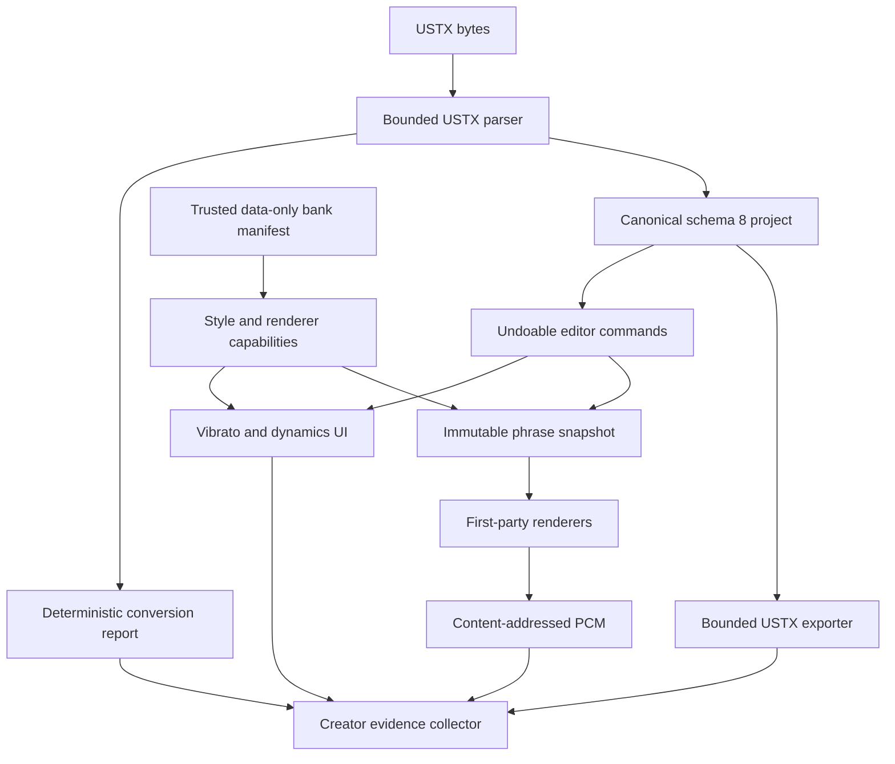
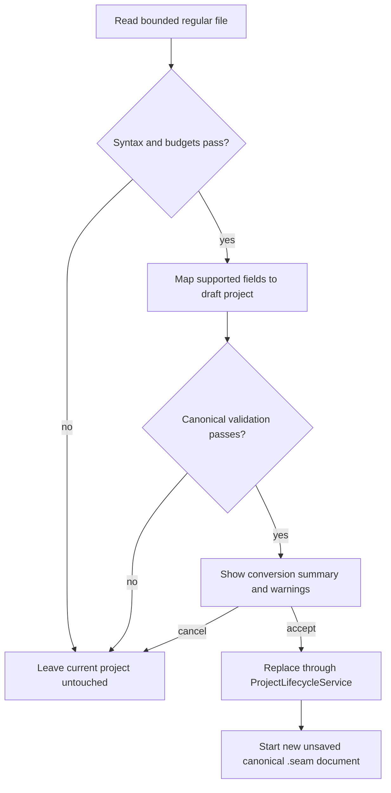
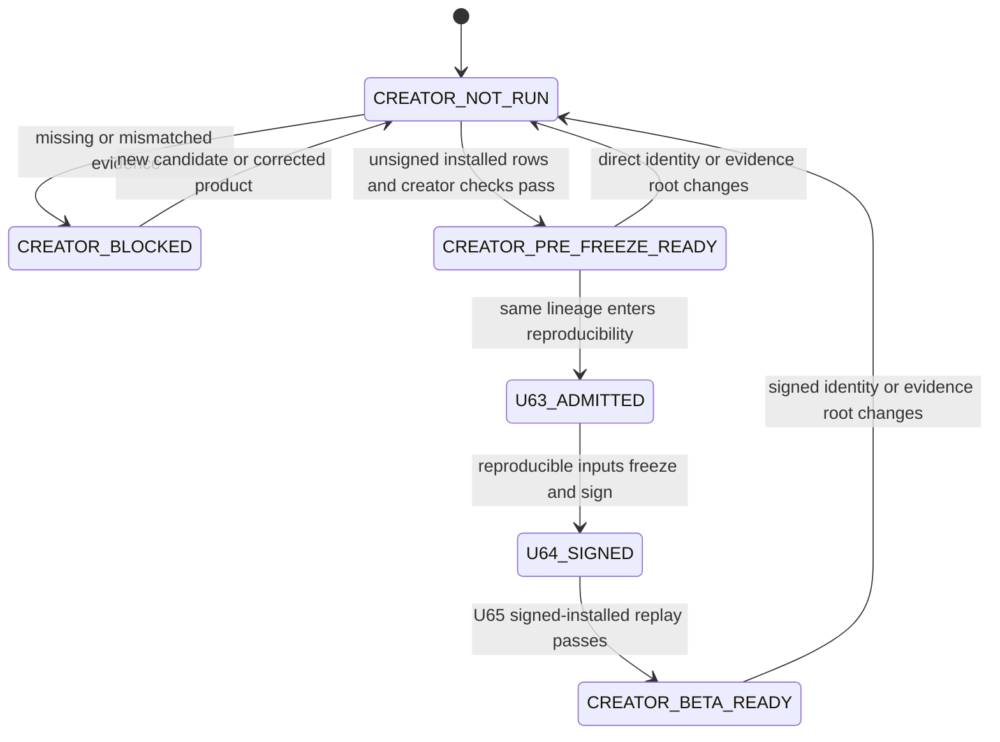
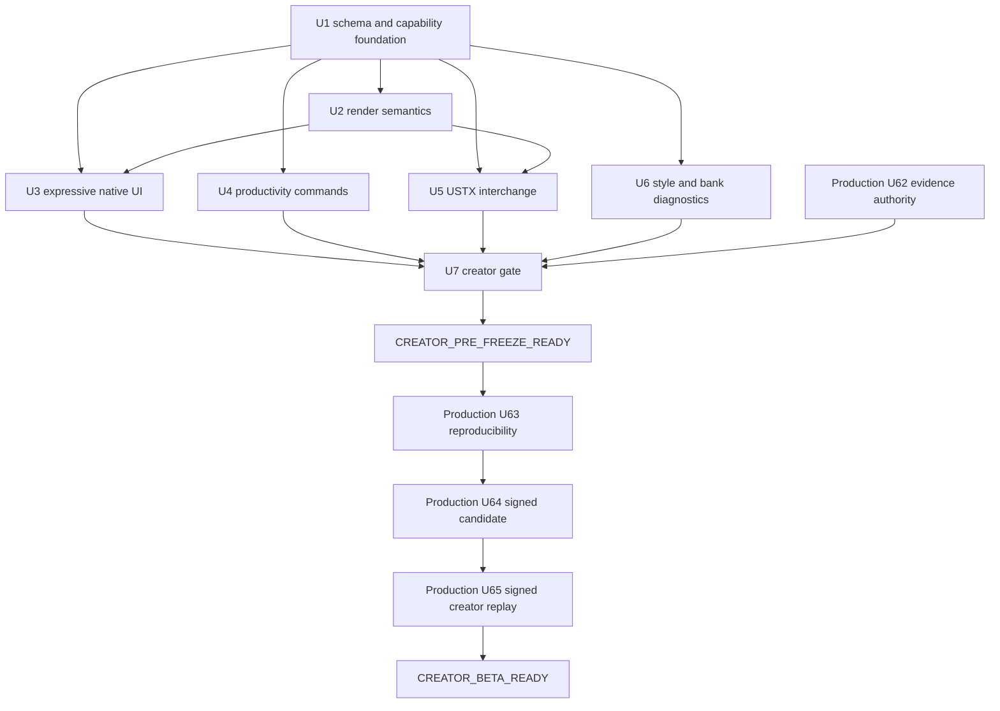

# Creator Workflow Parity - Plan

## Goal Capsule

| Field | Contract |
|---|---|
| Objective | A musician in the initial Beta cohort can bring a real OpenUtau singing project into Project SEAM, shape an expressive and readable performance, select the intended bank style, save and reopen it, and exchange the supported USTX score without unsafe extensions or silent data loss. |
| Means | Ratify the scope with target creators, then add the minimum creator-workflow layer: note vibrato, typed dynamics automation, bounded productivity tools, USTX interchange, style diagnostics, installed visual acceptance, and separate pre-freeze and signed-installed creator gates. |
| Authority | Product behavior in this plan extends `docs/plans/2026-08-21-1901-feat-project-seam-external-beta-plan.md`. Security and release rules in accepted ADRs and `docs/plans/2026-08-30-2246-feat-production-readiness-completion-plan.md` remain authoritative. Runtime and installed evidence outrank source, tests, or checklists. |
| Execution profile | Seven dependency-ordered units. U1 begins with a target-creator scope checkpoint. U1-U6 may then run alongside production U57-U62. U7 consumes production U62's evidence authority and produces `CREATOR_PRE_FREEZE_READY` before U63; production U65 replays the same journey on signed installed bytes to produce `CREATOR_BETA_READY`. |
| Stop conditions | Stop if creator sessions do not ratify the hard-gate scope, or if interoperability requires executable bank content, an in-process third-party extension or imported executable code, silent renderer or style substitution, unbounded YAML parsing, or a rewrite of the canonical C++ runtime. |
| Tail ownership | The release owner carries `CREATOR_PRE_FREEZE_READY` into U63 and carries `CREATOR_BETA_READY` from U65 into public activation. MIDI, neural engines, additional languages, generic expression registries, and an extension SDK remain separate follow-up programs. |

---

## Product Contract

### Summary

Project SEAM has a strong sample-concatenative core, explicit technical lanes, deterministic rendering, secure voicebanks, and unusually rigorous release evidence. The OpenUtau audit identifies credible creator-workflow hypotheses, but competitor presence alone is not demand evidence. This plan first tests those hypotheses with the initial Beta cohort and then closes only the ratified subset without turning SEAM into an OpenUtau fork or a general DAW.

### Problem Frame

The public-production plan previously treated the existing SEAM vertical slice as sufficient and shipping infrastructure as the remaining delta. The authoritative plan has now been amended to require this companion creator contract. The canonical project has no persisted note vibrato, no typed dynamics automation, no singing-project interchange, and no persisted voice-style choice. Existing batch edits and bank diagnostics are narrower than the hypothesized creator journey.

This is a product-completeness problem, not a reason to discard SEAM's architecture. OpenUtau's useful product concepts coexist with in-process DLL loading, executable dependency entrypoints, classic external resamplers, permissive package behavior, and a release bar that does not meet SEAM's accepted trust contract. The implementation must borrow workflows while preserving security, deterministic identity, native plug-in parity, and explicit fallbacks.

### Initial Beta Cohort and Scope Ratification

The initial segment is Japanese sample-based UTAU or OpenUtau cover and original-song creators who work on macOS or Windows and finish arrangements in a DAW. This is a deliberate first cohort, not a claim that one workflow represents every singer technology, language, or producer.

Before schema 8 changes begin, U1 runs a time-boxed comparative task study with five recruited creators from this segment. Each creator uses current SEAM, the pinned OpenUtau reference, one rights-cleared representative bank, one representative USTX song, and a throwaway low-fidelity USTX path. The study records task completion, time, blockers, workarounds, severity, and whether the creator would continue the song in SEAM.

| Hypothesized pain | Candidate requirement | Ratification evidence |
|---|---|---|
| Imported songs cannot enter or leave SEAM without manual reconstruction | R5, bounded USTX exchange | Creators attempt open, save-as-SEAM, edit, and USTX export; the study records manual reconstruction and silent-loss risk. |
| Performances sound mechanical without persistent, editable modulation | R1-R2, vibrato and dynamics | Creators reproduce a reference phrase and compare editability, audible control, and reopen behavior. |
| Repeated lyric, pronunciation, and note cleanup is too slow | R3, bounded productivity | Creators repair a multilingual verse; the study records repeated actions, errors, and desired batch scope. |
| Dense notes and long multilingual text obscure the active edit | R4, installed visual acceptance | Creators complete the dense-overlap and long-text task at representative window sizes and scaling. |
| Multi-style or multipitch banks are ambiguous at selection and failure time | R6, explicit style and coverage | Creators select the intended voice color, encounter one missing-coverage case, and explain the resulting state. |
| Compatibility pressure could reintroduce unsafe executable content | R7, data-only boundary | The study confirms that reported incompatibility is preferable to silent execution or substitution. |

R1-R6 become hard predecessors only after the study ratifies the corresponding pain. A rejected or materially different hypothesis requires an explicit plan amendment before canonical schema work; it cannot be preserved merely because OpenUtau implements the feature.

### Key Decisions

- **Selective interoperability, not migration.** OpenUtau is a compatibility and workflow reference; Project SEAM remains the product and runtime. Governs R1-R8.
- **USTX is the only Beta interchange format.** It serves the named OpenUtau exchange job. General MIDI is deferred until creator evidence proves a distinct score-transfer job and an allocation-safe parser contract exists. Governs R5.
- **Dynamics is typed, not a generic expression framework.** Schema 8 persists one `DynamicsAutomation` contract and current renderer capabilities. A generic descriptor registry and lane selector wait for a second expression with demonstrably shared semantics. Governs R2.
- **Executable extensions remain outside Beta.** New creator behavior uses first-party code and data-only packages. Governs R2, R3, R6, and R7.
- **Existing visual repairs are accepted as implementation inputs, not presumed shipped quality.** Overlap bands, text fitting, and character-dock behavior enter installed visual acceptance instead of being rebuilt. Governs R4 and R8.
- **Creator completeness uses two states.** Exact unsigned installed evidence admits reproducibility; exact signed installed evidence later admits public activation. Governs R8.

### Requirements

**Expressive performance**

- R1. Persist note vibrato with enabled state, start in [0, 1] of note length, fade-in and fade-out in [0, 1] of vibrato span with sum at most one, depth in [0, 200] cents, period in [5, 500] milliseconds, and phase in [0, 1) turns; make it undoable, serializable, accessible, deterministic in absolute sample time, and audible in every supported timeline renderer.
- R2. Persist a bounded typed `DynamicsAutomation` curve as linear gain in [0, `10^(12/20)`] with unity default, expose truthful vibrato, pitch, and dynamics support for each current first-party renderer, and report unsupported imported expression descriptors without persisting a speculative generic registry or silently applying or discarding them.

**Creator productivity and visual clarity**

- R3. Provide search, phonetic hints, selected-lyric replacement, auto-legato, overlap or gap normalization, and clear-vibrato or clear-dynamics batch operations as bounded first-party commands with one undo group per user action.
- R4. Dense overlapping notes, long CJK and Latin text, narrow windows, supported scaling, keyboard navigation, assistive technology, and Full, Minimal, and Off character modes must remain readable and operable without reducing the piano roll below its minimum work area.

**Interchange and compatibility**

- R5. Open and export the supported USTX 0.6-0.9 subset through a bounded adapter that converts time deterministically, reports every lossy or unsupported field, never resolves external executables, and preserves the canonical `.seam` format as the internal authority. Opening USTX creates a new unsaved SEAM document; track append is not a Beta path.

**Voicebank capability**

- R6. Persist an explicit track style, expose the bank's declared styles and root-pitch layers, validate coverage before render, and diagnose a missing or changed style without silent substitution.
- R7. Keep `.seambank`, interchange files, dictionaries, and future capability metadata data-only; no imported project or installed bank may load a DLL, script, resampler, wavtool, package entrypoint, shader, or embedded web content.

**Release governance**

- R8. `CREATOR_PRE_FREEZE_READY` must fail closed until an exact unsigned installed candidate and the exact U58 trusted bank complete authoring, USTX, style, save and reopen, visual, accessibility, target-creator, and evidence checks; production U63 cannot begin until it passes. `CREATOR_BETA_READY` must remain separate and can be reached only when production U65 repeats the journey on exact U64 signed installed bytes.

### Actors

- A1. Target musician in the initial Beta cohort opens or creates a project, edits notes, vibrato, and dynamics, selects a trusted bank style, saves, reopens, previews, and exports.
- A2. OpenUtau interoperability verifier exchanges the supported USTX subset and compares score, timing, lyric, pitch, vibrato, dynamics, and diagnostic results in an isolated verifier profile.
- A3. Voicebank producer declares styles and pitch layers in the existing signed manifest and owns producer repair outside this creator plan.
- A4. Independent QA operator runs density, scaling, keyboard, accessibility, character, and installed creator journeys against exact candidate hashes.
- A5. Release verifier evaluates both creator states independently of the implementer, refuses U63 admission when pre-freeze evidence is absent or mismatched, and refuses public activation when signed-installed evidence is absent or mismatched.

### Key Flows

- F1. **OpenUtau exchange**
  - **Trigger:** A1 opens or exports a `.ustx` project.
  - **Actors:** A1, A2.
  - **Steps:** Bound input, parse the supported subset, show a conversion report, create canonical SEAM state, edit and save, export USTX, open the result in the pinned OpenUtau reference, and compare the declared fields.
  - **Outcome:** Supported musical intent round-trips; unsupported data is named and never executed or silently lost.
  - **Covered by:** R1, R2, R5, R7.
- F2. **Expressive edit**
  - **Trigger:** A1 selects one or more notes.
  - **Actors:** A1.
  - **Steps:** Enable vibrato, adjust parameters, draw dynamics, preview, undo, redo, save, reopen, and render final audio.
  - **Outcome:** Editor state, render identity, audible output, and accessibility values agree.
  - **Covered by:** R1, R2, R4.
- F3. **Style and coverage selection**
  - **Trigger:** A1 selects a bank or changes track style.
  - **Actors:** A1, A3.
  - **Steps:** Read trusted manifest capabilities, show styles and pitch layers, select a style, validate note-range coverage, expose fallbacks or missing units, and render only the selected style.
  - **Outcome:** The requested and actual bank, style, unit, and renderer remain inspectable.
  - **Covered by:** R6, R7.
- F4. **Creator release gate**
  - **Trigger:** A release candidate approaches reproducible build and freeze.
  - **Actors:** A4, A5.
  - **Steps:** Restore exact artifacts, run installed creator and visual journeys, seal raw evidence, validate hashes and independence, and classify the creator state.
  - **Outcome:** U63 proceeds only from `CREATOR_PRE_FREEZE_READY`; public activation proceeds only from `CREATOR_BETA_READY` for the same source and product lineage.
  - **Covered by:** R4, R5, R6, R8.

### Acceptance Examples

- AE1. **USTX import with exact time conversion**
  - **Covers:** R5, R7.
  - **Given:** A bounded USTX 0.9 project at 480 PPQ with tempo and meter changes, two tracks, lyrics, pitch, vibrato, dynamics, and an unknown renderer field.
  - **When:** The musician imports it into a 960 PPQ SEAM project.
  - **Then:** Supported ticks convert exactly, supported musical data appears once, the unknown renderer is reported as unsupported, and no singer or executable reference is resolved.
- AE2. **Loss-aware USTX export**
  - **Covers:** R1, R2, R5.
  - **Given:** A SEAM project with representable notes, vibrato, pitch, dynamics, and one selected style plus a SEAM-only seam override.
  - **When:** The musician exports USTX.
  - **Then:** OpenUtau opens the supported data, the export report names the omitted seam override, and the original `.seam` project remains unchanged.
- AE3. **Vibrato render identity**
  - **Covers:** R1, R2.
  - **Given:** A note with vibrato disabled and a cached render.
  - **When:** Vibrato is enabled and depth or period changes.
  - **Then:** The relevant phrase identity changes, only affected phrases rerender, the audible pitch changes, and undo restores the original identity and audio.
- AE4. **Missing style after bank update**
  - **Covers:** R6, R7.
  - **Given:** A project requests style `soft` but the newly installed exact bank version declares only `original`.
  - **When:** The project opens or attempts to render.
  - **Then:** The track is visibly unresolved, no automatic style substitution occurs, and the user can deliberately choose an available style or relink the prior exact bank.
- AE5. **Dense note and text accessibility**
  - **Covers:** R3, R4.
  - **Given:** Five overlapping notes with long Korean, Japanese, Chinese, and Latin lyrics at 200% scaling in the minimum supported window.
  - **When:** The musician cycles the overlap group by keyboard and assistive action.
  - **Then:** Every note is reachable in stable order, truncated labels retain accessible full text, the overflow count is visible, and no required action is clipped.
- AE6. **Character identity remains optional**
  - **Covers:** R4, R6.
  - **Given:** Full character mode with a matching bank binding, then the same project with a mismatched or missing character package.
  - **When:** The editor opens and the bank state changes.
  - **Then:** The matching portrait reinforces bank identity without hiding editor controls; a mismatch suppresses the portrait; editing and rendering remain available in Minimal and Off modes.
- AE7. **Hostile interchange input**
  - **Covers:** R5, R7.
  - **Given:** Oversized, deeply nested, aliased, multi-document, malformed, path-bearing, invalid-UTF-8, control-bearing, bidirectional-control, or event-amplifying USTX fixtures.
  - **When:** The user attempts import.
  - **Then:** Parsing fails before unbounded allocation or external access, the original project remains untouched, and the diagnostic identifies the violated budget. Accepted lyric text is retained exactly, while report, log, and evidence surfaces escape control and bidirectional code points and isolate display direction.
- AE8. **Freeze dependency**
  - **Covers:** R8.
  - **Given:** U53-U62 are otherwise acceptable but installed creator evidence is missing or names a different source commit.
  - **When:** The production program requests U63 admission.
  - **Then:** `CREATOR_PRE_FREEZE_READY` remains blocked and cannot be satisfied by unit tests, source inspection, or OpenUtau-only evidence.

### Success Criteria

- Five target creators participate in scope ratification; before pre-freeze readiness, at least three independently complete the imported-song journey and explicitly elect to continue the project in SEAM, with no unresolved P0 or P1 creator issue.
- One independent QA operator completes F1-F4 without a terminal for product actions and produces hash-bound raw evidence.
- Supported USTX fixtures round-trip through the pinned OpenUtau commit with no unexplained difference in tempo, meter, track ordering, note timing, lyric, pitch, vibrato, or dynamics.
- Every unsupported or lossy interchange field appears in a deterministic conversion report; the count of silent drops is zero.
- Vibrato and dynamics pass save, reopen, undo, redo, cache invalidation, final render, CLAP editor state, and installed standalone acceptance.
- Dense-note, long-text, scaling, character, keyboard, VoiceOver, Narrator, Accessibility Inspector, and UIA rows pass on exact installed bytes.
- `CREATOR_PRE_FREEZE_READY` is reproducible from a restored unsigned-candidate evidence root and is a hard predecessor of U63. `CREATOR_BETA_READY` is reproducible only from the signed U64 installed-candidate evidence root during U65.

### Scope Boundaries

**In scope**

- Persisted note vibrato.
- Typed dynamics automation and truthful current-renderer capability declarations.
- First-party creator productivity operations and phonetic hints.
- USTX open and export.
- Persisted voicebank style selection and multipitch diagnostics using the existing manifest.
- Installed visual and accessibility acceptance for overlap, text, scaling, and character composition.
- The `CREATOR_PRE_FREEZE_READY` and `CREATOR_BETA_READY` gates and production-plan dependencies.

### Deferred to Follow-Up Work

- MIDI, UST, VSQX, MusicXML, and UFData import or export. MIDI returns only after a distinct creator job and a before-allocation parser design are proven.
- Additional first-party language phonemizers, G2P models, and custom dictionaries.
- A signed, out-of-process renderer or phonemizer extension protocol.
- A generic expression descriptor registry or expression-lane selector before a second supported expression proves shared units, scope, and interpolation.
- DiffSinger, ENUNU, Vogen, VOICEVOX, or another neural renderer.
- Voicebank merge, third-party publishing portal, dependency marketplace, transcription, theme editor, and advanced track effects.

**Outside this product's identity**

- Loading arbitrary in-process DLLs, scripts, legacy UTAU plug-ins, resamplers, wavtools, package entrypoints, shaders, or embedded web content from a bank or imported project.
- Embedding OpenUtau's application or .NET runtime in the shipping SEAM product.
- Silent renderer, style, bank, expression, or phoneme substitution.
- Feature-for-feature OpenUtau cloning or replacing a DAW.

---

## Planning Contract

### Product Contract Preservation

This is a new companion Product Contract. It does not renumber or reinterpret requirements, decisions, or units in either predecessor plan. The production plan receives one additive creator-gate requirement and dependency.

### Key Technical Decisions

- KTD1. **Keep one canonical SEAM project model.** The USTX adapter translates at the boundary; an accepted external project becomes an ordinary unsaved schema-8 SEAM document, and export never mutates the source document. Governs R5 and R7.
- KTD2. **Use additive schema 8 migration.** Add unit-bearing `NoteVibrato`, typed `DynamicsAutomation` linear gain in [0, `10^(12/20)`] with unity default, phonetic hints, the fifth `Dynamics` technical lane, and structured style selection. For schemas 1-7, the application-layer migration preserves the existing manifest-first style only when the exact bank resolves, records `LegacyManifestFirst` provenance, and materializes the style on the next safe save; otherwise the track remains unresolved. Governs R1-R3 and R6.
- KTD3. **Compile vibrato into immutable phrase snapshots.** Store start as a note-length fraction, fades as vibrato-span fractions, depth in cents, period in milliseconds, and phase in turns. Evaluate in absolute sample time and compose base note, manual pitch automation, then vibrato offset. Include effective audio inputs in content identity. Governs R1 and R2.
- KTD4. **Negotiate only current typed capabilities.** Raw, Classic PSOLA, Spectral Classic, and Stretch declare whether they support pitch curves, note vibrato, and typed dynamics through a compiled first-party registry. Unknown imported expression descriptors exist only in the bounded conversion report. Governs R2 and R7.
- KTD5. **Use one bounded, pinned USTX parser.** Pin rapidyaml 0.16.0 at `f8ac8dd50f4f7916579d55a05ebf9c6488e52670` under MIT. Every tree and parser uses per-import callbacks, the bounded allocator, and typed parse and visit handlers that throw into one narrow adapter catch and return `core::Result`; product code may not use rapidyaml default or global callbacks. Record the exact source-archive SHA-256, copied license, embedded dependency provenance, distribution and modification status, approvals, SBOM entry, and passing repository license audit. Governs R5 and R7.
- KTD6. **Map USTX time and expression units explicitly.** USTX 480 PPQ converts to SEAM 960 PPQ exactly for tick-based fields. Pitch-point milliseconds convert through the imported tempo map to region-relative ticks with nearest-tick rounding diagnostics. Vibrato maps `startFraction = 1 - length/100`, `fadeInFraction = in/100`, `fadeOutFraction = out/100`, `depthCents = depth`, `periodMilliseconds = period`, and `phaseTurns = (shift/100) mod 1`; `drift` and `volLink` are unsupported lossy fields. USTX dynamics integers map from tenths of a decibel to typed linear gain, with the USTX minimum mapping to silence. Governs R1, R2, and R5.
- KTD7. **Reuse manifest styles and root pitches without inventing a default.** A newly assigned one-style bank selects its sole style; a multi-style bank requires deliberate selection. Legacy schemas preserve the exact bank's existing first-style behavior only through KTD2 migration. Derive multipitch behavior from unit `style`, `rootMidi`, `take`, and coverage data instead of adding an OpenUtau-shaped subbank database. Governs R6.
- KTD8. **Treat visual repairs as a shipped-behavior gate.** Existing overlap grouping, UTF-8 fitting, and character binding remain the implementation base; acceptance adds real CJK, density, scaling, keyboard, accessibility, and installed screenshots rather than a second layout system. Governs R4 and R8.
- KTD9. **Defer unproven generality.** Schema 8 contains only contracts consumed by current compiled renderers and the Beta USTX bridge. Neural engines, arbitrary extensions, and a generic expression registry require separate additive protocols after creator evidence. Governs R2 and R7.
- KTD10. **Use separate pre-freeze and signed-installed gates.** U7 consumes production U62 evidence authority and the exact U58 trusted installed bank to produce `CREATOR_PRE_FREEZE_READY` from an unsigned installed candidate. U63 consumes that state. U65 replays the journey on exact U64 signed installed bytes and alone can produce `CREATOR_BETA_READY`. Governs R8.
- KTD11. **Apply one global USTX resource budget.** Accept at most 64 MiB of input and 256 MiB combined parser, draft, and report retained memory. Cap depth at 64, nodes at 1,000,000, retained scalar bytes at 4 MiB, collection entries at 250,000, conversion-report entries at 10,000, and serialized report bytes at 4 MiB; reject aliases, tags, multiple documents, duplicate keys, invalid UTF-8, and non-finite numbers. The virtualized review UI and support-bundle export use the same deterministic caps and do not duplicate untrusted strings. Governs R5 and R7.
- KTD12. **Treat Open External Project as document lifecycle, not undo.** Beta does not append USTX tracks. After current-document save or discard handling and conversion acceptance, `ProjectLifecycleService` replaces the document, clears undo and redo, starts a new unsaved `.seam` autosave and recovery lineage, and retains only bounded import provenance. Cancel or rejection leaves the current document and recent-project state unchanged. Governs R5.
- KTD13. **Use one creator-candidate identity.** `CreatorCandidateIdentity` directly keys source commit, canonical unsigned app-payload hash preserved across signing, stage-appropriate unsigned or signed package hash, exact bank ID/version/content hash, project schema version, expressive-capability revision, USTX contract version, and fixture-corpus hash. `EvidenceRoot` contains platform, operator roles, raw artifacts, screenshots, audio, isolated OpenUtau verifier identity and profile, and approvals. A direct-key change resets the relevant state; an evidence-root change requires revalidation. Governs R8.
- KTD14. **Keep content hashes effect-scoped.** Disabled vibrato, unity dynamics, or a migrated legacy style that produces the existing effective render plan preserves pre-U2 phrase identity and PCM. Capability and style revisions invalidate only phrases whose effective inputs change. Governs R1, R2, and R6.
- KTD15. **Bind file validation to opened objects.** Inputs use platform no-follow opens and validate regular-file, size, and identity on the held handle; parsing and hashing consume those exact bytes. Exports hold the validated destination parent identity and publish relative to it. Symlink, reparse-point, and replacement races fail closed. Governs R5 and R7.

### High-Level Technical Design

The canonical project remains the center. Interchange, UI, rendering, bank capabilities, and release evidence consume the same versioned intent rather than maintaining parallel models.



Opening an external USTX project is a document-lifecycle transaction, not a whole-document undo command. No project state is published before bounded parsing, semantic validation, conversion, current-document save or discard handling, and user acceptance of the review complete.



The release states are additive, lineage-bound, and fail-closed.



### Output Structure

```text
libs/seam-interchange/
  include/seam/interchange/
    conversion_report.hpp
    ustx_codec.hpp
  src/
    conversion_report.cpp
    ustx_codec.cpp
tests/fixtures/interchange/
  openutau-0.9/
docs/product/creator-beta/
  CREATOR_BETA_ACCEPTANCE.md
  creator-beta-acceptance.schema.json
  creator-beta-acceptance.json
```

### Assumptions

- The supported OpenUtau reference remains commit `8c0dc4007e6e8c8181f3a12c10205671800eeb8b`, whose source writes USTX version 0.9; fixtures also cover the documented 0.6-0.8 migration surface.
- The local audit did not build OpenUtau because `dotnet` is unavailable. U5 therefore creates provenance-tracked fixtures on a machine with the pinned OpenUtau commit and records the executable hash, source commit, toolchain and dependency identity, network-disabled profile inventory, inputs, and raw outputs.
- The first Beta bank may expose only `original`, but the project and UI must correctly handle more than one declared style and more than one root-pitch layer.
- Dynamics is the only new schema-8 automation type. Canonical points store bounded linear gain, with unity as the zero-effect default; the UI presents decibels and silence without persisting non-finite values.
- Interchange imports a copy. It does not maintain a live link to an external file or auto-install referenced singers, packages, or tools.
- The user's instruction to proceed without further confirmation is treated as approval of the narrow Beta-critical scope; deferred neural, marketplace, and arbitrary-extension work is not silently added.

### Sequencing



U1's scope-ratification checkpoint runs before schema edits. After ratification, U1 lands first because every later unit consumes the persisted vocabulary. U2, U4, U5, and U6 can then proceed in parallel where ownership permits. U3 consumes U2's audible semantics. U7 is the only path to `CREATOR_PRE_FREEZE_READY`; production U65 is the only path to `CREATOR_BETA_READY`.

### System-Wide Impact

- **Project compatibility:** Schema 8 changes standalone documents, autosave, recovery, CLAP state, fixtures, support bundles, candidate identity, and all cross-version tests.
- **Rendering and cache:** Effective vibrato, dynamics, selected style, and truthful current-renderer capability revisions become audio-affecting identity inputs. Zero-effect intent and presentation-only lane visibility remain excluded.
- **Realtime safety:** Interchange and dynamics editing stay off the audio callback. Snapshot evaluation and rendered automation must be bounded before publication.
- **Voicebank trust:** No new executable package path is introduced. Style selection consumes already trusted manifest data.
- **UI and accessibility:** The fifth Dynamics lane, new adjustable controls, conversion review, search results, and mode-independent Style and Coverage sheet need semantic nodes and platform adapters.
- **Plug-in parity:** Canonical editor state and rendered timeline behavior must remain equivalent in CLAP, VST3, and AUv2 projections; unsupported wrapper automation must be documented rather than fabricated.
- **Release and operations:** The pinned rapidyaml source enters SBOM and license closure. Pre-freeze and signed-installed creator evidence become separate parts of candidate authorization and archive restoration.

### Risks and Mitigations

| Risk | Consequence | Mitigation |
|---|---|---|
| USTX evolves after the pinned reference | Import differences or silent loss | Version-gate the supported subset, keep real fixtures by version, emit unknown-field diagnostics, and require an explicit compatibility update. |
| YAML input amplifies memory or CPU | Denial of service during open | Use handle-bound bytes, per-import non-terminating callbacks, one global retained-memory budget, bounded report rendering, and fuzz under ASan and UBSan. |
| Dynamics becomes a premature expression framework | Complex schema and misleading UI | Persist only typed DynamicsAutomation; defer a generic registry until a second expression proves common semantics. |
| Vibrato combines incorrectly with manual pitch | Unpredictable intonation | Define the order once in KTD3, display the resulting pitch, and test overlapping pitch and vibrato boundaries. |
| Style disappears after bank update | Unexpected voice change | Keep exact bank identity, fail the track unresolved, and require deliberate relink or style selection per AE4. |
| New lane reduces usable piano-roll space | Reintroduces density and overflow defects | Use existing adaptive lane modes, minimum timeline width, compact controls, and installed scaling acceptance before U7. |
| Interchange scope expands toward full OpenUtau parity | Delays the real bank and signed Beta | Keep direct legacy formats, neural engines, package manager, and arbitrary extensions deferred. |
| Third-party parser weakens release closure | Untracked source, embedded dependency, or license | Pin source and archive hash, vendor only required files, record provenance and approvals, run the repository license auditor, and bind its output to U7 evidence. |
| Competitor features do not match target creator demand | The critical path optimizes the wrong workflow | Run the U1 cohort study before schema changes and amend the plan when a hypothesis is not ratified. |

### Alternative Approaches Considered

| Approach | Decision | Reason |
|---|---|---|
| Fork or embed OpenUtau | Rejected | It replaces SEAM's native plug-in and realtime architecture and imports incompatible trust boundaries. |
| Use OpenUtau only as an external editor | Rejected as the product path | It leaves SEAM without a coherent standalone creator journey and turns another application into an undeclared runtime dependency. |
| Implement every OpenUtau feature before Beta | Rejected | It delays voicebank, signing, target QA, and cohort evidence without proving demand for every legacy or neural capability. |
| Add only USTX interchange | Rejected as insufficient | Exchange does not fix missing vibrato, dynamics, style, productivity, or installed UI readiness. |
| Load OpenUtau-compatible DLL phonemizers and resamplers | Rejected | It violates accepted data-only and fail-closed rules and expands the realtime attack surface. |
| Selective workflow parity plus file-level bridge | Chosen | It closes the musician-facing Beta gaps while preserving SEAM's identity and release architecture. |

### Sources and Research

- `docs/reviews/PROJECT_SEAM_OPENUTAU_COMPARATIVE_AUDIT_2026-09-01.md`
- `docs/adr/0003-backend-independent-editor-model.md`
- `docs/adr/0007-data-only-voicebanks.md`
- `docs/adr/0008-phrase-scoped-render-snapshots.md`
- `docs/adr/0011-explicit-multi-renderer-backends.md`
- `docs/adr/0017-bound-untrusted-data-before-allocation.md`
- `libs/seam-domain/include/seam/domain/project.hpp`
- `libs/seam-domain/include/seam/domain/note.hpp`
- `libs/seam-domain/include/seam/domain/render_controls.hpp`
- `libs/seam-editor-ui/include/seam/ui/piano_roll_model.hpp`
- `libs/seam-editor-ui/src/note_visual_layout.cpp`
- `libs/seam-native-ui/src/editor_scene.cpp`
- `libs/seam-formats/src/project_json.cpp`
- `libs/seam-voicebank/include/seam/voicebank/voicebank.hpp`
- `libs/seam-rendering/src/render_snapshot.cpp`
- [OpenUtau audited source](https://github.com/openutau/OpenUtau/tree/8c0dc4007e6e8c8181f3a12c10205671800eeb8b)
- [OpenUtau renderer interface](https://github.com/openutau/OpenUtau/blob/8c0dc4007e6e8c8181f3a12c10205671800eeb8b/OpenUtau.Core/Render/IRenderer.cs)
- [OpenUtau phonemizer API](https://github.com/openutau/OpenUtau/blob/8c0dc4007e6e8c8181f3a12c10205671800eeb8b/OpenUtau.Core/Api/Phonemizer.cs)
- [OpenUtau project model](https://github.com/openutau/OpenUtau/blob/8c0dc4007e6e8c8181f3a12c10205671800eeb8b/OpenUtau.Core/Ustx/UProject.cs)
- [OpenUtau format dispatcher](https://github.com/openutau/OpenUtau/blob/8c0dc4007e6e8c8181f3a12c10205671800eeb8b/OpenUtau.Core/Format/Formats.cs)
- [rapidyaml 0.16.0](https://github.com/biojppm/rapidyaml/releases/tag/v0.16.0)

---

## Implementation Units

### U1. Add the schema-8 creator capability foundation

**Goal:** Ratify the creator scope, then define and persist the smallest canonical vocabulary required by vibrato, typed dynamics, phonetic hints, style selection, and the Dynamics lane.

**Requirements:** R1-R3, R6, R7.

**Dependencies:** None.

**Files:**

- Create `docs/product/creator-beta/CREATOR_SCOPE_RATIFICATION.md`, `creator-scope-ratification.schema.json`, and `creator-scope-ratification.json`.
- Create `libs/seam-domain/include/seam/domain/dynamics_automation.hpp`.
- Create `libs/seam-domain/src/dynamics_automation.cpp`.
- Modify `libs/seam-domain/include/seam/domain/note.hpp`.
- Modify `libs/seam-domain/include/seam/domain/project.hpp`.
- Modify `libs/seam-domain/include/seam/domain/render_controls.hpp`.
- Modify `libs/seam-domain/src/note.cpp`.
- Modify `libs/seam-domain/src/project.cpp`.
- Modify `libs/seam-formats/include/seam/formats/project_json.hpp`.
- Modify `libs/seam-formats/src/project_json.cpp`.
- Modify `libs/seam-authoring-runtime/include/seam/authoring/project_lifecycle.hpp` and `libs/seam-authoring-runtime/src/project_lifecycle.cpp` for post-load exact-bank style migration.
- Create `docs/formats/PROJECT_JSON_V8.md`.
- Modify `CMakeLists.txt`.
- Modify `tests/test_serialization.cpp`.
- Modify `tests/test_commands.cpp`.
- Modify `tests/test_command_impact.cpp`.
- Modify `tests/test_project_lifecycle.cpp`.
- Add schema-7 and schema-8 fixtures under `tests/fixtures/projects/`.

**Approach:**

1. Run the Initial Beta Cohort and Scope Ratification study before modifying canonical schema files. Preserve session evidence and either ratify R1-R6 or amend the plan; competitor inventory cannot substitute for this checkpoint.
2. Add a bounded `NoteVibrato` value object with the R1 and KTD3 units and ranges. Validate finite fractions, fade-sum, period, depth, normalized phase, and stable equality.
3. Add typed per-region `DynamicsAutomation` points as linear gain in [0, `10^(12/20)`] with unity default, deterministic tick ordering, and linear interpolation. Do not add a generic descriptor registry.
4. Add a note phonetic hint without replacing the visible lyric or generated phoneme overrides.
5. Add structured style selection to vocal tracks. Schemas 1-7 enter `LegacyNeedsExactBankResolution`; after exact-bank resolution the application preserves the manifest's first style with `LegacyManifestFirst` provenance and materializes it on the next safe save. Missing exact banks remain unresolved.
6. Add `TechnicalLane::Dynamics` and migrate the fixed presentation array from four to five entries with a deterministic default.
7. Write schema 8 only. Read schemas 1-7 with vibrato disabled, unity dynamics, no phonetic hint, default Dynamics-lane presentation, and the KTD2 legacy style marker.
8. Include all new synthesis-affecting state in command-impact classification, dirty state, autosave, recovery, support preview, and canonical serialization. Lane visibility and migration provenance remain presentation or compatibility metadata unless they alter the effective render plan.

**Execution note:** The creator study is a stop gate. After it ratifies the scope, implement domain validation and legacy migration tests before changing render or UI consumers.

**Patterns to follow:** `libs/seam-domain/include/seam/domain/render_controls.hpp`, `libs/seam-formats/src/project_json.cpp`, `docs/formats/PROJECT_JSON_V3.md`, `tests/test_serialization.cpp`.

**Test scenarios:**

1. Five target-creator study records cover every ratification task, blockers, continuation choice, and plan disposition before the first schema-8 change.
2. A schema-8 project containing unit-bearing vibrato, phonetic hints, typed dynamics, structured style selection, and Dynamics-lane settings round-trips byte-stably through decode and encode.
3. Schemas 1-7 load with deterministic zero-effect defaults. When the exact bank resolves, legacy style selection preserves current PCM and phrase identity; when it does not resolve, render fails visibly without substitution.
4. NaN, infinity, out-of-range vibrato, invalid linear gain, unsorted or duplicate dynamics points, and oversized curves fail canonical validation.
5. A Dynamics-lane presentation toggle leaves synthesis impact unchanged; vibrato, dynamics, phonetic hint, and selected-style commands produce the declared edit and render impacts.
6. Undo and redo restore exact prior canonical state for each new field and preserve one project revision per command group.
7. Autosave and crash-recovery candidates retain all schema-8 fields and reject unsupported future schema versions.

**Verification:** Canonical fixtures and all project, command, autosave, recovery, support, and serialization tests agree on schema 8 and legacy migration; no renderer or UI code is required to invent missing state.

### U2. Make vibrato and dynamics deterministic render inputs

**Goal:** Turn schema-8 expressive intent into audible, cache-correct, renderer-declared output without adding work to the audio callback.

**Requirements:** R1, R2, R6, R7.

**Dependencies:** U1.

**Files:**

- Create `libs/seam-synthesis/include/seam/synthesis/renderer_capabilities.hpp`.
- Create `libs/seam-synthesis/src/renderer_capabilities.cpp`.
- Modify `libs/seam-rendering/include/seam/rendering/render_snapshot.hpp`.
- Modify `libs/seam-rendering/src/render_snapshot.cpp`.
- Modify `libs/seam-rendering/src/region_renderer.cpp`.
- Modify `libs/seam-synthesis/include/seam/synthesis/phrase_renderer.hpp`.
- Modify `libs/seam-synthesis/src/phrase_renderer.cpp`.
- Modify `libs/seam-synthesis/include/seam/synthesis/raw_renderer.hpp`.
- Modify `libs/seam-synthesis/src/raw_renderer.cpp`.
- Modify `libs/seam-authoring-runtime/src/render_coordinator.cpp`.
- Modify `libs/seam-application/include/seam/application/command.hpp`.
- Modify `libs/seam-application/include/seam/application/render_commands.hpp`.
- Modify `libs/seam-application/src/render_commands.cpp`.
- Modify `libs/seam-application/src/editor_session.cpp`.
- Modify `libs/seam-clap-editor/src/editor_runtime_state.cpp`.
- Modify `CMakeLists.txt`.
- Create `tests/test_dynamics_automation.cpp`.
- Modify `tests/test_rendering.cpp`.
- Modify `tests/test_synthesis.cpp`.
- Modify `tests/test_authoring_render_coordinator.cpp`.
- Modify `tests/test_phase11_clap_editor.cpp`.
- Modify `tests/test_authoring_characterization.cpp`.

**Approach:**

1. Register truthful pitch-curve, note-vibrato, and typed-dynamics capabilities for Raw, Classic PSOLA, Spectral Classic, and Stretch through one compiled first-party registry.
2. Evaluate note vibrato at bounded sample-time intervals during snapshot creation using KTD3's base-note, manual-pitch, then vibrato order.
3. Extend `RawRenderParameters` and `RawLoopRenderer` with the same bounded `PitchCurve` input used by expressive snapshots and time-varying source stepping. Prohibit Raw fallback for an expressive phrase until Raw pitch-curve parity passes.
4. Convert typed dynamics into a bounded linear-gain phrase envelope and apply it off-callback after unit synthesis and before final phrase publication. Define interpolation, endpoint behavior, silence, and clamping once.
5. Apply KTD14 effect-scoped identity: include effective vibrato, evaluated pitch curve, active dynamics, selected style, renderer identity, and relevant capability revision only when they change the render plan. Exclude UI selection, lane presentation, and zero-effect legacy migration metadata.
6. Keep requested and actual renderer, style, dynamics support, fallback, and diagnostics in the render plan. Never convert an unsupported imported expression into another control.
7. Preserve newest-request cancellation, stale-result rejection, PCM reuse for unaffected phrases, and bounded worker behavior.

**Execution note:** Start with content-identity and zero-effect characterization. Existing projects with vibrato disabled and no dynamics curve must remain audio-identical.

**Patterns to follow:** `docs/adr/0008-phrase-scoped-render-snapshots.md`, `docs/adr/0010-explicit-renderer-fallback.md`, `libs/seam-rendering/src/render_snapshot.cpp`, `libs/seam-synthesis/src/phrase_renderer.cpp`.

**Test scenarios:**

1. A legacy project with no new expressive state produces the same render identity and PCM as the pre-U2 characterization fixture.
2. Enabling vibrato changes only affected phrase hashes and yields the expected depth and period within tolerance for all four renderers.
3. Vibrato start, fade boundaries, phase, short-note clipping, tempo changes, note ties, and simultaneous manual pitch points evaluate deterministically without discontinuity or non-finite samples.
4. Raw pitch curves follow the same bounded vibrato and manual-pitch fixture as the other renderers; expressive Raw fallback remains disabled until parity passes.
5. A dynamics curve applies the expected linear-gain envelope, including unity, silence, endpoint, clamp, and phrase-boundary cases without a click.
6. Changing lane visibility, selection, character mode, or viewport does not invalidate PCM; changing effective vibrato, dynamics, selected style, capability revision, or renderer does.
7. An unknown imported expression is reported only in conversion review and cannot mutate PCM or enter canonical project state.
8. A stale or cancelled expressive render cannot replace a newer revision, and unaffected phrases remain cache hits.
9. Schema-7 and schema-8 CLAP editor state save and reopen retain expressive intent through `ProjectJsonCodec` and produce the same offline bounce as standalone final render; VST3 and AUv2 projections inherit the same canonical editor state.

**Verification:** All supported renderers declare truthful capabilities, expressive edits are audible and hash-correct, zero-effect projects remain stable, and realtime diagnostics show no callback allocation or file access.

### U3. Build the expressive native editor and visual-density acceptance surface

**Goal:** Let musicians edit vibrato and dynamics directly while preserving note readability, text fit, character purpose, keyboard control, and accessibility.

**Requirements:** R1-R4, R6.

**Dependencies:** U1, U2.

**Files:**

- Create `libs/seam-editor-ui/include/seam/ui/vibrato_model.hpp`.
- Create `libs/seam-editor-ui/src/vibrato_model.cpp`.
- Create `libs/seam-editor-ui/include/seam/ui/dynamics_lane_model.hpp`.
- Create `libs/seam-editor-ui/src/dynamics_lane_model.cpp`.
- Modify `libs/seam-editor-ui/include/seam/ui/piano_roll_model.hpp`.
- Modify `libs/seam-native-ui/include/seam/native_ui/editor_controller.hpp`.
- Modify `libs/seam-native-ui/include/seam/native_ui/editor_scene.hpp`.
- Modify `libs/seam-native-ui/src/editor_controller.cpp`.
- Modify `libs/seam-native-ui/src/editor_scene.cpp`.
- Modify `libs/seam-native-ui/src/editor_semantics.cpp`.
- Modify `libs/seam-native-ui/include/seam/native_ui/accessibility_tree.hpp` and `editor_semantics.hpp`.
- Modify `libs/seam-native-ui/include/seam/native_ui/accessibility_win32.hpp`.
- Modify platform accessibility adapters under `libs/seam-native-ui/src/`.
- Modify `CMakeLists.txt`.
- Modify `tests/test_ui.cpp`.
- Modify `tests/test_native_ui.cpp`.
- Modify `tests/test_accessibility_tree.cpp`.
- Create `tests/test_dynamics_lane_workflow.cpp`.

**Approach:**

1. Add note-level vibrato handles for enabled state, start, fade-in, depth, fade-out, period, and phase. Handles belong only to the active note. A multi-note selection shows a mixed-value summary and an explicit Apply to Selection command; a hidden overlap member must become active before handles appear.
2. Add one dedicated Dynamics lane. Do not add an expression selector. Direct dynamics manipulation, numeric editing, keyboard editing, and accessibility actions dispatch the same canonical command.
3. Extend the shared semantic contract with an `Adjustable` role, Increment and Decrement actions, stable ID, minimum, maximum, current value, unit, step, and disabled reason. Map it to AppKit adjustable-value actions and Windows UIA RangeValue.
4. Draw the resulting pitch preview so manual pitch plus vibrato is inspectable, while preserving the underlying separate intents for undo and USTX interchange.
5. Reuse adaptive lane modes, minimum timeline width, overlap groups, note detail, Unicode fitting, semantic focus, and the shared character dock. Do not create an overlay that steals input or hides notes.
6. Expose full untruncated values through note detail and accessibility metadata when a visual label is ellipsized.
7. Give the character surface a narrow read-only role: trusted selected-bank identity, readiness, and recovery status. It must disappear on identity mismatch and never block editing in Minimal or Off modes.
8. Capture the exact U7 visual matrix: 480x320 at 100%, 125%, 150%, and 200% on macOS and Windows; 720x450, 960x600, and 1188x768 at 100% and 200%; 1280x800 and 1440x900 at 100%; Full, Minimal, and Off at 480x320 and 960x600. Every row uses dense overlap and long multilingual text.

**Execution note:** Preserve existing overlap, text, and character characterization before adding the fifth lane, then update only intentional visual fixtures.

**Patterns to follow:** `libs/seam-editor-ui/src/note_visual_layout.cpp`, `libs/seam-native-ui/src/editor_scene.cpp`, `tests/native_ui_design_fixture.hpp`, `tests/test_native_ui.cpp`.

**Test scenarios:**

1. A pointer drag, keyboard edit, AppKit adjustable action, and UIA RangeValue action for each vibrato parameter dispatch the same command, create one undo step, and announce the same bounded value.
2. Mixed-note selection shows no ambiguous handles; Apply to Selection updates only selected notes atomically; activating a hidden overlap member transfers the handles predictably.
3. The Dynamics lane draws, moves, interpolates, resets, and box-selects points without changing note selection. A renderer without typed dynamics disables the lane with a specific capability diagnostic and preserves canonical data.
4. Five overlapping notes remain visible or represented by the overflow badge; keyboard and assistive activation cycles every member in stable order.
5. Long Korean, Japanese, Chinese, Latin, bank, path, diagnostic, and export strings fit every owning rectangle; full content remains available to focus detail or accessibility.
6. Every exact viewport, scale, platform, density, text, and character-mode row from approach step 8 retains the piano-roll minimum work area and keeps every vibrato, dynamics, overlap, diagnostic, and export action reachable.
7. Matching, missing, and mismatched character packages produce the intended Full, Minimal, and Off compositions without changing render identity.
8. Reduced motion suppresses nonessential transitions while leaving state changes and focus order clear.

**Verification:** Automated geometry and semantic tests pass, visual fixtures show no clipping or hidden action, and independent installed UI review passes the U7 matrix on macOS and Windows.

### U4. Complete bounded lyric, note, and pronunciation productivity tools

**Goal:** Reduce repetitive creator work without introducing OpenUtau-style executable macros or legacy plug-ins.

**Requirements:** R3, R4, R7.

**Dependencies:** U1.

**Files:**

- Modify `libs/seam-application/include/seam/application/note_commands.hpp`.
- Modify `libs/seam-application/include/seam/application/lyric_commands.hpp`.
- Modify `libs/seam-application/include/seam/application/render_commands.hpp`.
- Modify `libs/seam-application/src/note_commands.cpp`.
- Modify `libs/seam-application/src/lyric_commands.cpp`.
- Modify `libs/seam-application/src/render_commands.cpp`.
- Modify `libs/seam-application/src/editor_session.cpp`.
- Modify `libs/seam-editor-ui/include/seam/ui/piano_roll_model.hpp`.
- Modify `libs/seam-editor-ui/src/piano_roll_model.cpp`.
- Create `libs/seam-editor-ui/include/seam/ui/note_search_model.hpp`.
- Create `libs/seam-editor-ui/src/note_search_model.cpp`.
- Modify `libs/seam-phonemizer/include/seam/phonemizer/phonemizer.hpp`.
- Modify `libs/seam-phonemizer/src/japanese_phonemizer.cpp`.
- Modify `libs/seam-native-ui/src/editor_controller.cpp`.
- Modify `libs/seam-native-ui/src/editor_scene.cpp`.
- Modify `libs/seam-native-ui/src/editor_semantics.cpp`.
- Modify `libs/seam-standalone/include/seam/standalone/native_editor_app.hpp` and `libs/seam-standalone/src/native_editor_app.cpp` for the always-available Edit menu commands.
- Modify `CMakeLists.txt`.
- Modify `tests/test_note_lyric_workflow.cpp`.
- Modify `tests/test_phonemizer.cpp`.
- Create `tests/test_creator_batch_edits.cpp`.

**Approach:**

1. Add search across visible lyric, phonetic hint, generated phoneme, note ID, and active diagnostic. Results follow project order and can move focus without changing data.
2. Add selected-lyric replacement and phonetic-hint editing with IME-safe commit, cancel, Tab, and Shift-Tab behavior.
3. Add auto-legato, remove-overlap, close-gap, clear-vibrato, and clear-dynamics commands. Each operation previews its target count and commits as one undo group.
4. Preserve existing quantize, slur, melisma, duplicate, delete, and lyric distribution semantics. The native Edit menu is the always-available owner for Find and Creator Batch Actions on macOS and Windows; toolbar controls dispatch the same command IDs and may disappear in compact mode without removing semantic access.
5. Pass phonetic hints to the first-party phonemizer as explicit user intent. Invalid hints produce note-scoped warnings and never overwrite the visible lyric.
6. Set practical selection and project-size budgets so an accidental whole-song operation remains responsive and cancellable before commit where computation is nontrivial.

**Execution note:** Characterize current quantize, slur, melisma, distribution, and IME behavior before consolidating the batch surface.

**Patterns to follow:** `tests/test_note_lyric_workflow.cpp`, `libs/seam-editor-ui/src/text_composition_model.cpp`, `libs/seam-application/src/commands.cpp`, `libs/seam-phonemizer/src/japanese_phonemizer.cpp`.

**Test scenarios:**

1. Search finds CJK and Latin lyric text, phonetic hints, generated phonemes, and diagnostics in stable musical order and wraps predictably.
2. Replacing selected lyrics commits once, reports underflow or overflow, preserves untouched notes, and undoes atomically.
3. Auto-legato affects only adjacent selected notes that meet the policy; staccato or explicitly separated notes remain unchanged.
4. Remove-overlap and close-gap obey snap policy, preserve positive duration, never reorder note identity, and report notes that cannot be normalized.
5. Clearing vibrato or dynamics leaves manual pitch, the other expressive intent, phonetic hints, unit, and seam overrides intact.
6. A valid phonetic hint overrides generated pronunciation; an invalid hint emits a note-scoped warning and leaves canonical text recoverable.
7. IME composition cancel, Return commit, Tab, Shift-Tab, selection deletion, and undo remain correct after the new batch menu is introduced.
8. At widths below 720 pixels, Find and every creator batch action remain reachable through the native Edit menu by pointer, keyboard, and accessibility even when toolbar controls are hidden.
9. A 10,000-note fixture stays within the established interaction budget and does not dispatch partial state on cancellation or failure.

**Verification:** Every productivity action is reachable by pointer, keyboard, and accessibility, produces one predictable command group, and adds no executable extension path.

### U5. Add bounded USTX interchange

**Goal:** Exchange the supported score and performance intent with the pinned OpenUtau reference without making USTX canonical or weakening file, parser, and evidence trust.

**Requirements:** R1, R2, R5, R7.

**Dependencies:** U1, U2.

**Files:**

- Create `libs/seam-interchange/include/seam/interchange/conversion_report.hpp`.
- Create `libs/seam-interchange/include/seam/interchange/ustx_codec.hpp`.
- Create corresponding implementation files under `libs/seam-interchange/src/`.
- Add the KTD5-pinned required rapidyaml and embedded c4core sources under `third_party/rapidyaml/`; omit examples, benchmarks, tools, and unused APIs.
- Modify `third_party/manifest.yml`; copy all required licenses and record archive `https://github.com/biojppm/rapidyaml/archive/refs/tags/v0.16.0.tar.gz`, SHA-256 `ad4337d468c5f5d8624651bdc2900f7fe601c83fc3cff669dc972bf8634af4e9`, embedded-source provenance, distribution and modification status, and approval records.
- Create `libs/seam-authoring-runtime/include/seam/authoring/interchange_service.hpp`.
- Create `libs/seam-authoring-runtime/src/interchange_service.cpp`.
- Modify `libs/seam-authoring-runtime/include/seam/authoring/project_lifecycle.hpp` and `libs/seam-authoring-runtime/src/project_lifecycle.cpp` for accepted external-project replacement.
- Modify standalone file-dialog, menu, controller, diagnostic, and support-bundle surfaces that own import and export.
- Modify `libs/seam-core/include/seam/core/file_io.hpp` and `libs/seam-core/src/file_io.cpp` for KTD15 handle-bound I/O.
- Create `libs/seam-editor-ui/include/seam/ui/conversion_review_model.hpp` and `libs/seam-editor-ui/src/conversion_review_model.cpp`.
- Create `libs/seam-native-ui/include/seam/native_ui/conversion_review_dialog.hpp` and `libs/seam-native-ui/src/conversion_review_dialog.cpp`; modify editor semantics and focus ownership for the modal.
- Modify `CMakeLists.txt` and release dependency, license, notice, and SBOM inputs.
- Create `docs/formats/USTX_INTERCHANGE_V1.md`.
- Add provenance-tracked fixtures under `tests/fixtures/interchange/`.
- Create `tests/test_ustx_interchange.cpp`.
- Create `tests/test_interchange_service.cpp`.
- Extend hostile-input tests in `tests/test_stabilization.cpp`.

**Approach:**

1. Implement KTD15 first. Open inputs and destination parents with platform no-follow semantics, validate type, size, and identity on held handles, hash and parse the exact bytes read, and publish relative to the held parent. Add deterministic symlink, Windows reparse-point, and replacement-race hooks.
2. Enforce KTD11 before and during parsing. Every rapidyaml tree and parser uses per-import callbacks, the bounded allocator, and typed parse and visit errors that become `core::Result`; default and global callbacks are prohibited in product code.
3. Support USTX project name, version 0.6-0.9 migration, fixed 480 PPQ, tempo, meter, vocal-track order and name, voice parts, note timing and tone, lyrics, phonetic hints where representable, pitch points, vibrato, typed dynamics, and voice-color-to-style mapping.
4. Treat wave parts, external audio paths, mixer state, singer, phonemizer, renderer, resampler, wavtool, dependency, plug-in, and unknown expression references as bounded report-only data for Beta. Never load, install, launch, or resolve them. If the U1 creator study proves a wave-part or mixer field essential, amend the contract before implementation.
5. Apply KTD6 exactly. Retain valid lyric Unicode within the scalar budget; reject invalid UTF-8; reject control and bidirectional code points in structural identifiers; escape and direction-isolate them in every report, log, accessible label, and evidence artifact.
6. Open an accepted USTX project only through KTD12. Valid parse and validation failures use ordinary diagnostics. A valid draft opens one modal review with summary, grouped losses and inert references, expandable virtualized detail, full accessible text, fixed Cancel and Open as SEAM actions, and deterministic focus restoration.
7. Export the supported USTX 0.9 subset with stable ordering and UTF-8. Report SEAM-only bank identity, unit, seam, routing, character, unsupported imported fields, and every rounded or omitted value without mutating the `.seam` project.
8. Produce a deterministic conversion report with source hash, format version, mapped counts, warning and error codes, lossy fields, time and unit decisions, and destination identity. KTD11 caps the retained model, modal, serialized report, and consented support-bundle form together.
9. Complete dependency intake through `third_party/manifest.yml`, copied licenses, archive hash, embedded c4core provenance, SBOM and release closure, approval records, and `python3 tools/license-auditor/audit.py`; bind the exact passing output to U7 evidence.
10. Build the OpenUtau fixture corpus in a disposable network-disabled profile containing only a hash-verified pinned executable and fixtures, with empty plug-in, singer, package, and tool roots. Store executable, source, toolchain, dependency, profile, input, and raw-output identities for U7.

**Execution note:** Land handle-bound I/O, rapidyaml callback tests, provenance gates, and hostile fixtures before the happy-path mapper. Do not add an unbounded general YAML object model or a USTX track-append path.

**Patterns to follow:** `libs/seam-core/include/seam/core/file_io.hpp`, `libs/seam-formats/src/project_json.cpp`, `libs/seam-authoring-runtime/src/media_import_service.cpp`, `tests/test_stabilization.cpp`.

**Test scenarios:**

1. USTX 0.6-0.9 fixtures with tempo, meter, vocal tracks, notes, lyrics, pitch, vibrato, dynamics, and style open as the expected unsaved schema-8 project with a deterministic report and new autosave lineage.
2. A supported SEAM project exports USTX that the pinned OpenUtau build opens; reimport preserves every field claimed by the interchange contract.
3. USTX pitch milliseconds across tempo changes, vibrato length, fades, depth, period, and shift, typed dynamics, odd SEAM ticks, `drift`, `volLink`, seam and unit overrides, routing, missing bank, wave parts, and external paths follow the KTD6 mapping and explicit-loss table.
4. USTX tags, aliases, duplicate keys, multiple documents, deep nesting, oversized scalars or collections, non-finite numbers, invalid UTF-8, malicious controls, bidirectional controls, and path-bearing external references fail or remain inert according to the contract and cannot forge UI, logs, or evidence.
5. Malformed syntax and forced allocation exhaustion return typed diagnostics without aborting in standalone, CLAP editor, VST3, or AUv2 projections; no product path uses rapidyaml default or global callbacks.
6. Parser, draft, conversion-report, modal, and support-bundle memory share KTD11's global caps; a report-amplifying fixture remains responsive and deterministic.
7. Open cancel and conversion-review rejection leave the active document, recent projects, autosave lineage, render queue, and dirty state unchanged. Accepted open starts a new unsaved document and clears old undo history.
8. Input symlink or reparse points, input replacement, export collision, permission failure, destination-parent replacement, and symlink targets preserve prior data and report recovery state.
9. The repository license auditor and release dependency closure identify the exact rapidyaml and embedded c4core sources, licenses, archive hash, modification status, and approvals.
10. The network-disabled pinned OpenUtau profile opens the exported fixture and emits the expected supported-field manifest without discovering a local plug-in, singer, package, or tool.

**Verification:** Automated round trips, callback-failure, file-race, budget, fuzz, and sanitizer fixtures pass; the hermetic pinned OpenUtau profile opens the exported reference file; no imported content executes code or bypasses bank trust; the repository license auditor and release dependency closure recognize the exact pinned source and embedded provenance.

### U6. Expose trusted style, multipitch, and bank diagnostics

**Goal:** Turn existing manifest style and pitch-layer data into a musician-facing, persistent, and fail-explicit track workflow.

**Requirements:** R4, R6, R7.

**Dependencies:** U1.

**Files:**

- Modify `libs/seam-voicebank/include/seam/voicebank/coverage.hpp`.
- Modify `libs/seam-voicebank/src/coverage.cpp`.
- Modify `libs/seam-authoring-runtime/include/seam/authoring/voicebank_session.hpp`.
- Modify `libs/seam-authoring-runtime/src/voicebank_session.cpp`.
- Modify `libs/seam-authoring-runtime/src/voicebank_browser.cpp`.
- Modify `libs/seam-authoring-runtime/src/diagnostic.cpp`.
- Modify `libs/seam-standalone/src/application_controller.cpp`.
- Modify native inspector, bank browser, semantics, and character-status surfaces under `libs/seam-native-ui/`.
- Create `libs/seam-native-ui/include/seam/native_ui/style_coverage_sheet.hpp` and `libs/seam-native-ui/src/style_coverage_sheet.cpp`.
- Modify `tests/test_voicebank_coverage.cpp`.
- Modify `tests/test_authoring_voicebank_session.cpp`.
- Modify `tests/test_voicebank_browser.cpp`.
- Modify `tests/test_standalone_voicebank_workflow.cpp`.
- Modify `tests/test_native_ui.cpp`.

**Approach:**

1. Add one mode-independent Style and Coverage inspector sheet opened from voice identity. It is the sole style editor. Bank cards select a bank only; the character surface remains read-only; every missing-style action opens the same sheet.
2. Present styles from the exact trusted manifest and persist the user's deliberate choice on the track. Display the bank version and content-hash abbreviation beside the choice. A one-style bank selects its sole style on new assignment; a multi-style bank remains unresolved until selection.
3. Summarize root-pitch layers and note-range coverage for the selected style. Keep per-unit requested and actual root pitch, take, renderer, fallback, and reason in technical diagnostics.
4. Block render when selected style is absent from the exact bank. Offer deliberate actions to choose another declared style or relink the prior bank; never auto-substitute.
5. Add user-facing diagnostics for no supported unit, unsupported style, uncovered pitch range, disabled unit, missing audio, invalid marker, and renderer rejection, with a link to the existing Voicebank Studio only when deliberate producer repair is appropriate.
6. Preserve exact character binding. Style changes may alter character status text but never select a different character package or affect trust.

**Execution note:** Reuse the existing manifest and coverage engine; do not add a parallel subbank file or mutable alias database.

**Patterns to follow:** `libs/seam-voicebank/src/coverage.cpp`, `libs/seam-authoring-runtime/src/voicebank_session.cpp`, `libs/seam-native-ui/src/editor_scene.cpp`.

**Test scenarios:**

1. A one-style new bank selects its sole style; a two-style, two-pitch-layer bank stays unresolved until deliberate selection, then shows exactly its declared choices and coverage and changes unit planning and phrase identity predictably.
2. Save, reopen, autosave recovery, CLAP state, duplicate track, and export retain selected style and exact bank identity.
3. A bank update that removes the selected style produces unresolved state and blocks render until the user chooses or relinks.
4. Missing units at low, middle, and high notes produce stable diagnostics naming requested style, pitch, phonemes, and candidate reasons.
5. Disabled, missing-audio, invalid-marker, and renderer-rejected units never appear as successful coverage and never trigger silent Raw fallback.
6. Character match, mismatch, Full, Minimal, and Off behavior remains independent of style selection and PCM except where style itself changes synthesis.
7. A schema-7 project with an exact two-style bank preserves the prior manifest-first render, records legacy provenance, and materializes that style on safe save; the same project with no exact bank remains unresolved.
8. Full, Minimal, and Off modes expose the same Style and Coverage sheet from voice identity; bank cards and the character surface cannot create a second style-selection path.

**Verification:** A musician can understand and deliberately resolve every style or range failure from the standalone UI; the same state and diagnostics survive plug-in reopen and exact-bank recovery.

### U7. Establish and execute the creator Beta gate

**Goal:** Make creator-product completeness an evidence-bound unsigned predecessor of reproducibility and a separately replayed signed predecessor of public activation.

**Requirements:** R1-R8.

**Dependencies:** U2-U6, the exact production U58 trusted installed bank, and production U62 from `docs/plans/2026-08-30-2246-feat-production-readiness-completion-plan.md`.

**Files:**

- Create `docs/product/creator-beta/CREATOR_BETA_ACCEPTANCE.md`.
- Create `docs/product/creator-beta/creator-beta-acceptance.schema.json`.
- Create `docs/product/creator-beta/creator-beta-acceptance.json`.
- Create creator journey, visual matrix, interchange, and approval record schemas under `docs/product/creator-beta/`.
- Create `scripts/verify_creator_beta_contract.py`.
- Create `scripts/collect_creator_beta_evidence.py`.
- Create `tools/creator_beta/release_gate.py` and supporting validation modules if the existing production gate cannot own the new state cleanly.
- Modify `docs/product/USABLE_ALPHA_ACCEPTANCE.md` and the Windows standalone acceptance contract only to link the new creator rows, without weakening existing IDs.
- Modify only Public Production gate schemas and validators to consume the two creator states. External Beta schemas and validators remain unchanged and feed their evidence through U62.
- Modify `docs/plans/2026-08-30-2246-feat-production-readiness-completion-plan.md` dependency and sequencing references.
- Create `tests/production/test_creator_beta_gate.py`.
- Create `tests/production/test_creator_beta_evidence.py`.
- Extend public-release source-contract tests.

**Approach:**

1. Implement KTD13 once and define `CREATOR_NOT_RUN`, `CREATOR_BLOCKED`, `CREATOR_PRE_FREEZE_READY`, and `CREATOR_BETA_READY`. The stage-appropriate package hash differs between the unsigned and signed states; all other direct keys must preserve the declared lineage.
2. Collect rather than synthesize evidence. Validators classify completed records and cannot mark a visual, accessibility, OpenUtau, listening, or target-creator observation themselves.
3. On the exact unsigned installed app and U58 trusted installed bank, run the full pre-freeze song journey: open a pinned USTX project, review conversion, select the exact bank and style, search and edit lyrics, set phonetic hints, normalize notes, edit pitch, vibrato, and dynamics, inspect unit and seam plans, save, quit, reopen, recover, export audio and USTX, and compare supported fields in the isolated OpenUtau profile.
4. Require at least three of the five target creators from the U1 cohort to complete that journey independently and explicitly elect to continue the project in SEAM. Product usefulness evidence is separate from QA and release approval.
5. Run the exact U3 visual matrix on macOS and Windows with dense overlaps and long multilingual text in every row; include Full, Minimal, and Off modes at 480x320 and 960x600, keyboard-only navigation, VoiceOver, Accessibility Inspector, Narrator, UIA Verify, and Inspect as applicable.
6. Bind rapidyaml callback and hostile-input results, KTD15 file-race results, repository license-auditor output, release dependency closure, renderer capability matrix, style coverage, CLAP editor-state parity, and the hermetic OpenUtau comparison to the same lineage.
7. Require independent target-creator, QA, security or dependency, and release approvals before `CREATOR_PRE_FREEZE_READY`. A direct-key change resets the stage; an `EvidenceRoot` change reopens validation and approvals.
8. Make production U63 fail closed without `CREATOR_PRE_FREEZE_READY`. After U64, production U65 repeats every installed product row on the exact signed bytes and alone promotes the lineage to `CREATOR_BETA_READY`. Public activation fails closed without the final state.

**Execution note:** Build the collector first. Run it repeatedly on the exact unsigned installed candidate, fix observed defects with focused regressions, and reach `CREATOR_PRE_FREEZE_READY` before U63. Treat the U65 signed-installed replay as a new stage with a new package hash, not as evidence retroactively required by the pre-freeze state.

**Patterns to follow:** `docs/product/USABLE_ALPHA_ACCEPTANCE.md`, `scripts/run_external_beta_release_audit.py`, `tests/production/test_public_release_gate.py`, `docs/plans/2026-08-30-2246-feat-production-readiness-completion-plan.md`.

**Test scenarios:**

1. Complete, hash-matched, independently approved unsigned creator evidence reaches `CREATOR_PRE_FREEZE_READY` and admits the same lineage to U63 without requiring signed bytes.
2. Missing OpenUtau comparison, visual scale, assistive surface, style coverage, parser safety, expressive reopen, or external audio verification remains blocked.
3. Evidence from another direct identity key, platform row, operator role, verifier profile, or evidence root cannot be mixed into a passing record.
4. Editing a checklist or validator output without raw installed evidence cannot create a pass.
5. A post-ready change to source, app, package, schema, expressive capability, bank, USTX contract, fixture corpus, or evidence root resets or reopens the owning state according to KTD13.
6. U65 records the same creator journey on exact signed installed bytes, detects any difference from the pre-freeze baseline, and reaches `CREATOR_BETA_READY` only after independent signed-stage approval.
7. Fewer than three target creators completing and choosing to continue, or any unresolved P0 or P1 creator issue, blocks the relevant creator state and later public activation.
8. External Beta contract files remain byte-unchanged by this unit; their accepted evidence is consumed through U62 rather than redefined.

**Verification:** A restored unsigned archive independently reproduces `CREATOR_PRE_FREEZE_READY` before U63, and a restored signed U64 archive independently reproduces `CREATOR_BETA_READY` during U65; U63 and public activation enforce the correct state; the full journey and target-creator continuation are observed rather than inferred.

---

## Verification Contract

| Gate | Command or evidence surface | Scope | Required outcome |
|---|---|---|---|
| Development build and CTest | `cmake --preset dev`, `cmake --build --preset dev`, `ctest --preset dev --output-on-failure` | U1-U7 | C++20 warnings-as-errors build succeeds and every configured unit and integration test passes. |
| Release build and CTest | `cmake --preset release`, `cmake --build --preset release`, `ctest --preset release --output-on-failure` | U1-U7 | Optimized release build and all configured tests pass with the same feature set. |
| ASan and UBSan | `cmake --preset sanitize`, `cmake --build --preset sanitize`, `ctest --preset sanitize --output-on-failure` | U1, U2, U5, U6 | Domain, parser, mapping, rendering, and hostile fixtures report no memory or undefined-behavior defect, and the preset proves instrumentation is active. |
| TSan and platform concurrency diagnostics | `cmake --preset thread-sanitize`, `cmake --build --preset thread-sanitize`, `ctest --preset thread-sanitize --output-on-failure`; named Windows diagnostics per production U63 | U2-U4 | Vibrato and dynamics editing, snapshot publication, cancellation, and playback show no data race or stale publication. Unsupported platforms record `NOT_RUN`. |
| Schema compatibility | Development and Release CTest plus canonical project fixtures | U1-U7 | Schemas 1-7 migrate to schema 8 with effect-stable legacy style behavior; schema 8 survives save, autosave, recovery, support, CLAP editor state, wrapper, and installed reopen. |
| Render determinism | PCM and content-identity fixtures in CTest | U2-U3, U6 | Zero-effect fixtures stay stable; vibrato, dynamics, and style change exactly the affected content identity and PCM. |
| Interchange automated suite | USTX, callback-failure, hostile, file-race, fuzz-seed, report-budget, and lifecycle tests in CTest | U5 | Supported USTX fixtures round-trip; every unsupported field is reported; hostile inputs return diagnostics within one global budget and never abort. |
| Dependency provenance | `python3 tools/license-auditor/audit.py` plus release dependency closure | U5, U7 | The exact rapidyaml archive, embedded c4core source, licenses, modifications, approvals, and SBOM entries pass and bind to creator evidence. |
| External OpenUtau check | Network-disabled disposable profile for pinned OpenUtau `8c0dc4007e6e8c8181f3a12c10205671800eeb8b`, exported fixtures, and field manifests | U5, U7 | The hash-bound pinned build with empty extension and singer roots opens exported USTX and produces the expected supported-field manifest. |
| Visual and accessibility matrix | Installed macOS and Windows screenshots, recordings, accessibility-tool output, and operator notes | U3, U4, U6, U7 | Every exact viewport and scale row passes with dense notes and multilingual text; required character modes and assistive surfaces remain operable. |
| Plug-in parity | Existing Phase 13A validators and installed host matrices | U1-U3, U6, U7 | Canonical CLAP editor state and projected VST3 and AUv2 retain schema-8 state, timeline render, bank identity, style, dynamics, GUI, reopen, and bounce behavior where supported. |
| Creator release audit | `python3 -m unittest discover -s tests/production -v` and `python3 scripts/verify_creator_beta_contract.py --root .` | U7, production U63 and U65 | Restored unsigned evidence reproduces `CREATOR_PRE_FREEZE_READY`; restored signed U64 evidence reproduces `CREATOR_BETA_READY`; neither state accepts mixed lineage. |

The implementation must keep the existing Development, Release, sanitizer, External Beta, Phase 13A, and Public Production gates. New tests add coverage; they do not replace installed target evidence.

---

## Definition of Done

### Global Completion

- R1-R8 are implemented without an executable extension or trust bypass.
- U1-U7 satisfy their verification outcomes and have no unresolved P0 or P1 finding.
- Schema 8, typed renderer capabilities, USTX interchange, style selection, native UI, accessibility, standalone, CLAP editor state, VST3, AUv2, support, and release evidence describe one coherent product state.
- A pinned OpenUtau build opens the exported USTX reference and the deterministic comparison has no unexplained supported-field difference.
- Mac and Windows installed creator, visual, accessibility, and character matrices pass against exact candidate hashes.
- `CREATOR_PRE_FREEZE_READY` is independently reproducible and blocks production U63 when missing or stale; `CREATOR_BETA_READY` is independently reproducible from U65 signed-installed evidence and blocks public activation.
- Abandoned parser, format, UI, or extension experiments are removed; only the chosen bounded architecture remains.

### Unit Completion Matrix

| Unit | Completion signal |
|---|---|
| U1 | Schema 8 is canonical, legacy migrations are deterministic, and every new intent has one validated owner. |
| U2 | Vibrato and dynamics are audible, deterministic, cache-correct, and truthfully declared by all supported renderers. |
| U3 | Musicians can edit expressive intent without reintroducing overlap, overflow, scaling, character, keyboard, or accessibility defects. |
| U4 | Search, phonetic hints, and batch operations are bounded, first-party, atomic, and reversible. |
| U5 | USTX exchange passes bounded automated and hermetic OpenUtau checks with zero silent drop, process abort, path race, or execution. |
| U6 | Style and multipitch state is explicit, persistent, coverage-aware, and fail-explicit across standalone and plug-ins. |
| U7 | Restored exact unsigned evidence reaches `CREATOR_PRE_FREEZE_READY`; production U65 later reaches `CREATOR_BETA_READY` from signed installed bytes. |
