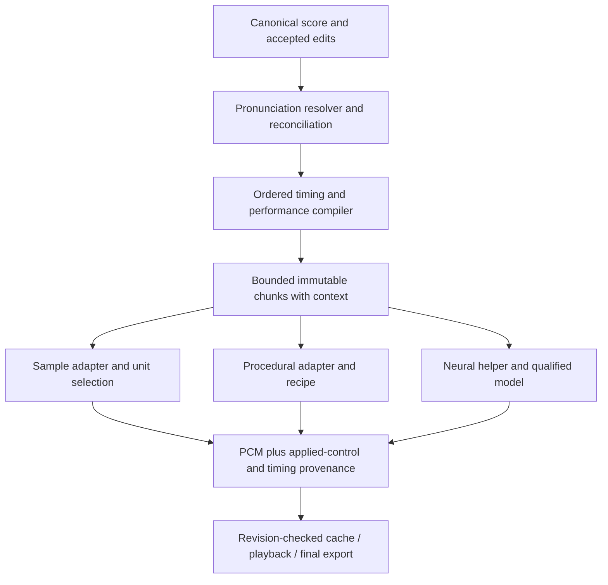
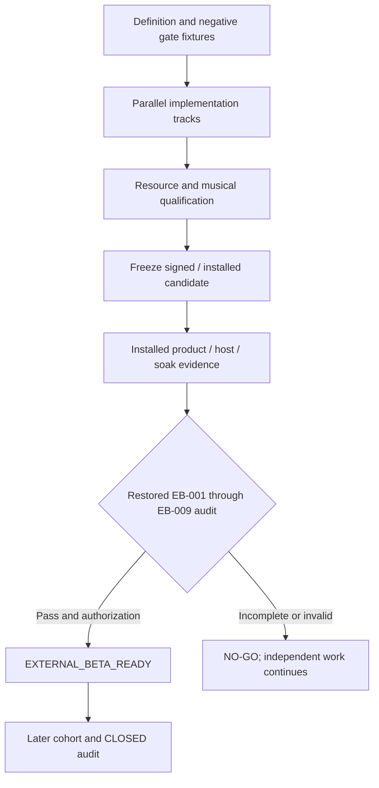

# SEAM Full-Scope Beta GO Implementation - Plan

This is the execution decomposition of the [full-scope report](../../VIRTUAL_SINGER_FEASIBILITY_AND_CODE_ROADMAP_2026-09-05.md). The report remains the product authority. This plan owns implementation ordering, file ownership, tests, and handoffs. Product Contract unchanged: all R1–R20, V01–V18, report KTD1–KTD8, scope interpretations, and acceptance conditions are adopted without reduction.

Paths in code spans are relative to the repository root. `New` marks proposed files. U-IDs are local to this plan; they do not renumber the older External Beta, production-readiness, or creator-plan units. A reference to the older U60 always includes its production-plan context.

---

## Goal Capsule

- **Objective:** creators can make and edit an original voice, turn it into reusable singer resources, and finish expressive songs in the supported standalone and DAW workflows.
- **Means:** extend the existing C++ domain/editor/production/runtime with the shared performance contract, procedural Voice Designer, qualified classical/neural backends, and full-product release audit.
- **Authority:** user direction, then the pinned report's Product Contract and Definition of Done, then this plan's technical decisions and units. No unit can waive a report requirement.
- **Completion:** all 48 implementation units and the Verification Contract must complete; the exact candidate must pass the amended `EXTERNAL_BETA_READY` audit. A prototype, corpus pilot, code test, or model trial is not Beta GO.
- **Execution boundary:** preserve the dirty development work; do not restart or discard the production-plan U60 changes. Work in reviewable units with one owner per shared file. Track execution evidence outside this decision document.
- **Stop condition:** stop release promotion on missing or invalid evidence, not all engineering work. Continue independent units when a source, model, reviewer, machine, or credential is unavailable. Escalate only decisions requiring new authority or a change to the settled scope.
- **Tail ownership:** implementers own code and runtime proof; producers own source/resource delivery; independent musicians and language reviewers own acceptance judgments; release operators own signing, installed verification, archive restoration, and authorized GO.

---

## Product Contract

### Summary

Deliver the complete original-virtual-singer product described in report revision 2. The implementation covers synth-style voice sculpting, real and generated source production, expressive classical/neural singing, Japanese/English/Korean workflows, score exchange, all required host surfaces, character performance, and verified delivery.

### Problem Frame

The existing code has substantial editor, sample-rendering, persistence, production and release infrastructure. Musical intent is not consistently converted into sound, production tooling cannot yet finish all required resource workflows, and the old Beta gate does not prove the new product scope. The work must connect these systems rather than add isolated controls, fixtures, or PASS metadata.

### Key Decision

**Complete the full scope before Beta GO** (session-settled: user-directed — chosen over a reduced Japanese-only classical Beta: the owner requires the whole report before the product may be called Beta GO). Governs R1–R20. Report-defined intermediate stages remain useful for development, but they are not alternate release boundaries.

### Requirements

The exact normative text, qualifications, and acceptance evidence for R1–R20 are incorporated from the pinned report's Product Contract. The following is a traceability index, not a substitute specification. A changed origin digest requires a deliberate plan reconciliation; it must not silently change an in-flight release contract.

**Musical performance and resources**

| ID | Required outcome, abbreviated | Primary implementation units |
|---|---|---|
| R1 | Correct timing, syllables, articulation, and complete melody | U3–U7, U23 |
| R2 | All persisted and audible expressions in report section 7 | U3, U6, U8, U17, U25, U38–U40 |
| R3 | Synth-style original female Voice Designer without a supplied recording | U18–U22, U42, U43, U47 |
| R4 | Real recording/import and computer-generation production routes | U9–U14, U21, U22, U42 |
| R5 | Complete versioned, reproducible bank production and installation | U9–U14, U21, U42 |
| R6 | Complete coverage, reviewed range, distinct styles and paired blending | U10, U15–U20, U42, U43 |
| R7 | Actual Japanese, English and Korean pronunciation/resources | U4, U24, U26–U28, U35, U36, U42 |
| R8 | Dependable classical rendering and truthful renderer capabilities | U1, U7, U8, U15–U17, U43 |
| R9 | Qualified original neural singer deployed on both platforms | U7, U35–U37, U42, U47 |
| R10 | Editable automatic performance, alternate takes and harmonies | U3, U25, U38–U40, U43 |

**Creator experience and release**

| ID | Required outcome, abbreviated | Primary implementation units |
|---|---|---|
| R11 | Complete accessible native editing and readable layout | U23–U28, U32, U41, U47 |
| R12 | Safe native USTX and SMF exchange | U29–U32 |
| R13 | Correct standalone/CLAP/VST3/AUv2 and nine host tuples | U25, U32–U34, U39, U47 |
| R14 | Useful singer identity and synchronized character performance | U25, U41, U42, U47 |
| R15 | Bounded, responsive, recoverable and explainable execution | U3–U8, U11–U15, U18–U22, U34, U37–U40, U44 |
| R16 | Fixed-corpus, acoustic, listener and creator proof | U1, U2, U36, U42, U43, U47 |
| R17 | Exact installed release and required U60/support completion | U44, U47, U48 |
| R18 | Full-product machine gate cannot be bypassed | U2, U45, U46, U48 |
| R19 | Applicable source/resource/model/character rights and provenance | U2, U9, U12–U14, U35, U36, U41, U42, U44–U48 |
| R20 | Connected UI/batch/source-to-bank-to-song lifecycle | U9–U14, U21, U22, U25, U32, U42, U47 |

### Actors and primary flows

- A1. Creator: enters or imports a score, tunes the singer, saves/reopens work and exports a song.
- A2. Voice producer: designs or records material, edits/reviews it, publishes a resource candidate and proves installation.
- A3. Independent evaluator: performs language, listening, usability and producer acceptance without self-certifying implementation.
- A4. Release operator: freezes identity, produces signed descendants, restores evidence and authorizes release through existing roles.

These local actor labels describe responsibilities, not replacements for the repository's existing release-role identifiers.

- F1. Voice creation: draft recipe or authorized recording → immutable take → editing/QC → independent review → versioned package → installation → unseen lyric. Covers R3–R6, R19, R20.
- F2. Song creation: native score import/edit → resolved pronunciation → expression/timing edits → preview → save/recovery → final audio and score exchange. Covers R1, R2, R7–R13, R15.
- F3. Automatic performance: propose a take → compare → accept unlocked channels/ranges → manual correction → partial regeneration without losing intent. Covers R2, R9, R10.
- F4. Release: complete capabilities → exact signed-installed verification → restored full-product audit → READY → later external cohort → CLOSED. Covers R16–R19.

### Acceptance examples

- AE1. A generated female voice sings an unfamiliar phrase after recipe save, bank generation, manual unit editing, approval and installation. Changing the draft recipe does not alter the installed bank or an old song. Covers F1 / R3, R5, R20.
- AE2. Inserting a phoneme through a pronunciation correction cannot silently attach an old timing lock to a different sound. Uncertain matches remain unresolved and undo restores the prior state. Covers F2 / R1, R7, R15.
- AE3. Regenerating a manually tuned phrase returns a proposal; accepting it preserves locked channels, rejects stale ownership revisions and does not add automatic and manual vibrato twice. Covers F3 / R2, R10.
- AE4. A host tempo change silences only invalidated Pending vocal ranges in Follow Host mode. A final bounce cannot succeed with old-tempo or missing required vocals. Covers F2 / R13, R15.
- AE5. Eight old Beta PASS rows with no qualified neural model or Voice Designer fail the new audit. READY alone cannot satisfy CLOSED or PUBLIC_ACTIVE. Covers F4 / R9, R18.

### Scope boundaries and authority amendments

No report capability is deferred beyond GO. Japanese-first is implementation order only. The release may use language-specific resources and backend-specific capability matrices exactly as the report permits; a capability cannot be marked unsupported everywhere.

The report does not require every cited vendor, universal model compatibility, proprietary voice copying, or an unlimited animation system. Those remain outside this execution scope. Specific DSP/model/dictionary choices are qualification outputs of named units, not excuses to delete their required outcomes.

The earlier [creator plan](2026-09-01-0303-feat-creator-workflow-parity-plan.md) supplies reusable schema, typed-dynamics, style, parser, lifecycle, inspector and accessibility detail. Its Japanese-only scope-ratification authority, MIDI deferral, preservation of defective duplication/slur behavior, restricted expression-selector scope, and prohibition on changing External Beta validators are superseded. Its historical studies remain NOT_RUN unless actually executed.

The [production-readiness plan](2026-08-30-2246-feat-production-readiness-completion-plan.md) still owns the unfinished U60 acceptance and existing release safety work. New character resources are not permission to ship old demo assets. Beta GO does not require completing its later external-cohort/public-activation events before that cohort can begin.

---

## Planning Contract

### Baseline and existing patterns

Baseline HEAD is pinned in frontmatter on `codex/production-readiness-completion`, with existing uncommitted U60 source, tests and support documents. The report's prior build failure and test counts are dated evidence, not tests performed while writing this plan. U1 must establish a fresh implementation baseline.

Use existing `core::Result`, `ICommand::apply/revert`, `CommandImpact`, immutable render snapshots, request-ID publication guards, content-addressed assets, journaled generations, package verification and installer services. The native test harnesses use `runAll()` rather than an invented test-filter flag; add focused CMake targets for new boundaries. `docs/solutions/` contains only its placeholder, so no captured solution articles override the inspected source.

### Key Technical Decisions

KTD1–KTD8 adopt the report's same-numbered decisions. The following execution bindings explain where they land; they do not amend their behavior.

- KTD1. **Compile pronunciation/performance before processing chunks.** U4–U7 create bounded symbolic/evaluable musical data and dependency-complete chunk requests. Sample selection is a consumer, not the owner of melody. Governs R1, R8, R9, R15.
- KTD2. **Persist recipes and bake immutable editable takes.** U18–U22 connect first-party procedural generation to the existing production repository and package lifecycle. Audition success is not approval. Governs R3, R5, R20.
- KTD3. **Separate origin, blob, take and runtime resource.** U9/U10 give distinct source bindings and assignment identities; U7/U14 introduce typed Sample/Procedural/Neural resource references. Equal bytes may have different ownership/provenance. Governs R4, R9, R19.
- KTD4. **Qualify native neural inference on CPU for both targets.** U35/U36 own model production; U37 owns deployment and a bounded helper-process boundary. Contract fixtures unblock adapter work while actual model qualification proceeds. Governs R9, R15.
- KTD5. **Make EB-009 part of the existing evaluator.** U2 defines its registry and blocks incomplete candidates; U45/U46 add semantic evidence evaluation and audit-bound transitions. Do not invent another release-state hierarchy. Governs R17, R18.
- KTD6. **Version independent contracts and invalidate stale work.** U3 owns one coordinated musical-schema upgrade, U9/U10 the production-schema migration, U18 recipe schema, U14 resource manifests, and U2 evidence versions. Preserve old files/history; never relabel them as new acceptance. Governs R2, R5, R15, R18.
- KTD7. **Preserve report-defined manual ownership.** U3 stores channel/range ownership; U38 accepts generated proposals transactionally; U25/U40 expose the distinction. Manual vibrato excludes neural F0 in its owned note as specified by the report. Governs R2, R10, R15.
- KTD8. **Separate timing authority and final-audio readiness.** U34 implements Fixed Audio and Follow Host modes, Pending/Failed states, captured offline ranges and final preparation. An instantaneous BPM is not a complete tempo map. Governs R13, R15.
- KTD9. **Use a controlled process for model execution.** Package a first-party neural helper, not bank-supplied code. Use a versioned length-prefixed local protocol with bounded JSON request/result metadata and bounded PCM payloads; send bounded logs on a separate drained channel. Validate sizes before allocation, bind request IDs, and support cancellation plus a killable deadline. Each installed surface resolves its helper through a versioned package-manifest entry anchored to the loaded SEAM module's bundle or installed sidecar, never PATH, the working directory, or the DAW executable. Bind the helper build, protocol and runtime dependency closure to that surface's release identity. No inference or IPC wait occurs on the realtime callback. This is a crash/resource boundary, not a claim of an OS security sandbox; model/path/operator validation remains mandatory. Governs R9, R15, R19.
- KTD10. **Single-writer publication across UI and CLI.** U11 uses an interprocess writer lock and expected-generation/digest comparison before committing. U21 generation workers stage results; only the canonical repository mutation path can publish them. Governs R5, R15, R20.

### High-Level Technical Design



```mermaid
sequenceDiagram
  participant UI as Studio or CLI
  participant Job as Generation worker
  participant Repo as Canonical repository writer
  UI->>Job: Immutable recipe, assignments and expected generation
  Job-->>UI: Progress or terminal error
  Job->>Repo: Staged outputs with exact take and parent identities
  Repo->>Repo: Lock, compare current generation, verify bytes
  alt Current and valid
    Repo-->>UI: Unapproved candidate takes
  else Stale, cancelled or invalid
    Repo-->>UI: Explicit conflict or failure; active data unchanged
  end
  UI->>Repo: Review and select exact revisions
  Repo-->>UI: Atomic versioned candidate publication
```



### Delivery waves and ownership

| Wave | Units | Observable checkpoint, never an alternate Beta |
|---|---|---|
| A. Startable foundations | U1–U8; define U2 matrix early | Current build baseline and correct phrase semantics |
| B. Source safety and voice construction | U9–U22, with U15–U17 overlapping | Real/generated material safely reaches an editable bank |
| C. Creator and host workflows | U23–U34 | Native tuning, languages, score exchange and predictable transport |
| D. Model and performance | U35–U41 | Qualified model path, advanced expressions, variation and character |
| E. Product resources and acceptance preparation | U42–U44 | Actual resource candidates, independent quality results, completed U60 |
| F. Final enforcement and release | U45–U48; gate code may start earlier | Exact installed full-scope audit and authorized GO |

Dependencies in unit bodies, not wave order, determine what can run. Start U9, U18, U23 and U35 as soon as their interfaces/data permit; do not wait for all earlier-numbered units. U2 and U45 separate defining/testing an audit from possessing final PASS evidence. U35 and U37 can run with contract fixtures and pilot data; U36 supplies the qualified model they join on for final acceptance.

Use at most three implementation tracks at once: musical engine, producer/designer, and creator/host. Model/data production and external acceptance have named human/resource owners, not anonymous background prerequisites. Serialize edits to `project_json.cpp`, CMake, production model/codecs, `file_io.*`, native controller/scene/semantics and release-evidence owners. Integration merges occur after focused verification; no worker reverts another worker's or the user's edits.

### Experiment and resource decisions

The starting procedural method is a bounded source–filter design; the initial neural family to qualify is OpenVPI DiffSinger with native ONNX export. Neither choice guarantees quality. U19/U20 and U35/U36 must keep comparison results and choose another compatible implementation if the selected method fails the fixed acceptance target. A method change may not weaken R3/R9.

Select dictionary/model/dependency revisions through the existing third-party intake process and record exact hashes before evaluating final assets. [KlattGrid](https://www.fon.hum.uva.nl/praat/manual/KlattGrid.html), [DiffSinger workflow](https://github.com/openvpi/DiffSinger/blob/main/docs/GettingStarted.md), and [ONNX Runtime C++](https://onnxruntime.ai/docs/get-started/with-cpp.html) ground those integration boundaries; they do not provide a licensed SEAM singer or measured SEAM latency.

At U2 freeze workload definitions, musical criteria, reference-machine profiles and the resource/backend/language/capability matrix. Numeric model/generation budgets and source volume that require measurements are explicit qualification outputs, with owners U19/U20/U35/U36. Final acceptance cannot start with blank criteria or retroactively relaxed thresholds. Missing signing access, hardware, lawful sources or reviewers blocks the affected acceptance, not unrelated source development.

---

## Implementation Units

### Unit index

This table is a navigation projection; unit bodies own dependencies and changes. Tests and additional files are listed in each body.

| Unit | Title | Primary files or module | Depends on |
|---|---|---|---|
| U1 | Reconcile baseline | `CMakeLists.txt`, `libs/seam-voicebank/src/wav.cpp` | None |
| U2 | Full-scope authority and matrix | `docs/product/`, `tools/external_beta/release_gate.py` | U1 |
| U3 | Musical vocabulary and migration | `libs/seam-domain/`, `libs/seam-formats/` | U2 |
| U4 | Pronunciation identity and reconciliation | `libs/seam-phonemizer/` | U3 |
| U5 | Ordered phoneme timing | `libs/seam-synthesis/src/timing_solver.cpp` | U4 |
| U6 | Complete performance compiler | `libs/seam-synthesis/` | U3, U5 |
| U7 | Context-complete chunks and resources | `libs/seam-rendering/` | U4, U6 |
| U8 | Capabilities, Raw and cache provenance | `libs/seam-synthesis/`, `libs/seam-rendering/` | U7 |
| U9 | Draft production and per-source provenance | `libs/seam-voicebank-production/` | U2, U3 |
| U10 | Style-aware inventory identity | `tools/voicebank_script_generator/` | U9 |
| U11 | Canonical generation-safe writes | `libs/seam-voicebank-production/src/repository.cpp` | U9, U10 |
| U12 | Inspection and applicable QC | `libs/seam-voicebank/src/validator.cpp` | U10, U11 |
| U13 | Reviews, retakes and edit ownership | `libs/seam-voicebank-production/src/repository_operations.cpp` | U11, U12 |
| U14 | Actual candidate publication | `libs/seam-voicebank-production/src/repository_export.cpp` | U2, U7, U13 |
| U15 | Acoustic analysis and conditioning | `libs/seam-voicebank/`, production `operations.cpp` | U5, U12 |
| U16 | Qualified classical processing | `libs/seam-synthesis/` | U8, U15 |
| U17 | Contextual selection and style blend | `libs/seam-synthesis/src/unit_selection.cpp` | U3, U10, U15, U16 |
| U18 | Voice recipe persistence | New `libs/seam-voice-design/` | U3, U9 |
| U19 | Stable phonation and vocal tract | New `libs/seam-voice-design/` | U6, U15, U18 |
| U20 | Procedural articulation and baking | New `libs/seam-voice-design/` | U4, U7, U19 |
| U21 | Resumable generation and CLI | Producer repository and voicebank CLI | U13, U18, U20 |
| U22 | Native Designer and real input | Native Studio and recording adapters | U14, U21 |
| U23 | Musical editing commands | Piano roll, commands and tempo maps | U3, U4, U6 |
| U24 | Lyric productivity and hints | Lyric commands, IME and native menus | U4, U23 |
| U25 | Expression and singer inspector | Native controller/scene/semantics | U8, U10, U23, U24 |
| U26 | Japanese reading and context | Japanese phonemizer and dictionaries | U4 |
| U27 | English pronunciation | New English phonemizer | U4 |
| U28 | Korean pronunciation | New Korean phonemizer | U4 |
| U29 | Safe interchange boundary | New `libs/seam-interchange/` | U1, U3 |
| U30 | USTX codec | New `libs/seam-interchange/` | U29 |
| U31 | SMF codec | New `libs/seam-interchange/` | U23, U29 |
| U32 | Native conversion lifecycle | Authoring runtime, native menus/dialogs | U24, U25, U30, U31 |
| U33 | Correct live expression | CLAP adapter and `phase12c` engine | U8, U16 |
| U34 | Host authority and offline preparation | CLAP timeline/runtime/coordinator | U7, U8, U23, U31, U33 |
| U35 | Neural dataset and training pipeline | New `tools/voice_model_training/` | U4, U9, U12, U13, U15 |
| U36 | Model qualification and export | Model-production manifests and assets | U2, U35 |
| U37 | Bounded native neural deployment | New neural adapter/helper | U2, U7, U8 |
| U38 | Automatic performance ownership | Application commands and neural proposals | U3, U6, U25, U36, U37 |
| U39 | Advanced expression algorithms | Synthesis controls and backend adapters | U16, U17, U19, U36, U37 |
| U40 | Takes, harmonies and native workflow | Application commands and inspector | U25, U38, U39 |
| U41 | Character performance | Character/identity/native presentation | U7, U25 |
| U42 | Production singer resource set | Content manifests and production dossiers | U14, U17, U20–U22, U26–U28, U36, U37, U39, U41 |
| U43 | Musical and creator qualification | Corpus tooling and private evidence | U2, U32, U34, U40, U42 |
| U44 | Finish preserved production U60 | Existing dirty support/crash work | U1, U3, U9, U18, U37 |
| U45 | Typed full-product semantic audit | New full-product validator and schemas | U2, U14, U18 |
| U46 | Restored audit and promotion integrity | Beta/public audit and operations | U45 |
| U47 | Signed installed platform/host acceptance | Packaging and existing evidence scripts | U32–U34, U40–U44, U46 |
| U48 | Final candidate audit and GO | Existing release audit/operations | U1–U47 |

### U1. Reconcile the current implementation baseline

**Goal:** give subsequent units a reproducible starting point without discarding unfinished work. **Requirements:** R8, R15, R17; report V01/V14. **Dependencies:** none.

**Files:** existing `CMakeLists.txt`, `CMakePresets.json`, `libs/seam-voicebank/src/wav.cpp`, `cmake/SeamBuildVersion.hpp.in`; existing build/test owners and production-plan U60 diff. New `tests/singing_quality/test_corpus_contract.py` and focused CMake registration.

**Approach:** inventory the current diff and preserve its provenance before integration. Reproduce and repair the reported strict-warning failures without disabling warnings. Establish focused test executables, a tiny authorized acoustic baseline and recorded compiler/configuration identity. Do not attribute older test counts to this build.

**Test scenarios:**

1. Development build succeeds with warnings-as-errors; a real warning remains a failure.
2. A baseline corpus with a missing or wrong-hash asset fails before rendering.
3. Existing U60 tests/edits remain present; unrelated repository changes are untouched.

**Verification:** another developer can reproduce the baseline and identify its remaining defects. Baseline audio is diagnostic, not musical approval.

### U2. Register full-scope authority and acceptance matrices

**Goal:** prevent reduced-scope readiness and define what every implementation must prove. **Requirements:** R1–R20; report V01/V18. **Dependencies:** U1.

**Files:** existing `docs/product/external-beta-acceptance.json`, `docs/product/EXTERNAL_BETA_ACCEPTANCE.md`, `docs/product/creator-beta/CREATOR_SCOPE_RATIFICATION.md`, `tools/external_beta/release_gate.py`, `tests/external_beta/test_release_gate.py`; new `docs/product/full-product-beta-contract.json`, `docs/product/full-product-beta-evidence.schema.json` and `tests/external_beta/test_full_product_gate.py`.

**Approach:** create the exact R1–R20 child-case registry, scope digest, capability matrix and evaluation-profile ownership. Add EB-009 to JSON and executable requirement ownership; until semantic validation exists, it fails closed. Record the old creator/production scope amendments once. Preserve historical study and release records instead of changing their outcomes.

**Test scenarios:**

1. A legacy eight-row PASS candidate cannot become full-scope READY.
2. Missing, duplicate, unknown or deferred requirement cases fail coverage checks.
3. A changed referenced contract digest invalidates the candidate; a path-only reference is insufficient.

**Verification:** every R-ID has typed proof obligations, no final-acceptance criterion is silently optional, and incomplete criteria cannot yield GO.

### U3. Persist the complete musical vocabulary and edit ownership

**Goal:** establish one canonical model shared by editor, renderer, plugin state and generated takes. **Requirements:** R1, R2, R6, R10, R15; report V02–V05/V08/V13. **Dependencies:** U2.

**Files:** existing `libs/seam-domain/include/seam/domain/note.hpp`, `phoneme.hpp`, `project.hpp`, `render_controls.hpp`; `libs/seam-formats/include/seam/formats/project_json.hpp`, `libs/seam-formats/src/project_json.cpp`; new `libs/seam-domain/include/seam/domain/performance_intent.hpp`, `dynamics_automation.hpp`, `libs/seam-domain/src/dynamics_automation.cpp`. Tests: existing `tests/test_serialization.cpp`, `tests/test_command_impact.cpp`, `tests/test_project_lifecycle.cpp`; new `tests/test_performance_contracts.cpp`.

**Approach:** extend the creator plan's schema-8 vocabulary with pronunciation identity, accepted/proposed performance separation and report KTD7 ownership. Store explicit style/resource intent, vibrato and typed dynamics with zero-effect defaults. Coordinate one migration; exact-bank legacy style behavior requires actual bank identity, not whichever bank happens to be present.

**Test scenarios:**

1. Genuine schemas 1–7 migrate without data loss or invented measurements; unavailable legacy style stays unresolved.
2. Coupled ownership/hint/style/expression edits undo and round-trip together through project and plugin state.
3. Non-finite values, invalid ranges and future unsupported schemas fail without overwriting the original file.

**Verification:** downstream units consume defined intent and units. Correctness fixes may change rerendered audio; algorithm identity and cache migration make that explicit.

### U4. Resolve pronunciation and reconcile dependent edits

**Goal:** give editor and renderer the same revisioned phoneme sequence. **Requirements:** R1, R7, R11, R15; report V02/V10. **Dependencies:** U3.

**Files:** existing `libs/seam-phonemizer/include/seam/phonemizer/phonemizer.hpp`, `libs/seam-authoring-runtime/src/technical_edit_controller.cpp`, `libs/seam-application/src/lyric_commands.cpp`; new resolver/reconciliation headers and `libs/seam-phonemizer/src/pronunciation_resolver.cpp`, `override_reconciliation.cpp`. Tests: `tests/test_phonemizer.cpp`, `tests/test_technical_edit_controller.cpp`.

**Approach:** resolve dictionary/language identity, syllable ownership and token identities before rendering. Match old edits only to verified unchanged token correspondences; retain ambiguous edits as unresolved user data. Start with the existing Japanese adapter so later language packages do not block interface development.

**Test scenarios:**

1. Inserting a phoneme cannot transfer an ordinal-based timing lock to another sound. Covers AE2.
2. Missing dictionary/resource and empty lyrics produce explicit bounded outcomes.
3. Undo restores the old pronunciation and all dependent edits; renderer and technical lanes show the same tokens.

**Verification:** no consumer independently re-phonemizes with conflicting identity or silently discards unresolved user work.

### U5. Make ordered phoneme timing authoritative

**Goal:** convert score and timing edits into ordered target spans. **Requirements:** R1; report V02. **Dependencies:** U4.

**Files:** existing `libs/seam-synthesis/include/seam/synthesis/timing_solver.hpp`, `libs/seam-synthesis/src/timing_solver.cpp`; new `libs/seam-synthesis/src/phoneme_timing_plan.cpp` and public header. Tests: new `tests/test_phoneme_timing.cpp`, existing `tests/test_synthesis.cpp`.

**Approach:** allocate syllable/phoneme timing from tempo-resolved note anchors and explicit offsets. Keep source markers separate from target timing. Define nucleus anchors, permissible coarticulation and preutterance/release clipping under the fixed contract.

**Test scenarios:**

1. `かき` in one note produces sequential nuclei instead of two coincident CV anchors.
2. A 30 ms edit moves deterministic placement by the corresponding frames within one sample of rounding.
3. Impossible short-note combinations return actionable conflicts without negative or unbounded spans.

**Verification:** timing edits change the intended acoustic placement and undo restores it through the real pipeline.

### U6. Compile complete F0, articulation and expression

**Goal:** make the whole melody and accepted musical intent independent of selected sample units. **Requirements:** R1, R2, R15; report V03/V04. **Dependencies:** U3, U5.

**Files:** new `libs/seam-synthesis/include/seam/synthesis/performance_compiler.hpp`, `libs/seam-synthesis/src/performance_compiler.cpp`; existing `pitch_curve.cpp`, `phrase_renderer.cpp` in that source directory. Tests: new `tests/test_performance_compiler.cpp`, existing synthesis tests.

**Approach:** compile bounded absolute-time evaluators for F0/voicing, dynamics, articulation and modulation phase. Apply canonical base/offset/vibrato rules, syllable continuation and staccato release. Do not expand an entire song into per-sample arrays for each worker.

**Test scenarios:**

1. One VCV/VV unit spanning C4→G4 follows both notes with no manual pitch curve.
2. Legato retains the vowel; repeated syllables reattack; staccato changes the gate and release.
3. Tempo changes and block subdivision preserve anchors/vibrato phase; unity dynamics alone leaves audio unchanged.

**Verification:** the compiler is the shared source of musical truth for all three rendering families.

### U7. Freeze context-complete chunks and typed resources

**Goal:** separate musical context from processing segmentation and sample-specific resources. **Requirements:** R1, R8, R9, R15; report V03/V12/V15. **Dependencies:** U4, U6.

**Files:** existing `libs/seam-rendering/src/phrase_segmenter.cpp`, `render_snapshot.cpp`, `render_pipeline.cpp`, `libs/seam-rendering/include/seam/rendering/render_snapshot.hpp`; new `libs/seam-synthesis/include/seam/synthesis/phrase_backend.hpp`, `singer_resource.hpp`. Tests: `tests/test_rendering.cpp`, `tests/test_stabilization.cpp`.

**Approach:** resolve pronunciation/performance first, then form owned output chunks with bounded neighbor context/lookahead. Use distinct Sample/Procedural/Neural resource variants; frozen WAV/unit plans live only in Sample. Hash all consumed context and resource identities, including algorithm revisions.

**Test scenarios:**

1. Splitting inside a melisma or language-context sequence cannot change pronunciation or phase.
2. Relevant neighbor edits invalidate dependent chunks; unrelated phrases retain valid cache entries.
3. A mismatched resource variant is rejected; submitted input bytes cannot change during work.

**Verification:** adapters can be built independently against a stable phrase request/result contract without a generic plugin registry.

### U8. Make capabilities, Raw and cache provenance truthful

**Goal:** prevent successful audio output from silently losing required expression. **Requirements:** R2, R8, R15; report V05. **Dependencies:** U7.

**Files:** existing `libs/seam-synthesis/src/renderer_dispatcher.cpp`, `raw_renderer.cpp`, dispatcher header; `libs/seam-rendering/src/pcm_cache.cpp`, `region_renderer.cpp`; `cmake/SeamBuildVersion.hpp.in`. Tests: new `tests/test_renderer_capabilities.cpp`, existing rendering/coordinator tests.

**Approach:** validate requested controls before work. Implement Raw trajectory evaluation and truthful supported-control behavior; permit fallback only when it preserves the required performance. Store actual backend, applied controls, fallback reasons and timing provenance beside cached PCM; version incompatible cache formats.

**Test scenarios:**

1. Pitch automation survives any permitted fallback; unsupported required controls fail clearly.
2. Cold and cached playback report the same fallback/applied-control provenance.
3. Corrupt or old cache records are rejected safely; changed algorithm/control inputs invalidate identity.

**Verification:** the UI/exporter cannot mistake degraded or stale audio for the requested final performance.

### U9. Persist drafts and per-source production provenance

**Goal:** allow honest experimentation without fabricated qualification. **Requirements:** R4, R5, R19, R20; report V07/V16. **Dependencies:** U2, U3.

**Files:** existing `libs/seam-voicebank-production/include/seam/voicebank_production/project.hpp`, `src/project.cpp`, `project_codec_encode.cpp`, `project_codec_decode.cpp`, `project_codec_decode_records.cpp`, `project_codec_validation.cpp`, `repository_verify.cpp`; `tools/external_beta/_production_workspace.py`, `_source_admission.py`. Tests: `tests/test_voicebank_production_project.cpp`, `tests/production/test_voice_source_admission.py`.

**Approach:** add Draft/Experimental/Qualified lifecycle and per-source bindings distinct from blob hashes. Structural persistence does not require listening PASS. Execution and qualification apply source-kind-appropriate permissions. Store recipe/model/source dependencies and preserve legacy project generations through migration.

**Test scenarios:**

1. An empty or unqualified draft saves/reopens without inventing coverage/listening approval.
2. Identical audio bytes from different authorized sources retain separate provenance bindings.
3. A candidate with incomplete applicable source/training/redistribution evidence cannot qualify.

**Verification:** source ownership is inspectable per take and survives mixed-source workflows without forcing banks to mix sources.

### U10. Make assignment identity language- and style-aware

**Goal:** keep distinct required styles/languages from colliding in production. **Requirements:** R4–R7, R20; report V07/V08/V16. **Dependencies:** U9.

**Files:** production model/codecs; existing `tools/voicebank_script_generator/profile.py`, `inventory.py`, external production workspace/session/candidate validators; `libs/seam-native-ui/src/voicebank_studio_production_project.cpp`, `libs/seam-voicebank/src/coverage.cpp`. Tests: script-generator, coverage and Beta-production suites.

**Approach:** assign stable IDs containing inventory/language, style, coverage and applicable pitch. Separate planned prompts from actual takes and explicit paired-style relationships. Migrate old assignments to their documented legacy language/style rather than assigning a new arbitrary default.

**Test scenarios:**

1. Two styles of the same phoneme/pitch remain separately selectable, editable and reviewable.
2. Reordered inventory rows keep stable identities; identical phone labels in different languages do not collide.
3. Unvoiced/pause pitch applicability and retake IDs are accepted by all producer validators consistently.

**Verification:** complete-coverage results are qualified per language/style, not a misleading project-wide row count.

### U11. Serialize production writes and name edit ownership

**Goal:** make concurrent UI/CLI/generation commits safe. **Requirements:** R5, R15, R20; report V07/V16. **Dependencies:** U9, U10.

**Files:** existing producer `repository.hpp`, `repository.cpp`, `repository_operations.cpp`, import/export callers; new `libs/seam-core/include/seam/core/file_lock.hpp`, `libs/seam-core/src/file_lock.cpp` unless a verified equivalent already exists. Tests: production-project tests; new `tests/helpers/production_writer_probe.cpp`.

**Approach:** acquire an interprocess lock, compare expected durable generation/project digest, and commit using the existing journal/recovery protocol. Require take ID, parent revision and input digest for operations. Hash deduplication is storage reuse, never ownership inference. Coordinate shared core files with U60 rather than replacing them.

**Test scenarios:**

1. Two writers starting at one generation cannot both publish; the stale one receives Conflict.
2. Editing the second of two takes sharing bytes changes only that take.
3. Crash at journal/generation/pointer boundaries recovers the last valid state and releases writer ownership.

**Verification:** stale objects or workers cannot become the newest project merely by choosing a larger generation number.

### U12. Bind applicable QC to the imported bytes

**Goal:** prevent incorrect inspection reuse and voiced-only validation of noise/pause units. **Requirements:** R4, R5, R15, R19; report V07/V16. **Dependencies:** U10, U11.

**Files:** existing `libs/seam-voicebank/include/seam/voicebank/validator.hpp`, `src/validator.cpp`; producer `asset_store.cpp`, `repository_import.cpp`; native Studio inspection/import code; external production quality/session/candidate validators. Tests: existing voicebank/production suites; new `tests/test_take_inspection.cpp`.

**Approach:** create an inspection receipt bound to assignment, exact digest and QC policy/version. Verify copied/stored bytes before committing. Define voiced, breath, closure and pause requirements with explicit inapplicable fields; format conversion never implies musical approval.

**Test scenarios:**

1. Inspect A/import B or replace A during import fails or requires reinspection.
2. Genuine breath/pause material uses its own policy; bad voiced pitch fails the voiced policy.
3. Null, empty, malformed and oversized audio yields bounded diagnostics without approval.

**Verification:** every admitted take has a valid current inspection of the material actually stored.

### U13. Implement retake and revision-bound review commands

**Goal:** finish review through supported actions and preserve manual work. **Requirements:** R4, R5, R19, R20; report V07/V16. **Dependencies:** U11, U12.

**Files:** existing producer `repository_operations.cpp`, `repository_import.cpp`, model/codecs; new `libs/seam-voicebank-production/src/repository_review.cpp`; existing Studio production edits and external session/retake validators. Tests: production-project/Beta-production suites.

**Approach:** add marker/acoustic review, approve/reject and candidate-selection commands. Bind reviews to audio, annotation, processing, source/recipe and policy revisions. Retakes create alternatives with supersedes lineage; changes invalidate only dependent review. Require reviewed marker remapping when duration changes.

**Test scenarios:**

1. Approval through supported APIs replaces test-only direct field mutation.
2. Audio/marker/source changes invalidate applicable approval while preserving immutable history.
3. Regenerating an approved edited take leaves the installed bank and old manual work intact. Covers AE1.

**Verification:** generation completion cannot approve itself, and each accepted candidate has traceable independent review.

### U14. Publish actual typed resource candidates atomically

**Goal:** turn an approved production snapshot into an installable resource. **Requirements:** R5, R9, R19, R20; report V07/V12/V16/V18. **Dependencies:** U2, U7, U13.

**Files:** existing producer `repository_export.cpp`; new `libs/seam-voicebank-production/src/repository_candidate.cpp`; existing voicebank manifest/content-identity codecs, `tools/external_beta/_production_candidate.py`, `_production_lock.py`, bank dossier/schema/validator; distribution `seambank.hpp` implementation and installer service. Tests: production, distribution, installer and bank-gate suites.

**Approach:** keep the old U57 template exporter honest and add a distinct builder from one immutable approved generation. Version the resource manifest to distinguish sample/recipe/model payloads and applicable languages/character/source evidence. Reuse package/signature/install services; do not force procedural resources into a fake contracted-singer profile.

**Test scenarios:**

1. Missing review, mixed generations, wrong hashes or incomplete style coverage prevents publication.
2. Cancellation or disk exhaustion leaves the previous candidate/installed version intact.
3. Sample candidates install/reopen/render; model/recipe contract fixtures exercise typed packaging without claiming musical qualification.

**Verification:** complete package identity includes every effective resource dependency; only a verified atomic candidate becomes visible.

### U15. Add versioned acoustic analysis and conditioning

**Goal:** supply reliable source mapping and production-quality sample conversion. **Requirements:** R5, R6, R8, R15; report V06/V07. **Dependencies:** U5, U12.

**Files:** existing voicebank `pitch.cpp`, `pitch_marks.cpp`, `voicebank.hpp`, `manifest_json.cpp`, `content_identity.cpp`; producer `operations.cpp`; new `libs/seam-voicebank/include/seam/voicebank/acoustic_analysis.hpp` and implementation. Tests: voicebank/synthesis tests; new `tests/test_audio_conditioning.cpp`.

**Approach:** store F0/confidence/voicing spans and internal source anchors bound to exact audio. Replace linear production resampling with measured band-limited processing and versioned provenance. Assisted alignment supplies proposals for review, not invented labels. Preserve raw audio and regenerate derivatives after algorithm changes.

**Test scenarios:**

1. Voiced-to-fricative material retains separate voicing states; marks never bridge unvoiced spans.
2. Downsampling rejects aliasing regressions on a fixed test signal and preserves declared length.
3. Replaced audio invalidates analysis; old manifests migrate without fabricated measurements or automatic approval.

**Verification:** renderers and producer QC consume the same versioned analysis contract.

### U16. Qualify voiced/unvoiced classical processing

**Goal:** improve actual singing quality rather than merely passing sine-wave smoke tests. **Requirements:** R6, R8, R16; report V06. **Dependencies:** U8, U15.

**Files:** existing synthesis `classic_psola.cpp`, `spectral_classic.cpp`, `stretch_renderer.cpp`, `seam_composer.cpp`; new focused quality targets under `tests/singing_quality/`; existing `tests/test_synthesis.cpp`, `tests/test_stabilization.cpp`.

**Approach:** retarget voiced attacks/releases and sustains to the compiled F0 while preserving unvoiced detail. Separate pitch and duration mapping. Compare a strengthened default renderer with the report's alternative analysis/synthesis trial, then qualify the selected method; do not require shipping every experimental algorithm.

**Test scenarios:**

1. Annotated CV/VC material transposes without source-pitched voiced edges.
2. Short/long vowels, breath/noise and pitch jumps retain intelligibility and correct duration.
3. Renderer failures preserve required intent or fail truthfully; discarded experiments cannot become hidden fallback paths.

**Verification:** fixed-corpus numerical and listening results support the declared default and every exposed mode's capability claims.

### U17. Select contextual units and render paired styles

**Goal:** make source choice and style blending audibly useful. **Requirements:** R2, R6, R8; report V08. **Dependencies:** U3, U10, U15, U16.

**Files:** existing `libs/seam-synthesis/include/seam/synthesis/unit_selection.hpp`, `src/unit_selection.cpp`, `phrase_renderer.cpp`; voicebank coverage/model and rendering snapshot consumers; new `tests/test_style_blending.cpp`, existing synthesis/rendering/coverage tests.

**Approach:** use bounded per-position candidate states so selection can score previous-unit acoustic joins, not only local candidate cost. Preserve hard style/coverage/forced-unit constraints. Freeze explicit style-pair identities and both source sets; render against the same performance before combining compatible styles. Persist selection/blend intent through U3's commands.

**Test scenarios:**

1. Competing candidates choose the lower-discontinuity sequence with deterministic ties and bounded state count.
2. Two style endpoints reproduce their selected styles; intermediate blends change timbre without unintended pitch changes.
3. Missing/incompatible pair or changed contributing bytes invalidates the request/cache with a clear diagnostic.

**Verification:** a producer can inspect the selection rationale and listeners accept the declared blend/range behavior.

### U18. Persist voice recipes and design-time capabilities

**Goal:** save a controllable voice definition independently of songs and approved banks. **Requirements:** R3, R5, R15, R19; report V15/V16. **Dependencies:** U3, U9.

**Files:** new `libs/seam-voice-design/include/seam/voice_design/voice_recipe.hpp`, `libs/seam-voice-design/src/voice_recipe.cpp`, recipe codec/schema and `tests/test_voice_design.cpp`; extend production recipe-reference serialization.

**Approach:** define bounded phonation, resonance, articulation/style-pose and modulation parameters with recipe/engine identity. Distinguish baked, regeneration-required and runtime controls. A Draft recipe is declarative data; it never grants arbitrary script execution or source permissions.

**Test scenarios:**

1. Recipe save/reopen preserves control values, styles, seed and version identity.
2. Invalid filter/source ranges, non-finite values and unsupported recipe versions fail safely.
3. Editing a draft recipe neither mutates song performance nor changes an installed bank version.

**Verification:** a stable recipe contract can be used by DSP, batch generation, native UI and provenance independently.

### U19. Synthesize stable phonation and vocal-tract resonances

**Goal:** create editable vowel/source timbre with pitch independent of resonance. **Requirements:** R3, R6, R15; report V15. **Dependencies:** U6, U15, U18.

**Files:** new `libs/seam-voice-design/src/phonation_source.cpp`, `vocal_tract.cpp`, corresponding internal interfaces and focused tests in `tests/test_voice_design.cpp`.

**Approach:** implement band-limited excitation, stable oral/nasal resonance controls, aspiration and smooth parameter interpolation. Consume compiled F0 rather than embedding a fixed note in the patch. Record audition results for initial vowel/style designs before generating a large inventory.

**Test scenarios:**

1. Changing tract resonance changes the vowel/timbre without changing intended F0.
2. Parameter extremes and rapid edits produce finite bounded output without unstable filters or clicks.
3. The same recipe/seed/qualified runtime reproduces the audition; cross-platform tolerances are measured separately.

**Verification:** users can hear distinct editable vowels and a coherent intended female character tone; oscillator tests alone do not certify that judgment.

### U20. Generate procedural articulation, previews and bake results

**Goal:** turn a voice patch into pronounceable phrases and production-ready candidate material. **Requirements:** R1, R3, R4, R6, R20; report V15. **Dependencies:** U4, U7, U19.

**Files:** new `libs/seam-voice-design/src/articulation_plan.cpp`, `procedural_renderer.cpp`, `tests/test_procedural_voice.cpp`; integrate the procedural resource variant with the phrase adapter.

**Approach:** produce ordered closures/bursts, aspiration/frication, vowel gestures and context transitions from resolved phonemes and compiled timing/F0. Return PCM with truthful internal anchors, diagnostics and recipe lineage. Unit baking is the same controlled rendering path with an explicit request; its output is unapproved material.

**Test scenarios:**

1. Reviewed CV/VC pairs are distinguishable; a generated vowel cannot satisfy arbitrary consonant labels by metadata alone.
2. Chunked and whole-phrase previews preserve pronunciation/modulation; all returned markers fit output bounds.
3. Empty/invalid/oversized requests and cancellation yield explicit terminal results without approval or partial active replacement.

**Verification:** an unseen phrase is intelligible within the declared inventory, and generated samples can enter U21 without a special safety bypass.

### U21. Expose resumable generation through producer commands and CLI

**Goal:** connect procedural output to durable producer operations. **Requirements:** R3–R5, R15, R19, R20; report V16. **Dependencies:** U13, U18, U20.

**Files:** new `libs/seam-voicebank-production/src/repository_generation.cpp`, `tests/test_voice_generation_workflow.cpp`; extend repository API/journal, `apps/seam-voicebank-cli/main.cpp`, `tools/external_beta/_production_cli.py`.

**Approach:** submit immutable assignment/recipe requests with job ID, expected generation, duration/style/pitch and resource budgets. Workers stage outputs; the canonical repository writer publishes only current results. Resumption verifies completed output identities. CLI and UI share these domain operations, not separate mutation engines.

**Test scenarios:**

1. Interrupted/resumed generation preserves valid partial work without duplicate takes or accidental approval.
2. Changed recipe, inventory, manual candidate or project generation makes old output stale instead of auto-assigning it.
3. Retry, cancellation and exhausted output budget keep the previous active state and expose the actual terminal outcome.

**Verification:** batch output can be inspected, edited and reviewed through the same lifecycle as recorded material.

### U22. Build native Voice Designer and genuine recording/import parity

**Goal:** complete a visible voice-sculpting and source-production workflow. **Requirements:** R3–R5, R11, R15, R20; report V16. **Dependencies:** U14, U21.

**Files:** new `libs/seam-native-ui/include/seam/native_ui/voice_designer_model.hpp`, `src/voice_designer_model.cpp`, `tests/test_voice_designer_workflow.cpp`; existing Studio controller/scene/production views, `apps/seam-voicebank-studio-native/main.cpp`, options adapters and `libs/seam-platform/src/recording_session.cpp`.

**Approach:** provide Create/Open Voice in Studio, a primary audition area and grouped voice/style controls, a generation/coverage queue and an advanced unit editor. Add explicit return-to-song/install actions after candidate publication. Connect sliders/envelopes, A/B previews, presets, candidate comparison, review and export to canonical commands. Device permission/disconnection must be visible; a silence fallback cannot report successful recording.

**Test scenarios:**

1. Create/save/reopen/generate/edit/regenerate/review/install/sing an unseen phrase through UI only. Covers AE1.
2. Complete the same lifecycle from genuine microphone/import material; denied/disconnected input stays actionable.
3. Keyboard/accessibility operation, narrow window, long names, cancelled jobs and recovery preserve focus and data.

**Verification:** both source routes work without manual JSON edits; a generator preview is never confused with a published bank.

### U23. Repair musical editing and add tempo/meter commands

**Goal:** ensure basic edits preserve the music. **Requirements:** R1, R11, R13, R15; report V09/V11. **Dependencies:** U3, U4, U6.

**Files:** existing `libs/seam-editor-ui/src/piano_roll_model.cpp`, application note commands, `libs/seam-domain/include/seam/time/tempo_map.hpp`, `meter_map.hpp`, native controller; new application `tempo_commands.hpp/.cpp`, native `tempo_meter_model.hpp/.cpp`, `tests/test_tempo_meter_commands.cpp`. Extend note-workflow/time/native tests.

**Approach:** apply one common translation to duplicated phrases and preserve syllable/owned-edit relationships with new identities. Repair slur disable/continuation semantics. Add transactional tempo/meter insert/update/remove with affected-render invalidation; use existing CommandImpact patterns.

**Test scenarios:**

1. Unequal-duration notes and rests retain relative timing after duplication and undo.
2. Tempo changes through a sustained note and event removal preserve correct musical/sample mappings.
3. Slur enable/disable, mixed selections and invalid tempo values have defined atomic outcomes.

**Verification:** a creator can change tempo and repeat musical sections without rhythm or pronunciation corruption.

### U24. Complete lyric, search and pronunciation-hint editing

**Goal:** make pronunciation correction and bulk editing practical. **Requirements:** R7, R11, R20; report V09/V10. **Dependencies:** U4, U23.

**Files:** existing application lyric commands, piano-roll/text-composition models, platform menus and native controller; new `libs/seam-editor-ui/include/seam/ui/note_search_model.hpp` and implementation. Tests: new `tests/test_creator_batch_edits.cpp`, existing note-workflow/native/IME tests.

**Approach:** reuse creator-plan U4's search, replace/distribute, normalization and reset behaviors where consistent with the report. Show a target preview and count/loss diagnostics before bulk application. Keep visible lyrics, reading hints and resolved phones distinct. IME composition commits/cancels before shortcuts mutate notes.

**Test scenarios:**

1. Correct pronunciation without rewriting displayed lyrics; ambiguous dependent edits remain unresolved. Covers AE2.
2. A 10,000-note bounded search/batch operation has one undo group and predictable cancellation.
3. IME composition, empty search, mismatched lyric counts and navigation cannot silently modify the wrong selection.

**Verification:** the native workflow supports ordinary input and targeted correction in each registered language.

### U25. Build expression lanes and a compact singer inspector

**Goal:** expose the canonical control model consistently across native surfaces. **Requirements:** R2, R6, R11, R14, R20; report V09. **Dependencies:** U8, U10, U23, U24.

**Files:** existing technical-edit controller, track inspector, native controller/scene/semantics/accessibility, CLAP input/accessibility adapters; creator-planned new `vibrato_model.hpp/.cpp`, `dynamics_lane_model.hpp/.cpp` under editor UI and `style_coverage_sheet.hpp/.cpp` under native UI. Tests: technical-edit/UI/native/accessibility/CLAP suites and new `tests/test_dynamics_lane_workflow.cpp`.

**Approach:** reuse one inspector and Style/Coverage sheet. Show active-note handles, mixed values, explicit Apply to Selection and separate score/target/generated/measured curves. All input modalities dispatch the same commands. Basic controls become audible now; typed advanced-control extension points are closed by U39/U40, not invented independently in this UI unit.

**Test scenarios:**

1. Pitch/vibrato/dynamics/timing edits audibly change preview and survive undo, reload and plugin state.
2. Overlapping notes can be selected without falsifying time geometry; long text remains accessible at narrow sizes.
3. Unsupported resource controls are explained, while required supported controls remain reachable by pointer, keyboard and accessibility APIs.

**Verification:** basic expressive editing is complete and later advanced controls reuse its established command/state patterns.

### U26. Complete Japanese reading and contextual pronunciation

**Goal:** deliver reviewed Japanese lyric-to-singing input rather than kana display alone. **Requirements:** R7, R11; report V10. **Dependencies:** U4.

**Files:** existing Japanese phonemizer and phone classification; new versioned Japanese dictionary/reading adapter in `libs/seam-phonemizer/`; dictionary/resource intake manifests. Tests: `tests/test_phonemizer.cpp`, reviewed Japanese fixtures under `tests/fixtures/pronunciation/` (new).

**Approach:** select a lawful bounded reading/dictionary component, pin its revision, and preserve explicit user hints. Implement normalization, continuation, geminate/nasal/context rules through the shared resolver. Keep lexical lookup separate from native-language qualification.

**Test scenarios:**

1. Kana/katakana and kanji-with-reading input produce reviewed expected phonemes without losing surface text.
2. Continuation, closures, nasals and breath classification remain correct across processing chunks.
3. Unknown reading/dictionary revision changes generate bounded diagnostics and reconcile old edits safely.

**Verification:** native-language reviewers accept the Japanese input cases and matching resource vocabulary.

### U27. Implement English pronunciation and resource vocabulary

**Goal:** provide real English singing support. **Requirements:** R7, R11; report V10. **Dependencies:** U4.

**Files:** new English phonemizer header and `libs/seam-phonemizer/src/english_phonemizer.cpp`, English dictionary adapter/manifest, `tests/test_english_phonemizer.cpp` and reviewed fixtures.

**Approach:** register a versioned English service through the common resolver. Resolve stress, clusters, syllable ownership, exceptions and explicit reading hints into the frozen inventory vocabulary. Missing required bank/model phones are diagnosed rather than substituted with Japanese output.

**Test scenarios:**

1. Reviewed stressed/unstressed vowels and consonant clusters map consistently across note distributions.
2. User overrides, unknown words and punctuation retain editable text and bounded diagnostics.
3. Dictionary/vocabulary changes reconcile locks and invalidate dependent performance/resource requests.

**Verification:** native-speaker-reviewed fixtures and the later R7 song/resource qualification prove actual English singing.

### U28. Implement Korean pronunciation and resource vocabulary

**Goal:** provide real Korean singing support. **Requirements:** R7, R11; report V10. **Dependencies:** U4.

**Files:** new Korean phonemizer header and `libs/seam-phonemizer/src/korean_phonemizer.cpp`, Korean dictionary/rule manifest, `tests/test_korean_phonemizer.cpp` and reviewed fixtures.

**Approach:** implement syllable decomposition and reviewed context-dependent pronunciation through the common resolver. Preserve explicit pronunciation hints, syllable/phoneme ownership and vocabulary identity for each resource.

**Test scenarios:**

1. Reviewed initial/medial/final consonant and cross-syllable context cases produce expected phones.
2. Long vowels/melisma and chunk subdivision preserve the same pronunciation and note melody.
3. Unsupported text or resource vocabulary fails visibly without silent fallback or lost user edits.

**Verification:** native-speaker-reviewed fixtures and the later R7 song/resource qualification prove actual Korean singing.

### U29. Establish the bounded interchange I/O and report boundary

**Goal:** parse external scores without mutating the current document or trusting file-declared sizes. **Requirements:** R12, R15; report V11. **Dependencies:** U1, U3.

**Files:** new `libs/seam-interchange/include/seam/interchange/conversion_report.hpp`, `interchange_limits.hpp` and implementations; existing core file-I/O APIs and CMake. Tests: new `tests/test_interchange_io.cpp`, existing stabilization/file-dialog contracts.

**Approach:** use held/validated input handles, byte/event/object budgets, bounded diagnostic amplification and a draft conversion result. Export stages a complete file before publication. Share this boundary between USTX and SMF; coordinate core changes with the existing U60 owner.

**Test scenarios:**

1. Oversized input and declared allocations exceeding budgets fail before allocation.
2. Symlink/reparse/parent replacement and changed input bytes cannot redirect a held import silently.
3. Interrupted output or destination conflict preserves the original file and current document.

**Verification:** codecs receive bounded immutable input and produce an inert draft plus a deterministic report.

### U30. Implement the native USTX subset

**Goal:** deliver production USTX exchange using the existing creator-plan contract. **Requirements:** R12; report V11. **Dependencies:** U29.

**Files:** new `libs/seam-interchange/include/seam/interchange/ustx_codec.hpp`, implementation, `docs/formats/USTX_INTERCHANGE_V1.md`, `tests/test_ustx_interchange.cpp`, fixtures; existing third-party manifest/notices/SBOM and dependency-closure inputs. Reference the existing study bridge without treating it as production code.

**Approach:** implement USTX 0.6–0.9 import and 0.9 export with the creator plan's bounded parser intake. Preserve supported tempo/meter/notes/lyrics/pitch/vibrato/dynamics/style mappings and enumerate losses. Singer/tool references are data and never executed. Pin rapidyaml/c4core through the repository intake if retaining that established parser choice.

**Test scenarios:**

1. Supported project versions import correctly and export/reimport the declared subset with deterministic losses.
2. Hostile YAML, aliases, scalar sizes, nesting and parser allocation pressure hit budgets without external resolution.
3. An exported file opens in the isolated pinned OpenUtau reference profile; unsupported data remains clearly reported.

**Verification:** actual external interoperability, not only a local codec round trip, proves the declared subset.

### U31. Implement bounded Standard MIDI File exchange

**Goal:** exchange DAW melodies and score timing through SMF. **Requirements:** R12, R13; report V11. **Dependencies:** U23, U29.

**Files:** new `libs/seam-interchange/include/seam/interchange/smf_codec.hpp`, `src/smf_codec.cpp`, `docs/formats/MIDI_INTERCHANGE_V1.md`, `tests/test_smf_interchange.cpp` and MIDI fixtures.

**Approach:** implement Type 0/1 PPQ files with deterministic track/channel mapping and note pairing. Preserve supported tempo/meter/note/text fields; report controller/expression losses. Reject SMPTE timing explicitly. Validate chunk lengths, variable-length quantities, absolute time and cumulative event budgets before use.

**Test scenarios:**

1. Tempo/meter changes, running status and overlapping equal-key notes round-trip the declared policy.
2. Truncation, excessive deltas/counts, malformed metadata and missing note-offs produce bounded reports.
3. SMPTE division and unsupported data are rejected/reported; no untrusted metadata triggers premature allocation.

**Verification:** a melody moves between a real DAW and SEAM with predictable musical timing.

### U32. Connect native import/export and conversion review

**Goal:** make both interchange codecs part of the normal document lifecycle. **Requirements:** R11, R12, R20; report V11. **Dependencies:** U24, U25, U30, U31.

**Files:** creator-planned new authoring `interchange_service.hpp/.cpp`, editor `conversion_review_model.hpp/.cpp`, native `conversion_review_dialog.hpp/.cpp`; existing project lifecycle, standalone controller, platform menus/dialogs and CLAP commands. Tests: new `tests/test_interchange_service.cpp`; existing lifecycle/standalone/CLAP/accessibility tests.

**Approach:** add Open External Project and Export Score to the shared command surface. Review draft conversion and losses before current-document replacement. Accepted import starts a new unsaved `.seam` and autosave lineage; rejection leaves the old document unchanged. Export never changes the canonical project.

**Test scenarios:**

1. Save/discard/cancel around import preserves the selected outcome and restores useful focus.
2. Full conversion losses, missing resource choices and count diagnostics are accessible without truncation.
3. Import acceptance, recovery and export collision behave consistently in standalone and the embedded editor.

**Verification:** a musician completes DAW/OpenUtau→SEAM→DAW without invoking a study script or editing JSON.

### U33. Correct live event addressing and expression semantics

**Goal:** make incoming host gestures perform their advertised musical functions. **Requirements:** R2, R13, R15; report V11. **Dependencies:** U8, U16.

**Files:** existing `libs/seam-clap-editor/src/plugin_entry.cpp`, `phase12c/include/seam/phase12c/live_voice.hpp`, `phase12c/src/live_voice.cpp`, `libs/seam-live-voice/` decoder/engine adapters and wrapper CMake capability declarations. Tests: existing `tests/test_phase12c_clap_events.cpp`, `test_phase12c_midi1.cpp`, `test_phase12c_articulation.cpp`, `test_phase12c_live_publication.cpp`.

**Approach:** preserve port/channel/key/note-ID targeting through note-on, expression, release and choke. Separate per-note tuning from channel bend. Implement real pan, vibrato and timbral/brightness behavior, plus sustain and panic. Share qualified algorithms where appropriate; do not keep the amplitude-only substitutions.

**Test scenarios:**

1. Tuning one of two simultaneous notes does not retune the other or another channel.
2. Pan changes channel distribution, vibrato modulates pitch, and timbre/brightness change the intended spectrum.
3. Pedal release, note choke and panic cannot leave hanging voices; invalid events remain bounded and callback-safe.

**Verification:** wrapper capability declarations match measured live behavior and actual installed-host mappings.

### U34. Implement host timing authority and offline preparation

**Goal:** make final output depend on current, complete audio rather than an asynchronous Preview/Final flag. **Requirements:** R13, R15; report V11. **Dependencies:** U7, U8, U23, U31, U33.

**Files:** existing CLAP `host_timeline.cpp`, `plugin_entry.cpp`, `editor_runtime_project.cpp`, `editor_runtime_state.cpp`, authoring render coordinator/runtime; new `libs/seam-clap-editor/include/seam/clap_editor/offline_render_session.hpp` and implementation, `tests/test_host_timeline.cpp`, `tests/test_offline_render_session.cpp`.

**Approach:** persist Fixed Audio versus Follow Host authority and offset. Capture the full authoritative timing map for the rendered range through supported host information or explicit score/SMF synchronization. Pre-render/freeze final audio outside realtime processing and bind readiness to project, map, rate, quality, backend and assets. Implement the report's Pending/Failed silence behavior and visible diagnostics.

**Test scenarios:**

1. Cold state reload followed by immediate bounce waits through a supported non-realtime preparation path or reports failure; it cannot silently succeed with missing vocals. Covers AE4.
2. Seek, loop, tempo/rate/quality/resource change invalidates the correct ranges and preserves unaffected playback.
3. Missing map history and mid-bounce revision changes invalidate the final session; a realtime callback never waits for inference.

**Verification:** each required host has a documented and observed complete-bounce workflow. Where a host cannot supply a full map, explicit synchronization/frozen pre-render is required; do not claim prediction of unseen tempo changes or rely on a warning after an incomplete export.

### U35. Build reproducible neural data and training workflows

**Goal:** make lawful source material usable for reproducible model production. **Requirements:** R7, R9, R19, R20; report V12. **Dependencies:** U4, U9, U12, U13, U15.

**Files:** new `tools/voice_model_training/` preparation, split, alignment, training/adaptation, evaluation and export modules; versioned dataset/training manifest schemas; new `tests/production/test_voice_model_pipeline.py`.

**Approach:** consume immutable source/review lineage and resolved vocabularies. Preserve note/phone/F0/voicing labels, session/song splits before augmentation, configuration, checkpoint lineage and resumable training identity. Use authorized pilot data to develop the workflow; no prequalified model is a dependency. Training executes on suitable development compute, not in a customer audio callback.

**Test scenarios:**

1. Source-session leakage, missing applicable permissions and invalid alignments prevent candidate qualification.
2. Resumed training retains exact configuration/data/checkpoint lineage and detects incompatible changes.
3. Acoustic/vocoder tensor and vocabulary mismatches fail export validation rather than reaching customers.

**Verification:** another producer can reproduce preparation and a documented training/adaptation run from its authorized inputs.

### U36. Produce and qualify an actual neural model candidate

**Goal:** earn the model quality that the runtime adapter will deploy. **Requirements:** R9, R16, R19; report V12. **Dependencies:** U2, U35.

**Files:** model-production manifests/configurations under `tools/voice_model_training/`; resource manifests and approved asset references under `content/singers/` (new); evaluation artifacts in the governed private evidence store. Extend model-pipeline tests for selected export contracts.

**Approach:** train or lawfully adapt the selected model/vocoder, evaluate held-out phrases and export a qualified candidate. Start with the source/profile that can be measured reliably. Revise failed experiments or choose another compatible model while retaining R9. Final resource/language coverage is assembled in U42; code/adapter fixtures never stand in for a qualified singer.

**Test scenarios:**

1. A reproducible candidate meets the frozen acoustic/identity/phonetic criteria on unseen material.
2. Dataset/config/checkpoint substitution invalidates qualification and export identity.
3. Failed quality or rights checks remain failed; a model reference/download link alone cannot count as delivery.

**Verification:** an actual model/vocoder with reviewed provenance and measured quality is available to U37/U42. Model training volume and runtime budgets are reported from evidence, not estimated as completed work.

### U37. Integrate bounded native neural inference

**Goal:** render neural phrases safely in the installed native product. **Requirements:** R9, R15, R19; report V12. **Dependencies:** U2, U7, U8.

**Files:** new `libs/seam-neural-synthesis/include/seam/neural_synthesis/worker_protocol.hpp`, `src/worker_protocol.cpp`, `src/neural_phrase_backend.cpp`, `src/model_contract.cpp`; new `apps/seam-neural-worker/main.cpp`; new `libs/seam-platform/include/seam/platform/child_process.hpp`, `src/child_process_posix.cpp`, `src/child_process_win32.cpp`; existing `application_paths.hpp/.cpp`, native/plugin entrypoints, CMake/dependency manifests and render pipeline/project renderer/coordinator. Deployment owners: `tools/phase13a/payload_surfaces.py`, `payload_materializer.py`, `payload_manifest.py`, `payload_binaries.py`, existing signing and installer scripts. Tests: new `tests/test_neural_phrase_backend.cpp` and `tests/test_neural_worker_protocol.cpp`; existing phase13a materializer and installer-contract tests.

**Approach:** implement KTD9 with bounded framed local IPC, immutable request identity and a first-party helper binary. Restrict model/operator contracts and approved asset roots; no bank-supplied native/custom-op code. Validate model/vocoder/vocabulary, shapes, sample rate, hop and output limits. Contract fixtures allow work before U36 finishes; actual model integration is required at U42/U47.

Implement module-anchored helper discovery and require the helper plus its runtime libraries in every applicable materialized surface. Validate contained package paths, helper digest/build/protocol compatibility and dependency identity before launch; a missing or incompatible installation produces an actionable diagnostic, never a search for another executable. U37 owns the discovery/materialization/signing/installer implementation and its fixtures; U47 proves it from clean installed standalone, CLAP, VST3 and AUv2 surfaces on their supported platforms.

**Test scenarios:**

1. Fixture and then U36 model requests return correct PCM/timing/provenance and integrate with preview/export.
2. Corrupt/oversized models, malformed frames, helper crash and timeout leave the application/host responsive and do not publish invalid output.
3. Cancellation or changed request/asset/provider identity prevents stale publication; CPU inference is qualified on both platforms.
4. Launch from an unrelated DAW working directory with a misleading PATH entry still uses the surface-bound helper. Missing, modified, incompatible or out-of-root helper/runtime entries fail safely; clean installs and side-by-side build versions resolve their own compatible payloads.

**Verification:** model loading/inference cannot block the audio callback, and helper termination has a tested recovery path. No exact cross-platform PCM claim is made without its own proof.

### U38. Accept automatic performance without losing manual intent

**Goal:** turn learned duration/pitch/variance output into safe editable proposals. **Requirements:** R2, R9, R10, R15; report V13. **Dependencies:** U3, U6, U25, U36, U37.

**Files:** new `libs/seam-application/include/seam/application/performance_take_commands.hpp`, implementation, `libs/seam-synthesis/src/automatic_performance.cpp`, `tests/test_automatic_performance.cpp`; existing command/session and editor consumers.

**Approach:** bind each proposed take to score, pronunciation, resource and ownership revisions. Accept only permitted channel/range updates as one undoable command. Implement report KTD7 exactly, including explicit offset versus replacement and manual-vibrato ownership. Preserve rejected proposals as bounded inspectable alternatives, not canonical accepted edits.

**Test scenarios:**

1. Partial regeneration and acceptance preserve locked channels and ranges. Covers AE3.
2. Editing after job submission makes acceptance conflict instead of overwriting newer work.
3. Manual vibrato does not double neural oscillation; undo/reload restores the selected base, proposal and ownership relationships.

**Verification:** a creator can accept, correct, regenerate and undo learned performance predictably.

### U39. Deliver advanced timbre and complete expression semantics

**Goal:** implement every advanced expression promised by the report. **Requirements:** R2, R6, R10, R13, R16; report V06/V13. **Dependencies:** U16, U17, U19, U36, U37.

**Files:** new `libs/seam-synthesis/src/expressive_controls.cpp` and typed interfaces, `tests/test_advanced_expression.cpp`; existing capability registry, classical/procedural/neural adapters and live-expression algorithm consumers.

**Approach:** implement runtime breathiness, effort/tension, independent formant/timbre and growl/roughness through qualified DSP/model conditioning. Keep recipe-time versus runtime capabilities distinct. Bind style/data dependencies and neutral defaults into render identity; a gain multiplier cannot substitute for power or timbral change.

**Test scenarios:**

1. Each control changes its intended measured/listened property without unintended timing or ordinary-pitch drift.
2. Neutral values preserve baseline behavior; style/model changes invalidate affected output.
3. Unsupported resource combinations are diagnosed, while every mandatory expression has a verified supported combination and survives export/reload.

**Verification:** the complete section-7 capability matrix is implemented; labels or hidden fallbacks cannot count as expressions.

### U40. Complete alternate takes, harmonies and advanced-control UI

**Goal:** make generated variation and advanced sound practical in a song session. **Requirements:** R2, R10, R11, R20; report V09/V13. **Dependencies:** U25, U38, U39.

**Files:** application performance-take commands, native inspector/controller/semantics and editor models; new `libs/seam-application/src/harmony_commands.cpp`, `tests/test_performance_take_workflow.cpp` and `tests/test_harmony_workflow.cpp`.

**Approach:** add take comparison/acceptance, locked-channel feedback, partial regeneration and editable harmony output. Start harmony generation from explicit creator-selected interval/scale constraints and preserve lyric/syllable relationships. Complete U25's advanced controls through the same commands, including accessible mixed values and undo.

**Test scenarios:**

1. Two generated takes can be compared without changing canonical work until acceptance.
2. Harmony generation produces editable notes/performance with independent identities, preserved relative timing and atomic undo.
3. Manual changes during regeneration, invalid ranges, cancellation and stale results have visible non-destructive outcomes.

**Verification:** creators finish variation/harmony work through UI, then save/reopen/export the intended selected result.

### U41. Bind real character assets to performance states

**Goal:** make the character useful and synchronized without compromising the editor. **Requirements:** R14, R15, R19; report V17. **Dependencies:** U7, U25.

**Files:** existing `libs/seam-character/`, native character presentation/voice identity/scene and paint adapters; new `libs/seam-native-ui/src/character_performance_model.cpp`, matching header and `tests/test_character_performance.cpp`; actual character assets and manifest/provenance intake. Extend native and phase13b character suites.

**Approach:** deliver original authorized artwork/state assets, active singer/style/range/status/audition and aligned mouth/performance states. Follow actual render metadata with a declared fallback; reduced motion/collapsed modes remain usable. This unit owns asset creation/intake so artwork is not an unowned prerequisite.

**Test scenarios:**

1. Correct singer/style and mouth states survive reload, seek, loop and render replacement.
2. Missing/stale artwork, long labels and narrow windows preserve editor access and full text.
3. Texture decoding/animation never enters the audio callback; reduced motion and accessibility describe equivalent state.

**Verification:** installed character presentation is meaningful and correctly associated with the selected resource.

### U42. Assemble complete original singer resource candidates

**Goal:** produce the actual material the completed product will ship. **Requirements:** R3–R7, R9, R14, R19, R20; report V07/V08/V12/V15–V17. **Dependencies:** U14, U17, U20, U21, U22, U26, U27, U28, U36, U37, U39, U41.

**Files:** versioned production/inventory/style/pairing manifests, model/vocoder/dictionary/recipe resource manifests and content locks; existing bank/character dossier owners amended by U14; governed source and derived asset stores. Extend distribution/resource-manifest regression fixtures.

**Approach:** create one qualified procedural original female voice and complete the real-input production route. Assemble language/resource coverage, reviewed styles/blends, actual model/vocoder and character assets according to U2's matrix. Candidate publication uses approved exact source revisions; full-song acceptance follows in U43/U47 rather than being self-declared by this producer step.

**Test scenarios:**

1. Every required inventory/style/language binding resolves real reviewed material; no tone labelled as an arbitrary consonant fills coverage.
2. Installed sample/recipe/model candidates resolve exact identities and sing unseen phrases through the intended backend.
3. Missing rights, stale reviews, absent paired units and changed dictionary/model/recipe bytes prevent qualification or invalidate dependent evidence.

**Verification:** all required resources exist, are reproducible from their governed inputs, and are ready for independent complete-product acceptance.

### U43. Execute musical and creator qualification

**Goal:** establish product usefulness on the report's fixed corpus and workflows. **Requirements:** R1–R16, R19, R20; report V01/V06/V07/V12–V14. **Dependencies:** U2, U32, U34, U40, U42.

**Files:** `tests/singing_quality/`, `tools/singing_quality/` metric/corpus/report tooling (new where absent); versioned evaluation-profile and assignment records; private raw audio/projects/reviewer evidence under the governed archive, not automatically public source control.

**Approach:** execute the report's acoustic, listening, pronunciation, producer and creator protocol. Use counterbalanced unfamiliar manual/assisted tasks with equal starting conditions and record remaining errors. Resolve failed phrases and repeat affected acceptance. Development qualification informs freeze; exact installed evidence is finalized by U47 and may not be replaced by these provisional records.

**Test scenarios:**

1. At least 60 phrases per language and three full songs cover the frozen resource/capability matrix and declared ranges/styles.
2. At least five independent creators, with native-language and both-platform coverage, complete actual saved-song/producer journeys.
3. Self-review, missing raw results, changed corpus/profile identity and post-failure threshold substitution cannot yield accepted evidence.

**Verification:** the product meets the report's numerical and musical criteria; automatic assistance reduces correction work without unresolved musical errors.

### U44. Complete preserved production-plan U60 and diagnostics privacy

**Goal:** finish the existing support/crash work and extend it to new resource metadata safely. **Requirements:** R15, R17, R19; report V14. **Dependencies:** U1, U3, U9, U18, U37.

**Files:** existing dirty support-bundle/diagnostic, crash-capture, core file-I/O, native recovery/controller/scene/semantics and standalone app files; support/public schemas/documents and `tools/public_release/evidence_validation.py`. Tests: existing support/crash/native suites, `tests/helpers/crash_capture_probe.cpp`, `tests/production/public_support_fixtures.py`, related production gates.

**Approach:** resume the actual diff against the older production-plan U60 acceptance; do not rewrite it from memory. Finish signal/handler lifetime, capture/recovery, consented export/delete and diagnostic linkage before adding new model/recipe identifiers. Default support output excludes song text, voice recipes, private paths, raw audio, training data and secrets; explicit user attachments remain separate.

**Test scenarios:**

1. Repeated real forced-crash/recovery/support-export journeys work on both platforms and retain exact candidate linkage.
2. Consent, cancellation, deletion and failure leave no unauthorized attachment or invented success record.
3. New model/recipe/generation metadata is useful but privacy-reviewed; handler teardown and concurrent capture regressions remain covered.

**Verification:** the original U60 acceptance is genuinely complete and its privacy boundaries hold for the expanded product.

### U45. Implement the typed full-product semantic audit

**Goal:** make every mandatory capability a real release predicate. **Requirements:** R16–R19; report V18. **Dependencies:** U2, U14, U18.

**Files:** new `tools/external_beta/full_product_gate.py`; U2's full-product contract/evidence schema; existing `release_gate.py`, `release_gate_policy.py`, `release_gate_validation.py`, acceptance/candidate/closed evidence-envelope schemas and root/freeze bindings. Tests: new full-product gate tests and existing release/policy/identity suites.

**Approach:** execute typed validators for the exact R1–R20 case registry and frozen coverage matrix. Validate underlying project/audio/measurement/reviewer/resource artifacts, not only PASS flags. Declare the EB-009 report reference in closed schemas and hash the entire referenced contract into candidate identity. Code can be tested with explicit fixtures before final real evidence exists.

**Test scenarios:**

1. Missing/duplicate/unknown/deferred child cases or unfilled acceptance criteria fail. Covers AE5.
2. Fake slider screenshots, wrong resources/platforms, stale weights/recipes and self-approved musical claims are rejected.
3. A complete semantic fixture exercises the success path without being mistaken for an authorized production GO record.

**Verification:** old Beta infrastructure checks alone cannot authorize the expanded product.

### U46. Reproduce restored audits at every promotion path

**Goal:** eliminate assertion-only transitions and shallow predecessor reuse. **Requirements:** R17–R19; report V18. **Dependencies:** U45.

**Files:** existing Beta evidence/release audits, operations and schemas; public candidate/archive/release-audit/operations owners; corresponding CLI entrypoints. Tests: external-beta audit/operations suites and public gate/audit/state-machine/source-contract suites.

**Approach:** restore raw evidence and execute the semantic audit before promotion/resume. Consume reproduced current audits or authenticated candidate-bound results with verified underlying evidence, never unbound booleans. CLOSED reuses READY plus later cohort checks. Public activation reproduces same-lineage full-scope closure without duplicating the product checklist.

**Test scenarios:**

1. Claimed `auditPassed`, `freshGo`, shallow CLOSED summary or stale signed audit cannot promote a candidate.
2. Changed archive/contract/model/installed bytes invalidates every relevant transition.
3. Valid READY can begin a cohort but cannot masquerade as CLOSED or PUBLIC_ACTIVE; pause/revoke remain enforced.

**Verification:** every operator-facing route agrees on the same candidate-bound full-product predicate.

### U47. Qualify exact signed-installed builds and required hosts

**Goal:** prove the complete product on the machines and binaries users will receive. **Requirements:** R1–R20; report V14/V18. **Dependencies:** U32, U33, U34, U40, U41, U42, U43, U44, U46.

**Files:** existing format/packaging/materialization owners, including U37's helper payload/discovery and signing/installer changes; `scripts/run_external_beta_install_evidence.py`, `run_external_beta_host_evidence.py`, `run_external_beta_standalone_journey.py`, `run_external_beta_product_soak.py`; matrix/schema/evidence tooling and U45's typed reports.

**Approach:** before candidate freeze, remove abandoned implementation experiments from the release path while preserving useful evidence, then build and verify the resulting source/assets. Freeze the authorized candidate, produce signed/notarized descendants and verify clean installation, including the first-party neural helper and its dependency closure on every applicable surface. Capture the required standalone, producer, creator, accessibility, resource, neural, support and final-audio cases on exact installed bytes. Execute all nine host tuples and the 30/120-minute workloads. Repeat or validly derive affected evidence after any changed asset/build; unsigned development success is not a substitute.

**Test scenarios:**

1. Apple Silicon macOS and Windows x64 install, resolve resources, record/generate/edit, save/recover and export full songs.
2. REAPER and Bitwig CLAP/VST3 on both platforms plus Logic Pro AUv2 complete the required authoring, expression, transport and bounce cases.
3. Cold reload, model/helper failure, device changes, multiple instances, long sessions and support/crash journeys satisfy the fixed quality/resource/privacy criteria.

**Verification:** every mandatory installed workload has exact raw evidence and independent review, with no unresolved Blocker/Critical defect.

### U48. Restore the final archive and issue the full-scope decision

**Goal:** reach the owner's actual Beta GO, not merely complete a checklist. **Requirements:** R1–R20; report V14/V18. **Dependencies:** U1–U47.

**Files:** existing restored-archive/release-audit/operation entrypoints; immutable final candidate, asset and evidence records; approved release documentation. No new parallel state machine or generated PASS shortcuts.

**Approach:** independently restore and rehash the governed archive, reproduce EB-001 through EB-009 against the final lineage, verify all defects/approvals and obtain the existing authorized release-role decision. Verify that U47's pre-freeze cleanup is reflected in the accepted inputs; do not mutate source/assets/payloads during this audit. Any newly required cleanup returns the candidate to U47 for rebuilding and affected evidence replay before auditing again. Start the external cohort only after READY; its later closure/public activation is outside this pre-GO execution tail.

**Test scenarios:**

1. Restoration reproduces the same passing decision and exact required-ID coverage for the installed candidate.
2. Any missing artifact, stale model/recipe/contract, unresolved critical issue or suspended/revoked state prevents GO.
3. The resulting authorization names `EXTERNAL_BETA_READY`; no later cohort or public state is fabricated.

**Verification:** authorized full-scope Beta GO is backed by reproducible installed-product evidence. If it cannot be issued, report the exact unmet criterion while retaining completed implementation and acceptance work.

---

## Verification Contract

### Unit completion versus product acceptance

Each unit must satisfy its test scenarios, demonstrate its owned surface, and introduce no unexplained regression. Contract fixtures can prove an API or failure boundary; they cannot prove voice identity, pronunciation, neural quality, independent review, signing, or installation. A unit whose mechanics are implemented but whose stated acceptance is missing remains incomplete in the execution ledger.

Every evidence entry records plan/unit identity, source commit plus relevant diff identity, exact build/resources/settings, tool/environment, result and artifact references. Record current evidence rather than copying a previous test total. Pending known U60 baseline defects may be tracked while independent units proceed, but no unresolved required defect survives U47/U48.

### Code and runtime checks

Use the repository's existing CMake presets and Python suites, adding focused targets for new boundaries. Do not use unsupported `--filter` flags with the `runAll()` harness. Inspect the configured generator before reusing a build directory; do not replace or clean a user's build tree to resolve a generator mismatch.

| Verification | Concrete surface | Required interpretation |
|---|---|---|
| Fresh development build | `cmake --preset dev`, `cmake --build --preset dev`, `ctest --preset dev --output-on-failure` | Current code builds/tests with warnings-as-errors; use a separate named build directory when the existing cache uses another generator |
| Fresh release build | `cmake --preset release`, matching build/test presets | Release behavior uses the same canonical semantics and assets |
| Memory/undefined behavior | `sanitize` configure/build/test presets | Actual ASan/UBSan instrumentation, not an unsupported or silently skipped run |
| Races and publication | `thread-sanitize` presets plus production-writer/helper probes | Expected-generation commits, cancellation and request publication withstand concurrent and interrupted execution |
| Producer contracts | `python3 -m unittest discover -s tests/external_beta -v` plus focused C++ producer targets | Source/QC/review/candidate contracts agree across native and Python validators |
| Public/U60 regression | `python3 -m unittest discover -s tests/production -v` and support/crash targets | Existing privacy, support, identity and predecessor behavior remains enforced |
| Creator/codec parity | New focused native interchange/expression targets; existing study bridge fixtures | Native implementation proves actual declared exchange, not merely that the study tool still runs |
| Actual UI/CLI/library surface | Native editing/Studio actions, CLI happy/error/help paths, focused renderer drivers | The implemented action is observed end to end in the current build |
| Final installed acceptance | Existing installation, host, standalone, soak and release-audit scripts named by U47/U48 | Same candidate lineage and exact installed bytes; no source-only certification |

A new focused target must be registered in CMake and exercised, not simply added as an uncompiled test source. Appropriate browser or native UI inspection is required for visible behavior; paint math/unit assertions alone do not prove readable layout.

### Musical and creator criteria

Adopt the report's Verification Contract in full. It requires at least 60 short phrases per language, three complete songs spanning the required languages, every required capability/resource combination, and all declared range/style claims. It also requires at least five independent pre-GO creators, native-language review, both platforms, real/generated producer journeys, and counterbalanced unfamiliar manual-versus-assisted tasks.

The initial pitch floor is median steady-voiced error at most 30 cents, with at least 90% of designated steady frames within 50 cents; octave errors and voiced coverage are separate. Deterministic 30 ms timing edits must match target sample displacement within one rounding sample. Annotation, expressive deviations, low-confidence and unvoiced exclusions must be declared before scoring, not selected to hide failures.

U2 owns the fixed evaluation-profile schema and named decision owners. U19/U20/U35/U36 supply measured voice/model/resource budgets and quality calibration before final acceptance. The original 500 ms p95 classical small-edit target remains the starting budget. No blank latency, memory, cancellation, pronunciation or listening criterion may reach U47. A material threshold change produces a reviewed contract revision and new affected evidence; it does not retroactively pass a failed candidate.

Review dry vocals before mixes, retain audio/projects/measurements, and distinguish target/generated pitch from measured output. Identity, intelligibility, artifacts and musical usefulness require independent judgments under the frozen rubric. Neither metadata labels nor procedural/neural algorithm names establish these properties.

### Privacy and evidence handling

Raw recordings, private songs/lyrics, recipes, training assets and consent/rights documents follow existing evidence access controls and retention rules. Do not automatically commit or upload them. Public manifests contain approved identifiers, digests and permitted disclosures; restricted source evidence stays in its governed archive. Generated diagnostics and explicit user attachments remain separate under U44.

Development code/contract results and final installed acceptance are different evidence classes. A reviewer must be able to trace every final claim to effective source/assets, actual executed workload and accepted independent review. Rebuilding, model substitution, recipe regeneration or changed dictionary/algorithm/configuration invalidates the relevant evidence as defined by its dependency identity.

---

## Roadmap Preservation and Work Relationships

### Report-to-execution mapping

| Report package | Execution owners | Completion evidence |
|---|---|---|
| V01 Baseline and quality corpus | U1, U2, U43 | Reproducible baseline, frozen corpus and independent result packet |
| V02 Phoneme timing | U3–U5 | Authoritative edits and ordered acoustic spans |
| V03 Phrase pitch and articulation | U6, U7, U23 | Whole melody/context/phase preserved through chunks and edits |
| V04 Persisted expression | U3, U6, U25 | Migrated, undoable and audible performance vocabulary |
| V05 Truthful capabilities and fallback | U8 | Correct control preservation and cached provenance |
| V06 Classical DSP | U15, U16, U39, U43 | Qualified voicing, mapping, transition and expression behavior |
| V07 Source/bank production | U9–U15, U22, U35, U42 | Real/generated sources through reviewed atomic candidate/install |
| V08 Style and selection | U3, U10, U17, U25, U42 | Persisted choice, bounded contextual selection and paired styles |
| V09 Native expressive editor | U23–U25, U40 | Actual usable musical tuning and accessible presentation |
| V10 Pronunciation productivity | U4, U24, U26–U28, U42 | All required language workflows and matching resources |
| V11 Interchange and DAW | U29–U34, U39, U47 | Safe native codecs and complete supported-host behavior |
| V12 Neural data/model/runtime | U7, U14, U35–U37, U42 | Actual qualified model/resource deployment on both targets |
| V13 Automatic/advanced performance | U38–U40, U43 | Manual ownership, full expressions, variation and measured creator benefit |
| V14 Release and U60 | U43, U44, U47, U48 | Complete installed-product/support/recovery and release evidence |
| V15 Procedural voice | U18–U20, U42, U43 | Editable original voice with real pronunciation and acoustic quality |
| V16 Designer and producer integration | U9–U14, U21, U22, U42 | Saved recipe/real input to editable, reviewed, installed singer |
| V17 Character performance | U41, U47 | Actual assets and synchronized accessible performance states |
| V18 Full-scope enforcement | U2, U45, U46, U48 | Typed semantic proof through all release/operation entry points |

### Reuse of previous implementation plans

| Existing work | Reuse here | Explicit change |
|---|---|---|
| Creator-plan U1/U2 model/rendering | U3, U6, U8 | Adopt wider report vocabulary and ownership; no new small-cohort veto on full scope |
| Creator-plan U3/U6 editor/style | U17, U25, U40, U41 | One inspector/coverage sheet, now covering all required controls and character states |
| Creator-plan U4 productivity | U23, U24, U26–U28 | Repair defective duplication/slur semantics instead of preserving them |
| Creator-plan U5 USTX | U29, U30, U32 | Keep bounded parser/lifecycle detail and add required SMF through U31 |
| Creator-plan U7 evidence | U2, U43, U45–U48 | Feed EB-009; do not create a competing gate that leaves External Beta unchanged |
| Production-plan U60 | U1, U44 | Preserve and finish the actual dirty diff, then cover new metadata privacy |
| Existing Beta install/host/archive/cohort | U14, U45–U48 | Retain safety and lineage; amend obsolete resource/scope restrictions honestly |

The execution ledger should reference this plan path plus U-ID and report V/R IDs. A count of completed units is not a percentage of acoustic quality or Beta readiness. Adding necessary implementation units must not make earlier engineering progress disappear; report code, resource, product-evidence and release progress separately.

---

## Risks and Implementation-Time Decisions

| Risk or unresolved empirical choice | Owner and resolution point | Consequence and mitigation |
|---|---|---|
| Procedural vowels sound plausible but consonants/identity do not | U19/U20 before full generation | Use small reviewed phonetic pilots; revise the model before expensive bank expansion |
| Neural model fails quality, language or rights qualification | U35/U36 before U42 | Keep reproducible failed experiments and revise data/model method; R9 remains mandatory |
| Complete host tempo history is unavailable | U34 before installed host qualification | Require explicit synchronized map/frozen output for the supported bounce workflow; never infer history from one BPM |
| Host cannot reliably expose preparation/abort behavior | U34/U47 | Qualify a documented pre-render/freeze workflow for that tuple; do not claim arbitrary cold bounce if it can silently succeed with incomplete audio |
| Dictionary/dependency version or resource budget not yet measured | U2 profile owners; U26–U28/U36 implementation | Record exact intake and measured decision before final acceptance; no blank case or silent capability removal |
| Concurrent production edits overwrite a newer state | U11/U13/U21 | Interprocess writer ownership, expected-generation checks, immutable revisions and conflict UI |
| Existing U60 changes overlap new core/native work | U1/U44 plus integration owner | Preserve the diff, serialize shared-file edits and run focused regressions at handoff |
| Human/source/signing/host access is missing | Producer/release operator arranged at U2 | Continue code/fixture work, but report the precise resource-dependent acceptance that remains unearned |
| Qualification work becomes checkbox-only | U43/U45/U47 | Require raw musical/creator artifacts and independent review of exact effective resources |

The report's old narrow-product time estimates are not full-scope commitments. Estimate remaining work after the first complete phrase and producer pilot with measured code throughput, retake yield, model behavior and available QA resources. Do not start a new planning program whenever an experiment fails; update the affected method/evidence and continue within the fixed product contract.

---

## Definition of Done

1. The origin Product Contract is preserved: every R1–R20 and V01–V18 outcome has accepted current evidence, with no required capability deferred or declared inapplicable everywhere.
2. U1–U48 are implemented and verified according to their own scenarios and the shared Verification Contract. The plan's readiness metadata never serves as completion evidence.
3. Creators and producers complete AE1–AE5 and the report's full journeys on the supported installed product. Procedural female-voice design, real-input production, qualified neural singing, all expressions and all required languages are demonstrated, not inferred.
4. The complete quality/resource/capability matrices are frozen, populated and independently accepted; exact signed-installed platform and nine-host evidence passes, including final audio, recovery, support and required soaks.
5. U60 is complete; unrelated user work is preserved; abandoned implementation attempts are removed from release code and uncompiled/dead experimental paths do not remain as hidden fallbacks.
6. Restoring the governed archive reproduces the same EB-001 through EB-009 decision with exact asset/contract/candidate identity. No operation or public predecessor path can bypass it with an assertion-only summary.
7. Authorized release roles issue `EXTERNAL_BETA_READY`. The later external cohort and `EXTERNAL_BETA_CLOSED`/`PUBLIC_ACTIVE` events remain subsequent operations, not fabricated preconditions or alternative definitions of GO.

Completing this planning document does not satisfy any of those product conditions. The immediate implementation start is U1 and then U2/U3, with producer, language, model and UI units opened as their stated dependencies become available.
